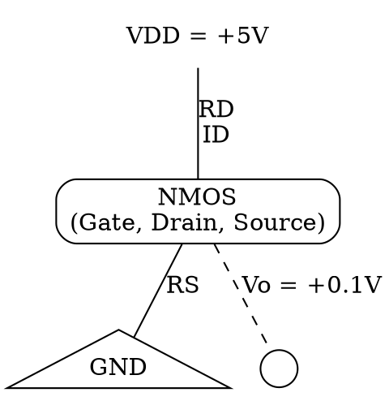
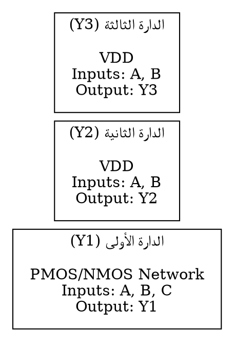
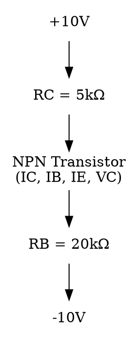
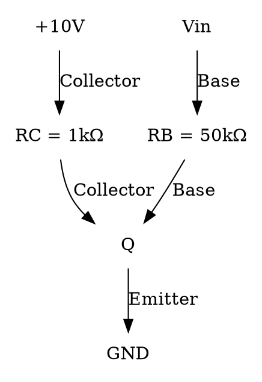
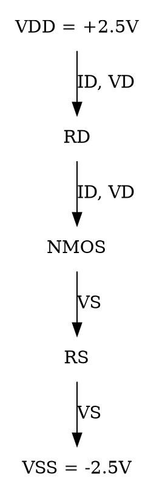
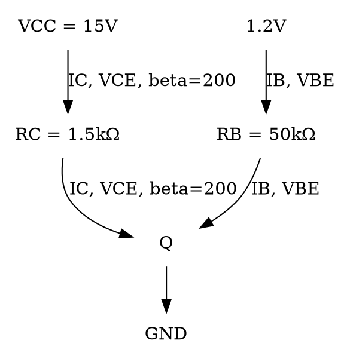
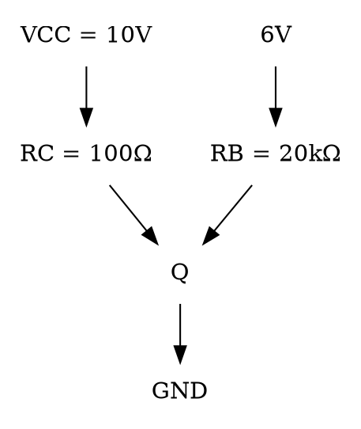
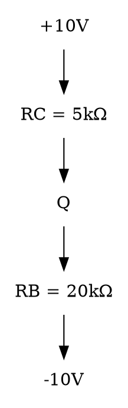
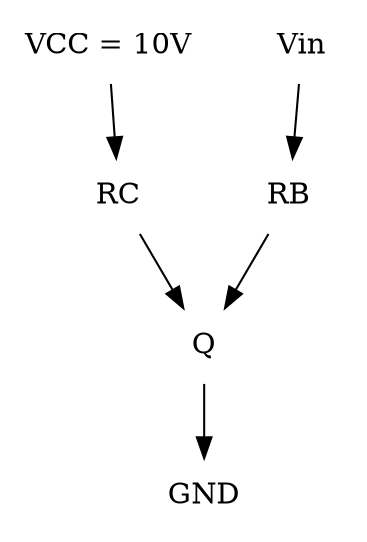
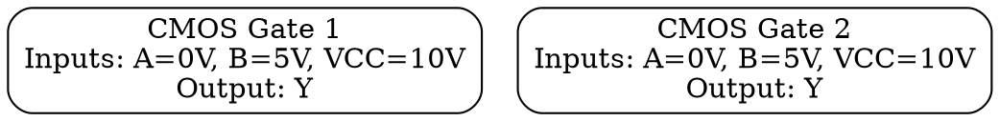

# أسئلة دورات دارات إلكترونية 2 — مستخرجة بصيغة MCQ

## الجزء الثالث: أسئلة اختيار من متعدد (MCQ)

---

# النموذج 1
*(العام الدراسي 2025-2026 - السنة الأولى - الفصل الأول)*

**المصدر:** [نمط 2025-2026 — الفصل الأول]
### السؤال 1–4 (مجموعة أسئلة مستقلة ضمن السؤال الأول — اختر الإجابة الصحيحة؛ ملاحظة: جميع الأسئلة يجب إضافة الخيار d) كل ما سبق خاطئ)

**السؤال 1:** في تشكيلة القاعدة المشتركة يكون الدخل هو:
أ) الباعث
ب) المجمع
ج) القاعدة
**الإجابة الصحيحة:** 
**التعليل:** 

**السؤال 2:** مقاومة الترانزستور MOSFET في حالة القطع:
أ) صغيرة جداً
ب) كبيرة
ج) لانهائية
**الإجابة الصحيحة:** 
**التعليل:** 

**السؤال 3:** الترانزستور BJT هو عنصر ثلاث أقطاب يسمح بـ:
أ) جهد القاعدة بالتحكم بجهد المجمع
ب) تيار القاعدة بالتحكم بتيار المجمع
ج) A و B
**الإجابة الصحيحة:** 
**التعليل:** 

**السؤال 4:** الترانزستور MOSFET هو عنصر ثلاث أقطاب يسمح بـ:
أ) التحكم بتيار المصرف عن طريق تيار البوابة
ب) التحكم بتيار المصرف عن طريق جهد البوابة
ج) A و B
**الإجابة الصحيحة:** 
**التعليل:** 

---

**المصدر:** [نمط 2025-2026 — الفصل الأول]
### السؤال 5–8 (مجموعة أسئلة على نص/جدول مشترك)

السؤال الثاني: لدينا منزل يحوي الأحمال التالية، أشعة الشمس متوفرة لمدة 5 ساعات

| نوع الحمل | العدد | الاستطاعة (واط) | ساعات التشغيل |
| :--- | :---: | :---: | :---: |
| لمبة | 10 | 20 | 10 |
| مروحة | 2 | 50 | 5 |
| براد | 1 | 300 | 5 |

**السؤال 5:** مجموع الحمل الكهربائي:
أ) 4000 Watt
ب) 4000 Watt.h
ج) 3000 Watt.h
**الإجابة الصحيحة:** 
**التعليل:** 

**السؤال 6:** عدد الألواح الشمسية اللازمة (كفاءة 90% من القيمة الاسمية، قدرة W250):
أ) 4
ب) 3
ج) 2
**الإجابة الصحيحة:** 
**التعليل:** 

**السؤال 7:** استطاعة التحويل للمحول inverter (كفاءة تحويل 90% من القيمة الاسمية):
أ) 600 watt
ب) 500 watt
ج) 700 watt
**الإجابة الصحيحة:** 
**التعليل:** 

**السؤال 8:** عدد البطاريات (سعة 100 أمبير ساعي وجهد 12 فولت):
أ) 5
ب) 3
ج) 4
**الإجابة الصحيحة:** 
**التعليل:** 

---

**المصدر:** [نمط 2025-2026 — الفصل الأول]
### السؤال 9–15 (مجموعة أسئلة على دارة مشتركة)

السؤال الثالث: لدينا الدارة التالية، إذا علمت أن $V_t = 1	ext{V}$ و $k'_n(W/L) = 1	ext{ mA/V}^2$

**السؤال 9:** نوع الترانزستور:
أ) NPN
ب) PNP
ج) N-MOSFET
**الإجابة الصحيحة:** 
**التعليل:** 

**السؤال 10:** الترانزستور يعمل في نمط:
أ) المنطقة الخطية
ب) القطع
ج) الإشباع
**الإجابة الصحيحة:** 
**التعليل:** 

**السؤال 11:** قيمة تيار المصرف $I_D$:
أ) 4.48 mA
ب) 0.395 mA
ج) 100 mA
**الإجابة الصحيحة:** 
**التعليل:** 

**السؤال 12:** قيمة المقاومة $r_{DS}$:
أ) 12.4 kΩ
ب) 3.25 kΩ
ج) 253 Ω
**الإجابة الصحيحة:** 
**التعليل:** 

**السؤال 13:** قيمة جهد المنبع $V_S$:
أ) 5 V
ب) 0 V
ج) -0.1 V
**الإجابة الصحيحة:** 
**التعليل:** 

**السؤال 14:** قيمة مقاومة المصرف $R_D$:
أ) 3.25 kΩ
ب) 12.4 kΩ
ج) 253 Ω
**الإجابة الصحيحة:** 
**التعليل:** 

**السؤال 15:** الترانزستور في هذه الدارة يعمل كـ:
أ) مضخم
ب) قاطع
ج) مقاومة متغيرة
**الإجابة الصحيحة:** 
**التعليل:** 

---

**المصدر:** [نمط 2025-2026 — الفصل الأول]
### السؤال 16–27 (مجموعة أسئلة صح/خطأ — أجب بـ a. صح ، b. خطأ)

**السؤال 16:** يمكن نمذجة الترانزستور MOSFET بمنبع فولطية في الخرج $V_{DS}$ متحكم فيه بفولطية الدخل $V_{GS}$.
أ) صح
ب) خطأ
**الإجابة الصحيحة:** 
**التعليل:** 

**السؤال 17:** كلما زادت الحرارة زادت الطاقة الكهربائية من الألواح الشمسية.
أ) صح
ب) خطأ
**الإجابة الصحيحة:** 
**التعليل:** 

**السؤال 18:** وظيفة الشاحن (متأقلم الشحن) الموافقة بين جهد الألواح وتيار البطارية.
أ) صح
ب) خطأ
**الإجابة الصحيحة:** 
**التعليل:** 

**السؤال 19:** الشواحن ذات 3 مراحل أقل كفاءة من شواحن 7 مراحل.
أ) صح
ب) خطأ
**الإجابة الصحيحة:** 
**التعليل:** 

**السؤال 20:** يمكن عمل نظام للطاقة الشمسية لا يحتوي بطارية يعمل في الليل.
أ) صح
ب) خطأ
**الإجابة الصحيحة:** 
**التعليل:** 

**السؤال 21:** قيمة beta تمثل ربح التيار للترانزستور MOSFET.
أ) صح
ب) خطأ
**الإجابة الصحيحة:** 
**التعليل:** 

**السؤال 22:** كلما زاد عمق تفريغ البطارية نقص عدد دورات الشحن والتفريغ.
أ) صح
ب) خطأ
**الإجابة الصحيحة:** 
**التعليل:** 

**السؤال 23:** يمكن استخدام بطارية السيارة في أنظمة الطاقة الشمسية.
أ) صح
ب) خطأ
**الإجابة الصحيحة:** 
**التعليل:** 

**السؤال 24:** يتكون الترانزستور MOSFET من ثلاث مناطق نصف ناقلة هي المنبع والمصرف والبوابة.
أ) صح
ب) خطأ
**الإجابة الصحيحة:** 
**التعليل:** 

**السؤال 25:** ينتج تيار المجمع $I_C$ من تيار ناتج عن حملة الشحنة الأكثرية فقط.
أ) صح
ب) خطأ
**الإجابة الصحيحة:** 
**التعليل:** 

**السؤال 26:** $g_m$ تتناسب عكساً مع جهد القيادة الزائد $V_{OV}$.
أ) صح
ب) خطأ
**الإجابة الصحيحة:** 
**التعليل:** 

**السؤال 27:** دارة تحييز الترانزستور هي العناصر التي تدخل في اختيار نقطة العمل، وهذّه النقطة قد تكون أصلية أو قد تكون غير أمثلية.
أ) صح
ب) خطأ
**الإجابة الصحيحة:** 
**التعليل:** 

---

**المصدر:** [نمط 2025-2026 — الفصل الأول]
### السؤال 28–31 (مجموعة أسئلة على دارة مشتركة)

السؤال الخامس:

**السؤال 28:** الخرج $Y_1$ في الدارة الأولى:
أ) $Y_1 = A + BC$
ب) $Y_1 = A \cdot (B + C)$
ج) $Y_1 = \overline{A + BC}$
**الإجابة الصحيحة:** 
**التعليل:** 

**السؤال 29:** الدارة الأولى هي:
أ) شبكة شد للأعلى
ب) شبكة شد للأسفل
ج) A أو B
**الإجابة الصحيحة:** 
**التعليل:** 

**السؤال 30:** الخرج $Y_2$ في الدارة الثانية:
أ) $Y_2 = A + B$
ب) $Y_2 = \overline{A \cdot B}$
ج) $Y_2 = A \cdot B$
**الإجابة الصحيحة:** 
**التعليل:** 

**السؤال 31:** الخرج $Y_3$ في الدارة الثالثة:
أ) $Y_3 = A + B$
ب) $Y_3 = A \cdot B$
ج) $Y_3 = \overline{A \cdot B}$
**الإجابة الصحيحة:** 
**التعليل:** 

---
---

# النموذج 2
*(العام الدراسي 2022-2023 - السنة الأولى - الفصل الثاني)*

**المصدر:** [نمط 2022-2023 — الفصل الثاني]
### السؤال 1–4 (مجموعة أسئلة مستقلة ضمن السؤال الأول — اختر الإجابة الصحيحة؛ ملاحظة جميع الأسئلة يجب إضافة الخيار d) كل ما سبق خاطئ)

**السؤال 1:** التيار هو:
أ) معدل تغير الجهد مع الزمن
ب) معدل تغير الزمن مع الشحنة
ج) معدل تغير الشحنة مع الزمن
**الإجابة الصحيحة:** 
**التعليل:** 

**السؤال 2:** الجهد هو:
أ) العمل (الطاقة) المطلوب لتحريك شحنة بين نقطتين
ب) العمل المطلوب لتحريك شحنة بين لحظتين زمنيتين
ج) العمل المطلوب لتحريك التيار
**الإجابة الصحيحة:** 
**التعليل:** 

**السؤال 3:** سعة المكثفة هي:
أ) كامل الشحنة المخزنة في المكثفة
ب) الشحنة المخزنة في المكثفة من أجل 1 فولت
ج) الشحنة المخزنة في المكثفة من أجل 1 أمبير
**الإجابة الصحيحة:** 
**التعليل:** 

**السؤال 4:** الاستطاعة هي:
أ) معدل الطاقة (العمل) المصروف لنقل الشحنة بين نقطتين
ب) معدل الطاقة (العمل) المصروفة خلال واحدة الزمن
ج) كامل الطاقة المصروفة
**الإجابة الصحيحة:** 
**التعليل:** 

---

**المصدر:** [نمط 2022-2023 — الفصل الثاني]
### السؤال 5–10 (مجموعة أسئلة على دارة مشتركة)

السؤال الثاني: لدينا الدارة التالية إذا علمت قيمة $eta = 100$ و $V_{BE} = 0.7	ext{V}$

**السؤال 5:** قيمة تيار الباعث $I_E$:
أ) 0.93 mA
ب) 0.465 mA
ج) 0.465 A
**الإجابة الصحيحة:** 
**التعليل:** 

**السؤال 6:** قيمة تيار القاعدة $I_B$:
أ) 18.2 µA
ب) 4.6 µA
ج) 0.46 mA
**الإجابة الصحيحة:** 
**التعليل:** 

**السؤال 7:** تيار المجمع $I_C$:
أ) 0.91 mA
ب) 4.6 µA
ج) 0.46 mA
**الإجابة الصحيحة:** 
**التعليل:** 

**السؤال 8:** قيمة جهد المجمع $V_C$:
أ) 5.45 V
ب) 7.7 V
ج) 7.7 mV
**الإجابة الصحيحة:** 
**التعليل:** 

**السؤال 9:** الترانزستور يعمل في نمط:
أ) القطع
ب) الإشباع
ج) المنطقة الخطية (النمط العادي)
**الإجابة الصحيحة:** 
**التعليل:** 

**السؤال 10:** الترانزستور هو من نوع:
أ) NPN
ب) PNP
ج) NMOS
**الإجابة الصحيحة:** 
**التعليل:** 

---

**المصدر:** [نمط 2022-2023 — الفصل الثاني]
### السؤال 11–14 (مجموعة أسئلة على دارة مشتركة)

السؤال الثالث: لدينا الدارة التالية، إذا علمت أن قيمة $eta = 150$

**السؤال 11:** عندما جهد الدخل قيمته مرتفعة $V_{in} = 5	ext{V}$، الخرج ذو جهد:
أ) مرتفع
ب) منخفض
**الإجابة الصحيحة:** 
**التعليل:** 

**السؤال 12:** عندما جهد الدخل قيمته منخفضة $V_{in} = 0	ext{V}$ ، الخرج ذو جهد:
أ) مرتفع
ب) منخفض
**الإجابة الصحيحة:** 
**التعليل:** 

**السؤال 13:** قيمة تيار القاعدة $I_B$ الأصغري ليعمل الترانزستور في نمط الإشباع هو:
أ) 50 µA
ب) 66.7 µA
ج) 66.7 mA
**الإجابة الصحيحة:** 
**التعليل:** 

**السؤال 14:** القيمة العظمى لمقاومة القاعدة $R_B$ حتى يعمل الترانزستور في نمط الإشباع هي:
أ) 86 kΩ
ب) 86 ohm
ج) 64.5 kΩ
**الإجابة الصحيحة:** 
**التعليل:** 

---

**المصدر:** [نمط 2022-2023 — الفصل الثاني]
### السؤال 15–28 (مجموعة أسئلة صح/خطأ — أجب بـ a. صح ، b. خطأ)

**السؤال 15:** في دارات CMOS نستخدم ترانزستورات من نوع PMOS و من نوع NMOS.
أ) صح
ب) خطأ
**الإجابة الصحيحة:** 
**التعليل:** 

**السؤال 16:** سعة البطارية هي استطاعتها مقدرة بالواط.
أ) صح
ب) خطأ
**الإجابة الصحيحة:** 
**التعليل:** 

**السؤال 17:** الأمبير الساعي Amp.h هي واحدة طاقة (عمل).
أ) صح
ب) خطأ
**الإجابة الصحيحة:** 
**التعليل:** 

**السؤال 18:** ممانعة الدخل للترانزستور MOSFET صغيرة.
أ) صح
ب) خطأ
**الإجابة الصحيحة:** 
**التعليل:** 

**السؤال 19:** ممانعة الدخل للترانزستور BJT كبيرة جداً.
أ) صح
ب) خطأ
**الإجابة الصحيحة:** 
**التعليل:** 

**السؤال 20:** قيمة beta تمثل ربح التيار للترانزستور BJT.
أ) صح
ب) خطأ
**الإجابة الصحيحة:** 
**التعليل:** 

**السؤال 21:** تيار البوابة معدوم في ترانزستور MOSFET.
أ) صح
ب) خطأ
**الإجابة الصحيحة:** 
**التعليل:** 

**السؤال 22:** الواط هو نفسه "جول في الثانية".
أ) صح
ب) خطأ
**الإجابة الصحيحة:** 
**التعليل:** 

**السؤال 23:** ممانعة المكثفة تزداد بازدياد تردد منبع التيار المتناوب.
أ) صح
ب) خطأ
**الإجابة الصحيحة:** 
**التعليل:** 

**السؤال 24:** ممانعة الوشيعة تزداد بازدياد تردد منبع التيار المتناوب.
أ) صح
ب) خطأ
**الإجابة الصحيحة:** 
**التعليل:** 

**السؤال 25:** ممانعة المقاومة تتقاعس بازدياد تردد منبع التيار المتناوب.
أ) صح
ب) خطأ
**الإجابة الصحيحة:** 
**التعليل:** 

**السؤال 26:** المكثفة تكافيء سلك في حالة ربطها بمنع تيار مستمر.
أ) صح
ب) خطأ
**الإجابة الصحيحة:** 
**التعليل:** 

**السؤال 27:** الوشيعة تكافيء سلك في حالة ربطها بمنع تيار مستمر.
أ) صح
ب) خطأ
**الإجابة الصحيحة:** 
**التعليل:** 

**السؤال 28:** في دارة pullup نستخدم ترانزستورات من نوع PMOS.
أ) صح
ب) خطأ
**الإجابة الصحيحة:** 
**التعليل:** 

---

**المصدر:** [نمط 2022-2023 — الفصل الثاني]
### السؤال 29–30 (مجموعة أسئلة على دارة مشتركة)

الأسئلة المتممة (29 و 30):

**السؤال 29:** لدينا الدارة، قيمة الخرج Y هي:
أ) $Y = 	ext{not}(A \cdot B)$
ب) $Y = (A \cdot B)$
ج) $Y = 	ext{not}(A 	ext{ or } B)$
د) كل ما سبق خاطئ
**الإجابة الصحيحة:** 
**التعليل:** 

**السؤال 30:** لدينا الدارة، قيمة الخرج Y هي:
أ) $Y = 	ext{not}(A \cdot B)$
ب) $Y = (A \cdot B)$
ج) $Y = 	ext{not}(A 	ext{ or } B)$
د) كل ما سبق خاطئ
**الإجابة الصحيحة:** 
**التعليل:** 

---
---

# النموذج 3
*(العام الدراسي 2024-2025 - السنة الأولى - الفصل الثاني - النموذج A)*

**المصدر:** [نمط 2024-2025 — الفصل الثاني]
### السؤال 1–4 (مجموعة أسئلة مستقلة ضمن السؤال الأول — اختر الإجابة الصحيحة؛ ملاحظة جميع الأسئلة يجب إضافة الخيار d) كل ما سبق خاطئ)

**السؤال 1:** الترانزستور BJT هو عنصر ثلاث أقطاب يسمح بـ:
أ) التحكم بتيار المجمع عن طريق تيار القاعدة
ب) التحكم بتيار المجمع عن طريق جهد القاعدة
ج) A و B
**الإجابة الصحيحة:** 
**التعليل:** 

**السؤال 2:** الترانزستور MOSFET هو عنصر ثلاث أقطاب يسمح بـ:
أ) التحكم بتيار المصرف عن طريق تيار البوابة
ب) التحكم بتيار المصرف عن طريق جهد البوابة
ج) A و B
**الإجابة الصحيحة:** 
**التعليل:** 

**السؤال 3:** في تشكيلة المجمع المشتركة يكون الدخل هو:
أ) الباعث
ب) المجمع
ج) القاعدة
**الإجابة الصحيحة:** 
**التعليل:** 

**السؤال 4:** مقاومة الترانزستور MOSFET في حالة القطع:
أ) صغيرة جداً
ب) كبيرة
ج) لانهائية
**الإجابة الصحيحة:** 
**التعليل:** 

---

**المصدر:** [نمط 2024-2025 — الفصل الثاني]
### السؤال 5–8 (مجموعة أسئلة على نص/جدول مشترك)

السؤال الثاني: لدينا منزل يحوي الأحمال التالية، أشعة الشمس متوفرة لمدة 5 ساعات

| نوع الحمل | العدد | الاستطاعة (واط) | ساعات التشغيل |
| :--- | :---: | :---: | :---: |
| لمبة | 5 | 20 | 10 |
| مروحة | 2 | 50 | 5 |
| براد | 1 | 300 | 5 |

**السؤال 5:** مجموع الحمل الكهربائي:
أ) 2900 Watt
ب) 2250 Watt.h
ج) 3000 Watt.h
**الإجابة الصحيحة:** 
**التعليل:** 

**السؤال 6:** عدد الألواح الشمسية اللازمة (كفاءة 90% من القيمة الاسمية، قدرة W250):
أ) 2
ب) 3
ج) 1
**الإجابة الصحيحة:** 
**التعليل:** 

**السؤال 7:** استطاعة التحويل للمحول inverter (كفاءة تحويل 90% من القيمة الاسمية):
أ) 600 watt
ب) 500 watt
ج) 200 watt
**الإجابة الصحيحة:** 
**التعليل:** 

**السؤال 8:** عدد البطاريات (سعة 100 أمبير ساعي وجهد 12 فولت):
أ) 2
ب) 3
ج) 4
**الإجابة الصحيحة:** 
**التعليل:** 

---

**المصدر:** [نمط 2024-2025 — الفصل الثاني]
### السؤال 9–14 (مجموعة أسئلة على دارة مشتركة)

السؤال الثالث: لدينا الدارة التالية، إذا علمت أن $\mu_n C_{ox} = 100	ext{ \mu A/V}^2$, $L = 1	ext{ \mu m}$, $W = 32	ext{ \mu m}$
وأن التيار $I_D = 0.4	ext{ mA}$ و أن $V_D = 0.5	ext{ V}$ و $V_t = 0.7	ext{ V}$

**السؤال 9:** نوع الترانزستور:
أ) NPN
ب) PNP
ج) N-MOSFET
**الإجابة الصحيحة:** 
**التعليل:** 

**السؤال 10:** الترانزستور يعمل في نمط:
أ) الإشباع
ب) القطع
ج) المنطقة الخطية (النمط العادي)
**الإجابة الصحيحة:** 
**التعليل:** 

**السؤال 11:** قيمة جهد المنبع $V_S$:
أ) 1.2 V
ب) -1.2 V
ج) 0.7 V
**الإجابة الصحيحة:** 
**التعليل:** 

**السؤال 12:** قيمة مقاومة المنبع $R_S$:
أ) 3.25 kΩ
ب) 20 kΩ
ج) 5 kΩ
**الإجابة الصحيحة:** 
**التعليل:** 

**السؤال 13:** قيمة مقاومة المصرف $R_D$:
أ) 5 kΩ
ب) 3.25 kΩ
ج) 20 kΩ
**الإجابة الصحيحة:** 
**التعليل:** 

**السؤال 14:** الترانزستور في هذه الدارة يعمل كـ:
أ) مقاومة متغيرة
ب) قاطع
ج) مضخم
**الإجابة الصحيحة:** 
**التعليل:** 

---

**المصدر:** [نمط 2024-2025 — الفصل الثاني]
### السؤال 15–26 (مجموعة أسئلة صح/خطأ — أجب بـ a. صح ، b. خطأ)

**السؤال 15:** كلما زاد عمق تفريغ البطارية نقص عدد دورات الشحن والتفريغ.
أ) صح
ب) خطأ
**الإجابة الصحيحة:** 
**التعليل:** 

**السؤال 16:** يمكن استخدام بطارية السيارة في أنظمة الطاقة الشمسية.
أ) صح
ب) خطأ
**الإجابة الصحيحة:** 
**التعليل:** 

**السؤال 17:** يتكون الترانزستور MOSFET من ثلاث مناطق نصف ناقلة هي المنبع والمصرف والبوابة.
أ) صح
ب) خطأ
**الإجابة الصحيحة:** 
**التعليل:** 

**السؤال 18:** ينتج تيار المجمع $I_C$ من تيار ناتج عن حملة الشحنة الأكثرية فقط.
أ) صح
ب) خطأ
**الإجابة الصحيحة:** 
**التعليل:** 

**السؤال 19:** في الترانزستور BJT تشاب منطقة المجمع والباعث بشكل كثيف بينما تشاب القاعدة بشكل خفيف.
أ) صح
ب) خطأ
**الإجابة الصحيحة:** 
**التعليل:** 

**السؤال 20:** دارة تحييز الترانزستور هي العناصر التي تدخل في اختيار نقطة العمل، وهذّه النقطة قد تكون أمثلية أو قد تكون غير أمثلية.
أ) صح
ب) خطأ
**الإجابة الصحيحة:** 
**التعليل:** 

**السؤال 21:** ألواح الطاقة الشمسية متعددة التبلور أعلى كفاءة من ألواح أحادية التبلور.
أ) صح
ب) خطأ
**الإجابة الصحيحة:** 
**التعليل:** 

**السؤال 22:** كلما زادت الحرارة زادت الطاقة الكهربائية من الألواح الشمسية.
أ) صح
ب) خطأ
**الإجابة الصحيحة:** 
**التعليل:** 

**السؤال 23:** وظيفة الشاحن (متأقلم الشحن) الموافقة بين جهد الألواح وتيار البطارية.
أ) صح
ب) خطأ
**الإجابة الصحيحة:** 
**التعليل:** 

**السؤال 24:** الشواحن ذات 3 مراحل أقل كفاءة من شواحن 7 مراحل.
أ) صح
ب) خطأ
**الإجابة الصحيحة:** 
**التعليل:** 

**السؤال 25:** يمكن عمل نظام للطاقة الشمسية لا يحتوي بطارية يعمل في الليل فقط.
أ) صح
ب) خطأ
**الإجابة الصحيحة:** 
**التعليل:** 

**السؤال 26:** قيمة beta تمثل ربح التيار للترانزستور MOSFET.
أ) صح
ب) خطأ
**الإجابة الصحيحة:** 
**التعليل:** 

---

**المصدر:** [نمط 2024-2025 — الفصل الثاني]
### السؤال 27
الخرج $Y_1$ للدورة الأولى:
أ) $Y_1 = (A \cdot B)$
ب) $Y_1 = 	ext{not}(A 	ext{ or } B)$
ج) $Y_1 = 	ext{not}(A \cdot B)$
**الإجابة الصحيحة:** 
**التعليل:** 

**المصدر:** [نمط 2024-2025 — الفصل الثاني]
### السؤال 28
الدارة الثانية، الخرج $Y_2$ هي:
أ) $Y_2 = 	ext{not}(A \cdot B)$
ب) $Y_2 = (A \cdot B)$
ج) $Y_2 = 	ext{not}(A 	ext{ or } B)$
**الإجابة الصحيحة:** 
**التعليل:** 

**المصدر:** [نمط 2024-2025 — الفصل الثاني]
### السؤال 29
الخرج $Y_3$ للدورة الثالثة:
أ) $Y_3 = A \cdot B$
ب) $Y_3 = \overline{A \cdot B}$
ج) $Y_3 = A + B$
**الإجابة الصحيحة:** 
**التعليل:** 

**المصدر:** [نمط 2024-2025 — الفصل الثاني]
### السؤال 30
الخرج $Y_3$ للدارة الثالثة:
أ) $Y_3 = A \cdot B$
ب) $Y_3 = \overline{A \cdot B}$
ج) $Y_3 = A + B$
**الإجابة الصحيحة:** 
**التعليل:** 

---
---

# النموذج 4
*(السنة الأولى - الفصل الثاني - النموذج A / تكملة السؤال السادس — تكملة النموذج 3، السنة غير مذكورة صراحةً في هيدر هذا القسم)*

**المصدر:** [نمط غير محدد — الفصل الثاني (تكملة نموذج 2024-2025)]
### السؤال 31–41 (مجموعة أسئلة على دارة مشتركة)

السؤال السادس (عملي): لدينا الدارة التالية إذا علمت أن الكمون الحراري $V_T = 0.026	ext{ V}$ وكمون إيرلي $V_A = 100	ext{ Volt}$

**السؤال 31:** قيمة تيار الإشباع للمجمع $I_{C,	ext{sat}}$ بفرض الجهد بين المجمع والباعث عند الإشباع $V_{CE} = 0.2	ext{ Volt}$:
أ) 4.48 mA
ب) 10 mA
ج) 100 mA
**الإجابة الصحيحة:** 
**التعليل:** 

**السؤال 32:** قيمة جهد المجمع عند القطع $V_{C0}$:
أ) 0 V
ب) 15 V
ج) -15 V
**الإجابة الصحيحة:** 
**التعليل:** 

**السؤال 33:** قيمة تيار القاعدة $I_B$:
أ) 0.01 mA
ب) 10 mA
ج) 100 mA
**الإجابة الصحيحة:** 
**التعليل:** 

**السؤال 34:** قيمة تيار المجمع $I_C$:
أ) 2000 µA
ب) 10 mA
ج) 200 mA
**الإجابة الصحيحة:** 
**التعليل:** 

**السؤال 35:** الترانزستور يعمل في نمط:
أ) المنطقة الخطية (النمط العادي)
ب) القطع
ج) الإشباع
**الإجابة الصحيحة:** 
**التعليل:** 

**السؤال 36:** قيمة فرق الجهد $V_{CE}$:
أ) 7 V
ب) 15 V
ج) 3 V
**الإجابة الصحيحة:** 
**التعليل:** 

**السؤال 37:** قيمة فرق الجهد $V_{CE}$ عند نقطة العمل المثالية:
أ) 3 V
ب) 7 V
ج) 7.5 V
**الإجابة الصحيحة:** 
**التعليل:** 

**السؤال 38:** قيمة مقاومة الدخل للترانزستور:
أ) 2.6 kΩ
ب) 26 kΩ
ج) 3.25 kΩ
**الإجابة الصحيحة:** 
**التعليل:** 

**السؤال 39:** قيمة مقاومة الخرج للترانزستور:
أ) 50 kΩ
ب) 2.6 kΩ
ج) 47.84 kΩ
**الإجابة الصحيحة:** 
**التعليل:** 

**السؤال 40:** الموصلية المنقولة $g_m$:
أ) 38.5 mA/V
ب) 76.92 simens
ج) 76.92 mA/V
**الإجابة الصحيحة:** 
**التعليل:** 

**السؤال 41:** ربح الجهد يساوي $A_v$:
أ) -5.7
ب) -11.4
ج) -5.7
**الإجابة الصحيحة:** 
**التعليل:** 

---
---

# النموذج 5
*(العام الدراسي 2023-2024 - السنة الأولى - الفصل الثاني - النموذج A)*

**المصدر:** [نمط 2023-2024 — الفصل الثاني]
### السؤال 1–4 (مجموعة أسئلة مستقلة ضمن السؤال الأول — اختر الإجابة الصحيحة؛ ملاحظة جميع الأسئلة يجب إضافة الخيار d) كل ما سبق خاطئ)

**السؤال 1:** الترانزستور BJT هو عنصر ثلاث أقطاب يسمح بـ:
أ) التحكم بتيار المجمع عن طريق تيار القاعدة
ب) التحكم بتيار المجمع عن طريق جهد القاعدة
ج) A و B
**الإجابة الصحيحة:** 
**التعليل:** 

**السؤال 2:** الترانزستور MOSFET هو عنصر ثلاث أقطاب يسمح بـ:
أ) التحكم بتيار المصرف عن طريق جهد البوابة
ب) التحكم بتيار المصرف عن طريق تيار البوابة
ج) A و B
**الإجابة الصحيحة:** 
**التعليل:** 

**السؤال 3:** في تشكيلة المجمع المشتركة يكون الدخل هو:
أ) الباعث
ب) المجمع
ج) القاعدة
**الإجابة الصحيحة:** 
**التعليل:** 

**السؤال 4:** ترانزستور موسفت بالإقفار D-MOSFET يعمل في حالة:
أ) جهد بوابة موجب أعلى من عتبة
ب) جهد بوابة سلبي أقل من عتبة
ج) جهد بوابة معدوم
**الإجابة الصحيحة:** 
**التعليل:** 

---

**المصدر:** [نمط 2023-2024 — الفصل الثاني]
### السؤال 5–8 (مجموعة أسئلة على نص/جدول مشترك)

السؤال الثاني: لدينا منزل يحوي الأحمال التالية، أشعة الشمس متوفرة لمدة 6 ساعات

| نوع الحمل | العدد | الاستطاعة (واط) | ساعات التشغيل |
| :--- | :---: | :---: | :---: |
| لمبة | 5 | 20 | 10 |
| مروحة | 2 | 50 | 5 |
| براد | 1 | 300 | 5 |

**السؤال 5:** مجموع الحمل الكهربائي:
أ) 2900 Watt
ب) 2250 Watt.h
ج) 3000 Watt.h
**الإجابة الصحيحة:** 
**التعليل:** 

**السؤال 6:** عدد الألواح الشمسية اللازمة (كفاءة 90% من القيمة الاسمية):
أ) 2
ب) 3
ج) 1
**الإجابة الصحيحة:** 
**التعليل:** 

**السؤال 7:** استطاعة التحويل للمحول Inverter:
أ) 350 watt
ب) 360 watt
ج) 1000 watt
**الإجابة الصحيحة:** 
**التعليل:** 

**السؤال 8:** عدد البطاريات (سعة 200 أمبير ساعي وجهد 12 فولت):
أ) 1
ب) 2
ج) 3
**الإجابة الصحيحة:** 
**التعليل:** 

---

**المصدر:** [نمط 2023-2024 — الفصل الثاني]
### السؤال 9–15 (مجموعة أسئلة على دارة مشتركة)

السؤال الثالث: لدينا الدارة التالية، إذا علمت أن قيمة $eta = 200$

**السؤال 9:** قيمة تيار القاعدة:
أ) 18.2 µA
ب) 265 µA
ج) 0.00265 mA
**الإجابة الصحيحة:** 
**التعليل:** 

**السؤال 10:** قيمة تيار المجمع:
أ) 0.053 mA
ب) 0.053 A
ج) 0.0053 A
**الإجابة الصحيحة:** 
**التعليل:** 

**السؤال 11:** فرق الجهد $V_{CE}$:
أ) 4.7 V
ب) 5.3 mV
ج) 5.3 V
**الإجابة الصحيحة:** 
**التعليل:** 

**السؤال 12:** الترانزستور يعمل في نمط:
أ) الإشباع
ب) القطع
ج) المنطقة الخطية (النمط العادي)
**الإجابة الصحيحة:** 
**التعليل:** 

**السؤال 13:** القيمة الصغرى لمقاومة القاعدة $R_B$ للعمل في المنطقة الخطية:
أ) 10.6 kΩ
ب) 20 kΩ
ج) 5 kΩ
**الإجابة الصحيحة:** 
**التعليل:** 

**السؤال 14:** القيمة العظمى لتيار المجمع:
أ) 5.3 mA
ب) 0.01 A
ج) 0.1 A
**الإجابة الصحيحة:** 
**التعليل:** 

**السؤال 15:** الترانزستور في هذه الدارة يعمل كـ:
أ) مضخم
ب) قاطع
ج) مقاومة متغيرة
**الإجابة الصحيحة:** 
**التعليل:** 

---

**المصدر:** [نمط 2023-2024 — الفصل الثاني]
### السؤال 16–26 (مجموعة أسئلة صح/خطأ — أجب بـ a. صح ، b. خطأ)

**السؤال 16:** يتكون الترانزستور BJT من ثلاث مناطق نصف ناقلة هي الباعث والمجمع والقاعدة.
أ) صح
ب) خطأ
**الإجابة الصحيحة:** 
**التعليل:** 

**السؤال 17:** يتكون الترانزستور MOSFET من ثلاث مناطق نصف ناقلة هي المنبع والمصرف والبوابة.
أ) صح
ب) خطأ
**الإجابة الصحيحة:** 
**التعليل:** 

**السؤال 18:** ينتج تيار المجمع $I_C$ من تيار ناتج عن حملة الشحنة الأكثرية فقط.
أ) صح
ب) خطأ
**الإجابة الصحيحة:** 
**التعليل:** 

**السؤال 19:** في الترانزستور BJT تشاب منطقة المجمع والباعث بشكل كثيف بينما تشاب القاعدة بشكل خفيف.
أ) صح
ب) خطأ
**الإجابة الصحيحة:** 
**التعليل:** 

**السؤال 20:** دارة تحييز الترانزستور هي العناصر التي تدخل في اختيار نقطة العمل.
أ) صح
ب) خطأ
**الإجابة الصحيحة:** 
**التعليل:** 

**السؤال 21:** ألواح الطاقة الشمسية متعددة التبلور أقل كفاءة من أحادية التبلور.
أ) صح
ب) خطأ
**الإجابة الصحيحة:** 
**التعليل:** 

**السؤال 22:** كلما زادت الحرارة نقصت الطاقة الكهربائية من الألواح الشمسية.
أ) صح
ب) خطأ
**الإجابة الصحيحة:** 
**التعليل:** 

**السؤال 23:** وظيفة الشاحن (متأقلم الشحن) الموافقة بين جهد الألواح وجهد البطارية.
أ) صح
ب) خطأ
**الإجابة الصحيحة:** 
**التعليل:** 

**السؤال 24:** الشواحن ذات 3 مراحل أقل كفاءة من شواحن 7 مراحل.
أ) صح
ب) خطأ
**الإجابة الصحيحة:** 
**التعليل:** 

**السؤال 25:** يمكن عمل نظام للطاقة الشمسية لا يحتوي بطارية يعمل في الليل فقط.
أ) صح
ب) خطأ
**الإجابة الصحيحة:** 
**التعليل:** 

**السؤال 26:** قيمة beta تمثل ربح التيار للترانزستور BJT.
أ) صح
ب) خطأ
**الإجابة الصحيحة:** 
**التعليل:** 

---

**المصدر:** [نمط 2023-2024 — الفصل الثاني]
### السؤال 27–30 (مجموعة أسئلة على دارة مشتركة)

الأسئلة المتممة (27 - 30):

**السؤال 27:** لدينا الدارة، قيمة الخرج Y هي:
أ) $Y = (A \cdot B)$
ب) $Y = 	ext{not}(A 	ext{ or } B)$
ج) $Y = 	ext{not}(A \cdot B)$
**الإجابة الصحيحة:** 
**التعليل:** 

**السؤال 28:** لدينا الدارة، قيمة الخرج Y هي:
أ) $Y = 	ext{not}(A \cdot B)$
ب) $Y = (A \cdot B)$
ج) $Y = 	ext{not}(A 	ext{ or } B)$
**الإجابة الصحيحة:** 
**التعليل:** 

**السؤال 29:** في النمط المشبع يكون فرق الجهد بين المجمع والباعث:
أ) معتدل يساوي 0.7 فولت
ب) صغير أقل من 0.2 فولت
ج) كبير
**الإجابة الصحيحة:** 
**التعليل:** 

**السؤال 30:** توصيل الألواح على التسلسل يعطي استطاعة .......... للاستطاعة في حال تم توصيلها على التفرع:
أ) أعلى
ب) مساوية
ج) أقل
**الإجابة الصحيحة:** 
**التعليل:** 

---
---

# النموذج 6
*(العام الدراسي 2022-2023 - السنة الأولى - الفصل الثاني - النموذج B)*

**المصدر:** [نمط 2022-2023 — الفصل الثاني]
### السؤال 1–4 (مجموعة أسئلة مستقلة ضمن السؤال الأول — اختر الإجابة الصحيحة؛ ملاحظة جميع الأسئلة يجب إضافة الخيار d) كل ما سبق خاطئ)

**السؤال 1:** التيار هو:
أ) معدل تغير الشحنة مع الزمن
ب) معدل تغير الزمن مع الشحنة
ج) معدل تغير الشحنة مع الفولطية
**الإجابة الصحيحة:** 
**التعليل:** 

**السؤال 2:** الجهد هو:
أ) العمل (الطاقة) المطلوب لتحريك شحنة بين نقطتين
ب) العمل المطلوب لتحريك شحنة بين لحظتين زمنيتين
ج) العمل المطلوب لتحريك التيار
**الإجابة الصحيحة:** 
**التعليل:** 

**السؤال 3:** سعة المكثفة هي:
أ) كامل الشحنة المخزنة في المكثفة
ب) الشحنة المخزنة في المكثفة من أجل 1 فولت
ج) الشحنة المخزنة في المكثفة من أجل 1 أمبير
**الإجابة الصحيحة:** 
**التعليل:** 

**السؤال 4:** الاستطاعة هي:
أ) معدل الطاقة (العمل) المصروف لنقل الشحنة بين نقطتين
ب) معدل الطاقة (العمل) المصروفة خلال واحدة الزمن
ج) كامل الطاقة المصروفة
**الإجابة الصحيحة:** 
**التعليل:** 

---

**المصدر:** [نمط 2022-2023 — الفصل الثاني]
### السؤال 5–10 (مجموعة أسئلة على دارة مشتركة)

السؤال الثاني: لدينا الدارة التالية إذا علمت أن قيمة $eta = 200$ و $V_E = 0.7	ext{V}$

**السؤال 5:** قيمة تيار الباعث $I_E$:
أ) 0.93 mA
ب) 0.465 mA
ج) 0.465 A
**الإجابة الصحيحة:** 
**التعليل:** 

**السؤال 6:** قيمة تيار القاعدة $I_B$:
أ) 18.2 µA
ب) 4.6 µA
ج) 0.46 mA
**الإجابة الصحيحة:** 
**التعليل:** 

**السؤال 7:** تيار المجمع $I_C$:
أ) 0.91 mA
ب) 4.6 µA
ج) 0.46 mA
**الإجابة الصحيحة:** 
**التعليل:** 

**السؤال 8:** قيمة جهد المجمع $V_C$:
أ) 5.45 V
ب) 7.7 V
ج) 7.7 mV
**الإجابة الصحيحة:** 
**التعليل:** 

**السؤال 9:** الترانزستور يعمل في نمط:
أ) القطع
ب) الإشباع
ج) المنطقة الخطية (النمط العادي)
**الإجابة الصحيحة:** 
**التعليل:** 

**السؤال 10:** الترانزستور هو من نوع:
أ) NPN
ب) PNP
ج) NMOS
**الإجابة الصحيحة:** 
**التعليل:** 

---

**المصدر:** [نمط 2022-2023 — الفصل الثاني]
### السؤال 11–14 (مجموعة أسئلة على دارة مشتركة)

السؤال الثالث: لدينا الدارة التالية، إذا علمت أن قيمة $eta = 100$، وأن تيار المجمع عند الإشباع قيمته $I_{C,	ext{sat}} = 20	ext{ mA}$

**السؤال 11:** عندما جهد الدخل قيمته مرتفعة $V_i = 5	ext{V}$، فإن فرق الجهد بين المجمع والباعث $V_{CE}$:
أ) 0 فولت
ب) 5 فولت
ج) 10 فولت
**الإجابة الصحيحة:** 
**التعليل:** 

**السؤال 12:** عندما جهد الدخل قيمته منخفضة $V_i = 0	ext{V}$ ، فإن فرق الجهد بين المجمع والباعث $V_{CE}$:
أ) 0 فولت
ب) 5 فولت
ج) 10 فولت
**الإجابة الصحيحة:** 
**التعليل:** 

**السؤال 13:** قيمة مقاومة المجمع $R_C$:
أ) 1K ohm
ب) 500 ohm
ج) 100 ohm
**الإجابة الصحيحة:** 
**التعليل:** 

**السؤال 14:** قيمة مقاومة القاعدة $R_B$ حتى يعمل الترانزستور بحيث يكون تيار القاعدة $I_B = 600	ext{ \mu A}$:
أ) 86 K Ohm
ب) 155 K ohm
ج) 15.5 K Ohm
**الإجابة الصحيحة:** 
**التعليل:** 

---

**المصدر:** [نمط 2022-2023 — الفصل الثاني]
### السؤال 15–28 (مجموعة أسئلة صح/خطأ — أجب بـ a. صح ، b. خطأ)

**السؤال 15:** في دارات CMOS نستخدم ترانزستورات من نوع PMOS فقط.
أ) صح
ب) خطأ
**الإجابة الصحيحة:** 
**التعليل:** 

**السؤال 16:** سعة البطارية هي استطاعتها مقدرة بالجول.
أ) صح
ب) خطأ
**الإجابة الصحيحة:** 
**التعليل:** 

**السؤال 17:** الأمبير الساعي Amp.h هي واحدة استطاعة.
أ) صح
ب) خطأ
**الإجابة الصحيحة:** 
**التعليل:** 

**السؤال 18:** ممانعة الدخل للترانزستور MOSFET صغيرة.
أ) صح
ب) خطأ
**الإجابة الصحيحة:** 
**التعليل:** 

**السؤال 19:** ممانعة الدخل للترانزستور BJT كبيرة جداً.
أ) صح
ب) خطأ
**الإجابة الصحيحة:** 
**التعليل:** 

**السؤال 20:** قيمة beta تمثل ربح الفولطية للترانزستور BJT.
أ) صح
ب) خطأ
**الإجابة الصحيحة:** 
**التعليل:** 

**السؤال 21:** تيار البوابة معدوم في ترانزستور BJT.
أ) صح
ب) خطأ
**الإجابة الصحيحة:** 
**التعليل:** 

**السؤال 22:** الواط هو نفسه "جول في الثانية".
أ) صح
ب) خطأ
**الإجابة الصحيحة:** 
**التعليل:** 

**السؤال 23:** ممانعة المكثفة تتناقص بازدياد تردد منبع التيار المتناوب.
أ) صح
ب) خطأ
**الإجابة الصحيحة:** 
**التعليل:** 

**السؤال 24:** ممانعة الوشيعة تتناقص بازدياد تردد منبع التيار المتناوب.
أ) صح
ب) خطأ
**الإجابة الصحيحة:** 
**التعليل:** 

**السؤال 25:** ممانعة المقاومة تتناقص بازدياد تردد منبع التيار المتناوب.
أ) صح
ب) خطأ
**الإجابة الصحيحة:** 
**التعليل:** 

**السؤال 26:** المكثفة تكافيء سلك في حالة ربطها بمنع تيار مستمر.
أ) صح
ب) خطأ
**الإجابة الصحيحة:** 
**التعليل:** 

**السؤال 27:** الوشيعة تكافيء سلك في حالة ربطها بمنع تيار مستمر.
أ) صح
ب) خطأ
**الإجابة الصحيحة:** 
**التعليل:** 

**السؤال 28:** في دارة pulldown نستخدم ترانزستورات من نوع PMOS.
أ) صح
ب) خطأ
**الإجابة الصحيحة:** 
**التعليل:** 

---

**المصدر:** [نمط 2022-2023 — الفصل الثاني]
### السؤال 29–30 (مجموعة أسئلة على دارة مشتركة)

الأسئلة المتممة (29 و 30):

**السؤال 29:** لدينا الدارة، إذا كان الدخل $A = 0	ext{V}$ و $B = 5	ext{V}$ فإن قيمة الخرج Y هي:
أ) 0 فولت
ب) 5 فولت
ج) 10 فولت
**الإجابة الصحيحة:** 
**التعليل:** 

**السؤال 30:** لدينا الدارة، إذا كان الدخل $A = 0	ext{V}$ و $B = 5	ext{V}$ فإن قيمة الخرج Y هي:
أ) 0 فولت
ب) 5 فولت
ج) 10 فولت
**الإجابة الصحيحة:** 
**التعليل:** 
