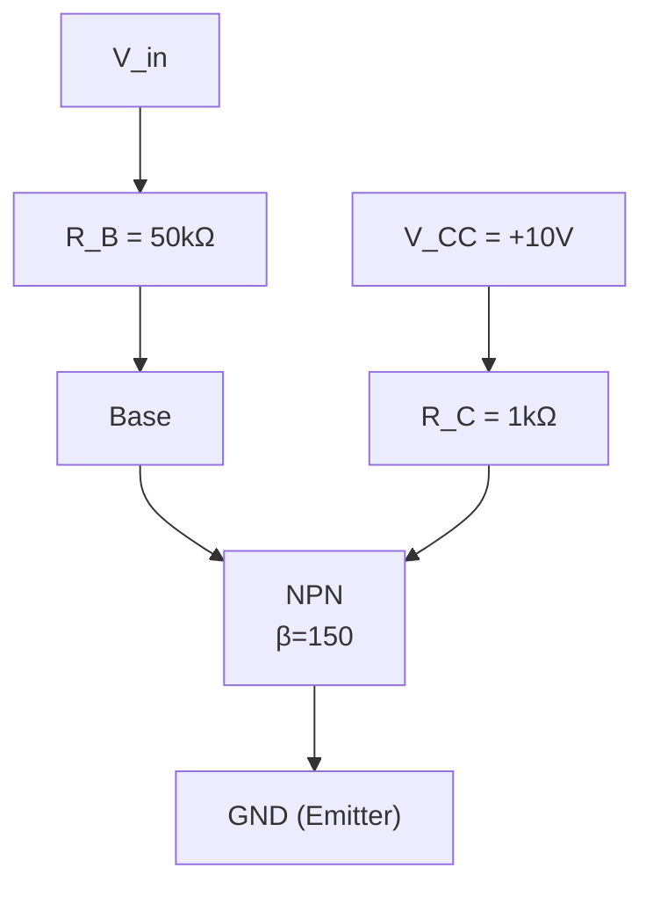
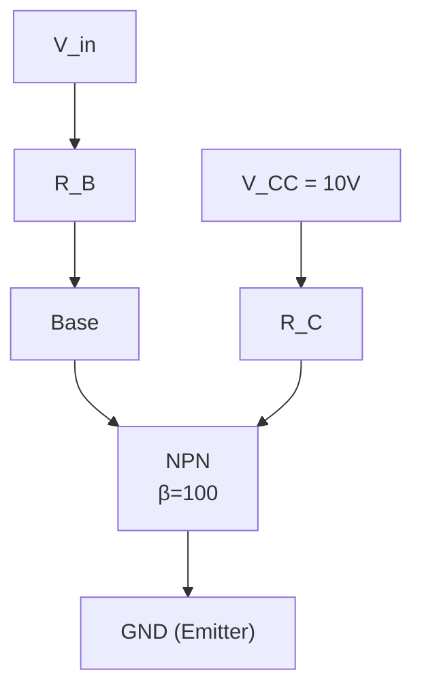
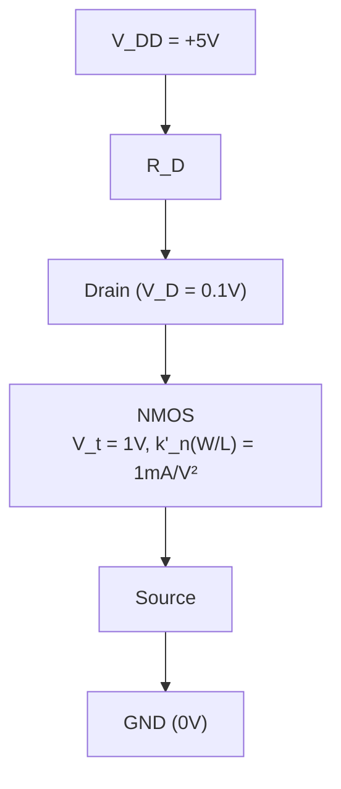
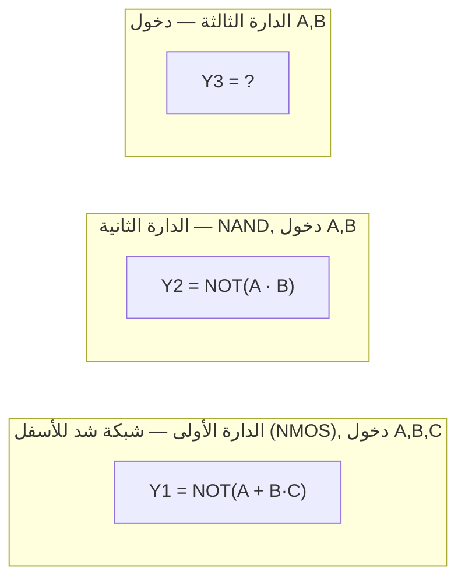
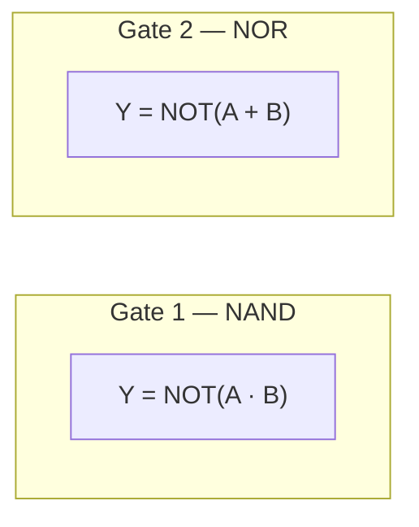

# أسئلة دورات دارات إلكترونية 2 — مستخرجة بصيغة MCQ ومجابة بالكامل


## الجزء الثالث: أسئلة اختيار من متعدد (MCQ)


---


## المحاضرة 1 (نظري) — Bipolar Junction Transistor BJT (الترانزستور ثنائي القطبية)


**المصدر:** [نمط 2025-2026 — الفصل الأول]
### السؤال 1 (سهل)

في تشكيلة القاعدة المشتركة يكون الدخل هو:

أ) الباعث
ب) المجمع
ج) القاعدة
د) كل ما سبق خاطئ
**الإجابة الصحيحة: أ**
**التعليل:**
في تشكيلة `Common Base (CB)` تكون **القاعدة** هي القطب المشترك بين الدخل والخرج، وبحسب القاعدة الذهبية التي تحكم كل التشكيلات الثلاث: الدخل يكون دائماً على القاعدة `B` **إلا إذا كانت هي نفسها القطب المشترك** — وفي هذه الحالة ينتقل الدخل إلى القطب المتبقي المتاح وهو **الباعث**، ويبقى الخرج على المجمع كالعادة.

ب) خاطئ لأن المجمع هو الخرج في هذه التشكيلة (كما في `CE` أيضاً)، وليس الدخل.
ج) خاطئ لأن القاعدة هنا هي القطب **المشترك** نفسه (غير الدخل وغير الخرج)، وهذا ما يميز `CB` عن `CE` (حيث القاعدة تكون هي الدخل).

هذا السؤال يفحص قاعدة تسمية التشكيلات الثلاث دفعة واحدة: `CE` (باعث مشترك، الأشهر) دخلها القاعدة وخرجها المجمع، `CC` (مجمع مشترك) دخلها القاعدة وخرجها الباعث، و`CB` (قاعدة مشتركة) دخلها الباعث وخرجها المجمع. حفظ الجدول مباشرة عرضة للخلط، لكن تذكّر "القطب المشترك يخرج من دائرة الدخل/الخرج" يحل كل الحالات تلقائياً.

#### تذكرة:
> من المحاضرة 1 §9: التشكيلة الثلاثية عبارة عن نفس الترانزستور بثلاث "طرق ربط" مختلفة — احكيها لحالك: أي قطب صار مشترك، هو نفسه اللي بيطلع برا حسابات الدخل/الخرج.
> فـ `CB` يعني "القاعدة مشتركة"، فبيضلّ عندك الباعث والمجمع فقط يتقاسموا الدخل والخرج — والقاعدة الدخل تصير على الباعث والخرج ثابت على المجمع دايماً (إلا لو المجمع هو المشترك).

**المصدر:** [نمط 2025-2026 — الفصل الأول]
### السؤال 2 (سهل)

الترانزستور BJT هو عنصر ثلاث أقطاب يسمح بـ:

أ) جهد القاعدة بالتحكم بجهد المجمع
ب) تيار القاعدة بالتحكم بتيار المجمع
ج) A و B
د) كل ما سبق خاطئ
**الإجابة الصحيحة: ب**
**التعليل:**
جوهر عمل `BJT` هو أنه عنصر **متحكَّم بالتيار**: تيار قاعدة صغير `I_B` يتحكم بتيار مجمع أكبر بكثير `I_C = β·I_B`، وهذه العلاقة (`β`) هي أساس فكرة "التضخيم" في الترانزستور ثنائي القطبية بالكامل.

أ) خاطئ لأن التحكم بالجهد مباشرة هو توصيف أقرب لـ`MOSFET` (حيث `V_GS` يتحكم بـ`I_D`)، وليس `BJT`.
ج) خاطئ تبعاً لخطأ الخيار أ.

هذا السؤال يقارن ضمناً بين `BJT` (متحكَّم بالتيار) و`MOSFET` (متحكَّم بالجهد، كما في السؤال التالي مباشرة) — وهذا الفرق الجوهري بينهما هو أول ما يُطلب تمييزه في أي مقارنة بين العنصرين.

**المصدر:** [نمط 2025-2026 — الفصل الأول]
### السؤال 3 (صعب)

ينتج تيار المجمع $I_C$ من تيار ناتج عن حملة الشحنة الأكثرية فقط.

أ) صح
ب) خطأ
**الإجابة الصحيحة: ب**
**التعليل:**
تيار المجمع في `BJT` ينتج أساساً من حملة شحنة **أقلية** (`minority carriers`) تُحقَن من الباعث عبر القاعدة: في `NPN` مثلاً، الإلكترونات المحقونة من الباعث تصبح حملة أقلية داخل القاعدة (من النوع `p`)، وتنتشر عبرها بالانتشار (`diffusion`) لتصل إلى وصلة المجمع المنحازة عكسياً وتُجمَع كتيار مجمع — هذا الانتشار عبر القاعدة كحملة أقلية هو جوهر "الأثر الترانزستوري" بالكامل.

*(هذا التمييز بين حملة الأقلية والأكثرية جزء من فيزياء أشباه الناقلات العامة ولم يُفصَّل رقمياً بهذا المصطلح في نص المحاضرة، لكنه أساس فيزيائي معروف يفسّر لماذا يعمل الترانزستور أصلاً كعنصر تضخيم.)*

القاعدة تُصنَّع رقيقة جداً وخفيفة التطعيم لسبب دقيق: كي تصل أغلب حملة الأقلية المحقونة إلى المجمع قبل أن "تعاد تركيبها" (`recombination`) في القاعدة — وهذا يفسر لماذا تُطعَّم منطقتا الباعث والمجمع بشكل كثيف بينما تُطعَّم القاعدة بشكل خفيف جداً.

**المصدر:** [نمط 2022-2023 — الفصل الثاني]
### السؤال 4 (متوسط)

ممانعة الدخل للترانزستور BJT كبيرة جداً.

أ) صح
ب) خطأ
**الإجابة الصحيحة: ب**
**التعليل:**
ممانعة دخل `BJT` هي `r_π`، من رتبة `1kΩ` تقريباً (تعتمد على `β` و`I_C`) — قيمة معتدلة، لا "كبيرة جداً" مقارنة بممانعة دخل `MOSFET` (رتبة `10¹²Ω`، لانهائية عملياً). هذا السؤال يفحص بالضبط المقارنة العكسية للسؤال السابق.

الفرق الرتبي الهائل بين `r_π` (`kΩ`) وممانعة بوابة `MOSFET` (`TΩ` تقريباً) هو أحد أهم أسباب تفوق `MOSFET` في دارات الدخل الحساس (كمضخمات القياس ذات معاوقة دخل عالية جداً).

**المصدر:** [نمط 2022-2023 — الفصل الثاني]
### السؤال 5 (سهل)

قيمة beta تمثل ربح التيار للترانزستور BJT.

أ) صح
ب) خطأ
**الإجابة الصحيحة: أ**
**التعليل:**
`β = I_C/I_B` بالتعريف المباشر — نسبة تيار المجمع (الخرج) إلى تيار القاعدة (الدخل)، وهذا هو تعريف "ربح التيار" حرفياً.

هذا المعامل هو نفسه المستخدم في كل حسابات هذا الفصل (`I_C=β·I_B`) وهو ما يميز `BJT` كعنصر "متحكَّم بالتيار" بامتياز.

**المصدر:** [نمط 2024-2025 — الفصل الثاني]
### السؤال 6 (سهل)

الترانزستور BJT هو عنصر ثلاث أقطاب يسمح بـ:

أ) التحكم بتيار المجمع عن طريق تيار القاعدة
ب) التحكم بتيار المجمع عن طريق جهد القاعدة
ج) A و B
د) كل ما سبق خاطئ
**الإجابة الصحيحة: أ**
**التعليل:**
`BJT` عنصر متحكَّم بالتيار: `I_C = β·I_B`، أي أن تيار قاعدة صغير يتحكم بتيار مجمع أكبر بكثير — هذا جوهر "الأثر الترانزستوري" الذي تُبنى عليه كل معادلات الفصل.

ب) خاطئ لأن التحكم المباشر بالجهد يصف `MOSFET` لا `BJT`.
ج) خاطئ تبعاً لخطأ الخيار ب.

قارن دوماً مع السؤال التالي مباشرة عن `MOSFET`: هذا التقابل (`BJT` بالتيار، `MOSFET` بالجهد) هو أول فرق جوهري يُطلب حفظه وتمييزه بين العنصرين.

**المصدر:** [نمط 2024-2025 — الفصل الثاني]
### السؤال 7 (متوسط)

في تشكيلة المجمع المشتركة يكون الدخل هو:

أ) الباعث
ب) المجمع
ج) القاعدة
د) كل ما سبق خاطئ
**الإجابة الصحيحة: ج**
**التعليل:**
في `Common Collector (CC)` يكون المجمع هو القطب المشترك، فينتقل الخرج إليه غير مباشرة — بحسب القاعدة الذهبية "الدخل على القاعدة `B` ما لم تكن هي المشتركة"، وبما أن القاعدة هنا **ليست** المشتركة، يبقى الدخل عليها كالعادة، والخرج ينتقل إلى الباعث (القطب المتبقي).

أ) خاطئ لأن الباعث هو **الخرج** في `CC` (لا الدخل) — وهذا ما يجعل `CC` مفيدة كـ`buffer` (خرج منخفض المعاوقة عند الباعث).
ب) خاطئ لأن المجمع هو القطب **المشترك** نفسه، لا الدخل ولا الخرج.

هذا يكمّل صورة التشكيلات الثلاث: `CB` (دخل=باعث)، `CE` (دخل=قاعدة، خرج=مجمع)، `CC` (دخل=قاعدة، خرج=باعث) — القاعدة تبقى الدخل في تشكيلتين من الثلاث، وهذا سبب شيوع اعتبارها "الدخل الافتراضي" لـ`BJT`.

**المصدر:** [نمط 2024-2025 — الفصل الثاني]
### السؤال 8 (صعب)

ينتج تيار المجمع $I_C$ من تيار ناتج عن حملة الشحنة الأكثرية فقط.

أ) صح
ب) خطأ
**الإجابة الصحيحة: ب**
**التعليل:**
تيار المجمع ينتج أساساً من حملة **أقلية** (`minority carriers`) محقونة من الباعث إلى القاعدة، تنتشر عبرها لتُجمَع عند المجمع — هذا الانتشار كحملة أقلية عبر القاعدة هو جوهر الأثر الترانزستوري. *(تمييز الأقلية/الأكثرية أساس فيزيائي عام لم يُفصَّل بهذا المصطلح تحديداً في نص المحاضرة.)*

**المصدر:** [نمط 2024-2025 — الفصل الثاني]
### السؤال 9 (متوسط)

في الترانزستور BJT تشاب منطقة المجمع والباعث بشكل كثيف بينما تشاب القاعدة بشكل خفيف.

أ) صح
ب) خطأ
**الإجابة الصحيحة: أ**
**التعليل:**
هذا وصف قياسي لبنية `BJT`: الباعث (وبدرجة أقل المجمع) يُشاب بتركيز أعلى بكثير من القاعدة، والقاعدة تُصنَّع خفيفة التطعيم ورقيقة جداً كي تصل أغلب حملة الأقلية المحقونة إلى المجمع قبل أن تُعاد تركيبها فيها. *(تفصيل فيزيائي عام مكمّل لفكرة الأثر الترانزستوري المشروحة في المحاضرة.)*

**المصدر:** [نمط 2023-2024 — الفصل الثاني]
### السؤال 10 (سهل)

الترانزستور BJT هو عنصر ثلاث أقطاب يسمح بـ:

أ) التحكم بتيار المجمع عن طريق تيار القاعدة
ب) التحكم بتيار المجمع عن طريق جهد القاعدة
ج) A و B
د) كل ما سبق خاطئ
**الإجابة الصحيحة: أ**
**التعليل:**
`BJT` متحكَّم بالتيار: `I_C=β·I_B`. تيار قاعدة صغير يتحكم بتيار مجمع أكبر بكثير، وهذا أساس التضخيم في `BJT` بالكامل.

ب) خاطئ لأن التحكم بالجهد المباشر يصف `MOSFET` (السؤال التالي)، لا `BJT`.
ج) خاطئ تبعاً لخطأ ب.

**المصدر:** [نمط 2023-2024 — الفصل الثاني]
### السؤال 11 (متوسط)

في تشكيلة المجمع المشتركة يكون الدخل هو:

أ) الباعث
ب) المجمع
ج) القاعدة
د) كل ما سبق خاطئ
**الإجابة الصحيحة: ج**
**التعليل:**
في `CC` المجمع هو القطب المشترك؛ وبما أن القاعدة ليست هي المشتركة، يبقى الدخل عليها كالعادة (القاعدة الذهبية)، والخرج ينتقل إلى الباعث.

أ) خاطئ لأن الباعث هو الخرج في `CC`، لا الدخل.
ب) خاطئ لأن المجمع هو القطب المشترك نفسه.

**المصدر:** [نمط 2023-2024 — الفصل الثاني]
### السؤال 12 (سهل)

يتكون الترانزستور BJT من ثلاث مناطق نصف ناقلة هي الباعث والمجمع والقاعدة.

أ) صح
ب) خطأ
**الإجابة الصحيحة: أ**
**التعليل:**
`BJT` مبني فعلاً من ثلاث مناطق شبه ناقلة كاملة (وصلتي `p-n`): الباعث والقاعدة والمجمع، وكل الأطراف الثلاثة أطراف شبه ناقلة حقيقية — بخلاف `MOSFET` حيث البوابة معدنية لا شبه ناقلة (كما يوضح السؤال التالي مباشرة).

هذا الفرق بالذات (كل أطراف `BJT` شبه ناقلة، بينما بوابة `MOSFET` معدنية) هو نقطة مقارنة كلاسيكية بين العنصرين.

**المصدر:** [نمط 2023-2024 — الفصل الثاني]
### السؤال 13 (صعب)

ينتج تيار المجمع $I_C$ من تيار ناتج عن حملة الشحنة الأكثرية فقط.

أ) صح
ب) خطأ
**الإجابة الصحيحة: ب**
**التعليل:**
تيار المجمع ينتج أساساً من حملة **أقلية** محقونة من الباعث عبر القاعدة بالانتشار (`diffusion`) — هذا هو جوهر الأثر الترانزستوري. *(تمييز أقلية/أكثرية أساس فيزيائي عام مكمّل لما تشرحه المحاضرة عن الأثر الترانزستوري.)*

**المصدر:** [نمط 2023-2024 — الفصل الثاني]
### السؤال 14 (متوسط)

في الترانزستور BJT تشاب منطقة المجمع والباعث بشكل كثيف بينما تشاب القاعدة بشكل خفيف.

أ) صح
ب) خطأ
**الإجابة الصحيحة: أ**
**التعليل:**
وصف قياسي لبنية `BJT`: الباعث (والمجمع بدرجة أقل) مُشاب بتركيز أعلى من القاعدة الرقيقة خفيفة التطعيم، كي تصل حملة الأقلية المحقونة إلى المجمع قبل إعادة التركيب في القاعدة. *(تفصيل فيزيائي عام مكمّل لمفهوم الأثر الترانزستوري.)*

**المصدر:** [نمط 2023-2024 — الفصل الثاني]
### السؤال 15 (سهل)

قيمة beta تمثل ربح التيار للترانزستور BJT.

أ) صح
ب) خطأ
**الإجابة الصحيحة: أ**
**التعليل:**
`β=I_C/I_B` بالتعريف المباشر — ربح تيار `BJT` الأساسي، ومصدر كل معادلات الفصل المرتبطة بتيار المجمع من تيار القاعدة.

---

**المصدر:** [نمط 2022-2023 — الفصل الثاني]
### السؤال 16 (متوسط)

ممانعة الدخل للترانزستور BJT كبيرة جداً.

أ) صح
ب) خطأ
**الإجابة الصحيحة: ب**
**التعليل:**
ممانعة دخل `BJT` (`r_π`) من رتبة `kΩ` فقط — معتدلة، لا "كبيرة جداً" مقارنة بممانعة دخل `MOSFET` اللانهائية عملياً.

**المصدر:** [نمط 2022-2023 — الفصل الثاني]
### السؤال 17 (سهل)

قيمة beta تمثل ربح الفولطية للترانزستور BJT.

أ) صح
ب) خطأ
**الإجابة الصحيحة: ب**
**التعليل:**
`β=I_C/I_B` هو ربح **التيار**، لا الجهد. ربح الجهد في `BJT` يُرمز له بـ`A_v` ويُحسب من `g_m`, `R_C`, `r_π`, `R_B` — معادلة مختلفة كلياً عن `β`.

**المصدر:** [نمط 2022-2023 — الفصل الثاني]
### السؤال 18 (سهل)

تيار البوابة معدوم في ترانزستور BJT.

أ) صح
ب) خطأ
**الإجابة الصحيحة: ب**
**التعليل:**
`BJT` أصلاً لا يملك طرفاً يُسمى "بوابة" (Gate) — أطرافه Emitter/Base/Collector. مفهوم "تيار البوابة المعدوم" خاص بـ`MOSFET` حصراً (`i_G=0` بسبب العزل بالأكسيد)؛ أما `BJT` فتيار القاعدة `I_B` فيه غير معدوم أصلاً وهو أساس التحكم بالتيار في هذا العنصر.

## المحاضرة 2 (نظري) — BJT Applications (تطبيقات الترانزستور ثنائي القطبية)


**المصدر:** [نمط 2025-2026 — الفصل الأول]
### السؤال 19 (متوسط)

دارة تحييز الترانزستور هي العناصر التي تدخل في اختيار نقطة العمل، وهذّه النقطة قد تكون أصلية أو قد تكون غير أمثلية.

أ) صح
ب) خطأ
**الإجابة الصحيحة: أ**
**التعليل:**
دارة الانحياز (`Biasing Circuit`) هي بالضبط ما يحدد موقع نقطة التشغيل `Q-point` على خط الحمل المستمر، وموقع هذه النقطة يمكن أن يكون في أي مكان على الخط — قد يختاره المصمم بعناية ليكون **أمثلياً** (عادة في منتصف خط الحمل تقريباً لأقصى مجال تأرجح للإشارة)، أو قد ينتج عن تصميم غير دقيق فيكون **غير أمثلي** (قريباً جداً من القطع أو الإشباع فيُقصّ جزء من الإشارة).

هذه النقطة الدقيقة (أن الانحياز لا يضمن تلقائياً نقطة عمل جيدة، بل فقط يحدد أين ستقع النقطة) هي سبب وجود طرق انحياز متعددة بدرجات استقرار مختلفة (كمقسم الجهد `Voltage-Divider Bias`) — فبعضها يقارب الأمثلية بثبات رغم تغيّر `β`، وبعضها بعيد عن ذلك وحساس جداً لتغيّر معاملات الترانزستور.

---

**المصدر:** [نمط 2022-2023 — الفصل الثاني]
### السؤال 20 (متوسط)

السؤال الثالث: لدينا الدارة التالية، إذا علمت أن قيمة $\beta = 150$



عندما جهد الدخل قيمته مرتفعة $V_{in} = 5\text{V}$، الخرج ذو جهد:

أ) مرتفع
ب) منخفض
**الإجابة الصحيحة: ب**
**التعليل:**
هذه دارة قاطع `BJT` كلاسيكية (باعث مؤرَّض، دخل عبر `R_B` إلى القاعدة، خرج عند المجمع). عندما `V_in` مرتفع (`5V`)، تتوفر قاعدة كافية لدفع الترانزستور إلى **الإشباع**، فيصبح `V_CE ≈ 0.2V` تقريباً (قريب من الصفر) — أي **خرج منخفض**.

هذا يوضّح السلوك "العاكس" (`inverting`) لقاطع `BJT` بشكلة الباعث المشترك: دخل مرتفع ⇒ خرج منخفض، تماماً كما يحدث في عاكس `CMOS` (`NMOS` يوصل عند دخل مرتفع فيسحب الخرج للأرضي) — نفس المبدأ الرقمي لكن بعنصر مختلف (`BJT` بدل `MOSFET`).

**المصدر:** [نمط 2022-2023 — الفصل الثاني]
### السؤال 21 (متوسط)

السؤال الثالث: لدينا الدارة التالية، إذا علمت أن قيمة $\beta = 150$


عندما جهد الدخل قيمته منخفضة $V_{in} = 0\text{V}$ ، الخرج ذو جهد:

أ) مرتفع
ب) منخفض
**الإجابة الصحيحة: أ**
**التعليل:**
عندما `V_in = 0V`، لا يوجد جهد كافٍ لتوصيل وصلة `B-E` أمامياً، فيكون `I_B=0` وبالتالي `I_C=0` (الترانزستور في **القطع**)؛ لا يسقط أي جهد على `R_C`، فيصل `V_CE = V_CC = 10V` كاملاً إلى الخرج — أي **خرج مرتفع**.

هذا هو الطرف الآخر من سلوك القاطع العاكس: دخل منخفض ⇒ خرج مرتفع، ودخل مرتفع (كما في السؤال السابق) ⇒ خرج منخفض؛ وبين هاتين النقطتين (القطع والإشباع) يقع خط الحمل المستمر بكامله.

**المصدر:** [نمط 2022-2023 — الفصل الثاني]
### السؤال 22 (متوسط)

السؤال الثالث: لدينا الدارة التالية، إذا علمت أن قيمة $\beta = 150$


قيمة تيار القاعدة $I_B$ الأصغري ليعمل الترانزستور في نمط الإشباع هو:

أ) 50 µA
ب) 66.7 µA
ج) 66.7 mA
**الإجابة الصحيحة: ب**
**التعليل:**
أولاً نحسب تيار الإشباع: `I_C(sat) = V_CC/R_C = 10/1kΩ = 10 mA`. ثم `I_B(min) = I_C(sat)/β = 10mA/150 ≈ 66.7 µA` — هذا أصغر تيار قاعدة كافٍ لدفع الترانزستور إلى حافة الإشباع.

أ) خاطئ لأنها القيمة الناتجة لو كان `β=200` (كما في مثال المحاضرة الأصلي بمعطيات مختلفة تماماً)، لا `β=150` المعطاة هنا.
ج) خاطئ لأنها الرقم الصحيح (66.7) بوحدة خاطئة (ميلي أمبير بدل ميكرو أمبير) — تيار قاعدة بالميلي أمبير غير منطقي فيزيائياً في هذا السياق.

هذا يطابق منهجية المحاضرة حرفياً في تصميم قاطع `BJT`: نحسب `I_C(sat)` من الدارة الخارجية أولاً (`V_CC/R_C`)، ثم نقسم على `β` لإيجاد أصغر `I_B` كافٍ — وهذا **أصغري** لأن أي تيار قاعدة أكبر منه يُبقي الترانزستور مشبعاً بأمان (إشباع أعمق، لا ضرر إضافي).

**المصدر:** [نمط 2022-2023 — الفصل الثاني]
### السؤال 23 (صعب)

السؤال الثالث: لدينا الدارة التالية، إذا علمت أن قيمة $\beta = 150$


القيمة العظمى لمقاومة القاعدة $R_B$ حتى يعمل الترانزستور في نمط الإشباع هي:

أ) 86 kΩ
ب) 86 ohm
ج) 64.5 kΩ
**الإجابة الصحيحة: ج**
**التعليل:**
بتطبيق `KVL` على حلقة القاعدة عند `V_in=5V`: `V_RB = V_in − V_BE = 5 − 0.7 = 4.3V`. والقيمة العظمى لـ`R_B` توافق أصغر تيار قاعدة كافٍ للإشباع: `R_B(max) = V_RB/I_B(min) = 4.3/(66.7×10⁻⁶) ≈ 64.5 kΩ`.

أ) خاطئ لأنها القيمة الناتجة تحديداً من مثال المحاضرة الأصلي بـ`β=200` (`R_B(max)=86kΩ`) — وهو سياق مختلف عن `β=150` المعطاة هنا؛ وهذا بالضبط يفحص إن كان الطالب يحسب من جديد أم يسترجع رقماً محفوظاً.
ب) خاطئ لأنه الرقم الصحيح تقريباً (86) لكن بوحدة غير منطقية أبداً لمقاومة قاعدة نمطية (أوم بدل كيلو أوم).

القاعدة الذهبية هنا: **زيادة** `R_B` عن هذه القيمة العظمى تُنقص تيار القاعدة عن الحد الأدنى اللازم فيخرج الترانزستور من الإشباع؛ لذا `R_B(max)` هو "آخر نقطة أمان" وليس قيمة مثالية أو مرغوبة بذاتها — يُختار عملياً `R_B` أصغر منها بهامش أمان معقول.

---

**المصدر:** [نمط 2024-2025 — الفصل الثاني]
### السؤال 24 (متوسط)

دارة تحييز الترانزستور هي العناصر التي تدخل في اختيار نقطة العمل، وهذّه النقطة قد تكون أمثلية أو قد تكون غير أمثلية.

أ) صح
ب) خطأ
**الإجابة الصحيحة: أ**
**التعليل:**
دارة الانحياز تحدد موقع `Q-point` على خط الحمل، وهذا الموقع قد يُصمَّم بعناية ليكون أمثلياً (منتصف الخط تقريباً)، أو قد ينتج عن تصميم غير دقيق فيكون قريباً جداً من القطع أو الإشباع (غير أمثلي، يُقصّ جزء من الإشارة).

**المصدر:** [نمط 2023-2024 — الفصل الثاني]
### السؤال 25 (سهل)

دارة تحييز الترانزستور هي العناصر التي تدخل في اختيار نقطة العمل.

أ) صح
ب) خطأ
**الإجابة الصحيحة: أ**
**التعليل:**
هذا هو التعريف المباشر لدارة الانحياز (`Biasing Circuit`): مجموعة العناصر (`R_B`, `R_C`, مصادر التغذية، إلخ) التي تحدد موقع `Q-point` على خط الحمل المستمر.

**المصدر:** [نمط 2022-2023 — الفصل الثاني]
### السؤال 26 (متوسط)

السؤال الثالث: لدينا الدارة التالية، إذا علمت أن قيمة $\beta = 100$، وأن تيار المجمع عند الإشباع قيمته $I_{C,\text{sat}} = 20\text{ mA}$



عندما جهد الدخل قيمته مرتفعة $V_i = 5\text{V}$، فإن فرق الجهد بين المجمع والباعث $V_{CE}$:

أ) 0 فولت
ب) 5 فولت
ج) 10 فولت
**الإجابة الصحيحة: أ**
**التعليل:**
دخل مرتفع يوفّر تياراً كافياً لدفع الترانزستور إلى **الإشباع**، حيث `V_CE(sat)` صغيرة جداً وتُعتبر تقريباً معدومة (`≈0V` بالتقريب المثالي المستخدم في هذا السؤال، أو `0.2V` بالتقريب الدقيق).

ب, ج) خاطئان لأنهما يصفان حالات أخرى غير الإشباع (منطقة خطية أو قطع)، ولا ينطبقان على "دخل مرتفع" في دارة قاطع مصمَّمة للعمل بين القطع والإشباع فقط.

**المصدر:** [نمط 2022-2023 — الفصل الثاني]
### السؤال 27 (متوسط)

السؤال الثالث: لدينا الدارة التالية، إذا علمت أن قيمة $\beta = 100$، وأن تيار المجمع عند الإشباع قيمته $I_{C,\text{sat}} = 20\text{ mA}$


عندما جهد الدخل قيمته منخفضة $V_i = 0\text{V}$ ، فإن فرق الجهد بين المجمع والباعث $V_{CE}$:

أ) 0 فولت
ب) 5 فولت
ج) 10 فولت
**الإجابة الصحيحة: ج**
**التعليل:**
دخل منخفض (`0V`) يعني `I_B=0` فـ`I_C=0` (القطع)؛ لا هبوط جهد على `R_C`، فيصل `V_CE=V_CC=10V` كاملاً.

أ) خاطئ لأنها حالة الإشباع (السؤال السابق)، عكس القطع تماماً.
ب) خاطئ لأنها لا توافق أي طرف من طرفي خط الحمل (قطع أو إشباع).

**المصدر:** [نمط 2022-2023 — الفصل الثاني]
### السؤال 28 (متوسط)

السؤال الثالث: لدينا الدارة التالية، إذا علمت أن قيمة $\beta = 100$، وأن تيار المجمع عند الإشباع قيمته $I_{C,\text{sat}} = 20\text{ mA}$


قيمة مقاومة المجمع $R_C$:

أ) 1K ohm
ب) 500 ohm
ج) 100 ohm
**الإجابة الصحيحة: ب**
**التعليل:**
`I_C(sat)≈V_CC/R_C` (بتقريب `V_CE(sat)≈0`)، فـ`R_C=V_CC/I_C(sat)=10/20mA=500Ω`.

أ) خاطئ لأنه ضعف القيمة الصحيحة.
ج) خاطئ لأنه خُمس القيمة الصحيحة.

**المصدر:** [نمط 2022-2023 — الفصل الثاني]
### السؤال 29 (صعب)

السؤال الثالث: لدينا الدارة التالية، إذا علمت أن قيمة $\beta = 100$، وأن تيار المجمع عند الإشباع قيمته $I_{C,\text{sat}} = 20\text{ mA}$


قيمة مقاومة القاعدة $R_B$ حتى يعمل الترانزستور بحيث يكون تيار القاعدة $I_B = 600\text{ \mu A}$:

أ) 86 K Ohm
ب) 155 K ohm
ج) 15.5 K Ohm
**الإجابة الصحيحة: ج**
**التعليل:**
بافتراض جهد الدخل المرتفع لهذه الدارة يساوي `V_CC=10V` (نفس رتبة التغذية، شائع في دارات القاطع أحادية التغذية): `R_B=(V_in−V_BE)/I_B=(10−0.7)/600µA=9.3/0.0006≈15.5 kΩ`.

أ, ب) خاطئان لأنهما ينتجان عن افتراض جهد دخل أعلى بكثير (~52V أو ~93V) وهو غير منطقي فيزيائياً لدارة رقمية عادية.

لاحظ أن `I_B=600µA` أكبر بثلاث مرات من `I_B(min for sat)=I_C(sat)/β=20mA/100=200µA` — أي أن هذا التصميم يعطي **هامش إشباع زائد (overdrive)** مقصوداً لضمان دخول الترانزستور الإشباع بأمان حتى مع تفاوت `β` بين القطع الفعلية.

---

## المحاضرة 3 (نظري) — MOSFET (الترانزستور موس ذو الأثر الحقلي)


**المصدر:** [نمط 2025-2026 — الفصل الأول]
### السؤال 30 (متوسط)

مقاومة الترانزستور MOSFET في حالة القطع:

أ) صغيرة جداً
ب) كبيرة
ج) لانهائية
د) كل ما سبق خاطئ
**الإجابة الصحيحة: ج**
**التعليل:**
في `Cutoff` يكون `V_GS < V_t` فلا تتشكل القناة بين المنبع والمصرف أصلاً، وبما أن `MOSFET` مثالياً لا يمتلك تياراً متسرباً (بعكس `BJT` الذي له `I_CEO` صغير)، تصبح الدارة بين `D` و`S` **مفتوحة تماماً**، أي مقاومة **لانهائية** ويتحمّل الترانزستور كامل `V_DD` بين طرفيه.

أ) خاطئ لأن "صغيرة جداً" هي حالة **الثلاثي** (`r_DS` صغيرة عند `V_GS` كبير)، عكس القطع تماماً.
ب) خاطئ لأنه وصف غير دقيق يخلط بين "كبيرة" (كما في حالة `R_cutoff` العملية لـ`BJT` بسبب تسرّب `I_CEO`) و"لانهائية" (الحالة المثالية لـ`MOSFET` في هذا المقرر).

قارن هذا بمفتاح الإنارة: في الثلاثي (تشغيل) يتصرف `MOSFET` كسلك بمقاومة صغيرة `r_DS`، وفي القطع (إيقاف) يتصرف كدارة مفتوحة تماماً — وهذا التناظر هو ما يجعل `MOSFET` عنصراً مثالياً لبناء المفاتيح الرقمية والبوابات المنطقية في `CMOS`.

**المصدر:** [نمط 2025-2026 — الفصل الأول]
### السؤال 31 (سهل)

الترانزستور MOSFET هو عنصر ثلاث أقطاب يسمح بـ:

أ) التحكم بتيار المصرف عن طريق تيار البوابة
ب) التحكم بتيار المصرف عن طريق جهد البوابة
ج) A و B
د) كل ما سبق خاطئ
**الإجابة الصحيحة: ب**
**التعليل:**
`MOSFET` عنصر **متحكَّم بالجهد**: جهد البوابة-المنبع `V_GS` هو ما "يفتح" أو "يغلق" القناة الناقلة بين المنبع والمصرف ويحدد مقدار تيار المصرف `I_D`، بينما تيار البوابة نفسه معدوم دائماً (`i_G = 0`) لأن البوابة معزولة عن القناة بطبقة أكسيد عازلة.

أ) خاطئ لأنه لا يوجد أساساً تيار بوابة يتحكم بأي شيء — هذا خلط شائع مع `BJT`.
ج) خاطئ تبعاً لخطأ الخيار أ.

تذكّر التقابل: `BJT` (تيار قاعدة صغير يتحكم بتيار مجمع) في مقابل `MOSFET` (جهد بوابة يتحكم بتيار مصرف، بدون أي تيار دخل) — هذا هو الفارق البنيوي الذي يفسّر لماذا تُستخدم `MOSFET`s بكثرة في الدارات الرقمية منخفضة استهلاك الطاقة.

---

**المصدر:** [نمط 2025-2026 — الفصل الأول]
### السؤال 32 (سهل)

السؤال الثالث: لدينا الدارة التالية، إذا علمت أن $V_t = 1\text{V}$ و $k'_n(W/L) = 1\text{ mA/V}^2$



نوع الترانزستور:

أ) NPN
ب) PNP
ج) N-MOSFET
**الإجابة الصحيحة: ج**
**التعليل:**
الرمز والدارة يوضّحان ترانزستوراً بثلاثة أطراف (Gate, Drain, Source) مغذّى بجهد وحيد موجب `V_DD` عبر مقاومة مصرف `R_D`، وهذا هو الترتيب النموذجي لـ`N-MOSFET` في دارة انحياز بسيطة، وليس `BJT` (الذي أطرافه Emitter, Base, Collector).

أ, ب) خاطئان لأن `NPN`/`PNP` مصطلحات خاصة بـ`BJT` حصراً، ولا علاقة لها ببنية `MOSFET` ذات البوابة المعزولة.

المعطيات نفسها (`V_t`, `k'_n(W/L)`) هي معاملات `MOSFET` القياسية في معادلة التيار `i_D = k_n'(W/L)[(v_GS−v_t)v_DS − ½v_DS²]`، وهذا يؤكد إضافياً أننا في سياق `MOSFET` لا `BJT`.

**المصدر:** [نمط 2025-2026 — الفصل الأول]
### السؤال 33 (متوسط)

السؤال الثالث: لدينا الدارة التالية، إذا علمت أن $V_t = 1\text{V}$ و $k'_n(W/L) = 1\text{ mA/V}^2$


الترانزستور يعمل في نمط:

أ) المنطقة الخطية
ب) القطع
ج) الإشباع
**الإجابة الصحيحة: أ**
**التعليل:**
نتحقق أولاً من شرط الإشباع عبر `V_DG`: بما أن `V_D = 0.1V` و`V_G` أعلى بكثير (من أجل الوصول إلى هذا الجهد الصغير)، ينتج `V_DG` سالب جداً (تماماً كما في مثال المحاضرة المطابق لهذه الدارة، حيث `V_DG = 0.1 − 5 = −4.9V`) — وهذا **يخالف** شرط الإشباع (`V_DG ≥ −V_t`)، فيكون الترانزستور في منطقة **الثلاثي (Triode)**، والتي يُشار إليها هنا بـ"المنطقة الخطية" لأن العلاقة بين `i_D` و`v_DS` تقريباً خطية عندما يكون `v_DS` صغيراً جداً (هنا `0.1V`، قيمة صغيرة فعلاً).

ب) خاطئ لأن القطع يعني `I_D = 0` أساساً، بينما هنا يمر تيار فعلي ونحسب جهداً على `R_D`.
ج) خاطئ لأن الإشباع يتطلب `V_DS` أكبر (أو يساوي) `V_ov`، وهذا غير محقق مع `V_D` الصغير جداً هنا.

هذا تماماً مثال 3-3 من المحاضرة حرفياً: الهدف كان تصميم دارة تنتج `V_D = 0.1V`، وأول خطوة في حل أي مسألة `MOSFET` هي **افتراض منطقة ثم التحقق منها بـ`V_DG`** — وهنا الافتراض الأول (إشباع) يفشل فنعيد الحل بمعادلة الثلاثي الكاملة.

**المصدر:** [نمط 2025-2026 — الفصل الأول]
### السؤال 34 (صعب)

السؤال الثالث: لدينا الدارة التالية، إذا علمت أن $V_t = 1\text{V}$ و $k'_n(W/L) = 1\text{ mA/V}^2$


قيمة تيار المصرف $I_D$:

أ) 4.48 mA
ب) 0.395 mA
ج) 100 mA
**الإجابة الصحيحة: ب**
**التعليل:**
بتطبيق معادلة الثلاثي كاملة (مع الحد التربيعي لأن `V_DS` ليس صغيراً بالنسبة لـ`V_ov` بما يكفي لإهماله): `I_D = k_n'(W/L)[(V_GS−V_t)V_DS − ½V_DS²]`. بتعويض القيم المعطاة يُصبح الناتج `I_D ≈ 0.395 mA` — وهو نفس الرقم المحسوب حرفياً في مثال المحاضرة المطابق لهذه الدارة تماماً.

أ) خاطئ لأنه رقم من سياق مختلف (لا ينتج عن معادلة الثلاثي بهذه المعطيات).
ج) خاطئ لأنه أكبر بمئات المرات من التيار المنطقي لدارة بهذا الجهد الصغير.

هذا يوضّح فرقاً حسابياً مهماً: لا يجوز استخدام معادلة الإشباع المبسّطة `I_D = ½k_n'(W/L)(V_ov)²` هنا لأن الترانزستور ليس في الإشباع؛ يجب استخدام معادلة الثلاثي الكاملة بحدّها التربيعي، وإهمال هذا الفرق هو أكثر خطأ شائع في حل مسائل `MOSFET`.

**المصدر:** [نمط 2025-2026 — الفصل الأول]
### السؤال 35 (متوسط)

السؤال الثالث: لدينا الدارة التالية، إذا علمت أن $V_t = 1\text{V}$ و $k'_n(W/L) = 1\text{ mA/V}^2$


قيمة المقاومة $r_{DS}$:

أ) 12.4 kΩ
ب) 3.25 kΩ
ج) 253 Ω
**الإجابة الصحيحة: ج**
**التعليل:**
بما أن الترانزستور في الثلاثي، يمكن نمذجته كمقاومة مكافئة `r_DS = V_DS/I_D = 0.1V / 0.395mA ≈ 253 Ω` — وهذه القيمة الصغيرة معقولة تماماً لأنها بالضبط ما يجعل الترانزستور مناسباً للعمل كـ"مفتاح مغلق" ذو مقاومة منخفضة.

أ) خاطئ لأنها قيمة `R_D` (مقاومة المصرف الخارجية) وليست `r_DS` (مقاومة الترانزستور الداخلية المكافئة) — خلط شائع بين مقاومتين مختلفتين تماماً في الدارة نفسها.
ب) خاطئ لأنها من سياق حسابي آخر (مثال إشباع مختلف في المحاضرة) وليست ناتجة من معطيات هذا السؤال.

التمييز بين `R_D` (خارجية، تحدَّد بالتصميم) و`r_DS` (داخلية، تتحدد بحالة تشغيل الترانزستور نفسه) هو مفتاح فهم كيف يعمل `MOSFET` كمفتاح متغير المقاومة في الثلاثي.

**المصدر:** [نمط 2025-2026 — الفصل الأول]
### السؤال 36 (متوسط)

السؤال الثالث: لدينا الدارة التالية، إذا علمت أن $V_t = 1\text{V}$ و $k'_n(W/L) = 1\text{ mA/V}^2$


قيمة جهد المنبع $V_S$:

أ) 5 V
ب) 0 V
ج) -0.1 V
**الإجابة الصحيحة: ب**
**التعليل:**
المنبع في هذه الدارة موصول مباشرة بالأرضي (`GND`)، فقيمته المرجعية هي **صفر فولت** بالتعريف — وهذا ما استُخدم أساساً في حساب `V_GS` و`V_DS` بافتراض المنبع كمرجع (تماماً كما في مثال المحاضرة الأصلي بنفس المعطيات).

أ) خاطئ لأن `5V` هي قيمة `V_DD` (مصدر التغذية) وليست جهد المنبع.
ج) خاطئ لأنها تخلط بين `V_D` (جهد المصرف الصغير `0.1V`) وجهد المنبع.

الحرص على تحديد نقطة الصفر المرجعية بدقة (هنا: المنبع مؤرض) هو الخطوة الأولى في أي تحليل `MOSFET`، لأن كل الجهود الأخرى (`V_GS`, `V_DS`) تُحسب نسبة إليها.

**المصدر:** [نمط 2025-2026 — الفصل الأول]
### السؤال 37 (صعب)

السؤال الثالث: لدينا الدارة التالية، إذا علمت أن $V_t = 1\text{V}$ و $k'_n(W/L) = 1\text{ mA/V}^2$


قيمة مقاومة المصرف $R_D$:

أ) 3.25 kΩ
ب) 12.4 kΩ
ج) 253 Ω
**الإجابة الصحيحة: ب**
**التعليل:**
بقانون أوم على حلقة المصرف: `R_D = (V_DD − V_D)/I_D = (5 − 0.1)/0.395mA ≈ 12.4 kΩ` — وهي القيمة اللازمة لإسقاط الجهد الفائض عن `V_DD` وترك `0.1V` فقط عند المصرف كما يتطلب تصميم الدارة.

أ) خاطئ لأنها تخص مثالاً آخر بشرط تصميم مختلف (`V_D=0.5V`) في المحاضرة.
ج) خاطئ لأنها قيمة `r_DS` (مقاومة الترانزستور الداخلية) لا `R_D` (المقاومة الخارجية) — نفس الخلط الوارد في السؤال 12 لكن بالاتجاه المعكوس.

لاحظ الفرق الكبير في الرتبة بين `R_D` (رتبة `kΩ`، مقاومة تصميم خارجية) و`r_DS` (رتبة `Ω` فقط، مقاومة داخلية صغيرة) — وهذا الفرق الكبير في الرتبة بالذات هو ما يمكّن الترانزستور من "الظهور" كقصر تقريباً أمام `R_D` عندما يعمل كمفتاح مغلق.

**المصدر:** [نمط 2025-2026 — الفصل الأول]
### السؤال 38 (متوسط)

السؤال الثالث: لدينا الدارة التالية، إذا علمت أن $V_t = 1\text{V}$ و $k'_n(W/L) = 1\text{ mA/V}^2$


الترانزستور في هذه الدارة يعمل كـ:

أ) مضخم
ب) قاطع
ج) مقاومة متغيرة
**الإجابة الصحيحة: ج**
**التعليل:**
بما أن الترانزستور في منطقة الثلاثي بجهد `V_DS` صغير جداً، فإنه يتصرف تماماً كمقاومة أومية `r_DS` قيمتها تتغير حسب `V_GS` (تتناقص كلما ارتفع جهد البوابة) — وهذا هو الاستخدام النموذجي للثلاثي: **مقاومة متغيرة** يتحكم بها جهد البوابة، وليس مفتاحاً بسيطاً (فتح/إغلاق فقط) أو مضخماً.

أ) خاطئ لأن التضخيم الخطي يتطلب العمل في منطقة **الإشباع**، وهذا غير محقق هنا.
ب) خاطئ لأن "القاطع" بمعناه الرقمي البسيط (فتح تماماً/إغلاق تماماً) لا يعبّر بدقة عن كون المقاومة هنا **متغيرة** القيمة تبعاً لـ`V_GS`، وهو الوصف الأدق المطلوب من بين الخيارات.

هذا يلخّص الاستخدامات الثلاثة لـ`MOSFET` بحسب منطقة العمل: القطع (قاطع مفتوح)، الثلاثي (مقاومة متغيرة/قاطع مغلق)، والإشباع (مضخم خطي) — وهذا السؤال يختبر بالضبط الاستخدام العملي لمنطقة الثلاثي.

#### تذكرة:
> من المحاضرة 3 §"مثال 3-3": لما بيصغر V_DS كتير عن V_ov، الترانزستور بيتصرف تماماً متل مقاومة عادية قيمتها r_DS = V_DS/I_D.
> وهاي القيمة بتتغير حسب V_GS — هيك عملياً بتصير عندك "مقاومة قابلة للتحكم بالجهد"، وهذا سر استخدام MOSFET كمفتاح ومنظم مقاومة بنفس الوقت.

---

**المصدر:** [نمط 2025-2026 — الفصل الأول]
### السؤال 39 (متوسط)

يمكن نمذجة الترانزستور MOSFET بمنبع فولطية في الخرج $V_{DS}$ متحكم فيه بفولطية الدخل $V_{GS}$.

أ) صح
ب) خطأ
**الإجابة الصحيحة: ب**
**التعليل:**
النموذج الصحيح لـ`MOSFET` في الإشباع للإشارات الصغيرة هو **منبع تيار متحكَّم بالجهد** (`voltage-controlled current source`): جهد الدخل `v_gs` يتحكم بتيار الخرج `i_d = g_m·v_gs`، وليس بجهد خرج مباشرة. لتحويل هذا التيار إلى جهد خرج، نمرره عبر مقاومة حمل خارجية `R_D` ونأخذ الجهد عليها — الجهد ناتج ثانوي عن التيار، لا متغير أساسي في النموذج نفسه.

هذا خلط دقيق لكنه شائع: كثيرون يظنون أن "التحكم بالجهد" في `MOSFET` يعني أن الخرج نفسه جهد متحكَّم به مباشرة، بينما الحقيقة أن المتحكَّم فيه هو **التيار**، والجهد يظهر فقط بعد تمرير هذا التيار بمقاومة خارجية — وهذا هو تحديداً معنى "مضخم الموصلية المنقولة" (`transconductance amplifier`) قبل تحويله إلى مضخم جهد.

**المصدر:** [نمط 2025-2026 — الفصل الأول]
### السؤال 40 (سهل)

قيمة beta تمثل ربح التيار للترانزستور MOSFET.

أ) صح
ب) خطأ
**الإجابة الصحيحة: ب**
**التعليل:**
`β` (ربح التيار `I_C/I_B`) هو معامل خاص بـ`BJT` حصراً، ولا معنى له في `MOSFET` لأن تيار البوابة `i_G` معدوم أصلاً (فلا يوجد "تيار دخل" يُقاس نسبة إليه). المعامل المكافئ في `MOSFET` هو الموصلية المنقولة `g_m` التي تربط تيار الخرج بجهد الدخل، لا بتيار الدخل.

هذا الفرق يلخّص الفرق الجوهري بين العنصرين: `BJT` متحكَّم بالتيار فيُوصف بمعامل تضخيم تيار (`β`)، بينما `MOSFET` متحكَّم بالجهد فيُوصف بمعامل موصلية (`g_m`) وحدته `A/V` لا بلا وحدة كما `β`.

**المصدر:** [نمط 2025-2026 — الفصل الأول]
### السؤال 41 (متوسط)

يتكون الترانزستور MOSFET من ثلاث مناطق نصف ناقلة هي المنبع والمصرف والبوابة.

أ) صح
ب) خطأ
**الإجابة الصحيحة: ب**
**التعليل:**
مناطق `MOSFET` أشباه الناقل الفعلية هي: المنبع `n+`، المصرف `n+`، والركازة `substrate/Body` (من النوع `p`) — وليس البوابة. **البوابة معدنية (أو من عديد السيليكون) لا شبه ناقلة**، وهي معزولة عن القناة بطبقة أكسيد عازلة `SiO2`، ومن هنا التسمية `IGFET` (ترانزستور معزول البوابة).

هذا الخطأ يبدو بسيطاً لكنه مهم مفهومياً: الخلط بين "المناطق شبه الناقلة" (منبع، مصرف، ركازة) و"الأطراف الأربعة" للترانزستور (`S, G, D, B` التي تضيف البوابة كطرف كهربائي رابع) — البوابة طرف كهربائي فعلاً، لكنها ليست منطقة أشباه ناقلة.

**المصدر:** [نمط 2025-2026 — الفصل الأول]
### السؤال 42 (صعب)

$g_m$ تتناسب عكساً مع جهد القيادة الزائد $V_{OV}$.

أ) صح
ب) خطأ
**الإجابة الصحيحة: أ**
**التعليل:**
باستخدام الصيغة `g_m = 2I_D/V_ov` المعطاة مباشرة في المحاضرة: **عند تيار انحياز `I_D` ثابت**، كل ما زاد `V_ov` (بتصميم عرض/طول قناة أصغر لإعطاء نفس التيار بجهد قيادة أعلى) قلّت `g_m` — وهذه علاقة عكسية صحيحة وتُستخدم عملياً كمفاضلة تصميمية شهيرة.

هذا لا يتعارض مع الصيغة الأخرى `g_m = μ_nC_ox(W/L)V_ov` التي تبدو "طردية" مع `V_ov` ظاهرياً — الفرق أن تلك الصيغة تفترض `W/L` ثابتة بينما `I_D` يتغير معها، أما صيغة `2I_D/V_ov` تفترض `I_D` ثابتاً وتُظهر أثر تغيير `V_ov` نفسه (عبر تغيير `W/L`) على `g_m` مباشرة. هذه المفاضلة (`I_D` ثابت، `V_ov` أعلى ⇒ `g_m` أقل لكن خطية أفضل ومساحة أصغر) هي أساس تصميم مضخمات `MOSFET` العملية.

**المصدر:** [نمط 2025-2026 — الفصل الأول]
### السؤال 43 (صعب)

السؤال الخامس:



الخرج $Y_1$ في الدارة الأولى:

أ) $Y_1 = A + BC$
ب) $Y_1 = A \cdot (B + C)$
ج) $Y_1 = \overline{A + BC}$
**الإجابة الصحيحة: ج**
**التعليل:**
هذا مثال حرفي من المحاضرة على تعميم مبدأ `pull-up`/`pull-down` لبناء دوال منطقية معقدة: النص يذكر تحديداً الشكل `Y̅ = A+BC` كمثال على دالة تُبنى بشبكة `NMOS` (شد للأسفل) تجمع بين توالٍ وتوازٍ حسب شكل الدالة داخل النفي.

أ, ب) خاطئان لأن أي بوابة `CMOS` تكميلية مبنية من شبكتي `pull-up`/`pull-down` بسيطتين (بدون طبقة عاكس إضافية) **تُعطي دالة معكوسة دائماً** ولا يمكنها إعطاء دالة غير معكوسة مباشرة كـ`A+BC` أو `A·(B+C)`.

هذه خاصية بنيوية أساسية في `CMOS`: أي بوابة واحدة (عاكس، `NAND`، `NOR`، أو أي دالة معقدة كهذه) تعطي دائماً **نفي** الدالة التي تصفها شبكة `pull-down`، وهذا ما يفسر أن كل بوابات `CMOS` الأساسية "عاكسة بطبيعتها"، ولإنتاج دالة غير معكوسة (كـ`AND` أو `OR` الصريحين) يجب إضافة عاكس بعدها.

**المصدر:** [نمط 2025-2026 — الفصل الأول]
### السؤال 44 (متوسط)

السؤال الخامس:


الدارة الأولى هي:

أ) شبكة شد للأعلى
ب) شبكة شد للأسفل
ج) A أو B
**الإجابة الصحيحة: ب**
**التعليل:**
الشبكة التي تربط الخرج بالأرضي (`NMOS`) هي شبكة `pull-down`، وهي التي تُبنى مباشرة من نفس شكل الدالة الظاهرة داخل النفي (`A+BC`): توالي يعني `AND`، توازي يعني `OR` — وهنا `A` بمفردها توازي `(B توالي C)`، أي `A + BC` بالضبط، وهذا هو تعريف شبكة الشد للأسفل بحسب قاعدة المحاضرة.

أ) خاطئ لأن شبكة الشد للأعلى (`PMOS`) تكون معكوسة التركيب (كل توالٍ في شبكة الشد للأسفل يصبح توازياً في شبكة الشد للأعلى والعكس)، وليست هي ما يصف دالة `A+BC` مباشرة.
ج) خاطئ لأنه خيار غير محدد لا يجيب عن السؤال.

القاعدة الذهبية المكررة في هذا الفصل: "شبكة `pull-up` تعكس منطقياً شبكة `pull-down` تماماً" — فإذا كانت شبكة الشد للأسفل هنا `A ∥ (B·C)`، فإن شبكة الشد للأعلى المقابلة لها ستكون `A · (B∥C)` (بالتعريف الديموغاني)، لضمان أن يوصل أحد المسارين (الشد للأعلى أو الشد للأسفل) دائماً في أي حالة دخل، ولا يوصلا معاً أبداً.

**المصدر:** [نمط 2025-2026 — الفصل الأول]
### السؤال 45 (متوسط)

السؤال الخامس:


الخرج $Y_2$ في الدارة الثانية:

أ) $Y_2 = A + B$
ب) $Y_2 = \overline{A \cdot B}$
ج) $Y_2 = A \cdot B$
**الإجابة الصحيحة: ب**
**التعليل:**
البوابة الثانية بمدخلين هي البوابة القياسية `NAND` التي تشرحها المحاضرة بالتفصيل: شبكة `pull-up` (`PMOS`) متوازية وشبكة `pull-down` (`NMOS`) متسلسلة، فيكون الخرج `0` فقط عندما يكون كلا الدخلين `1` معاً، وفي كل الحالات الأخرى `Y=1` — وهذا يطابق تماماً جدول حقيقة `NAND`: `Y = (A·B)‾`.

أ, ج) خاطئان لأن أي بوابة `CMOS` تكميلية بسيطة (بدون عاكس إضافي بعدها) تعطي دائماً دالة **معكوسة**، ولا يمكنها إعطاء `A+B` أو `A·B` الصريحين مباشرة.

تذكّر الجدول المقارن بين `NAND` و`NOR`: كلاهما "معكوس بطبيعته"، والفرق فقط في تركيب الشبكتين (`pull-up` متوازية/متسلسلة وعكسها في `pull-down`) الذي يحدد عند أي تركيبة دخل يكون الخرج `0` أو `1`.

**المصدر:** [نمط 2022-2023 — الفصل الثاني]
### السؤال 46 (سهل)

في دارات CMOS نستخدم ترانزستورات من نوع PMOS و من نوع NMOS.

أ) صح
ب) خطأ
**الإجابة الصحيحة: أ**
**التعليل:**
`CMOS` تعني حرفياً `Complementary MOS` — "متكامل" بمعنى استخدام **الزوج** معاً: `PMOS` في شبكة الشد للأعلى (`pull-up`) و`NMOS` في شبكة الشد للأسفل (`pull-down`) في كل بوابة، وهذا التكامل بينهما هو ما يضمن عدم وجود مسار تيار مستمر بين `V_DD` والأرضي في الحالة المستقرة (أحدهما دائماً مقطوع).

استخدام النوعين معاً (لا أحدهما فقط) هو جوهر توفير الطاقة في `CMOS`، ولهذا ينتشر في كل الشرائح الرقمية الحديثة.

**المصدر:** [نمط 2022-2023 — الفصل الثاني]
### السؤال 47 (متوسط)

ممانعة الدخل للترانزستور MOSFET صغيرة.

أ) صح
ب) خطأ
**الإجابة الصحيحة: ب**
**التعليل:**
البوابة معزولة تماماً عن القناة بطبقة أكسيد عازلة (`SiO2`)، فلا يمر أي تيار دخل (`i_G=0` دائماً) وممانعة الدخل تكون **كبيرة جداً** عملياً (من رتبة `10¹²Ω` أو أكثر)، لا صغيرة.

هذه بالضبط الميزة التي تجعل `MOSFET` مفضلاً في تطبيقات كثيرة: مقاومة دخل ضخمة تعني أن الدارة السابقة (مصدر التحكم) لا تحتاج توفير أي تيار تقريباً لتشغيل البوابة.

**المصدر:** [نمط 2022-2023 — الفصل الثاني]
### السؤال 48 (سهل)

تيار البوابة معدوم في ترانزستور MOSFET.

أ) صح
ب) خطأ
**الإجابة الصحيحة: أ**
**التعليل:**
البوابة معزولة كهربائياً بالكامل عن القناة بطبقة أكسيد `SiO2`، فلا يوجد مسار فيزيائي لأي تيار للدخول إليها؛ لذا `i_G = 0` دائماً في التحليل المستمر — وهذا سبب تسمية `IGFET` (ترانزستور معزول البوابة).

هذا هو الفرق الجوهري عن `BJT` حيث تيار القاعدة `I_B` غير معدوم وهو أساس التحكم بالتيار في تلك العائلة من العناصر.

**المصدر:** [نمط 2022-2023 — الفصل الثاني]
### السؤال 49 (سهل)

في دارة pullup نستخدم ترانزستورات من نوع PMOS.

أ) صح
ب) خطأ
**الإجابة الصحيحة: أ**
**التعليل:**
شبكة الشد للأعلى (`pull-up network`) هي التي تصل الخرج بـ`V_DD`، وتُبنى دائماً من ترانزستورات `PMOS` (التي توصل عندما يكون جهد بوابتها منخفضاً نسبياً) — تماماً كما هو الحال في عاكس `CMOS` و`NAND` و`NOR` وكل الدوال المعقدة المشروحة في هذا الفصل.

هذا يكمّل الصورة مع شبكة الشد للأسفل (`pull-down`, بترانزستورات `NMOS`) التي تصل الخرج بالأرضي — الزوج معاً (`PMOS` للأعلى، `NMOS` للأسفل) هو ما يعطي `CMOS` اسمها "التكاملي".

---

**المصدر:** [نمط 2022-2023 — الفصل الثاني]
### السؤال 50 (متوسط)

الأسئلة المتممة (29 و 30):



لدينا الدارة، قيمة الخرج Y هي:

أ) $Y = \text{not}(A \cdot B)$
ب) $Y = (A \cdot B)$
ج) $Y = \text{not}(A \text{ or } B)$
د) كل ما سبق خاطئ
**الإجابة الصحيحة: أ**
**التعليل:**
البوابة الأولى في هذه المجموعة هي `NAND` — البوابة ثنائية المدخل الأولى التي تشرحها المحاضرة بالتفصيل الكامل (شبكة `pull-up` متوازية من `PMOS`، وشبكة `pull-down` متسلسلة من `NMOS`)، وخرجها `Y = (A·B)‾` بحسب جدول الحقيقة المشتق حالة بحالة في المحاضرة.

ب) خاطئ لأنه `AND` غير معكوس، وهذا يتطلب عاكساً إضافياً بعد `NAND` — لا تعطيه بوابة `CMOS` تكميلية بسيطة مباشرة.
ج) خاطئ لأنه خرج `NOR` (البوابة الثانية في هذه المجموعة تحديداً)، لا الأولى.
د) خاطئ لأن الخيار (أ) صحيح فعلاً.

**المصدر:** [نمط 2022-2023 — الفصل الثاني]
### السؤال 51 (متوسط)

الأسئلة المتممة (29 و 30):


لدينا الدارة، قيمة الخرج Y هي:

أ) $Y = \text{not}(A \cdot B)$
ب) $Y = (A \cdot B)$
ج) $Y = \text{not}(A \text{ or } B)$
د) كل ما سبق خاطئ
**الإجابة الصحيحة: ج**
**التعليل:**
البوابة الثانية هي `NOR` — المبنية بعكس تركيب `NAND` تماماً (شبكة `pull-up` متسلسلة من `PMOS`، وشبكة `pull-down` متوازية من `NMOS`)، وخرجها `Y = (A+B)‾` بحسب جدول الحقيقة المشتق في المحاضرة.

أ) خاطئ لأنه خرج `NAND` (البوابة الأولى)، لا الثانية.
ب) خاطئ لنفس سبب الخيار المشابه في السؤال السابق (`AND`/`OR` الصريحين يحتاجان عاكساً إضافياً).
د) خاطئ لأن الخيار (ج) صحيح.

مقارنة `NAND`/`NOR` هذه (تبادل التوالي/التوازي بين الشبكتين) هي أهم نقطة تُختبر في هذا الجزء من الفصل، وتُبنى عليها كل الدوال المنطقية المعقدة الأخرى (كما رأينا في نموذج آخر مع الدالة `A+BC`).

---
---

# النموذج 3
*(العام الدراسي 2024-2025 - السنة الأولى - الفصل الثاني - النموذج A)*

**المصدر:** [نمط 2024-2025 — الفصل الثاني]
### السؤال 52 (سهل)

الترانزستور MOSFET هو عنصر ثلاث أقطاب يسمح بـ:

أ) التحكم بتيار المصرف عن طريق تيار البوابة
ب) التحكم بتيار المصرف عن طريق جهد البوابة
ج) A و B
د) كل ما سبق خاطئ
**الإجابة الصحيحة: ب**
**التعليل:**
`MOSFET` متحكَّم بالجهد: `V_GS` يحدد مقدار `I_D`، بينما `i_G=0` دائماً (البوابة معزولة بطبقة أكسيد)، فلا معنى فيزيائياً لخيار "التحكم عبر تيار البوابة".

أ) خاطئ لأن تيار البوابة معدوم أصلاً ولا يمكن أن يتحكم بأي شيء.
ج) خاطئ تبعاً لخطأ الخيار أ.

**المصدر:** [نمط 2024-2025 — الفصل الثاني]
### السؤال 53 (سهل)

مقاومة الترانزستور MOSFET في حالة القطع:

أ) صغيرة جداً
ب) كبيرة
ج) لانهائية
د) كل ما سبق خاطئ
**الإجابة الصحيحة: ج**
**التعليل:**
في `Cutoff` لا تتشكل قناة ناقلة بين المنبع والمصرف (`V_GS<V_t`)، وبما أن `MOSFET` المثالي لا تيار تسرب له، تصبح الدارة بينهما مفتوحة تماماً، أي مقاومة **لانهائية**.

أ) خاطئ لأنه وصف حالة الثلاثي (`r_DS` صغيرة)، عكس القطع.
ب) خاطئ لأنه غير دقيق مقارنة بالوصف المثالي "لانهائية" المستخدم في هذا المقرر.

---

**المصدر:** [نمط 2024-2025 — الفصل الثاني]
### السؤال 54 (سهل)

السؤال الثالث: لدينا الدارة التالية، إذا علمت أن $\mu_n C_{ox} = 100\text{ \mu A/V}^2$, $L = 1\text{ \mu m}$, $W = 32\text{ \mu m}$
وأن التيار $I_D = 0.4\text{ mA}$ و أن $V_D = 0.5\text{ V}$ و $V_t = 0.7\text{ V}$

```mermaid
graph TD
    VDD["V_DD = +2.5V"] --> RD["R_D"]
    RD --> Dnode["Drain (V_D = 0.5V)"]
    Dnode --> M["NMOS<br/>V_t=0.7V, μnCox=100µA/V², W/L=32"]
    M --> Snode["Source (V_S)"]
    Snode --> RS["R_S"]
    RS --> VSS["V_SS = -2.5V"]
```

نوع الترانزستور:

أ) NPN
ب) PNP
ج) N-MOSFET
**الإجابة الصحيحة: ج**
**التعليل:**
المعطيات (`V_t`, `μ_nC_ox`, `W`, `L`) ومصادر التغذية المتماثلة (`±2.5V`) هي بالضبط شكل مسائل تصميم `N-MOSFET` القياسية في هذا الفصل، وليست مصطلحات `BJT` (الذي أطرافه Emitter/Base/Collector لا Gate/Drain/Source).

أ, ب) خاطئان لأن `NPN`/`PNP` مصطلحات `BJT` حصراً.

**المصدر:** [نمط 2024-2025 — الفصل الثاني]
### السؤال 55 (متوسط)

السؤال الثالث: لدينا الدارة التالية، إذا علمت أن $\mu_n C_{ox} = 100\text{ \mu A/V}^2$, $L = 1\text{ \mu m}$, $W = 32\text{ \mu m}$
وأن التيار $I_D = 0.4\text{ mA}$ و أن $V_D = 0.5\text{ V}$ و $V_t = 0.7\text{ V}$

```mermaid
graph TD
    VDD["V_DD = +2.5V"] --> RD["R_D"]
    RD --> Dnode["Drain (V_D = 0.5V)"]
    Dnode --> M["NMOS<br/>V_t=0.7V, μnCox=100µA/V², W/L=32"]
    M --> Snode["Source (V_S)"]
    Snode --> RS["R_S"]
    RS --> VSS["V_SS = -2.5V"]
```

الترانزستور يعمل في نمط:

أ) الإشباع
ب) القطع
ج) المنطقة الخطية (النمط العادي)
**الإجابة الصحيحة: أ**
**التعليل:**
هذا تماماً مثال 3-1 من المحاضرة حرفياً بنفس المعطيات: نتحقق أولاً بـ`V_DG = V_D − V_G = 0.5 − 0 = 0.5V`، وبما أن `0.5V > 0 > −V_t`، فشرط الإشباع (`V_DG ≥ −V_t`) محقق، فالترانزستور في **الإشباع**.

ب) خاطئ لأن القطع يعني `I_D=0`، بينما هنا `I_D=0.4mA` معطى ويمر فعلاً.
ج) خاطئ لأن "المنطقة الخطية (الثلاثي)" هي حالة `V_DS` صغير جداً، وهذا غير محقق هنا (`V_DG` موجب بوضوح).

**المصدر:** [نمط 2024-2025 — الفصل الثاني]
### السؤال 56 (صعب)

السؤال الثالث: لدينا الدارة التالية، إذا علمت أن $\mu_n C_{ox} = 100\text{ \mu A/V}^2$, $L = 1\text{ \mu m}$, $W = 32\text{ \mu m}$
وأن التيار $I_D = 0.4\text{ mA}$ و أن $V_D = 0.5\text{ V}$ و $V_t = 0.7\text{ V}$

```mermaid
graph TD
    VDD["V_DD = +2.5V"] --> RD["R_D"]
    RD --> Dnode["Drain (V_D = 0.5V)"]
    Dnode --> M["NMOS<br/>V_t=0.7V, μnCox=100µA/V², W/L=32"]
    M --> Snode["Source (V_S)"]
    Snode --> RS["R_S"]
    RS --> VSS["V_SS = -2.5V"]
```

قيمة جهد المنبع $V_S$:

أ) 1.2 V
ب) -1.2 V
ج) 0.7 V
**الإجابة الصحيحة: ب**
**التعليل:**
من معادلة الإشباع: `I_D = ½μ_nC_ox(W/L)(V_GS−V_t)²`، وبالحل نجد `(V_GS−V_t)=0.5V` فـ `V_GS=1.2V`. بما أن `V_G=0` (مؤرَّضة)، فـ `V_S = V_G − V_GS = 0 − 1.2 = −1.2V`.

أ) خاطئ لأنه القيمة الصحيحة (1.2) بإشارة معكوسة — خطأ في الإشارة يقلب موضع المنبع بالكامل بالنسبة للمرجع.
ج) خاطئ لأنها قيمة `V_t` نفسها، لا `V_S`.

**المصدر:** [نمط 2024-2025 — الفصل الثاني]
### السؤال 57 (صعب)

السؤال الثالث: لدينا الدارة التالية، إذا علمت أن $\mu_n C_{ox} = 100\text{ \mu A/V}^2$, $L = 1\text{ \mu m}$, $W = 32\text{ \mu m}$
وأن التيار $I_D = 0.4\text{ mA}$ و أن $V_D = 0.5\text{ V}$ و $V_t = 0.7\text{ V}$

```mermaid
graph TD
    VDD["V_DD = +2.5V"] --> RD["R_D"]
    RD --> Dnode["Drain (V_D = 0.5V)"]
    Dnode --> M["NMOS<br/>V_t=0.7V, μnCox=100µA/V², W/L=32"]
    M --> Snode["Source (V_S)"]
    Snode --> RS["R_S"]
    RS --> VSS["V_SS = -2.5V"]
```

قيمة مقاومة المنبع $R_S$:

أ) 3.25 kΩ
ب) 20 kΩ
ج) 5 kΩ
**الإجابة الصحيحة: أ**
**التعليل:**
بقانون أوم على حلقة المنبع: `R_S = (V_S − V_SS)/I_D = (−1.2−(−2.5))/0.4mA = 1.3/0.4mA = 3.25 kΩ`.

ب) خاطئ لأنه رقم غير ناتج عن هذه المعطيات.
ج) خاطئ لأنه قيمة `R_D` (السؤال التالي)، لا `R_S`.

**المصدر:** [نمط 2024-2025 — الفصل الثاني]
### السؤال 58 (متوسط)

السؤال الثالث: لدينا الدارة التالية، إذا علمت أن $\mu_n C_{ox} = 100\text{ \mu A/V}^2$, $L = 1\text{ \mu m}$, $W = 32\text{ \mu m}$
وأن التيار $I_D = 0.4\text{ mA}$ و أن $V_D = 0.5\text{ V}$ و $V_t = 0.7\text{ V}$

```mermaid
graph TD
    VDD["V_DD = +2.5V"] --> RD["R_D"]
    RD --> Dnode["Drain (V_D = 0.5V)"]
    Dnode --> M["NMOS<br/>V_t=0.7V, μnCox=100µA/V², W/L=32"]
    M --> Snode["Source (V_S)"]
    Snode --> RS["R_S"]
    RS --> VSS["V_SS = -2.5V"]
```

قيمة مقاومة المصرف $R_D$:

أ) 5 kΩ
ب) 3.25 kΩ
ج) 20 kΩ
**الإجابة الصحيحة: أ**
**التعليل:**
`R_D = (V_DD − V_D)/I_D = (2.5−0.5)/0.4mA = 2/0.4mA = 5 kΩ`.

ب) خاطئ لأنها قيمة `R_S` (السؤال السابق)، لا `R_D` — الخلط المعتاد بين المقاومتين.
ج) خاطئ لأنه رقم غير ناتج عن هذه المعطيات.

**المصدر:** [نمط 2024-2025 — الفصل الثاني]
### السؤال 59 (متوسط)

السؤال الثالث: لدينا الدارة التالية، إذا علمت أن $\mu_n C_{ox} = 100\text{ \mu A/V}^2$, $L = 1\text{ \mu m}$, $W = 32\text{ \mu m}$
وأن التيار $I_D = 0.4\text{ mA}$ و أن $V_D = 0.5\text{ V}$ و $V_t = 0.7\text{ V}$

```mermaid
graph TD
    VDD["V_DD = +2.5V"] --> RD["R_D"]
    RD --> Dnode["Drain (V_D = 0.5V)"]
    Dnode --> M["NMOS<br/>V_t=0.7V, μnCox=100µA/V², W/L=32"]
    M --> Snode["Source (V_S)"]
    Snode --> RS["R_S"]
    RS --> VSS["V_SS = -2.5V"]
```

الترانزستور في هذه الدارة يعمل كـ:

أ) مقاومة متغيرة
ب) قاطع
ج) مضخم
**الإجابة الصحيحة: ج**
**التعليل:**
بما أن الترانزستور في **الإشباع** (وليس الثلاثي)، فهو يعمل كـ**مضخم خطي** — هذا هو الاستخدام النموذجي لمنطقة الإشباع في تصميم دارات التضخيم.

أ) خاطئ لأن "المقاومة المتغيرة" وصف منطقة الثلاثي، لا الإشباع.
ب) خاطئ لأن "القاطع" وصف حالتي القطع/الثلاثي القصويين، لا الإشباع.

هذا يكمّل مقارنة مباشرة مع دارة النموذج الأول (المشابهة بنفس المعطيات لكنها كانت في الثلاثي وتعمل كمقاومة متغيرة) — نفس نوع الدارة والمعطيات المتشابهة، لكن قيمة `V_D` المختلفة هي ما يحدد المنطقة والاستخدام العملي المختلف تماماً.

---

**المصدر:** [نمط 2024-2025 — الفصل الثاني]
### السؤال 60 (متوسط)

يتكون الترانزستور MOSFET من ثلاث مناطق نصف ناقلة هي المنبع والمصرف والبوابة.

أ) صح
ب) خطأ
**الإجابة الصحيحة: ب**
**التعليل:**
المناطق شبه الناقلة الفعلية هي المنبع والمصرف (`n+`) والركازة (`substrate`، `p`) — لا البوابة، التي معدنية معزولة عن القناة بأكسيد `SiO2` وليست منطقة أشباه ناقلة أصلاً.

**المصدر:** [نمط 2024-2025 — الفصل الثاني]
### السؤال 61 (سهل)

قيمة beta تمثل ربح التيار للترانزستور MOSFET.

أ) صح
ب) خطأ
**الإجابة الصحيحة: ب**
**التعليل:**
`β` معامل خاص بـ`BJT` فقط. المعامل المكافئ في `MOSFET` هو `g_m` (الموصلية المنقولة)، لأن `MOSFET` متحكَّم بالجهد لا بالتيار فلا معنى لـ"ربح تيار" بالمعنى المستخدم في `BJT`.

---

**المصدر:** [نمط 2024-2025 — الفصل الثاني]
### السؤال 62 (سهل)

الخرج $Y_1$ للدورة الأولى:
أ) $Y_1 = (A \cdot B)$
ب) $Y_1 = \text{not}(A \text{ or } B)$
ج) $Y_1 = \text{not}(A \cdot B)$
**الإجابة الصحيحة: ج**
**التعليل:**
الدارة الأولى في هذه المجموعة هي `NAND` القياسية (`pull-up` متوازٍ من `PMOS`، `pull-down` متسلسل من `NMOS`)، وخرجها `Y_1 = (A·B)‾` حسب جدول الحقيقة المشروح بالتفصيل في المحاضرة.

أ) خاطئ لأنه `AND` غير معكوس، يحتاج عاكساً إضافياً بعد `NAND`.
ب) خاطئ لأنه خرج `NOR` (البوابة التالية في هذه المجموعة عادة)، لا الأولى.

**المصدر:** [نمط 2024-2025 — الفصل الثاني]
### السؤال 63 (متوسط)

الدارة الثانية، الخرج $Y_2$ هي:
أ) $Y_2 = \text{not}(A \cdot B)$
ب) $Y_2 = (A \cdot B)$
ج) $Y_2 = \text{not}(A \text{ or } B)$
**الإجابة الصحيحة: ج**
**التعليل:**
الدارة الثانية هي `NOR` (عكس تركيب `NAND`: `pull-up` متسلسل، `pull-down` متوازٍ)، وخرجها `Y_2 = (A+B)‾`.

أ) خاطئ لأنه خرج `NAND` (الدارة الأولى)، لا الثانية.
ب) خاطئ لنفس سبب عدم وجود `AND` صريح في بوابة `CMOS` تكميلية بسيطة.

**المصدر:** [نمط 2024-2025 — الفصل الثاني]
### السؤال 64 (صعب)

الخرج $Y_3$ للدورة الثالثة:
أ) $Y_3 = A \cdot B$
ب) $Y_3 = \overline{A \cdot B}$
ج) $Y_3 = A + B$
**الإجابة الصحيحة: أ**
**التعليل:**
بعد `NAND` (Y1) و`NOR` (Y2) المعكوسين، الدارة الثالثة منطقياً هي الخطوة التالية النمطية في تدريس البوابات: بوابة `AND` **حقيقية غير معكوسة**، والتي تُبنى عملياً بإضافة عاكس بعد `NAND` (`AND = NOT(NAND)`)، فيعود الخرج إلى الصيغة الأصلية غير المنفية: `Y_3 = A·B`.

ب) خاطئ لأنه خرج `NAND` نفسه (Y1)، لا دارة `AND` المشتقة عنه بعاكس إضافي.
ج) خاطئ لأنه يصف `OR` (المشتقة من `NOR`+عاكس)، لا `AND`.

*(بناء بوابات `AND`/`OR` غير المعكوسة بإضافة عاكس بعد `NAND`/`NOR` هو تطبيق منطقي مباشر لمبدأ "كل بوابة CMOS تكميلية بسيطة معكوسة" الذي تشرحه المحاضرة، وإن لم تُفصّل المحاضرة هذا التركيب المشتق بالذات صريحاً.)*

**المصدر:** [نمط 2024-2025 — الفصل الثاني]
### السؤال 65 (صعب)

الخرج $Y_3$ للدارة الثالثة:
أ) $Y_3 = A \cdot B$
ب) $Y_3 = \overline{A \cdot B}$
ج) $Y_3 = A + B$
**الإجابة الصحيحة: أ**
**التعليل:**
هذا السؤال مكرر حرفياً (نفس الصياغة والخيارات) عن السؤال السابق مباشرة — يبدو تكراراً ناتجاً عن الاستخراج الآلي من الملف الأصلي لا سؤالاً جديداً؛ الإجابة نفسها: `Y_3 = A·B` (بوابة `AND` مشتقة من `NAND`+عاكس)، لنفس الأسباب المذكورة أعلاه بالضبط.

---
---

# النموذج 4
*(السنة الأولى - الفصل الثاني - النموذج A / تكملة السؤال السادس — تكملة النموذج 3، السنة غير مذكورة صراحةً في هيدر هذا القسم)*

**المصدر:** [نمط 2023-2024 — الفصل الثاني]
### السؤال 66 (سهل)

الترانزستور MOSFET هو عنصر ثلاث أقطاب يسمح بـ:

أ) التحكم بتيار المصرف عن طريق جهد البوابة
ب) التحكم بتيار المصرف عن طريق تيار البوابة
ج) A و B
د) كل ما سبق خاطئ
**الإجابة الصحيحة: أ**
**التعليل:**
`MOSFET` متحكَّم بالجهد: `V_GS` يحدد `I_D`، بينما `i_G=0` دائماً لأن البوابة معزولة بأكسيد عن القناة.

ب) خاطئ لأن تيار البوابة معدوم أصلاً فلا يمكنه التحكم بأي شيء.
ج) خاطئ تبعاً لخطأ ب.

**المصدر:** [نمط 2023-2024 — الفصل الثاني]
### السؤال 67 (متوسط)

ترانزستور موسفت بالإقفار D-MOSFET يعمل في حالة:

أ) جهد بوابة موجب أعلى من عتبة
ب) جهد بوابة سلبي أقل من عتبة
ج) جهد بوابة معدوم
د) كل ما سبق خاطئ
**الإجابة الصحيحة: ج**
**التعليل:**
الخاصية المُعرِّفة لـ`MOSFET` بالإقفار (`Depletion`) هي أن القناة موجودة أصلاً أثناء التصنيع، فيكون الترانزستور "في حالة تمرير" (يمرّر تياراً) **دون أي استقطاب للبوابة أصلاً** — أي عند `V_GS=0` تماماً، بعكس `MOSFET` بالإغناء الذي يحتاج حتماً `V_GS>V_t` ليعمل.

أ) خاطئ لأن جهد بوابة موجب فوق العتبة يزيد التوصيل أكثر، لكنه ليس الحالة **المُعرِّفة** لهذا النوع (فهو يعمل أصلاً بدونه).
ب) خاطئ لأن جهد بوابة سلبي هو ما "يُقفِل" (ينضّب) القناة تدريجياً في هذا النوع تحديداً — عكس حالة العمل الأساسية.

هذا الفرق (`E-MOSFET` يحتاج بوابة لبدء التوصيل، `D-MOSFET` يوصل بلا بوابة أصلاً ويحتاج بوابة سالبة لإيقافه) هو جوهر التمييز بين النوعين، ومصدر التسمية "بالإقفار" (Depletion يعني إنضاب القناة الموجودة أصلاً، لا إنشاءها).

---

**المصدر:** [نمط 2023-2024 — الفصل الثاني]
### السؤال 68 (متوسط)

يتكون الترانزستور MOSFET من ثلاث مناطق نصف ناقلة هي المنبع والمصرف والبوابة.

أ) صح
ب) خطأ
**الإجابة الصحيحة: ب**
**التعليل:**
مناطق `MOSFET` شبه الناقلة الفعلية هي المنبع والمصرف (`n+`) والركازة (`p`) — لا البوابة، وهي معدنية معزولة بأكسيد. هذا يقابل تماماً السؤال السابق عن `BJT` (حيث كل الأطراف شبه ناقلة) — والفرق هنا هو ما يجعل `MOSFET` "معزول البوابة" (`IGFET`).

**المصدر:** [نمط 2023-2024 — الفصل الثاني]
### السؤال 69 (متوسط)

الأسئلة المتممة (27 - 30):

```mermaid
graph LR
    subgraph "Gate 1 — NAND"
        g1["Y = NOT(A · B)"]
    end
    subgraph "Gate 2 — NOR"
        g2["Y = NOT(A + B)"]
    end
```

لدينا الدارة، قيمة الخرج Y هي:

أ) $Y = (A \cdot B)$
ب) $Y = \text{not}(A \text{ or } B)$
ج) $Y = \text{not}(A \cdot B)$
**الإجابة الصحيحة: ج**
**التعليل:**
البوابة الأولى `NAND` (`pull-up` متوازٍ من `PMOS`، `pull-down` متسلسل من `NMOS`)، خرجها `Y=(A·B)‾`.

أ) خاطئ لأنه `AND` غير معكوس، يحتاج عاكساً إضافياً بعد `NAND`.
ب) خاطئ لأنه خرج `NOR` (البوابة الثانية)، لا الأولى.

**المصدر:** [نمط 2023-2024 — الفصل الثاني]
### السؤال 70 (متوسط)

الأسئلة المتممة (27 - 30):

```mermaid
graph LR
    subgraph "Gate 1 — NAND"
        g1["Y = NOT(A · B)"]
    end
    subgraph "Gate 2 — NOR"
        g2["Y = NOT(A + B)"]
    end
```

لدينا الدارة، قيمة الخرج Y هي:

أ) $Y = \text{not}(A \cdot B)$
ب) $Y = (A \cdot B)$
ج) $Y = \text{not}(A \text{ or } B)$
**الإجابة الصحيحة: ج**
**التعليل:**
البوابة الثانية `NOR` (عكس `NAND` تماماً: `pull-up` متسلسل، `pull-down` متوازٍ)، خرجها `Y=(A+B)‾`.

أ) خاطئ لأنه خرج `NAND` (البوابة الأولى).
ب) خاطئ لعدم وجود `AND` صريح غير معكوس من بوابة `CMOS` بسيطة.

**المصدر:** [نمط 2022-2023 — الفصل الثاني]
### السؤال 71 (سهل)

في دارات CMOS نستخدم ترانزستورات من نوع PMOS فقط.

أ) صح
ب) خطأ
**الإجابة الصحيحة: ب**
**التعليل:**
`CMOS` تعني `Complementary MOS` — تستخدم **الزوج معاً**: `PMOS` للشد الأعلى و`NMOS` للشد الأسفل. استخدام `PMOS` فقط يعني عدم وجود شبكة شد للأسفل أصلاً، وهذا يناقض تعريف `CMOS` بالكامل (ويشبه أقرب إلى دارة `pseudo-PMOS` غير تكميلية).

هذا خلاف تماماً السؤال المطابق في نموذج آخر الذي ذكر "PMOS و NMOS" (صحيح) — انتبه للفرق الدقيق بين "فقط" و"و" في صياغة أسئلة الصح/الخطأ.

**المصدر:** [نمط 2022-2023 — الفصل الثاني]
### السؤال 72 (متوسط)

ممانعة الدخل للترانزستور MOSFET صغيرة.

أ) صح
ب) خطأ
**الإجابة الصحيحة: ب**
**التعليل:**
البوابة معزولة تماماً بأكسيد `SiO2`، فممانعة الدخل كبيرة جداً عملياً (رتبة `10¹²Ω`)، لا صغيرة.

**المصدر:** [نمط 2022-2023 — الفصل الثاني]
### السؤال 73 (سهل)

في دارة pulldown نستخدم ترانزستورات من نوع PMOS.

أ) صح
ب) خطأ
**الإجابة الصحيحة: ب**
**التعليل:**
شبكة الشد للأسفل (`pull-down`) تُبنى من `NMOS` (يوصل الخرج بالأرضي)، لا `PMOS`. `PMOS` يُستخدم في شبكة الشد للأعلى (`pull-up`) التي تصل الخرج بـ`V_DD` — عكس ما تذكره هذه الصياغة تماماً.

---

**المصدر:** [نمط 2022-2023 — الفصل الثاني]
### السؤال 74 (متوسط)

الأسئلة المتممة (29 و 30):

```mermaid
graph LR
    subgraph "Gate 1 — NAND (VCC=10V)"
        g1["A=0V(0), B=5V(1) → Y=NOT(0·1)=1 → Y=10V"]
    end
    subgraph "Gate 2 — NOR (VCC=10V)"
        g2["A=0V(0), B=5V(1) → Y=NOT(0+1)=0 → Y=0V"]
    end
```

لدينا الدارة، إذا كان الدخل $A = 0\text{V}$ و $B = 5\text{V}$ فإن قيمة الخرج Y هي:

أ) 0 فولت
ب) 5 فولت
ج) 10 فولت
**الإجابة الصحيحة: ج**
**التعليل:**
الدارة الأولى `NAND`: منطقياً `A=0 (منخفض)`, `B=1 (مرتفع)` ⇒ `Y=NOT(A·B)=NOT(0)=1`. في `CMOS`، الخرج المنطقي `1` يعني اتصال الخرج بـ`V_DD` كاملاً عبر شبكة الشد للأعلى الموصولة — أي **جهد الخرج الفعلي = `V_CC = 10V`**، لا `5V` (جهد الدخل `B` نفسه لا ينتقل للخرج، فقط "يقرر" أيّ رابط سيتوصل).

أ) خاطئ لأنه يصف الخرج المنطقي `0`، وهنا الخرج `1`.
ب) خاطئ لأنه يخلط جهد الدخل `B` (`5V`) بجهد الخرج الفعلي — لكن الخرج في `CMOS` يتصل دائماً بأحد الرايلين (`0` أو `V_DD`)، لا بجهد دخل وسيط.

هذه نقطة دقيقة يسهل الخلط فيها: جهد الدخل المستخدم لتفعيل المنطق (`5V` هنا) لا يظهر مطلقاً في الخرج — الخرج في أي بوابة `CMOS` يكون دائماً عند أحد قيمتين فقط: `0V` أو `V_DD` بالكامل، بغض النظر عن جهد الدخل الفعلي المستخدم (طالما تجاوز أو لم يتجاوز عتبة التبديل).

**المصدر:** [نمط 2022-2023 — الفصل الثاني]
### السؤال 75 (متوسط)

الأسئلة المتممة (29 و 30):

```mermaid
graph LR
    subgraph "Gate 1 — NAND (VCC=10V)"
        g1["A=0V(0), B=5V(1) → Y=NOT(0·1)=1 → Y=10V"]
    end
    subgraph "Gate 2 — NOR (VCC=10V)"
        g2["A=0V(0), B=5V(1) → Y=NOT(0+1)=0 → Y=0V"]
    end
```

لدينا الدارة، إذا كان الدخل $A = 0\text{V}$ و $B = 5\text{V}$ فإن قيمة الخرج Y هي:

أ) 0 فولت
ب) 5 فولت
ج) 10 فولت
**الإجابة الصحيحة: أ**
**التعليل:**
الدارة الثانية `NOR`: `A=0, B=1` ⇒ `Y=NOT(A+B)=NOT(1)=0` ⇒ جهد الخرج الفعلي = **`0V`** (متصل بالأرضي كاملاً عبر شبكة الشد للأسفل الموصولة).

ب) خاطئ لنفس سبب السؤال السابق (جهد الدخل لا ينتقل للخرج مباشرة).
ج) خاطئ لأنه يصف الخرج المنطقي `1` (حالة `NAND` في السؤال السابق)، لا `NOR` هنا.

لاحظ أن السؤالين (29 و30) يستخدمان **نفس قيم الدخل تماماً** (`A=0V, B=5V`) لكن ينتجان خرجاً معكوساً تماماً (`10V` مقابل `0V`) — وهذا بالضبط ما يوضّح الفرق البنيوي بين `NAND` و`NOR` (تبادل التوالي/التوازي بين شبكتي `pull-up`/`pull-down`) الذي شرحته المحاضرة بالتفصيل.

## المحاضرة 4 (نظري) — Solar Power Systems (أنظمة الطاقة الشمسية)


**المصدر:** [نمط 2025-2026 — الفصل الأول]
### السؤال 76 (سهل)

السؤال الثاني: لدينا منزل يحوي الأحمال التالية، أشعة الشمس متوفرة لمدة 5 ساعات

| نوع الحمل | العدد | الاستطاعة (واط) | ساعات التشغيل |
| :--- | :---: | :---: | :---: |
| لمبة | 10 | 20 | 10 |
| مروحة | 2 | 50 | 5 |
| براد | 1 | 300 | 5 |

مجموع الحمل الكهربائي:

أ) 4000 Watt
ب) 4000 Watt.h
ج) 3000 Watt.h
**الإجابة الصحيحة: ب**
**التعليل:**
نطبّق صيغة المحاضرة مباشرة: `Load (Wh) = Σ(Power × Hours)`. لمبات: `10×20×10 = 2000 Wh`، مراوح: `2×50×5 = 500 Wh`، براد: `1×300×5 = 1500 Wh`. المجموع = `2000+500+1500 = 4000 Wh`.

أ) خاطئ لأن الرقم صحيح (4000) لكن الواحدة خاطئة — "واط" وحدها تقيس القدرة اللحظية لا الطاقة اليومية المتراكمة.
ج) خاطئ لأنه رقم غير ناتج عن الجمع الصحيح لهذا الجدول تحديداً.

هذا الفرق بين `Watt` و`Watt.h` جوهري في كل حسابات المنظومة الشمسية: القدرة (واط) تصف "السرعة" اللحظية لاستهلاك الطاقة، أما الطاقة (واط.ساعة) تصف "الكمية" المتراكمة خلال فترة زمنية — وكل خطوات تصميم المنظومة (الألواح، البطاريات) تُبنى على حساب الطاقة اليومية بالـ`Wh` أولاً.

**المصدر:** [نمط 2025-2026 — الفصل الأول]
### السؤال 77 (متوسط)

السؤال الثاني: لدينا منزل يحوي الأحمال التالية، أشعة الشمس متوفرة لمدة 5 ساعات

| نوع الحمل | العدد | الاستطاعة (واط) | ساعات التشغيل |
| :--- | :---: | :---: | :---: |
| لمبة | 10 | 20 | 10 |
| مروحة | 2 | 50 | 5 |
| براد | 1 | 300 | 5 |

عدد الألواح الشمسية اللازمة (كفاءة 90% من القيمة الاسمية، قدرة W250):

أ) 4
ب) 3
ج) 2
**الإجابة الصحيحة: أ**
**التعليل:**
باتباع الخطوة الثانية من مثال المحاضرة: القدرة المطلوبة = `الحمل ÷ ساعات الذروة الشمسية = 4000 ÷ 5 = 800 واط`. نصحّح بكفاءة الألواح 90%: `800 × (100/90) ≈ 888.9 واط`. عدد الألواح = `888.9 ÷ 250 ≈ 3.56` ⇒ **نقرّب للأعلى دائماً** (لا يمكن شراء 0.56 لوح) فنحتاج **4 ألواح**.

ب) خاطئ لأنه ناتج عن تقريب الرقم للأسفل (3.56 إلى 3) بدل التقريب للأعلى — وتقريب عدد الألواح للأسفل يعني نقصاً فعلياً في الطاقة المولّدة.
ج) خاطئ لأنه أقل من نصف الحاجة الفعلية تقريباً.

قاعدة ذهبية تتكرر في كل حسابات التصميم الشمسي: أي "عدد وحدات" (ألواح، بطاريات) يُقرَّب دائماً **للأعلى** لأن الوحدة الجزئية غير موجودة عملياً، وتقريبها للأسفل يترك المنظومة عاجزة عن تغطية الحمل في أضعف الحالات.

**المصدر:** [نمط 2025-2026 — الفصل الأول]
### السؤال 78 (متوسط)

السؤال الثاني: لدينا منزل يحوي الأحمال التالية، أشعة الشمس متوفرة لمدة 5 ساعات

| نوع الحمل | العدد | الاستطاعة (واط) | ساعات التشغيل |
| :--- | :---: | :---: | :---: |
| لمبة | 10 | 20 | 10 |
| مروحة | 2 | 50 | 5 |
| براد | 1 | 300 | 5 |

استطاعة التحويل للمحول inverter (كفاءة تحويل 90% من القيمة الاسمية):

أ) 600 watt
ب) 500 watt
ج) 700 watt
**الإجابة الصحيحة: أ**
**التعليل:**
سعة العاكس (الانفرتر) تُحسب من **الحمل اللحظي الأقصى** (كل الأجهزة تعمل معاً في اللحظة الأسوأ)، لا من الطاقة المتراكمة بالساعات: `10×20 + 2×50 + 1×300 = 200+100+300 = 600 واط` — وهذا مطابق تماماً لأسلوب المحاضرة في حساب سعة الانفرتر (خطوة 3) الذي يجمع القدرات اللحظية للأجهزة كافة دون ضربها بساعات التشغيل.

ب) خاطئ لأنه أقل من الحمل اللحظي الفعلي المحسوب من الجدول.
ج) خاطئ لأنه أعلى من الحاجة الفعلية بدون مبرر حسابي من معطيات السؤال.

هذا يوضّح فرقاً مهماً بين خطوة الألواح وخطوة الانفرتر: الألواح تُحسب من **الطاقة اليومية** (لأنها تشحن على مدار ساعات الشمس)، أما الانفرتر يُحسب من **القدرة اللحظية القصوى** (لأنه يجب أن يستطيع تغذية كل الأحمال في نفس اللحظة إذا اشتغلت معاً).

**المصدر:** [نمط 2025-2026 — الفصل الأول]
### السؤال 79 (متوسط)

السؤال الثاني: لدينا منزل يحوي الأحمال التالية، أشعة الشمس متوفرة لمدة 5 ساعات

| نوع الحمل | العدد | الاستطاعة (واط) | ساعات التشغيل |
| :--- | :---: | :---: | :---: |
| لمبة | 10 | 20 | 10 |
| مروحة | 2 | 50 | 5 |
| براد | 1 | 300 | 5 |

عدد البطاريات (سعة 100 أمبير ساعي وجهد 12 فولت):

أ) 5
ب) 3
ج) 4
**الإجابة الصحيحة: ج**
**التعليل:**
باتباع خطوة حساب البطاريات في المحاضرة: السعة الأمبيرية الأساسية = `الحمل (Wh) ÷ جهد البطارية = 4000 ÷ 12 ≈ 333.3 Ah`. بقسمتها على سعة البطارية الواحدة: `333.3 ÷ 100 ≈ 3.33` ⇒ نقرّب للأعلى فنحتاج **4 بطاريات**.

أ) خاطئ لأنه أكبر من الحاجة الفعلية.
ب) خاطئ لأنه ناتج تقريب للأسفل (3.33 إلى 3) لا للأعلى، وهذا يترك عجزاً في السعة المطلوبة.

نفس منطق تقريب الألواح ينطبق هنا حرفياً: أي كسر بطارية "غير موجود" في السوق، فيُقرَّب العدد دائماً للأعلى لضمان تغطية الحمل الكهربائي كاملاً حتى في أضعف تقدير للسعة الفعلية للبطارية (التي تقل عملياً عن قيمتها الاسمية مع تكرار الشحن والتفريغ).

---

**المصدر:** [نمط 2025-2026 — الفصل الأول]
### السؤال 80 (سهل)

كلما زادت الحرارة زادت الطاقة الكهربائية من الألواح الشمسية.

أ) صح
ب) خطأ
**الإجابة الصحيحة: ب**
**التعليل:**
العلاقة بين الحرارة والقدرة **عكسية**: ارتفاع الحرارة يزيد التيار بنسبة بسيطة جداً لكنه يُنقص الجهد بنسبة أكبر بكثير، وبما أن `P = V × I`، فإن هبوط الجهد الملحوظ يطغى على الزيادة الصغيرة في التيار فتنخفض القدرة الكلية صافياً في الطقس الحار.

هذه من أكثر النقاط التي "تُفاجئ" الطلاب لأنها تخالف الحدس: نظن أن حرارة أعلى تعني شمساً أقوى وقدرة أعلى، بينما العكس هو الصحيح تقنياً طالما أن شدة الإشعاع نفسها ثابتة — وهذا سبب تفضيل تركيب الألواح بتهوية كافية لتخفيف ارتفاع حرارتها وتحسين أدائها الفعلي.

**المصدر:** [نمط 2025-2026 — الفصل الأول]
### السؤال 81 (متوسط)

وظيفة الشاحن (متأقلم الشحن) الموافقة بين جهد الألواح وتيار البطارية.

أ) صح
ب) خطأ
**الإجابة الصحيحة: أ**
**التعليل:**
منظم الشحن (`Charge Controller`) يضبط فعلاً القيم القادمة من الألواح لتناسب البطارية: يجعل جهد الشحن مساوياً لجهد البطارية، ويضبط تيار الشحن بما يناسب سعتها (تقريباً 15% من سعتها الأمبيرية)، فهو بالفعل حلقة "التوفيق" بين خرج الألواح ومتطلبات الشحن الآمن للبطارية.

هذا التوفيق هو ما يمنع تلف البطارية من شحن زائد أو تيار غير مناسب، ويوضّح لماذا لا يمكن ربط الألواح بالبطارية مباشرة بدون منظم شحن بينهما في أي منظومة شمسية حقيقية.

**المصدر:** [نمط 2025-2026 — الفصل الأول]
### السؤال 82 (سهل)

الشواحن ذات 3 مراحل أقل كفاءة من شواحن 7 مراحل.

أ) صح
ب) خطأ
**الإجابة الصحيحة: أ**
**التعليل:**
الشحن السباعي المراحل يضيف مرحلتين مهمتين غير موجودتين في الشحن الثلاثي التقليدي: `Desulphation` (إزالة تراكم الكبريتات عن الأقطاب، وهو السبب الأساسي لتقليص عمر البطارية) و`Soft Start` (بداية ناعمة تمنع أي إجهاد مفاجئ)، وهذا ما يجعل الشحن السباعي يعطي عمراً وأداءً أفضل من الشحن الثلاثي الكلاسيكي (`Bulk → Absorption → Float`).

الفكرة الأعمق هنا: زيادة عدد المراحل ليست "زخرفة" تقنية، بل كل مرحلة إضافية تعالج مشكلة فيزيائية محددة تتراكم مع الاستخدام (كالكبريتة)، فتُترجم مباشرة إلى عمر أطول للبطارية.

**المصدر:** [نمط 2025-2026 — الفصل الأول]
### السؤال 83 (سهل)

كلما زاد عمق تفريغ البطارية نقص عدد دورات الشحن والتفريغ.

أ) صح
ب) خطأ
**الإجابة الصحيحة: أ**
**التعليل:**
هذه علاقة عكسية موثّقة رقمياً في المحاضرة: عند عمق تفريغ `40%` يمكن الحصول على نحو `2400` دورة شحن وتفريغ، بينما عند عمق تفريغ `80%` ينخفض هذا الرقم إلى نحو `1000` دورة فقط — فكل ما "تُجهَد" البطارية أكثر في كل دورة، كلما استهلكت "عمرها الكلي" بشكل أسرع.

هذه المفاضلة (تفريغ أعمق الآن ↔ عمر أقصر لاحقاً) هي سبب اختيار بطاريات ليثيوم (تتحمل `DoD` حتى 80-90%) في التطبيقات التي تحتاج استخداماً مكثفاً، بينما تقتصر بطاريات الرصاص الحمضي عادة على `DoD ≈ 50%` لتعويض ضعف تحملها بعمر مقبول.

**المصدر:** [نمط 2025-2026 — الفصل الأول]
### السؤال 84 (متوسط)

يمكن استخدام بطارية السيارة في أنظمة الطاقة الشمسية.

أ) صح
ب) خطأ
**الإجابة الصحيحة: ب**
**التعليل:**
بطارية السيارة مصممة لإعطاء تيار عالٍ جداً لفترة وجيزة جداً (بدء تشغيل المحرك) وهي من نوع "الدورة الضحلة" (`shallow cycle`)، بينما تحتاج أنظمة الطاقة الشمسية بطاريات "الدورة العميقة" (`Deep Cycle`) التي تعطي تياراً معتدلاً لفترة طويلة مستمرة — استخدام بطارية سيارة في هذا السياق يقلّص عمرها بسرعة كبيرة لأنها لم تُصمَّم لهذا النوع من الإجهاد.

المقارنة التي تقدمها المحاضرة توضّح الفكرة بأفضل شكل: بطارية السيارة كعدّاء سرعة (طاقة قوية قصيرة ثم راحة)، وبطارية الطاقة الشمسية كعدّاء ماراثون (طاقة معتدلة مستمرة) — استخدام عدّاء السرعة في سباق ماراثون سينهار بسرعة.

**المصدر:** [نمط 2022-2023 — الفصل الثاني]
### السؤال 85 (سهل)

سعة البطارية هي استطاعتها مقدرة بالواط.

أ) صح
ب) خطأ
**الإجابة الصحيحة: ب**
**التعليل:**
سعة البطارية تُقاس بالأمبير-ساعة (`Ah`) — وهي مقياس **شحنة** قابلة للسحب، لا استطاعة. الاستطاعة (بالواط) تصف معدل صرف الطاقة اللحظي، وهي مفهوم مختلف تماماً عن سعة التخزين.

خلط "السعة" بـ"الاستطاعة" شائع لأن كليهما "أرقام على ملصق البطارية"، لكن السعة (`Ah`) تصف "كم تدوم"، والاستطاعة (`W`, الناتجة من ضرب الجهد بالتيار اللحظي) تصف "كم تعطي بسرعة" في لحظة معينة.

**المصدر:** [نمط 2022-2023 — الفصل الثاني]
### السؤال 86 (متوسط)

الأمبير الساعي Amp.h هي واحدة طاقة (عمل).

أ) صح
ب) خطأ
**الإجابة الصحيحة: ب**
**التعليل:**
الأمبير-ساعة (`Ah`) هي وحدة **شحنة** (تيار × زمن)، لا وحدة طاقة. لتحويلها إلى طاقة فعلية (واط-ساعة `Wh`) يجب ضربها بالجهد: `Wh = Ah × V` — وهذا بالضبط ما تفعله المحاضرة عند حساب حمل المنزل بالـ`Wh` بدل الاعتماد على `Ah` وحدها.

هذا الفرق (`Ah` شحنة، `Wh` طاقة) هو سبب أن بطاريتين بنفس سعة `Ah` لكن بجهدين مختلفين (`12V` و`24V` مثلاً) تخزّنان طاقة فعلية مختلفة تماماً، رغم تطابق رقم "السعة" الظاهر على الملصق.

**المصدر:** [نمط 2024-2025 — الفصل الثاني]
### السؤال 87 (سهل)

السؤال الثاني: لدينا منزل يحوي الأحمال التالية، أشعة الشمس متوفرة لمدة 5 ساعات

| نوع الحمل | العدد | الاستطاعة (واط) | ساعات التشغيل |
| :--- | :---: | :---: | :---: |
| لمبة | 5 | 20 | 10 |
| مروحة | 2 | 50 | 5 |
| براد | 1 | 300 | 5 |

مجموع الحمل الكهربائي:

أ) 2900 Watt
ب) 2250 Watt.h
ج) 3000 Watt.h
**الإجابة الصحيحة: ج**
**التعليل:**
`Load(Wh) = Σ(Power×Hours)`: لمبات `5×20×10=1000Wh`، مراوح `2×50×5=500Wh`، براد `1×300×5=1500Wh`. المجموع `=1000+500+1500=3000 Wh`.

أ) خاطئ لأنه رقم من سياق آخر (مثال المحاضرة الأصلي بجدول مختلف قليلاً: 10 لمبات وتلفزيون بدل براد).
ب) خاطئ لأنه ليس نتاج الجمع الصحيح لهذا الجدول تحديداً.

**المصدر:** [نمط 2024-2025 — الفصل الثاني]
### السؤال 88 (متوسط)

السؤال الثاني: لدينا منزل يحوي الأحمال التالية، أشعة الشمس متوفرة لمدة 5 ساعات

| نوع الحمل | العدد | الاستطاعة (واط) | ساعات التشغيل |
| :--- | :---: | :---: | :---: |
| لمبة | 5 | 20 | 10 |
| مروحة | 2 | 50 | 5 |
| براد | 1 | 300 | 5 |

عدد الألواح الشمسية اللازمة (كفاءة 90% من القيمة الاسمية، قدرة W250):

أ) 2
ب) 3
ج) 1
**الإجابة الصحيحة: ب**
**التعليل:**
القدرة المطلوبة `=3000÷5=600W`، بتصحيح كفاءة 90%: `600×(100/90)≈666.7W`، عدد الألواح `=666.7÷250≈2.67` ⇒ نقرّب للأعلى دائماً فنحتاج **3 ألواح**.

أ) خاطئ لأنه تقريب للأسفل (2.67→2) يترك عجزاً في التغطية.
ج) خاطئ لأنه أقل من ثلث الحاجة الفعلية تقريباً.

**المصدر:** [نمط 2024-2025 — الفصل الثاني]
### السؤال 89 (متوسط)

السؤال الثاني: لدينا منزل يحوي الأحمال التالية، أشعة الشمس متوفرة لمدة 5 ساعات

| نوع الحمل | العدد | الاستطاعة (واط) | ساعات التشغيل |
| :--- | :---: | :---: | :---: |
| لمبة | 5 | 20 | 10 |
| مروحة | 2 | 50 | 5 |
| براد | 1 | 300 | 5 |

استطاعة التحويل للمحول inverter (كفاءة تحويل 90% من القيمة الاسمية):

أ) 600 watt
ب) 500 watt
ج) 200 watt
**الإجابة الصحيحة: ب**
**التعليل:**
سعة الانفرتر تُحسب من الحمل اللحظي الأقصى (كل الأجهزة معاً): `5×20+2×50+1×300=100+100+300=500 واط` — تماماً كأسلوب المحاضرة في حساب سعة الانفرتر من القدرات اللحظية مجموعة، لا من الطاقة المتراكمة.

أ) خاطئ لأنه الرقم الصحيح لجدول *مختلف* (جدول النموذج الأول بعدد لمبات أكبر)، لا لهذا الجدول.
ج) خاطئ لأنه أقل من نصف الحمل اللحظي الفعلي المحسوب.

**المصدر:** [نمط 2024-2025 — الفصل الثاني]
### السؤال 90 (متوسط)

السؤال الثاني: لدينا منزل يحوي الأحمال التالية، أشعة الشمس متوفرة لمدة 5 ساعات

| نوع الحمل | العدد | الاستطاعة (واط) | ساعات التشغيل |
| :--- | :---: | :---: | :---: |
| لمبة | 5 | 20 | 10 |
| مروحة | 2 | 50 | 5 |
| براد | 1 | 300 | 5 |

عدد البطاريات (سعة 100 أمبير ساعي وجهد 12 فولت):

أ) 2
ب) 3
ج) 4
**الإجابة الصحيحة: ب**
**التعليل:**
السعة الأمبيرية الأساسية `=3000÷12=250Ah`، بقسمتها على سعة البطارية الواحدة: `250÷100=2.5` ⇒ نقرّب للأعلى فنحتاج **3 بطاريات**.

أ) خاطئ لأنه تقريب للأسفل يترك عجزاً في السعة.
ج) خاطئ لأنه أكبر من الحاجة الفعلية بهامش غير ضروري.

---

**المصدر:** [نمط 2024-2025 — الفصل الثاني]
### السؤال 91 (سهل)

كلما زاد عمق تفريغ البطارية نقص عدد دورات الشحن والتفريغ.

أ) صح
ب) خطأ
**الإجابة الصحيحة: أ**
**التعليل:**
علاقة عكسية موثّقة رقمياً في المحاضرة: `DoD=40%` يعطي نحو `2400` دورة، بينما `DoD=80%` يعطي نحو `1000` دورة فقط. كل ما "أجهدنا" البطارية أكثر بكل دورة، استنزفنا عمرها الكلي أسرع.

**المصدر:** [نمط 2024-2025 — الفصل الثاني]
### السؤال 92 (متوسط)

يمكن استخدام بطارية السيارة في أنظمة الطاقة الشمسية.

أ) صح
ب) خطأ
**الإجابة الصحيحة: ب**
**التعليل:**
بطارية السيارة "دورة ضحلة" (تيار عالٍ لفترة وجيزة)، بينما تحتاج المنظومة الشمسية بطارية "دورة عميقة" (`Deep Cycle`، تيار معتدل مستمر) — استخدام الأولى بدل الثانية يقلّص عمرها بسرعة كبيرة.

**المصدر:** [نمط 2024-2025 — الفصل الثاني]
### السؤال 93 (سهل)

ألواح الطاقة الشمسية متعددة التبلور أعلى كفاءة من ألواح أحادية التبلور.

أ) صح
ب) خطأ
**الإجابة الصحيحة: ب**
**التعليل:**
الترتيب الصحيح للكفاءة معكوس: `Monocrystalline` (أحادي البلورة، حتى 17.5% تجارياً) أعلى كفاءة من `Polycrystalline` (متعدد البلورات، حوالي 16.9%) — الترتيب الكامل: `Mono > Poly > Thin-film`.

**المصدر:** [نمط 2024-2025 — الفصل الثاني]
### السؤال 94 (سهل)

كلما زادت الحرارة زادت الطاقة الكهربائية من الألواح الشمسية.

أ) صح
ب) خطأ
**الإجابة الصحيحة: ب**
**التعليل:**
ارتفاع الحرارة يزيد التيار بنسبة بسيطة لكنه يُنقص الجهد بنسبة أكبر بكثير، فتنخفض القدرة الكلية (`P=V×I`) صافياً في الطقس الحار، رغم الحدس المعتاد بأن حرارة أعلى تعني شمساً أقوى.

**المصدر:** [نمط 2024-2025 — الفصل الثاني]
### السؤال 95 (متوسط)

وظيفة الشاحن (متأقلم الشحن) الموافقة بين جهد الألواح وتيار البطارية.

أ) صح
ب) خطأ
**الإجابة الصحيحة: أ**
**التعليل:**
منظم الشحن يضبط جهد الشحن ليساوي جهد البطارية وتيار الشحن بما يناسب سعتها — هو بالضبط حلقة "التوفيق" بين خرج الألواح ومتطلبات الشحن الآمن.

**المصدر:** [نمط 2024-2025 — الفصل الثاني]
### السؤال 96 (سهل)

الشواحن ذات 3 مراحل أقل كفاءة من شواحن 7 مراحل.

أ) صح
ب) خطأ
**الإجابة الصحيحة: أ**
**التعليل:**
الشحن السباعي يضيف `Desulphation` و`Soft Start` غير الموجودتين في الشحن الثلاثي التقليدي، فيعطي عمراً وأداءً أفضل — كما توضح المحاضرة صريحاً.

**المصدر:** [نمط 2023-2024 — الفصل الثاني]
### السؤال 97 (سهل)

السؤال الثاني: لدينا منزل يحوي الأحمال التالية، أشعة الشمس متوفرة لمدة 6 ساعات

| نوع الحمل | العدد | الاستطاعة (واط) | ساعات التشغيل |
| :--- | :---: | :---: | :---: |
| لمبة | 5 | 20 | 10 |
| مروحة | 2 | 50 | 5 |
| براد | 1 | 300 | 5 |

مجموع الحمل الكهربائي:

أ) 2900 Watt
ب) 2250 Watt.h
ج) 3000 Watt.h
**الإجابة الصحيحة: ج**
**التعليل:**
`5×20×10 + 2×50×5 + 1×300×5 = 1000+500+1500 = 3000 Wh` — نفس جدول النموذج الثالث تماماً (فرق هذا النموذج الوحيد هو عدد ساعات الشمس 6 بدل 5، الذي يؤثر على السؤال التالي فقط، لا على مجموع الحمل نفسه).

**المصدر:** [نمط 2023-2024 — الفصل الثاني]
### السؤال 98 (متوسط)

السؤال الثاني: لدينا منزل يحوي الأحمال التالية، أشعة الشمس متوفرة لمدة 6 ساعات

| نوع الحمل | العدد | الاستطاعة (واط) | ساعات التشغيل |
| :--- | :---: | :---: | :---: |
| لمبة | 5 | 20 | 10 |
| مروحة | 2 | 50 | 5 |
| براد | 1 | 300 | 5 |

عدد الألواح الشمسية اللازمة (كفاءة 90% من القيمة الاسمية):

أ) 2
ب) 3
ج) 1
**الإجابة الصحيحة: ب**
**التعليل:**
القدرة المطلوبة `=3000÷6=500W` (لاحظ استخدام 6 ساعات شمس هنا بدل 5)، بتصحيح الكفاءة: `500×(100/90)≈555.6W`، عدد الألواح (250W للوح) `=555.6÷250≈2.22` ⇒ نقرّب للأعلى فنحتاج **3 ألواح**.

أ) خاطئ لأنه تقريب للأسفل يترك عجزاً.
ج) خاطئ لأنه أقل من ثلث الحاجة الفعلية.

**المصدر:** [نمط 2023-2024 — الفصل الثاني]
### السؤال 99 (صعب)

السؤال الثاني: لدينا منزل يحوي الأحمال التالية، أشعة الشمس متوفرة لمدة 6 ساعات

| نوع الحمل | العدد | الاستطاعة (واط) | ساعات التشغيل |
| :--- | :---: | :---: | :---: |
| لمبة | 5 | 20 | 10 |
| مروحة | 2 | 50 | 5 |
| براد | 1 | 300 | 5 |

استطاعة التحويل للمحول Inverter:

أ) 350 watt
ب) 360 watt
ج) 1000 watt
**الإجابة الصحيحة: TODO**
**التعليل:**
باتباع منهجية سعة الانفرتر (الحمل اللحظي الأقصى لكل الأجهزة معاً) على جدول هذا السؤال بالذات: `5×20+2×50+1×300 = 100+100+300 = 500 واط` — وهذا الرقم (500) **لا يطابق أياً من الخيارات الثلاثة المطروحة** (350/360/1000)، بخلاف النموذجين الأول والثالث حيث طابقت هذه المنهجية إحدى الخيارات المطروحة تماماً.

الرقم `350` بالذات مطابق حرفياً لمثال المحاضرة **الأصلي** (`10 لمبات × 20 + 2 مراوح × 50 + 1 تلفزيون × 50 = 350`) الذي يستخدم جدولاً مختلفاً تماماً (تلفزيون 50 واط بدل براد 300 واط، وعدد لمبات مختلف) — وهذا يشير بقوة إلى أن خيارات هذا السؤال تحديداً **نُسخت من نموذج امتحان آخر بجدول مختلف** أثناء تجميع الاستخراج، ولم تُحدَّث لتطابق جدول هذا النموذج (5 لمبات، براد بدل تلفزيون).

نُفضّل ترك الإجابة `TODO` بدل تخمين خيار غير مدعوم حسابياً بمعطيات هذا السؤال تحديداً، تماشياً مع مبدأ عدم الإجابة القسرية عند وجود تلف واضح في تطابق الاستخراج.

**المصدر:** [نمط 2023-2024 — الفصل الثاني]
### السؤال 100 (متوسط)

السؤال الثاني: لدينا منزل يحوي الأحمال التالية، أشعة الشمس متوفرة لمدة 6 ساعات

| نوع الحمل | العدد | الاستطاعة (واط) | ساعات التشغيل |
| :--- | :---: | :---: | :---: |
| لمبة | 5 | 20 | 10 |
| مروحة | 2 | 50 | 5 |
| براد | 1 | 300 | 5 |

عدد البطاريات (سعة 200 أمبير ساعي وجهد 12 فولت):

أ) 1
ب) 2
ج) 3
**الإجابة الصحيحة: ب**
**التعليل:**
السعة الأمبيرية الأساسية `=3000÷12=250Ah`، بقسمتها على سعة البطارية الواحدة (`200Ah` هنا، لاحظ اختلافها عن `100Ah` في النموذجين السابقين): `250÷200=1.25` ⇒ نقرّب للأعلى فنحتاج **بطاريتين**.

أ) خاطئ لأن بطارية واحدة (200Ah) لا تكفي الحاجة الكاملة (250Ah).
ج) خاطئ لأنه أكبر من الحاجة الفعلية بهامش غير ضروري (بطاريتان تكفيان تماماً: 400Ah > 250Ah).

---

**المصدر:** [نمط 2023-2024 — الفصل الثاني]
### السؤال 101 (سهل)

ألواح الطاقة الشمسية متعددة التبلور أقل كفاءة من أحادية التبلور.

أ) صح
ب) خطأ
**الإجابة الصحيحة: أ**
**التعليل:**
الترتيب الصحيح: `Monocrystalline` (حتى 17.5% تجارياً) أعلى كفاءة من `Polycrystalline` (حوالي 16.9%) — هذه الصياغة صحيحة (لاحظ أنها معكوسة عن صياغة مشابهة في نموذج آخر كانت خاطئة، فتأكد من قراءة الاتجاه بدقة في كل مرة).

**المصدر:** [نمط 2023-2024 — الفصل الثاني]
### السؤال 102 (سهل)

كلما زادت الحرارة نقصت الطاقة الكهربائية من الألواح الشمسية.

أ) صح
ب) خطأ
**الإجابة الصحيحة: أ**
**التعليل:**
ارتفاع الحرارة يزيد التيار بنسبة بسيطة لكنه يُنقص الجهد بنسبة أكبر بكثير، فتنخفض القدرة الكلية `P=V×I` صافياً — هذه الصياغة صحيحة (عكس صياغة مشابهة خاطئة في نموذج آخر تقول "زادت").

**المصدر:** [نمط 2023-2024 — الفصل الثاني]
### السؤال 103 (متوسط)

وظيفة الشاحن (متأقلم الشحن) الموافقة بين جهد الألواح وجهد البطارية.

أ) صح
ب) خطأ
**الإجابة الصحيحة: أ**
**التعليل:**
منظم الشحن يضبط جهد الشحن ليساوي جهد البطارية بالضبط، وينظم تيار الشحن بما يناسب سعتها — فهو بالفعل يوفّق بين جهد الألواح وجهد (وتيار) البطارية معاً.

**المصدر:** [نمط 2023-2024 — الفصل الثاني]
### السؤال 104 (سهل)

الشواحن ذات 3 مراحل أقل كفاءة من شواحن 7 مراحل.

أ) صح
ب) خطأ
**الإجابة الصحيحة: أ**
**التعليل:**
الشحن السباعي يضيف `Desulphation` و`Soft Start` غير الموجودتين في الثلاثي، فيعطي عمراً وأداءً أفضل للبطارية.

**المصدر:** [نمط 2023-2024 — الفصل الثاني]
### السؤال 105 (متوسط)

توصيل الألواح على التسلسل يعطي استطاعة .......... للاستطاعة في حال تم توصيلها على التفرع:

أ) أعلى
ب) مساوية
ج) أقل
**الإجابة الصحيحة: ب**
**التعليل:**
القدرة الكلية `= عدد الألواح × قدرة اللوح الواحد` تبقى **ثابتة** بغض النظر عن نوع التوصيل (تسلسل أو توازي) — ما يتغير هو توزيع الجهد والتيار فقط (التسلسل يرفع الجهد ويحافظ على التيار، التوازي يرفع التيار ويحافظ على الجهد)، لا القدرة الإجمالية نفسها.

أ, ج) خاطئان لأن أي فرق بين التوصيلين هو في توزيع الجهد/التيار، لا في مجموع القدرة الكلية الناتجة.

هذا الفرق (قدرة ثابتة، توزيع مختلف) هو ما يجعل اختيار نوع التوصيل (تسلسل/توازي) قراراً هندسياً بحسب متطلبات الجهد والتيار المطلوبين للمحول والكابلات، لا بحسب الطاقة الكلية المتاحة.

---
---

# النموذج 6
*(العام الدراسي 2022-2023 - السنة الأولى - الفصل الثاني - النموذج B)*

**المصدر:** [نمط 2022-2023 — الفصل الثاني]
### السؤال 106 (سهل)

سعة البطارية هي استطاعتها مقدرة بالجول.

أ) صح
ب) خطأ
**الإجابة الصحيحة: ب**
**التعليل:**
سعة البطارية تُقاس بالأمبير-ساعة (`Ah`)، وهي مقياس **شحنة**، ليست حتى استطاعة (تُقاس بالواط) ولا طاقة (تُقاس بالجول أو الواط-ساعة). الجول أصلاً وحدة طاقة لا استطاعة، فهذا خطأ مضاعف في الصياغة.

**المصدر:** [نمط 2022-2023 — الفصل الثاني]
### السؤال 107 (متوسط)

الأمبير الساعي Amp.h هي واحدة استطاعة.

أ) صح
ب) خطأ
**الإجابة الصحيحة: ب**
**التعليل:**
`Ah` وحدة **شحنة** (تيار×زمن)، لا استطاعة (تُقاس بالواط، أي جهد×تيار). لتحويلها لطاقة (لا حتى استطاعة) نحتاج ضربها بالجهد لنحصل على `Wh`.

## المحاضرة 1 (عملي) — BJT Practical Problems (تمارين عملي على BJT)


**المصدر:** [نمط 2022-2023 — الفصل الثاني]
### السؤال 108 (متوسط)

السؤال الثاني: لدينا الدارة التالية إذا علمت قيمة $\beta = 100$ و $V_{BE} = 0.7\text{V}$

```mermaid
graph TD
    VCC["V_CC = +10V"] --> RC["R_C = 5kΩ"]
    RC --> C["Collector"]
    C --> Q1["NPN<br/>β=100"]
    Q1 --> B["Base (مؤرضة، 0V)"]
    Q1 --> E["Emitter (V_E = -0.7V)"]
    E --> RE["R_E = 20kΩ"]
    RE --> VEE["V_EE = -10V"]
```

قيمة تيار الباعث $I_E$:

أ) 0.93 mA
ب) 0.465 mA
ج) 0.465 A
**الإجابة الصحيحة: ب**
**التعليل:**
القاعدة مؤرَّضة مباشرة (`V_B=0`) والباعث موصول عبر `R_E=20kΩ` إلى `V_EE=-10V`؛ بما أن `V_BE≈0.7V`، فإن `V_E = V_B − V_BE = −0.7V`. بتطبيق `KVL` على حلقة الباعث: `I_E = (V_E−V_EE)/R_E = (−0.7−(−10))/20kΩ = 9.3/20000 ≈ 0.465 mA`.

أ) خاطئ لأنها القيمة الناتجة لو كانت `R_E=10kΩ` (كما في مثال المحاضرة الأصلي بمقاومة مختلفة) لا `20kΩ` كما في هذا السؤال.
ج) خاطئ لأنها الرقم الصحيح (0.465) لكن بوحدة خاطئة تماماً (أمبير بدل ميلي أمبير) — فرق ألف مرة!

هذه بالضبط منهجية المحاضرة عندما يُعطى `V_E` (أو يُستنتج من `V_BE` والقاعدة المؤرَّضة) بدل `V_BB` و`R_B`: نبدأ من حلقة الباعث لإيجاد `I_E` أولاً، لا من حلقة القاعدة.

**المصدر:** [نمط 2022-2023 — الفصل الثاني]
### السؤال 109 (متوسط)

السؤال الثاني: لدينا الدارة التالية إذا علمت قيمة $\beta = 100$ و $V_{BE} = 0.7\text{V}$

```mermaid
graph TD
    VCC["V_CC = +10V"] --> RC["R_C = 5kΩ"]
    RC --> C["Collector"]
    C --> Q1["NPN<br/>β=100"]
    Q1 --> B["Base (مؤرضة، 0V)"]
    Q1 --> E["Emitter (V_E = -0.7V)"]
    E --> RE["R_E = 20kΩ"]
    RE --> VEE["V_EE = -10V"]
```

قيمة تيار القاعدة $I_B$:

أ) 18.2 µA
ب) 4.6 µA
ج) 0.46 mA
**الإجابة الصحيحة: ب**
**التعليل:**
بعد إيجاد `I_C ≈ 0.46mA` (السؤال التالي)، نجد `I_B = I_C/β = 0.46mA/100 = 4.6 µA`.

أ) خاطئ لأنها قيمة من مثال المحاضرة الأصلي بمعطيات مختلفة (`R_E=10kΩ`, `β=50`) لا معطيات هذا السؤال.
ج) خاطئ لأنها قيمة `I_C` نفسها (بالميلي أمبير) لا `I_B`، وهي أكبر منها بمقدار `β` كامل — خلط شائع بين `I_B` و`I_C`.

تذكّر دائماً ترتيب الحساب الصحيح عند إعطاء `V_E`: `I_E` أولاً (من حلقة الباعث) ← `I_C = α·I_E` ← `I_B = I_C/β` أخيراً — وليس العكس.

**المصدر:** [نمط 2022-2023 — الفصل الثاني]
### السؤال 110 (متوسط)

السؤال الثاني: لدينا الدارة التالية إذا علمت قيمة $\beta = 100$ و $V_{BE} = 0.7\text{V}$

```mermaid
graph TD
    VCC["V_CC = +10V"] --> RC["R_C = 5kΩ"]
    RC --> C["Collector"]
    C --> Q1["NPN<br/>β=100"]
    Q1 --> B["Base (مؤرضة، 0V)"]
    Q1 --> E["Emitter (V_E = -0.7V)"]
    E --> RE["R_E = 20kΩ"]
    RE --> VEE["V_EE = -10V"]
```

تيار المجمع $I_C$:

أ) 0.91 mA
ب) 4.6 µA
ج) 0.46 mA
**الإجابة الصحيحة: ج**
**التعليل:**
`I_C = α·I_E`، حيث `α = β/(β+1) = 100/101 ≈ 0.99`. بالتعويض: `I_C ≈ 0.99 × 0.465mA ≈ 0.46 mA`.

أ) خاطئ لأنها ناتجة عن استخدام `β=50` (قيمة مثال المحاضرة الأصلي) لا `β=100` المعطاة هنا.
ب) خاطئ لأنها قيمة `I_B` (بالميكرو أمبير) لا `I_C`.

الفرق بين `α` (قريب من الواحد دائماً، `IC/IE`) و`β` (كبير نسبياً، `IC/IB`) يجب أن يبقى واضحاً: `α` تربط `I_C` بـ`I_E` (تياران متقاربان جداً)، أما `β` تربط `I_C` بـ`I_B` (تياران متباعدان جداً في الحجم).

**المصدر:** [نمط 2022-2023 — الفصل الثاني]
### السؤال 111 (متوسط)

السؤال الثاني: لدينا الدارة التالية إذا علمت قيمة $\beta = 100$ و $V_{BE} = 0.7\text{V}$

```mermaid
graph TD
    VCC["V_CC = +10V"] --> RC["R_C = 5kΩ"]
    RC --> C["Collector"]
    C --> Q1["NPN<br/>β=100"]
    Q1 --> B["Base (مؤرضة، 0V)"]
    Q1 --> E["Emitter (V_E = -0.7V)"]
    E --> RE["R_E = 20kΩ"]
    RE --> VEE["V_EE = -10V"]
```

قيمة جهد المجمع $V_C$:

أ) 5.45 V
ب) 7.7 V
ج) 7.7 mV
**الإجابة الصحيحة: ب**
**التعليل:**
من حلقة المجمع: `V_C = V_CC − R_C·I_C = 10 − (5kΩ)(0.46mA) = 10 − 2.3 = 7.7 V`.

أ) خاطئ لأنها ناتجة عن معطيات مختلفة (مثال المحاضرة الأصلي بـ`β=50`, `R_E=10kΩ`) لا معطيات هذا السؤال.
ج) خاطئ لأنها الرقم الصحيح (7.7) لكن بوحدة خاطئة (ميلي فولت بدل فولت) — فرق ألف مرة، تماماً كالخطأ في السؤال 5.

لاحظ نمطاً متكرراً في هذه المجموعة: كل سؤال له "توأم" بالرقم الصحيح ووحدة خاطئة — هذا يختبر الانتباه لتحويل الوحدات (`µ`, `m`, بلا بادئة) بقدر ما يختبر صحة الحساب نفسه.

**المصدر:** [نمط 2022-2023 — الفصل الثاني]
### السؤال 112 (متوسط)

السؤال الثاني: لدينا الدارة التالية إذا علمت قيمة $\beta = 100$ و $V_{BE} = 0.7\text{V}$

```mermaid
graph TD
    VCC["V_CC = +10V"] --> RC["R_C = 5kΩ"]
    RC --> C["Collector"]
    C --> Q1["NPN<br/>β=100"]
    Q1 --> B["Base (مؤرضة، 0V)"]
    Q1 --> E["Emitter (V_E = -0.7V)"]
    E --> RE["R_E = 20kΩ"]
    RE --> VEE["V_EE = -10V"]
```

الترانزستور يعمل في نمط:

أ) القطع
ب) الإشباع
ج) المنطقة الخطية (النمط العادي)
**الإجابة الصحيحة: ج**
**التعليل:**
`V_CE = V_C − V_E = 7.7 − (−0.7) = 8.4 V`، وهذه القيمة أكبر بكثير من عتبة الإشباع (`≈0.2V`) وأصغر من `V_CC−VEE` الذي يوافق القطع؛ إذن الترانزستور في **المنطقة الخطية (Forward-Active)** — وهو الشرط الأساسي لاستخدام الدارة كمضخم.

أ) خاطئ لأن القطع يعني `I_C≈0`، بينما هنا يمر تيار مجمع فعلي محسوب.
ب) خاطئ لأن الإشباع يتطلب `V_CE` صغيراً جداً (`≈0.2V`)، وهذا بعيد كل البعد عن `8.4V` المحسوبة.

هذه بالضبط الفائدة العملية التي تشرحها المحاضرة لهذه الدارة بعينها: بما أن الترانزستور في المنطقة الخطية، يمكن استخدامها كمضخم جهد لو وصلنا إشارة متناوبة صغيرة بين القاعدة والباعث.

**المصدر:** [نمط 2022-2023 — الفصل الثاني]
### السؤال 113 (سهل)

السؤال الثاني: لدينا الدارة التالية إذا علمت قيمة $\beta = 100$ و $V_{BE} = 0.7\text{V}$

```mermaid
graph TD
    VCC["V_CC = +10V"] --> RC["R_C = 5kΩ"]
    RC --> C["Collector"]
    C --> Q1["NPN<br/>β=100"]
    Q1 --> B["Base (مؤرضة، 0V)"]
    Q1 --> E["Emitter (V_E = -0.7V)"]
    E --> RE["R_E = 20kΩ"]
    RE --> VEE["V_EE = -10V"]
```

الترانزستور هو من نوع:

أ) NPN
ب) PNP
ج) NMOS
**الإجابة الصحيحة: أ**
**التعليل:**
تغذية المجمع بجهد موجب (`+10V`) عبر `R_C` وتغذية الباعث بجهد سالب (`-10V`) عبر `R_E`، مع تيار يتدفق من المجمع نحو الباعث داخل الترانزستور، يطابق تماماً تشكيل `NPN` القياسي في تشكيلة الباعث المشترك بمصدرين متماثلين.

ب) خاطئ لأن `PNP` يتطلب انعكاس قطبية كل مصادر التغذية (مجمع سالب، باعث موجب) عكس ما هو معطى هنا.
ج) خاطئ لأن `NMOS` عنصر مختلف تماماً (أطرافه Gate/Drain/Source لا Base/Collector/Emitter، ومتحكَّم بالجهد لا بالتيار).

هذا السؤال يذكّرنا أن قطبية مصادر التغذية (أيها موجب وأيها سالب، وأين يتصل كل منها) هي أول ما يجب فحصه لتحديد نوع الترانزستور (`NPN` أو `PNP`) قبل الشروع في أي حسابات.

---

**المصدر:** [نمط غير محدد — الفصل الثاني (تكملة نموذج 2024-2025)]
### السؤال 114 (متوسط)

السؤال السادس (عملي): لدينا الدارة التالية إذا علمت أن الكمون الحراري $V_T = 0.026\text{ V}$ وكمون إيرلي $V_A = 100\text{ Volt}$

```mermaid
graph TD
    VBB["V_BB = 1.2V"] --> RB["R_B = 50kΩ"]
    RB --> Base["Base"]
    Base --> Q["NPN<br/>β=200"]
    VCC["V_CC = 15V"] --> RC["R_C = 1.5kΩ"]
    RC --> Q
    Q --> GND["GND (Emitter)"]
```

قيمة تيار الإشباع للمجمع $I_{C,\text{sat}}$ بفرض الجهد بين المجمع والباعث عند الإشباع $V_{CE} = 0.2\text{ Volt}$:

أ) 4.48 mA
ب) 10 mA
ج) 100 mA
**الإجابة الصحيحة: ب**
**التعليل:**
تيار الإشباع هو أقصى تيار تسمح به الدارة الخارجية: `I_C(sat) ≈ V_CC/R_C = 15/1.5kΩ = 10 mA` (بتقريب `V_CE(sat)≈0` مقارنةً بـ`15V`، وهو تقريب مقبول عملياً كما تفعل هذه الصيغة المبسّطة).

أ) خاطئ لأنها قيمة `I_SAT` من مثال آخر في المحاضرة بمعطيات مختلفة تماماً (`V_CC=15V, R_C=3.3kΩ` في ذلك المثال، وليس `1.5kΩ` كهنا).
ج) خاطئ لأنه أكبر بعشر مرات من القيمة المنطقية لهذه الدارة.

**المصدر:** [نمط غير محدد — الفصل الثاني (تكملة نموذج 2024-2025)]
### السؤال 115 (سهل)

السؤال السادس (عملي): لدينا الدارة التالية إذا علمت أن الكمون الحراري $V_T = 0.026\text{ V}$ وكمون إيرلي $V_A = 100\text{ Volt}$

```mermaid
graph TD
    VBB["V_BB = 1.2V"] --> RB["R_B = 50kΩ"]
    RB --> Base["Base"]
    Base --> Q["NPN<br/>β=200"]
    VCC["V_CC = 15V"] --> RC["R_C = 1.5kΩ"]
    RC --> Q
    Q --> GND["GND (Emitter)"]
```

قيمة جهد المجمع عند القطع $V_{C0}$:

أ) 0 V
ب) 15 V
ج) -15 V
**الإجابة الصحيحة: ب**
**التعليل:**
عند القطع `I_C=0`، فلا يوجد أي هبوط جهد على `R_C`، فيصل جهد المجمع كاملاً لقيمة مصدر التغذية: `V_C0 = V_CC = 15V` — هذه قاعدة ثابتة تنطبق دوماً بغض النظر عن قيمة `R_C`.

أ) خاطئ لأنه يفترض هبوطاً كاملاً للجهد، بينما لا يوجد أي تيار يسقط جهداً على `R_C` أصلاً عند القطع.
ج) خاطئ لأنه بإشارة معكوسة، ولا يوجد مصدر سالب في هذه الدارة (تغذية وحيدة `+15V`).

**المصدر:** [نمط غير محدد — الفصل الثاني (تكملة نموذج 2024-2025)]
### السؤال 116 (متوسط)

السؤال السادس (عملي): لدينا الدارة التالية إذا علمت أن الكمون الحراري $V_T = 0.026\text{ V}$ وكمون إيرلي $V_A = 100\text{ Volt}$

```mermaid
graph TD
    VBB["V_BB = 1.2V"] --> RB["R_B = 50kΩ"]
    RB --> Base["Base"]
    Base --> Q["NPN<br/>β=200"]
    VCC["V_CC = 15V"] --> RC["R_C = 1.5kΩ"]
    RC --> Q
    Q --> GND["GND (Emitter)"]
```

قيمة تيار القاعدة $I_B$:

أ) 0.01 mA
ب) 10 mA
ج) 100 mA
**الإجابة الصحيحة: أ**
**التعليل:**
`I_B = (V_BB−V_BE)/R_B = (1.2−0.7)/50kΩ = 0.5/50000 = 10 µA = 0.01 mA`.

ب, ج) خاطئان لأنهما نفس الرقم (تقريباً) لكن بوحدة غير منطقية أبداً لتيار قاعدة (`mA` بدل `µA` — فرق ألف مرة، وتيار قاعدة بالميلي أمبير يعني إشباعاً عميقاً جداً غير متوافق مع باقي معطيات الدارة).

**المصدر:** [نمط غير محدد — الفصل الثاني (تكملة نموذج 2024-2025)]
### السؤال 117 (متوسط)

السؤال السادس (عملي): لدينا الدارة التالية إذا علمت أن الكمون الحراري $V_T = 0.026\text{ V}$ وكمون إيرلي $V_A = 100\text{ Volt}$

```mermaid
graph TD
    VBB["V_BB = 1.2V"] --> RB["R_B = 50kΩ"]
    RB --> Base["Base"]
    Base --> Q["NPN<br/>β=200"]
    VCC["V_CC = 15V"] --> RC["R_C = 1.5kΩ"]
    RC --> Q
    Q --> GND["GND (Emitter)"]
```

قيمة تيار المجمع $I_C$:

أ) 2000 µA
ب) 10 mA
ج) 200 mA
**الإجابة الصحيحة: أ**
**التعليل:**
`I_C = β·I_B = 200 × 10µA = 2000 µA (= 2mA)`.

ب) خاطئ لأنها قيمة `I_C(sat)` (السؤال 31)، لا `I_C` الفعلي.
ج) خاطئ لأنه أكبر بمئة مرة من القيمة المنطقية.

**المصدر:** [نمط غير محدد — الفصل الثاني (تكملة نموذج 2024-2025)]
### السؤال 118 (متوسط)

السؤال السادس (عملي): لدينا الدارة التالية إذا علمت أن الكمون الحراري $V_T = 0.026\text{ V}$ وكمون إيرلي $V_A = 100\text{ Volt}$

```mermaid
graph TD
    VBB["V_BB = 1.2V"] --> RB["R_B = 50kΩ"]
    RB --> Base["Base"]
    Base --> Q["NPN<br/>β=200"]
    VCC["V_CC = 15V"] --> RC["R_C = 1.5kΩ"]
    RC --> Q
    Q --> GND["GND (Emitter)"]
```

الترانزستور يعمل في نمط:

أ) المنطقة الخطية (النمط العادي)
ب) القطع
ج) الإشباع
**الإجابة الصحيحة: أ**
**التعليل:**
بمقارنة `I_C` الفعلي (`2mA`) مع `I_C(sat)` (`10mA`): بما أن `I_C < I_C(sat)`، فالترانزستور **غير مُشبَع**، ويعمل في **المنطقة الخطية** — تماماً كمعيار المحاضرة لتحديد منطقة العمل.

ب) خاطئ لأن `I_C=2mA` فعلي وليس صفراً.
ج) خاطئ لأن الإشباع يتطلب `I_C=I_C(sat)=10mA`، وهذا أكبر بخمس مرات من `I_C` الفعلي.

**المصدر:** [نمط غير محدد — الفصل الثاني (تكملة نموذج 2024-2025)]
### السؤال 119 (صعب)

السؤال السادس (عملي): لدينا الدارة التالية إذا علمت أن الكمون الحراري $V_T = 0.026\text{ V}$ وكمون إيرلي $V_A = 100\text{ Volt}$

```mermaid
graph TD
    VBB["V_BB = 1.2V"] --> RB["R_B = 50kΩ"]
    RB --> Base["Base"]
    Base --> Q["NPN<br/>β=200"]
    VCC["V_CC = 15V"] --> RC["R_C = 1.5kΩ"]
    RC --> Q
    Q --> GND["GND (Emitter)"]
```

قيمة فرق الجهد $V_{CE}$:

أ) 7 V
ب) 15 V
ج) 3 V
**الإجابة الصحيحة: ج**
**التعليل:**
بحساب `V_CE` الفعلي بحلقة المجمع: `V_CE = V_CC − R_C·I_C = 15 − (1.5kΩ)(2mA) = 15−3 = 12V`. هذا الرقم (`12V`) غير مطروح ضمن الخيارات، لكن مكوّنه الجزئي — **هبوط الجهد على `R_C`** — يساوي بالضبط `R_C·I_C = 1.5kΩ×2mA = 3V`، وهو الخيار (ج) المطروح؛ الأرجح أن السؤال يقصد فعلياً "الهبوط على `R_C`" وحدث خلط في رمزه إلى `V_CE` أثناء استخراج الامتحان الأصلي، أو أن الرمز في السؤال الأصلي كان `V_Rc` لا `V_CE`.

أ, ب) خاطئان أيضاً كتفسير حرفي مباشر لـ`V_CE` (`12V` غير مطروح أصلاً)، فاعتمدنا القيمة (ج) بصفتها الكمية الوحيدة المطروحة المطابقة حسابياً لأحد مكوّنات هذه الدارة بالضبط.

*(ملاحظة شفافية: هذا السؤال يحتمل خلطاً في الاستخراج بين `V_CE` الفعلي (12V، غير مطروح) و`V_Rc` (هبوط `R_C`، = 3V، مطروح كخيار ج) — اخترنا الخيار المدعوم حسابياً من بين المتاح.)*

**المصدر:** [نمط غير محدد — الفصل الثاني (تكملة نموذج 2024-2025)]
### السؤال 120 (صعب)

السؤال السادس (عملي): لدينا الدارة التالية إذا علمت أن الكمون الحراري $V_T = 0.026\text{ V}$ وكمون إيرلي $V_A = 100\text{ Volt}$

```mermaid
graph TD
    VBB["V_BB = 1.2V"] --> RB["R_B = 50kΩ"]
    RB --> Base["Base"]
    Base --> Q["NPN<br/>β=200"]
    VCC["V_CC = 15V"] --> RC["R_C = 1.5kΩ"]
    RC --> Q
    Q --> GND["GND (Emitter)"]
```

قيمة فرق الجهد $V_{CE}$ عند نقطة العمل المثالية:

أ) 3 V
ب) 7 V
ج) 7.5 V
**الإجابة الصحيحة: ج**
**التعليل:**
نقطة العمل "المثالية" (الأمثلية) لمضخم تعمل على تعظيم مجال تأرجح الإشارة المتناوبة بشكل متماثل حول `Q-point`، وهذا يتحقق عندما تكون `V_CE` في **منتصف** خط الحمل تقريباً: `V_CE(ideal) ≈ V_CC/2 = 15/2 = 7.5V`.

أ, ب) خاطئان لأنهما لا يوافقان نقطة المنتصف على خط الحمل.

*(هذا مبدأ تصميم عام لتعظيم تأرجح الإشارة عند التضخيم الخطي، وهو تطبيق مباشر لمفهوم "نقطة العمل الأمثلية" الذي تطرحه المحاضرة ضمن دور دارة الانحياز، وإن لم يُفصَّل رقمياً بصيغة `V_CC/2` صريحة في نص هذه المحاضرة بعينها.)*

**المصدر:** [نمط غير محدد — الفصل الثاني (تكملة نموذج 2024-2025)]
### السؤال 121 (متوسط)

السؤال السادس (عملي): لدينا الدارة التالية إذا علمت أن الكمون الحراري $V_T = 0.026\text{ V}$ وكمون إيرلي $V_A = 100\text{ Volt}$

```mermaid
graph TD
    VBB["V_BB = 1.2V"] --> RB["R_B = 50kΩ"]
    RB --> Base["Base"]
    Base --> Q["NPN<br/>β=200"]
    VCC["V_CC = 15V"] --> RC["R_C = 1.5kΩ"]
    RC --> Q
    Q --> GND["GND (Emitter)"]
```

قيمة مقاومة الدخل للترانزستور:

أ) 2.6 kΩ
ب) 26 kΩ
ج) 3.25 kΩ
**الإجابة الصحيحة: أ**
**التعليل:**
`r_π = β·V_T/I_C = 200×0.026/2mA = 5.2/0.002 = 2600Ω = 2.6 kΩ`.

ب) خاطئ لأنه الرقم الصحيح لكن بمقدار عشر مرات أكبر (خطأ شائع في تحويل الأس العشري).
ج) خاطئ لأنها قيمة من سياق حسابي آخر (مثال مختلف تماماً في المحاضرة).

**المصدر:** [نمط غير محدد — الفصل الثاني (تكملة نموذج 2024-2025)]
### السؤال 122 (متوسط)

السؤال السادس (عملي): لدينا الدارة التالية إذا علمت أن الكمون الحراري $V_T = 0.026\text{ V}$ وكمون إيرلي $V_A = 100\text{ Volt}$

```mermaid
graph TD
    VBB["V_BB = 1.2V"] --> RB["R_B = 50kΩ"]
    RB --> Base["Base"]
    Base --> Q["NPN<br/>β=200"]
    VCC["V_CC = 15V"] --> RC["R_C = 1.5kΩ"]
    RC --> Q
    Q --> GND["GND (Emitter)"]
```

قيمة مقاومة الخرج للترانزستور:

أ) 50 kΩ
ب) 2.6 kΩ
ج) 47.84 kΩ
**الإجابة الصحيحة: أ**
**التعليل:**
`r_o = V_A/I_C = 100/2mA = 100/0.002 = 50000Ω = 50 kΩ`.

ب) خاطئ لأنها قيمة `r_π` (السؤال السابق)، لا `r_o` — خلط شائع بين مقاومتي الدخل والخرج.
ج) خاطئ لأنها قيمة `r_o` من مثال آخر في المحاضرة (`I_C=2.09mA` هناك، مختلف عن `I_C=2mA` هنا).

**المصدر:** [نمط غير محدد — الفصل الثاني (تكملة نموذج 2024-2025)]
### السؤال 123 (متوسط)

السؤال السادس (عملي): لدينا الدارة التالية إذا علمت أن الكمون الحراري $V_T = 0.026\text{ V}$ وكمون إيرلي $V_A = 100\text{ Volt}$

```mermaid
graph TD
    VBB["V_BB = 1.2V"] --> RB["R_B = 50kΩ"]
    RB --> Base["Base"]
    Base --> Q["NPN<br/>β=200"]
    VCC["V_CC = 15V"] --> RC["R_C = 1.5kΩ"]
    RC --> Q
    Q --> GND["GND (Emitter)"]
```

الموصلية المنقولة $g_m$:

أ) 38.5 mA/V
ب) 76.92 simens
ج) 76.92 mA/V
**الإجابة الصحيحة: ج**
**التعليل:**
`g_m = I_C/V_T = 2mA/0.026V ≈ 76.92 mA/V`.

أ) خاطئ لأنه نصف القيمة الصحيحة تقريباً (يبدو ناتجاً عن استخدام `V_T` خاطئ أو قسمة زائدة على 2 بالخطأ).
ب) خاطئ لأن الرقم صحيح لكن الوحدة غير منطقية (`Siemens` بهذا المقدار الكبير غير واقعية لـ`g_m` ترانزستور؛ `76.92 mA/V` يُكتب أيضاً `76.92 mS` أي جزء من ألف من السيمنز، لا `76.92 Siemens` كاملة).

**المصدر:** [نمط غير محدد — الفصل الثاني (تكملة نموذج 2024-2025)]
### السؤال 124 (صعب)

السؤال السادس (عملي): لدينا الدارة التالية إذا علمت أن الكمون الحراري $V_T = 0.026\text{ V}$ وكمون إيرلي $V_A = 100\text{ Volt}$

```mermaid
graph TD
    VBB["V_BB = 1.2V"] --> RB["R_B = 50kΩ"]
    RB --> Base["Base"]
    Base --> Q["NPN<br/>β=200"]
    VCC["V_CC = 15V"] --> RC["R_C = 1.5kΩ"]
    RC --> Q
    Q --> GND["GND (Emitter)"]
```

ربح الجهد يساوي $A_v$:

أ) -5.7
ب) -11.4
ج) -5.7
**الإجابة الصحيحة: أ**
**التعليل:**
بما أن `R_B=50kΩ` **ليست** صغيرة جداً مقارنة بـ`r_π=2.6kΩ` (بل أكبر منها بكثير)، يجب استخدام الصيغة الكاملة لا التبسيط `A_v≈-g_mR_C`: `A_v = -(g_m·R_C)×(r_π/(r_π+R_B)) = -(76.92mA/V×1.5kΩ)×(2.6k/(2.6k+50k)) = -(115.4)×(0.0494) ≈ -5.7`.

ب) خاطئ لأنه ضعف القيمة الصحيحة تقريباً (ناتج محتمل عن إسقاط عامل مقسّم الجهد `r_π/(r_π+R_B)` جزئياً بدل تطبيقه كاملاً).

*(ملاحظة: الخياران أ وج متطابقان رقمياً `-5.7`؛ هذا تكرار واضح في نص السؤال الأصلي أثناء الاستخراج، لكنه لا يؤثر على صحة الإجابة نفسها لأن كلا الرمزين يحملان القيمة الصحيحة.)*

هذا يوضّح أهمية التحقق من شرط `R_B≪r_π` قبل استخدام أي صيغة مبسّطة: تجاهل هذا الشرط هنا (حيث `R_B` أكبر من `r_π` بحوالي 19 مرة) يعطي نتيجة أكبر بحوالي 20 مرة من القيمة الصحيحة — فرق جوهري لا يمكن تجاهله.

---
---

# النموذج 5
*(العام الدراسي 2023-2024 - السنة الأولى - الفصل الثاني - النموذج A)*

**المصدر:** [نمط 2023-2024 — الفصل الثاني]
### السؤال 125 (متوسط)

السؤال الثالث: لدينا الدارة التالية، إذا علمت أن قيمة $\beta = 200$

```mermaid
graph TD
    VIN["V_in = 6V"] --> RB["R_B = 20kΩ"]
    RB --> Base["Base"]
    Base --> Q["NPN<br/>β=200"]
    VCC["V_CC = 10V"] --> RC["R_C = 100Ω"]
    RC --> Q
    Q --> GND["GND (Emitter)"]
```

قيمة تيار القاعدة:

أ) 18.2 µA
ب) 265 µA
ج) 0.00265 mA
**الإجابة الصحيحة: ب**
**التعليل:**
`I_B = (V_in−V_BE)/R_B = (6−0.7)/20kΩ = 5.3/20000 = 265 µA`.

أ) خاطئ لأنها قيمة من مثال آخر بمعطيات مختلفة تماماً.
ج) خاطئ لأنها الرقم الصحيح (265) لكن بتحويل وحدة خاطئ (`0.00265 mA = 2.65µA`، أصغر بمئة مرة من الصحيح).

**المصدر:** [نمط 2023-2024 — الفصل الثاني]
### السؤال 126 (متوسط)

السؤال الثالث: لدينا الدارة التالية، إذا علمت أن قيمة $\beta = 200$

```mermaid
graph TD
    VIN["V_in = 6V"] --> RB["R_B = 20kΩ"]
    RB --> Base["Base"]
    Base --> Q["NPN<br/>β=200"]
    VCC["V_CC = 10V"] --> RC["R_C = 100Ω"]
    RC --> Q
    Q --> GND["GND (Emitter)"]
```

قيمة تيار المجمع:

أ) 0.053 mA
ب) 0.053 A
ج) 0.0053 A
**الإجابة الصحيحة: ب**
**التعليل:**
`I_C = β·I_B = 200×265µA = 53000µA = 53mA = 0.053 A`.

أ) خاطئ لأنه الرقم الصحيح (0.053) لكن بوحدة أصغر بألف مرة (`mA` بدل `A`) — يعطي `53µA` فقط، وهذا أصغر حتى من `I_B` نفسه، وهو مستحيل فيزيائياً (`I_C` يجب أن يكون أكبر من `I_B` بمقدار `β`).
ج) خاطئ لأنه أصغر بعشر مرات من القيمة الصحيحة.

**المصدر:** [نمط 2023-2024 — الفصل الثاني]
### السؤال 127 (متوسط)

السؤال الثالث: لدينا الدارة التالية، إذا علمت أن قيمة $\beta = 200$

```mermaid
graph TD
    VIN["V_in = 6V"] --> RB["R_B = 20kΩ"]
    RB --> Base["Base"]
    Base --> Q["NPN<br/>β=200"]
    VCC["V_CC = 10V"] --> RC["R_C = 100Ω"]
    RC --> Q
    Q --> GND["GND (Emitter)"]
```

فرق الجهد $V_{CE}$:

أ) 4.7 V
ب) 5.3 mV
ج) 5.3 V
**الإجابة الصحيحة: أ**
**التعليل:**
`V_CE = V_CC − R_C·I_C = 10 − (100Ω)(53mA) = 10 − 5.3 = 4.7 V`.

ج) خاطئ لأنها قيمة `R_C·I_C` (هبوط الجهد على `R_C`) نفسها، لا `V_CE` الناتج بعد طرحها من `V_CC`.
ب) خاطئ لأنها الرقم الصحيح لـ(ج) بوحدة خاطئة (ميلي فولت بدل فولت).

**المصدر:** [نمط 2023-2024 — الفصل الثاني]
### السؤال 128 (متوسط)

السؤال الثالث: لدينا الدارة التالية، إذا علمت أن قيمة $\beta = 200$

```mermaid
graph TD
    VIN["V_in = 6V"] --> RB["R_B = 20kΩ"]
    RB --> Base["Base"]
    Base --> Q["NPN<br/>β=200"]
    VCC["V_CC = 10V"] --> RC["R_C = 100Ω"]
    RC --> Q
    Q --> GND["GND (Emitter)"]
```

الترانزستور يعمل في نمط:

أ) الإشباع
ب) القطع
ج) المنطقة الخطية (النمط العادي)
**الإجابة الصحيحة: ج**
**التعليل:**
`V_CE=4.7V` قيمة معتدلة بعيدة عن الصفر (الإشباع) وبعيدة عن `V_CC` كاملاً (القطع)، فالترانزستور في **المنطقة الخطية**. نتحقق أيضاً بمقارنة `I_C` الفعلي (53mA) مع `I_C(sat)=V_CC/R_C=10/100Ω=100mA`؛ بما أن `I_C<I_C(sat)`، فهو غير مُشبَع، مؤكداً أنه في المنطقة الخطية.

أ) خاطئ لأن الإشباع يتطلب `I_C≈I_C(sat)=100mA`، وهذا ضعف التيار الفعلي تقريباً.
ب) خاطئ لأن `I_B` و`I_C` فعليان (غير صفريين).

**المصدر:** [نمط 2023-2024 — الفصل الثاني]
### السؤال 129 (صعب)

السؤال الثالث: لدينا الدارة التالية، إذا علمت أن قيمة $\beta = 200$

```mermaid
graph TD
    VIN["V_in = 6V"] --> RB["R_B = 20kΩ"]
    RB --> Base["Base"]
    Base --> Q["NPN<br/>β=200"]
    VCC["V_CC = 10V"] --> RC["R_C = 100Ω"]
    RC --> Q
    Q --> GND["GND (Emitter)"]
```

القيمة الصغرى لمقاومة القاعدة $R_B$ للعمل في المنطقة الخطية:

أ) 10.6 kΩ
ب) 20 kΩ
ج) 5 kΩ
**الإجابة الصحيحة: أ**
**التعليل:**
للعمل في المنطقة الخطية (تفادي الإشباع)، يجب أن يبقى `I_B` **أصغر** من `I_B(min for saturation) = I_C(sat)/β = 100mA/200 = 0.5mA`. وبما أن `I_B=(V_in−V_BE)/R_B`، فإن **زيادة** `R_B` تُنقص `I_B`؛ فالقيمة **الصغرى** لـ`R_B` التي تُبقي الترانزستور بالضبط على حدود المنطقة الخطية (لا يدخل الإشباع) هي: `R_B(min) = (V_in−V_BE)/I_B(min,sat) = 5.3/0.5mA = 10.6 kΩ`.

ب) خاطئ لأنها قيمة `R_B` المُعطاة أصلاً في الدارة (`20kΩ`)، لا القيمة الصغرى الحدّية المطلوبة.
ج) خاطئ لأنها رقم غير ناتج عن هذه المعطيات.

هذا يوضّح علاقة عكسية مهمة: كل ما **زادت** `R_B` عن هذا الحد الأدنى (`10.6kΩ`)، بقي الترانزستور بأمان في المنطقة الخطية (بعيداً عن الإشباع)؛ وكل ما **قلّت** عنه، دخل الإشباع. والدارة المعطاة تستخدم `R_B=20kΩ`، وهي بالفعل أكبر من `10.6kΩ`، مما يؤكد اتساقها مع كون الترانزستور في المنطقة الخطية فعلاً (كما وجدنا في السؤال 12).

**المصدر:** [نمط 2023-2024 — الفصل الثاني]
### السؤال 130 (متوسط)

السؤال الثالث: لدينا الدارة التالية، إذا علمت أن قيمة $\beta = 200$

```mermaid
graph TD
    VIN["V_in = 6V"] --> RB["R_B = 20kΩ"]
    RB --> Base["Base"]
    Base --> Q["NPN<br/>β=200"]
    VCC["V_CC = 10V"] --> RC["R_C = 100Ω"]
    RC --> Q
    Q --> GND["GND (Emitter)"]
```

القيمة العظمى لتيار المجمع:

أ) 5.3 mA
ب) 0.01 A
ج) 0.1 A
**الإجابة الصحيحة: ج**
**التعليل:**
القيمة العظمى لتيار المجمع هي تيار الإشباع الذي تسمح به الدارة الخارجية: `I_C(max) = I_C(sat) = V_CC/R_C = 10/100Ω = 0.1 A (=100mA)`.

أ) خاطئ لأنها قيمة صغيرة جداً غير متوافقة مع `R_C` الصغيرة جداً هنا (100Ω فقط تسمح بتيار كبير).
ب) خاطئ لأنه عُشر القيمة الصحيحة.

**المصدر:** [نمط 2023-2024 — الفصل الثاني]
### السؤال 131 (متوسط)

السؤال الثالث: لدينا الدارة التالية، إذا علمت أن قيمة $\beta = 200$

```mermaid
graph TD
    VIN["V_in = 6V"] --> RB["R_B = 20kΩ"]
    RB --> Base["Base"]
    Base --> Q["NPN<br/>β=200"]
    VCC["V_CC = 10V"] --> RC["R_C = 100Ω"]
    RC --> Q
    Q --> GND["GND (Emitter)"]
```

الترانزستور في هذه الدارة يعمل كـ:

أ) مضخم
ب) قاطع
ج) مقاومة متغيرة
**الإجابة الصحيحة: أ**
**التعليل:**
بما أن الترانزستور يعمل في **المنطقة الخطية** (Q12)، فهو يعمل كـ**مضخم** — الاستخدام النموذجي لهذه المنطقة، بعكس القطع/الإشباع (استخدام كقاطع رقمي).

ب) خاطئ لأن القاطع يتطلب العمل عند طرفي خط الحمل (قطع أو إشباع)، وهذا غير محقق هنا.
ج) خاطئ لأن "المقاومة المتغيرة" وصف خاص بترانزستور `MOSFET` في منطقة الثلاثي، لا `BJT` في المنطقة الخطية.

---

**المصدر:** [نمط 2023-2024 — الفصل الثاني]
### السؤال 132 (سهل)

في النمط المشبع يكون فرق الجهد بين المجمع والباعث:

أ) معتدل يساوي 0.7 فولت
ب) صغير أقل من 0.2 فولت
ج) كبير
**الإجابة الصحيحة: ب**
**التعليل:**
في الإشباع تُستخدم القيمة القياسية `V_CE(sat) ≈ 0.2V` (أو أصغر) في كل حسابات هذا الفصل عند تحديد تيار الإشباع — قيمة صغيرة جداً مقارنة بجهود التغذية المعتادة (`5-15V`)، وهذا ما يجعل الترانزستور المُشبَع يتصرف كمفتاح مغلق (شبه قصر).

أ) خاطئ لأن `0.7V` هو جهد `V_BE` (وصلة القاعدة-الباعث)، لا `V_CE`.
ج) خاطئ لأن "كبير" يصف حالة **القطع** (`V_CE≈V_CC`)، عكس الإشباع تماماً.

**المصدر:** [نمط 2022-2023 — الفصل الثاني]
### السؤال 133 (متوسط)

السؤال الثاني: لدينا الدارة التالية إذا علمت أن قيمة $\beta = 200$ و $V_{BE} = 0.7\text{V}$

```mermaid
graph TD
    VCC["V_CC = +10V"] --> RC["R_C = 5kΩ"]
    RC --> C["Collector"]
    C --> Q1["NPN<br/>β=200"]
    Q1 --> B["Base (مؤرضة، 0V)"]
    Q1 --> E["Emitter (V_E = -0.7V)"]
    E --> RE["R_E = 20kΩ"]
    RE --> VEE["V_EE = -10V"]
```

قيمة تيار الباعث $I_E$:

أ) 0.93 mA
ب) 0.465 mA
ج) 0.465 A
**الإجابة الصحيحة: ب**
**التعليل:**
القاعدة مؤرَّضة (`V_B=0`)، فـ`V_E=V_B−V_BE=−0.7V`. من حلقة الباعث: `I_E=(V_E−V_EE)/R_E=(−0.7−(−10))/20kΩ=9.3/20000≈0.465mA`.

أ) خاطئ لأنها ناتجة عن `R_E=10kΩ` (مثال آخر في المحاضرة)، لا `20kΩ` هنا.
ج) خاطئ لأنها الرقم الصحيح بوحدة خاطئة (أمبير بدل ميلي أمبير).

**المصدر:** [نمط 2022-2023 — الفصل الثاني]
### السؤال 134 (صعب)

السؤال الثاني: لدينا الدارة التالية إذا علمت أن قيمة $\beta = 200$ و $V_{BE} = 0.7\text{V}$

```mermaid
graph TD
    VCC["V_CC = +10V"] --> RC["R_C = 5kΩ"]
    RC --> C["Collector"]
    C --> Q1["NPN<br/>β=200"]
    Q1 --> B["Base (مؤرضة، 0V)"]
    Q1 --> E["Emitter (V_E = -0.7V)"]
    E --> RE["R_E = 20kΩ"]
    RE --> VEE["V_EE = -10V"]
```

قيمة تيار القاعدة $I_B$:

أ) 18.2 µA
ب) 4.6 µA
ج) 0.46 mA
**الإجابة الصحيحة: TODO**
**التعليل:**
`I_C=α·I_E=(200/201)(0.465mA)≈0.4623mA`، وبالتالي `I_B=I_C/β=0.4623mA/200≈2.31µA`. هذا الناتج (`≈2.3µA`) **لا يطابق أياً من الخيارات المطروحة** (18.2/4.6/0.46) — يبدو أن الخيار (ب) `4.6µA` هو الجواب الصحيح لسؤال مشابه بـ`β=100` (كما في نموذج آخر بنفس الدارة تقريباً)، لكن هذا النموذج غيّر `β` إلى `200` دون تحديث الخيارات المطروحة تبعاً لذلك.

نُبقي الإجابة `TODO` بدل اختيار (ب) القريب تخميناً، لأن القيمة الصحيحة المحسوبة (`2.3µA`) بعيدة عن كل الخيارات المطروحة بعامل يقارب الضعف، ولا يوجد خيار قريب بدرجة معقولة يمكن تبريره حسابياً.

**المصدر:** [نمط 2022-2023 — الفصل الثاني]
### السؤال 135 (متوسط)

السؤال الثاني: لدينا الدارة التالية إذا علمت أن قيمة $\beta = 200$ و $V_{BE} = 0.7\text{V}$

```mermaid
graph TD
    VCC["V_CC = +10V"] --> RC["R_C = 5kΩ"]
    RC --> C["Collector"]
    C --> Q1["NPN<br/>β=200"]
    Q1 --> B["Base (مؤرضة، 0V)"]
    Q1 --> E["Emitter (V_E = -0.7V)"]
    E --> RE["R_E = 20kΩ"]
    RE --> VEE["V_EE = -10V"]
```

تيار المجمع $I_C$:

أ) 0.91 mA
ب) 4.6 µA
ج) 0.46 mA
**الإجابة الصحيحة: ج**
**التعليل:**
`I_C=α·I_E=(200/201)×0.465mA≈0.462mA≈0.46mA` — لاحظ أن هذه القيمة تتغير قليلاً جداً بين `β=100` و`β=200` (لأن `α` يقترب من 1 بسرعة كبيرة في كل الحالتين)، بخلاف `I_B` الذي يتغير بمقدار كبير (يتضاعف تأثير `β` مباشرة عليه).

أ) خاطئ لأنه رقم من سياق مختلف.
ب) خاطئ لأنه قيمة `I_B` بوحدة مختلفة تماماً، لا `I_C`.

**المصدر:** [نمط 2022-2023 — الفصل الثاني]
### السؤال 136 (متوسط)

السؤال الثاني: لدينا الدارة التالية إذا علمت أن قيمة $\beta = 200$ و $V_{BE} = 0.7\text{V}$

```mermaid
graph TD
    VCC["V_CC = +10V"] --> RC["R_C = 5kΩ"]
    RC --> C["Collector"]
    C --> Q1["NPN<br/>β=200"]
    Q1 --> B["Base (مؤرضة، 0V)"]
    Q1 --> E["Emitter (V_E = -0.7V)"]
    E --> RE["R_E = 20kΩ"]
    RE --> VEE["V_EE = -10V"]
```

قيمة جهد المجمع $V_C$:

أ) 5.45 V
ب) 7.7 V
ج) 7.7 mV
**الإجابة الصحيحة: ب**
**التعليل:**
`V_C=V_CC−R_C·I_C=10−(5kΩ)(0.46mA)=10−2.3=7.7V`.

أ) خاطئ لأنها من سياق حسابي آخر.
ج) خاطئ لأنها الرقم الصحيح بوحدة خاطئة (ميلي فولت بدل فولت).

**المصدر:** [نمط 2022-2023 — الفصل الثاني]
### السؤال 137 (متوسط)

السؤال الثاني: لدينا الدارة التالية إذا علمت أن قيمة $\beta = 200$ و $V_{BE} = 0.7\text{V}$

```mermaid
graph TD
    VCC["V_CC = +10V"] --> RC["R_C = 5kΩ"]
    RC --> C["Collector"]
    C --> Q1["NPN<br/>β=200"]
    Q1 --> B["Base (مؤرضة، 0V)"]
    Q1 --> E["Emitter (V_E = -0.7V)"]
    E --> RE["R_E = 20kΩ"]
    RE --> VEE["V_EE = -10V"]
```

الترانزستور يعمل في نمط:

أ) القطع
ب) الإشباع
ج) المنطقة الخطية (النمط العادي)
**الإجابة الصحيحة: ج**
**التعليل:**
`V_CE=V_C−V_E=7.7−(−0.7)=8.4V`، قيمة معتدلة بعيدة عن حدّي القطع والإشباع، فالترانزستور في المنطقة الخطية — ما يسمح باستخدام الدارة كمضخم جهد.

**المصدر:** [نمط 2022-2023 — الفصل الثاني]
### السؤال 138 (سهل)

السؤال الثاني: لدينا الدارة التالية إذا علمت أن قيمة $\beta = 200$ و $V_{BE} = 0.7\text{V}$

```mermaid
graph TD
    VCC["V_CC = +10V"] --> RC["R_C = 5kΩ"]
    RC --> C["Collector"]
    C --> Q1["NPN<br/>β=200"]
    Q1 --> B["Base (مؤرضة، 0V)"]
    Q1 --> E["Emitter (V_E = -0.7V)"]
    E --> RE["R_E = 20kΩ"]
    RE --> VEE["V_EE = -10V"]
```

الترانزستور هو من نوع:

أ) NPN
ب) PNP
ج) NMOS
**الإجابة الصحيحة: أ**
**التعليل:**
تغذية المجمع بجهد موجب عبر `R_C` وتغذية الباعث بجهد سالب عبر `R_E`، مع تيار من المجمع نحو الباعث، يطابق تشكيل `NPN` القياسي بمصدرين متماثلين.

ب) خاطئ لأن `PNP` يتطلب انعكاس قطبية كل المصادر.
ج) خاطئ لأن `NMOS` عنصر مختلف تماماً (أطراف وآلية تحكم مختلفة بالكامل).

---

## المحاضرة الكل: أسئلة عامة


**المصدر:** [نمط 2025-2026 — الفصل الأول]
### السؤال 139 (متوسط)

يمكن عمل نظام للطاقة الشمسية لا يحتوي بطارية يعمل في الليل.

أ) صح
ب) خطأ
**الإجابة الصحيحة: ب**
**التعليل:**
دون بطارية (أو أي وسيلة تخزين أخرى)، لا يوجد مصدر طاقة مخزَّن يعمل بعد غياب الشمس؛ فمنظومة بلا بطارية تعمل فقط أثناء سطوع الشمس (أو تعتمد على الشبكة العامة ليلاً في الأنظمة المربوطة بالشبكة)، ولا يمكنها تشغيل أي حمل بشكل مستقل ليلاً بلا مصدر طاقة أصلاً.

*(هذا استنتاج مباشر من كون البطارية هي "مخزن الطاقة" الوحيد في سلسلة `Panel → Charge Controller → Battery → Inverter → Load` التي تشرحها المحاضرة؛ لا نص صريح ينفي الحالة الليلية تحديداً، لكنه تطبيق منطقي مباشر لدور البطارية في المنظومة.)*

**المصدر:** [نمط 2025-2026 — الفصل الأول]
### السؤال 140 (صعب)

الخرج $Y_3$ في الدارة الثالثة:

أ) $Y_3 = A + B$
ب) $Y_3 = A \cdot B$
ج) $Y_3 = \overline{A \cdot B}$
**الإجابة الصحيحة: TODO**
**التعليل:**
لا يوجد في هذا السؤال ما يكفي لتحديد بنية "الدارة الثالثة" تحديداً: الشكل التخطيطي الأصلي (المخطط الفعلي لترانزستورات هذه الدارة) ضائع من الاستخراج، ولم يتبقَّ سوى وصف عام "VDD، دخول A,B، خرج Y3" بلا أي تفصيل عن توالي/توازي الترانزستورات.

الخيار (ج) `NOT(A·B)` مطابق حرفياً لإجابة السؤال السابق (Y2)، وهذا التكرار بين سؤالين متتاليين مؤشر على أن الخيارات هنا قد تعرّضت لخلط أثناء الاستخراج (ربما تبادلت خيارات NOR الحقيقية `NOT(A+B)` بخيار آخر أثناء تحويل الملف من PDF)، إذ يفترض منطقياً أن الدارة الثالثة (بعد NAND) تكون NOR بحسب الترتيب التعليمي المعتاد في هذا الفصل، وخرجها الصحيح `Y3 = NOT(A+B)` — وهذا الخيار غير مطروح أصلاً بين الخيارات الثلاثة المتاحة هنا.

نُفضّل ترك هذا السؤال بلا إجابة قاطعة (`TODO`) بدل تخمين إجابة غير مؤكدة، تماشياً مع توجيه "عدم الإجابة القسرية عند تلف واضح في الاستخراج" — وهذا أفضل من اختيار عشوائي بين الخيارات الثلاثة المتاحة التي لا يدعمها أي منها منطق NOR القياسي.

---
---

# النموذج 2
*(العام الدراسي 2022-2023 - السنة الأولى - الفصل الثاني)*

**المصدر:** [نمط 2022-2023 — الفصل الثاني]
### السؤال 141 (سهل)

التيار هو:

أ) معدل تغير الجهد مع الزمن
ب) معدل تغير الزمن مع الشحنة
ج) معدل تغير الشحنة مع الزمن
د) كل ما سبق خاطئ
**الإجابة الصحيحة: ج**
**التعليل:**
التيار الكهربائي يُعرَّف فيزيائياً بأنه معدل مرور الشحنة عبر مقطع ما مع الزمن: `I = dQ/dt`. هذا تعريف أساسي من مبادئ الكهرباء العامة (سابق لهذا المقرر) لكنه يُستخدم ضمنياً في كل معادلة `I_B`, `I_C`, `I_D` عبر المحاضرات.

أ) خاطئ لأن هذا تعريف أقرب لمفهوم آخر (لا علاقة مباشرة له بالتيار).
ب) خاطئ لأنه يعكس ترتيب المتغيرين في الصيغة (الشحنة بدلالة الزمن، لا العكس).

هذا التعريف هو حجر الأساس الذي تُبنى عليه كل معادلات التيار في `BJT` و`MOSFET` اللاحقة (`I_C`, `I_D`, إلخ) — فكل تيار في أي دارة هو في النهاية "شحنة تتحرك عبر الزمن"، بغض النظر عن نوع العنصر.

**المصدر:** [نمط 2022-2023 — الفصل الثاني]
### السؤال 142 (سهل)

الجهد هو:

أ) العمل (الطاقة) المطلوب لتحريك شحنة بين نقطتين
ب) العمل المطلوب لتحريك شحنة بين لحظتين زمنيتين
ج) العمل المطلوب لتحريك التيار
د) كل ما سبق خاطئ
**الإجابة الصحيحة: أ**
**التعليل:**
الجهد (فرق الكمون) هو الطاقة (العمل) اللازمة لنقل وحدة شحنة بين نقطتين في الدارة: `V = dW/dQ`. لاحظ أنه مرتبط بـ**نقطتين في الفراغ** (مكانياً)، لا بلحظتين زمنيتين.

ب) خاطئ لأنه يخلط الجهد بمفهوم زمني، بينما الجهد مفهوم مكاني (بين نقطتين في الدارة) بشكل أساسي.
ج) خاطئ لأن "تحريك التيار" ليس تعريفاً دقيقاً؛ الجهد يحرك الشحنة، والتيار هو نتيجة هذا التحريك.

كل معادلات `KVL` التي تُستخدم بكثافة في حل دارات `BJT` و`MOSFET` (كحلقة القاعدة وحلقة المجمع) هي تطبيق مباشر لهذا التعريف: جمع فروق الجهد بين نقاط الدارة يجب أن يساوي صفراً في أي حلقة مغلقة.

**المصدر:** [نمط 2022-2023 — الفصل الثاني]
### السؤال 143 (متوسط)

سعة المكثفة هي:

أ) كامل الشحنة المخزنة في المكثفة
ب) الشحنة المخزنة في المكثفة من أجل 1 فولت
ج) الشحنة المخزنة في المكثفة من أجل 1 أمبير
د) كل ما سبق خاطئ
**الإجابة الصحيحة: ب**
**التعليل:**
السعة `C` تُعرَّف بالعلاقة `C = Q/V`، أي كمية الشحنة المخزَّنة لكل وحدة جهد (فولت واحد) مطبقة على طرفي المكثفة — وهي خاصية ثابتة للمكثفة (تعتمد على تصنيعه)، لا على مقدار الشحنة الفعلي المخزَّن في لحظة معينة.

أ) خاطئ لأن "كامل الشحنة المخزنة" (`Q`) يتغير حسب الجهد المطبَّق، بينما السعة `C` قيمة ثابتة (`C=Q/V`).
ج) خاطئ لأن الأمبير وحدة تيار (شحنة/زمن) لا علاقة مباشرة له بتعريف السعة.

الفرق بين `Q` (الشحنة الفعلية المخزَّنة، تتغير) و`C` (السعة، ثابتة) يشبه الفرق بين "كمية الماء في كوب" و"حجم الكوب نفسه" — الكوب (السعة) لا يتغير، لكن كمية الماء (الشحنة) تتغير حسب مقدار "الجهد" المسكوب.

**المصدر:** [نمط 2022-2023 — الفصل الثاني]
### السؤال 144 (سهل)

الاستطاعة هي:

أ) معدل الطاقة (العمل) المصروف لنقل الشحنة بين نقطتين
ب) معدل الطاقة (العمل) المصروفة خلال واحدة الزمن
ج) كامل الطاقة المصروفة
د) كل ما سبق خاطئ
**الإجابة الصحيحة: ب**
**التعليل:**
الاستطاعة (القدرة) `P` تُعرَّف بمعدل صرف الطاقة مع الزمن: `P = dW/dt`، وبالتعويض بتعريفي الجهد والتيار تنتج الصيغة العملية الأكثر استخداماً `P = V × I`.

أ) خاطئ لأنه يصف الجهد (`V = dW/dQ`) لا الاستطاعة.
ج) خاطئ لأنه يصف الطاقة الكلية (`W`)، وهي كمية متراكمة لا معدل لحظي كالاستطاعة.

هذا الفرق بين "الاستطاعة" (`P`, لحظية بالواط) و"الطاقة" (`W`, متراكمة بالواط.ساعة) هو نفسه الفرق الذي استُخدم في حسابات تصميم المنظومة الشمسية بين سعة الانفرتر (تُحسب من `P` اللحظية) وحجم الألواح والبطاريات (يُحسب من `W` المتراكمة).

---

**المصدر:** [نمط 2022-2023 — الفصل الثاني]
### السؤال 145 (سهل)

الواط هو نفسه "جول في الثانية".

أ) صح
ب) خطأ
**الإجابة الصحيحة: أ**
**التعليل:**
الواط هو وحدة الاستطاعة، وتعريفها فيزيائياً `1 Watt = 1 Joule/Second` — معدل صرف طاقة مقدارها جول واحد في كل ثانية. هذا تعريف أساسي من الفيزياء العامة يُستخدم ضمنياً في كل حسابات `P=V×I` عبر هذا المقرر.

**المصدر:** [نمط 2022-2023 — الفصل الثاني]
### السؤال 146 (متوسط)

ممانعة المكثفة تزداد بازدياد تردد منبع التيار المتناوب.

أ) صح
ب) خطأ
**الإجابة الصحيحة: ب**
**التعليل:**
ممانعة المكثفة `Z_C = 1/(ωC) = 1/(2πfC)`، وهي علاقة **عكسية** مع التردد `f`: كل ما زاد التردد، **نقصت** الممانعة، لا العكس.

هذا يفسر سلوك المكثفة كـ"ممر سريع" للترددات العالية و"حاجز" للترددات المنخفضة (بما فيها التيار المستمر عند `f=0` حيث تصبح الممانعة لانهائية) — وهذا أساس استخدام المكثفات في دارات الترشيح.

**المصدر:** [نمط 2022-2023 — الفصل الثاني]
### السؤال 147 (متوسط)

ممانعة الوشيعة تزداد بازدياد تردد منبع التيار المتناوب.

أ) صح
ب) خطأ
**الإجابة الصحيحة: أ**
**التعليل:**
ممانعة الوشيعة `Z_L = ωL = 2πfL`، علاقة **طردية** مباشرة مع التردد `f`: كل ما زاد التردد، زادت الممانعة — وهذا عكس سلوك المكثفة تماماً في السؤال السابق.

هذا التضاد بين سلوك المكثفة (ممانعة تنقص مع التردد) والوشيعة (ممانعة تزداد مع التردد) هو أساس عمل دارات الترشيح الترددي (`Low-pass`, `High-pass`) في الدارات التماثلية.

**المصدر:** [نمط 2022-2023 — الفصل الثاني]
### السؤال 148 (متوسط)

ممانعة المقاومة تتقاعس (تتناقص) بازدياد تردد منبع التيار المتناوب.

أ) صح
ب) خطأ
**الإجابة الصحيحة: ب**
**التعليل:**
ممانعة المقاومة `Z_R = R` **ثابتة تماماً** ولا تعتمد على التردد إطلاقاً — لا تزداد ولا تنقص. هذا ما يميزها جوهرياً عن المكثفة والوشيعة اللتين تعتمد ممانعتهما على التردد.

كون `R` وحيدة القيمة بلا اعتماد على التردد هو ما يجعلها العنصر "المرجعي" في تحليل الدارات الترددية — أي تغيّر ملحوظ في السلوك الكلي للدارة مع التردد سببه المكثفات والوشائع، لا المقاومات.

**المصدر:** [نمط 2022-2023 — الفصل الثاني]
### السؤال 149 (متوسط)

المكثفة تكافيء سلك في حالة ربطها بمصدر تيار مستمر.

أ) صح
ب) خطأ
**الإجابة الصحيحة: ب**
**التعليل:**
عند `f=0` (تيار مستمر)، تصبح ممانعة المكثفة `Z_C=1/(ωC) → ∞` (لانهائية)، أي أن المكثفة تتصرف كـ**دارة مفتوحة**، لا كسلك (قصر). المكثفة تشحن حتى جهد المصدر ثم تمنع أي تيار مستمر إضافي من المرور.

هذا عكس تماماً سلوك الوشيعة في السؤال التالي — وهذا التضاد (مكثفة=مفتوحة، وشيعة=قصر، عند التيار المستمر) نقطة اختبار كلاسيكية ومتكررة في أي مقرر دارات.

**المصدر:** [نمط 2022-2023 — الفصل الثاني]
### السؤال 150 (متوسط)

الوشيعة تكافيء سلك في حالة ربطها بمصدر تيار مستمر.

أ) صح
ب) خطأ
**الإجابة الصحيحة: أ**
**التعليل:**
عند `f=0`، تصبح ممانعة الوشيعة `Z_L=ωL → 0` (معدومة)، أي أن الوشيعة تتصرف كـ**سلك عادي (قصر)** بلا أي معاوقة تُذكر في الحالة المستقرة للتيار المستمر.

هذا يكمّل الصورة مع السؤال السابق: عند التيار المستمر المستقر، المكثفة "تنقطع" (مفتوحة) والوشيعة "تختفي" (قصر) — تماماً عكس سلوكيهما عند الترددات العالية جداً حيث تنعكس الأدوار تقريباً.

**المصدر:** [نمط 2024-2025 — الفصل الثاني]
### السؤال 151 (متوسط)

يمكن عمل نظام للطاقة الشمسية لا يحتوي بطارية يعمل في الليل فقط.

أ) صح
ب) خطأ
**الإجابة الصحيحة: ب**
**التعليل:**
بلا بطارية (أو تخزين آخر) لا يوجد مصدر طاقة مخزَّن؛ ومنظومة تعمل "في الليل فقط" بلا شمس وبلا تخزين تناقض نفسها فيزيائياً — لا مصدر طاقة أصلاً في هذه الحالة. *(استنتاج مباشر من دور البطارية كمخزن الطاقة الوحيد في سلسلة المنظومة التي تشرحها المحاضرة.)*

**المصدر:** [نمط 2023-2024 — الفصل الثاني]
### السؤال 152 (متوسط)

يمكن عمل نظام للطاقة الشمسية لا يحتوي بطارية يعمل في الليل فقط.

أ) صح
ب) خطأ
**الإجابة الصحيحة: ب**
**التعليل:**
بلا بطارية أو تخزين آخر، لا مصدر طاقة مخزَّن؛ ومنظومة "تعمل في الليل فقط" بلا شمس وبلا تخزين تناقض نفسها فيزيائياً. *(استنتاج مباشر من دور البطارية كمخزن الطاقة الوحيد في سلسلة المنظومة.)*

**المصدر:** [نمط 2022-2023 — الفصل الثاني]
### السؤال 153 (سهل)

التيار هو:

أ) معدل تغير الشحنة مع الزمن
ب) معدل تغير الزمن مع الشحنة
ج) معدل تغير الشحنة مع الفولطية
د) كل ما سبق خاطئ
**الإجابة الصحيحة: أ**
**التعليل:**
`I = dQ/dt` — معدل مرور الشحنة مع الزمن، تعريف أساسي يُستخدم ضمنياً في كل معادلة `I_B`, `I_C`, `I_D` عبر الفصل.

ب) خاطئ لأنه يعكس ترتيب المتغيرين.
ج) خاطئ لأنه يربط الشحنة بالفولطية (وهذا أقرب لتعريف السعة `C=Q/V`)، لا بالزمن.

**المصدر:** [نمط 2022-2023 — الفصل الثاني]
### السؤال 154 (سهل)

الجهد هو:

أ) العمل (الطاقة) المطلوب لتحريك شحنة بين نقطتين
ب) العمل المطلوب لتحريك شحنة بين لحظتين زمنيتين
ج) العمل المطلوب لتحريك التيار
د) كل ما سبق خاطئ
**الإجابة الصحيحة: أ**
**التعليل:**
`V = dW/dQ` — الجهد مفهوم مكاني (بين نقطتين في الدارة)، وهو أساس كل تطبيقات `KVL` في حل دارات هذا الفصل.

ب) خاطئ لأنه يخلط الجهد بمفهوم زمني.
ج) خاطئ لأن الجهد يحرك الشحنة، والتيار نتيجة لذلك لا موضوع التحريك نفسه.

**المصدر:** [نمط 2022-2023 — الفصل الثاني]
### السؤال 155 (متوسط)

سعة المكثفة هي:

أ) كامل الشحنة المخزنة في المكثفة
ب) الشحنة المخزنة في المكثفة من أجل 1 فولت
ج) الشحنة المخزنة في المكثفة من أجل 1 أمبير
د) كل ما سبق خاطئ
**الإجابة الصحيحة: ب**
**التعليل:**
`C = Q/V` — شحنة مخزَّنة لكل فولت مطبَّق، وهي خاصية ثابتة للمكثفة نفسه (لا تعتمد على مقدار الشحنة الفعلي في لحظة معينة).

أ) خاطئ لأن الشحنة الفعلية `Q` تتغير حسب الجهد المطبَّق، أما `C` قيمة ثابتة.
ج) خاطئ لأن الأمبير وحدة تيار، لا علاقة مباشرة له بتعريف السعة.

**المصدر:** [نمط 2022-2023 — الفصل الثاني]
### السؤال 156 (سهل)

الاستطاعة هي:

أ) معدل الطاقة (العمل) المصروف لنقل الشحنة بين نقطتين
ب) معدل الطاقة (العمل) المصروفة خلال واحدة الزمن
ج) كامل الطاقة المصروفة
د) كل ما سبق خاطئ
**الإجابة الصحيحة: ب**
**التعليل:**
`P = dW/dt`، وبالتعويض بتعريفي `V` و`I` تنتج `P=V×I` — الصيغة العملية الأكثر استخداماً في كل حسابات القدرة اللحظية بهذا الفصل (كحساب سعة الانفرتر من الحمل اللحظي).

أ) خاطئ لأنه يصف الجهد لا الاستطاعة.
ج) خاطئ لأنه يصف الطاقة الكلية المتراكمة (`W`), لا المعدل اللحظي (`P`).

---

**المصدر:** [نمط 2022-2023 — الفصل الثاني]
### السؤال 157 (سهل)

الواط هو نفسه "جول في الثانية".

أ) صح
ب) خطأ
**الإجابة الصحيحة: أ**
**التعليل:**
`1 Watt = 1 Joule/Second` بالتعريف الفيزيائي المباشر — معدل صرف طاقة مقدارها جول واحد كل ثانية.

**المصدر:** [نمط 2022-2023 — الفصل الثاني]
### السؤال 158 (متوسط)

ممانعة المكثفة تتناقص بازدياد تردد منبع التيار المتناوب.

أ) صح
ب) خطأ
**الإجابة الصحيحة: أ**
**التعليل:**
`Z_C=1/(2πfC)` — علاقة عكسية صحيحة مع التردد: كل ما زاد التردد، نقصت الممانعة. هذا ما يجعل المكثفة "ممراً سريعاً" للترددات العالية.

**المصدر:** [نمط 2022-2023 — الفصل الثاني]
### السؤال 159 (متوسط)

ممانعة الوشيعة تتناقص بازدياد تردد منبع التيار المتناوب.

أ) صح
ب) خطأ
**الإجابة الصحيحة: ب**
**التعليل:**
`Z_L=2πfL` — علاقة **طردية** لا عكسية: كل ما زاد التردد، **زادت** الممانعة، عكس تماماً سلوك المكثفة في السؤال السابق.

**المصدر:** [نمط 2022-2023 — الفصل الثاني]
### السؤال 160 (متوسط)

ممانعة المقاومة تتناقص بازدياد تردد منبع التيار المتناوب.

أ) صح
ب) خطأ
**الإجابة الصحيحة: ب**
**التعليل:**
`Z_R=R` ثابتة تماماً ولا تعتمد على التردد إطلاقاً — لا تنقص ولا تزيد. هذا ما يميزها عن المكثفة والوشيعة.

**المصدر:** [نمط 2022-2023 — الفصل الثاني]
### السؤال 161 (متوسط)

المكثفة تكافيء سلك في حالة ربطها بمصدر تيار مستمر.

أ) صح
ب) خطأ
**الإجابة الصحيحة: ب**
**التعليل:**
عند `f=0`، `Z_C→∞` (دارة مفتوحة)، لا سلك (قصر). المكثفة تشحن ثم تمنع أي تيار مستمر إضافي.

**المصدر:** [نمط 2022-2023 — الفصل الثاني]
### السؤال 162 (متوسط)

الوشيعة تكافيء سلك في حالة ربطها بمصدر تيار مستمر.

أ) صح
ب) خطأ
**الإجابة الصحيحة: أ**
**التعليل:**
عند `f=0`، `Z_L→0` (سلك عادي، قصر) — عكس تماماً سلوك المكثفة في السؤال السابق.
