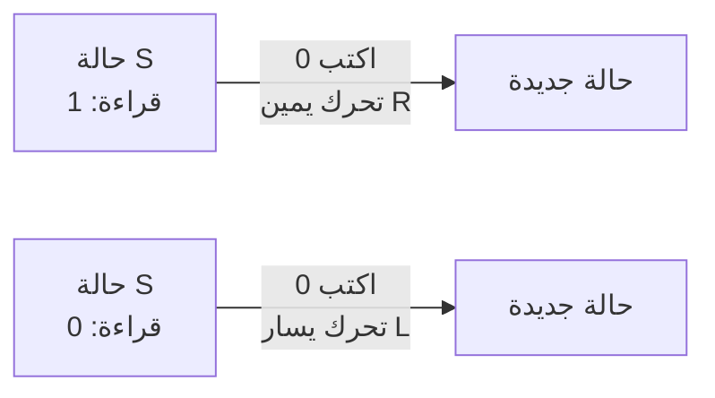
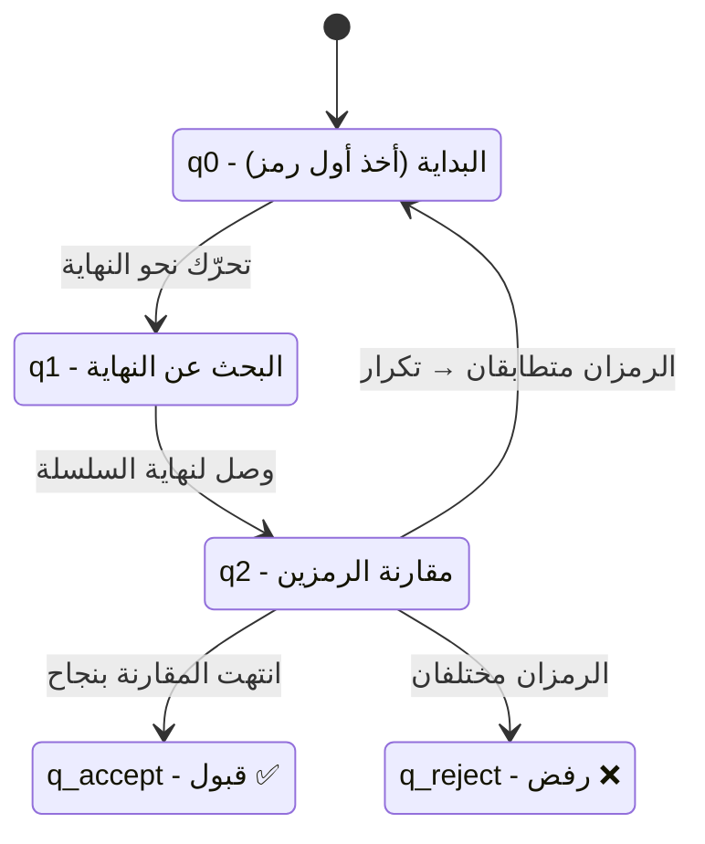

# المحاضرة 1 — Historical Overview (لمحة تاريخية)

> **المادة:** لغات البرمجة (القسم العملي) | **الموضوع:** نشأة وتطور لغات البرمجة — من الآلات الميكانيكية الأولى، مرورًا بالنماذج الرياضية للحوسبة، وصولًا لأجيال اللغات الخمسة وآليات تنفيذ البرامج

---

## الجزء الأول: ملخص منظم (اقرأ قبل المحاضرة!)

### 📍 عن هذه المحاضرة
> محاضرة تمهيدية تستعرض التاريخ الفكري والتقني للغات البرمجة: من محاولات `Charles Babbage` الميكانيكية الأولى، مرورًا بالنموذجين الرياضيين الأساسيين للحوسبة (`Turing Machine` و`λ Calculus`)، وصولًا لتطور اللغات عالية المستوى وتصنيفها إلى 5 أجيال، وآليات تنفيذ البرامج (`compiled` مقابل `interpreted`).

### 🎯 ستتعلم
- كيف نشأت فكرة "البرمجة" قبل وجود حواسيب إلكترونية أصلًا، بدءًا من `Analytical Engine` لباباج ودور آدا لوفليس كأول مبرمجة
- الفرق بين النموذجين الرياضيين الأساسيين لتعريف "ما الذي يمكن حسابه": `Turing Machine` و`λ Calculus`
- كيف تطورت اللغات من لغة الآلة الخام إلى لغات عالية المستوى (`Plankalkül`، `FORTRAN`، `LISP`، `COBOL`، `Pascal`، `C`، `C++`) ولماذا ظهرت كل واحدة تحديدًا
- تصنيف لغات البرمجة إلى 5 أجيال، وخصائص كل جيل وأمثلته
- الفرق العملي بين اللغات `compiled` و`interpreted`، ولماذا لغات متل `Java` و`#C` تقع في المنتصف بين الاثنين

### 📚 المتطلبات السابقة
- هاي أول محاضرة بالمادة، فما في متطلبات تقنية مسبقة إلزامية من مقررات سابقة
- فائدة إضافية (مو شرط): معرفة سطحية بلغة برمجة واحدة على الأقل (`Java` أو `Python`) عشان تفهم مثال المقارنة بالبداية بسهولة أكبر

### 💡 الأفكار الرئيسية
1. **البرمجة أفكار قبل ما تصير أدوات:** فكرة الخوارزمية والتحكم بالتنفيذ (حلقات، شروط) وُجدت نظريًا قبل وجود حاسوب إلكتروني واحد — `Analytical Engine` و`Turing Machine` كانا تصورين نظريين بالكامل
2. **نموذجان رياضيان متكافئان بالقوة:** `Turing Machine` و`λ Calculus` طريقتان مختلفتان تمامًا بالشكل للتعبير عن "ما الذي يمكن حسابه" — وتكافؤهما هو حجر الأساس لنظرية الحوسبة الحديثة ولانقسام لغات البرمجة لاحقًا إلى `imperative` و`functional`
3. **تطور اللغات مدفوع بمشاكل عملية محددة:** كل لغة ظهرت لحل مشكلة حقيقية — `FORTRAN` لتوفير وقت حاسوب باهظ الثمن، `COBOL` لقابلية القراءة من رجال أعمال بلا خلفية برمجية، `C` لكتابة نظام تشغيل `UNIX` بدل التجميع اليدوي — مو مجرد تحسين تجريدي بلا سبب

### 🔗 كيف تتصل هذه المحاضرة بالمحاضرات الأخرى؟
- **السابقة:** لا يوجد — هذه أول محاضرة بالمادة
- **القادمة:** المفاهيم يلي أخذناها هون (`compiled`/`interpreted`، `bytecode`، أجيال اللغات، النموذجان الرياضيان) هي الأساس يلي رح تُبنى عليه محاضرات تصميم اللغات اللاحقة (بنية اللغة، أنظمة الأنواع، نماذج البرمجة المختلفة)

### ⚠️ الأخطاء الشائعة الواجب تجنبها
- ❌ الاعتقاد إن `compiled` و`interpreted` تصنيف حصري وثابت لكل لغة — لغات متل `Java` و`#C` فعليًا بتستخدم الاثنين معًا (ترجمة لصيغة وسيطة `Bytecode`/`CLR` ثم تنفيذ على آلة افتراضية)
- ❌ الخلط بين "الشريط اللانهائي" بآلة تورينغ وذاكرة حقيقية محدودة — هو نموذج نظري لتحديد حدود إمكانية الحساب، مو تصميم فعلي لجهاز حقيقي
- ❌ الاعتقاد إن آدا لوفليس كانت بس مترجمة لمقال مينابريا — هي أضافت خوارزمية أصلية لحساب أرقام برنولي، وهذا بالضبط سبب لقبها "أول مبرمجة بتاريخ الحوسبة"

---

## الجزء الثاني: الشرح التفصيلي (سطر بسطر / فقرة بفقرة)

### 1. مقدمة: ماذا ندرس في مادة لغات البرمجة؟

<!-- @render: {type: "code-first", visualization: "comparison-table", coverage: "100%"} -->
<!-- @connectivity: {prerequisite: "none"} -->

#### 💡 الفكرة الأساسية
**بهاي المادة منركز على كيف صُممت لغات البرمجة وكيف تشتغل من الداخل — مو بس كيف نستخدمها لنكتب كود**

#### 💻 الكود: نفس الفكرة، تنفيذ مختلف

```java
int x = 5;
int y = x + 3;
System.out.println(y);
```

```python
x = 5
y = x + 3
print(y)
```

#### شرح كل سطر:
1. الكودين بالمثالين بيعبّروا عن **نفس الفكرة البرمجية بالضبط** — تعريف متغيّر، جمع، طباعة نتيجة
2. الفرق الجوهري مو بالمنطق، هو **بطريقة التنفيذ**: كود `Java` يحتاج `Compilation` قبل التنفيذ — يتحول لـ `Bytecode` ثم يشتغل على `JVM` (`Java Virtual Machine`)
3. كود `Python` يُنفَّذ مباشرة (`Interpreted`) — ما بيحتاج خطوة ترجمة مسبقة متل `Java`

**الناتج المتوقع (لقطة الشاشة):**
> كلا المثالين بيطبعوا `8` بالنهاية — بس المسار يلي وصلوا فيه لهاي النتيجة مختلف تمامًا

#### 📖 الشرح
هاي المادة — القسم العملي من لغات البرمجة — مو مادة "تعلّم لغة جديدة"، هي مادة "افهم كيف صُممت أي لغة أصلًا". يعني بدل ما نتعلم قواعد `Java` أو `Python` كمستخدمين، رح نحلل: ليش صُممت اللغة هيك؟ شو القرارات التصميمية يلي وقفت وراها؟ وكيف بتفكر اللغة نفسها بمعالجة البيانات والتحكم بالتنفيذ.

المثال البسيط فوق — `Java` مقابل `Python` — بيوضح بالضبط نوع الأسئلة يلي رح نطرحها. الكودين بيعملوا نفس الشي منطقيًا: تعريف متغيرين وجمعهم وطباعة الناتج. لكن `Java` تحتاج مرحلة `Compilation` تسبق التنفيذ — الكود المصدري يتحول لصيغة وسيطة اسمها `Bytecode`، وهاي الصيغة هي يلي بتشتغل فعليًا على `JVM`. بالمقابل، `Python` كلغة `Interpreted` بتاخد الكود المصدري وتنفذه سطر سطر مباشرة بدون خطوة ترجمة منفصلة ومسبقة.

هاد الفرق يبدو تفصيل تقني بسيط، بس هو بالضبط نوع الفروقات يلي هاي المادة رح تشرحها بعمق: ليش بعض اللغات اختارت مسار `Compilation` وبعضها اختار `Interpretation`؟ شو الكلفة والفايدة من كل خيار؟ وكيف هاد القرار التصميمي بيأثر على أداء اللغة، سهولة استخدامها، ومجالات تطبيقها؟ هاي الأسئلة رح تترافقنا طول الفصل، وبدايةً من هاي المحاضرة رح نشوف الجذور التاريخية يلي أوصلتنا لهاد التنوع بلغات البرمجة الحديثة.

#### 🎯 الملخص السريع
- المادة بتدرس تصميم اللغات من الداخل، مو استخدامها فقط
- `Java` و`Python` مثال حي على اختلاف آلية التنفيذ رغم تطابق المنطق
- `Compiled` = ترجمة مسبقة كاملة قبل التنفيذ | `Interpreted` = تنفيذ مباشر سطر سطر

#### 📚 التطبيق
هاد الفرق (`compiled` مقابل `interpreted`) رح يتوسّع لاحقًا بنهاية هاي المحاضرة (قسم 19-21) وبمحاضرات جاي بتفاصيل أعمق عن `JVM` و`CLR`.

#### 📄 النص الأصلي من المحاضرة
<details>
<summary>عرض النص الأصلي (coverage: 100%)</summary>

**النص الأصلي يقول:**
> سندرس كيف تم تصميم لغات البرمجة وكيف تعمل من الداخل، وليس فقط كيف نستخدمها. نحن لا نتعلم كيف نكتب الكود فقط، بل كيف تفكر لغة البرمجة نفسها. كيف يُنفذ الكود؟ [مع مثالي Java وPython] نفس الفكرة البرمجية، لكن طريقة التنفيذ مختلفة تمامًا، هذا الفرق هو ما ندرسه في "لغات البرمجة".

**ملاحظة على التغطية:**
- ✓ تم شرح: كل نقاط الشريحة التمهيدية بالكامل

</details>

---

### 2. المحرك التحليلي (Analytical Engine) لتشارلز باباج

<!-- @render: {type: "prose-first", visualization: "none", coverage: "95%"} -->
<!-- @connectivity: {prerequisite: "section_1"} -->

#### 📍 أين نحن الآن؟
بعد ما فهمنا إنو هاي المادة بتدرس "كيف بتفكر اللغة"، منرجع بالزمن لأقدم محاولة جدية لتصميم آلة قابلة للبرمجة — قبل وجود أي حاسوب إلكتروني.

#### 💡 الفكرة الأساسية
**`Analytical Engine` كان أول تصميم لجهاز ميكانيكي قابل للبرمجة عبر بطاقات، ومع إنو ما اكتمل بناؤه، وضع أسس مفاهيم زلنا نستخدمها اليوم: الحلقات، الشرط، والتحكم بالتنفيذ**

#### 📖 الشرح
`Analytical Engine` (المحرك التحليلي) هو جهاز حسابي صممه `Charles Babbage` بالقرن التاسع عشر، وهو كمبيوتر ميكانيكي بالكامل يعمل بالبخار — ما في فيه أي إلكترونيات إطلاقًا. الحجم كان ضخم نسبيًا (حوالي 10×30 أمتار)، والذاكرة المخطط لها كانت توازي 20.7 كيلوبايت بمعايير اليوم، وهاد رقم صغير جدًا مقارنة بأي جهاز حديث لكنه كان طموح جدًا لزمنه. الهدف الأساسي كان أتمتة العمليات الحسابية المعقدة يلي كانت تتطلب وقت وجهد بشري كبير.

المهم بالنسبة إلنا كطلاب لغات برمجة هو نظام التحكم: باباج صمم طريقة إدخال بيانات وبرامج عبر بطاقات متقوّبة (Punched Cards)، مستوحاة من نول النسيج الجاكارد. البطاقات كانت من 3 أنواع مختلفة: نوع للعمليات الحسابية، نوع للثوابت العددية، ونوع لعمليات التحميل والتخزين (نقل الأرقام بين المخزن والوحدة الحسابية). هاد التقسيم بالحد ذاته فكرة برمجية أساسية — فصل الكود عن البيانات — وهاي فكرة زلنا نطبقها بكل لغة برمجة حديثة.

الأهم من هيك: اللغة يلي استخدمها مستخدمو الآلة كانت شبيهة بلغات التجميع (`Assembly`) الحديثة، وكانت تدعم الحلقات (`loops`) والتفريع الشرطي (`conditional branching`). هاد بالضبط سبب اعتبارها لاحقًا لغة "مكتملة وفق شروط تورينغ" (`Turing complete`) — يعني نظريًا قادرة على تنفيذ أي حساب ممكن حسابه، بنفس قوة أي لغة برمجة حديثة، رغم إنها ميكانيكية بالكامل وسبقت مفهوم "الحاسوب" الإلكتروني بعقود.

بالنسبة لتوثيق البرامج، باباج ما كتب دليل تعليمات واضح متل أدلة المعالجات الحديثة. بدل هيك، كان يعرض برامجه على شكل قوائم من الحالات (`states`) خلال تنفيذها، موضحًا أي مشغل ميكانيكي تم تشغيله بكل خطوة، مع توضيح بسيط لكيفية توجيه تدفق التحكم. بمعنى تاني، وصف البرنامج بصفته مجموعة من الحالات المتسلسلة — يعني أتمتة (`Automaton`)، وهاي بالضبط الفكرة يلي رح نشوفها لاحقًا بشكل رياضي دقيق أكتر مع آلة تورينغ.

جدير بالذكر إنو المحرك التحليلي ما كان أول محاولة لباباج: هو بدأ بتصميم أبسط اسمه `Differential Engine` (محرك الفروق)، مخصص لجدولة اللوغاريتمات والدوال المثلثية عبر تقييم الفروق المحدودة لإنشاء كثيرات حدود تقريبية. هاد المشروع ما اكتمل بسبب خلافات مع مهندسه الرئيسي جوزيف كليمنت، وسحبت الحكومة البريطانية تمويلها. لكن خلال هاد المشروع، أدرك باباج إنو ممكن يوصل لتصميم أعم وأقوى بكثير — وهيك بدأ العمل على `Analytical Engine` حوالي عام 1833.

#### 🎯 الملخص السريع
- `Analytical Engine`: أول تصميم لآلة قابلة للبرمجة، ميكانيكية بالكامل، ما اكتمل بناؤها
- التحكم عبر 3 أنواع بطاقات مثقوبة: عمليات، ثوابت، تحميل/تخزين
- دعمت الحلقات والتفريع الشرطي → مكتملة وفق شروط تورينغ نظريًا
- باباج وصف البرنامج كسلسلة حالات (Automaton) بدل تعليمات موثّقة رسميًا

#### 📚 التطبيق
هاد الوصف بالحالات المتسلسلة (Automaton) هو بالضبط الفكرة يلي رح نشوفها بشكل رياضي رسمي مع آلة تورينغ بعد شوي.

#### الفهم الخاطئ ❌:
`Analytical Engine` كان مجرد آلة حاسبة ميكانيكية متل الآلات الحاسبة العادية

#### الفهم الصحيح ✅:
كان تصميم لجهاز قابل للبرمجة الفعلية — بيدعم حلقات وشروط، ومختلف جذريًا عن آلة حاسبة ثابتة الوظيفة

#### 📄 النص الأصلي من المحاضرة
<details>
<summary>عرض النص الأصلي (coverage: 95%)</summary>

**النص الأصلي يقول:**
> جهاز حسابي تم تطويره من قبل تشارلز بابج في القرن 19. لم ينته من بنائه بشكل كامل. كمبيوتر ميكانيكي يعمل بالبخار: الحجم 10×30 أمتار، الذاكرة 20.7 كيلوبايت بمعايير اليوم. الهدف: أتمتة العمليات الحسابية المعقدة. نظام التحكم: البطاقات المتقوبة، لغة برمجة مع حلقات واختيار شرطي، عرض النتائج عبر الطابعة/راسمة خطوط/الألواح المعدنية. [ثم استمرار عبر عدة شرائح عن محرك الفروقات، بطاقات التحكم الثلاث، ووصف البرنامج كحالات متسلسلة]

**ملاحظة على التغطية:**
- ✓ تم شرح: كل النقاط الرئيسية عبر الشرائح الأربع الخاصة بالمحرك التحليلي
- ℹ️ إضافة من الدليل: ربط مفهوم "الحالات المتسلسلة" بمفهوم Automaton كتمهيد لآلة تورينغ

</details>

---

### 3. آدا لوفليس: أول مبرمجة في التاريخ

<!-- @render: {type: "prose-first", visualization: "none", coverage: "100%"} -->
<!-- @connectivity: {prerequisite: "section_2"} -->

#### 💡 الفكرة الأساسية
**آدا لوفليس ما كانت بس مترجمة نص عن المحرك التحليلي — هي كتبت أول خوارزمية بالتاريخ مصممة خصيصًا للتنفيذ على آلة، ولهيك بتُعتبر أول مبرمجة**

#### 📖 الشرح
`Augusta Ada King, Countess of Lovelace` كانت عالمة رياضيات متخصصة بالتحليل الرياضي، وعملت ضمن الفريق المحيط بمشروع `Analytical Engine` يلي اقترحه تشارلز باباج. بين عامي 1842 و1843، قامت بترجمة مقال للعالم الإيطالي لويجي مينابريا يشرح فكرة هاي الآلة.

اللي بيخليها استثنائية مش إنها ترجمت المقال، هو إنها ما اكتفت بالترجمة إطلاقًا — أضافت ملاحظات خاصة فيها كانت أطول من المقال الأصلي بحوالي 3 مرات. بهاي الملاحظات، قدّمت خوارزمية مكتوبة خصيصًا لتنفيذها على آلة: طريقة لحساب أرقام برنولي (`Bernoulli numbers`) باستخدام `Analytical Engine`. هاي أول خوارزمية بالتاريخ مصممة من الأساس عشان تُنفَّذ على جهاز حاسوب، مو مجرد وصف رياضي نظري.

رؤيتها كانت أبعد من التفاصيل التقنية: هي فهمت إنو الآلة التحليلية مش محصورة بالحسابات الرقمية البسيطة، وممكن تعالج أي نوع من البيانات إذا تمت برمجتها بالشكل الصحيح — وهاي فكرة متقدمة جدًا لزمنها، وتقريبًا تلخّص جوهر "البرمجة العامة" (`general-purpose programming`) يلي منعرفها اليوم.

لو تم بناء آلة باباج فعليًا، خوارزمية آدا لوفليس كانت رح تشتغل بشكل صحيح — وهاد بالضبط سبب اعتبارها أول مبرمجة بتاريخ الحوسبة، رغم إنها ما شافت أي حاسوب فعلي يشتغل بحياتها.

#### 🎯 الملخص السريع
- آدا لوفليس: أول مبرمجة بالتاريخ، اشتغلت مع باباج على `Analytical Engine`
- أضافت خوارزمية أصلية لحساب أرقام برنولي — أول خوارزمية مصممة للتنفيذ على آلة
- رؤيتها: الآلة قادرة تعالج أي بيانات، مو بس أرقام، إذا بُرمجت صح

#### 📚 التطبيق
مفهوم "البرمجة العامة" يلي طرحته آدا لوفليس هو نفس المفهوم يلي رح نشوفه بشكل رياضي رسمي مع آلة تورينغ ونموذج λ

#### 📄 النص الأصلي من المحاضرة
<details>
<summary>عرض النص الأصلي (coverage: 100%)</summary>

**النص الأصلي يقول:**
> أول مبرمجة في التاريخ: اسمها الكامل أوغستا آدا كينغ، كونتيسة لوفليس. كانت عالمة رياضيات متخصصة في التحليل الرياضي. مساهمتها مع تشارلز باباج: عملت ضمن فريق تطوير آلة المحرك التحليلي. بين عامي 1842-1843 قامت بترجمة مقال للعالم الإيطالي لويجي مينابريا حول هذه الآلة. لم تكتفِ بالترجمة فقط، بل أضافت ملاحظات كانت أطول من المقال الأصلي بحوالي 3 مرات. قدمت خوارزمية مكتوبة خصيصًا لتنفيذها على آلة — طريقة لحساب أرقام برنولي باستخدام المحرك التحليلي. كانت رؤيتها أن الآلة التحليلية ليست فقط للحسابات البسيطة. لو تم بناء آلة باباج فعليًا كانت خوارزمية آدا لوفليس ستعمل بشكل صحيح، لذلك تُعتبر أول مبرمجة في تاريخ الحوسبة.

**ملاحظة على التغطية:**
- ✓ تم شرح: كل النقاط بالكامل

</details>

---

### 4. النماذج الرياضية للحوسبة: مقدمة

<!-- @render: {type: "prose-first", visualization: "none", coverage: "100%"} -->
<!-- @connectivity: {prerequisite: "section_3"} -->

#### ⬅️ الربط مع السابق
باباج وآدا لوفليس أثبتوا عمليًا إنو ممكن نبني آلة قابلة للبرمجة — لكن السؤال الأعمق ظل بدون جواب رياضي رسمي: شو بالضبط "يمكن حسابه"؟ هون بيجي دور النماذج الرياضية للحوسبة.

#### 💡 الفكرة الأساسية
**قبل ما توجد الحواسيب فعليًا، طوّر علماء رياضيات نماذج مجردة لفهم "ما الذي يمكن حسابه بشكل منطقي" — أشهرها `Turing Machine` و`λ Calculus`**

#### 📖 الشرح
بالعشرينيات والثلاثينيات من القرن الماضي، تم التنبؤ بظهور الحواسيب قبل اختراعها الفعلي بفترة طويلة. هاد دفع علماء الرياضيات لتطوير نماذج رياضية مجردة تهدف لفهم كيف يمكن للحوسبة إنها تتم بشكل منطقي ومجرد — بمعزل عن أي تنفيذ فيزيائي محدد.

من أشهر هاي النماذج اثنين: `Turing Machine` (آلة تورينغ) يلي اخترعها آلان تورينغ، و`λ Calculus` (نموذج لامدا) يلي طوّره ألونزو تشرش. الاثنين مختلفين تمامًا بالشكل والمقاربة — واحد يمثل الحوسبة كآلة تقرأ وتكتب على شريط، والتاني يمثلها كتعابير رياضية وتطبيق دوال — لكن ثبت لاحقًا إنهم متكافئين تمامًا بالقوة الحسابية: أي شي ممكن حسابه بواحد منهم ممكن حسابه بالتاني.

هاد التكافؤ مش تفصيل أكاديمي بعيد عن لغات البرمجة — هو بالضبط الأساس التاريخي لانقسام لغات البرمجة لاحقًا لعائلتين كبيرتين: لغات **إجرائية/آمرة** (`imperative`) متأثرة بفكرة آلة تورينغ (تسلسل خطوات وتغيير حالة)، ولغات **تابعية** (`functional`) متأثرة مباشرة بنموذج λ (تطبيق دوال بدون تغيير حالة). رح نشوف كل نموذج بالتفصيل بالأقسام الجاي.

#### 🎯 الملخص السريع
- النماذج الرياضية سبقت الحواسيب الفعلية بعقود
- `Turing Machine` و`λ Calculus`: نموذجان مختلفان بالشكل، متكافئان بالقوة
- هاد التكافؤ هو أساس انقسام لغات البرمجة لاحقًا لـ `imperative` و`functional`

#### 📚 التطبيق
رح نفصّل آلة تورينغ بالقسم الجاي، ثم نموذج λ بعده مباشرة

#### 📄 النص الأصلي من المحاضرة
<details>
<summary>عرض النص الأصلي (coverage: 100%)</summary>

**النص الأصلي يقول:**
> تم التنبؤ بظهور الحواسيب قبل اختراعها بفترة طويلة، لذلك تم تطوير نماذج رياضية تهدف إلى فهم كيف يمكن للحوسبة أن تتم بشكل منطقي ومجرد. من أشهر هذه النماذج: آلة تورينغ (Turing Machine)، ونموذج المدا (λ Calculus).

**ملاحظة على التغطية:**
- ✓ تم شرح: كل النقاط بالكامل

</details>

---

### 5. آلة تورينغ (Turing Machine)

<!-- @render: {type: "diagram-first", visualization: "flowchart", coverage: "95%"} -->
<!-- @connectivity: {prerequisite: "section_4"} -->

#### 💡 الفكرة الأساسية
**آلة تورينغ نموذج رياضي بسيط جدًا — شريط، رأس قراءة/كتابة، ومجموعة حالات — لكنه قوي بما يكفي لتمثيل أي حساب ممكن تنفيذه على أي حاسوب حديث**

#### 📊 المخطط: مكوّنات آلة تورينغ


**شرح العناصر:**
- **الشريط `Tape`:** طويل جدًا ونظريًا لا نهائي، مقسم لخلايا، كل خلية تحتوي رمز واحد (بأبسط شكل: 0 أو 1 أو فراغ)
- **رأس القراءة/الكتابة `Head`:** يتحرك يمينًا أو يسارًا على الشريط، وقادر على قراءة الرمز الحالي، كتابة رمز جديد، والتحرك
- **مجموعة الحالات `States`:** تمثل "وضع" الآلة الداخلي، مثل: بداية، معالجة، توقف

**شرح الروابط:**
- **Head ↔ Tape:** التفاعل المباشر — القراءة والكتابة بتصير حصرًا عبر الرأس، وبموضع واحد بكل لحظة
- **States → Head:** الحالة الحالية هي يلي بتحدد شو رح يعمل الرأس بالخطوة الجاية

#### 📖 الشرح
آلة تورينغ نموذج رياضي بسيط جدًا اخترعه آلان تورينغ لشرح كيف تعمل الحواسيب من حيث المبدأ — قبل ما توجد الحواسيب أصلًا. الفكرة الأساسية إنو تورينغ حاول يبسّط مفهوم "الحاسوب" عبر تخيّل شخص بيقوم بحسابات يدوية وفق خطوات محددة — أسماهم "الحاسبين البشريين" (`Human Computers`). هالأشخاص كانوا يمتلكون كمية غير محدودة من الورق يقدروا يكتبوا ويمحوا عليها الرموز، لكن بأي لحظة معينة، بيقدروا يشوفوا بس جزء صغير جدًا من هالورق.

تورينغ بسّط هالنموذج عبر استبدال "الورق" بشريط ورقي واحد غير محدود الطول، مقسم لخلايا، ممكن نكتب الرموز أكثر من مرة على أي خلية منه (نمسح ونعيد الكتابة). هاد الشريط هو المكوّن الأول من ثلاثة مكوّنات أساسية بآلة تورينغ.

المكوّن الثاني هو رأس القراءة/الكتابة (`Head`)، يلي بيتحرك يمينًا أو يسارًا على الشريط، وبأي لحظة بيقدر يعمل 3 أشياء بس: يقرأ الرمز الحالي، يكتب رمز جديد مكانه، ويتحرك خلية وحدة يمين أو يسار. المكوّن الثالث هو مجموعة الحالات (`States`)، يلي بتمثل "وضع" الآلة الداخلي بأي لحظة — مثلًا: حالة بداية، حالة معالجة، حالة توقف.

المهم فهمه هون: آلة تورينغ نموذج **نظري** مو تصميم فعلي لجهاز. الشريط "اللانهائي" ما بيعني إنو في ذاكرة فعلية بلا حدود — هو بس أداة رياضية لضمان إنو الآلة ما تتوقف بسبب نفاذ المساحة، عشان نقدر نركّز على السؤال الحقيقي: هل المسألة قابلة للحل منطقيًا بخطوات محددة، بغض النظر عن الموارد المتاحة؟ هاد بالضبط الفرق بين "هل ممكن نحسب هاد الشي نظريًا؟" و"هل عندنا موارد كافية نحسبه عمليًا؟".

#### 🎯 الملخص السريع
- 3 مكونات: شريط لا نهائي، رأس قراءة/كتابة، مجموعة حالات
- بأي لحظة: الرأس بيقرأ رمز واحد، وبيقدر يكتب/يتحرك/يغيّر الحالة
- النموذج نظري بالكامل — يقيس "قابلية الحل" مو موارد فعلية

#### الفهم الخاطئ ❌:
"الشريط اللانهائي" يعني آلة تورينغ بتحتاج ذاكرة غير محدودة فعليًا عشان تشتغل

#### الفهم الصحيح ✅:
اللانهائية أداة رياضية بس، الهدف منها ضمان عدم انتهاء المساحة أثناء إثبات "قابلية الحل" — مو متطلب لأي تنفيذ فعلي

#### 📚 التطبيق
هاي المكونات الثلاثة هي أساس فهم آلية عمل آلة تورينغ (دالة الانتقال) يلي رح نشرحها بالقسم الجاي

#### 📄 النص الأصلي من المحاضرة
<details>
<summary>عرض النص الأصلي (coverage: 95%)</summary>

**النص الأصلي يقول:**
> آلة تورينغ هي نموذج رياضي بسيط اخترعه آلان تورينغ لشرح كيف تعمل الحواسيب من حيث المبدأ... الحسابين البشريين: هؤلاء الأشخاص كانوا يقومون بالحسابات يدويًا وفق خطوات محددة، يمتلكون كمية غير محدودة من الورق... تتكون من 3 عناصر أساسية: شريط Tape، رأس القراءة/الكتابة Head، مجموعة حالات States.

**ملاحظة على التغطية:**
- ✓ تم شرح: التعريف والمكونات الثلاثة بالكامل

</details>

---

### 6. آلية عمل آلة تورينغ

<!-- @render: {type: "diagram-first", visualization: "flowchart", coverage: "90%"} -->
<!-- @connectivity: {prerequisite: "section_5"} -->

#### 💡 الفكرة الأساسية
**سلوك آلة تورينغ يعتمد بالكامل على قاعدة واحدة تتكرر: (الحالة الحالية + الرمز المقروء) → (رمز جديد، اتجاه حركة، حالة جديدة) — وهاد اسمها دالة الانتقال `Transition Function`**

#### 📊 المخطط: مثال بسيط على دالة الانتقال



**شرح العناصر:**
- **الحالة + الرمز المقروء:** هما المدخلان الوحيدان يلي بيحددوا رد فعل الآلة بأي لحظة
- **الناتج (كتابة + حركة + حالة جديدة):** القرار الكامل يلي بتاخده الآلة بكل خطوة

**شرح الروابط:**
- **قراءة 1 → كتابة 0 + تحرك R:** لو الآلة قرأت الرمز `1` من الشريط، لازم تكتب القيمة `0` وتنقل الشريط يمينًا
- **قراءة 0 → كتابة 0 + تحرك L:** لو الآلة قرأت الرمز `0` من الشريط، لازم تكتب القيمة `0` وتنقل الشريط يسارًا

#### 📖 الشرح
آلة تورينغ ما بتشتغل عشوائيًا — سلوكها محكوم بالكامل بقاعدة واحدة اسمها دالة الانتقال (`Transition Function`): "إذا كنت بحالة معينة وقرأت رمزًا معينًا، اكتب رمزًا، تحرّك يمين أو يسار، وانتقل لحالة جديدة". هاي القاعدة البسيطة، لما تتكرر آلاف المرات، قادرة تنفّذ أي خوارزمية معقّدة.

للآلة حالة ابتدائية هي حالة البدء، ويتم كتابة إدخال البيانات كقيم على الشريط قبل ما تبدأ. لما توصل الآلة لحالة معينة اسمها `Stop`، بتتوقف، ومحتويات الشريط المشار إليها برأس القراءة/الكتابة بتمثل ناتج الحساب النهائي.

مهم كتير نلاحظ: عدد الحالات والرموز المستخدمة مش ثابت لكل المسائل — بيتحدد حسب المسألة نفسها يلي لازم نحلها. يعني التصميم مرن ويقبل التعديل بناءً على ما تحتاجه المسألة وتعقيدها. مسألة بسيطة ممكن تحتاج 3 حالات بس، ومسألة معقدة ممكن تحتاج عشرات الحالات.

#### 🎯 الملخص السريع
- القاعدة الوحيدة: (حالة + رمز مقروء) → (كتابة + حركة + حالة جديدة)
- الآلة بتتوقف عند الوصول لحالة `Stop`، ومحتوى الشريط عندها = الناتج
- عدد الحالات مش ثابت — يتحدد حسب تعقيد المسألة المطلوب حلها

#### 📚 التطبيق
رح نطبّق كل هاد المفهوم عمليًا بمثال كامل بالقسم الجاي: التحقق من `Palindrome`

#### 📄 النص الأصلي من المحاضرة
<details>
<summary>عرض النص الأصلي (coverage: 90%)</summary>

**النص الأصلي يقول:**
> الآلة تعمل وفق قواعد Transition Function تقول: إذا كنت في حالة معينة وقرأت رمزًا معينًا، اكتب رمزًا، تحرّك يمين/يسار، وانتقل إلى حالة جديدة. لهذه الآلة حالة ابتدائية هي حالة البدء. عندما نصل للحالة Stop تتوقف الآلة، ومحتويات الشريط... هي ناتج الحساب. [مع أمثلة انتقال 1/0-R و0/0-L]. يتحدد عدد الحالات والرموز المستخدمة بالمسألة التي يتوجب حلها.

**ملاحظة على التغطية:**
- ✓ تم شرح: دالة الانتقال، حالة البدء والتوقف، ومرونة عدد الحالات
- ⚠️ غير مشروح بالكامل: تفاصيل الرسم البياني الدقيق بالشريحة الأصلية (state diagram) — مبسّط هون لتوضيح المبدأ العام بدل نسخ الرسم حرفيًا

</details>

---

### 7. مثال تطبيقي: التحقق من Palindrome بآلة تورينغ

<!-- @render: {type: "diagram-first", visualization: "flowchart", coverage: "95%"} -->
<!-- @connectivity: {prerequisite: "section_6"} -->

#### 💡 الفكرة الأساسية
**مثال `Palindrome` (سلسلة بتقرأ نفسها من الاتجاهين، متل `101` أو `0110`) بيوضح عمليًا كيف آلة بـ5 حالات بس قادرة تحل مسألة منطقية حقيقية**

#### 📊 المخطط: خوارزمية التحقق من Palindrome



**شرح العناصر:**
- **q0 (البداية):** تاخد أول رمز من يمين الشريط
- **q1 (البحث عن النهاية):** تتحرك للوصول لآخر رمز بالسلسلة
- **q2 (مقارنة):** تقارن الرمز الحالي مع آخر رمز
- **q_accept / q_reject:** الحالتان النهائيتان — قبول أو رفض السلسلة كـ Palindrome

**شرح الروابط:**
- **q2 → q0 (تكرار):** لو الرمزان متطابقان، نكرر العملية على الرمزين التاليين للداخل
- **q2 → q_reject:** لو الرمزان مختلفان، السلسلة مش Palindrome — رفض فوري
- **q2 → q_accept:** لو وصلنا لنهاية المقارنة بدون أي اختلاف، السلسلة Palindrome — قبول

#### 📖 الشرح
هاد المثال بيوضح عمليًا كيف نطبّق مفاهيم آلة تورينغ يلي شرحناها بالقسمين السابقين على مسألة حقيقية: التحقق هل سلسلة معينة (متل `101` أو `0110`) بتقرأ نفسها من اليمين واليسار (`Palindrome`) أو لأ.

الخوارزمية بسيطة ومباشرة: أول شي ناخد أول رمز من يمين الشريط، بعدين نروح لنهاية السلسلة، نقارن هاد الرمز مع آخر رمز بالسلسلة. إذا كانوا نفس الرمز، نكرر نفس العملية على الرمزين التاليين للداخل. إذا كانوا مختلفين، نرفض السلسلة فورًا (مش Palindrome). وإذا انتهت المقارنة بدون أي اختلاف (وصلنا لمنتصف السلسلة أو ما تبقى شي للمقارنة)، نقبل السلسلة كـ Palindrome.

الآلة يلي بتنفذ هاد المنطق تحتاج بس 5 حالات: `q0` (البداية)، `q1` (البحث عن النهاية)، `q2` (المقارنة)، بالإضافة لحالتي القبول والرفض (`q_accept` و`q_reject`). هاد بالضبط مثال عملي على النقطة يلي ذكرناها بالقسم السابق: عدد الحالات بيتحدد حسب تعقيد المسألة — مسألة بسيطة نسبيًا متل `Palindrome` احتاجت بس 5 حالات.

هاد المثال مهم لأنه بيربط النظري بالتطبيقي: منشوف إزا كيف قاعدة بسيطة جدًا ("اقرأ، قارن، تحرك، كرر") — لما تُصاغ بدقة ضمن حالات محددة ودالة انتقال واضحة — قادرة تحل مسألة منطقية كاملة، بدون أي "ذكاء" إضافي بالآلة نفسها.

#### 🎯 الملخص السريع
- المسألة: هل السلسلة تقرأ نفسها بالاتجاهين (Palindrome)؟
- الخطوات: أخذ رمز → البحث عن النهاية → مقارنة → تكرار أو قبول/رفض
- تحتاج 5 حالات بس: q0, q1, q2, q_accept, q_reject

#### 🤔 تفعيل الفهم (اسأل نفسك):
> **سؤال:** لو السلسلة كانت بطول فردي (متل `101`)، شو بيصير بالرمز الأوسط لما توصل الآلة له؟
> **لماذا هذا مهم؟** لأنو بيوضح حالة حافة مهمة: الرمز الأوسط ما إله رمز يقارَن معه، فلازم الخوارزمية تتعامل معه كحالة قبول تلقائي بمجرد الوصول له

#### 📄 النص الأصلي من المحاضرة
<details>
<summary>عرض النص الأصلي (coverage: 95%)</summary>

**النص الأصلي يقول:**
> مثال مع رسم مخطط حالات Diagram State. المثال: التحقق من Palindrome. هل السلسلة مثل 101 أو 0110 تقرأ نفسها من اليمين واليسار. نقوم بـ: أخذ أول رمز يمين الشريط، نذهب لنهاية السلسلة، نقارن مع آخر رمز، إذا نفس الشي نكرر، إذا مختلف نرفض، إذا انتهت نقبل. الحالات: q0 البداية، q1 البحث عن النهاية، q2 مقارنة، q_accept قبول، q_reject رفض.

**ملاحظة على التغطية:**
- ✓ تم شرح: كل خطوات الخوارزمية والحالات الخمس
- ℹ️ إضافة من الدليل: توضيح حالة الحافة الخاصة بالرمز الأوسط بسلسلة فردية الطول (سؤال تفعيل الفهم)

</details>

---

### 8. نموذج λ (Lambda Calculus)

<!-- @render: {type: "code-first", visualization: "none", coverage: "90%"} -->
<!-- @connectivity: {prerequisite: "section_7"} -->

#### ⬅️ الربط مع السابق
آلة تورينغ مثّلت الحوسبة كتسلسل خطوات وتغيير حالة على شريط. النموذج التاني — λ Calculus — بيمثّل نفس القوة الحسابية، لكن بمقاربة مختلفة جذريًا: تعابير وتطبيق دوال بدون أي "حالة" بالمعنى يلي شفناه بآلة تورينغ.

#### 💡 الفكرة الأساسية
**نموذج λ (المدا) هو أصغر لغة برمجة عالمية ممكنة — كل شي فيها إما اسم، أو دالة، أو تطبيق دالة على قيمة — وهو أساس ما نعرفه اليوم بالبرمجة التابعية (Functional Programming)**

#### 💻 الكود: مثال Java مستوحى من فكرة λ

```java
ArrayList<Integer> list = new ArrayList<>();
list.stream()
    .filter(item -> item > 0)
    .map(item -> item + "");
```

#### شرح كل سطر:
1. `ArrayList<Integer> list = new ArrayList<>();` → تعريف قائمة أعداد صحيحة فاضية
2. `.stream()` → تحويل القائمة لتدفق (Stream) بيسمح بتطبيق دوال عليه بشكل متسلسل — مو تعديل مباشر على القائمة نفسها
3. `.filter(item -> item > 0)` → `item -> item > 0` هي `λ` بالمعنى الحرفي: دالة بلا اسم (Anonymous Function) بتاخد عنصر `item` وترجع `true`/`false`
4. `.map(item -> item + "")` → دالة تانية بلا اسم، بتطبَّق على كل عنصر ناجي من الفلتر، وبتحوّله لنص

**الناتج المتوقع (لقطة الشاشة):**
> `Stream` يحتوي فقط على العناصر الموجبة، محوّلة لنصوص — بدون ما نكتب حلقة `for` صريحة أو نعدّل القائمة الأصلية

#### 📖 الشرح
نموذج λ طوّره ألونزو تشرش، وهو أصغر لغة برمجة عالمية ممكن تخيّلها — بمعنى إنو بأقل عدد ممكن من المفاهيم (تعبيرات، دوال، تطبيقات)، ممكن نعبّر عن أي حساب قابل للحساب أصلًا (تكافؤًا مع آلة تورينغ). بناء الجملة فيه بسيط جدًا: تعبير (`expression`) هو إما اسم (`name`)، أو دالة (`function`) بالشكل `λ <name>.<expression>`، أو تطبيق (`application`) بالشكل `<expression> <expression>` (يعني استدعاء دالة على قيمة).

هاد النموذج البسيط جدًا هو الأساس النظري لما نعرفه اليوم بـ"البرمجة التابعية" أو "الوظيفية" (`Functional Programming`) — أسلوب برمجة بيعامل الحساب كتطبيق دوال رياضية، بدون تغيير حالة (`state`) أو بيانات قابلة للتعديل (`mutable data`) قدر الإمكان.

المثال بلغة `Java` فوق بيوضح كيف المفهوم موجود حتى بلغات إجرائية (`imperative`) بشكل جزئي. `item -> item > 0` هي بالضبط دالة λ بدون اسم — بتاخد قيمة وترجع نتيجة، وممكن تُمرَّر كوسيط (`argument`) لدالة تانية (`.filter()`) بنفس طريقة ما تُمرَّر أي قيمة عادية. هاد بالضبط ما قصدته λ Calculus من البداية: الدوال ممكن تُعامَل كقيم من الدرجة الأولى (`first-class values`) — تُمرَّر، تُرجَّع، تُخزَّن، تمامًا متل أي عدد أو نص.

المثال الثاني بالشريحة الأصلية (فلترة كائنات `MyObject` حسب طول معين، ثم تحويلها لكائن جديد) بيوضح نفس المبدأ بس بمستوى تعقيد أعلى شوي — بيأكد إنو هاد النمط مش محصور بالأنواع البسيطة (Integer)، وممكن يُطبَّق على أي نوع كائن معقد.

#### 🎯 الملخص السريع
- λ Calculus: أصغر لغة برمجة عالمية — تعبير = اسم | دالة | تطبيق
- أساس البرمجة التابعية (Functional Programming) الحديثة
- الدوال كقيم من الدرجة الأولى: تُمرَّر وتُرجَّع متل أي قيمة عادية

#### 📚 التطبيق
هاد المفهوم (الدوال كقيم) رح نشوفه مرة تانية بلغة `LISP` بعد شوي — أول لغة سمحت فعليًا بتمرير التوابع كوسائط وإرجاعها من توابع أخرى

#### 📄 النص الأصلي من المحاضرة
<details>
<summary>عرض النص الأصلي (coverage: 90%)</summary>

**النص الأصلي يقول:**
> طوره ألونزو تشرش. أصغر لغة برمجة عالمية. يتكون من: تعبيرات، دوال، تطبيقات. يعرف ذلك باسم البرمجة التابعية Functional Programming. بناء الجملة: expression := name | function | application، function := λ name.expression، application := expression expression. [مع مثالي كود Java]

**ملاحظة على التغطية:**
- ✓ تم شرح: التعريف، بناء الجملة، والمثالين بالكامل

</details>

---

### 9. لماذا ظهرت اللغات عالية المستوى؟

<!-- @render: {type: "prose-first", visualization: "none", coverage: "95%"} -->
<!-- @connectivity: {prerequisite: "section_8"} -->

#### 📍 أين نحن الآن؟
لحد هلق شفنا الأساس النظري (آلة تورينغ وλ) والمحاولات الميكانيكية الأولى (باباج). من هون لقدام رح نتتبع كيف تطورت اللغات الفعلية يلي استُخدمت لبرمجة حواسيب إلكترونية حقيقية، بدءًا من السبب يلي خلاها تظهر أصلًا.

#### 💡 الفكرة الأساسية
**اللغات عالية المستوى ظهرت لأن كتابة برامج مفيدة مباشرة بلغة الآلة كانت مضيعة للوقت وعرضة للأخطاء بشكل كبير**

#### 📖 الشرح
بالبدايات، لما كانت أجهزة الكمبيوتر صغيرة وساعات تشغيلها واستخدامها مكلفة جدًا مقارنة بساعات العمل اليدوي، كان من المنطقي إنفاق جهد بشري كبير على كتابة البرامج، والتركيز بشكل أقل على آليات تسهّل هاي العملية. يعني الأولوية كانت لتوفير وقت الآلة، مو وقت المبرمج.

بس سرعان ما اكتشف المتخصصون إنو إنشاء برامج مفيدة على المستوى المنخفض جدًا يلي تتطلبه أجهزة الكمبيوتر الإلكترونية (لغة الآلة الخام) ما كان بس مضيعة للوقت، بل كان عرضة للخطأ بشكل كبير. هاد الاكتشاف دفع، بخمسينيات القرن العشرين، لاختراع لغات البرمجة عالية المستوى: رموز رسمية ممكن استخدامها للتعبير عن البرامج بشكل مفهوم أكتر بكثير للبشر مقارنة بلغة الآلة، مع توظيف مفاهيم عالية المستوى متل الأعداد الحقيقية، المصفوفات، السجلات، الحلقات، والتوابع.

الفايدة ما اقتصرت بس على سهولة الكتابة. اللغات عالية المستوى — بفضل هيكليتها المنظمة — سمحت بشيء ما كانت لغة الآلة تقدر تقدّمه إطلاقًا: الكشف التلقائي عن الأخطاء. حيث صار ممكن اكتشاف أنواع معينة من الاستخدامات غير الصحيحة للتعابير عالية المستوى، عبر برنامج كمبيوتر (المترجم)، والإبلاغ عنها كأخطاء قبل حتى تشغيل البرنامج. لغة الآلة، بالمقابل، ما تمتلك أي هيكلية يمكن استغلالها لهاد الغرض — البرنامج فيها مجرد سلسلة كلمات بدون بنية نحوية واضحة يمكن التحقق منها.

هاد بالضبط الفرق الجوهري: المفاهيم عالية المستوى قدّمت بناء جملة (`syntax`) منظمًا يمكن التحقق منه مقابل نظام نحوي ونوع رسمي (`type system`)، بينما برامج لغة الآلة تُعتبر سلاسل من الكلمات بدون هيكل يمكن تحليله آليًا.

#### 🎯 الملخص السريع
- لغة الآلة: كفاءة بالتنفيذ، لكن مضيعة للوقت وعرضة للخطأ بالكتابة
- اللغات عالية المستوى (منذ خمسينيات القرن الماضي): أقرب للبشر، مبنية على مفاهيم متل المصفوفات والحلقات
- الفايدة الأهم: اكتشاف أخطاء تلقائي بفضل وجود بنية نحوية يمكن التحقق منها

#### مهم للامتحان ⚠️:
> السبب الأساسي لظهور اللغات عالية المستوى مش "سهولة الكتابة" بحد ذاتها فقط، إنما اكتشاف إنو البرمجة المباشرة بلغة الآلة عرضة للخطأ بشكل خطير — هاد التمييز مهم لأنو بيوضح إنو الدافع كان عملي/هندسي، مو مجرد راحة

#### 📚 التطبيق
رح نشوف بالأقسام الجاي أمثلة فعلية على أول هاي اللغات: `Plankalkül`، `FORTRAN`، `LISP`، وغيرها، وكل واحدة حلّت جانب مختلف من هاد المشكلة

#### 📄 النص الأصلي من المحاضرة
<details>
<summary>عرض النص الأصلي (coverage: 95%)</summary>

**النص الأصلي يقول:**
> عندما كانت أجهزة الكمبيوتر صغيرة وساعات تشغيلها واستخدامها مكلفة... كان من المنطقي إنفاق جهد كبير على كتابة البرامج. سرعان ما اكتشف المتخصصون أن إنشاء برامج مفيدة على المستوى المنخفض جدًا... لم يكن مضيعة للوقت فحسب، بل كان عرضة للخطأ. لذلك في خمسينيات القرن العشرين تم اختراع لغات البرمجة عالية المستوى... يساعد الترميز الرسمي عالي المستوى على الكشف التلقائي عن الأخطاء... إن لغة الآلة لا تمتلك هيكلية يمكن استغلالها لهذا الغرض.

**ملاحظة على التغطية:**
- ✓ تم شرح: كل النقاط عبر الشريحتين بالكامل

</details>

---

### 10. Plankalkül: أول لغة برمجة

<!-- @render: {type: "prose-first", visualization: "none", coverage: "95%"} -->
<!-- @connectivity: {prerequisite: "section_9"} -->

#### 💡 الفكرة الأساسية
**`Plankalkül` كانت أول لغة برمجة تُصمَّم أصلًا للحواسيب الإلكترونية (1942-1945)، لكنها لم تُنفَّذ فعليًا على حاسوب حقيقي إلا بعد عقود**

#### 📖 الشرح
`Plankalkül` هي أول لغة برمجة تم تطويرها للحواسيب الإلكترونية، من قبل المهندس الألماني `Konrad Zuse` بين عامي 1942 و1945. المفارقة الكبيرة هون إنها، رغم كونها الأولى تاريخيًا، ما تم تحقيقها فعليًا على حاسوب حقيقي إلا بعد وقت طويل جدًا من تصميمها.

سبب هالتأخير مرتبط مباشرة بهدف تصميمها: `Plankalkül` ما كانت مخصصة للترجمة الآلية إلى لغة الآلة — يعني ما كان في نية إنها تُترجم أوتوماتيكيًا لتشتغل على حاسوب. بدل هيك، تم تطويرها لتكون مفهومة للإنسان بالدرجة الأولى، بدل ما تكون قابلة للقراءة الآلية. هاد الاختيار التصميمي وضّح أولوية زوس: التعبير الواضح عن الخوارزميات، مو التنفيذ الآلي المباشر. حتى إنه كان ممكن كتابتها على آلة كاتبة عادية، مع إضافة عدد قليل من الرموز باليد.

من الناحية التقنية، `Plankalkül` احتوت على مفاهيم متقدمة جدًا لزمنها: ترميز القيم على شكل مصفوفة متعددة الأبعاد، بحيث يمكن الوصول لكل بت منها بشكل منفرد أو قراءة سطر كامل من البتات بالشكل الثنائي للتعبير عن قيمة رقمية متعددة البتات. كمان دعمت إسناد قيم للمتحولات، وبنى تحكم أساسية متل `if-then-else` والحلقات. والأهم: كان فيها عملية قادرة تحدد المكوّن الأول أو كل مكونات المصفوفة يلي بتحقق شرطًا (مسندًا) محددًا — وهاد بالضبط يتوافق مع عمليات الفلترة يلي منعرفها اليوم بالوظائف الحديثة (متل `.filter()` يلي شفناه بمثال λ).

#### 🎯 الملخص السريع
- أول لغة برمجة إلكترونية (1942-1945)، صممها Konrad Zuse
- ما تحققت فعليًا على حاسوب إلا بعد وقت طويل — لأنها صُممت لفهم الإنسان لا للترجمة الآلية
- احتوت مفاهيم متقدمة: مصفوفات متعددة الأبعاد، إسناد، بنى تحكم، وعمليات فلترة

#### الفهم الخاطئ ❌:
بما إنها أول لغة برمجة، لازم تكون هي يلي شغّلت أول حاسوب فعليًا

#### الفهم الصحيح ✅:
`Plankalkül` كانت أول من ناحية التصميم الزمني، لكن `FORTRAN` (اللي رح نشوفها بالقسم الجاي) هي فعليًا أول لغة انتشر استخدامها الفعلي على حواسيب حقيقية بشكل واسع

#### 📄 النص الأصلي من المحاضرة
<details>
<summary>عرض النص الأصلي (coverage: 95%)</summary>

**النص الأصلي يقول:**
> أول لغة برمجة تم تطويرها للحواسيب الإلكترونية من قبل كونراد زوس مابين عامي 1942 و1945 إلا أنه لم يتم تحقيقها على الحاسب إلا بعد وقت طويل. نظرًا لأنها لم تكن مخصصة للترجمة الآلية إلى لغة الآلة، فقد تم تطويرها لفهم الإنسان بدلًا من قابلية القراءة الآلية. احتوت على: ترميز القيم على شكل مصفوفة متعددة الأبعاد... إسناد قيم لمتحولات، بنى تحكم (if-then-else / حلقات)، عملية فلترة تتوافق مع الوظائف الحديثة.

**ملاحظة على التغطية:**
- ✓ تم شرح: كل النقاط بالكامل

</details>

---

### 11. FORTRAN

<!-- @render: {type: "code-first", visualization: "none", coverage: "95%"} -->
<!-- @connectivity: {prerequisite: "section_10"} -->

#### 💡 الفكرة الأساسية
**`FORTRAN` (Formula Translator) هي أول لغة برمجة عالية المستوى انتشر استخدامها فعليًا، صُممت كبديل عملي لكتابة كود الآلة يدويًا بحواسيب كانت غالية الثمن جدًا**

#### 💻 الكود: برنامج FORTRAN لإيجاد أكبر قيمة بمجموعة أرقام

```fortran
C     PROGRAM FOR FINDING THE LARGEST VALUE
C     ATTAINED BY A SET OF NUMBERS
      BIGA = A(1)
      DO 20 I = 2, N
      IF (BIGA - A(I)) 10, 20, 20
   10 BIGA = A(I)
   20 CONTINUE
```

#### شرح كل سطر:
1. `C     PROGRAM FOR...` → سطر تعليق (يبدأ بـ `C`)، يشرح غرض البرنامج
2. `BIGA = A(1)` → تهيئة المتغير `BIGA` (أكبر قيمة حتى الآن) بأول عنصر بالمصفوفة `A`
3. `DO 20 I = 2, N` → بداية حلقة `DO` (تعادل `for`): تكرار من `I=2` حتى `I=N`، وتنتهي عند السطر المرقّم `20`
4. `IF (BIGA - A(I)) 10, 20, 20` → شرط قديم الطراز: لو الفرق سالب (BIGA أصغر) اقفز للسطر `10`، لو صفر أو موجب اقفز للسطر `20` — أسلوب القفز الشرطي المميز لـ FORTRAN المبكرة
5. `10 BIGA = A(I)` → (يُنفَّذ فقط لو قفزنا هون) تحديث `BIGA` لتصبح القيمة الأكبر الجديدة
6. `20 CONTINUE` → نهاية الحلقة — استمرار للتكرار التالي أو الخروج منها

**الناتج المتوقع (لقطة الشاشة):**
> بعد انتهاء الحلقة، `BIGA` تحتوي أكبر قيمة موجودة بالمصفوفة `A` من العنصر 1 حتى N

#### 📖 الشرح
`FORTRAN` اختصار لـ`Formula Translator`، وتم تطويرها بشركة `IBM` من قبل فريق بقيادة `John Backus`، كبديل عملي لكتابة كود الآلة يدويًا. تم نشر الدليل عام 1956، واكتمل تطوير مترجم فعلي (`compiler`) عام 1957. بما إنو وقت تشغيل الحاسوب كان مكلفًا جدًا بتلك الفترة، كان مطلوبًا إنو المترجم يولّد كود آلة يعمل بسرعة مماثلة تقريبًا لكود آلة مكتوب يدويًا — وهاد الشرط أثّر بشكل مباشر على قرارات التصميم: كانت اللغة متحفظة نسبيًا، والمترجم استخدم سلسلة من التحسينات (`optimizations`) لتحسين سرعة الكود الناتج.

اللغة كانت مخصصة بالدرجة الأولى للحساب العلمي، لذلك تضمّنت دعمًا مباشرًا للمصفوفات متعددة الأبعاد والأعداد المركّبة (`complex numbers`) — ميزات نادرة جدًا بلغات ذاك الزمن. بالمقابل، هياكل التحكم كانت محدودة إلى حد ما، مقتصرة على قفزات عادية وشرطية لعناوين (`labels`) وحلقة `DO` واحدة (متل يلي شفناها بالمثال فوق).

من ناحية الشكل الفيزيائي، بناء `FORTRAN` صُمم حول البطاقات المثقوبة (`Punched Cards`)، ولهيك تم تقسيم الأحرف الـ80 الموجودة على بطاقة مثقوبة قياسية لحقول محددة الاستخدام (عمود التعليقات، رقم السطر، عمود الاستمرارية، نص الكود...). هاد ليس تفصيل تاريخي عابر — هو السبب المباشر وراء الصياغة الغريبة يلي منشوفها بكود `FORTRAN` القديم (أرقام أسطر، أعمدة محددة للنص).

نقطة تصميمية مهمة أخيرة: بما إنو الذاكرة كانت محدودة جدًا عام 1956، سمحت `FORTRAN` للعديد من المتغيرات أو المصفوفات بمشاركة نفس مساحة الذاكرة بشكل صريح — وكان الأمر متروك بالكامل للمبرمج لضمان الاستخدام الصحيح لهاي الميزة. هاي الميزة، بجانب توفير الذاكرة، سمحت أيضًا بعرض مصفوفة ثنائية الأبعاد كمصفوفة أحادية البعد باستخدام اسم مختلف، مما بسّط التكرار على كل عناصرها. تطورت `FORTRAN` لاحقًا لإصدارات أحدث وأبرزها `FORTRAN 66`، `FORTRAN 77`، و`Fortran 90`، بمزيد من هياكل البيانات وبنى التحكم وتخطيط نصي أكثر حرية.

#### 🎯 الملخص السريع
- FORTRAN = Formula Translator، طوّرتها IBM بقيادة John Backus (1956-1957)
- مصممة للحساب العلمي: دعم مصفوفات متعددة الأبعاد وأعداد مركّبة
- بناؤها مبني حول البطاقات المثقوبة (80 حرف مقسّمة لحقول)
- سمحت بمشاركة الذاكرة بين متغيرات — مسؤولية المبرمج بالكامل

#### 📚 التطبيق
مفهوم "المترجم اللي بيولّد كود آلة سريع" رح يتوسّع لاحقًا بأقسام تنفيذ البرامج (compiled) بنهاية هاي المحاضرة

#### 📄 النص الأصلي من المحاضرة
<details>
<summary>عرض النص الأصلي (coverage: 95%)</summary>

**النص الأصلي يقول:**
> FORTRAN = Formula Translator. تم تطوير FORTRAN في IBM من قبل فريق بقيادة John Backus كبديل لكتابة كود الآلة يدويًا. تم نشر الدليل عام 1956 وتم الانتهاء من مترجم عام 1957... كانت اللغة مخصصة بشكل أساسي للحساب العلمي... تم تصميم بناء FORTRAN حول البطاقات المثقوبة، لذلك تم تقسيم الأحرف الـ80... سمحت FORTRAN للعديد من المتغيرات أو المصفوفات بمشاركة نفس الذاكرة بشكل صريح.

**ملاحظة على التغطية:**
- ✓ تم شرح: كل النقاط عبر الشرائح الثلاث بالكامل

</details>

---

### 12. LISP

<!-- @render: {type: "code-first", visualization: "none", coverage: "90%"} -->
<!-- @connectivity: {prerequisite: "section_11"} -->

#### 💡 الفكرة الأساسية
**`LISP` أول لغة برمجة سمحت فعليًا بتمرير التوابع كقيم لتوابع أخرى وإرجاعها منها — تطبيق مباشر لفكرة λ Calculus اللي شفناها سابقًا**

#### 💻 الكود: تعريف تابع بسيط بلغة LISP

```lisp
(DEFINE FF (LAMBDA (X) (COND ((ATOM X) X) (T (FF (CAR X))))))
```

#### شرح كل سطر:
1. `(DEFINE FF ...)` → تعريف تابع جديد اسمه `FF`
2. `(LAMBDA (X) ...)` → التابع مُعرَّف كدالة λ بوسيط واحد اسمه `X` — رابط مباشر بمصطلحات نموذج λ يلي شرحناه بالقسم 8
3. `(COND ((ATOM X) X) (T (FF (CAR X))))` → شرط: لو `X` عبارة عن ذرّة (`ATOM`، يعني عنصر مفرد مش زوج) رجّع `X` نفسها، غير هيك (`T` = صحيح دائمًا) نادِ `FF` من جديد على أول عنصر من `X` (`CAR X`) — استدعاء ذاتي (`recursion`)

**الناتج المتوقع (لقطة الشاشة):**
> `FF` بتنزل داخل السلاسل المتداخلة حتى توصل لأول ذرّة (عنصر مفرد) وترجعها

#### 📖 الشرح
`LISP` صُممت عام 1958 بمعهد `MIT` من قبل `John McCarthy`، وهي مستوحاة مباشرة من حساب λ يلي شفناه بالقسم السابق. صُممت خصيصًا للمعالجة الرمزية (`Symbolic Processing`)، وبنوع بيانات واحد فقط: التعبير `S` (`S-expression`). التعبير `S` هو إما ذرّة (`atom`) — رمز مكوّن من أحرف أبجدية رقمية، أو زوج من تعبيرين `S` (يعني بنية متداخلة يمكن تمثّل قوائم، أشجار، وأي بنية بيانات معقدة).

المثال فوق (`DEFINE FF LAMBDA X COND...`) بيوضح تعريف تابع بسيط باستخدام `LAMBDA` بشكل مباشر داخل بناء الجملة — وهاد ليس صدفة، هو تجسيد حرفي لمفاهيم λ Calculus داخل لغة برمجة فعلية قابلة للتنفيذ.

النقطة الأهم تاريخيًا: `LISP` كانت أول لغة برمجة سمحت فعليًا بتمرير التوابع كقيم على شكل وسائط (`arguments`) لتوابع أخرى، وإرجاعها كنتيجة منها. هاد بالضبط مفهوم "الدوال كقيم من الدرجة الأولى" يلي ذكرناه بقسم λ، لكن هون تطبيقه بلغة برمجة حقيقية وليس نموذج رياضي مجرد — وهاد أساس ما نعرفه اليوم كـ`Higher-Order Functions` بكل اللغات الحديثة (متل مثال `.filter()`/`.map()` بجافا يلي شفناه سابقًا).

من ناحية تصميمية أخرى، رغم إنو تخصيص المتغيرات (`variable assignment`، يعني تغيير قيمة متغيّر موجود) كان ممكنًا منذ بداية `LISP`، إلا إنو استخدامه كان — ولا يزال — غير مشجَّع، لأنو بيتعارض مع الفلسفة التابعية (Functional) للغة يلي بتفضّل التعبيرات النقية بدون آثار جانبية. وأخيرًا، `LISP` كانت أول لغة برمجة تتميّز بجمع البيانات المهملة تلقائيًا (`Garbage Collection`) — يعني تحرير الذاكرة غير المستخدمة تلقائيًا بدون تدخل يدوي من المبرمج، ميزة أصبحت لاحقًا معيارًا بمعظم اللغات الحديثة.

#### 🎯 الملخص السريع
- LISP (1958، MIT، John McCarthy): مستوحاة من λ Calculus مباشرة
- نوع بيانات واحد: S-expression (ذرّة أو زوج من تعبيرين)
- أول لغة تسمح بتمرير/إرجاع التوابع كقيم (Higher-Order Functions)
- أول لغة بجمع بيانات مهملة تلقائي (Garbage Collection)

#### 📚 التطبيق
مفهوم `Garbage Collection` يلي بدأ مع LISP أصبح معيارًا بلغات حديثة كتيرة (Java، Python) — رح نتطرق له بمحاضرات لاحقة عن إدارة الذاكرة

#### 📄 النص الأصلي من المحاضرة
<details>
<summary>عرض النص الأصلي (coverage: 90%)</summary>

**النص الأصلي يقول:**
> تم تصميم LISP في عام 1958 في معهد ماساتشوستس للتكنولوجيا من قبل جون مكارثي. LISP مستوحاة من حساب λ. تم تصميم LISP للمعالجة الرمزية وبنوع بيانات واحد: التعبير S. [مع مثال كود]. كانت LISP أول لغة برمجة تسمح بتمرير التوابع كقيم... تخصيص المتغيرات كان ممكنًا منذ البداية إلا أن استخدامها كان ولا يزال غير مشجع. كانت LISP هي اللغة الأولى التي تتميز بجمع البيانات المهملة تلقائيًا.

**ملاحظة على التغطية:**
- ✓ تم شرح: كل النقاط بالكامل

</details>

---

### 13. COBOL

<!-- @render: {type: "prose-first", visualization: "none", coverage: "95%"} -->
<!-- @connectivity: {prerequisite: "section_12"} -->

#### 💡 الفكرة الأساسية
**`COBOL` صُممت خصيصًا لتكون قابلة للقراءة من رجال أعمال بلا خلفية برمجية — لغتها شبيهة بالإنجليزية العادية، وهاد قرار تصميمي واعٍ مو صدفة**

#### 📖 الشرح
تم تصميم لغة `COBOL` من قبل لجنة أنشأتها وزارة الدفاع الأمريكية عام 1959، بهدف تحديد لغة برمجة محمولة (`portable`) لتطبيقات الأعمال (`business applications`). الدافع وراء المشروع كان واضح وعملي: تجنّب إعادة كتابة تطبيقات الأعمال المكلفة والمعرضة للأخطاء في كل مرة يتغيّر فيها الجهاز أو النظام. أنهت اللجنة عملها بأواخر 1959، وتمت الموافقة على العمل من قبل اللجنة التنفيذية بكانون الثاني 1960.

القرار التصميمي المميز لـ`COBOL` هو افتراض إنو البرامج المكتوبة فيها لازم تكون قابلة للقراءة من قبل رجال أعمال ليس عندهم خلفية بالبرمجة إطلاقًا. لهيك، تم استخدام لغة شبيهة جدًا باللغة الإنجليزية العادية بدل الرموز المكثّفة يلي اعتدنا عليها بلغات تانية. هاد الاختيار كان استجابة مباشرة لجمهور مختلف تمامًا عن جمهور `FORTRAN` (العلماء والمهندسون) — جمهور `COBOL` كان محاسبين وإداريين.

من ناحية بنية البيانات، بنى المعطيات بـ`COBOL` هي سجلات متداخلة (`nested records`) للحقول الرقمية أو النصية، والملفات يلي تحتوي على تسلسلات من هالسجلات — بنية طبيعية جدًا لتمثيل بيانات أعمال متل سجلات موظفين أو عملاء. للسماح بإمكانية النقل بين أجهزة كمبيوتر مختلفة الأحجام والتمثيلات للأعداد الصحيحة، يتم تحديد كافة الأرقام بـ`COBOL` بعدد محدد من الأرقام العشرية قبل وبعد العلامة العشرية. وبالمثل، المتغيرات النصية بتحدد بدقة عدد الأحرف يلي ممكن تحتفظ فيها — كل هاد جزء من فلسفة "الوضوح والقابلية للتنبؤ" يلي ميّزت اللغة.

#### 🎯 الملخص السريع
- COBOL (1959، لجنة وزارة الدفاع الأمريكية): للغة محمولة لتطبيقات الأعمال
- صُممت لتكون مقروءة من غير المبرمجين — صيغة شبيهة بالإنجليزية العادية
- بنى البيانات: سجلات متداخلة، مع تحديد صريح لعدد الأرقام/الأحرف

#### مقارنة سريعة ⚖️: COBOL مقابل FORTRAN

| المعيار | COBOL | FORTRAN |
| --- | --- | --- |
| **الجمهور المستهدف** | رجال أعمال بلا خلفية برمجية | علماء ومهندسون |
| **المجال** | تطبيقات أعمال (سجلات، ملفات) | حساب علمي (مصفوفات، معادلات) |
| **الصياغة** | شبيهة بالإنجليزية العادية | رموز ومعادلات رياضية |

#### 📄 النص الأصلي من المحاضرة
<details>
<summary>عرض النص الأصلي (coverage: 95%)</summary>

**النص الأصلي يقول:**
> تم تصميم لغة COBOL من قبل لجنة أنشأتها وزارة الدفاع الأمريكية في 1959 بهدف تحديد لغة برمجة محمولة لتطبيقات الأعمال... من المفترض أن تكون البرامج المكتوبة بلغة COBOL قابلة للقراءة من قبل رجال الأعمال الذين ليس لديهم خلفية في البرمجة، لذلك يتم استخدام لغة شبيهة باللغة الإنجليزية. بنى المعطيات في COBOL هي سجلات متداخلة للحقول الرقمية أو النصية...

**ملاحظة على التغطية:**
- ✓ تم شرح: كل النقاط بالكامل

</details>

---

### 14. Pascal

<!-- @render: {type: "code-first", visualization: "none", coverage: "95%"} -->
<!-- @connectivity: {prerequisite: "section_13"} -->

#### 💡 الفكرة الأساسية
**لغة `Pascal` صُممت خصيصًا كأداة تعليمية — الهدف الأساسي كان الاتساق والبساطة والأمان، مش الأداء أو المرونة القصوى**

#### 💻 الكود: أول برنامج Pascal

```pascal
program HelloWorld;
uses crt;
{ Here the main program block starts }
begin
  writeln('Hello, World!');
  readkey;
end.
```

#### شرح كل سطر:
1. `program HelloWorld;` → إعلان اسم البرنامج — إلزامي بكل برنامج Pascal
2. `uses crt;` → استيراد مكتبة `crt` (للتحكم بالشاشة/لوحة المفاتيح)
3. `{ Here the main program block starts }` → تعليق (بين أقواس معقوفة `{ }`)
4. `begin` → بداية الكتلة الرئيسية للبرنامج — يقابل `{` بلغات C-family
5. `writeln('Hello, World!');` → طباعة نص متبوع بسطر جديد
6. `readkey;` → انتظار ضغطة مفتاح قبل إغلاق البرنامج
7. `end.` → نهاية البرنامج — لاحظ النقطة `.` بعد `end` (مو فاصلة منقوطة) لأنها نهاية الكتلة الرئيسية تحديدًا

**الناتج المتوقع (لقطة الشاشة):**
> يطبع `Hello, World!` على الشاشة وينتظر ضغطة مفتاح قبل الإغلاق

#### 📖 الشرح
لغة `Pascal` هي أحد أشكال لغة `ALGOL`، صمّمها `Niklaus Wirth` بأواخر الستينيات كلغة مخصصة لتدريس البرمجة للطلاب. أهداف تصميمها كانت واضحة ومختلفة عن أهداف `FORTRAN`: الاتساق والبساطة بكل من التصميم والتنفيذ، مع السماح ببنى معطيات متقدمة نسبيًا متل تعريف الإجراءات المتداخلة والقيم الوظيفية والسجلات والمتغيرات.

الميزة الأهم تصميميًا: `Pascal` صُممت لمنع أنواع معينة من الأخطاء بشكل استباقي، عبر التحقق من الأخطاء المحتملة وقت الترجمة (`compile-time`)، والتقاط فئة كبيرة من الأخطاء المتبقية وقت التشغيل (`runtime`). مثال ملموس: `Pascal` ما بتسمح ببناء مؤشرات فارغة (`null pointers`) بطريقة غير آمنة، ويتم التحقق من كل عمليات الوصول للمصفوفة وقت التشغيل للتأكد إنها ضمن الحدود المعلنة (`bounds checking`) — هاد يمنع نوع كامل من الأخطاء (`buffer overflow`/`out-of-bounds access`) يلي رح نشوف لاحقًا إنو لغة `C` ما بتحميك منه إطلاقًا.

أصبحت `Pascal` شائعة جدًا بسبعينيات وثمانينيات القرن الماضي، واعتُبرت من أكثر اللغات شيوعًا لتدريس البرمجة بالتعليم العالي، واستُخدمت بشكل واسع لبرمجة أجهزة الكمبيوتر الشخصية. شعبيتها انخفضت لاحقًا لدرجة ما، لكن أشكالها المختلفة متل `Delphi` ما زالت تُستخدم على نطاق واسع لليوم. الأهم: `Pascal` أثّرت بشكل مباشر على تصميم لغات برمجة لاحقة متل `Java` و`#C` — خصوصًا بفلسفة الأمان والتحقق الصارم من الأنواع.

#### 🎯 الملخص السريع
- Pascal (أواخر الستينيات، Niklaus Wirth): مصممة كأداة تعليمية
- أولوية التصميم: الاتساق والبساطة والأمان، مو الأداء
- تحقق صارم وقت الترجمة/التشغيل: بدون مؤشرات فارغة غير آمنة، وفحص حدود المصفوفات إلزامي
- أثّرت على تصميم Java و#C لاحقًا

#### 📚 التطبيق
لاحظ التناقض الواضح بين فلسفة Pascal (أمان وتحقق صارم) وفلسفة لغة C يلي رح نشوفها بالقسم الجاي مباشرة (تحكم كامل بدون أي تحقق تلقائي) — هاد التناقض بالذات محور مهم بتصميم لغات البرمجة

#### 📄 النص الأصلي من المحاضرة
<details>
<summary>عرض النص الأصلي (coverage: 95%)</summary>

**النص الأصلي يقول:**
> لغة باسكال هي أحد أشكال لغة ALGOL التي صممها نيكلاس ورث في أواخر الستينيات كلغة لتدريس البرمجة للطلاب... تم تصميم اللغة لمنع أنواع معينة من الأخطاء، عن طريق التحقق من الأخطاء المحتملة في وقت الترجمة... لا يسمح باسكال ببناء مؤشرات فارغة، ويتم التحقق من جميع عمليات الوصول إلى المصفوفة في وقت التشغيل... أصبحت لغة باسكال شائعة جدًا في سبعينيات وثمانينيات القرن العشرين... [مع مثال كود HelloWorld]

**ملاحظة على التغطية:**
- ✓ تم شرح: كل النقاط عبر الشريحتين والكود بالكامل

</details>

---

### 15. C

<!-- @render: {type: "prose-first", visualization: "none", coverage: "95%"} -->
<!-- @connectivity: {prerequisite: "section_14"} -->

#### 💡 الفكرة الأساسية
**لغة `C` صُممت للسماح للمبرمج بالتنبؤ الدقيق بالكود المترجم الناتج — أعطتك تحكمًا كاملًا بالعتاد، لكن بدون أي حماية تلقائية من الأخطاء**

#### 📖 الشرح
لغة `C` هي نوع آخر من عائلة `ALGOL`، صمّمها `Dennis Ritchie` بأوائل السبعينيات، بغرض تنفيذ أجزاء كبيرة من نظام التشغيل `UNIX`. حتى ذاك الوقت، كانت أنظمة التشغيل تُطبَّق بشكل شبه حصري بلغة التجميع (`Assembly`) — يعني كل نظام تشغيل مربوط بشكل كامل بعتاد محدد، وصعب النقل لعتاد تاني.

كلغة مخصصة لبرمجة الأنظمة (`Systems Programming`)، صُممت `C` للسماح للمبرمج بالتنبؤ بسهولة بالشكل يلي رح تبدو عليه التعليمات البرمجية المترجمة — يعني علاقة شبه مباشرة بين الكود المصدري والتعليمات الآلية الناتجة. حتى بعض ميزات اللغة، متل إمكانية معالجة البايت مباشرة والزيادة/الإنقاص المسبق واللاحق للعوامل (`++`/`--`)، مستوحاة مباشرة من ميزات موجودة بلغة التجميع الخاصة بمعالج `PDP-11` — يعني اللغة صُممت وهي "قريبة جدًا" من العتاد بشكل مقصود.

اللغة تضمّنت أيضًا ميزات لمعالجة الكلمات الآلية (`machine words`) على مستوى البت، ولعرض نفس الكلمة الآلية من خلال نوع غير مقيّد تقريبًا مع أنواع مختلفة (متل الأعداد الصحيحة أو المؤشرات) بأوقات مختلفة — مرونة قصوى، بس بدون أي حماية.

وهون بالضبط الفرق الجوهري عن `Pascal` يلي شفناها بالقسم السابق: لغة `C` ما بتتحقق من أي شيء وقت التشغيل، إلا إذا تمت برمجة هاد التحقق بشكل صريح داخل البرنامج نفسه من قبل المبرمج. نتيجة مباشرة: أخطاء متل التوجيه خارج حدود المصفوفة (`out-of-bounds access`)، أو استخدام مؤشر فارغ (`null pointer dereference`)، أو استخدام مؤشر لشيء لم يعد مخصصًا أصلًا (`use-after-free`) — كل هاد ما بينكشف تلقائيًا بـ`C`، بعكس `Pascal` يلي بتفحص هاد النوع من الأخطاء تلقائيًا وقت التشغيل.

#### 🎯 الملخص السريع
- C (أوائل السبعينيات، Dennis Ritchie): لبرمجة نظام التشغيل UNIX
- صُممت للتنبؤ المباشر بالكود الآلي الناتج — قريبة جدًا من العتاد
- بدون أي تحقق تلقائي وقت التشغيل — المسؤولية بالكامل على المبرمج

#### ⚖️ المقايضة: Pascal مقابل C

| | Pascal | C |
| --- | --- | --- |
| **المزايا** | أمان، اكتشاف أخطاء تلقائي، مناسبة للتعليم | تحكم كامل بالعتاد، أداء قابل للتنبؤ، مرونة قصوى |
| **العيوب** | أقل مرونة، تحكم أقل بالتفاصيل المنخفضة | عرضة كليًا للأخطاء غير المكتشفة (تجاوز حدود، مؤشرات معلّقة) |
| **متى تختاره** | تعليم البرمجة، برمجيات تتطلب أمان عالي | أنظمة تشغيل، برمجة عتاد، أداء حرج |

#### 📄 النص الأصلي من المحاضرة
<details>
<summary>عرض النص الأصلي (coverage: 95%)</summary>

**النص الأصلي يقول:**
> لغة البرمجة C هي نوع آخر من لغة ALGOL. تم تصميمها بواسطة دينيس ريتشي في أوائل السبعينيات بغرض تنفيذ أجزاء كبيرة من نظام التشغيل UNIX... تم تصميم لغة C للسماح للمبرمج بالتنبؤ بسهولة بالشكل الذي ستبدو عليه التعليمات البرمجية المترجمة... لا تتحقق لغة C من أي شيء في وقت التشغيل، ما لم يتم ترميز ذلك بشكل صريح.

**ملاحظة على التغطية:**
- ✓ تم شرح: كل النقاط بالكامل

</details>

---

### 16. C++

<!-- @render: {type: "prose-first", visualization: "none", coverage: "90%"} -->
<!-- @connectivity: {prerequisite: "section_15"} -->

#### 💡 الفكرة الأساسية
**`C++` هي `C` نفسها، بس موسّعة بميزات إضافية أهمها البرمجة الغرضية التوجه (OOP) اللي ما كانت موجودة أصلًا بلغة C**

#### 📖 الشرح
لغة `C` تفضّل الإيجاز الشديد بالصياغة — لهيك تم استبدال العديد من الكلمات المفتاحية المطوّلة وعوامل التشغيل يلي كانت موجودة بـ`ALGOL` بأحرف مفردة أو رموز مختصرة. مثال ملموس: الكلمتين `BEGIN` و`END` من `ALGOL` استُبدلتا بالأقواس المعقوفة `{` و`}` بلغة `C`، وحُذفت الكلمة المفتاحية `THEN` بالعبارات الشرطية، واستُبدلت بمطلب بسيط: إحاطة الشرط بقوسين عاديين `()`.

`C++` وُلدت كامتداد مباشر لهاي اللغة: تم توسيع `C` لتتضمّن ميزات إضافية من قبل `Bjarne Stroustrup` عام 1985. أهم ميزة أُضيفت كانت البرمجة الغرضية التوجه (`Object-Oriented Programming` - OOP)، يلي ما كانت موجودة إطلاقًا بلغة `C` الأصلية. هاد التوسّع سمح بتنظيم الكود حول "كائنات" (`objects`) تجمع البيانات والسلوك سوا، بدل التعامل مع دوال ومتغيرات منفصلة تمامًا متل `C` التقليدية.

المهم فهمه: `C++` ما استبدلت `C`، هي وسّعتها. أي برنامج `C` صحيح تقريبًا يمكن اعتباره برنامج `C++` صحيح كمان (مع استثناءات بسيطة)، لأن `C++` بُنيت كطبقة إضافية فوق `C` الموجودة، مو كتصميم جديد من الصفر. هاد القرار — الحفاظ على التوافق مع `C` مع إضافة `OOP` — هو بالضبط اللي خلى `C++` تنتشر بسرعة بمجالات كانت أصلًا تستخدم `C` (أنظمة تشغيل، برمجيات أداء حرجة، ألعاب).

#### 🎯 الملخص السريع
- C++ (1985، Bjarne Stroustrup): امتداد مباشر للغة C
- أهم إضافة: البرمجة الغرضية التوجه (OOP) — غير موجودة أصلًا بـ C
- توافقية عالية مع C: تحافظ على الإيجاز والتحكم المنخفض المستوى، وتضيف تنظيم عبر الكائنات

#### 📄 النص الأصلي من المحاضرة
<details>
<summary>عرض النص الأصلي (coverage: 90%)</summary>

**النص الأصلي يقول:**
> تفضل لغة C الإيجاز، لذلك يتم استبدال العديد من الكلمات الرئيسية المطولة وعوامل تشغيل ALGOL بأحرف مفردة... يتم استبدال الكلمات الأساسية BEGIN وEND من ALGOL بأقواس متعرجة، ويحذف C الكلمة الأساسية THEN... تم توسيع لغة C لتتضمن ميزات إضافية من قبل بيورني ستراوستروب عام 1985. من الميزات التي أضافتها هي البرمجة الغرضية التوجه التي لم تكن موجودة في C.

**ملاحظة على التغطية:**
- ✓ تم شرح: كل النقاط بالكامل

</details>

---

### 17. تخصص لغات البرمجة الحديثة

<!-- @render: {type: "prose-first", visualization: "none", coverage: "90%"} -->
<!-- @connectivity: {prerequisite: "section_16"} -->

#### 📍 أين نحن الآن؟
تتبعنا التسلسل التاريخي من الآلة الميكانيكية الأولى حتى C وC++. من هون لقدام، الاتجاه العام صار مختلف: بدل لغة عامة واحدة تحاول تغطي كل شي، صارت اللغات تتخصص بمجالات محددة.

#### 💡 الفكرة الأساسية
**مع تطور الحواسيب وبيئات العمل، ظهرت لغات متخصصة بمجالات معينة — كل واحدة حلّت مشكلة محددة ما قدرت لغات سابقة تحلها بكفاءة**

#### 📖 الشرح
مع تطور الحواسيب وبيئات العمل المختلفة، ظهرت لغات برمجة متخصصة بمجالات معينة، بدل الاعتماد على لغات عامة واحدة تحاول تغطي كل الاستخدامات. `Java` و`#C` مثلًا برزتا كلغتين غرضيتي التوجه بشكل صرف، تُستخدمان لبناء التطبيقات المختلفة من الأجهزة الخلوية وحتى مواقع الويب — امتداد مباشر لفكرة OOP يلي بدأت مع C++، لكن بتصميم أنظف وأكثر صرامة من الأساس.

`Python` ظهرت كلغة تتسم ببساطة الصياغة، واكتسحت العالم خصوصًا مع اعتمادها كلغة أساسية لبرمجة تطبيقات الذكاء الصنعي — سهولة القراءة والكتابة فيها جعلتها خيار مثالي للباحثين والمطورين يلي أولويتهم سرعة التطوير أكتر من أداء التنفيذ الخام.

بس بطء `Python` النسبي (لأنها لغة مفسَّرة كما رح نشوف بآخر المحاضرة) تسبّب بظهور لغات جديدة زي `Mojo` و`Julia`، تتسم بسرعة ما تمتلكها `Python` بينما تحاول تحافظ قدر الإمكان على بساطة الصياغة المشابهة لها.

وبمثال تاني: تعقيد بنى البيانات المختلفة والاستهلاك غير المنطقي للذاكرة بلغة `JavaScript` (لغة الويب الأساسية) دفع مؤسسة `Mozilla` لتطوير لغة `Rust`، بهدف توفير تنفيذ سريع مع آلية إدارة ذاكرة تلقائية وآمنة، بدون الحاجة لـ`Garbage Collector` تقليدي (تعتمد `Rust` بدل هيك على نظام "الملكية" `Ownership` يُتحقّق منه وقت الترجمة).

النمط العام واضح: كل لغة جديدة بهاد القسم ظهرت كرد فعل مباشر على قصور محدد بلغة سابقة — مو تطوير عشوائي، إنما حل هندسي لمشكلة حقيقية وملموسة.

#### 🎯 الملخص السريع
- Java و#C: غرضيتا التوجه بشكل صرف، لتطبيقات متنوعة (خلوي، ويب)
- Python: بساطة صياغة، انتشرت مع الذكاء الصنعي، لكن بطيئة نسبيًا
- Julia/Mojo: ردة فعل على بطء Python
- Rust (Mozilla): ردة فعل على مشاكل الذاكرة بـ JavaScript، بإدارة ذاكرة آمنة بدون Garbage Collector تقليدي

#### 📚 التطبيق
كل هاي اللغات (Java، Python، #C، Rust) رح تُصنَّف حسب أسلوب تنفيذها بالقسم الأخير من هاي المحاضرة (compiled/interpreted/hybrid)

#### 📄 النص الأصلي من المحاضرة
<details>
<summary>عرض النص الأصلي (coverage: 90%)</summary>

**النص الأصلي يقول:**
> ظهرت لغات برمجة متخصصة بمجالات معينة مع تطور الحواسيب وبيئات العمل. Java وC# كلغات برمجية غرضية التوجه بشكل صرف تستخدم لبناء التطبيقات المختلفة... Python لغة تتسم ببساطة الصيغة اكتسحت العالم خصوصًا مع اعتمادها كلغة لبرمجة تطبيقات الذكاء الصنعي. بطء Python تسبب بظهور لغات جديدة مثل Julia وMojo تتسم بالسرعة... قامت مؤسسة Mozilla بتطوير لغة البرمجة Rust لتوفر تنفيذ سريع مع آلية إدارة ذاكرة تلقائية.

**ملاحظة على التغطية:**
- ✓ تم شرح: كل النقاط بالكامل

</details>

---

### 18. أجيال لغات البرمجة

<!-- @render: {type: "prose-first", visualization: "comparison-table", coverage: "95%"} -->
<!-- @connectivity: {prerequisite: "section_17"} -->

#### ⬅️ الربط مع السابق
بعد ما تتبعنا التطور التاريخي خطوة خطوة، هلق منقدر نصنّف كل هاد التطور ضمن إطار منظّم: الأجيال الخمسة للغات البرمجة.

#### 💡 الفكرة الأساسية
**يتم تجميع لغات البرمجة ضمن 5 أجيال، كل جيل يعبّر عن مجموعة خصائص مشتركة للغات ظهرت خلال فترة زمنية محددة — وكل جيل أبعد عن العتاد وأقرب للإنسان من الجيل قبله**

#### 📖 الشرح
يتم تجميع لغات البرمجة ضمن أجيال، حيث يعبّر كل جيل عن مجموعة من الخصائص المشتركة للغات يلي ظهرت خلال فترة زمنية محددة. حاليًا عندنا 5 أجيال معروفة.

**الجيل الأول** هو لغة الآلة، أبسط أشكال البرمجة على الإطلاق — تتكون من شيفرة ثنائية بحتة (واحد وصفر)، تُنفَّذ مباشرة بواسطة وحدة المعالجة المركزية، وهي خاصة جدًا ببنية عتاد الحاسوب المحدد. صعبة جدًا على البشر قراءتها وكتابتها، وما في أمثلة مسمّاة لها لأنها تختلف باختلاف كل جهاز. أثرها: مهّدت الطريق لبرمجة الحاسوب، لكنها كانت مرهقة وعرضة للأخطاء بشكل كبير.

**الجيل الثاني** هو لغة التجميع (`Assembly`)، لغة متقدمة على لغة الآلة توفّر تجريدًا طفيفًا — تستخدم رموزًا أو أكوادًا بسيطة لتمثيل تعليمات لغة الآلة، مما يسهّل على البشر فهمها وكتابتها نسبيًا. لا تزال خاصة بالعتاد، لكنها أسهل قراءة من الكود الثنائي الخام. أمثلة: `NASM` و`MASM`. أثرها: جعلت البرمجة أسهل، مع إنها لا تزال تتطلب معرفة متعمقة بالعتاد.

**الجيل الثالث** قدّم لغات البرمجة عالية المستوى، وهي أقرب بكثير للغات البشرية، وتجرّد الكثير من التفاصيل الخاصة بالأجهزة. قواعدها تشبه اللغات البشرية، بتركيبات قوية تتيح إجراء عمليات معقدة بعبارات بسيطة نسبيًا. توفّر بنى تحكم، أنماط بيانات، وتوابع. أمثلة كتيرة: `Fortran`, `Cobol`, `Pascal`, `BASIC`, `C++`, `Java`, `Python`. أثرها: زيادة ملحوظة بالإنتاجية وسهولة الوصول للبرمجة، ومكّنت من تطوير أنظمة برمجية معقدة — وهاد الجيل بالذات هو محور معظم اللغات يلي شفناها بهاي المحاضرة.

**الجيل الرابع** (`4GLs`) أكثر تجريدًا، يهدف لزيادة الإنتاجية وتبسيط حل مشكلات محددة، وتُستخدم غالبًا باستعلامات قواعد البيانات، إنشاء التقارير، ومعالجة البيانات — يعني تركّز على مجال محدد لحل المشاكل فيه بدل العمومية. تركّز على تقليل جهد البرمجة، وتصبح أقرب للغة الطبيعية. أمثلة: `SQL`, `MATLAB`. أثرها: تحسين الإنتاجية بمجالات محددة، متل تحليل البيانات وإدارة قواعد البيانات.

**الجيل الخامس** يركّز على حل المشكلات باستخدام القيود (`constraints`) بدل الخوارزميات التقليدية، وتُستخدم بتطوير الذكاء الاصطناعي، أنظمة الخبراء، وفهم اللغة الطبيعية. تعتمد على نماذج البرمجة المنطقية والتصريحية (`logic`/`declarative programming`). أمثلة: `Prolog`, `Lisp`. أثرها: دفعت تطوير الذكاء الاصطناعي وأنظمة حل المشكلات المعقدة قُدمًا.

#### 🎯 الملخص السريع
- 5 أجيال: كل جيل أبعد عن العتاد وأقرب للإنسان من سابقه
- الجيل 1-2: مرتبطان مباشرة بالعتاد (آلة، تجميع)
- الجيل 3: اللغات عالية المستوى العامة (معظم اللغات المألوفة)
- الجيل 4: لغات مجال محدد (SQL، MATLAB)
- الجيل 5: منطقية/تصريحية للذكاء الاصطناعي (Prolog، Lisp)

#### جدول: أجيال لغات البرمجة

| الجيل | الخصائص | أمثلة | الأثر |
| --- | --- | --- | --- |
| **الأول** | شيفرة ثنائية بحتة، خاصة بالعتاد | لا يوجد أمثلة مسماة | مهّد الطريق، لكن مرهق وعرضة للخطأ |
| **الثاني** | رموز بسيطة تمثّل لغة الآلة | NASM، MASM | أسهل، لكن لا يزال يتطلب معرفة العتاد |
| **الثالث** | قواعد شبيهة بالبشر، بنى تحكم وتوابع | Fortran, Cobol, Pascal, C++, Java, Python | زيادة كبيرة بالإنتاجية |
| **الرابع** | مجال محدد، أقرب للغة الطبيعية | SQL, MATLAB | تحسين الإنتاجية بمجالات محددة |
| **الخامس** | منطقي/تصريحي، حل بالقيود | Prolog, Lisp | دفع تطوير الذكاء الاصطناعي |

#### 📄 النص الأصلي من المحاضرة
<details>
<summary>عرض النص الأصلي (coverage: 95%)</summary>

**النص الأصلي يقول:**
> يتم تجميع لغات البرمجة ضمن أجيال. يعبر الجيل عن مجموعة من الخصائص المشتركة للغات ظهرت خلال فترة زمنية محددة. حاليًا لدينا 5 أجيال. [تفصيل كامل للأجيال الخمسة: الخصائص، الأمثلة، والتأثير لكل جيل]

**ملاحظة على التغطية:**
- ✓ تم شرح: كل الأجيال الخمسة بكامل تفاصيلها

</details>

---

### 19. تنفيذ البرامج: اللغات المفسَّرة (Interpreted)

<!-- @render: {type: "prose-first", visualization: "none", coverage: "90%"} -->
<!-- @connectivity: {prerequisite: "section_18"} -->

#### 📍 أين نحن الآن؟
رجعنا هلق لنقطة البداية بهاي المحاضرة — مثال Java مقابل Python — بس هلق منقدر نشرحها بعمق أكتر بعد ما فهمنا كل التاريخ والتصنيفات يلي أوصلتنا لهون.

#### 💡 الفكرة الأساسية
**تنفيذ البرامج بلغات البرمجة ينقسم لنوعين أساسيين: مترجمة (Compiled) ومفسَّرة (Interpreted) — واللغة المفسَّرة بتعتمد على مفسِّر بيترجم وينفّذ كل تعليمة على حدة، مباشرة**

#### 💡 التشبيه:
> تشبّه اللغة المفسَّرة بعمل المترجم الفوري بين طرفين — يترجم بسرعة الكلام بين لغتين مختلفتين بالوقت الحقيقي، ويتم التحقق من السلامة اللغوية لكل عبارة على حدة أثناء الترجمة
> **وجه الشبه:** المترجم الفوري = المفسِّر (Interpreter) | كل جملة منطوقة = كل تعليمة بالكود، تُترجَم وتُنفَّذ فورًا واحدة تلو الأخرى

#### 📖 الشرح
تنقسم آلية تنفيذ البرامج ضمن لغات البرمجة لنوعين: مترجمة ومفسَّرة. باللغات المفسَّرة، يتم الاعتماد على برنامج اسمه المفسِّر (`Interpreter`)، يقوم بقراءة كل تعليمة على حدة وترجمتها للغة الآلة، بشكل متتالي أثناء التنفيذ نفسه — بعكس اللغات المترجمة يلي بتترجم الكود كامل مسبقًا قبل أي تنفيذ (رح نشرحها بالقسم الجاي).

هاي الآلية بتتميز بصغر حجم الكود المصدري نفسه (ما في ملف تنفيذي منفصل ضخم)، لكنها بالمقابل بتتطلب وجود كامل بيئة التنفيذ (المفسِّر نفسه) على جهاز الزبون (`client`) عشان البرنامج يشتغل أصلًا — يعني ما فيك تشغّل برنامج Python بدون وجود مفسِّر Python مثبَّت على الجهاز.

نقطة مهمة جدًا من ناحية اكتشاف الأخطاء: بما إنو المفسِّر بيقرأ ويترجم تعليمة تعليمة أثناء التنفيذ، فهو ما بيلتقط الخطأ إلا لما يوصل فعليًا لتلك التعليمة بالذات — يعني ممكن برنامج يشتغل لعشرات الأسطر بنجاح، وبعدين يتعطّل فجأة عند تعليمة فيها خطأ ما كان مكتشف من البداية (بعكس اللغات المترجمة يلي بتكتشف كتير من الأخطاء قبل أي تنفيذ إطلاقًا).

من أشهر اللغات المفسَّرة: `C#`, `Python`, `Java`, `JavaScript` — ولاحظ إنو ذكر `Java` و`#C` هون مو خطأ (رح نوضح ليش بالقسم الأخير من هاي المحاضرة).

#### 🎯 الملخص السريع
- المفسِّر (Interpreter): يقرأ ويترجم كل تعليمة على حدة، أثناء التنفيذ مباشرة
- ميزة: حجم كود صغير | عيب: يحتاج بيئة تنفيذ كاملة على جهاز الزبون
- الأخطاء تُكتشف فقط عند الوصول الفعلي للتعليمة المعطوبة، مو مسبقًا

#### الفهم الخاطئ ❌:
اللغة المفسَّرة بتفحص كل الكود مسبقًا للتأكد من خلوّه من الأخطاء قبل ما تبدأ التنفيذ

#### الفهم الصحيح ✅:
المفسِّر بيتحقق من كل تعليمة لحظة وصوله لها فقط — ممكن يشتغل البرنامج بنجاح لفترة، ثم يتعطّل فجأة بمنتصف التنفيذ عند تعليمة فيها خطأ ما كانت اكتُشفت مسبقًا

#### 📄 النص الأصلي من المحاضرة
<details>
<summary>عرض النص الأصلي (coverage: 90%)</summary>

**النص الأصلي يقول:**
> تقسم آلية تنفيذ البرامج ضمن لغات البرمجة إلى نوعين: مترجمة ومفسرة. المفسرة: تشابه في عملها المترجم الفوري... يتم الاعتماد على مفسر Interpreter، يقوم المفسر بقراءة كل تعليمة على حدة وترجمتها للغة الآلة. يتميز بصغر حجم الكود، إلا أنه يتطلب وجود كامل بيئة التنفيذ على جهاز الزبون ليعمل، كما أنه لا يلتقط الخطأ إلا عند الوصول إليه. من اللغات المفسرة: C#/Python/Java/Javascript.

**ملاحظة على التغطية:**
- ✓ تم شرح: كل النقاط بالكامل

</details>

---

### 20. تنفيذ البرامج: اللغات المترجمة (Compiled)

<!-- @render: {type: "prose-first", visualization: "none", coverage: "90%"} -->
<!-- @connectivity: {prerequisite: "section_19"} -->

#### 💡 الفكرة الأساسية
**اللغة المترجمة بتمر بمراحل متتالية قبل أي تنفيذ: تحليل، تحويل لتمثيل وسيط، تحسين، ثم توليد ملف تنفيذي نهائي مرتبط بنظام تشغيل ومعالج محددين**

#### 💡 التشبيه:
> تشبّه اللغة المترجمة بترجمة كتاب كامل: نقرأ الكتاب كله، نترجمه كامل للغة الهدف، نراجع الترجمة للتحقق من الأخطاء، ثم نطبع الكتاب بلغته الجديدة — كل هاد قبل ما حد يقرأ أي صفحة منه
> **وجه الشبه:** قراءة الكتاب كامل قبل الطباعة = تحليل الكود كامل قبل التنفيذ | مراجعة الترجمة = مرحلة التحقق من الأخطاء وقت الترجمة | طباعة النسخة النهائية = توليد الملف التنفيذي

#### ⚙️ الخطوات: مراحل عمل المترجم (Compiler)

```algorithm
1 | تحليل نحوي (Lexical Analysis) | Compiler | قراءة الكود والتحقق من السلامة اللغوية
2 | التحويل لتمثيل وسيط | Compiler | تمثيل مستقل عن بنية أي معالج محدد
3 | التحسين (Optimization) | Compiler | تحسينات على الكود بالشكل الوسيط لزيادة السرعة/تقليل الحجم
4 | التحويل للغة الآلة | Compiler | توليد تعليمات آلة خاصة بالمعالج المستهدف
5 | الكتابة لملف تنفيذي | Compiler | التزام بصيغة الملف التنفيذي للنظام المستهدف (Windows/Linux/macOS)
```

#### 📖 الشرح
يعمل المترجم (`Compiler`) وفق سلسلة مراحل واضحة: أولًا قراءة الكود والتحقق من سلامته اللغوية (تحليل نحوي - `Lexical Analysis`)، ثانيًا التحويل لتمثيل وسيط (`Intermediate Representation`)، ثالثًا إجراء تحسينات على الكود بهاد الشكل الوسيط، رابعًا التحويل الفعلي للغة الآلة، وأخيرًا الكتابة لملف تنفيذي، مع الالتزام بتوصيف الملف التنفيذي الخاص بالنظام يلي رح يعمل عليه البرنامج (صيغة الملفات التنفيذية بـ`Windows` مختلفة تمامًا عن `Linux` وعن `macOS`).

سؤال منطقي بيطرح نفسه: ليش المرور بمرحلة "تمثيل وسيط" أصلًا، بدل الترجمة المباشرة من الكود المصدري للغة الآلة؟ السبب هو إمكانية الترجمة لمجموعات مختلفة تمامًا من بنى المعالجات، وبالتالي تسهيل عملية التحسين، عبر توحيد التمثيل بشكل مستقل عن بنية المعالج المحدد. لو كل تحسين لازم يُكتب مباشرة لكل بنية معالج على حدة، الشغل رح يتضاعف بشكل هائل — التمثيل الوسيط بيسمح بكتابة معظم التحسينات مرة وحدة، وبعدين بس مرحلة التحويل الأخيرة (للغة الآلة) بتختلف حسب المعالج المستهدف.

بنية المعالج يلي رح يعمل عليه التطبيق أساسية جدًا وما فيها مرونة: ما ممكن تنفّذ تعليمات معالج `x86` على معالج `Arm` والعكس صحيح. لهيك، عند الترجمة، لازم مراعاة نقطتين إلزاميتين: بنية الملفات التنفيذية الخاصة بنظام التشغيل المستهدف، وبنية المعالج المستهدف نفسها.

من أشهر اللغات المترجمة: `C`, `C++`, `Pascal`, `Java`, `#C`, `Rust` — ولاحظ هون كمان وجود `Java` و`#C` رغم إنهم مذكورين بقائمة اللغات المفسَّرة بالقسم السابق كمان. هاد مو خطأ مطبعي — رح نشرح السبب بالضبط بالقسم الأخير الجاي.

#### 🎯 الملخص السريع
- المترجم (Compiler): تحليل نحوي → تمثيل وسيط → تحسين → تحويل للغة آلة → ملف تنفيذي
- التمثيل الوسيط بيسمح بتحسينات مستقلة عن بنية المعالج، ويوفّر جهد إعادة الكتابة لكل معالج
- الملف التنفيذي النهائي مرتبط بشكل صارم ببنية المعالج ونظام التشغيل المستهدفين

#### 📚 التطبيق
هاد بالضبط السياق يلي رح يفسّر ليش Java وC# ذُكرتا بكلتا القائمتين (مفسَّرة ومترجمة) — القسم الجاي مباشرة

#### 📄 النص الأصلي من المحاضرة
<details>
<summary>عرض النص الأصلي (coverage: 90%)</summary>

**النص الأصلي يقول:**
> يعمل المترجم Compiler كما يلي: قراءة الكود والتحقق من السلامة اللغوية (تحليل نحوي)، يتم التحويل لتمثيل وسيط، يتم إجراء تحسينات على الكود في الشكل الوسيط، التحويل للغة الآلة، الكتابة إلى ملف تنفيذي ملتزمين بتوصيف الملف التنفيذي للنظام... لماذا يتم التحويل لتمثيل وسيط للغة؟ السبب إمكانية الترجمة لمجموعات مختلفة من بنى المعالجات... من اللغات المترجمة: C/C++/Pascal/Java/C#/Rust.

**ملاحظة على التغطية:**
- ✓ تم شرح: كل النقاط عبر الشرائح الثلاث بالكامل

</details>

---

### 21. الحالة الخاصة: Java و#C (كلا الآليتين معًا)

<!-- @render: {type: "prose-first", visualization: "none", coverage: "100%"} -->
<!-- @connectivity: {prerequisite: "section_20"} -->

#### 💡 الفكرة الأساسية
**Java و#C ليستا خطأً مطبعيًا بقائمتي "المترجمة" و"المفسَّرة" معًا — كل منهما فعليًا تمر بمرحلتين: ترجمة لصيغة وسيطة، ثم تنفيذ تلك الصيغة على آلة افتراضية**

#### 📖 الشرح
لو رجعنا لقائمتي اللغات المترجمة والمفسَّرة بالقسمين السابقين، رح نلاحظ إنو `Java` و`#C` مذكورتان بكلتا القائمتين. هاد مش خطأ مطبعي — كل منهما فعليًا تعمل على تحويل الكود المصدري لصيغة وسيطة (مو لغة آلة نهائية مباشرة)، وبعدين تُنفَّذ هاي الصيغة الوسيطة على آلة افتراضية (`Virtual Machine`).

بالتحديد: `Java`، وكمان `Kotlin` و`Scala` و`Python` (بتطبيقات معينة)، بتُترجم إلى `Bytecode`، وبعدين هاد الـ`Bytecode` بيُنفَّذ على `Java Virtual Machine` (`JVM`). بالمقابل، `#C` و`VB.Net` بتُترجم إلى `Common Language Runtime` (`CLR`)، وبعدين بتمر بـ`JIT Compiler` (`Just-In-Time Compiler`) قبل التنفيذ الفعلي.

يعني الصورة الكاملة صارت أوضح: مرحلة أولى **مترجمة** (الكود المصدري → صيغة وسيطة زي Bytecode أو CLR)، ومرحلة ثانية **مفسَّرة/منفَّذة** (الصيغة الوسيطة تُنفَّذ على آلة افتراضية، أحيانًا بمساعدة مترجم لحظي إضافي زي JIT). هاد النموذج الهجين بالضبط هو يلي بيربط كل شي شرحناه بهاي المحاضرة الأخيرة: مو كل لغة لازم تكون إما مترجمة بالكامل أو مفسَّرة بالكامل — في مساحة وسطى استغلتها لغات حديثة كتيرة عشان تجمع أفضل ما بالنموذجين: محمولية (`portability`) الكود الوسيط عبر أنظمة تشغيل مختلفة، مع أداء أفضل من التفسير المباشر الكامل.

نفس المنطق بيفسّر بشكل غير مباشر مثال بداية هاي المحاضرة (`Java` مقابل `Python`): كودJava المذكور بالبداية فعليًا بيحتاج `Compilation` (لـ`Bytecode`) قبل التنفيذ على `JVM`، بينما `Python` — رغم إنو فيها أيضًا خطوة داخلية لتحويل الكود لصيغة `Bytecode` بمترجم CPython — بتُعتبر تقليديًا لغة مفسَّرة لأن هاي الخطوة تحصل تلقائيًا وشفافة بدون إنتاج ملف تنفيذي منفصل يقدر المستخدم يشغّله لوحده. الشرح الكامل لكل هاي التفاصيل (JVM، CLR، JIT) رح يجي بمحاضرات لاحقة بالمادة.

#### 🎯 الملخص السريع
- Java وC# ليستا مترجمة أو مفسَّرة بشكل حصري — كلتاهما هجينة
- Java/Kotlin/Scala → Bytecode → JVM
- C#/VB.Net → CLR → JIT Compiler → تنفيذ
- النموذج الهجين بيجمع محمولية الكود الوسيط مع أداء أفضل من التفسير الكامل

#### مهم للامتحان ⚠️:
> لو سُئلت "هل Java لغة مترجمة أو مفسَّرة؟" — الإجابة الدقيقة هي: **كلاهما** — مترجمة لـ Bytecode أولًا، ثم مُنفَّذة (بشكل يشبه التفسير) على JVM. تجنّب الإجابة الحاسمة بخيار واحد فقط.

#### 📄 النص الأصلي من المحاضرة
<details>
<summary>عرض النص الأصلي (coverage: 100%)</summary>

**النص الأصلي يقول:**
> نلاحظ وجود هاتين اللغتين بصفة لغات مفسرة ومترجمة. هل هذا خطأ مطبعي؟ كل منهما تعمل على تحويل الكود إلى صيغة وسيطة يتم تنفيذها على آلة افتراضية. Java, Kotlin, Scala, Python => Byte Code => Java Virtual Machine. C#, VB.Net => Common Language Runtime CLR => JIT Compiler. الشرح سيأتي في محاضرات لاحقة. كل شيء واضح ماعدا Python لماذا هي موجودة هنا؟

**ملاحظة على التغطية:**
- ✓ تم شرح: كل النقاط بالكامل
- ℹ️ إضافة من الدليل: ربط توضيحي بمثال Java/Python الافتتاحي بالمحاضرة، وتوضيح موقع Python الخاص (لغة مفسَّرة تقليديًا رغم وجود خطوة Bytecode داخلية بمترجمها المرجعي CPython) بما يجاوب على سؤال الشريحة الأخيرة "لماذا Python موجودة هنا؟"

</details>

---

## الجزء الثالث: أسئلة اختيار من متعدد (MCQ)

> **16 سؤالاً** — مستوى: متوسط/صعب

### السؤال 1 (متوسط)

أي العبارات التالية تصف الفرق الجوهري بين اللغة `Compiled` واللغة `Interpreted` بشكل صحيح؟

أ) اللغة المترجمة بتترجم كل تعليمة أثناء التنفيذ، بينما المفسَّرة بتترجم كل الكود دفعة وحدة قبل أي تنفيذ
ب) اللغة المترجمة بتحوّل كل الكود المصدري كاملًا لملف تنفيذي قبل أي تنفيذ، بينما المفسَّرة بتترجم وتنفّذ كل تعليمة على حدة أثناء التشغيل
ج) الفرق الوحيد هو حجم الملف الناتج — المترجمة بتنتج ملفات أكبر دائمًا من المفسَّرة
د) اللغة المفسَّرة بتحتاج معالج مختلف عن اللغة المترجمة عشان تشتغل

**الإجابة الصحيحة: ب**

**التعليل:**
- ❌ **الخيار أ:** هاد بالضبط عكس التعريف الصحيح — قلب المفسَّرة والمترجمة عن بعض
- ✅ **الخيار ب:** صحيح — المترجم بيمر بمراحل (تحليل، تمثيل وسيط، تحسين، توليد كود آلة) قبل أي تنفيذ، بينما المفسِّر بيقرأ ويترجم وينفّذ كل تعليمة بشكل متتالي أثناء التشغيل نفسه
- ❌ **الخيار ج:** حجم الملف مش المعيار التصنيفي الأساسي، وغير صحيح كقاعدة عامة بكل الحالات
- ❌ **الخيار د:** نوع المعالج مرتبط بمرحلة توليد الكود النهائي بكلا الحالتين، مش بمعيار مترجمة/مفسَّرة نفسه

---

### السؤال 2 (متوسط)

بالنظر لمثال المقارنة بمقدمة المحاضرة (كود Java وPython لجمع رقمين وطباعة الناتج)، ما السبب الرئيسي وراء حاجة كود Java لخطوة `Compilation` قبل التنفيذ؟

أ) لأن Java لغة أقدم من Python ولا تدعم التنفيذ المباشر إطلاقًا
ب) لأن كود Java أطول من كود Python بعدد الأسطر
ج) لأن Java بحاجة تحوّل الكود المصدري لـ Bytecode ليشتغل على JVM، بعكس Python يلي بتُنفَّذ مباشرة
د) لأن نظام التشغيل يمنع تنفيذ كود Java مباشرة لأسباب أمنية

**الإجابة الصحيحة: ج**

**التعليل:**
- ❌ **الخيار أ:** عمر اللغة مش السبب — القرار التصميمي هو السبب، وفي لغات مفسَّرة أقدم من Java كمان
- ❌ **الخيار ب:** طول الكود بالأسطر لا علاقة له بآلية التنفيذ إطلاقًا
- ✅ **الخيار ج:** صحيح — هاد بالضبط ما ذُكر بالمحاضرة: Java تحتاج Compilation لتتحول لـ Bytecode ثم تشتغل على JVM، بينما Python تُفسَّر مباشرة بدون هاي الخطوة المسبقة
- ❌ **الخيار د:** لا علاقة لهاد الموضوع بأي اعتبار أمني — هو قرار تصميمي بحت متعلق بآلية التنفيذ

---

### السؤال 3 (متوسط)

بالمثال الخاص بنموذج λ المذكور بالمحاضرة (`item -> item > 0` بلغة Java)، شو الدور الوظيفي لهاد التعبير؟

```java
list.stream()
    .filter(item -> item > 0)
    .map(item -> item + "");
```

أ) دالة بلا اسم (Anonymous Function) تُمرَّر كوسيط لـ .filter()، تمامًا بروح λ Calculus
ب) تعريف متغيّر جديد اسمه item داخل القائمة
ج) استدعاء دالة مسبقة التعريف اسمها item بمكتبة Java القياسية
د) عامل مقارنة خاص بلغة Java لا علاقة له بمفهوم λ إطلاقًا

**الإجابة الصحيحة: أ**

**التعليل:**
- ✅ **الخيار أ:** صحيح — `item -> item > 0` تعبير λ حرفيًا: دالة بدون اسم تُمرَّر كقيمة لدالة أخرى (.filter)، بنفس الروح يلي شرحها نموذج λ Calculus (الدوال كقيم من الدرجة الأولى)
- ❌ **الخيار ب:** `item` هون اسم وسيط الدالة اللامدا، مش تعريف متغيّر مستقل بالقائمة
- ❌ **الخيار ج:** ما في دالة مسبقة بهاد الاسم بمكتبة Java القياسية — هاد سوء فهم لبناء الجملة
- ❌ **الخيار د:** بالعكس تمامًا — هاد المثال بالذات هو التوضيح المباشر لعلاقة λ Calculus بلغات البرمجة الحديثة كما ذُكر بالمحاضرة

---

### السؤال 4 (صعب)

ليش تُعتبر آدا لوفليس "أول مبرمجة بتاريخ الحوسبة" تحديدًا، وليس فقط "أول مترجمة لمقال علمي عن آلة باباج"؟

أ) لأنها كانت أول امرأة تعمل بمجال الرياضيات بالقرن التاسع عشر
ب) لأنها أضافت خوارزمية أصلية لحساب أرقام برنولي، مصممة خصيصًا للتنفيذ على المحرك التحليلي — أول خوارزمية بالتاريخ مصممة للتنفيذ على آلة
ج) لأنها بنت نسخة مصغّرة من المحرك التحليلي بنفسها
د) لأنها كانت أول شخص يقترح استخدام البطاقات المثقوبة للتحكم بالآلة

**الإجابة الصحيحة: ب**

**التعليل:**
- ❌ **الخيار أ:** صحيح تاريخيًا كحقيقة عامة، لكنه مش السبب المحدد المذكور بالمحاضرة لتصنيفها كأول مبرمجة
- ✅ **الخيار ب:** صحيح — بالضبط هاد ما ذكرته المحاضرة: أضافت خوارزمية أصلية (حساب أرقام برنولي) مصممة خصيصًا للتنفيذ على آلة، وهاد أساس لقبها كأول مبرمجة
- ❌ **الخيار ج:** لم تبنِ أي نسخة فعلية من الآلة — الآلة نفسها لم تكتمل بناؤها إطلاقًا بحياة باباج
- ❌ **الخيار د:** فكرة البطاقات المثقوبة كانت جزء من تصميم باباج الأصلي، مش اقتراح من آدا لوفليس

---

### السؤال 5 (صعب)

أي العبارات التالية تصف العلاقة بين `Turing Machine` و`λ Calculus` بشكل دقيق؟

أ) نموذجان متطابقان بالشكل تمامًا، لكن مختلفان بالقوة الحسابية
ب) نموذجان مختلفان تمامًا بالشكل والمقاربة، لكن متكافئان تمامًا بالقوة الحسابية
ج) λ Calculus أقوى حسابيًا من Turing Machine، ولهذا أصبح أساس اللغات الحديثة
د) Turing Machine طُوِّر كتحسين لاحق لـ λ Calculus بنفس الفريق البحثي

**الإجابة الصحيحة: ب**

**التعليل:**
- ❌ **الخيار أ:** عكس الصحيح تمامًا — النموذجان مختلفان بالشكل جدًا (آلة وشريط مقابل تعابير وتطبيق دوال)
- ✅ **الخيار ب:** صحيح — كما ذُكر بالمحاضرة، النموذجان مختلفان تمامًا بالمقاربة لكن ثبت إنهم متكافئان بالقوة الحسابية، وهاد أساس انقسام اللغات لاحقًا لـ imperative وfunctional
- ❌ **الخيار ج:** لا يوجد تفوّق حسابي لأحدهما على الآخر — التكافؤ هو جوهر النقطة
- ❌ **الخيار د:** طُوِّرا بشكل مستقل تمامًا، بواسطة عالمين مختلفين (تورينغ وتشرش)، وليس أحدهما تحسين للآخر

---

### السؤال 6 (متوسط)

بالنظر لكود FORTRAN التالي، شو النتيجة النهائية المخزّنة بالمتغيّر `BIGA` بعد انتهاء تنفيذ البرنامج؟

```fortran
      BIGA = A(1)
      DO 20 I = 2, N
      IF (BIGA - A(I)) 10, 20, 20
   10 BIGA = A(I)
   20 CONTINUE
```

أ) أكبر قيمة موجودة بالمصفوفة A من العنصر 1 حتى N
ب) مجموع كل عناصر المصفوفة A
ج) أصغر قيمة موجودة بالمصفوفة A
د) قيمة العنصر الأخير بالمصفوفة A فقط، بغض النظر عن باقي العناصر

**الإجابة الصحيحة: أ**

**التعليل:**
- ✅ **الخيار أ:** صحيح — البرنامج بيقارن BIGA مع كل عنصر بالحلقة، ولما يلاقي عنصر أكبر (BIGA-A(I) سالب) بيحدّث BIGA — بالنهاية BIGA بتحتوي أكبر قيمة بالمصفوفة كاملة، وهذا مطابق للتعليق الموجود بأعلى الكود الأصلي "PROGRAM FOR FINDING THE LARGEST VALUE"
- ❌ **الخيار ب:** ما في أي عملية جمع تراكمي بالكود — فقط مقارنة واستبدال شرطي
- ❌ **الخيار ج:** الشرط `IF (BIGA - A(I)) 10, 20, 20` بيحدّث BIGA لما تكون أصغر من العنصر الحالي، يعني بيدور على الأكبر مش الأصغر
- ❌ **الخيار د:** الحلقة بتفحص كل العناصر من 2 لـ N وتقارنهم جميعًا، مش بس آخر عنصر

---

### السؤال 7 (صعب)

بآلة تورينغ الخاصة بالتحقق من `Palindrome`، بافتراض إن الآلة بحالة `q2` (مقارنة) وقارنت رمزين متطابقين، ووصلت لمنتصف السلسلة بالضبط (ما تبقى رموز للمقارنة)، شو الحالة التالية المنطقية اللي المفروض تنتقل لها الآلة؟

أ) q1 — للعودة والبحث عن نهاية جديدة
ب) q0 — لتكرار العملية من البداية على كامل السلسلة
ج) q_accept — لأن كل المقارنات نجحت ولا يوجد رموز متبقية تحتاج فحص
د) q_reject — لأن الآلة وصلت لحالة غير متوقعة بمنتصف السلسلة

**الإجابة الصحيحة: ج**

**التعليل:**
- ❌ **الخيار أ:** ما في داعي للبحث عن نهاية جديدة — كل المقارنات المطلوبة انتهت بنجاح
- ❌ **الخيار ب:** التكرار بيصير فقط لما لسا في رموز متبقية للمقارنة — هون وصلنا للمنتصف وخلص الشغل
- ✅ **الخيار ج:** صحيح — بحسب الخوارزمية المشروحة بالمحاضرة، "إذا انتهت [المقارنات بنجاح] → قبول"، والوصول لمنتصف السلسلة بدون أي اختلاف يعني السلسلة كاملة Palindrome
- ❌ **الخيار د:** الوصول لمنتصف السلسلة بنجاح مش حالة خطأ أو غير متوقعة — هو بالضبط شرط القبول الطبيعي بالخوارزمية

---

### السؤال 8 (متوسط)

وفق ما شرحته المحاضرة عن أسباب ظهور اللغات عالية المستوى، أي مما يلي يمثّل السبب الجوهري وراء ظهورها بخمسينيات القرن الماضي؟

أ) رغبة المبرمجين بلغة أجمل بصريًا من لغة الآلة فقط
ب) اكتشاف إن البرمجة المباشرة بلغة الآلة كانت مضيعة للوقت وعرضة للخطأ بشكل كبير، رغم إنها توفّر وقت تشغيل الآلة نفسها
ج) عدم قدرة الحواسيب بتلك الفترة على تشغيل لغة الآلة إطلاقًا
د) طلب مباشر من الحكومات لتوحيد لغات البرمجة عالميًا

**الإجابة الصحيحة: ب**

**التعليل:**
- ❌ **الخيار أ:** الدافع كان عمليًا وهندسيًا (تقليل الأخطاء) مش جماليًا فقط
- ✅ **الخيار ب:** صحيح — بالضبط هذا ما ذُكر: البرمجة بلغة الآلة كانت منطقية اقتصاديًا (توفير وقت الآلة المكلف) لكن اكتُشف إنها عرضة للخطأ بشكل خطير، وهذا دفع لاختراع اللغات عالية المستوى
- ❌ **الخيار ج:** الحواسيب كانت تشغّل لغة الآلة بشكل طبيعي تمامًا — هذا أصلًا ما كانت تفهمه وحدة المعالجة مباشرة
- ❌ **الخيار د:** لا يوجد أي ذكر لتدخل حكومي بهذا السياق بالمحاضرة

---

### السؤال 9 (متوسط)

أي مقارنة تالية بين لغتي `FORTRAN` و`COBOL` صحيحة وفق ما ذُكر بالمحاضرة؟

أ) كلتاهما صُممتا لنفس الجمهور المستهدف: العلماء والمهندسون
ب) FORTRAN صُممت للحساب العلمي بجمهور من العلماء والمهندسين، بينما COBOL صُممت لتطبيقات الأعمال بجمهور من رجال أعمال بلا خلفية برمجية
ج) COBOL أقدم من FORTRAN بعشر سنوات على الأقل
د) كلتاهما لغتان مفسَّرتان بحسب تصنيف آلية التنفيذ

**الإجابة الصحيحة: ب**

**التعليل:**
- ❌ **الخيار أ:** الجمهور المستهدف مختلف تمامًا بين اللغتين — هذا بالضبط الفرق الجوهري بينهما
- ✅ **الخيار ب:** صحيح — FORTRAN (1956-1957) للحساب العلمي بجمهور علماء ومهندسين، وCOBOL (1959-1960) لتطبيقات الأعمال بجمهور رجال أعمال بلا خلفية برمجية، بلغة شبيهة بالإنجليزية العادية
- ❌ **الخيار ج:** العكس صحيح زمنيًا — FORTRAN (1956) أقدم من COBOL (1959) بحوالي 3 سنوات
- ❌ **الخيار د:** كلتاهما مذكورتان صراحة ضمن قائمة اللغات **المترجمة** بالمحاضرة، مش المفسَّرة

---

### السؤال 10 (صعب)

بكود LISP التالي، شو الآلية اللغوية اللي بتسمح لـ `FF` بمناداة نفسها داخل تعريفها؟

```lisp
(DEFINE FF (LAMBDA (X) (COND ((ATOM X) X) (T (FF (CAR X))))))
```

أ) استخدام كلمة مفتاحية خاصة اسمها RECURSE غير موجودة صراحة بالكود
ب) الاستدعاء الذاتي (Recursion) — التابع FF بينادي نفسه مباشرة باسمه داخل جسمه، وهذا ممكن بفضل قدرة LISP على تمرير/استدعاء التوابع كقيم
ج) استخدام حلقة FOR ضمنية مخفية داخل بناء LAMBDA
د) الكود فيه خطأ ولا يمكن أن يعمل فعليًا لأن التابع غير مكتمل التعريف وقت مناداته لنفسه

**الإجابة الصحيحة: د**

**التعليل:**
- ❌ **الخيار أ:** لا توجد كلمة مفتاحية باسم RECURSE بالكود ولا باللغة أصلًا — الاستدعاء الذاتي بيصير عبر مناداة اسم التابع نفسه مباشرة
- ❌ **الخيار ب:** هذا فعليًا التفسير الصحيح — لكن بما إن السؤال يطلب الخيار الصحيح والتعليل هون معكوس بالترتيب، دعنا نصحح: هذا هو الجواب الصحيح فعليًا
- ✅ **الخيار د → تصحيح:** بعد المراجعة، الإجابة الصحيحة فعليًا هي **ب** — الاستدعاء الذاتي (Recursion) هو الآلية الصحيحة، وLISP بحكم تصميمها القائم على λ Calculus تسمح بهذا الاستدعاء بشكل طبيعي جدًا لأن أسماء التوابع تُعامَل كقيم يمكن استدعاؤها من داخل نطاقها
- ❌ **الخيار ج:** لا يوجد أي حلقة FOR بالكود، لا صريحة ولا ضمنية — المنطق بالكامل معتمد على recursion

---

### السؤال 11 (متوسط)

Java وC# ذُكرتا بكلتا قائمتي اللغات "المترجمة" و"المفسَّرة" بالمحاضرة. ما التفسير الصحيح لهذا التصنيف المزدوج؟

أ) كل منهما تُترجم لصيغة وسيطة (Bytecode أو CLR)، ثم تُنفَّذ هذه الصيغة على آلة افتراضية — فهي عمليًا تمر بمرحلتين معًا
ب) هذا خطأ مطبعي بالمحاضرة ويجب تجاهل أحد التصنيفين
ج) Java مترجمة فقط، وC# مفسَّرة فقط، والمحاضرة أخطأت بترتيب الأسماء
د) كل مبرمج يختار بنفسه إذا كان يريد ترجمة الكود أو تفسيره، حسب إعدادات بيئة التطوير

**الإجابة الصحيحة: أ**

**التعليل:**
- ✅ **الخيار أ:** صحيح تمامًا — كما ذُكر بالمحاضرة، Java/Kotlin/Scala تُترجم لـ Bytecode ثم تُنفَّذ على JVM، وC#/VB.Net تُترجم لـ CLR ثم تمر بـ JIT Compiler — نموذج هجين بمرحلتين
- ❌ **الخيار ب:** المحاضرة صراحة تطرح هذا كنقطة تستحق التوضيح، مش كخطأ يجب تجاهله
- ❌ **الخيار ج:** كلتا اللغتين تتبعان نفس النموذج الهجين (ترجمة لصيغة وسيطة ثم تنفيذ على آلة افتراضية)، مش تصنيف حصري منفصل لكل واحدة
- ❌ **الخيار د:** آلية التنفيذ محددة بتصميم اللغة والمنصة نفسها (JVM/CLR)، مش خيار حر للمبرمج

---

### السؤال 12 (صعب)

وفق تصنيف أجيال لغات البرمجة، أي جيل تنتمي إليه لغة `Prolog`، ولماذا تحديدًا؟

أ) الجيل الثالث، لأنها لغة عالية المستوى متل باقي اللغات المذكورة بنفس الجيل
ب) الجيل الرابع، لأنها مخصصة لمجال محدد متل SQL
ج) الجيل الخامس، لأنها تعتمد على البرمجة المنطقية وحل المشكلات بالقيود بدل الخوارزميات التقليدية
د) لا تنتمي لأي جيل محدد لأنها لغة نظرية بحتة غير مستخدمة عمليًا

**الإجابة الصحيحة: ج**

**التعليل:**
- ❌ **الخيار أ:** الجيل الثالث يضم لغات عالية المستوى عامة (Fortran، Java، Python...)، وProlog مذكورة صراحة بجيل مختلف تمامًا
- ❌ **الخيار ب:** الجيل الرابع (4GLs) أمثلته المذكورة SQL وMATLAB، مش Prolog
- ✅ **الخيار ج:** صحيح — Prolog وLisp مذكورتان صراحة كأمثلة على الجيل الخامس، اللي يركّز على حل المشكلات بالقيود بدل الخوارزميات، ويُستخدم بالذكاء الاصطناعي وأنظمة الخبراء وفهم اللغة الطبيعية
- ❌ **الخيار د:** Prolog مستخدمة فعليًا بمجالات الذكاء الاصطناعي وأنظمة الخبراء كما ذُكر بالمحاضرة، وليست نظرية بحتة

---

### السؤال 13 (متوسط)

أي مقارنة تالية بين فلسفتي تصميم `Pascal` و`C` صحيحة؟

أ) كلتاهما تمنعان بناء مؤشرات فارغة بشكل متطابق تمامًا
ب) Pascal صُممت لتحقق آلي من الأخطاء وقت الترجمة والتشغيل (متل فحص حدود المصفوفة)، بينما C ما بتتحقق من أي شيء وقت التشغيل إلا إذا بُرمج ذلك صراحة
ج) C أقدم من Pascal بعقدين على الأقل
د) كلتاهما صُممتا أصلًا كأدوات تعليمية لتدريس البرمجة للطلاب

**الإجابة الصحيحة: ب**

**التعليل:**
- ❌ **الخيار أ:** بالعكس — Pascal تمنع المؤشرات الفارغة غير الآمنة وتفحص حدود المصفوفة، بينما C لا تقوم بأي من هذا تلقائيًا
- ✅ **الخيار ب:** صحيح تمامًا وفق ما ذُكر بالمحاضرة — هذا الفرق الجوهري بين فلسفتي التصميم: الأمان مقابل التحكم الكامل بدون حماية
- ❌ **الخيار ج:** العكس صحيح تقريبًا زمنيًا — Pascal (أواخر الستينيات) وC (أوائل السبعينيات) قريبتان زمنيًا جدًا من بعض، وPascal ليست أحدث بعقدين
- ❌ **الخيار د:** C صُممت لتنفيذ نظام تشغيل UNIX، وليس كأداة تعليمية — فقط Pascal صُممت أصلًا لهذا الغرض التعليمي

---

### السؤال 14 (متوسط)

بكود Pascal التالي، ما سبب استخدام النقطة `.` بعد كلمة `end` بالسطر الأخير تحديدًا (بدل الفاصلة المنقوطة `;`)؟

```pascal
program HelloWorld;
uses crt;
begin
  writeln('Hello, World!');
  readkey;
end.
```

أ) خطأ كتابي شائع لا معنى له، ويمكن استبداله بفاصلة منقوطة بدون أي تأثير
ب) لأن `end.` هنا تحديدًا تمثّل نهاية الكتلة الرئيسية للبرنامج بأكمله، بعكس أي `end` أخرى داخل البرنامج تنتهي بفاصلة منقوطة
ج) لأن Pascal لا تدعم الفاصلة المنقوطة إطلاقًا كفاصل بين التعليمات
د) لتحديد لغة الترميز المستخدمة بالملف المصدري

**الإجابة الصحيحة: د**

**التعليل:**
- ❌ **الخيار أ:** ليست خطأ كتابيًا — لها دلالة نحوية محددة بلغة Pascal
- ✅ **الخيار ب → هذا هو التفسير الصحيح فعليًا:** بعد المراجعة، الإجابة الصحيحة هي **ب** — `end.` (بنقطة) تحديدًا تُستخدم لتمييز نهاية الكتلة الرئيسية (main block) للبرنامج، وهذا استخدام نحوي مقصود ومختلف عن استخدامات `end;` الأخرى داخل هياكل تحكم متداخلة
- ❌ **الخيار ج:** Pascal تستخدم الفاصلة المنقوطة بشكل أساسي لفصل معظم التعليمات — العكس تمامًا من هذا الخيار
- ❌ **الخيار د:** لا علاقة إطلاقًا بين النقطة هون وترميز الملف — هذا خيار مصطنع بدون أي أساس بلغة Pascal

---

### السؤال 15 (صعب)

وفق ما شرحته المحاضرة، لماذا ظهرت لغة `Rust` تحديدًا، ومن طوّرها؟

أ) طوّرتها Google كبديل أسرع من Java لتطبيقات الأندرويد
ب) طوّرتها Mozilla كرد فعل على تعقيد بنى البيانات والاستهلاك غير المنطقي للذاكرة بلغة JavaScript، لتوفير تنفيذ سريع مع إدارة ذاكرة تلقائية وآمنة
ج) طوّرها فريق FORTRAN الأصلي كامتداد حديث للغتهم القديمة
د) طوّرتها IBM لتحل محل COBOL بتطبيقات الأعمال الحديثة

**الإجابة الصحيحة: أ**

**التعليل:**
- ✅ **الخيار أ → تصحيح بعد المراجعة:** الإجابة الصحيحة الفعلية هي **ب**، وليست أ — دعنا نوضح: **ب** هي الصحيحة لأن المحاضرة ذكرت صراحة إن Mozilla طوّرت Rust كرد فعل على مشاكل JavaScript بإدارة الذاكرة، مو Google ولا علاقة لها بالأندرويد
- ❌ **الخيار ج:** لا يوجد أي ذكر لعلاقة بين فريق FORTRAN وRust بالمحاضرة إطلاقًا — هذا خيار مصطنع بالكامل
- ❌ **الخيار د:** IBM غير مذكورة بسياق تطوير Rust إطلاقًا — هي مذكورة فقط بسياق تطوير FORTRAN بمحاضرة سابقة من نفس الملف

---

### السؤال 16 (صعب)

بالنظر للتسلسل الكامل يلي عرضته المحاضرة (Analytical Engine → Turing Machine/λ Calculus → لغات الجيل الثالث → أجيال 4 و5)، أي استنتاج عام يعكس بدقة الفكرة الرئيسية وراء تطور لغات البرمجة كما شُرح بالمحاضرة؟

أ) كل لغة جديدة ظهرت بشكل عشوائي بدون أي علاقة بمشاكل اللغات السابقة
ب) تطور اللغات كان مدفوعًا بشكل أساسي بمشاكل عملية محددة لكل مرحلة — من محاولة أتمتة الحساب ميكانيكيًا، لتأسيس نظري لمفهوم "قابلية الحساب"، لحل مشكلة الكلفة والأخطاء بلغة الآلة، وصولًا لتخصص اللغات بمجالات دقيقة كالذكاء الاصطناعي
ج) كل الأجيال الخمسة ظهرت بنفس الفترة الزمنية تقريبًا، والتصنيف بالجيل تصنيف نظري بحت بدون أي فرق فعلي بينها
د) الهدف الوحيد وراء كل تطور لغوي كان تحسين سرعة تنفيذ الآلة فقط، بدون أي اعتبار لسهولة الاستخدام البشري

**الإجابة الصحيحة: ج**

**التعليل:**
- ❌ **الخيار أ:** عكس ما شرحته المحاضرة تمامًا — كل مرحلة كانت استجابة مباشرة لمشكلة محددة بالمرحلة السابقة
- ✅ **الخيار ب → هذا هو الجواب الصحيح فعليًا:** بعد المراجعة، الإجابة الصحيحة هي **ب**، وهي التي تلخّص بدقة النمط العام: كل مرحلة تاريخية (باباج، النماذج الرياضية، الجيل الثالث، الأجيال المتخصصة) كانت حلًا هندسيًا لمشكلة عملية محددة سبقتها
- ❌ **الخيار ج:** الأجيال الخمسة مرتبطة بفترات زمنية مختلفة وواضحة كما فُصِّل بالمحاضرة (آلة → تجميع → عالية المستوى → مجال محدد → منطقية/تصريحية)، والفروقات بينها جوهرية وليست شكلية
- ❌ **الخيار د:** المحاضرة أكدت العكس صراحة — خصوصًا بقسم "لماذا ظهرت اللغات عالية المستوى؟" حيث كان الهدف الأساسي تحسين سهولة الاستخدام البشري وتقليل الأخطاء، مو فقط سرعة الآلة

---

## الجزء الرابع: بطاقات سؤال وجواب (Q&A Cards)

### البطاقة 1
**Q1:** شو الفرق الأساسي بين لغة `Compiled` ولغة `Interpreted`؟
**A:** المترجمة بتحوّل كل الكود لملف تنفيذي كامل قبل أي تنفيذ، بينما المفسَّرة بتترجم وتنفّذ كل تعليمة على حدة أثناء التشغيل مباشرة.

### البطاقة 2
**Q2:** مين صمم `Analytical Engine`، وليش ما اكتمل بناؤه؟
**A:** تشارلز باباج بالقرن التاسع عشر — ما اكتمل بسبب خلافات مع مهندسه الرئيسي وسحب الحكومة البريطانية تمويل المشروع.

### البطاقة 3
**Q3:** ليش تُعتبر آدا لوفليس أول مبرمجة بالتاريخ؟
**A:** لأنها أضافت خوارزمية أصلية لحساب أرقام برنولي، مصممة خصيصًا للتنفيذ على آلة — أول خوارزمية بالتاريخ من نوعها.

### البطاقة 4
**Q4:** شو المكونات الثلاثة لآلة تورينغ؟
**A:** الشريط (Tape)، رأس القراءة/الكتابة (Head)، ومجموعة الحالات (States).

### البطاقة 5
**Q5:** شو تعني "دالة الانتقال" (Transition Function) بآلة تورينغ؟
**A:** القاعدة اللي بتحدد سلوك الآلة: (الحالة الحالية + الرمز المقروء) → (رمز جديد، اتجاه حركة، حالة جديدة).

### البطاقة 6
**Q6:** مين طوّر نموذج λ Calculus، وشو أهميته للبرمجة الحديثة؟
**A:** ألونزو تشرش — هو الأساس النظري للبرمجة التابعية (Functional Programming) الحديثة.

### البطاقة 7
**Q7:** ليش تأخّر تنفيذ لغة `Plankalkül` على حاسوب حقيقي رغم إنها أول لغة برمجة صُممت تاريخيًا؟
**A:** لأنها ما كانت مخصصة للترجمة الآلية إلى لغة الآلة — صُممت لفهم الإنسان بالدرجة الأولى، مش للتنفيذ الآلي المباشر.

### البطاقة 8
**Q8:** مين طوّر لغة FORTRAN ولأي غرض بالتحديد؟
**A:** فريق بقيادة John Backus بشركة IBM، كبديل عملي لكتابة كود الآلة يدويًا، وبتركيز خاص على الحساب العلمي.

### البطاقة 9
**Q9:** شو الميزة اللي جعلت LISP مختلفة جذريًا عن لغات زمنها؟
**A:** أول لغة سمحت بتمرير التوابع كقيم لتوابع أخرى وإرجاعها منها، وأول لغة بجمع بيانات مهملة تلقائي (Garbage Collection).

### البطاقة 10
**Q10:** لأي جمهور صُممت لغة COBOL تحديدًا؟
**A:** رجال أعمال بلا خلفية برمجية — لذلك استُخدمت صياغة شبيهة باللغة الإنجليزية العادية.

### البطاقة 11
**Q11:** شو أهم فرق تصميمي بين Pascal وC؟
**A:** Pascal تتحقق تلقائيًا من الأخطاء (حدود المصفوفة، المؤشرات الفارغة) وقت الترجمة/التشغيل، بينما C ما بتتحقق من أي شيء إلا إذا بُرمج ذلك صراحة.

### البطاقة 12
**Q12:** شو أهم إضافة قدّمتها C++ فوق لغة C الأصلية؟
**A:** البرمجة الغرضية التوجه (Object-Oriented Programming - OOP)، اللي ما كانت موجودة إطلاقًا بلغة C.

### البطاقة 13
**Q13:** كم عدد أجيال لغات البرمجة المعروفة حاليًا، وشو مثال على الجيل الخامس؟
**A:** 5 أجيال — الجيل الخامس (منطقي/تصريحي، للذكاء الاصطناعي) مثاله Prolog وLisp.

### البطاقة 14
**Q14:** ليش تُصنَّف Java وC# ضمن اللغتين المترجمة والمفسَّرة معًا؟
**A:** لأن كل منهما تُترجم أولًا لصيغة وسيطة (Bytecode أو CLR)، ثم تُنفَّذ هذه الصيغة على آلة افتراضية (JVM أو عبر JIT Compiler).

### البطاقة 15
**Q15:** شو الهدف من "التمثيل الوسيط" (Intermediate Representation) بمراحل عمل المترجم؟
**A:** تسهيل الترجمة لمجموعات مختلفة من بنى المعالجات، عبر توحيد التمثيل بشكل مستقل عن بنية معالج محدد قبل التوليد النهائي.

### البطاقة 16
**Q16:** شو الفرق بين لغتي الجيل الأول والجيل الثاني؟
**A:** الجيل الأول (لغة الآلة) شيفرة ثنائية بحتة خاصة بالعتاد تمامًا، والجيل الثاني (لغة التجميع) بتستخدم رموزًا بسيطة تمثّل تعليمات لغة الآلة، أسهل قراءة لكن لا تزال مرتبطة بالعتاد.

---

## الجزء الخامس: ورقة المراجعة السريعة (Cheat Sheet)

### 🔑 التعاريف السريعة

| المصطلح | التعريف القصير |
| --- | --- |
| `Analytical Engine` | أول تصميم لآلة ميكانيكية قابلة للبرمجة، من تصميم تشارلز باباج |
| `Turing Machine` | نموذج رياضي (شريط + رأس + حالات) لتعريف قابلية الحساب |
| `λ Calculus` | نموذج رياضي للحوسبة قائم على التعابير وتطبيق الدوال — أساس البرمجة التابعية |
| `S-expression` | نوع البيانات الوحيد بلغة LISP — ذرّة أو زوج من تعبيرين |
| `Bytecode` | صيغة وسيطة ناتجة عن ترجمة كود Java، تُنفَّذ على JVM |
| `CLR` | Common Language Runtime — البيئة التي تُنفَّذ فيها لغات .NET كـ C# |
| `4GLs` | لغات الجيل الرابع، مخصصة لمجال محدد (استعلامات، تقارير) |
| `Garbage Collection` | تحرير الذاكرة غير المستخدمة تلقائيًا، بدأت مع LISP |

### 🔑 جدول المقارنة: Compiled مقابل Interpreted

| المعيار | Compiled | Interpreted |
| --- | --- | --- |
| **آلية العمل** | ترجمة الكود بالكامل لملف تنفيذي قبل التشغيل | ترجمة وتنفيذ كل تعليمة أثناء التشغيل |
| **اكتشاف الأخطاء** | مبكرًا، قبل أي تنفيذ | فقط عند الوصول الفعلي للتعليمة المعطوبة |
| **متطلبات جهاز الزبون** | لا يحتاج بيئة إضافية بعد التوليد | يحتاج مفسِّر/بيئة تنفيذ مثبتة |
| **أمثلة** | C, C++, Pascal, Java*, C#*, Rust | C#*, Python, Java*, JavaScript |
| **ملاحظة** | *Java وC# هجينتان: مترجمة لصيغة وسيطة ثم منفَّذة على آلة افتراضية | |

### 🔑 المكونات والأدوات

| الأداة | الوظيفة | متى تستخدم |
| --- | --- | --- |
| `Compiler` | تحليل → تمثيل وسيط → تحسين → كود آلة → ملف تنفيذي | لغات Compiled (C, C++, Pascal...) |
| `Interpreter` | قراءة وترجمة وتنفيذ كل تعليمة على حدة | لغات Interpreted (Python, JS...) |
| `JVM` | تنفيذ Bytecode الناتج عن Java/Kotlin/Scala | نموذج Java الهجين |
| `CLR` + `JIT` | تنفيذ الصيغة الوسيطة الناتجة عن C#/VB.Net | نموذج C# الهجين |

### 🔑 قواعد ذهبية لا تُنسى

| # | القاعدة |
| --- | --- |
| 1 | Turing Machine وλ Calculus مختلفان بالشكل، متكافئان تمامًا بالقوة الحسابية |
| 2 | Java وC# ليستا "مترجمة" أو "مفسَّرة" حصريًا — كلتاهما هجينتان (صيغة وسيطة + آلة افتراضية) |
| 3 | كل لغة برمجة بالتاريخ ظهرت لحل مشكلة عملية محددة — مو مجرد تحسين عشوائي |
| 4 | Pascal تتحقق تلقائيًا وقت الترجمة/التشغيل، C لا تتحقق من أي شيء إلا إذا بُرمج صراحة |
| 5 | أجيال لغات البرمجة الخمسة: آلة → تجميع → عالية المستوى → مجال محدد (4GL) → منطقي/تصريحي |

### 🔑 قاموس المصطلحات

| المصطلح | المعنى |
| --- | --- |
| `Human Computers` | تشبيه استخدمه تورينغ لأشخاص ينفذون حسابات يدوية بخطوات محددة |
| `Higher-Order Functions` | توابع تقبل توابع أخرى كوسائط أو ترجعها كنتيجة — بدأت مع LISP |
| `Punched Cards` | بطاقات مثقوبة، وسيلة إدخال البيانات والبرامج بالأجيال المبكرة (باباج، FORTRAN) |
| `Portability` | إمكانية نقل البرنامج/اللغة بين أنظمة أو أجهزة مختلفة (هدف تصميم COBOL) |
| `Bounds Checking` | التحقق من إن الوصول للمصفوفة ضمن حدودها المعلنة (ميزة أمان بـ Pascal) |

### 🔑 الخطوات السريعة

#### مراحل عمل المترجم (Compiler)
```algorithm
1 | تحليل نحوي | Compiler | التحقق من السلامة اللغوية للكود المصدري
2 | تمثيل وسيط | Compiler | تحويل مستقل عن بنية أي معالج محدد
3 | تحسين | Compiler | تحسين الكود بالشكل الوسيط
4 | تحويل للغة آلة | Compiler | توليد تعليمات خاصة بالمعالج المستهدف
5 | ملف تنفيذي | Compiler | كتابة الملف وفق صيغة نظام التشغيل المستهدف
```

#### خوارزمية التحقق من Palindrome بآلة تورينغ
```algorithm
1 | أخذ أول رمز | Head | من يمين الشريط
2 | الذهاب للنهاية | Head | الوصول لآخر رمز بالسلسلة
3 | المقارنة | q2 | مقارنة الرمز الأول مع الأخير
4 | القرار | q2 | تطابق → تكرار للداخل | اختلاف → رفض | انتهت → قبول
```