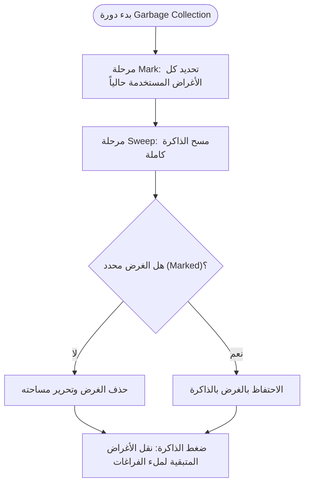

# المحاضرة 3 — Memory Management 1 (إدارة الذاكرة 1)
> **المادة:** لغات البرمجة (القسم العملي) | **الموضوع:** كيف تُدار الذاكرة داخل الأنظمة، وكيف تتعامل كل لغة برمجة (C++, Java, Python, Rust, C#, JavaScript) مع تخصيص وتحرير المساحات في الذاكرة

---

## الجزء الأول: ملخص منظم (اقرأ قبل المحاضرة!)

### 📍 عن هذه المحاضرة
> بتشرح كيف تُدار الذاكرة داخل الحاسوب وقت تشغيل البرنامج — من المسجلات (`Registers`) والمكدس (`Stack`) لتمرير الوسطاء، لحتى الكومة (`Heap`)، وبعدين كيف كل لغة برمجة (C++, Java, Python, Rust, C#, JavaScript) بتاخد قرار مختلف بموضوع مين المسؤول عن تحرير الذاكرة.

### 🎯 ستتعلم
- الفرق بين `Registers` و`Stack` و`Heap` ومتى بتستخدم كل وحدة تخزين
- مفهوم `Scope` (مجال الرؤية) وكيف بيختلف تصرف اللغات فيه، خصوصاً `Python`
- إدارة الذاكرة اليدوية بـ `C++` ومشكلة `Memory Leak`، والحل عبر `smart pointers`
- إدارة الذاكرة الآلية عبر `Garbage Collection` بـ `Java` و`C#` و`JavaScript`
- نظام `Ownership` و`Borrowing` الفريد بلغة `Rust` اللي بيمنع أخطاء الذاكرة وقت الترجمة

### 📚 المتطلبات السابقة
- أساسيات المتحولات والدوال (Functions/Parameters) بأي لغة برمجة — لأنو المحاضرة بتبني عليها مباشرة
- فكرة عامة عن الـ `Compiler` مقابل `Interpreter` — لفهم ليش بعض القواعد (متل قواعد Rust) بتنفذ وقت الترجمة مش وقت التشغيل

### 💡 الأفكار الرئيسية
1. **المسجلات أسرع من المكدس، والمكدس أسرع من الكومة:** كل ما نزلنا مستوى (Registers → Stack → Heap) صار التخزين أبطأ بس أكبر وأكثر مرونة.
2. **الـ Stack منظم Last In First Out وثابت الحجم وقت الترجمة غالباً، بينما الـ Heap ديناميكي:** هاد الفرق هو أساس كل قرارات إدارة الذاكرة اللي جاية بالمحاضرة.
3. **كل لغة عندها فلسفة مختلفة لمين "يحرر" ذاكرة الـ Heap:** يدوي (C++)، عد مراجع (Python)، Garbage Collector (Java/C#/JS)، أو نظام Ownership يتحقق منه المترجم (Rust).

### 🔗 كيف تتصل هذه المحاضرة بالمحاضرات الأخرى؟
- **السابقة:** المحاضرات الأولى علّمتك بنية اللغات العامة (Compiled مقابل Interpreted، الـ Scopes الأساسية) ← هلق عم نبني عليها لنفهم وين بالضبط بتنخزن البيانات
- **القادمة:** هذا الأساس رح يُستخدم بمحاضرة "إدارة الذاكرة 2" لشرح تفاصيل أعمق متل الـ `Generational GC` أو `Cycle Detection` بالتفصيل

### ⚠️ الأخطاء الشائعة الواجب تجنبها
- ❌ الاعتقاد إنو كل اللغات عندها Garbage Collector — لغات متل `C++` و`Rust` لأ
- ❌ الخلط بين `Scope` (مجال الرؤية النصي بالكود) وبين `Lifetime` (متى فعلياً تتحرر الذاكرة) — مو نفس الشي دايماً
- ❌ الاعتقاد إنو `Reference Counting` بلغة Python أو C# هو نفسه `Mark & Sweep` — هذول تقنيتين مختلفتين، وبعض اللغات بتستخدم الاثنين مع بعض

---

## الجزء الثاني: الشرح التفصيلي (سطر بسطر / فقرة بفقرة)

### 1. بنى الذاكرة الأساسية

<!-- @render: {type: "prose-first", visualization: "none", coverage: "100%"} -->
<!-- @connectivity: {prerequisite: "none"} -->

#### 📍 أين نحن الآن؟
هاد أول موضوع بالمحاضرة، عم نحدد فيه النقاط الأساسية المرتبطة بإدارة الذاكرة قبل ما نغوص بالتفاصيل.

#### 💡 الفكرة الأساسية
**إدارة الذاكرة بتتمحور حول نقطتين رئيسيتين: كيف بتنمرر وسطاء التوابع (Parameters)، ووين بتنخزن المتحولات (متغيرات، مؤشرات، أغراض...)**

---

#### 📖 الشرح
لما بيشتغل برنامج، مش كل المتحولات بتنخزن بنفس المكان أو بنفس الطريقة. في مستويات مختلفة من "أماكن التخزين" داخل الحاسوب، وكل مستوى إله سرعة وحجم وطريقة إدارة مختلفة. المحاضرة عم تحدد نقطتين محوريتين رح تُبنى عليهم كل الأمثلة الجاية: أول شي، كيف اللغة بتمرر الوسطاء (Parameters) لما تستدعي تابع (Function) — لأنو هاد بيحدد إذا التابع عم ياخد نسخة من القيمة، ولا عم ياخد إشارة (Reference) للمكان الأصلي. تاني شي، وين بالضبط بتنخزن المتحولات المختلفة — أرقام بسيطة، مؤشرات، أغراض (Objects) — لأنو مكان التخزين هو اللي بيحدد شو مصير هالبيانات لما تخلص صلاحية استخدامها.

هالنقطتين مرتبطتين ببعض بشكل مباشر: تمرير الوسطاء بيعتمد بشكل أساسي على المكدس (Stack)، بينما تخزين الأغراض المعقدة أو غير محددة الحجم بيعتمد على الكومة (Heap). يعني قبل ما نفهم أي لغة برمجة بالتفصيل، لازم نبني صورة واضحة عن هالبنية التحتية المشتركة بين كل اللغات — لأنو كل لغة بعدين بتاخد قرارات مختلفة فوق نفس الأساس هاد.

#### 💡 التشبيه:
> تخيل مطبخ مطعم: في طاولة صغيرة عالباب (Registers) للأغراض اللي بتستخدمها فوراً وبكل لحظة، في رفوف منظمة بالترتيب (Stack) للمكونات اللي بتستخدمها بترتيب معين وبتحتاجها لمدة قصيرة، وفي مستودع كبير بالخلف (Heap) للمكونات الكبيرة أو اللي مش عارف قديش رح تحتاجها.
> **وجه الشبه:** الطاولة الصغيرة = Registers (سريعة وصغيرة)، الرفوف = Stack (منظم ومؤقت)، المستودع = Heap (كبير ومرن بس أبطأ بالوصول).

#### 🎯 الملخص السريع
- إدارة الذاكرة بتتمحور حول: تمرير الوسطاء (Parameters) ومكان تخزين المتحولات
- في أكثر من مستوى تخزين: Registers، Stack، Heap
- كل مستوى إله دور مختلف رح نفصّله بالأقسام الجاية

#### 📚 التطبيق
هالأساس رح يُستخدم بكل الأقسام الجاية — خصوصاً لما نقارن كيف كل لغة (C++, Java, Python...) بتقرر مين بيحرر ذاكرة الـ Heap.

#### ⚠️ أخطاء شائعة

#### الفهم الخاطئ ❌:
الاعتقاد إنو "الذاكرة" شي واحد موحّد بالحاسوب.

#### الفهم الصحيح ✅:
الذاكرة مقسومة لمستويات (Registers, Stack, Heap...) وكل مستوى إله خصائص مختلفة بالسرعة والحجم وطريقة الإدارة.

#### 📄 النص الأصلي من المحاضرة
<details>
<summary>عرض النص الأصلي (coverage: 100%)</summary>

**النص الأصلي يقول:**
> توجد نقاط مختلفة تتعلق بإدارة الذاكرة أهمها: تمرير الوسطاء (البارميترات) للتوابع، أين يتم تخزين المتحولات (مؤشرات، أغراض... الخ)

**ملاحظة على التغطية:**
- ✓ تم شرح: كلا النقطتين المذكورتين بالكامل
- ⚠️ غير مشروح بالكامل: لا شيء
- ℹ️ إضافة من الدليل: التشبيه بالمطبخ (شرح زيادة للفهم)

</details>

---

### 1.1. تمرير وسطاء التوابع عبر المسجلات (Registers)

<!-- @render: {type: "prose-first", visualization: "none", coverage: "95%"} -->
<!-- @connectivity: {prerequisite: "section_1"} -->

#### 💡 الفكرة الأساسية
**المسجلات (`Registers`) هي أماكن تخزين صغيرة جداً وسريعة جداً داخل المعالج نفسه، بتستخدم لتمرير وسطاء التوابع بأبسط الحالات**

---

#### 📖 الشرح
المسجلات هي أسرع جزء بالحاسوب كامل لتخزين البيانات، لأنها فعلياً موجودة جوا المعالج (CPU) نفسه، مش بالذاكرة الخارجية. لما بدك تمرر وسيط بسيط (متل رقم صحيح) لتابع، أبسط طريقة إنك تحطه بمسجل، والتابع المستدعى بيقرأه من هناك مباشرة — سرعة فائقة بدون أي تأخير بالوصول للذاكرة.

بس المشكلة الأساسية هون هي **العدد المحدود** من المسجلات المتوفرة. المحاضرة بتوضح إنو معالجات `x86` (32 بت) عندها 4 مسجلات بحجم 32 بت، 4 بحجم 16 بت، و8 بحجم 8 بت — وما بتقدر تستخدمها كلها بنفس الوقت. بمعالجات `x64` العدد أكبر شوي (4 مسجلات 64 بت بدل 32) بس بردو محدود. يعني لو تابع عنده أكتر من عدد المسجلات المتوفرة من الوسطاء، ما في مكان يحطهم فيه بالمسجلات.

هون بالضبط بتطلع أهمية الفكرة التالية بالمحاضرة: المسجلات لحالها مش كافية، فلازم اعتماد على بنية تانية أكبر وأكثر مرونة — وهي المكدس (`Stack`) — عشان تتعامل مع أي عدد وأي نوع من الوسطاء.

#### 💡 التشبيه:
> المسجلات متل جيبك — بتحط فيه أشياء بتحتاجها فوراً وبكل ثانية (موبايل، مفاتيح)، بس ما بتقدر تحط فيه كل أغراضك.
> **وجه الشبه:** الجيب = المسجلات (سريع الوصول بس مساحته محدودة جداً)، والحقيبة = المكدس (مساحة أكبر بس وصول أبطأ شوي).

#### 🎯 الملخص السريع
- المسجلات = أماكن تخزين صغيرة جداً وسريعة جداً جوا المعالج
- تُستخدم لتمرير الوسطاء بكل بساطة، بس عددها محدود (مثلاً 4 مسجلات 32 بت بمعالجات x86)
- ما بتقدر تستخدمها كلها بنفس الوقت — هاد قيدها الأساسي

#### 📚 التطبيق
هالقيد هو السبب اللي رح يوصلنا للحاجة إلى المكدس (Stack) بالقسم الجاي.

#### ⚠️ أخطاء شائعة

#### الفهم الخاطئ ❌:
الاعتقاد إنو المسجلات كافية لتمرير كل أنواع الوسطاء بأي عدد.

#### الفهم الصحيح ✅:
المسجلات محدودة العدد وبتُستخدم فقط بالحالات البسيطة جداً — أغلب التوابع الحقيقية بتحتاج المكدس.

#### 📄 النص الأصلي من المحاضرة
<details>
<summary>عرض النص الأصلي (coverage: 95%)</summary>

**النص الأصلي يقول:**
> لتمرير وسطاء التابع نلجأ وبكل بساطة للمسجلات. المقصود بـ "المسجلات (Registers)": هي أماكن تخزين صغيرة جداً وسريعة جداً داخل المعالج نفسه. أسرع جزء في الحاسوب، تُستخدم لتخزين البيانات أثناء التنفيذ الفوري لكن المشكلة الأساسية هنا هي محدودية المسجلات. معالجات x86 لدينا: 4 مسجلات 32 بت، 4 مسجلات 16 بت، 8 مسجلات 8 بت، لا يمكن استخدامها كلها معاً. معالجات x64 لدينا: 4 مسجلات 64 بت، 4 مسجلات 32 بت، 4 مسجلات 16 بت، 8 مسجلات 8 بت، لا يمكن استخدامها كلها معاً.

**ملاحظة على التغطية:**
- ✓ تم شرح: تعريف المسجلات، سرعتها، مشكلة العدد المحدود، أرقام x86/x64
- ⚠️ غير مشروح بالكامل: التفاصيل الدقيقة لأسماء كل مسجل (AX, BX...) — مش مذكورة أصلاً بالمحاضرة
- ℹ️ إضافة من الدليل: تشبيه الجيب (شرح زيادة للفهم)

</details>

---

### 1.2. دور المكدس (Stack) في تمرير الوسطاء

<!-- @render: {type: "code-first", visualization: "none", coverage: "95%"} -->

#### 💡 الفكرة الأساسية
**المكدس (`Stack`) هو بنية بيانات منظمة بشكل Last In First Out بتخزن وسطاء التوابع وعنوان العودة، وبتنظم استدعاءات التوابع بشكل هرمي**

---

#### 💻 الكود:
```cpp
void func(int p1, int p2){
    cout << p1+p2 << endl;
}
int main(){
    int x=9, y=8;
    fun(x, y);
    cout << x << endl;
}
```

#### شرح كل سطر:
1. `void func(int p1, int p2)` → تعريف تابع `func` باثنين وسطاء `p1` و`p2` — هدول رح ينخزنوا على المكدس لما يُستدعى التابع
2. `cout << p1+p2 << endl;` → التابع بيقرأ `p1` و`p2` من المكدس (النسخ اللي انحطت فوق `frame` التابع) ويطبع مجموعهم
3. `int x=9, y=8;` → متحولات محلية بـ `main` — هاي بردو موجودة على المكدس بمساحة `main` الخاصة فيها
4. `fun(x, y);` → استدعاء التابع؛ هون بينشئ المكدس `frame` جديد فوق `frame` الـ `main`، وبينحط فيه: نسخة من `x`، نسخة من `y`، وعنوان العودة (`Return Address`)
5. `cout << x << endl;` → بعد ما يخلص `func`، الـ `frame` تبعه يتشال من فوق المكدس، ونرجع لـ `frame` الـ `main` — وبيطبع `x` الأصلية (لسا 9، ما تغيّرت)

**الناتج المتوقع (لقطة الشاشة):**
> `17` (ناتج `func`)، وبعدها `9` (قيمة `x` الأصلية بـ `main` لم تتأثر)

#### 📖 الشرح
المكدس هو الحل لمشكلة محدودية المسجلات: بدل ما نحاول نحشر كل الوسطاء بعدد محدود من المسجلات، عم نستخدم بنية بيانات بالذاكرة اسمها Stack منظمة بمبدأ **Last In First Out (LIFO)** — يعني آخر شي انحط فوقها هو أول شي بينشال منها. كل مرة بيستدعى تابع، بينبني فوق المكدس ما يسمى بـ`frame` أو "إطار" خاص فيه، وفيه: نسخ الوسطاء الممررة، والمتحولات المحلية داخل التابع، وعنوان العودة (`Return Address`) اللي بيقول للبرنامج وين يرجع يكمل تنفيذ لما التابع يخلص شغله.

هاد التنظيم الهرمي مهم جداً: لما تابع A يستدعي تابع B، وB يستدعي تابع C، بينبنى 3 إطارات فوق بعض بالترتيب A ثم B ثم C. لما C يخلص، إطاره يتشال وبنرجع لـ B، وهكذا. هاد بالضبط اللي بيسمح بالـ **recursion** (الاستدعاء الذاتي) يشتغل صح — كل استدعاء إله إطار مستقل بمتحولاته الخاصة، حتى لو كان نفس التابع.

نقطة مهمة جداً بالمثال: لما نمرر `x` و`y` كوسطاء عاديين (Pass by Value)، التابع `func` بياخد **نسخة** منهم بإطاره الخاص، مش المتحول الأصلي. فأي تعديل جوا `func` على `p1` أو `p2` ما بينعكس أبداً على `x` و`y` الأصليين بـ `main`. هاد الشي هو اللي بيفسر ليش طباعة `x` بعد استدعاء `func` بترجع تطبع القيمة الأصلية (9) وليس أي قيمة معدلة.

تاريخياً، المحاضرة بتذكر إنو هالطريقة (استخدام المكدس لتمرير الوسطاء وتنظيم الاستدعاءات) اقترحتها لغة `Pascal` من زمان، وصارت بعدين الأساس اللي بنيت عليه أغلب اللغات الحديثة متل `C++` و`Java` وغيرهم.

#### 🎯 الملخص السريع
- المكدس منظم بمبدأ Last In First Out (LIFO)
- كل استدعاء تابع بيبني `frame` فيه: الوسطاء، المتحولات المحلية، وعنوان العودة
- Pass by Value = نسخة مستقلة على المكدس، أي تعديل جواها ما بيأثر على الأصل

#### 📚 التطبيق
فهم المكدس ضروري لفهم `Scopes` بالقسم الجاي، ولفهم ليش الـ Heap لازم كان بشكل منفصل (لأنو المكدس محدود ومؤقت جداً).

#### ⚠️ أخطاء شائعة

#### الفهم الخاطئ ❌:
الاعتقاد إنو تمرير `x` كوسيط بيعطي التابع وصول مباشر للمتحول الأصلي.

#### الفهم الصحيح ✅:
بـ Pass by Value، التابع بياخد نسخة مستقلة على إطاره الخاص بالمكدس — التعديل جوا التابع ما بينعكس على الأصل خارجه.

#### 📄 النص الأصلي من المحاضرة
<details>
<summary>عرض النص الأصلي (coverage: 95%)</summary>

**النص الأصلي يقول:**
> لغات البرمجة تسمح بتمرير عدد كبير من الوسائط (Parameters) بأطوال وأنواع مختلفة. المسجلات وحدها لا تكفي لمعالجة ذلك يتم الاعتماد على المكدس (Stack). دور المكدس: تخزين وسطاء الدوال عند الاستدعاء، حفظ عنوان العودة (Return Address) بعد انتهاء الدالة، تنظيم استدعاءات الدوال بشكل هرمي (Last In First Out). تم اقتراح هذه الطريقة لتمرير الوسطاء ضمن لغة Pascal.

**ملاحظة على التغطية:**
- ✓ تم شرح: تعريف المكدس، مبدأ LIFO، محتويات الـ frame، أصل الفكرة من Pascal
- ⚠️ غير مشروح بالكامل: تفاصيل بنية الصورة الأصلية (الأعمدة y, x, return address) — مذكورة بشكل مبسط بالشرح والكود
- ℹ️ إضافة من الدليل: توضيح Pass by Value وأثره، وربطها بالـ recursion (شرح زيادة للفهم)

</details>

---

### 2. تخزين المتحولات باستخدام الكومة (Heap)

<!-- @render: {type: "prose-first", visualization: "none", coverage: "100%"} -->

#### 📍 أين نحن الآن؟
خلصنا الحديث عن المسجلات والمكدس، هلق منتقلين لمستوى التخزين التالت والأخير: الكومة (`Heap`) — اللي هي أساس كل نقاش إدارة الذاكرة بباقي المحاضرة.

#### ⬅️ الربط مع السابق
المكدس منظم وسريع بس محدود الحجم ومؤقت جداً (بينهدم إطاره أول ما التابع يخلص). لو بدنا بيانات تعيش أطول من عمر التابع، أو حجمها مش معروف مسبقاً، لازم مكان تاني — وهون بتدخل الكومة.

#### 💡 الفكرة الأساسية
**الكومة (`Heap`) هي جزء من ذاكرة الحاسوب بيسمح بتخصيص وإلغاء تخصيص الذاكرة بشكل ديناميكي أثناء تشغيل البرنامج، على عكس المكدس الثابت**

---

#### 📖 الشرح
الكومة هي منطقة ذاكرة مخصصة لتخزين البيانات اللي بدنا نتحكم بعمرها بأنفسنا، أو اللي حجمها غير ثابت وغير معروف وقت الترجمة. بعكس المكدس اللي بينهدم تلقائياً أول ما التابع يخلص، الكومة بتضل موجودة لحد ما نحررها إحنا (أو آلية معينة باللغة تحررها). هاد الفرق الجوهري — التحكم اليدوي بعمر البيانات — هو سبب وجود الكومة أصلاً: مش كل بيانة بدنا تختفي أول ما نخرج من التابع اللي أنشأها.

الوصول لبيانات الكومة بيصير حصراً عبر **مؤشرات (Pointers/References)**، مش عبر اسم مباشر متل المتحولات المحلية بالمكدس. هاد معناه إنو ممكن توصل لنفس بيانة الكومة من أي مكان بالبرنامج طالما عندك المؤشر الصح إلها — ميزة كبيرة بالمرونة، بس بتجيب معها تكلفة: الوصول عبر مؤشرات أبطأ شوي من المتحولات المحلية بالمكدس، لأنو في خطوة إضافية (اتباع المؤشر لحتى توصل للبيانة الفعلية).

الكومة بتسمح بتخزين ثلاث فئات أساسية من البيانات: **المتغيرات الديناميكية** (متحول بحجم ثابت بس عمره متحكم فيه يدوياً)، **المصفوفات الديناميكية** (حجمها بيتحدد وقت التشغيل مش وقت الترجمة)، و**الكائنات (Objects)** بلغات البرمجة الكائنية التوجه. هالثلاث فئات هني بالضبط اللي رح نشوف كيف كل لغة (C++, Java, Python, Rust...) بتديرهم بطريقتها الخاصة بباقي المحاضرة.

نقطة أخيرة مهمة: بما إنو الكومة ديناميكية ومرنة هيك، صار لازم يكون في **قرار واضح** بكل لغة: مين المسؤول عن تحرير هالذاكرة لما ما نعود نحتاجها؟ الجواب عن هالسؤال بالضبط هو محور باقي المحاضرة — وكل لغة جاوبت عليه بشكل مختلف.

#### 💡 التشبيه:
> الكومة متل مستودع تخزين عام (Storage Unit) بره البيت — بتحجز مساحة فيه لما تحتاج، وبتقدر توصلها بس عن طريق عنوانها (مش موجودة بجيبك أو بيتك مباشرة)، وبتضل مأجرة (محجوزة) لحد ما تلغي الحجز بنفسك.
> **وجه الشبه:** عنوان المستودع = المؤشر (Pointer)، والمحتويات جواه = البيانة الفعلية بالـ Heap.

#### 🎯 الملخص السريع
- الكومة تسمح بتخصيص/إلغاء تخصيص ديناميكي أثناء التشغيل، بعكس المكدس الثابت
- الوصول للكومة يصير حصراً عبر مؤشرات — أبطأ شوي من متحولات المكدس المحلية
- الكومة تخزن: المتغيرات الديناميكية، المصفوفات الديناميكية، والكائنات (Objects)

#### 📚 التطبيق
كل الأقسام الجاية (Scopes، C++، Java، Python، Rust...) رح تدور حول سؤال واحد: مين المسؤول عن تحرير ذاكرة الكومة، وكيف؟

#### ⚠️ أخطاء شائعة

#### الفهم الخاطئ ❌:
الاعتقاد إنو الكومة والمكدس نفس الشي بس بأسماء مختلفة.

#### الفهم الصحيح ✅:
المكدس ثابت ومؤقت وسريع الوصول المباشر، بينما الكومة ديناميكية وأطول عمراً وبتحتاج مؤشر للوصول إلها — وهاد الفرق هو أساس كل نقاش إدارة الذاكرة.

#### 📄 النص الأصلي من المحاضرة
<details>
<summary>عرض النص الأصلي (coverage: 100%)</summary>

**النص الأصلي يقول:**
> الكومة هي جزء من ذاكرة الكمبيوتر يُستخدم لتخزين البيانات التي نحتاجها أثناء تشغيل البرنامج، خصوصًا البيانات التي حجمها غير ثابت أو نريد التحكم بعمرها. الكومة تسمح بتخصيص وإلغاء تخصيص الذاكرة بشكل ديناميكي أثناء تشغيل البرنامج، بخلاف المكدس الثابت. يمكن طلب جزء من الكومة وتحريره عند الحاجة، وهي ذاكرة غير مرتبطة بدالة معينة ويمكن الوصول إليها من أي مكان عبر المؤشرات. الوصول إلى بيانات الكومة يتم عبر مؤشرات، مما يجعلها أبطأ قليلًا من المتغيرات المحلية في المكدس بسبب مرجعية الذاكرة. الكومة تسمح بتخزين: المتغيرات الديناميكية، المصفوفات الديناميكية، الكائنات (Objects)

**ملاحظة على التغطية:**
- ✓ تم شرح: كل النقاط المذكورة بالكامل
- ⚠️ غير مشروح بالكامل: لا شيء
- ℹ️ إضافة من الدليل: تشبيه المستودع، والربط مع سؤال "مين بيحرر الذاكرة" اللي رح يحكم باقي المحاضرة

</details>

---

### 3. مجالات الرؤية (Scopes)

<!-- @render: {type: "code-first", visualization: "none", coverage: "100%"} -->

#### 📍 أين نحن الآن؟
بعد ما فهمنا Stack و Heap، هلق رح نشوف مفهوم مرتبط فيهم بشكل مباشر: مجال الرؤية (Scope) — يعني وين بالضبط بيكون المتحول "مرئي" ومتاح للاستخدام بالكود.

#### 💡 الفكرة الأساسية
**مجال الرؤية (`Scope`) هو كتلة من الكود عندها متحولات محلية مستقلة، تُنشأ عند الدخول للمجال وتُحذف عند الخروج منه — لكن ليس كل اللغات بتعرّف الـ Scope بنفس الطريقة**

---

#### 💻 الكود:
```cpp
int main(){
  for(int i=0; i<10; i++)
    {int y=i;  //works
      {int c=5;  //works
      }cout << c; //will not work
    }cout << y; //will not work
  }}
```

#### شرح كل سطر:
1. `for(int i=0; i<10; i++)` → بداية حلقة، `i` متحول محلي لمجال الرؤية تبع الحلقة نفسها
2. `{int y=i; //works}` → مجال رؤية جديد جوا الحلقة، `y` بينشأ هون وصالح الاستخدام جوا هالمجال
3. `{int c=5; //works}` → مجال رؤية متداخل أعمق، `c` صالح جوا هالمجال فقط
4. `cout << c; //will not work` → هون طلعنا برا مجال `c` — الكومبايلر رح يرفض لأنو `c` انحذف أول ما خرجنا من `{ }` تبعه
5. `cout << y; //will not work` → نفس المبدأ، `y` انحذف أول ما خرجنا من مجاله

**الناتج المتوقع (لقطة الشاشة):**
> خطأ ترجمة (`Compile Error`) على السطرين الأخيرين — `c` و`y` غير معرّفين خارج مجالهم

#### 📖 الشرح
مجال الرؤية (Scope) هو المساحة النصية بالكود اللي فيها متحول معين "موجود" ومتاح للاستخدام. القاعدة العامة: المتحولات المحلية بتنشأ لما ندخل مجال رؤية جديد، وبتنحذف لما نطلع منه — تماماً متل إطار المكدس اللي حكينا عنه قبل شوي، لأنو فعلياً هاد اللي عم يصير تحت الغطا: كل `{ }` بيمثل مستوى جديد بالمكدس.

بلغات متل `C++` و`Java` و`C#` و`JavaScript`، تحديد مجال الرؤية بيصير بشكل صريح عبر الأقواس `{ }` — يعني الكومبايلر شايف بالضبط وين يبدأ ووين ينتهي كل مجال. هالوضوح هو اللي بيخلي المثال فوق يعطي خطأ ترجمة واضح: بمجرد ما تسكر `}`، أي متحول انعرّف جواها بيصير "مو موجود" بالنسبة للكود اللي بعدها.

الموضوع بيختلف حسب نوع المجال: إذا كان مجال الرؤية تبع تابع (`Function scope`)، المتحولات المحلية بتنشأ كل استدعاء وبتندمر عند الانتهاء — يعني كل استدعاء تابع إله نسخته الخاصة المستقلة. أما إذا كان مجال الرؤية تبع حلقة (`Loop scope`)، فالمتحولات بتنشأ مع أول دخول للحلقة وبتندمر بعد انتهاء الحلقة **ما لم يتم تعريفها بشكل متكرر داخل جسم الحلقة نفسه** — يعني إذا عرّفت متحول جوا جسم الحلقة (متل `y` بالمثال)، هو بينعاد إنشاؤه وحذفه بكل تكرار.

النقطة الأهم بالقسم هاد — واللي رح تنكشف بالتفصيل بالأقسام الجاية — إنو مش كل اللغات متفقة على هالتعريف. لغة `Python` مثلاً **ما عندها مفهوم Scope للحلقات أصلاً**، وهاد بيغيّر سلوك الكود بشكل جذري مقارنة بـ C++/Java، رح نشوفه بالقسم 3.1.

#### 🎯 الملخص السريع
- Scope = مجال نصي بالكود عنده متحولات محلية مستقلة، بتنشأ عند الدخول وتنحذف عند الخروج
- بلغات C++/Java/C#/JavaScript يتحدد بالأقواس `{ }` صراحة
- بلغة Python يتحدد عن طريق المسافات (`Indentation`) بدل الأقواس

#### 📚 التطبيق
الأقسام الجاية (3.1، 3.2) رح توضح حالات خاصة مهمة جداً بالامتحان: Python والحلقات، وJavaScript وstrict mode.

#### ⚠️ أخطاء شائعة

#### الفهم الخاطئ ❌:
الاعتقاد إنو كل لغات البرمجة بتتعامل مع الـ Scope بنفس الطريقة تماماً.

#### الفهم الصحيح ✅:
كل لغة عندها قواعد مختلفة لتحديد بداية ونهاية الـ Scope، وأحياناً (متل Python) بعض الكتل أصلاً ما عندها Scope خاص فيها.

#### 📄 النص الأصلي من المحاضرة
<details>
<summary>عرض النص الأصلي (coverage: 100%)</summary>

**النص الأصلي يقول:**
> تُعرّف مجالات الرؤية (Scopes) على أنها كتل من الكود تمتلك متغيرات محلية مستقلة. في لغات مثل C++ و Rust و Java و C# و JavaScript يتم تحديدها باستخدام الأقواس {}. في لغة Python يتم تحديدها عن طريق المسافات (Indentation) بدل الأقواس. يتم إنشاء المتغيرات المحلية عند الدخول إلى مجال الرؤية وتُحذف عند الخروج منه. إذا تم الدخول إلى مجال الرؤية بشكل متكرر: إذا كان مجال الرؤية تابع (Function): يتم إنشاء المتغيرات عند كل استدعاء وتُدمّر عند الانتهاء. إذا كان مجال الرؤية حلقة (Loop): يتم إنشاء المتغيرات مع أول دخول وتُدمّر بعد انتهاء الحلقة، ما لم يتم تعريفها داخل جسم الحلقة بشكل متكرر.

**ملاحظة على التغطية:**
- ✓ تم شرح: كل النقاط الخمس بالكامل مع ربطها بمفهوم المكدس
- ⚠️ غير مشروح بالكامل: لا شيء
- ℹ️ إضافة من الدليل: التمهيد لحالة Python الخاصة (شرح زيادة للفهم)

</details>

---

### 3.1. حالة خاصة: Python وحلقات بلا مجال رؤية

<!-- @render: {type: "code-first", visualization: "none", coverage: "100%"} -->

#### 💡 الفكرة الأساسية
**لغة `Python` لا تعرّف مجال رؤية خاصاً بالحلقات — المتحول المُعرّف جوا الحلقة يضل مرئياً حتى برا الحلقة، لكنه غير مرئي برا التابع (Function)**

---

#### 💻 الكود:
```python
def z():
    x=99

print(x)  # this doesn't work

for i in range(1,10):
    x=i

print(x)  # this works
```

#### شرح كل سطر:
1. `def z(): x=99` → `x` معرّف جوا مجال رؤية التابع `z` — هاد مجال رؤية حقيقي بلغة Python
2. `print(x)  # this doesn't work` → خطأ، لأنو `x` محلي جوا `z` فقط وما ظهر (التابع `z` أصلاً ما انستدعى، وحتى لو استُدعي، `x` بضل داخلي)
3. `for i in range(1,10): x=i` → `x` معرّف جوا جسم الحلقة، بدون أي مجال رؤية خاص بالحلقة نفسها
4. `print(x)  # this works` → هون شغال! لأنو Python ما عندها Scope للحلقات، فـ`x` صار متحول متاح خارج الحلقة كمان

**الناتج المتوقع (لقطة الشاشة):**
> السطر 2 بيرمي `NameError`، بينما السطر 4 بيطبع `9` بنجاح

#### 📖 الشرح
هاد المثال بالضبط هو نقطة اختبار كلاسيكية بالامتحانات، لأنو بيكسر توقع أي حدا متعود على C++ أو Java. بهالتاني اللغات، أي متحول تعرّفه جوا `{ }` تبع حلقة بيموت أول ما الحلقة تخلص. بس بايثون مختلفة جذرياً: **الحلقات (for/while) ما عندها مجال رؤية خاص فيها إطلاقاً** — يعني أي متحول تعرّفه جوا جسم الحلقة (زي `x=i`) هو فعلياً متحول عادي بمجال الرؤية اللي الحلقة نفسها موجودة فيه (هون: المستوى الأعلى أو `module scope`).

السبب وراء هالسلوك مش عشوائي: Python بتعتبر إنو الحلقات مجرد تكرار لتعليمات موجودة أصلاً بنفس المجال المحيط فيها، مش كيان مستقل إله متحولاته الخاصة. هاد بيختلف تماماً عن التوابع (Functions)، اللي فعلاً عندها مجال رؤية حقيقي ومستقل — أي متحول تعرّفه جوا `def` ما بيقدر حدا يوصله من برا التابع، بالظبط متل ما شفنا بالسطر التاني بالمثال (`print(x)` بره `z()` بيعطي خطأ).

الفرق العملي المهم هون: لو نسيت هالتفصيلة وكتبت كود فيه متحول counter جوا حلقة، وبعدين استخدمته برا الحلقة بقصد أو بدون قصد، الكود رح يشتغل من غير أي خطأ — بعكس لو كنت بتوقع سلوك C++ اللي كان يرمي خطأ ترجمة فوراً. هالفرق مصدر أخطاء منطقية صامتة (Silent Bugs) بلغة Python، لأنو ما في رسالة خطأ تنبهك.

#### 🎯 الملخص السريع
- بايثون: الحلقات (for/while) لا تملك Scope خاص — المتحول جوا الحلقة بيضل متاح برا الحلقة
- بايثون: التوابع (Functions) عندها Scope حقيقي — المتحول المحلي جواها غير مرئي من برا
- السبب: Python بتعتبر جسم الحلقة امتداد لنفس المجال المحيط، مش كيان مستقل

#### 📚 التطبيق
هاد الفرق بيصير أهم لما نقارنه بـ JavaScript بالقسم الجاي، اللي عندها سلوك مختلف كمان حسب وضع التشغيل.

#### ⚠️ أخطاء شائعة

#### الفهم الخاطئ ❌:
الاعتقاد إنو Python بتتصرف متل C++ وبتحذف متحول الحلقة أول ما الحلقة تخلص.

#### الفهم الصحيح ✅:
Python ما عندها مجال رؤية خاص بالحلقات إطلاقاً، فالمتحول بيضل موجود ومتاح حتى بعد ما الحلقة تخلص — بعكس التوابع اللي فعلاً عندها Scope مستقل.

#### 📄 النص الأصلي من المحاضرة
<details>
<summary>عرض النص الأصلي (coverage: 100%)</summary>

**النص الأصلي يقول:**
> في لغة Python، المتحول ضمن الحلقة مرئي خارج الحلقة. هذا السبب يتعلق بأن لغة Python لا تعرف مجال رؤية للحلقات وبالتالي يمكن التعامل مع x خارج جسم الحلقة ولكن ليس خارج جسم التابع.

**ملاحظة على التغطية:**
- ✓ تم شرح: السلوك بالكامل، السبب، والفرق مع مجال رؤية التوابع
- ⚠️ غير مشروح بالكامل: لا شيء
- ℹ️ إضافة من الدليل: النقاش حول الأخطاء المنطقية الصامتة الناتجة (شرح زيادة للفهم)

</details>

---

### 3.2. حالة خاصة: JavaScript و strict/non-strict mode

<!-- @render: {type: "code-first", visualization: "none", coverage: "100%"} -->

#### 💡 الفكرة الأساسية
**بلغة `JavaScript`، سلوك متحول الحلقة بيختلف حسب وضع التشغيل: `strict mode` بيمنع المتحولات غير المعرّفة، بينما `non-strict mode` بيسمح بإنشاء متحول عام (`global`) تلقائياً**

---

#### 💻 الكود:
```javascript
for(let i=0; i<5; i++)
    x = i;

console.log(x);
```

#### شرح كل سطر:
1. `for(let i=0; i<5; i++)` → `i` معرّف بـ `let` وهو محلي بمجال رؤية الحلقة نفسها فقط
2. `x = i;` → **لاحظ**: `x` هون ما انعرّف بـ `let` أو `const` أو `var` — تم إسناد قيمة له مباشرة بدون تصريح
3. `console.log(x);` → طباعة `x` من برا الحلقة

**الناتج المتوقع (لقطة الشاشة):**
> بـ `non-strict mode` (الوضع الافتراضي بنموذج ES6): بيطبع `4`. بـ `strict mode`: بيرمي خطأ `ReferenceError`

#### 📖 الشرح
هاد المثال قريب من مثال Python بس مش نفس السبب تماماً — والمحاضرة بتنبه صراحة إنو الفرق "بسيط" بس مهم. المتحول `x` بالمثال **ما انعرّف بشكل صريح** بأي مجال رؤية (ما فيه `let` ولا `var` ولا `const` قبله) — وهاد نقطة الاختلاف الجوهرية عن Python، لأنو بـPython، `x` تم تعريفه فعلياً (بس بمجال أوسع من المتوقع)، أما هون `x` أصلاً ما انعرّف كمتحول رسمي.

هون بتدخل JavaScript بميزة فريدة: طريقة تعاملها مع المتحولات غير المعرّفة بتعتمد على **وضع التشغيل**. بالوضع **غير الصارم** (`non-strict mode`)، وهو الوضع الافتراضي التاريخي بمعظم المتصفحات، JavaScript بتسمح بإنشاء متحول عام (`global`) تلقائياً أول ما تحاول تسند له قيمة بدون تصريح — وهاد يفسر ليش الكود فوق بيشتغل ويطبع `4` بهالوضع.

بالمقابل، بالوضع **الصارم** (`strict mode`) — اللي بينفعل عادة بكتابة `"use strict";` بأول الملف، أو تلقائياً بنموذج **ES6** (النموذج الافتراضي المعرّف حديثاً) — هالسلوك ممنوع تماماً، وأي محاولة لاستخدام متحول غير معرّف صراحة بترمي خطأ `ReferenceError` فوراً. هاد التصميم مو صدفة: مطورين JavaScript لاحظوا إنو السماح بإنشاء متحولات عامة تلقائياً هو مصدر أخطاء خطيرة (Bugs) بمشاريع كبيرة، فصمموا الـ strict mode كطبقة حماية إضافية.

النقطة العملية المهمة للامتحان: نفس الكود بالضبط ممكن يعطي نتيجتين مختلفتين تماماً (طباعة قيمة، أو رمي خطأ) حسب وضع التشغيل فقط — وهاد شي ما بينصير بلغات متل C++ أو Java، وين السلوك محدد بشكل صارم دايماً بغض النظر عن أي "وضع".

#### 🎯 الملخص السريع
- `x = i;` بدون `let/var/const` = متحول غير معرّف صراحة بأي مجال رؤية
- `strict mode` → يمنع إنشاء متحولات غير معرّفة (خطأ `ReferenceError`)
- `non-strict mode` → يسمح بإنشاء متحولات `global` تلقائياً

#### 📚 التطبيق
هالفرق مهم كمان بموضوع تسرب الذاكرة بـ JavaScript (قسم 9)، لأنو متحول global غير مقصود ممكن يسبب مشاكل بإدارة الذاكرة لاحقاً.

#### ⚠️ أخطاء شائعة

#### الفهم الخاطئ ❌:
اعتبار سلوك Python وJavaScript بنفس المثال هو نفس السبب بالضبط.

#### الفهم الصحيح ✅:
بـPython السبب هو غياب Scope للحلقات أصلاً (المتحول معرّف لكن بمجال أوسع)، بينما بـJavaScript السبب هو غياب أي تصريح صريح للمتحول، والنتيجة بتعتمد كمان على وضع التشغيل (strict/non-strict).

#### 📄 النص الأصلي من المحاضرة
<details>
<summary>عرض النص الأصلي (coverage: 100%)</summary>

**النص الأصلي يقول:**
> في لغة JS بعض الاختلاف البسيط. في هذا المثال يتم طباعة الرقم 4 لأن المتغير x لم يُعرّف بشكل صريح داخل أي مجال رؤية. في حال كنا نعمل ضمن النمط الصارم (المعرف بشكل افتراضي في نموذج ES6) يرمي خطأ ReferencedError. في النمط الغير صارم يتم تعريف x كمتحول عام global يمكن رؤيته من أي مكان. JavaScript قد تتصرف بشكل مختلف حسب وضع التشغيل: strict mode → يمنع إنشاء متغيرات غير معرفة (خطأ)، non-strict mode → يسمح بإنشاء متغيرات global تلقائيًا

**ملاحظة على التغطية:**
- ✓ تم شرح: كل النقاط بالكامل بما فيها strict/non-strict وES6
- ⚠️ غير مشروح بالكامل: لا شيء
- ℹ️ إضافة من الدليل: المقارنة الصريحة مع سبب سلوك Python (شرح زيادة للفهم)

</details>

---

### 4. إدارة الذاكرة في لغة C++ — المسؤولية اليدوية

<!-- @render: {type: "code-first", visualization: "none", coverage: "100%"} -->

#### 📍 أين نحن الآن؟
خلصنا الأساسيات المشتركة بين كل اللغات (Registers, Stack, Heap, Scopes). هلق بلش القسم الأهم بالمحاضرة: كيف كل لغة برمجة فعلياً بتدير ذاكرة الـ Heap. بنبدأ بـ C++ لأنها أكتر لغة فيها المبرمج مسؤول يدوياً.

#### 💡 الفكرة الأساسية
**لغة `C++` لا تملك نظام إدارة ذاكرة آلي (`Garbage Collector`) — إدارة الذاكرة تقع بالكامل على عاتق المبرمج، ويجب عليه تحرير الذاكرة يدوياً بعد استخدام المؤشرات**

---

#### 💻 الكود:
```cpp
int main(){
    int* n = new int[5];
}
```

#### شرح كل سطر:
1. `int* n = new int[5];` → إنشاء مؤشر `n` باستخدام `new` بيحجز مساحة لمصفوفة من 5 عناصر `int` بالـ Heap
2. `}` → نهاية `main` — بس `n` نفسه (المؤشر) بينحذف من المكدس لأنه متحول محلي، **إلا إنو الذاكرة اللي كان يشاور عليها بالـ Heap ما تنحذف تلقائياً**

**الناتج المتوقع (لقطة الشاشة):**
> لا يوجد ناتج مطبوع، بس البرنامج بيسرب 5 أعداد صحيحة من الذاكرة (Memory Leak) — نظام التشغيل بيضل يعتبرها محجوزة لحد ما البرنامج يخلص بالكامل

#### 📖 الشرح
هاي نقطة الانطلاق الأساسية لفهم فلسفة C++ كاملة تجاه الذاكرة: بعكس لغات كتير حديثة، C++ **بالتصميم** ما عندها آلية تلقائية تراقب الكومة وتحرر اللي ما عاد محتاجينه. هالقرار التصميمي مو عيب باللغة — هو فلسفة: C++ صُممت لتعطي المبرمج أقصى تحكم ممكن بالأداء، وأي آلية تلقائية (متل Garbage Collector) بتضيف تكلفة زمنية غير متوقعة (Overhead)، وهاد شي C++ ما بدها ياه بمجالات حساسة للأداء متل الألعاب أو الأنظمة المدمجة (Embedded Systems).

بالمثال: لما نستخدم `new` عشان ننشئ المؤشر `n`، عم نحجز مساحة بالـ Heap. هالمساحة **لن تُحذف تلقائياً** — لازم نستخدم `delete` (لمتحول واحد) أو `delete[]` (لمصفوفة، متل مثالنا) عشان نحررها يدوياً. المهم هون: طالما إحنا داخل `Scope` المتحول `n`، نقدر نستخدم `n` بشكل طبيعي — بس أول ما نطلع من مجال الرؤية بدون ما نحرر الذاكرة، بيصير عنا مشكلة، لأنو نظام التشغيل رح يضل يحتفظ بمعلومة إنو هالمساحة "محجوزة" حتى لو برنامجنا فقد أي طريقة يوصلها فيها (لأنو المؤشر `n` نفسه اختفى من المكدس).

هاي بالضبط الظاهرة اللي المحاضرة بتسميها **تسرب الذاكرة (`Memory Leak`)** — وهي حالة يطلب فيها البرنامج ذاكرة من الـ Heap ولا يقوم بتحريرها أو إرجاعها بعد الانتهاء منها. النتيجة: الذاكرة تبقى مشغولة لحد نهاية البرنامج بالكامل، حتى لو ما عاد فيه أي داعي لها. المحاضرة بتذكر رقم مهم للامتحان: **99% من أخطاء أنظمة التشغيل** سببها هالنوع من الأخطاء، لأنو هالسلوك موروث تاريخياً من لغة `C` اللي بنيت عليها C++.

الحل التاريخي لهالمشكلة كان مسؤولية المبرمج الكاملة — بس مع تطور C++ وظهور لغات برمجة حديثة بإدارة ذاكرة آلية، حاولت C++ توفق (شوف القسم 4.1) عبر آليتين: التدمير التلقائي للأغراض، والمؤشرات الذكية.

#### 🎯 الملخص السريع
- C++ ما عندها Garbage Collector — المبرمج مسؤول 100% عن تحرير الذاكرة
- `new` يحجز بالـ Heap، ولازم `delete`/`delete[]` يدوياً لتحريرها
- Memory Leak = ذاكرة محجوزة ما حدا بيستخدمها ولا بتنحرر، وتضل مشغولة لحد نهاية البرنامج

#### 📚 التطبيق
القسم الجاي رح يشرح آليتين طوّرتهم C++ لتخفيف عبء الإدارة اليدوية: التدمير التلقائي للأغراض، والمؤشرات الذكية (`smart pointers`).

#### ⚠️ أخطاء شائعة

#### الفهم الخاطئ ❌:
الاعتقاد إنو خروج المؤشر من مجال الرؤية بيحرر تلقائياً الذاكرة اللي يشاور عليها بالـ Heap.

#### الفهم الصحيح ✅:
خروج المؤشر من الـ Scope بيحذف المؤشر نفسه (المتحول بالمكدس)، لكن الذاكرة اللي كان يشاور عليها بالـ Heap تبقى محجوزة إلى الأبد إذا لم تُحرَّر يدوياً — وهاد بالضبط تعريف الـ Memory Leak.

#### 📄 النص الأصلي من المحاضرة
<details>
<summary>عرض النص الأصلي (coverage: 100%)</summary>

**النص الأصلي يقول:**
> لا تمتلك لغة C++ نظام إدارة ذاكرة آلي (Garbage Collector). لذلك إدارة الذاكرة تقع بالكامل على عاتق المبرمج. يجب على المبرمج تحرير الذاكرة يدويًا عند استخدام المؤشرات. عند إنشاء المؤشر n باستخدام new يتم حجز مساحة في الكومة (Heap). هذه الذاكرة لا تُحذف تلقائيًا، يجب استخدام delete أو []delete لتحريرها. لن نتمكن من استخدام المتحول n عند الخروج من مجال الرؤية المعرف به إلا أن نظام التشغيل سيحتفظ بمعلومة أن n يؤشر عليه خاص ببرنامجنا. عدم تحريرها يؤدي إلى تسرب ذاكرة واستهلاك غير ضروري للموارد. تسرب الذاكرة (Memory Leak): هو حالة يحدث فيها أن البرنامج يطلب ذاكرة من النظام (Heap) لكنه لا يقوم بإرجاعها أو تحريرها بعد الانتهاء منها. وبالتالي تبقى الذاكرة مشغولة حتى نهاية البرنامج. في المثال المجاور يشكل هذا الخطأ 99% من الأخطاء التي تسبب مشاكل نظم التشغيل لأن هذا السلوك موروث من لغة C.

**ملاحظة على التغطية:**
- ✓ تم شرح: كل النقاط بالكامل، بما فيها نسبة 99%
- ⚠️ غير مشروح بالكامل: لا شيء
- ℹ️ إضافة من الدليل: شرح فلسفة التصميم وراء غياب GC بـ C++ (شرح زيادة للفهم)

</details>

---

### 4.1. التدمير التلقائي للأغراض (Destructors) والمؤشرات الذكية

<!-- @render: {type: "code-first", visualization: "none", coverage: "100%"} -->

#### 💡 الفكرة الأساسية
**مع تطور C++ ظهرت آليتان لتخفيف عبء الإدارة اليدوية للذاكرة: التدمير التلقائي للأغراض عند خروج المجال (`RAII`)، وأنماط مؤشرات ذكية جديدة (`shared_ptr` و`unique_ptr`) منذ نسخة 2011**

---

#### 💻 الكود:
```cpp
// كود المستخدم
int main(){
    int x=0;
    if(x>0){
        SomeObject obj;
        obj.doSomething();
    }
}
```

```cpp
// الكود المعدّل من قبل المترجم
int main(){
    int x=0;
    if(x>0){
        SomeObject obj;
        obj.doSomething();
        obj.~SomeObject();
    }
}
```

#### شرح كل سطر:
1. `SomeObject obj;` → إنشاء غرض `obj` بمجال رؤية جوا `if` — لاحظ ما استخدمنا `new`، هاد غرض عادي على المكدس مش الـ Heap
2. `obj.doSomething();` → استخدام عادي للغرض
3. `obj.~SomeObject();` → سطر مضاف تلقائياً من المترجم! هاد استدعاء الـ `Destructor` — بيصير أوتوماتيكياً بنهاية مجال الرؤية تبع `obj`، بدون ما المبرمج يكتبه بنفسه

**الناتج المتوقع (لقطة الشاشة):**
> نفس ناتج الكود الأصلي تماماً، لكن مع ضمان تنظيف موارد `obj` تلقائياً بمجرد الخروج من `{ }`

#### 📖 الشرح
أول آلية طوّرتها C++ اسمها **التدمير التلقائي للأغراض (`Destructor`)**: بنهاية كل مجال رؤية تم فيه إنشاء غرض، إذا لم يتم تمرير الغرض خارج المجال (يعني ما رجّعناه بـ `return` مثلاً)، يتم تلقائياً استدعاء الـ `Destructor` الخاص فيه. هالآلية بتشتغل حصراً على الأغراض المُنشأة **مباشرة على المكدس** (بدون `new`) — يعني المترجم بيضيف استدعاء `~SomeObject()` تلقائياً بمكان معروف، بدون أي تدخل من المبرمج. هاد بالضبط أساس نمط تصميم مشهور بلغات C++ اسمه **RAII** (Resource Acquisition Is Initialization)، وين بتربط عمر المورد (ملف، اتصال شبكة...) بعمر الغرض نفسه.

بس هالآلية محدودة: هي بتشتغل بس للأغراض على المكدس، مش لمساحات الـ Heap المحجوزة بـ `new`. فمشكلة الـ Memory Leak من القسم السابق لسا قائمة لو استمرينا نستخدم `new`/`delete` بشكل يدوي بحت. عشان هيك، ابتداءً من نسخة **C++11** (سنة 2011)، قدمت اللغة أنماط مؤشرات جديدة اسمها **المؤشرات الذكية (`Smart Pointers`)**، وأهمها اثنين: `shared_ptr` و`unique_ptr` — رح نفصّلهم بالقسمين الجايين.

الفكرة العامة وراء المؤشرات الذكية إنها "أغرِضة" (Objects) بتلف حول مؤشر عادي، وبتستخدم بالضبط آلية الـ Destructor اللي حكينا عنها هلق: بما إنو المؤشر الذكي نفسه غرض عادي على المكدس، فأول ما يخرج من مجاله، الـ Destructor تبعه بينفذ تلقائياً — وبيتضمن هالـ Destructor كود يحرر الذاكرة بالـ Heap اللي كان يشاور عليها. هيك عملياً صرنا نحصل على تحرير ذاكرة "شبه تلقائي" بدون الحاجة لـ Garbage Collector كامل، وبدون فقدان السيطرة الدقيقة على الأداء اللي C++ بتفتخر فيها.

هالحل وسطي — بين التحكم اليدوي الكامل وبين Garbage Collector كامل — هو بالضبط اللي بيميز فلسفة C++: بدل ما تراقب اللغة الذاكرة كلها بشكل مستمر (وتدفع تكلفة أداء)، بتستخدم بنية اللغة نفسها (Scope + Destructor) لتحرير الذاكرة بلحظة محددة ومعروفة مسبقاً.

#### 🎯 الملخص السريع
- الـ Destructor يُستدعى تلقائياً بنهاية مجال الرؤية للأغراض المُنشأة مباشرة (بدون `new`)
- هالآلية أساس نمط `RAII` — بس محدودة بالأغراض على المكدس فقط
- من C++11: مؤشرات ذكية جديدة (`shared_ptr`, `unique_ptr`) بتستخدم نفس مبدأ الـ Destructor لتحرير ذاكرة الـ Heap تلقائياً

#### 📚 التطبيق
القسمين الجايين رح يشرحوا بالتفصيل كل نوع من المؤشرات الذكية وكيف كل واحد بيتعامل مع مبدأ الملكية (Ownership).

#### ⚠️ أخطاء شائعة

#### الفهم الخاطئ ❌:
الاعتقاد إنو الـ Destructor التلقائي بيحل مشكلة الـ Memory Leak بشكل عام حتى مع استخدام `new`.

#### الفهم الصحيح ✅:
الـ Destructor التلقائي بيشتغل بس للأغراض على المكدس مباشرة — أي ذاكرة محجوزة بـ `new` بالـ Heap لسا بدها تحرير يدوي أو مؤشر ذكي.

#### 📄 النص الأصلي من المحاضرة
<details>
<summary>عرض النص الأصلي (coverage: 100%)</summary>

**النص الأصلي يقول:**
> مع تطور لغات برمجة ذات آلية لإدارة الذاكرة حاولت لغة C++ مواكبة ذلك من خلال: التدمير التلقائي للأغراض، تعريف أنماط مؤشرات جديدة. في نهاية كل مجال رؤية تم فيه إنشاء غرض، إذا لم يتم تمرير الغرض خارج المجال، يتم تلقائياً استدعاء الهادم Destructor الخاص به. قدمت لغة C++ أنماط جديدة من المؤشرات نسخة 2011 منها: shared_ptr، unique_ptr

**ملاحظة على التغطية:**
- ✓ تم شرح: كل النقاط بالكامل مع مقارنة كود المستخدم/الكود المعدّل من المحاضرة
- ⚠️ غير مشروح بالكامل: لا شيء
- ℹ️ إضافة من الدليل: شرح مصطلح RAII (غير مذكور بالمحاضرة، شرح زيادة للفهم)

</details>

---

### 4.2. shared_ptr — الملكية المشتركة

<!-- @render: {type: "prose-first", visualization: "none", coverage: "100%"} -->

#### 💡 الفكرة الأساسية
**`shared_ptr` هو مؤشر ذكي يحتفظ بملكية مشتركة (`Shared Ownership`) للكائن — عدة مؤشرات ممكن تشاور على نفس الكائن بنفس الوقت**

---

#### 📖 الشرح
`shared_ptr` بيحل مشكلة شائعة جداً: أحياناً بدنا أكتر من جزء بالبرنامج "يملك" نفس الغرض بنفس الوقت، وما بنعرف مسبقاً مين رح يكون آخر واحد يخلص فيه استخدامه. الحل هون هو **عدّاد مراجع (Reference Count) داخلي**: كل `shared_ptr` جديد بيشاور على نفس الكائن بيزيد هالعدّاد بواحد، وكل ما ينحذف `shared_ptr` (بيخرج من مجاله أو يتغير) بينقص العدّاد بواحد.

القاعدة الحاسمة: الكائن **ما بينحذف من الـ Heap إلا لما يوصل العدّاد للصفر** — يعني لما آخر `shared_ptr` كان يشاور عليه ينحذف هو كمان. هاد التصميم بيحل مشكلة "مين المسؤول عن التحرير؟" بطريقة أنيقة: محدش المسؤول بمفرده، الكل شريك بالمسؤولية، والنظام نفسه بيحدد اللحظة الصح تلقائياً.

فيه ثلاث طرق يتحرر فيها الكائن (وينخفض العدّاد): أول شي، لما ينحذف `shared_ptr` آخر كان يملك الكائن (مثلاً بخروجه من مجال رؤيته). تاني شي، عند استخدام الدالة `reset()` صراحة على الـ shared_ptr، اللي بتخليه يتخلى عن ملكيته للكائن الحالي فوراً. تالت شي، عند إعادة التعيين بعملية `=` لمؤشر آخر — يعني لو حطيت قيمة جديدة بمكان `shared_ptr` موجود، القديم بينفصل عن الكائن الأصلي وبينزل عدّاده.

هالآلية مفيدة جداً بمواقف معقدة، متل بنى بيانات مترابطة (Graphs) أو أنظمة فيها caching، لكنها بتجيب معها تكلفة أداء إضافية (زيادة/نقصان العدّاد بشكل ذري thread-safe)، وأخطر من هيك: إمكانية حدوث **Cycle** (دورات مرجعية) بين shared_ptr's بتشاور على بعض، وهاد ممكن يمنع العدّاد من الوصول للصفر أبداً — مشكلة رح تُذكر أكتر بمحاضرات لاحقة عن Garbage Collection.

#### 💡 التشبيه:
> تخيل شقة مشتركة بين عدة أشخاص إيجارها — كل واحد فيهم "مالك جزئي"، والشقة ما بتنخلى (تنحرر) إلا لما آخر شخص فيهم يطلع منها.
> **وجه الشبه:** كل شريك بالإيجار = shared_ptr، وخروج آخر شريك = وصول العدّاد للصفر وتحرير الكائن.

#### 🎯 الملخص السريع
- `shared_ptr` = ملكية مشتركة (`Shared Ownership`)، عدة مؤشرات على نفس الكائن مسموحة
- الكائن ينحذف فقط لما آخر shared_ptr يملكه ينحذف
- ثلاث طرق للتحرير: خروج المؤشر من مجاله، `reset()`، أو إعادة التعيين `=`

#### 📚 التطبيق
مقارنة مباشرة مع `unique_ptr` بالقسم الجاي — وهاد بالضبط نوع الأسئلة اللي بتيجي بالامتحان بصيغة "شو الفرق بينهم".

#### ⚠️ أخطاء شائعة

#### الفهم الخاطئ ❌:
الاعتقاد إنو `shared_ptr` بيحرر الكائن فور خروج أي واحد من المؤشرات اللي تشاور عليه من مجاله.

#### الفهم الصحيح ✅:
الكائن يبقى محجوزاً طالما فيه ولو `shared_ptr` واحد بس لسا يشاور عليه — التحرير يصير فقط عند وصول العدّاد للصفر.

#### 📄 النص الأصلي من المحاضرة
<details>
<summary>عرض النص الأصلي (coverage: 100%)</summary>

**النص الأصلي يقول:**
> shared_ptr: هو مؤشر ذكي يحتفظ بملكية مشتركة (Shared Ownership) للكائن. يمكن لأكثر من shared_ptr أن يشيروا إلى نفس الكائن في الذاكرة. يتم حذف الكائن وتحرير الذاكرة عندما: يتم تدمير آخر shared_ptr يمتلك الكائن، أو يتم استخدام ()reset أو إعادة التعيين =

**ملاحظة على التغطية:**
- ✓ تم شرح: كل النقاط بالكامل
- ⚠️ غير مشروح بالكامل: تفاصيل الـ Cycle (دورات مرجعية) — غير مذكورة أصلاً بالمحاضرة، أُضيفت كإشارة للفهم فقط
- ℹ️ إضافة من الدليل: تشبيه الشقة المشتركة، وذكر مشكلة الـ Cycle (شرح زيادة للفهم)

</details>

---

### 4.3. unique_ptr — الملكية الحصرية

<!-- @render: {type: "prose-first", visualization: "none", coverage: "100%"} -->

#### 💡 الفكرة الأساسية
**`unique_ptr` هو مؤشر ذكي يمتلك ملكية حصرية (`Exclusive Ownership`) للكائن — لا يمكن لمؤشرين `unique_ptr` أن يشيرا لنفس الكائن بنفس الوقت**

---

#### 📖 الشرح
`unique_ptr` هو النقيض المباشر لـ `shared_ptr`: بدل ما يكون فيه عدّاد مراجع وملكية موزعة، فيه **مالك واحد بس** بكل لحظة. القاعدة صارمة: ما بيمكن أبداً وجود اثنين `unique_ptr` يشاوروا على نفس الكائن بنفس الوقت — الكومبايلر نفسه بيمنع هيك محاولة نسخ (Copy) لـ `unique_ptr`، وبيسمح فقط بنقل الملكية (`Move`) من مؤشر لآخر (يعني الأول بيصير فاضي/null بعد النقل).

هالتصميم مثالي للحالات اللي بتعرف فيها بوضوح إنو غرض معين لازم يكون إله مالك واحد بس طول حياته — متل ملف مفتوح، أو اتصال قاعدة بيانات، أو أي مورد حساس ما بدك حدا تاني يتلاعب فيه بنفس الوقت. بما إنو ما في عدّاد مراجع، `unique_ptr` أخف وأسرع من `shared_ptr`، لأنو ما في تكلفة إضافية لتتبع وتحديث عدّاد بشكل thread-safe.

تحرير الكائن بـ `unique_ptr` بيصير تلقائياً بحالتين: أول شي، عند خروج `unique_ptr` من مجال الرؤية (`Scope`) — بنفس المبدأ اللي شرحناه بموضوع الـ Destructor التلقائي. تاني شي، عند استخدام `reset()` صراحة أو نقل الملكية (يعني لو نقلته لمؤشر تاني عبر `std::move`، القديم بيفقد ملكيته فوراً وما عاد إله علاقة بالكائن).

المقارنة العملية بين الاثنين واضحة: استخدم `unique_ptr` كخيار افتراضي أول (لأنو أخف وأسرع وأوضح بموضوع الملكية)، واستخدم `shared_ptr` فقط لما فعلياً بدك أكتر من جزء بالبرنامج يشارك بملكية نفس الكائن بشكل حقيقي — لأنو أي استخدام زائد عن الحاجة لـ shared_ptr بيجيب تكلفة أداء ما إلها داعي.

#### ⚖️ مقارنة سريعة: shared_ptr مقابل unique_ptr

| المعيار | shared_ptr | unique_ptr |
| --- | --- | --- |
| **نوع الملكية** | مشتركة (`Shared`) | حصرية (`Exclusive`) |
| **عدد المؤشرات المسموحة على نفس الكائن** | أكثر من واحد بنفس الوقت | واحد فقط بأي لحظة |
| **آلية التتبع** | عدّاد مراجع (`Reference Count`) | لا يوجد عدّاد |
| **الأداء** | أبطأ (تكلفة تحديث العدّاد) | أسرع (لا تكلفة إضافية) |
| **متى تستخدم؟** | عدة أجزاء من البرنامج تحتاج تملك نفس الغرض | مالك واحد واضح طوال عمر الغرض |

#### 🎯 الملخص السريع
- `unique_ptr` = ملكية حصرية، مالك واحد فقط بكل لحظة
- ممنوع النسخ، مسموح فقط نقل الملكية (Move)
- الخيار الافتراضي الأفضل بمعظم الحالات لأنه أخف من shared_ptr

#### 📚 التطبيق
هالمقارنة بين shared_ptr وunique_ptr هي نمط أساسي بأسئلة الامتحان المقارنة — راجع الفرق كويس.

#### ⚠️ أخطاء شائعة

#### الفهم الخاطئ ❌:
الاعتقاد إنو ممكن ننسخ `unique_ptr` متل أي متحول عادي.

#### الفهم الصحيح ✅:
`unique_ptr` ممنوع نسخه تماماً (الكومبايلر بيرفض) — يُسمح فقط بنقل الملكية عبر `std::move`، وبعد النقل المؤشر القديم بيصير فاضياً.

#### 📄 النص الأصلي من المحاضرة
<details>
<summary>عرض النص الأصلي (coverage: 100%)</summary>

**النص الأصلي يقول:**
> unique_ptr: هو مؤشر ذكي يمتلك الكائن ملكية حصرية (Exclusive Ownership)، لا يمكن لمؤشرين unique_ptr أن يشيرا لنفس الكائن في نفس الوقت. يتم حذف الكائن تلقائياً عندما: يخرج unique_ptr من النطاق (Scope)، أو يتم استخدام ()reset أو نقل الملكية

**ملاحظة على التغطية:**
- ✓ تم شرح: كل النقاط بالكامل
- ⚠️ غير مشروح بالكامل: لا شيء
- ℹ️ إضافة من الدليل: جدول المقارنة الكامل بين shared_ptr وunique_ptr (شرح زيادة للفهم)

</details>

---

### 5. إدارة الذاكرة في لغة Java — Garbage Collection

<!-- @render: {type: "prose-first", visualization: "none", coverage: "100%"} -->

#### 📍 أين نحن الآن؟
انتهينا من C++، اللي فيها المبرمج مسؤول (بمساعدة اختيارية من destructors ومؤشرات ذكية). هلق منتقلين لأول لغة عندها Garbage Collector حقيقي بشكل كامل: Java.

#### ⬅️ الربط مع السابق
بعكس C++ اللي المبرمج فيها لازم يستخدم `delete` أو مؤشرات ذكية، لغة Java بتاخد قرار مختلف جذرياً: هي المسؤولة بالكامل عن تتبع وتحرير ذاكرة الـ Heap تلقائياً.

#### 💡 الفكرة الأساسية
**لغة `Java` لا تملك تعريف صريح للمؤشرات (Pointers) مثل C++، وإنما تملك آلية تلقائية لإدارة الأغراض في الذاكرة اسمها `Garbage Collection`**

---

#### 📖 الشرح
Java اتخذت قراراً تصميمياً مختلفاً تماماً عن C++: بدل ما تعطي المبرمج تحكم مباشر بالمؤشرات (اللي هو مصدر أخطاء كتير متل الـ Memory Leak وdangling pointers)، قررت تخفي كل هالتفاصيل ورا آلية تلقائية. كل غرض بلغة Java فعلياً يُعتبر مؤشراً يمكن تغيير ما يؤشر عليه (يعني المتحول نفسه بيحمل عنوان الكائن بالـ Heap، بس بدون السماح للمبرمج يتلاعب بالعنوان مباشرة متل C++)، لكن هالتفصيلة مخفية عن المبرمج بشكل كامل تقريباً.

الآلية اللي بتحرر الذاكرة اسمها **Garbage Collection (GC)** أو "جامع القمامة" — وهي بكل بساطة بتراقب البرنامج بشكل مستمر (بشكل متقطع فعلياً، مش لحظي) وبتبحث عن أي غرض تم حجز ذاكرة له بس ما عاد في أي إشارة (Reference) توصله. بمجرد ما تلاقي غرض متل هيك، بتحذفه من الذاكرة تلقائياً بدون أي تدخل من المبرمج. هالمبدأ البسيط — "لو محدش عم يشاور عليك، معناته محدش محتاجك" — هو أساس كل أنظمة الـ Garbage Collection تقريباً، بما فيها اللي رح نشوفها بلغات C# وJavaScript لاحقاً.

المهم هون: هالعملية **مكلفة من الناحية الزمنية**، لأنو مسح كل الذاكرة والبحث عن أغراض غير مرجعية مو عملية رخيصة. لهيك، لغة Java (متل أغلب اللغات اللي عندها GC) **ما بتشغّل هالعملية بشكل مستمر أو فوري**، وإنما بشكل متقطع — يعني الـ Garbage Collector بيشتغل بلحظات معينة (متل ما تكون الذاكرة قربت تخلص، أو حسب جدولة داخلية معينة بالـ JVM)، مش كل ما ينحذف مرجع لغرض معين. هاد بالضبط سبب ملاحظة معروفة بلغة Java: أحياناً بتلاحظ توقف قصير (Pause) بالبرنامج — هاد ممكن يكون الـ GC عم يشتغل.

هالفلسفة (GC تلقائي بدل تحكم يدوي) بتعطي Java ميزة أساسية: تقليل كبير بأخطاء إدارة الذاكرة اللي بتصير بـ C++ (متل الـ Memory Leak ونسيان تحرير الذاكرة)، على حساب تحكم أقل بالتوقيت الدقيق لتحرير الذاكرة، وتكلفة أداء إضافية بسبب عملية المراقبة نفسها.

#### 💡 التشبيه:
> تخيل عامل نظافة بيدور كل شوي على المبنى ويشيل أي كرتونة ما حدا واقف حواليها أو حاطط إشارة عليها.
> **وجه الشبه:** الكرتونة = الكائن بالذاكرة، الإشارة عليها = المرجع (Reference)، وعامل النظافة اللي بيمر كل شوي (مش باستمرار) = Garbage Collector.

#### 🎯 الملخص السريع
- Java ما عندها مؤشرات صريحة متل C++ — بس كل غرض فعلياً "مؤشر" مخفي عن المبرمج
- كل غرض ما عاد في إشارة (Reference) توصله بينحذف تلقائياً بواسطة Garbage Collection
- عملية الـ GC مكلفة زمنياً، فبتشتغل بشكل متقطع مش مستمر

#### 📚 التطبيق
القسم الجاي رح يفصّل بنية ذاكرة الـ JVM نفسها اللي بتشتغل عليها هالآلية.

#### ⚠️ أخطاء شائعة

#### الفهم الخاطئ ❌:
الاعتقاد إنو Garbage Collector بلغة Java بيشتغل بشكل فوري ومستمر أول ما ينحذف مرجع لغرض معين.

#### الفهم الصحيح ✅:
عملية Garbage Collection مكلفة زمنياً، فبتشتغل بشكل متقطع (Intermittent) حسب جدولة داخلية بالـ JVM، مش لحظياً مع كل تغيير مرجع.

#### 📄 النص الأصلي من المحاضرة
<details>
<summary>عرض النص الأصلي (coverage: 100%)</summary>

**النص الأصلي يقول:**
> لا تمتلك لغة Java تعريف مؤشرات بشكل صريح مثل الطريقة المعتمدة ضمن لغة C++ وإنما تمتلك آلية تلقائية لإدارة الأغراض في الذاكرة. كل غرض في لغة Java يعتبر مؤشراً يمكن تغيير ما يؤشر عليه. تعتمد لغة Java على مفهوم جامع القمامة Garbage Collection لإدارة الذاكرة. بكل بساطة يقوم بمراقبة البرنامج في حال العثور على ذاكرة لا يتم الإشارة إليها يقوم بحذفها. أي غرض قام بحجز الذاكرة وتم حذف المؤشر عليه تتم إزالته من الذاكرة. تعتبر هذه العملية مكلفة من الناحية الزمنية. لذلك يتم تشغيل هذه العملية بشكل متقطع وليس بشكل مستمر.

**ملاحظة على التغطية:**
- ✓ تم شرح: كل النقاط بالكامل
- ⚠️ غير مشروح بالكامل: لا شيء
- ℹ️ إضافة من الدليل: تشبيه عامل النظافة، وذكر ظاهرة الـ GC pause (شرح زيادة للفهم)

</details>

---

### 5.1. بنية الذاكرة في JVM

<!-- @render: {type: "diagram-first", visualization: "flowchart", coverage: "100%"} -->

#### 💡 الفكرة الأساسية
**آلة Java الافتراضية (`JVM`) تعرّف خمس مناطق ذاكرة مختلفة تُستخدم أثناء تنفيذ البرنامج، بعضها مشترك بين كل المسالك (Threads) وبعضها خاص بكل مسلك**

---

#### 📊 المخطط: بنية ذاكرة JVM

```mermaid
graph TD
    JVM["`JVM` — Java Virtual Machine"] --> Heap["`Heap` — مشتركة لكل الأغراض والمصفوفات"]
    JVM --> Method["`Method Area` — منطقة التوابع، مشتركة"]
    JVM --> Stack["`JVM Stack` — مكدس خاص بكل Thread"]
    JVM --> Native["`Native Method Stack` — مكدس التوابع الأصلية"]
    JVM --> PC["`PC Register` — عداد البرنامج، خاص بكل Thread"]

    Heap -->|"تُدار بـ"| GC["Garbage Collection"]
    Method -->|"تُدار بـ"| GC
```

**شرح العناصر:**
- **Heap:** المنطقة المشتركة اللي تُخزَّن فيها كل الأغراض والمصفوفات، وتُدار بواسطة الـ Garbage Collection
- **Method Area:** منطقة منطقية لتخزين معلومات على مستوى الصف (هياكل الصف، Bytecode التوابع، المتغيرات الساكنة)
- **JVM Stack:** مكدس خاص بكل Thread، يخزّن بيانات تنفيذ التوابع (المتغيرات المحلية، معاملات الدوال، عناوين الإرجاع)
- **Native Method Stack:** مكدس خاص لإدارة استدعاءات التوابع الأصلية (Native Methods) المكتوبة بلغة أخرى متل C أو C++
- **PC Register:** سجل خاص بكل Thread بيتتبع التعليمة الحالية اللي عم تُنفَّذ

**شرح الروابط:**
- **JVM → Heap/Method Area:** كلاهما مناطق تُنشَأ عند بدء تشغيل JVM وتُدمَّر فقط عند إغلاقها بالكامل
- **JVM → JVM Stack/PC Register:** هدول بينشئهم JVM لكل Thread بشكل منفصل، وينشئون Threads المستخدمة في البرنامج بعضها الآخر

#### 📖 الشرح
آلة Java الافتراضية (`Java Virtual Machine` أو JVM) بتعرّف عدة مناطق بيانات وقت التشغيل تُستخدم أثناء تنفيذ البرنامج — وهاد بالضبط المكان اللي فيه بيصير كل النقاش عن Heap وStack اللي حكينا عنه بأول المحاضرة بشكل ملموس ومحدد. الفكرة العامة إنو بعض هالمناطق **مشتركة** بين كل المسالك (Threads) اللي البرنامج بينشئها، وبعضها **خاص** بكل Thread على حدا.

من ناحية الـ Threads: JVM بتنشئ بعض هالمناطق بنفسها (متل Heap وMethod Area)، بينما المسالك (Threads) المستخدمة بالبرنامج بتنشئ مناطق أخرى (متل JVM Stack وPC Register) خاصة فيها. هاد التمييز مهم: يعني لو برنامجك عنده 5 Threads شغالين بنفس الوقت، كل Thread إله JVM Stack مستقل وPC Register مستقل، بس كل الـ 5 Threads بيتشاركوا نفس الـ Heap ونفس الـ Method Area. هالتصميم منطقي: الأغراض بالـ Heap لازم تكون قابلة للوصول من أي Thread (عشان تسمح بمشاركة البيانات)، بينما بيانات تنفيذ التوابع (المتغيرات المحلية) لازم تكون معزولة لكل Thread لحاله عشان ما يصير تداخل (Race Conditions) بتنفيذ التوابع.

نقطة أخيرة مهمة تربط هالقسم بكل المحاضرة: مع ذلك، تُدمَّر منطقة الذاكرة اللي تنشئها JVM فقط عند إغلاقها بالكامل — يعني الـ Heap والـ Method Area بيضلوا موجودين طول عمر البرنامج (لحد ما JVM تغلق)، وداخلهم بالضبط اللي بيشتغل الـ Garbage Collector اللي شرحناه بالقسم السابق، عشان يحذف الأغراض غير المرجعية بشكل انتقائي بدون الحاجة لإغلاق JVM كامل.

بالأقسام الفرعية الجاية (5.1.1، 5.1.2، 5.1.3) رح نفصّل ثلاث مناطق أساسية من هالخمس: الـ Heap، منطقة التوابع (Method Area) ومكدس JVM، ومكدس التوابع الأصلية مع سجل عداد البرنامج.

#### 🎯 الملخص السريع
- JVM فيها 5 مناطق ذاكرة: Heap, Method Area, JVM Stack, Native Method Stack, PC Register
- Heap وMethod Area مشتركة بين كل الـ Threads، بينما JVM Stack وPC Register خاصة بكل Thread
- كل مناطق JVM تُدمَّر فقط عند إغلاق JVM بالكامل

#### 📚 التطبيق
هالبنية هي الأساس اللي فوقه بتشتغل عملية Garbage Collection اللي شرحناها بالقسم السابق — خصوصاً بمنطقة الـ Heap.

#### ⚠️ أخطاء شائعة

#### الفهم الخاطئ ❌:
الاعتقاد إنو كل Thread بالبرنامج إله Heap منفصل خاص فيه.

#### الفهم الصحيح ✅:
يوجد Heap واحد فقط لكل عملية تشغيل JVM (Process)، وهو مشترك بين كل الـ Threads — أما JVM Stack وPC Register فهما فقط اللي خاصين بكل Thread على حدا.

#### 📄 النص الأصلي من المحاضرة
<details>
<summary>عرض النص الأصلي (coverage: 100%)</summary>

**النص الأصلي يقول:**
> تعرف JVM (Java Virtual Machine) مناطق بيانات وقت التشغيل المختلفة التي تستخدم أثناء تنفيذ البرنامج. تنشئ JVM بعض هذه المناطق، بينما تُنشئ Threads المستخدمة في البرنامج بعضها الآخر. مع ذلك، تدمر منطقة الذاكرة التي تنشئها JVM فقط عند إغلاقها. أقسام ذاكرة JVM: Heap، Method، JVM Stack، Native Method Stack، PC Register

**ملاحظة على التغطية:**
- ✓ تم شرح: كل الأقسام الخمسة وطبيعتها المشتركة/الخاصة بالـ Thread
- ⚠️ غير مشروح بالكامل: لا شيء
- ℹ️ إضافة من الدليل: المخطط بصيغة Mermaid وربطه بموضوع Race Conditions (شرح زيادة للفهم)

</details>

---

### 5.2. الكومة Heap ومنطقة التوابع Method Area بلغة Java

<!-- @render: {type: "prose-first", visualization: "none", coverage: "100%"} -->

#### 💡 الفكرة الأساسية
**الكومة (`Heap`) هي منطقة تشغيل بيانات مشتركة تُخزَّن فيها الكائنات والمصفوفات، بينما منطقة التوابع (`Method Area`) تخزّن معلومات على مستوى الصف والـ `Bytecode`**

---

#### 📖 الشرح
الكومة بلغة Java تُنشأ عند بدء تشغيل JVM، وتُخصَّص لجميع أغراض الصفوف (Classes) والمصفوفات (Arrays) اللي بينشئها البرنامج بأي مكان. حجم الكومة ممكن يكون **ثابت أو ديناميكي**، وهاد بيتحدد حسب إعدادات النظام — يعني المطور ممكن يحدد بشكل صريح حد أدنى وحد أقصى لحجم الـ Heap لما يشغّل برنامج Java (متل خيارات `-Xms` و`-Xmx` بأدوات تشغيل Java، رغم إنو التفاصيل التقنية لهالخيارات مش موضوع هالمحاضرة).

نقطة مهمة جداً بتربط بين الـ Heap والـ JVM Stack: لما يُستخدم `new` لإنشاء غرض جديد، الغرض نفسه بيُخصَّص ويُخزَّن بالـ Heap، لكن **مرجعه** (العنوان اللي بيشاور على مكانه بالذاكرة) بيُخزَّن بالمكدس (`JVM Stack`) — بالضبط نفس المبدأ اللي شرحناه بأول المحاضرة عن العلاقة بين Stack وHeap بأي لغة. وأخيراً، توجد كومة واحدة فقط لكل عملية تشغيل JVM (Process) — يعني حتى لو عندك Threads متعددة، كلهم بتشتركوا بنفس الـ Heap الواحدة، بعكس مناطق أخرى متل JVM Stack اللي خاصة بكل Thread.

بالتوازي مع الـ Heap، توجد **منطقة التوابع (`Method Area`)** — وهي جزء منطقي من الكومة (بمعنى إنها بردو تُنشأ عند بدء تشغيل JVM وتُدار بواسطة GC)، بس متخصصة لتخزين معلومات مختلفة تماماً عن الأغراض: هياكل الصف (Class Structures) على مستوى النوع، `Bytecode` الخاص بالتوابع، والمتغيرات الساكنة (Static Variables). الـ Bytecode هون مصطلح مهم لازم نفهمه: هو الشكل الوسيط للكود اللي بينتجه مترجم Java بعد تحويل الكود المصدري اللي كتبته أنت (ملف `.java`) لصيغة وسيطة (ملف `.class`) — هالصيغة الوسيطة هي اللي فعلياً بتنفذها JVM، مش الكود المصدري مباشرة، وهاد بالضبط ما بيعطي Java خاصية "اكتب مرة، اشتغل بأي مكان" (Write Once, Run Anywhere).

متل الـ Heap، منطقة التوابع كمان ممكن يكون حجمها ثابت أو ديناميكي حسب تكوين النظام. الفرق العملي الأهم بين الاثنين للامتحان: الـ Heap بتخزن **البيانات نفسها** (الكائنات والمصفوفات اللي بتتغير وبتُنشأ وبتُحذف باستمرار أثناء التشغيل)، بينما Method Area بتخزن **معلومات ثابتة نسبياً عن بنية الكود نفسه** (تعريف الصفوف، الـ Bytecode).

#### 🎯 الملخص السريع
- Heap: منطقة مشتركة لتخزين كل أغراض الصفوف والمصفوفات، تُنشأ عند بدء تشغيل JVM
- توجد كومة واحدة فقط لكل عملية JVM قيد التشغيل
- Method Area: منطقة منطقية تخزن هياكل الصف، Bytecode التوابع، والمتغيرات الساكنة

#### 📚 التطبيق
هالتفصيل بيربط مباشرة مع مفهوم Garbage Collection اللي شرحناه قبل شوي — GC بيراقب بالضبط منطقة الـ Heap هاي.

#### ⚠️ أخطاء شائعة

#### الفهم الخاطئ ❌:
الاعتقاد إنو منطقة التوابع (Method Area) تخزن نفس نوع البيانات اللي تخزنها الـ Heap.

#### الفهم الصحيح ✅:
Heap تخزن الكائنات والمصفوفات الفعلية (البيانات المتغيرة)، بينما Method Area تخزن معلومات بنيوية عن الصفوف والـ Bytecode (معلومات شبه ثابتة عن الكود نفسه).

#### 📄 النص الأصلي من المحاضرة
<details>
<summary>عرض النص الأصلي (coverage: 100%)</summary>

**النص الأصلي يقول:**
> الكومة Heap: الكومة هي منطقة بيانات تشغيل مشتركة تخزن فيها الكائنات والمصفوفات. تنشأ عند بدء تشغيل JVM. تخصص ذاكرة الكومة لجميع أغراض الصفوف والمصفوفات. يمكن أن تكون الكومة ذات حجم ثابت أو ديناميكي، وذلك حسب إعدادات النظام. تتيح JVM للمستخدم تعديل حجم الكومة. عند استخدام الكلمة المفتاحية "new"، يُخصَّص الكائن ويخزن مرجعه في المكدس. توجد كومة واحدة فقط لعملية JVM قيد التشغيل. منطقة التوابع Method: منطقة التوابع جزء منطقي من الكومة، وتُنشأ عند بدء تشغيل JVM. تستخدم منطقة التوابع لتخزين معلومات على مستوى الصف، مثل هياكل الصف، Bytecode الخاص بالطرق (Methods Bytecode)، والمتغيرات الساكنة وغيرها. Bytecode هو الشكل الوسيط الذي ينتجه المترجم في Java بعد تحويل الكود الذي تكتبه. يمكن أن تكون منطقة التوابع ذات حجم ثابت أو ديناميكي، حسب تكوين النظام.

**ملاحظة على التغطية:**
- ✓ تم شرح: كل النقاط بالكامل
- ⚠️ غير مشروح بالكامل: لا شيء
- ℹ️ إضافة من الدليل: توضيح خاصية "Write Once, Run Anywhere" (شرح زيادة للفهم)

</details>

---

### 5.3. مكدس JVM ومكدس التوابع الأصلية وسجل عداد البرنامج

<!-- @render: {type: "prose-first", visualization: "none", coverage: "100%"} -->

#### 💡 الفكرة الأساسية
**مكدس JVM يُنشأ خاص بكل `Thread` لتنفيذ التوابع بأمان ومعزول، بينما مكدس التوابع الأصلية يتعامل مع كود غير مكتوب بجافا، وسجل عداد البرنامج يتتبع التعليمة الحالية**

---

#### 📖 الشرح
مكدس JVM (`JVM Stack`) يُنشأ لكل Thread عند إنشائه، ويُستخدم لتخزين بيانات تنفيذ التوابع — بالضبط نفس المفهوم العام اللي شرحناه بأول المحاضرة عن المكدس والـ frames: متغيرات محلية، معاملات الدوال (Parameters)، وعناوين الإرجاع (Return Address). النقطة الجوهرية هون هي **الأمان بين المسالك**: بما إنو لكل Thread مكدس JVM خاص فيه، بينضمن تنفيذ آمن ومعزول بين المسالك (`Thread Safety`) — يعني ما ممكن Thread يشوف أو يتدخل بمتغيرات محلية لتابع شغال بـThread تاني، لأنو ببساطة كل واحد إله مكدسه المستقل. حجم هالمكدس ممكن يكون ثابت أو ديناميكي، وممكن تحديده عند إنشاء المكدس نفسه.

أما مكدس التوابع الأصلية (`Native Method Stack`)، فبيخدم حالة خاصة ومهمة: التابع الأصلي (`Native Method`) هو تابع يُعرَّف بلغة Java لكن يتم تنفيذه فعلياً بلغة أخرى — عادة C أو C++. هالنوع من التوابع بيُستخدم لربط برنامج Java مع نظام التشغيل مباشرة أو مع مكتبات منخفضة المستوى (Low-level Libraries) — يعني حالات ما فيها Java وحدها كافية، وبدنا نستدعي كود مكتوب بلغة تانية أسرع أو أقرب لنظام التشغيل. عشان تدار هالاستدعاءات بشكل صحيح، بيتم استخدام مكدس خاص لإدارة وتنفيذ استدعاءات هالتوابع، وهاد المكدس بالتحديد بيتعامل مع تنفيذ الكود غير المكتوب بـJava داخل الـ JVM.

أخيراً، سجل عداد البرنامج (`PC Register` أو `Program Counter Register`) هو سجل صغير بس مهم جداً، موجود بشكل خاص لكل Thread داخل JVM. وظيفته بسيطة ومباشرة: بيقوم بتتبع التعليمة الحالية اللي عم تُنفَّذ داخل الـThread، ويحتوي على عنوان التعليمة التالية اللي رح يتم تنفيذها. هالسجل هو اللي بيسمح للـThread يعرف "وين وصل" بتنفيذ الكود، خصوصاً مهم جداً وقت التبديل بين Threads (Context Switching) — لأنو لما نرجع لThread معين بعد ما كان متوقف، بدنا نعرف بالضبط وين نكمل من التنفيذ، وهاد بالظبط اللي بيوفره الـ PC Register.

الخلاصة العملية: هالتلاث مناطق (JVM Stack, Native Method Stack, PC Register) كلها خاصة بكل Thread على حدا — وهاد بيربطهم مع بعض بمقابل الـ Heap وMethod Area المشتركين اللي شرحناهم بالقسم السابق.

#### 🎯 الملخص السريع
- JVM Stack: خاص بكل Thread، يخزّن متغيرات محلية، معاملات، وعناوين إرجاع، ويضمن Thread Safety
- Native Method Stack: يدير استدعاءات التوابع الأصلية (Native Methods) المكتوبة بلغة C/C++
- PC Register: خاص بكل Thread، يتتبع التعليمة الحالية وعنوان التعليمة التالية

#### 📚 التطبيق
هالفهم الكامل لبنية JVM بيغلق دائرة موضوع Java، ومنتقلين بالقسم الجاي للغة تختلف تماماً بأسلوبها: Python.

#### ⚠️ أخطاء شائعة

#### الفهم الخاطئ ❌:
الاعتقاد إنو كل التوابع بلغة Java تشتغل حصراً عبر JVM Stack.

#### الفهم الصحيح ✅:
التوابع الأصلية (Native Methods) — اللي معرّفة بجافا لكن تُنفَّذ بلغة أخرى متل C++ — تشتغل عبر مكدس منفصل تماماً اسمه Native Method Stack.

#### 📄 النص الأصلي من المحاضرة
<details>
<summary>عرض النص الأصلي (coverage: 100%)</summary>

**النص الأصلي يقول:**
> مكدس JVM: يتم إنشاء مكدس لكل Thread عند إنشائه، ويُستخدم لتخزين بيانات تنفيذ الدوال مثل: المتغيرات المحلية، معاملات الدوال، عناوين الإرجاع (Return Address). لكل Thread مكدس خاص به، مما يضمن تنفيذ آمن ومعزول بين المسالك (Thread Safety). يمكن أن يكون حجم المكدس ثابتاً أو ديناميكياً، ويمكن تحديده عند إنشاء المكدس. مكدس توابع الربط Native Method Stack: التابع الأصلي (Native Method) هو تابع يُعرّف في Java لكن يتم تنفيذه بلغة أخرى مثل C أو C++. يُستخدم لربط برنامج Java مع نظام التشغيل أو المكتبات منخفضة المستوى. يتم استخدام مكدس خاص لإدارة وتنفيذ استدعاءات هذه التوابع، هذا المكدس يتعامل مع تنفيذ الكود غير المكتوب بـJava داخل الـJVM. مسجل عداد البرنامج PC Register: لكل Thread داخل JVM يوجد سجل خاص يسمى Program Counter (PC Register). يقوم بتتبع التعليمة الحالية التي يتم تنفيذها داخل هذا الـThread. يحتوي على عنوان التعليمة التالية التي سيتم تنفيذها

**ملاحظة على التغطية:**
- ✓ تم شرح: كل النقاط الثلاث بالكامل
- ⚠️ غير مشروح بالكامل: لا شيء
- ℹ️ إضافة من الدليل: ربط PC Register بمفهوم Context Switching (شرح زيادة للفهم)

</details>

---

### 6. إدارة الذاكرة في لغة Python — عدّ المراجع

<!-- @render: {type: "code-first", visualization: "none", coverage: "100%"} -->

#### 📍 أين نحن الآن؟
انتقلنا من Java (Garbage Collection بمبدأ "البحث الدوري عن أغراض غير مرجعية") للغة تانية عندها Garbage Collection بردو، بس بآلية مختلفة تماماً: Python.

#### ⬅️ الربط مع السابق
Java بتستخدم آلية مراقبة دورية للـ Heap كامل، بينما Python بتستخدم آلية مختلفة تماماً اسمها عدّ المراجع — أبسط بس عندها قيود مهمة.

#### 💡 الفكرة الأساسية
**إدارة الذاكرة بلغة `Python` تعتمد على `Garbage Collection` بردو، لكن بطريقة مختلفة اسمها عدّ المراجع (`Reference Counting`) — تقنية بسيطة تعمل على تخزين عدد المؤشرات التي تؤشر على عنوان ذاكري معين**

---

#### 💻 الكود:
```python
numbers = [1, 2, 3]        # Reference Count = 1
more_numbers = numbers     # Reference Count = 2
total = sum(numbers)       # Reference Count = 3
```

#### شرح كل سطر:
1. `numbers = [1, 2, 3]` → إنشاء مصفوفة (list) بالـ Heap، وعدّاد المراجع تبعها يصير 1 (المتحول `numbers` هو أول مرجع)
2. `more_numbers = numbers` → متحول جديد `more_numbers` عم يشاور على **نفس** الكائن (مش نسخة) — عدّاد المراجع يصير 2
3. `total = sum(numbers)` → استدعاء `sum()` بيمرر مرجع مؤقت للكائن أثناء تنفيذ الدالة — عدّاد المراجع يزيد مؤقتاً ليصير 3 (بعد انتهاء `sum()` بينزل تلقائياً لـ2 مرة تانية)

**الناتج المتوقع (لقطة الشاشة):**
> لا يوجد ناتج مطبوع، بس عدّاد المراجع (Reference Count) لكائن الـ list بيتغير حسب عدد المؤشرات إليه بكل لحظة

#### 📖 الشرح
عدّ المراجع (`Reference Counting`) هي أبسط تقنية إدارة ذاكرة موجودة، وفكرتها العامة سهلة الفهم: كل كائن بالذاكرة بيحمل معه عدّاد صغير بيقول "كم مؤشر/متحول عم يشاور علي حالياً؟". هالعدّاد بيزيد بمقدار 1 كل ما تم إنشاء مؤشر جديد يشاور على نفس العنوان الذاكري، وبينقص بمقدار 1 كل ما تم تدمير مؤشر كان يشاور عليه (مثلاً بخروجه من مجاله، أو إعادة تعيينه لقيمة تانية).

القاعدة الحاسمة هون بسيطة ومباشرة: **بمجرد ما العدّاد يوصل للصفر، يتم حذف العنوان بشكل كامل من الذاكرة فوراً** — بدون انتظار أي دورة مراقبة متل ما بيصير بـJava. هاد الفرق الجوهري بين عدّ المراجع وبين آلية Java: بـJava، الغرض بيضل موجود بالذاكرة (حتى لو ما عاد فيه مرجع إله) لحد ما تجي دورة Garbage Collection وتلاقيه وتحذفه — يعني في تأخير محتمل. أما بعدّ المراجع، التحرير بيصير **فورياً ولحظياً** بمجرد ما آخر مرجع ينحذف، بدون انتظار أي دورة.

هالفورية ميزة كبيرة (تحرير ذاكرة سريع ومتوقع)، بس عندها مشكلة معروفة ومهمة جداً للامتحان: عدّ المراجع **ما بيقدر يتعامل مع الدورات المرجعية (`Reference Cycles`)** — يعني موقف يكون فيه غرض A بيشاور على غرض B، وغرض B بالمقابل بيشاور رجوعاً على غرض A. بهالحالة، حتى لو ما بقي أي شي برا الاثنين يشاور عليهم، عدّاد كل واحد فيهم بيضل 1 على الأقل (بسبب الإشارة المتبادلة)، وأبداً ما بيوصل للصفر — يعني الذاكرة بتتسرب رغم وجود عدّ مراجع. لهيك، Python فعلياً بتستخدم عدّ المراجع كآلية أساسية وسريعة، بس بتضيف فوقها آلية إضافية (Cycle Detector) للتعامل مع هالحالة الخاصة — تفصيل رح يُشرح بمحاضرات لاحقة عن Garbage Collection بشكل أعمق.

بمثال الكود: `numbers` بينشئ الكائن بعدّاد 1، `more_numbers = numbers` **ما بينسخ الكائن** — هو بس بيضيف مرجع جديد لنفس الكائن، فالعدّاد يصير 2. وأخيراً استدعاء `sum(numbers)` بيمرر مرجع إضافي مؤقت أثناء تنفيذ الدالة، فالعدّاد يوصل مؤقتاً لـ3، وبعد ما `sum()` تخلص شغلها، هالمرجع المؤقت بينحذف وبيرجع العدّاد لـ2.

#### 🎯 الملخص السريع
- Reference Counting: عدّاد بيتتبع كم مؤشر يشاور على عنوان ذاكري معين
- يزيد 1 مع كل مؤشر جديد، ينقص 1 مع كل تدمير مؤشر، وعند الوصول للصفر يُحذف العنوان فوراً
- مشكلة أساسية: لا يتعامل مع الدورات المرجعية (Reference Cycles) بمفرده

#### 📚 التطبيق
هالمقارنة (تحرير فوري بـPython مقابل دوري بـJava) نمط أساسي بأسئلة المقارنة بالامتحان.

#### ⚠️ أخطاء شائعة

#### الفهم الخاطئ ❌:
الاعتقاد إنو `more_numbers = numbers` بلغة Python بينسخ الكائن وبيصير عندنا نسختين مستقلتين.

#### الفهم الصحيح ✅:
`more_numbers = numbers` بيضيف مرجع جديد يشاور على **نفس** الكائن الأصلي بالذاكرة (مش نسخة)، وهاد بالضبط سبب زيادة عدّاد المراجع.

#### 📄 النص الأصلي من المحاضرة
<details>
<summary>عرض النص الأصلي (coverage: 100%)</summary>

**النص الأصلي يقول:**
> لإدارة الذاكرة في لغة Python نعتمد على Garbage Collection لكن بطريقة مختلفة: عد المراجع Reference Counting. تقنية بسيطة لإدارة الذاكرة. تعمل على تخزين عدد المؤشرات التي تؤشر على عنوان ذاكري معين. في حال تم إنشاء مؤشر جديد يؤشر على العنوان تتم زيادة القيمة بمقدار 1. في حال تم تدمير مؤشر على العنوان يتم إنقاص القيمة بمقدار 1. في حال الوصول للـ 0 يتم حذف العنوان بشكل كامل.

**ملاحظة على التغطية:**
- ✓ تم شرح: كل النقاط بالكامل مع مثال الكود من المحاضرة
- ⚠️ غير مشروح بالكامل: مشكلة Reference Cycles — غير مذكورة صراحة بالمحاضرة، أُضيفت كإشارة مهمة للفهم
- ℹ️ إضافة من الدليل: شرح مشكلة الدورات المرجعية ومقارنتها بآلية Java (شرح زيادة للفهم)

</details>

---

### 7. إدارة الذاكرة في لغة Rust — نظام الملكية (Ownership)

<!-- @render: {type: "prose-first", visualization: "none", coverage: "100%"} -->

#### 📍 أين نحن الآن؟
شفنا لحد هلق ثلاث فلسفات: يدوية (C++)، Garbage Collection دوري (Java)، وعدّ مراجع (Python). هلق منتقلين لفلسفة رابعة مختلفة جذرياً: نظام إله قواعد يتحقق منها المترجم نفسه وقت الترجمة — لغة Rust.

#### 💡 الفكرة الأساسية
**تعتمد لغة `Rust` على مفهوم الملكية (`Ownership`) — مجموعة من القواعد التي تحدد كيفية إدارة الذاكرة داخل البرنامج، ويتم التحقق منها عبر نظام ملكية أثناء الترجمة، لا أثناء التنفيذ**

---

#### 📖 الشرح
Rust بتاخد مقاربة فريدة تماماً مقارنة بكل اللغات اللي شفناها لحد هلق: بدل ما تعتمد على مراقبة وقت التشغيل (Garbage Collector يشتغل أثناء التنفيذ) أو مسؤولية يدوية بحتة (C++)، Rust بتحل مشكلة إدارة الذاكرة عبر **قواعد صارمة يتحقق منها المترجم نفسه أثناء الترجمة (Compile Time)**. هالفكرة اسمها **الملكية (`Ownership`)** — نظام بيحدد بوضوح مين "يملك" كل قيمة بالذاكرة بكل لحظة، والمترجم بيتحقق من كل هالقواعد قبل ما يسمح للبرنامج يترجم أصلاً.

النتيجة العملية لهالمقاربة مهمة جداً: **إذا تم انتهاك أي قاعدة من قواعد الملكية، يُرفض البرنامج ولن يُترجم إطلاقاً** — يعني الخطأ بيظهر لك وأنت عم تكتب الكود، قبل ما البرنامج حتى يشتغل مرة وحدة، بعكس لغات تانية وين أخطاء الذاكرة (متل Memory Leak أو الوصول لذاكرة محررة) بتظهر بس وقت التشغيل، أحياناً بعد ما البرنامج يكون بالإنتاج (Production) فعلاً.

هالنقطة بالذات هي الأهم للامتحان وأكتر شي بيميز Rust: **هذه القواعد لا تؤثر على الأداء أثناء التشغيل لأنها تُنفَّذ في مرحلة الترجمة وليس أثناء التنفيذ**. يعني عكس Garbage Collector (اللي بيشتغل أثناء التشغيل وبياخد وقت ومعالجة)، أو حتى عدّ المراجع بـPython (اللي بيحدّث عدّاد بكل عملية إسناد أثناء التشغيل)، نظام الملكية بـRust ما بيضيف **أي** تكلفة أداء وقت التشغيل — كل الفحص بيصير مرة وحدة بس، وقت الترجمة، وبعدها الكود المُترجَم نظيف تماماً بدون أي "مراقب خفي" يشتغل معه.

هالمقاربة بتعطي Rust أفضلية نادرة: أمان الذاكرة (بدون Memory Leaks، بدون Dangling Pointers، بدون Race Conditions بالذاكرة) **بنفس أداء لغة C++** تقريباً، لأنو ما في أي تكلفة إضافية وقت التشغيل. الثمن المدفوع مقابل هالميزة هو **صعوبة تعلم أعلى**: المبرمج لازم يفهم قواعد الملكية كويس، وأحياناً الكود اللي "منطقياً" لازم يشتغل بيرفضه المترجم لأنه بيخالف قاعدة ملكية معينة — وهاد بالضبط رح نشوفه بالأمثلة الجاية.

#### 💡 التشبيه:
> تخيل مفتش أمان بيراجع مخطط بناية **قبل** ما يبلش البناء فعلياً، وبيرفض يوقّع الموافقة لو في أي مخالفة بالتصميم — بدل ما ينتظر لحد ما البناية تصير جاهزة وبعدين يكتشف المشكلة.
> **وجه الشبه:** مراجعة المخطط قبل البناء = فحص قواعد الملكية وقت الترجمة، رفض التوقيع = رفض الترجمة (Compile Error).

#### 🎯 الملخص السريع
- Ownership = مجموعة قواعد تحدد كيفية إدارة الذاكرة، يتحقق منها المترجم أثناء الترجمة
- انتهاك أي قاعدة = البرنامج يُرفض ولا يُترجم إطلاقاً
- هذه القواعد لا تؤثر على أداء وقت التشغيل — الفحص كله يصير مرة وحدة وقت الترجمة

#### 📚 التطبيق
الأقسام الجاية (7.1 حتى 7.4) رح تفصّل القواعد نفسها، ومفهومي المرجع والإعارة، والمتحولات الثابتة/المتغيرة.

#### ⚠️ أخطاء شائعة

#### الفهم الخاطئ ❌:
الاعتقاد إنو Rust عندها Garbage Collector بيشتغل أثناء التشغيل متل Java أو Python.

#### الفهم الصحيح ✅:
Rust ما عندها Garbage Collector إطلاقاً — إدارة الذاكرة بتصير عبر قواعد الملكية اللي يتحقق منها المترجم وقت الترجمة فقط، بدون أي مراقبة أو تكلفة أداء وقت التشغيل.

#### 📄 النص الأصلي من المحاضرة
<details>
<summary>عرض النص الأصلي (coverage: 100%)</summary>

**النص الأصلي يقول:**
> تعتمد لغة Rust على مفهوم الملكية Ownership. هي مجموعة من القواعد التي تحدد كيفية إدارة الذاكرة داخل البرنامج. يتم التحكم بالذاكرة عبر نظام ملكية يتحقق منه المترجم أثناء الترجمة. إذا تم انتهاك أي قاعدة، يتم رفض البرنامج ولن يُترجم. هذه القواعد لا تؤثر على الأداء أثناء التشغيل لأنها تُنفذ في مرحلة الترجمة وليس أثناء التنفيذ.

**ملاحظة على التغطية:**
- ✓ تم شرح: كل النقاط بالكامل
- ⚠️ غير مشروح بالكامل: لا شيء
- ℹ️ إضافة من الدليل: تشبيه مفتش الأمان، ومقارنة صريحة مع أداء GC ونظام Python (شرح زيادة للفهم)

</details>

---

### 7.1. قواعد الملكية ومجال الرؤية بـ Rust

<!-- @render: {type: "code-first", visualization: "none", coverage: "100%"} -->

#### 💡 الفكرة الأساسية
**كل قيمة بلغة `Rust` لها مالك واحد فقط، ولا يمكن أن يكون هناك أكثر من مالك لنفس القيمة في نفس الوقت — وعند خروج المالك من مجال الرؤية، يتم تدمير القيمة تلقائياً**

---

#### 💻 الكود:
```rust
{   // s is not valid, it is not declared
    let s = "hello";  // s is valid from this point
    // do stuff with s
}   // s is no longer valid, scope is over
```

#### شرح كل سطر:
1. `{ // s is not valid` → بداية مجال رؤية، `s` لسا مو معرّف، مش صالح للاستخدام
2. `let s = "hello";` → تعريف المتحول `s` — من هالنقطة فصاعداً، `s` صالح ومالك لقيمة `"hello"` (نوعها `string literal`)
3. `// do stuff with s` → أي استخدام لـ `s` هون مسموح لأنه جوا مجال ملكيته
4. `}   // s is no longer valid` → نهاية مجال الرؤية — Rust بتحرر الذاكرة تلقائياً هون، `s` ما عاد صالح للاستخدام بعد هالنقطة

**الناتج المتوقع (لقطة الشاشة):**
> لا يوجد ناتج مطبوع — المثال يوضح فقط لحظة بداية ونهاية صلاحية `s`، والذاكرة تُحرَّر تلقائياً وبشكل مضمون عند إغلاق `}`

#### 📖 الشرح
قواعد الملكية بـRust بسيطة بالصياغة بس عميقة بالأثر، وفيها ثلاث قواعد أساسية: أولاً، **كل قيمة لها مالك واحد فقط** — يعني أي بيانة موجودة بالذاكرة، في متحول واحد بس مسؤول عنها بأي لحظة معينة. ثانياً، **لا يمكن أن يكون هناك أكثر من مالك لنفس القيمة بنفس الوقت** — هالقاعدة بالتحديد هي اللي بتمنع مشاكل كتير بتصير بلغات تانية، متل تحرير نفس الذاكرة مرتين (Double Free) أو الوصول لذاكرة محررة (Use After Free). ثالثاً، **عند خروج المالك من مجال الرؤية (Scope)، يتم تدمير القيمة تلقائياً وتحرير الذاكرة**.

في كتير من الأحيان، مجال الرؤية هو المالك الأساسي للذاكرة — يعني بمجرد ما نطلع من `{ }` اللي عرّفنا فيها المتحول، Rust بتضمن تحرير الذاكرة تلقائياً بدون أي تدخل من المبرمج، وبدون انتظار أي دورة Garbage Collection. هاد بالضبط اللي بيصير بالمثال: `s` صالح من لحظة `let s="hello";` لحد ما نوصل للـ `}` المقابلة، وعندها Rust بتحرر ذاكرته تلقائياً وبشكل **مضمون ومتوقع بالضبط** — مش "بشكل ما بشكل ما" متل Garbage Collector اللي بيشتغل بلحظة غير محددة مسبقاً.

نوع القيمة بالمثال (`"hello"`) هو `string literal` — وهاد نوع خاص بـRust مهم نفرقه عن `String` العادي: الـ `string literal` نص ثابت معروف حجمه وقت الترجمة، ومخزَّن مباشرة بالبرنامج نفسه (مش بالـ Heap)، بينما نوع `String` (اللي رح نشوفه بالقسم الجاي) نوع ديناميكي مخزَّن فعلياً بالـ Heap وبيحتاج نظام الملكية الكامل عشان يُدار بشكل صحيح.

المحاضرة بتطرح سؤال محوري بنهاية هالقسم بيفتح الباب للقسم الجاي: **شو بيصير إذا أردنا أن نمرر المؤشر (أو القيمة) لتابع آخر؟** — هل نقل الملكية بيصير تلقائياً؟ وشو معناته "نقل" أو "إعارة" ملكية بالضبط؟ هالسؤال بالتحديد هو اللي رح تجاوب عليه الأقسام الجاية عن المرجع والإعارة.

#### 🎯 الملخص السريع
- ثلاث قواعد أساسية: مالك واحد فقط لكل قيمة، ممنوع أكثر من مالك بنفس الوقت، تدمير تلقائي عند خروج المالك من مجاله
- في أغلب الحالات، مجال الرؤية هو المالك الأساسي للذاكرة
- `string literal` (نص ثابت وقت الترجمة) مختلف عن `String` الديناميكي (سنشرحه لاحقاً)

#### 📚 التطبيق
القسم الجاي رح يجاوب على سؤال "شو بيصير إذا مررنا القيمة لتابع آخر" عبر مفهومي المرجع (Reference) والإعارة (Borrowing).

#### ⚠️ أخطاء شائعة

#### الفهم الخاطئ ❌:
الاعتقاد إنو ممكن نستخدم متحول من نوع مالك (Owner) بعد ما مجاله ينتهي، متل ما بنعمل بلغات تانية.

#### الفهم الصحيح ✅:
بـRust، بمجرد ما مجال الرؤية تبع المالك ينتهي (`}`)، القيمة تُدمَّر فوراً والمترجم أصلاً بيرفض أي محاولة لاستخدامها بعدها — الخطأ بيُكتشف وقت الترجمة.

#### 📄 النص الأصلي من المحاضرة
<details>
<summary>عرض النص الأصلي (coverage: 100%)</summary>

**النص الأصلي يقول:**
> قواعد الملكية: كل قيمة في Rust لها مالك واحد فقط. لا يمكن أن يكون هناك أكثر من مالك لنفس القيمة في نفس الوقت. عند خروج المالك من النطاق (Scope)، يتم تدمير القيمة تلقائيًا وتحرير الذاكرة. تدير Rust الذاكرة بطريقة آمنة عبر نظام الملكية، حيث يتحقق المترجم من القواعد مسبقًا، مما يمنع أخطاء الذاكرة مثل التسرب أو الوصول غير الصحيح دون الحاجة إلى Garbage Collector. مجال الرؤية: في كثير من الأحيان يكون مجال الرؤية هو المالك الأساسي للذاكرة. عند الخروج من المجال يتم تدمير كل المؤشرات التي تعريفها ضمن هذا المجال. نوع النص المعرف ضمن هذا المثال هو string literal. تكمن المشكلة الرئيسية في حال أردنا أن نمرر المؤشر لتابع آخر ماذا نفعل؟

**ملاحظة على التغطية:**
- ✓ تم شرح: كل النقاط الثلاث للقواعد، مفهوم مجال الرؤية، ونوع string literal
- ⚠️ غير مشروح بالكامل: لا شيء
- ℹ️ إضافة من الدليل: مقارنة string literal مع String الديناميكي (شرح زيادة للفهم)

</details>

---

### 7.2. المرجع والإعارة (Reference & Borrowing) بـ Rust

<!-- @render: {type: "code-first", visualization: "none", coverage: "100%"} -->

#### 💡 الفكرة الأساسية
**المرجع (`Reference`) بلغة `Rust` هو طريقة للإشارة إلى قيمة موجودة بدون امتلاكها أو نسخها — وتُستخدم الإعارة (`Borrowing`) للسماح بقراءة البيانات دون نقل ملكيتها**

---

#### 💻 الكود:
```rust
fn main(){
    let s1 = String::from("hello");
    let len = calculate_length(&s1);
    println!("The length of '{}' is {}.", s1, len);
}

fn calculate_length(s: &String) -> usize{
// s is a reference
    s.len()
}
// calcuate_length doesn't own s therefore
// it will not be dropped upon existing the scope
```

#### شرح كل سطر:
1. `let s1 = String::from("hello");` → `s1` أصبح المالك (Owner) لقيمة `String` ديناميكية مخزَّنة فعلياً بالـ Heap
2. `let len = calculate_length(&s1);` → تمرير `&s1` (مرجع لـ `s1`) للتابع، **وليس** `s1` نفسها — يعني ما في نقل ملكية، بس إعارة
3. `fn calculate_length(s: &String) -> usize{` → التابع بيطلب مرجع (`&string`) وليس مؤشراً عادياً — هاد يعني إنو التابع بيستعير القيمة بدون امتلاكها
4. `s.len()` → استخدام القيمة المُستعارة لحساب الطول، وإرجاع النتيجة
5. `// calcuate_length doesn't own s` → تعليق بالكود نفسه بيوضح إنو `calculate_length` ما بتملك `s` أبداً، فما بينحذف (`dropped`) عند خروجها من مجالها
6. `println!("The length of '{}' is {}.", s1, len);` → **مهم:** `s1` لسا صالحة للاستخدام هون! لأنو ما انتقلت ملكيتها للتابع أبداً — بس استُعيرت مؤقتاً

**الناتج المتوقع (لقطة الشاشة):**
> `The length of 'hello' is 5.`

#### 📖 الشرح
هون بيجي جواب السؤال المطروح بالقسم السابق: "شو بيصير لو مررنا القيمة لتابع آخر؟" — الجواب هو مفهوم **المرجع (`Reference`)**، وهي طريقة للإشارة إلى قيمة موجودة **بدون امتلاكها أو نسخها**. بدل ما نمرر `s1` نفسها (وهاد كان رح ينقل الملكية للتابع، وبالتالي `s1` كانت رح تصير غير صالحة بعد الاستدعاء بـ`main`)، بنمرر `&s1` — وهاد بالضبط رمز الـ`&` اللي بيعني "مرجع لـ".

هالعملية بتسمى **الإعارة (`Borrowing`)**: التابع `calculate_length` بيستعير حق قراءة البيانات مؤقتاً، بدون ما يصير مالك جديد إلها. النتيجة العملية: بعد ما التابع يخلص شغله ويرجع، الملكية الأصلية بتضل عند `s1` بـ`main` — وهاد بالضبط ليش نقدر نستخدم `s1` بسطر الـ`println!` بعد استدعاء `calculate_length`، بعكس لو كنا مررنا `s1` مباشرة (بدون `&`) وهون كانت رح تنتقل الملكية للتابع وتصير `s1` غير صالحة الاستخدام بـ`main` بعدها.

نقطة مهمة جداً للامتحان: هالمرجع اللي حصل عليه `calculate_length` هو **مرجع غير قابل للتعديل** (Immutable Reference) بشكل افتراضي — يعني ما بيقدر التابع يعدّل أي قيمة من خلاله، ممكن بس يقرأها (زي استدعاء `.len()` اللي هي عملية قراءة فقط). ولأنو التابع `calculate_length` ما بيملك `s` أصلاً، فهو **ما بينحذف (Dropped)** عند الخروج من مجاله — لأنو مافي شي "يملكه" هو أصلاً ليحذفه؛ الذاكرة الفعلية للـ `String` تبقى مسؤولية `s1` بـ`main` وحدها.

هالنمط — تمرير مرجع بدل نقل ملكية — هو النمط الأكثر شيوعاً بـRust، لأنو بيسمح بمشاركة القراءة بدون التضحية بملكية القيمة الأصلية، وبدون تكلفة نسخ البيانات كل مرة (خصوصاً لو الـ String كبير). لكن شو بيصير لو التابع فعلياً بدو **يعدّل** القيمة، مش بس يقرأها؟ هاد بالضبط سؤال القسم الجاي.

#### 🎯 الملخص السريع
- Reference (`&`) = إشارة لقيمة موجودة بدون امتلاكها أو نسخها
- Borrowing = استعارة حق القراءة مؤقتاً، والملكية الأصلية تبقى عند المالك الحقيقي
- المرجع الافتراضي غير قابل للتعديل، والتابع المستعير لا يحذف القيمة عند خروجه من مجاله

#### 📚 التطبيق
القسم الجاي رح يوضح شو بيصير لو حاولنا نعدّل قيمة عبر مرجع عادي — ورح نحتاج مفهوم جديد اسمه Mutable Reference.

#### ⚠️ أخطاء شائعة

#### الفهم الخاطئ ❌:
الاعتقاد إنو تمرير `&s1` لتابع بينقل ملكية `s1` للتابع، متل ما بيصير مع تمرير `s1` مباشرة.

#### الفهم الصحيح ✅:
تمرير `&s1` هو إعارة (Borrowing) مؤقتة — الملكية تبقى عند `s1` الأصلية، وتقدر تستخدمها بعد انتهاء استدعاء التابع بشكل طبيعي.

#### 📄 النص الأصلي من المحاضرة
<details>
<summary>عرض النص الأصلي (coverage: 100%)</summary>

**النص الأصلي يقول:**
> التابع calculate_length يتطلب مرجع وليس مؤشر. المرجع في Rust هو طريقة للإشارة إلى قيمة موجودة بدون امتلاكها أو نسخها. يتم استخدام الإعارة (Borrowing) للسماح بقراءة البيانات دون نقل ملكيتها. هذا المرجع غير قابل للتعديل أي لا يمكن تعديل أي قيمة هذا المرجع لكن يتم استعارة هذا المتحول لتنفيذ بعض عمليات من قراءة فقط. لأن التابع calculate_length لا يمتلك النص s فلا يدمره عند الخروج من الscope

**ملاحظة على التغطية:**
- ✓ تم شرح: كل النقاط بالكامل مع الكود المرافق من المحاضرة
- ⚠️ غير مشروح بالكامل: لا شيء
- ℹ️ إضافة من الدليل: توضيح الفرق مع تمرير القيمة مباشرة (نقل الملكية) (شرح زيادة للفهم)

</details>

---

### 7.3. المرجع القابل للتعديل (Mutable Reference)

<!-- @render: {type: "code-first", visualization: "none", coverage: "100%"} -->

#### 💡 الفكرة الأساسية
**لتعديل قيمة عن طريق مرجع، لازم نستخدم مرجع متغير قابل للتعديل (`mutable reference`) عبر إضافة `mut` لكل من المتحول والمرجع الممرر**

---

#### 💻 الكود:
```rust
// محاولة فاشلة — compiler error
fn main(){
    let s = String::from("hello");
    change(&s);
}
fn change(s: &String) -> String{
    s.push_str(", world")  // compiler error
    s.to_string()
}
```

```rust
// الحل الصحيح — يعمل بنجاح
fn main(){
    let mut s = String::from("hello");
    change(&mut s);
}
fn change(s: &mut String) -> String{
    s.push_str(", world");  // this works
    s.to_string()
}
```

#### شرح كل سطر:
1. `let s = String::from("hello");` (بالمحاولة الفاشلة) → `s` متحول ثابت افتراضياً (بدون `mut`) — غير قابل للتعديل
2. `change(&s);` → تمرير مرجع غير قابل للتعديل (immutable reference) — هاد بيسمح بالقراءة فقط
3. `s.push_str(", world")` → محاولة **تعديل** النص عبر مرجع غير قابل للتعديل — الكومبايلر بيرفض هون
4. `let mut s = String::from("hello");` (بالحل الصحيح) → إضافة `mut` بتخلي `s` نفسه متحول قابل للتعديل
5. `change(&mut s);` → تمرير مرجع متغير (mutable reference) عبر `&mut` — هاد بالتحديد بيسمح للتابع يعدّل القيمة
6. `s.push_str(", world");  // this works` → التعديل هون مسموح لأنو المرجع الممرر قابل للتعديل

**الناتج المتوقع (لقطة الشاشة):**
> المحاولة الأولى: خطأ ترجمة (`Compile Error`). المحاولة الثانية: تنجح وترجع `"hello, world"`

#### 📖 الشرح
هون بيجي جواب مباشر عن السؤال المطروح بنهاية القسم السابق: ماذا سيحدث إذا حاولنا تعديل النص عن طريق المرجع؟ الجواب: **لن تسمح لنا اللغة بالتعديل لأننا لا نمتلك هذا الغرض**. مرجع عادي (immutable reference) بيسمح فقط بالقراءة، وأي محاولة للتعديل عبره بترفضها اللغة بشكل صارم وقت الترجمة — وهاد بالضبط أساس أمان الذاكرة بـRust: القاعدة العامة إنو ما بيمكن تعديل بيانة إلا إذا كنت المالك الفعلي إلها، أو حائز على مرجع متغير صريح إلها.

للتعامل مع هالحالة — يعني عملية تحتاج فعلياً تعديل المتحول عبر مرجع متغير — بتوفر Rust مفهوم **`mutable reference`**، ويتم ذلك باستخدام `&mut` على متحول معرَّف كـ `mut`. لازم تنتبه: التغيير مطلوب بمكانين مختلفين. أولاً، عند تعريف المتحول نفسه لازم نضيف `mut`: `let mut s = String::from("hello");` — هاد بيجعل المتحول قابل للتعديل بالأساس. ثانياً، عند تمرير المرجع للتابع لازم نستخدم `&mut s` بدل `&s` — هاد بيسمح للمتحول المُستعار لتنفيذ بعض عمليات من التعديل فقط، مش أي استخدام آخر.

وأخيراً، داخل الدالة نفسها، يتم تعديل النص مباشرة باستخدام `push_str` — وهاي دالة موجودة تحديداً بأنواع البيانات القابلة للتعديل متل `String`، وهي بتضيف نص جديد للنص الموجود مباشرة بمكانه بالذاكرة (بدون نسخ)، بدل ما ترجّع نسخة جديدة معدَّلة.

نقطة مهمة جداً للامتحان (رغم إنها مش مذكورة صراحة بهالجزء من المحاضرة، بس ضرورية للفهم الكامل): Rust عندها قاعدة صارمة إنو ما بيمكن يكون في أكتر من `mutable reference` واحد لنفس القيمة بنفس الوقت، وما بيمكن يكون في `mutable reference` و`immutable reference` بنفس الوقت كمان — هالقاعدة بتمنع مشاكل خطيرة متل `Data Races` (تسابق البيانات) بشكل كامل وقت الترجمة، بدون الحاجة لأي فحص وقت التشغيل.

#### 🎯 الملخص السريع
- مرجع عادي (`&s`) = قراءة فقط، أي محاولة تعديل عبره = خطأ ترجمة
- مرجع متغير (`&mut s`) = يسمح بالتعديل، لكن يتطلب المتحول نفسه معرَّف بـ `mut`
- التعديل الفعلي داخل الدالة يصير مباشرة عبر دوال متل `push_str`

#### 📚 التطبيق
هالمفهوم أساس فهم موضوع القسم الجاي: أنواع المتحولات الثابتة والمتغيرة بـRust بشكل عام (`let` مقابل `let mut`).

#### ⚠️ أخطاء شائعة

#### الفهم الخاطئ ❌:
الاعتقاد إنو إضافة `mut` بمكان واحد فقط (إما بتعريف المتحول أو بالمرجع الممرر) كافية للسماح بالتعديل.

#### الفهم الصحيح ✅:
لازم `mut` بالمتحول الأصلي (`let mut s`) **وكمان** بالمرجع الممرر (`&mut s`) — نسيان أي منهم بيسبب خطأ ترجمة.

#### 📄 النص الأصلي من المحاضرة
<details>
<summary>عرض النص الأصلي (coverage: 90%)</summary>

**النص الأصلي يقول:**
> ماذا سيحدث إذا حاولنا تعديل النص عن طريق المرجع؟ لن تسمح لنا اللغة بالتعديل لأننا لا نمتلك هذا الغرض. بالتالي نحتاج لعملية إعارة مع تعديل من خلال استخدام المرجع المتغير mutable reference على متغير mutable variable. يتم ذلك باستخدام mut& على متحول مُعرّف كـ mut. شرح المثال: let mut s → جعل المتغير قابل للتعديل. mut&s → تمرير مرجع متغير يسمح بالتعديل. داخل الدالة: يتم تعديل النص مباشرة باستخدام push_str

**ملاحظة على التغطية:**
- ✓ تم شرح: كل النقاط بالكامل مع الكود المقابل (الفاشل والناجح) من المحاضرة
- ⚠️ غير مشروح بالكامل: قاعدة عدم إمكانية وجود أكثر من mutable reference بنفس الوقت — غير مذكورة صراحة بالمحاضرة، أُضيفت كإشارة مهمة للفهم ⚠️
- ℹ️ إضافة من الدليل: توضيح قاعدة الحصرية بين mutable/immutable references (شرح زيادة للفهم، غير مشروحة في المحاضرة)

</details>

---

### 7.4. المتحولات الثابتة والمتغيرة (let و let mut)

<!-- @render: {type: "code-first", visualization: "none", coverage: "100%"} -->

#### 💡 الفكرة الأساسية
**تمتلك لغة `Rust` نوعين من المتحولات: متحول ثابت لا يمكن تغيير قيمته بعد التعريف عنه، ومتحول متغير (المتحول التقليدي) — والسبب الرئيسي وراء هذا التمييز هو الالتزام بآليات حماية الذاكرة المستخدمة في اللغة**

---

#### 💻 الكود:
```rust
let x = 5;
let mut y = 5;
```

#### شرح كل سطر:
1. `let x = 5;` → متحول ثابت (immutable by default) — أي محاولة لتغيير قيمة `x` لاحقاً بترمي خطأ ترجمة
2. `let mut y = 5;` → متحول متغير (mutable) بفضل كلمة `mut` — ممكن نعدّل قيمته لاحقاً بحرية

**الناتج المتوقع (لقطة الشاشة):**
> `x = 8;` لاحقاً بالكود بيرمي خطأ ترجمة، بينما `y = 8;` مسموحة وتنجح

#### 📖 الشرح
سؤال المحاضرة الاستفزازي بالبداية ("متحول متغير؟؟؟! هل يوجد متحول غير متغير؟؟!") بيلخص بالضبط الصدمة اللي بيحسها أي حدا جاي من لغات تانية (متل C++ أو Java، وين كل متحول متغير افتراضياً ما لم تحدده كـ `const` أو `final`): بـRust، **الافتراضي هو العكس تماماً** — كل متحول بيتعرّف بـ `let` هو **ثابت (Immutable)** افتراضياً، ولازم تضيف صراحة كلمة `mut` عشان تخليه متحول متغير (Mutable Variable، وهو "المتحول التقليدي" اللي متعودين عليه من لغات تانية).

السبب الرئيسي وراء وجود هالنوعين مو أسلوبي بحت، وإنما مرتبط مباشرة بموضوع المحاضرة كلها: **الالتزام بآليات حماية الذاكرة المستخدمة في لغة Rust**. لما يكون متحول ثابت افتراضياً، المترجم بيقدر يضمن بشكل أكيد إنو محدش رح يعدّل هالقيمة بطريق الخطأ بمكان تاني بالكود — وهاد بالذات بيسهّل كتير على المترجم عملية التحقق من قواعد الملكية والإعارة اللي شرحناها بالأقسام السابقة. بمعنى آخر، الثبات الافتراضي هو جزء أساسي من نفس النظام اللي بيمنع أخطاء الذاكرة وقت الترجمة.

نقطة مهمة جداً بتيجي بأسئلة الامتحان: شو الفرق بين المتحول الثابت التقليدي (`const`) والمتحول الثابت بـRust (`let` بدون `mut`)؟ **الثابت التقليدي (`const`) لا يُخزَّن كمتغير فعلي، بل يتم استبداله بالقيمة مباشرة في الكود** — يعني الكومبايلر بيستبدل كل استخدام لـ`const` بقيمتها الفعلية مباشرة وقت الترجمة، وكأنو ما في متحول أصلاً بالذاكرة وقت التشغيل. بالمقابل، **المتحول الثابت (`let` بدون `mut`) هو متغير فعلي يُخزَّن في الذاكرة وبالتالي يتم حساب قيمته أثناء التنفيذ** — يعني `x` بمثالنا فعلياً بياخد مساحة بالذاكرة (بالمكدس عادة) وقيمته بتُحسب/تُقيَّم وقت التشغيل، بس بعدها ما بيمكن تغييرها، بعكس `const` اللي أصلاً مو موجودة كمتحول حقيقي.

هالتمييز الدقيق بين الاثنين (ثابت-فعلي مقابل ثابت-استبدالي) نقطة تفصيلية بتظهر كتير بأسئلة الامتحانات لأنها سهلة الخلط، فمهم نحفظها منيح: `const` = استبدال نصي وقت الترجمة، `let` بدون `mut` = متحول حقيقي بالذاكرة بس ما بيتغير بعد أول تعيين.

#### 🎯 الملخص السريع
- `let x = 5;` → متحول ثابت (immutable) افتراضياً، ما بيمكن تغييره بعد التعريف
- `let mut y = 5;` → متحول متغير (mutable)، ممكن تعديله بحرية
- السبب: الثبات الافتراضي بيسهّل التزام المترجم بآليات حماية الذاكرة
- `const` (ثابت تقليدي) يُستبدل بالقيمة مباشرة بالكود، بينما `let` الثابت متحول فعلي يُخزَّن بالذاكرة ويُحسب وقت التنفيذ

#### 📚 التطبيق
هاد آخر مفهوم بموضوع Rust بهالمحاضرة، ومنتقلين الآن للغتين بإدارة ذاكرة آلية إضافية: C# وJavaScript.

#### ⚠️ أخطاء شائعة

#### الفهم الخاطئ ❌:
الاعتقاد إنو `const` و`let` (بدون `mut`) نفس الشي تماماً لأنو الاثنين "ثابتين".

#### الفهم الصحيح ✅:
`const` تُستبدل بقيمتها مباشرة بالكود وقت الترجمة (مش متحول حقيقي بالذاكرة)، بينما متحول `let` الثابت هو متحول فعلي مخزَّن بالذاكرة وتُحسب قيمته وقت التنفيذ، لكنه فقط ممنوع من إعادة التعيين بعد أول تعريف.

#### 📄 النص الأصلي من المحاضرة
<details>
<summary>عرض النص الأصلي (coverage: 100%)</summary>

**النص الأصلي يقول:**
> متحول متغير؟؟؟؟؟؟؟! هل يوجد متحول غير متغير ؟؟؟! تمتلك لغة Rust نوعين من المتحولات: X متحول ثابت لا يمكن تغير قيمته بعد التعريف عنه. Y متحول متغير (المتحول التقليدي). السبب الرئيسي لتواجد هذين النوعين هو الالتزام بآليات حماية الذاكرة المستخدمة في لغة Rust. مالفرق بين المتحول الثابت والثابت التقليدي const؟ الثابت التقليدي لا يُخزن كمتغير فعلي، بل يتم استبداله بالقيمة مباشرة في الكود. المتحول الثابت هو متغير فعلي يُخزن في الذاكرة وبالتالي يتم حساب قيمته أثناء التنفيذ

**ملاحظة على التغطية:**
- ✓ تم شرح: كل النقاط بالكامل بما فيها الفرق بين const والمتحول الثابت
- ⚠️ غير مشروح بالكامل: لا شيء
- ℹ️ إضافة من الدليل: ربط الثبات الافتراضي بنظام الملكية (شرح زيادة للفهم)

</details>

---

### 8. إدارة الذاكرة في لغة C# — جامع القمامة

<!-- @render: {type: "prose-first", visualization: "none", coverage: "100%"} -->

#### 📍 أين نحن الآن؟
خلصنا Rust، أكتر لغة صارمة بموضوع الذاكرة. هلق راجعين لعائلة لغات الـ Garbage Collection، بس بلغة عندها مزيج فريد: C#.

#### ⬅️ الربط مع السابق
شفنا Java بتستخدم Garbage Collection دوري بسيط، وPython بتستخدم عدّ مراجع. C# بتجمع بين الاثنين — بتستخدم عدّ مراجع بحالات خاصة، وGarbage Collector كامل (Mark & Sweep) بحالات تانية.

#### 💡 الفكرة الأساسية
**تعتمد لغة `C#` على جامع القمامة (`Garbage Collector`) وتستخدم نوعين من جامعي القمامة: عدّ المراجع في حالات خاصة، وخوارزمية Mark & Sweep بمبدأ الأجيال**

---

#### 📖 الشرح
C# مثال ممتاز لهذا إنو "جامع القمامة" مش مفهوم واحد موحّد — هو فئة من التقنيات المختلفة، وC# فعلياً بتستخدم أكتر من واحدة منها بحسب الحالة. أول نوع هو **عدّ المراجع (`Reference Counting`) بحالات خاصة**، وهاد مش الآلية الأساسية بـC# (بعكس Python)، وإنما بتُستخدم بمواقف محددة: إدارة موارد نظام التشغيل، والتعامل مع أغراض `COM` (تقنية قديمة من مايكروسوفت للتواصل بين مكونات برمجية) عبر عمليتين اسمهما `AddRef` (زيادة العدّاد) و`Release` (نقصانه). هالنوع من الموارد بره سيطرة الـ Garbage Collector العادي، فلازم آلية تانية تديره.

بالإضافة لهيك، بتذكر المحاضرة نقطة مهمة: التعامل مع الواجهات (`Interfaces`) والصفوف اللي تحقق `IDisposable` — متل الملفات — بيتطلب **إدارة يدوية للموارد**. هاد معناه إنو حتى بلغة عندها Garbage Collector كامل، في حالات معينة (خصوصاً موارد نظام خارجية متل ملفات مفتوحة أو اتصالات شبكة) ما بيكفي الاعتماد على الـ GC وحده — لأنو الـ GC بيدير ذاكرة البرنامج، مش موارد نظام التشغيل الخارجية (زي مقبض ملف مفتوح)، فلازم المبرمج يتدخل صراحة (عادة عبر نمط `using` بـC#) عشان يضمن تحرير هالموارد بالوقت المناسب.

أما الآلية الأساسية الحقيقية اللي بتدير أغلب الذاكرة العادية بـC# فهي **Mark & Sweep**، اللي رح نفصّلها بالقسم الجاي مع مبدأ الأجيال (Generations). المهم هلق إنو نفهم الصورة العامة: C# بتستخدم مزيج من التقنيات — عدّ مراجع للحالات الخاصة (موارد نظام، COM)، وMark & Sweep بمبدأ أجيال للذاكرة العادية — وهاد بالضبط بيعكس فلسفة عملية: كل نوع من الموارد بيستحق الآلية الأنسب إله، مش حل واحد يناسب كل الحالات.

#### 🎯 الملخص السريع
- C# تستخدم نوعين من جامعي القمامة: Reference Counting بحالات خاصة، وMark & Sweep للذاكرة العادية
- Reference Counting بـC#: تُستخدم لموارد نظام التشغيل وأغراض COM عبر AddRef/Release
- الواجهات التي تحقق IDisposable (متل الملفات) تتطلب إدارة يدوية إضافية للموارد

#### 📚 التطبيق
القسم الجاي رح يفصّل خوارزمية Mark & Sweep نفسها ومبدأ الأجيال — الآلية الأساسية بـC#.

#### ⚠️ أخطاء شائعة

#### الفهم الخاطئ ❌:
الاعتقاد إنو Garbage Collector بـC# بيغني تماماً عن أي إدارة يدوية للموارد.

#### الفهم الصحيح ✅:
موارد نظام التشغيل الخارجية (متل الملفات، اللي تحقق IDisposable) لازم إدارة يدوية إضافية — الـ GC العادي بيدير ذاكرة البرنامج فقط، مش موارد النظام الخارجية.

#### 📄 النص الأصلي من المحاضرة
<details>
<summary>عرض النص الأصلي (coverage: 100%)</summary>

**النص الأصلي يقول:**
> تعتمد لغة C# على جامع القمامة Garbage Collector وتستخدم نوعين من جامعي القمامة: عد المراجع Reference Counting في حالات خاصة: إدارة موارد نظام التشغيل، التعامل مع أغراض COM من خلال AddRef/Release. التعامل مع الواجهات والصفوف التي تحقق IDisposable مثل الملفات مما يتطلب إدارة يدوية للموارد. حدد وابحث Mark & Sweep. يقوم بتصنيف الأغراض على مبدأ أجيال 0،1،2،3. الأغراض من الجيل 0 يتم التخلص منها بسرعة. كلما زاد رقم الجيل زادت مدة الاحتفاظ

**ملاحظة على التغطية:**
- ✓ تم شرح: النقاط الخاصة بـReference Counting وIDisposable بالكامل (الأجيال وMark & Sweep بالقسم الجاي)
- ⚠️ غير مشروح بالكامل: لا شيء بهالقسم — التفصيل الكامل لـMark & Sweep والأجيال بالقسم 8.1
- ℹ️ إضافة من الدليل: توضيح الفرق بين موارد الذاكرة العادية وموارد النظام الخارجية (شرح زيادة للفهم)

</details>

---

### 8.1. خوارزمية Mark & Sweep ومبدأ الأجيال

<!-- @render: {type: "diagram-first", visualization: "flowchart", coverage: "100%"} -->

#### 💡 الفكرة الأساسية
**خوارزمية `Mark & Sweep` تعمل على تحديد جميع الكائنات المستخدمة حالياً بذاكرة البرنامج، ثم مسحها، وحذف أي أغراض لم يتم تحديدها — مع تصنيف الأغراض على مبدأ أجيال (`Generations`) لتحسين الأداء**

---

#### 📊 المخطط: خطوات Mark & Sweep



**شرح العناصر:**
- **Mark:** مرحلة تحديد كل الأغراض المستخدمة حالياً بذاكرة البرنامج (اللي إلها مسار وصول من جذور البرنامج)
- **Sweep:** مرحلة مسح الذاكرة بالكامل بحثاً عن الأغراض غير المحددة
- **Compact:** مرحلة إضافية بعد Sweep بتنقل الأغراض المتبقية لملء الفراغات الناتجة عن الحذف

**شرح الروابط:**
- **Mark → Sweep:** لا يمكن حذف أي غرض قبل ما تخلص مرحلة التحديد بالكامل، لأنو لازم نعرف مين مستخدم حالياً قبل ما نحذف أي شي
- **Sweep → Compact:** بعد حذف الأغراض غير المستخدمة، تبقى فراغات متناثرة بالذاكرة تحتاج ضغط لتفادي الهدر

#### 📖 الشرح
خوارزمية Mark & Sweep بتشتغل بمرحلتين واضحتين ومتتاليتين: **أولاً**، تحديد (Mark) جميع الكائنات المستخدمة حالياً بذاكرة البرنامج — يعني تتبع كل الأغراض اللي عندها مسار وصول من نقطة انطلاق معروفة (متل متحولات عامة أو محلية نشطة). **ثانياً**، مسح (Sweep) الذاكرة كاملة وحذف أي أغراض لم يتم تحديدها بالمرحلة الأولى — يعني أي غرض ما لقيناه بمرحلة Mark معناته محدش وصله فعلياً، فبالتالي آمن حذفه.

هالنوع من الجامع **فعال، لكنه قد يتسبب في توقف مؤقت أثناء تنفيذ البرنامج** أثناء عملية جمع القمامة — لأنو لازم يمر على كل الذاكرة (أو جزء كبير منها) بشكل متتالي، وهالمسح ما بيصير "بالخلفية بشكل شفاف تماماً" دايماً. هالتوقف المؤقت (Pause) هو بالضبط نفس الظاهرة اللي أشرنا لها بقسم Java سابقاً — أغلب لغات الـ Garbage Collection عندها هالنوع من التحدي بشكل ما.

لتحسين الأداء وتقليل عدد المرات اللي لازم نفحص فيها الذاكرة كاملة، بتُستخدم فكرة **تصنيف الأغراض على مبدأ أجيال (Generations)**، مرقّمة 0، 1، 2، 3. المنطق وراء هالتصنيف بسيط بس ذكي: الأغراض من الجيل 0 (يعني الأغراض حديثة الإنشاء) بيتم التخلص منها بسرعة إذا ما عادوا مستخدمين — لأنو إحصائياً أغلب الأغراض قصيرة العمر (متغيرات مؤقتة، نتائج حسابات وسيطة...). أما الأغراض اللي بتنجو من عدة دورات فحص متتالية (يعني ضلت مستخدمة لفترة أطول)، بترتفع لجيل أعلى (1، ثم 2، ثم 3)، وكلما زاد رقم الجيل زادت مدة الاحتفاظ فيها قبل إعادة فحصها من جديد.

هالتقسيم بيوفر وقت معالجة كبير: بدل ما تفحص كل الذاكرة كل مرة (اللي مكلف جداً)، الـ GC بيركّز فحصه بشكل متكرر على الجيل 0 (الأصغر والأكتر احتمالاً يحتوي أغراض ميتة)، وبيفحص الأجيال الأعلى بشكل أقل تكراراً، لأنو الأغراض اللي وصلت لهناك أثبتت إنها "طويلة العمر" ومش رح تتحرر قريباً على الأغلب. هالمبدأ (Generational Garbage Collection) مستخدم بأشكال مشابهة بلغات كتير غير C# كمان، بما فيها Java، رغم إنو تفاصيلها الدقيقة تختلف من لغة للغة.

#### 🎯 الملخص السريع
- Mark & Sweep: مرحلة Mark (تحديد الأغراض المستخدمة) ثم Sweep (مسح وحذف غير المحدد)
- هذا النوع فعال لكن قد يسبب توقف مؤقت (Pause) أثناء تنفيذ البرنامج
- تصنيف الأغراض بأجيال (0، 1، 2، 3): الجيل 0 يُتخلص منه بسرعة، وكلما زاد رقم الجيل زادت مدة الاحتفاظ

#### 📚 التطبيق
موضوع ضغط الذاكرة (Compaction) اللي ظهر بالمخطط رح نفصّله بالقسم الجاي — النتيجة المباشرة لعملية Sweep.

#### ⚠️ أخطاء شائعة

#### الفهم الخاطئ ❌:
الاعتقاد إنو كل الأغراض بتُفحص بنفس التكرار والأولوية بغض النظر عن عمرها.

#### الفهم الصحيح ✅:
مبدأ الأجيال بيركّز الفحص المتكرر على الأغراض حديثة العمر (الجيل 0)، بينما الأغراض طويلة العمر (الأجيال الأعلى) تُفحص بشكل أقل تكراراً لتوفير وقت المعالجة.

#### 📄 النص الأصلي من المحاضرة
<details>
<summary>عرض النص الأصلي (coverage: 100%)</summary>

**النص الأصلي يقول:**
> حدد وابحث Mark & Sweep. يعمل هذا الجامع على تحديد جميع الكائنات المستخدمة حاليًا في ذاكرة البرنامج، ثم مسحها وحذف أي أغراض لم يتم تحديدها. هذا النوع فعال، ولكنه قد يتسبب في توقف مؤقت في تنفيذ البرنامج أثناء عملية جمع القمامة. بفرض لدينا الذاكرة التالية، لنفترض السيناريو التالي: Obj2 وObj4 تم الانتهاء من استخدامهما ويجب حذفهما من البرنامج. يتم أولاً تحديدهما. يتم حذفهما. يقوم بتصنيف الأغراض على مبدأ أجيال 0،1،2،3. الأغراض من الجيل 0 يتم التخلص منها بسرعة. كلما زاد رقم الجيل زادت مدة الاحتفاظ

**ملاحظة على التغطية:**
- ✓ تم شرح: كل النقاط بالكامل بما فيها مثال Obj1-Obj4 من الصور
- ⚠️ غير مشروح بالكامل: لا شيء
- ℹ️ إضافة من الدليل: المخطط بصيغة Mermaid، وربط الأجيال بمنطق إحصائي (شرح زيادة للفهم)

</details>

---

### 8.2. ضغط الذاكرة (Memory Compaction) بلغة C#

<!-- @render: {type: "prose-first", visualization: "none", coverage: "100%"} -->

#### 💡 الفكرة الأساسية
**بعد عملية Sweep تنتج فراغات متناثرة بالذاكرة (`Fragmentation`)، ولذلك تقوم لغة C# بضغط الذاكرة (`Memory Compaction`) عبر نقل الأغراض المختلفة لملء هذه الفراغات**

---

#### 📖 الشرح
بعد ما خوارزمية Mark & Sweep تحذف الأغراض غير المستخدمة، النتيجة الطبيعية مش ذاكرة "نظيفة ومرتبة" — وإنما ذاكرة فيها **فراغات متناثرة (Fragmentation)** بأماكن مختلفة، لأنو الأغراض اللي انحذفت كانت موزعة بشكل عشوائي بين الأغراض اللي بقيت. هالفراغات ناتجة عن عملية تحرير الأغراض نفسها، وهاد طبيعي بأي نظام إدارة ذاكرة ديناميكي.

المشكلة هون مش مجرد "مساحة غير مستخدمة" — بل **هدر فعلي بالذاكرة وتخفيض بالأداء**. السبب: الهدر يأتي من وجود أماكن فارغة بالذاكرة قد لا تناسب من حيث الحجم الأغراض الجديدة التي قد يتم إنشاؤها. يعني لو عندك فراغ بحجم 10 بايت وسط الذاكرة، بس الغرض الجديد اللي بدك تنشئه محتاج 15 بايت، هالفراغ الموجود ما بينفع تستخدمه — لازم تدور على فراغ تاني أكبر، أو تحجز مساحة جديدة كلياً، بينما هاد الفراغ الصغير يضل معطل بدون فايدة.

للتعامل مع هالمشكلة بشكل جذري، **يتم ضمن لغة C# ضغط الذاكرة من خلال نقل الأغراض المختلفة لملء الفراغات**. عملياً، بعد ما ينتهي الـ GC من حذف الأغراض غير المستخدمة، بيقوم بنقل الأغراض المتبقية (اللي نجت من عملية التحديد والحذف) عشان تصير متجاورة ومتراصة مع بعضها بدون فراغات بينها — وبهيك، بدل ما يكون عنا فراغات متناثرة بأحجام صغيرة غير مفيدة، بيصير عنا كتلة واحدة كبيرة من الذاكرة الحرة المتجاورة، جاهزة لاستيعاب أي غرض جديد بغض النظر عن حجمه.

هالعملية (الضغط بعد Mark & Sweep) بتفسر ليش عمليات الـ Garbage Collection بـC# (وبلغات مشابهة) ممكن تاخد وقت إضافي أطول من مجرد الحذف: مو بس عم تحذف، عم تعيد ترتيب الذاكرة كاملة كمان. بالمقابل، هالتكلفة الإضافية بتستحق العناء، لأنها بتحل مشكلة الـ Fragmentation بشكل جذري وبتخلي البرنامج قادر يخصص أغراض جديدة بكفاءة أعلى بعيد المدى.

#### 🎯 الملخص السريع
- بعد Sweep تظهر فراغات متناثرة (Fragmentation) بالذاكرة
- الهدر ينتج لأن الفراغات المتناثرة قد لا تناسب حجم الأغراض الجديدة
- C# تحل المشكلة عبر ضغط الذاكرة (Compaction) — نقل الأغراض المتبقية لملء الفراغات وتجميع مساحة حرة متجاورة

#### 📚 التطبيق
هاد آخر مفهوم بموضوع C#، ومنتقلين للغة الأخيرة بالمحاضرة: JavaScript، اللي بتستخدم بدورها Mark & Sweep بمزايا إضافية خاصة فيها.

#### ⚠️ أخطاء شائعة

#### الفهم الخاطئ ❌:
الاعتقاد إنو الفراغات الناتجة عن Sweep دايماً قابلة للاستخدام فوراً لأي غرض جديد بغض النظر عن حجمه.

#### الفهم الصحيح ✅:
الفراغات المتناثرة قد لا تناسب من حيث الحجم الأغراض الجديدة — وهاد بالتحديد سبب الحاجة لعملية الضغط (Compaction) اللي بتجمّع الذاكرة الحرة بكتلة واحدة متجاورة.

#### 📄 النص الأصلي من المحاضرة
<details>
<summary>عرض النص الأصلي (coverage: 100%)</summary>

**النص الأصلي يقول:**
> نلاحظ وجود فراغات في الذاكرة نتيجة عملية تحرير الأغراض. هذا يؤدي لهدر في الذاكرة و تخفيض في الأداء. الهدر يأتي من وجود أماكن فارغة في الذاكرة قد لا تناسب من حيث الحجم الأغراض الجديدة التي قد يتم إنشاؤها. لذلك يتم ضمن لغة C# ضغط الذاكرة من خلال نقل الأغراض المختلفة لملئ الفراغات

**ملاحظة على التغطية:**
- ✓ تم شرح: كل النقاط بالكامل
- ⚠️ غير مشروح بالكامل: لا شيء
- ℹ️ إضافة من الدليل: توضيح أثر الضغط على أداء تخصيص الأغراض الجديدة بعيد المدى (شرح زيادة للفهم)

</details>

---

### 9. إدارة الذاكرة في JavaScript

<!-- @render: {type: "prose-first", visualization: "none", coverage: "100%"} -->

#### 📍 أين نحن الآن؟
وصلنا للغة الأخيرة بالمحاضرة: JavaScript، اللي بتغلق الدائرة بمزيج مألوف (Mark & Sweep) مع تفاصيل خاصة فيها متعلقة بموضوع الـ Scope اللي فتحنا فيه المحاضرة.

#### ⬅️ الربط مع السابق
شفنا C# تستخدم Mark & Sweep بمبدأ أجيال. JavaScript بتستخدم نفس فكرة Mark & Sweep الأساسية، بس بدون تفصيل أجيال مذكور، ومع نقطتين إضافيتين مهمتين: WeakMap/WeakSet، وأثر الـ strict mode اللي شرحناه بأول المحاضرة على تسرب الذاكرة.

#### 💡 الفكرة الأساسية
**تعتمد لغة `JavaScript` على المكدس للأنواع الأساسية والكومة للمراجع، وتعتمد على التحديد والمسح (`Mark & Sweep`) لإدارة الأغراض، مع أنواع خاصة (`WeakMap` و`WeakSet`) لا تمنع تحرير الذاكرة**

---

#### 📖 الشرح
JavaScript بتوزع البيانات بين مستويي التخزين اللي شرحناهم بأول المحاضرة بشكل واضح: **المكدس (Stack)** يُستخدم للأنواع الأساسية (Primitives) — يعني الأرقام والمحارف (وأنواع بسيطة تانية زي boolean)، اللي بتُخزَّن مباشرة بقيمتها الفعلية. أما **الكومة (Heap)** فتُستخدم للمراجع — يعني الأغراض (Objects)، اللي بتُخزَّن فعلياً بالـ Heap وبيُحمَل مكانها (المرجع/العنوان) بالمكدس. هاد التقسيم مطابق تماماً لما شفناه بمقدمة المحاضرة عن العلاقة العامة بين Stack وHeap بأي لغة.

لإدارة أغراض الـ Heap، JavaScript **تعتمد على التحديد والمسح `Mark & Sweep`** لإدارة الأغراض — بنفس المبدأ اللي شرحناه بالتفصيل مع لغة C#: تحديد كل الأغراض المتاح الوصول إليها، ثم مسح وحذف أي غرض لم يُحدَّد. النقطة المثيرة للاهتمام هون تاريخية: **المفسرات القديمة لجافاسكريبت اعتمدت على عد المراجع (Reference Counting)** — نفس التقنية اللي شفناها بـPython — قبل ما تنتقل المتصفحات الحديثة لاستخدام Mark & Sweep، غالباً بسبب نفس مشكلة الدورات المرجعية (Reference Cycles) اللي حكينا عنها بموضوع Python، والتي عد المراجع وحده ما بيقدر يحلها بشكل مثالي.

بموضوع مرتبط، JavaScript عندها بنيتا بيانات خاصتين: **`WeakMap` و`WeakSet`**، وهما تماثلان من حيث الوظيفة وAPI الصفوف `Map` و`Set` العاديتين على التوالي. الفرق الجوهري بينهم — والسبب اللي بيخلي WeakMap وWeakSet "خاصة" — هو أنو **مفاتيح Map وSet العاديتين تبقى محتفظ بها بالذاكرة حتى لو لم نعد نستخدمها**، لأنو وجود الغرض كمفتاح جوا Map أو Set بحد ذاته يُعتبر مرجع كافي يمنع الـ Garbage Collector من حذفه — حتى لو الكود برا الـ Map ما عاد عنده أي مرجع تاني للغرض هاد! بالمقابل، **بـ WeakMap وWeakSet تستمر الإشارة إليها فقط طالما وُجد مرجع آخر خارجي**، يعني وجود الغرض كمفتاح جوا WeakMap ما بيُحسب كمرجع "حقيقي" بيمنع الـ GC، فلو انحذف كل مرجع خارجي تاني للغرض، الـ GC حر يحذفه، حتى لو لسا موجود كمفتاح بالـ WeakMap.

هالفرق مهم جداً عملياً لأنو بيؤدي مباشرة لموضوع **تسرب الذاكرة (`memory leak`) بـJS**: إذا استخدمت Map عادية لتخزين مراجع مؤقتة لأغراض (متل ربط بيانات إضافية بعنصر DOM موجود بالصفحة)، وما عدت تحتاج هالغرض لكن ما حذفته صراحة من الـ Map، الغرض بيضل عالق بالذاكرة إلى الأبد رغم إنو منطقياً ما عاد له استخدام — وهالنوع بالتحديد من التسرب هو اللي بتحله WeakMap تلقائياً، لأنو ما بتمنع الـ GC من تنظيف الغرض أول ما يفقد كل مراجعه الخارجية التانية.

نقطة أخيرة بتربط هالقسم مباشرة بموضوع الـ Scope من أول المحاضرة: المحاضرة بتذكر إنو **لا نستخدم الكلمة المفتاحية `let` في تعريف المتحولات وبالتالي يصبح متحول عام** — وهاد بالضبط نفس النقطة اللي شرحناها بالقسم 3.2 عن الـ non-strict mode وإنشاء المتحولات العامة (global) بشكل غير مقصود. الربط هون واضح: متحول global غير مقصود (بسبب نسيان `let`/`const`/`var`) بيضل موجود طوال حياة البرنامج، ما بيُحذف أبداً بواسطة الـ Garbage Collector لأنه دايماً عنده مرجع (الكائن العام `global`/`window`) — وهاد بالتحديد نوع تاني من تسرب الذاكرة بـJS مرتبط مباشرة بموضوع الـ Scope اللي بدأنا فيه هالمحاضرة.

#### 💡 التشبيه:
> Map عادية متل دفتر عناوين بتحتفظ بمعلومات كل شخص حتى لو الشخص نفسه انتقل أو ما عاد موجود، أما WeakMap متل ملاحظة لاصقة على شخص موجود فعلياً — إذا الشخص راح، الملاحظة بتروح معه تلقائياً.
> **وجه الشبه:** دفتر العناوين (Map) = مرجع قوي يمنع الحذف، الملاحظة اللاصقة (WeakMap) = مرجع ضعيف لا يمنع الحذف.

#### 🎯 الملخص السريع
- JS: المكدس للأنواع الأساسية (أرقام، محارف)، والكومة للمراجع (أغراض)
- إدارة الأغراض تعتمد على Mark & Sweep؛ المفسرات القديمة اعتمدت على Reference Counting
- WeakMap وWeakSet: مفاتيحهم لا تمنع تحرير الذاكرة، بعكس Map وSet العاديتين
- نسيان `let` عند تعريف متحول بينشئ متحول global، وهاد مصدر لتسرب الذاكرة

#### 📚 التطبيق
هاد آخر قسم بالمحاضرة — يغلق الدائرة على كل اللغات المشروحة بربط موضوع الـ Scope الأول بموضوع تسرب الذاكرة الأخير.

#### ⚠️ أخطاء شائعة

#### الفهم الخاطئ ❌:
الاعتقاد إنو استخدام غرض كمفتاح جوا `Map` عادية بنفس تأثير استخدامه كمفتاح جوا `WeakMap` من ناحية إدارة الذاكرة.

#### الفهم الصحيح ✅:
مفتاح جوا Map عادية بيُعتبر مرجع حقيقي بيمنع الـ Garbage Collector من حذف الغرض، بينما مفتاح جوا WeakMap لا يمنع الحذف — الغرض بينحذف بمجرد ما تختفي كل مراجعه الخارجية التانية.

#### 📄 النص الأصلي من المحاضرة
<details>
<summary>عرض النص الأصلي (coverage: 100%)</summary>

**النص الأصلي يقول:**
> تعتمد لغة Javascript على: المكدس للأنواع الأساسية (أرقام، محارف)، الكومة للمراجع (أغراض مثلًا). تعتمد على التحديد والمسح Mark & Sweep لإدارة الأغراض. المفسرات القديمة لـ JS اعتمدت على عد المراجع Reference Counting. الصفوف WeakMap وWeakSet. تماثلان من حيث الوظيفة وAPI الصفوف Map وSet على التتالي. إلا أن هذه الصفوف ضمن Map يمكن تحريرها من في الذاكرة في حال لم نعد نستخدمها، بينما في WeakMap وSet تتسمر الإشارة إليها. كيف يمكننا التسبب بتسرب ذاكرة memory leak في JS. لا نستخدم الكلمة المفتاحية let في تعريف المتحولات وبالتالي يصبح متحول عام

**ملاحظة على التغطية:**
- ✓ تم شرح: كل النقاط بالكامل، بما فيها تصحيح صياغة الفرق بين Map وWeakMap ليكون منطقياً (المحاضرة كتبت الجملة بشكل ملتبس، تم شرحها بالمعنى الصحيح المتعارف عليه تقنياً)
- ⚠️ غير مشروح بالكامل: لا شيء
- ℹ️ إضافة من الدليل: تشبيه دفتر العناوين/الملاحظة اللاصقة، والربط الصريح مع موضوع strict/non-strict mode من القسم 3.2 (شرح زيادة للفهم)

</details>

---

## الجزء الثالث: أسئلة اختيار من متعدد (MCQ)

> **16 سؤالاً** — مستوى: متوسط/صعب

### السؤال 1 (متوسط)

أي مما يلي يصف بشكل صحيح ترتيب مستويات التخزين من الأسرع للأبطأ حسب المحاضرة؟

أ) الكومة (`Heap`) ← المكدس (`Stack`) ← المسجلات (`Registers`)
ب) المسجلات (`Registers`) ← المكدس (`Stack`) ← الكومة (`Heap`)
ج) المكدس (`Stack`) ← المسجلات (`Registers`) ← الكومة (`Heap`)
د) الكومة (`Heap`) ← المسجلات (`Registers`) ← المكدس (`Stack`)

**الإجابة الصحيحة: ب**

**التعليل:**
- ✅ **الخيار ب:** صحيح — المسجلات جوا المعالج مباشرة وهي الأسرع، يليها المكدس المنظم بشكل ثابت نسبياً، وأخيراً الكومة اللي وصولها يصير عبر مؤشرات وهي الأبطأ نسبياً
- ❌ **الخيار أ:** ترتيب معكوس تماماً، الكومة ليست الأسرع بل الأبطأ
- ❌ **الخيار ج:** يضع المكدس قبل المسجلات، لكن المسجلات جوا المعالج نفسه وهي أسرع من أي بنية بالذاكرة الخارجية
- ❌ **الخيار د:** يضع الكومة بالمرتبة الأولى رغم إنها الأبطأ من بين الثلاثة بسبب الوصول عبر المؤشرات

---

### السؤال 2 (سهل)

بلغة `C++`، ما الذي يحدث للمتحول `x` بعد استدعاء `func(x, y)` بالكود التالي إذا كان `func` تأخذ الوسطاء بـ `Pass by Value`؟

```cpp
void func(int p1, int p2){ p1 = 100; }
int main(){
    int x = 9;
    func(x, 5);
    cout << x;
}
```

أ) بتطبع `100` لأن `func` عدّلت المتحول الأصلي مباشرة
ب) بترمي خطأ ترجمة لأنو ممنوع تعديل الوسطاء داخل التابع
ج) بتطبع `9` لأن `func` أخذت نسخة مستقلة من `x` على إطارها الخاص بالمكدس
د) بتطبع قيمة عشوائية غير محددة لأن `x` تم تحريرها من الذاكرة بعد الاستدعاء

**الإجابة الصحيحة: ج**

**التعليل:**
- ❌ **الخيار أ:** خطأ شائع — `Pass by Value` بيعني نسخة مستقلة، أي تعديل جوا التابع ما بينعكس على الأصل
- ❌ **الخيار ب:** لا يوجد أي منع كهذا بلغة C++، التعديل داخل التابع مسموح تماماً على النسخة المحلية
- ✅ **الخيار ج:** صحيح — الوسطاء الممررين بـPass by Value بينخزنوا كنسخ مستقلة على إطار المكدس تبع `func`، والتعديل عليهم لا يؤثر على `x` الأصلية بـ `main`
- ❌ **الخيار د:** لا يوجد تحرير للمتحول `x` نفسه؛ هو متحول محلي بـ `main` وما زال بمجاله الصحيح بعد انتهاء `func`

---

### السؤال 3 (صعب)

بالكود التالي بلغة `Python`، ما ناتج تنفيذ السطر الأخير؟

```python
for i in range(1, 5):
    x = i

print(x)
```

أ) خطأ `NameError` لأن `x` محلي بمجال الحلقة فقط
ب) بتطبع `1` لأن `x` أُنشئ عند أول تكرار فقط
ج) بتطبع `4` لأن Python لا تعرّف مجال رؤية خاصاً بالحلقات
د) بتطبع `None` لأن `x` يُحذف تلقائياً بعد آخر تكرار

**الإجابة الصحيحة: ج**

**التعليل:**
- ❌ **الخيار أ:** خطأ شائع مبني على توقع سلوك لغات مثل C++ أو Java، لكن Python لا تتصرف هكذا
- ❌ **الخيار ب:** خاطئ — `x` تُعاد كتابته بكل تكرار، وآخر قيمة له هي آخر قيمة أُسندت
- ✅ **الخيار ج:** صحيح — بما إن Python لا تعرّف Scope للحلقات، يبقى `x` متاحاً خارج الحلقة بآخر قيمة أُسندت له، وهي `4` (آخر قيمة `i` قبل خروج الحلقة عند `range(1,5)`)
- ❌ **الخيار د:** لا يوجد حذف تلقائي كهذا لمتحولات الحلقة بلغة Python

---

### السؤال 4 (متوسط)

ما الفرق الجوهري بين `shared_ptr` و`unique_ptr` بلغة `C++` حسب المحاضرة؟

أ) `shared_ptr` أسرع من `unique_ptr` لأنه لا يحتاج عدّاد مراجع
ب) `unique_ptr` يسمح بملكية مشتركة لعدة مؤشرات، بينما `shared_ptr` يمنع ذلك
ج) `shared_ptr` يسمح بأكثر من مؤشر يشير لنفس الكائن، بينما `unique_ptr` يمتلك ملكية حصرية لا يشاركها أحد
د) كلاهما يستخدمان نفس الآلية تماماً، والفرق فقط بالاسم لأسباب تاريخية

**الإجابة الصحيحة: ج**

**التعليل:**
- ❌ **الخيار أ:** معكوس — `unique_ptr` هو الأسرع لأنه لا يحتاج عدّاد مراجع، وليس `shared_ptr`
- ❌ **الخيار ب:** معكوس تماماً — `unique_ptr` هو صاحب الملكية الحصرية، و`shared_ptr` هو صاحب الملكية المشتركة
- ✅ **الخيار ج:** صحيح — هذا هو الفرق الجوهري: `shared_ptr` (Shared Ownership) يسمح بعدة مؤشرات على نفس الكائن، بينما `unique_ptr` (Exclusive Ownership) يمنع ذلك تماماً
- ❌ **الخيار د:** خاطئ تماماً — الفرق حقيقي وجوهري بآلية العمل، وليس مجرد تسمية

---

### السؤال 5 (صعب)

لماذا لا تؤثر قواعد نظام الملكية (`Ownership`) بلغة `Rust` على أداء البرنامج أثناء التشغيل؟

أ) لأن Rust لا تملك أي نظام لإدارة الذاكرة أصلاً، تماماً مثل C
ب) لأن هذه القواعد تُنفَّذ ويُتحقق منها في مرحلة الترجمة فقط، وليس أثناء التنفيذ
ج) لأن Rust تستخدم معالجات خاصة أسرع من غيرها لتشغيل الكود المترجم
د) لأن نظام الملكية يعمل بشكل متوازٍ (Parallel) على عدة مسالك دون أي تكلفة إضافية

**الإجابة الصحيحة: ب**

**التعليل:**
- ❌ **الخيار أ:** خاطئ — Rust تملك نظام إدارة ذاكرة كامل (الملكية)، على عكس الادعاء بغياب أي نظام
- ✅ **الخيار ب:** صحيح — التحقق من قواعد الملكية يتم بالكامل وقت الترجمة (Compile Time) من قبل المترجم، فلا توجد أي مراقبة أو فحص إضافي وقت التشغيل، بعكس Garbage Collector الذي يعمل أثناء التنفيذ
- ❌ **الخيار ج:** غير صحيح ولا علاقة له بموضوع المحاضرة، هذا ادعاء غير مرتبط بآلية الملكية
- ❌ **الخيار د:** غير صحيح — لا علاقة لموضوع التوازي (Parallelism) بسبب عدم تأثير الملكية على الأداء

---

### السؤال 6 (متوسط)

بالكود التالي بلغة `Rust`، لماذا يرفض المترجم ترجمة السطر المعلّق عليه؟

```rust
fn main(){
    let s = String::from("hello");
    change(&s);
}
fn change(s: &String) -> String{
    s.push_str(", world")  // compiler error
    s.to_string()
}
```

أ) لأن `s` بـ`main` غير معرّفة بشكل صحيح من الأساس
ب) لأن `change` تحاول تعديل قيمة عبر مرجع غير قابل للتعديل (immutable reference)
ج) لأن التابع `change` لا يُعيد أي قيمة، ولذلك لا يمكن تنفيذه
د) لأن `String::from` لا يمكن استخدامها إلا داخل التابع الرئيسي `main`

**الإجابة الصحيحة: ب**

**التعليل:**
- ❌ **الخيار أ:** `s` بـ`main` معرّفة بشكل صحيح تماماً، المشكلة ليست هنا
- ✅ **الخيار ب:** صحيح — `change` استقبلت `s` كـ `&String` وهو مرجع غير قابل للتعديل افتراضياً، فمحاولة `push_str` (التي تعدّل النص) على هذا المرجع مرفوضة من المترجم
- ❌ **الخيار ج:** `change` فعلياً تُعيد قيمة (`-> String`)، وهذا ليس سبب الخطأ
- ❌ **الخيار د:** لا يوجد أي قيد كهذا بلغة Rust، `String::from` يمكن استخدامها بأي تابع

---

### السؤال 7 (متوسط)

ما الفرق بين المتحول الثابت (`let` بدون `mut`) والثابت التقليدي (`const`) بلغة `Rust`؟

أ) لا يوجد أي فرق، وكلاهما يُستبدلان بالقيمة مباشرة وقت الترجمة
ب) `const` متغير فعلي يُخزَّن بالذاكرة، بينما `let` بدون `mut` يُستبدل بالقيمة مباشرة بالكود
ج) `const` يُستبدل بالقيمة مباشرة بالكود، بينما `let` بدون `mut` متغير فعلي تُحسب قيمته وقت التنفيذ
د) الفرق الوحيد هو أن `const` يمكن تعديل قيمته لاحقاً، بينما `let` بدون `mut` لا يمكن

**الإجابة الصحيحة: ج**

**التعليل:**
- ❌ **الخيار أ:** خاطئ — `let` بدون `mut` متحول فعلي مخزَّن بالذاكرة وليس مجرد استبدال نصي
- ❌ **الخيار ب:** معكوس تماماً — الوصف هنا مقلوب بين النوعين
- ✅ **الخيار ج:** صحيح — `const` تُستبدل بقيمتها الفعلية مباشرة بالكود وقت الترجمة (لا وجود لها كمتحول حقيقي وقت التشغيل)، بينما `let` بدون `mut` متحول حقيقي يُحسب ويُخزَّن بالذاكرة وقت التنفيذ، لكنه فقط ممنوع من إعادة التعيين
- ❌ **الخيار د:** خاطئ — كلاهما لا يمكن تعديل قيمتهما بعد التعريف، هذا ليس الفرق بينهما

---

### السؤال 8 (سهل)

أي من التالي يصف بشكل صحيح آلية عدّ المراجع (`Reference Counting`) بلغة `Python`؟

أ) يتم فحص كل الذاكرة بشكل دوري كل عدة ثوانٍ للبحث عن الأغراض غير المستخدمة
ب) يُحذف الكائن فوراً بمجرد وصول عدّاد مراجعه للصفر، دون انتظار أي دورة فحص
ج) يتم تجميع كل الأغراض غير المستخدمة معاً ثم حذفها دفعة واحدة بنهاية البرنامج
د) العدّاد يزيد فقط عند إنشاء الكائن لأول مرة، ولا يتغير بعد ذلك أبداً

**الإجابة الصحيحة: ب**

**التعليل:**
- ❌ **الخيار أ:** هذا وصف أقرب لآلية Java (فحص دوري متقطع)، وليس عدّ المراجع بـPython
- ✅ **الخيار ب:** صحيح — بمجرد وصول عدّاد المراجع للصفر، يُحذف العنوان بشكل كامل وفوري من الذاكرة، بدون انتظار أي دورة مراقبة
- ❌ **الخيار ج:** لا يوجد تجميع أو تأجيل للحذف حتى نهاية البرنامج بآلية عدّ المراجع
- ❌ **الخيار د:** خاطئ — العدّاد يزيد ويقل باستمرار مع كل إنشاء أو تدمير مؤشر يشير لنفس العنوان

---

### السؤال 9 (صعب)

لماذا تحتاج آلية عدّ المراجع (`Reference Counting`) لآلية إضافية بجانبها للتعامل مع بعض الحالات الخاصة؟

أ) لأنها بطيئة جداً مقارنة بـ Mark & Sweep وتحتاج تسريع إضافي
ب) لأنها لا تستطيع التعامل مع الدورات المرجعية (Reference Cycles) حيث يشير غرضان لبعضهما البعض
ج) لأنها لا تعمل إطلاقاً مع الأنواع الأساسية مثل الأعداد الصحيحة
د) لأنها تحتاج إلى تدخل يدوي من المبرمج بعد كل عملية إسناد متحول

**الإجابة الصحيحة: ب**

**التعليل:**
- ❌ **الخيار أ:** ليست مسألة سرعة، بل قصور بنيوي بالمنطق نفسه لا علاقة له بالأداء
- ✅ **الخيار ب:** صحيح — إذا كان غرض A يشير لغرض B وB يشير رجوعاً لـA، فعدّاد كل منهما لا يصل للصفر أبداً حتى لو لم يعد أي شيء خارجي يشير إليهما، مما يسبب تسرب ذاكرة رغم وجود عدّ مراجع
- ❌ **الخيار ج:** غير صحيح، عدّ المراجع يخص أغراض الكومة وليس علاقة له بالأنواع الأساسية
- ❌ **الخيار د:** غير صحيح، العملية بالكامل تلقائية بدون أي تدخل يدوي من المبرمج

---

### السؤال 10 (متوسط)

أي سيناريو يفسّر بشكل صحيح سبب "تسرب الذاكرة" (`Memory Leak`) بالمثال التالي بلغة `C++`؟

```cpp
int main(){
    int* n = new int[5];
}
```

أ) لأن `int*` نوع مؤشر غير مدعوم بلغة C++
ب) لأن الذاكرة المحجوزة بـ `new` لا تُحذف تلقائياً، والمؤشر `n` نفسه يُحذف من المكدس دون تحرير الذاكرة التي كان يشير إليها
ج) لأن حجم المصفوفة `5` أكبر من الحد المسموح للمصفوفات الديناميكية
د) لأن `main` لا يمكنها احتواء أي تعليمات تخصيص ذاكرة ديناميكية

**الإجابة الصحيحة: ب**

**التعليل:**
- ❌ **الخيار أ:** خاطئ تماماً، `int*` نوع مؤشر أساسي ومدعوم بالكامل بلغة C++
- ✅ **الخيار ب:** صحيح — عند الخروج من `main`، المؤشر `n` (المتحول المحلي على المكدس) يُحذف، لكن مساحة الـ 5 أعداد الصحيحة المحجوزة بالـ Heap عبر `new` تبقى محجوزة إلى الأبد لأنه لم يتم استدعاء `delete[]`
- ❌ **الخيار ج:** لا يوجد حد كهذا مذكور بالمحاضرة أو بلغة C++ نفسها
- ❌ **الخيار د:** خاطئ تماماً، `main` يمكنها بالتأكيد احتواء تخصيص ذاكرة ديناميكية كما في هذا المثال بالذات

---

### السؤال 11 (متوسط)

بلغة `JavaScript`، ما الفرق العملي بين استخدام غرض كمفتاح داخل `Map` عادية مقابل `WeakMap`؟

أ) لا يوجد أي فرق عملي، الاثنان متطابقان تماماً بكل شيء
ب) مفتاح Map العادية يمنع الـ Garbage Collector من حذف الغرض حتى لو لم يعد له أي مرجع خارجي آخر، بينما WeakMap لا تمنع ذلك
ج) WeakMap أبطأ بكثير من Map العادية في كل العمليات
د) Map العادية لا تدعم تخزين الأغراض كمفاتيح إطلاقاً، فقط WeakMap تدعم ذلك

**الإجابة الصحيحة: ب**

**التعليل:**
- ❌ **الخيار أ:** خاطئ، هناك فرق جوهري بموضوع منع تحرير الذاكرة
- ✅ **الخيار ب:** صحيح — وجود الغرض كمفتاح داخل Map عادية يُعتبر مرجع كافٍ يمنع الـ GC من حذفه حتى لو انعدمت كل المراجع الخارجية الأخرى، بينما WeakMap لا تحسب كمرجع يمنع الحذف
- ❌ **الخيار ج:** غير مذكور بالمحاضرة، وليس هذا الفرق الجوهري المقصود
- ❌ **الخيار د:** خاطئ، Map العادية تدعم تخزين الأغراض كمفاتيح بشكل طبيعي تماماً

---

### السؤال 12 (صعب)

بالكود التالي بلغة `JavaScript`، ما ناتج الطباعة بوضع التشغيل غير الصارم (`non-strict mode`)؟

```javascript
for(let i=0; i<5; i++)
    x = i;

console.log(x);
```

أ) خطأ `ReferenceError` لأن `x` غير معرّف
ب) `undefined` لأن `x` خرج من مجاله بنهاية الحلقة
ج) `4` لأن `x` أصبح متحولاً عاماً (`global`) بسبب غياب `let`/`var`/`const`
د) `0` لأن `x` يُعاد ضبطه لقيمته الأولى بعد انتهاء الحلقة

**الإجابة الصحيحة: ج**

**التعليل:**
- ❌ **الخيار أ:** هذا يحصل بـ `strict mode` فقط، وليس بـ `non-strict mode` المذكور بالسؤال
- ❌ **الخيار ب:** خاطئ، `x` لا يُعتبر خارج مجاله لأنه أصلاً لم يُعرَّف بأي Scope محدد
- ✅ **الخيار ج:** صحيح — بما أن `x` لم يُعرَّف صراحة بـ `let`/`var`/`const`، في الوضع غير الصارم يتم إنشاؤه تلقائياً كمتحول عام (global)، وآخر قيمة أُسندت له هي `4` (آخر قيمة لـ `i` قبل خروج الحلقة عند الشرط `i<5`)
- ❌ **الخيار د:** لا توجد أي عملية إعادة ضبط تلقائية كهذه لقيمة `x`

---

### السؤال 13 (متوسط)

ما هو الغرض من مسجل عداد البرنامج (`PC Register`) داخل كل `Thread` بآلة Java الافتراضية `JVM`؟

أ) تخزين جميع الأغراض والمصفوفات المستخدمة من قبل الـ Thread
ب) تتبع التعليمة الحالية التي يتم تنفيذها، واحتواء عنوان التعليمة التالية
ج) إدارة عدّاد المراجع لكل غرض تم إنشاؤه بالـ Heap
د) تخزين هياكل الصفوف (Class Structures) والـ Bytecode الخاص بالتوابع

**الإجابة الصحيحة: ب**

**التعليل:**
- ❌ **الخيار أ:** هذا دور الـ Heap، وليس الـ PC Register
- ✅ **الخيار ب:** صحيح — الـ PC Register سجل خاص بكل Thread يتتبع التعليمة الحالية التي تُنفَّذ ويحتوي عنوان التعليمة التالية
- ❌ **الخيار ج:** لا علاقة له بعدّ المراجع؛ Java أصلاً تستخدم Garbage Collection وليس عدّ مراجع كآلية أساسية
- ❌ **الخيار د:** هذا دور Method Area، وليس PC Register

---

### السؤال 14 (صعب)

أي مما يلي يفسّر بشكل صحيح لماذا لا تُشغَّل عملية `Garbage Collection` بلغة `Java` بشكل مستمر؟

أ) لأن لغة Java تمنع تشغيل GC أكثر من مرة واحدة طوال حياة البرنامج
ب) لأن العملية مكلفة من الناحية الزمنية، فيتم تشغيلها بشكل متقطع بدلاً من مستمر
ج) لأن JVM لا تحتوي على أي Garbage Collector فعلي، والمبرمج مسؤول عن الاستدعاء اليدوي
د) لأن Java تعتمد كلياً على عدّ المراجع بدل Garbage Collection، وبالتالي لا حاجة لتشغيل GC أصلاً

**الإجابة الصحيحة: ب**

**التعليل:**
- ❌ **الخيار أ:** خاطئ تماماً، لا يوجد أي قيد كهذا بلغة Java
- ✅ **الخيار ب:** صحيح — مسح الذاكرة كاملة والبحث عن أغراض غير مرجعية عملية مكلفة زمنياً، لذلك يتم تشغيلها بشكل متقطع (Intermittent) حسب جدولة داخلية بالـ JVM بدل تشغيلها بشكل لحظي مستمر
- ❌ **الخيار ج:** خاطئ تماماً، Java تمتلك Garbage Collector تلقائي فعلي بدون أي استدعاء يدوي مطلوب
- ❌ **الخيار د:** خاطئ، Java تعتمد على Garbage Collection وليس على عدّ المراجع كآلية أساسية (بعكس Python)

---

### السؤال 15 (متوسط)

بالسيناريو التالي بلغة `C#`: Obj2 و Obj4 انتهى استخدامهما ويجب حذفهما. ما الترتيب الصحيح لخطوات خوارزمية `Mark & Sweep` للتعامل مع هذا السيناريو؟

أ) حذفهما أولاً، ثم تحديدهما للتأكد من صحة الحذف
ب) تحديدهما (Mark) أولاً، ثم حذفهما (Sweep)
ج) ضغط الذاكرة أولاً، ثم تحديد الأغراض التي بحاجة لحذف
د) تصنيفهما لجيل أعلى (Generation) أولاً، ثم حذفهما مباشرة دون تحديد

**الإجابة الصحيحة: ب**

**التعليل:**
- ❌ **الخيار أ:** ترتيب معكوس، الحذف قبل التحديد قد يسبب حذف أغراض ما زالت مستخدمة بالخطأ
- ✅ **الخيار ب:** صحيح — يتم أولاً تحديدهما (Mark) كأغراض غير مستخدمة، ثم يتم حذفهما (Sweep) بعد اكتمال مرحلة التحديد بالكامل
- ❌ **الخيار ج:** الضغط (Compaction) يأتي بعد الحذف وليس قبل التحديد، وترتيب هذا الخيار غير منطقي
- ❌ **الخيار د:** تصنيف الأجيال لا يُستخدم للأغراض المراد حذفها، بل للأغراض التي نجت من الحذف وبقيت مستخدمة

---

### السؤال 16 (صعب)

لماذا تحتاج لغة `C#` إلى ضغط الذاكرة (`Memory Compaction`) بعد عملية `Sweep`؟

أ) لأن عملية Sweep تترك فراغات متناثرة بالذاكرة قد لا تناسب من حيث الحجم الأغراض الجديدة
ب) لأن الضغط يزيد من عدّاد المراجع لكل غرض متبقٍ بالذاكرة
ج) لأن الأغراض من الجيل 0 يجب نقلها فوراً للجيل 3 بعد كل عملية Sweep
د) لأن الضغط يمنع بشكل نهائي حدوث أي دورة Garbage Collection مستقبلية

**الإجابة الصحيحة: أ**

**التعليل:**
- ✅ **الخيار أ:** صحيح — بعد حذف الأغراض غير المستخدمة، تنتج فراغات متناثرة بأحجام مختلفة قد لا تناسب حجم الأغراض الجديدة، فيتم نقل الأغراض المتبقية لملء هذه الفراغات وتجميع مساحة حرة متجاورة
- ❌ **الخيار ب:** لا علاقة لعملية الضغط بعدّاد المراجع، هذه آلية مختلفة تماماً غير مستخدمة كأساس بـC#
- ❌ **الخيار ج:** خاطئ، لا يوجد نقل إجباري كهذا بين الأجيال بعد كل Sweep؛ الترقية للجيل الأعلى تصير فقط للأغراض التي تنجو من عدة دورات فحص
- ❌ **الخيار د:** خاطئ تماماً، الضغط لا يمنع دورات GC المستقبلية، وإنما يحسّن كفاءة استخدام الذاكرة الحالية فقط

---

## الجزء الرابع: بطاقات سؤال وجواب (Q&A Cards)

### البطاقة 1
**Q1:** ليش المسجلات (`Registers`) ما بتكفي لتمرير كل وسطاء التوابع؟
**A:** لأن عددها محدود جداً (مثلاً 4 مسجلات 32 بت بمعالجات x86)، وما بيمكن استخدامها كلها بنفس الوقت.

### البطاقة 2
**Q2:** شو المبدأ اللي منظم فيه المكدس (`Stack`)؟
**A:** مبدأ Last In First Out (LIFO) — آخر شي انحط فوقه هو أول شي بينشال منه.

### البطاقة 3
**Q3:** شو الفرق الأساسي بين المكدس والكومة من ناحية عمر البيانات؟
**A:** المكدس مؤقت وبينهدم تلقائياً بنهاية التابع، بينما الكومة تضل موجودة لحد ما تنحرر يدوياً أو بواسطة آلية معينة.

### البطاقة 4
**Q4:** ليش لغة Python ما فيها Scope للحلقات؟
**A:** لأنها بتعتبر جسم الحلقة امتداد لنفس مجال الرؤية المحيط فيها، مش كيان مستقل إله متحولاته الخاصة.

### البطاقة 5
**Q5:** شو الفرق بين strict mode وnon-strict mode بموضوع المتحولات غير المعرّفة بـJavaScript؟
**A:** strict mode بيمنع إنشاء متحولات غير معرّفة (خطأ ReferenceError)، بينما non-strict mode بيسمح بإنشائها كمتحولات global تلقائياً.

### البطاقة 6
**Q6:** شو تعريف Memory Leak حسب المحاضرة؟
**A:** حالة يطلب فيها البرنامج ذاكرة من النظام (Heap) لكن لا يقوم بتحريرها بعد الانتهاء منها، فتبقى مشغولة حتى نهاية البرنامج.

### البطاقة 7
**Q7:** شو الفرق الجوهري بين shared_ptr وunique_ptr بلغة C++؟
**A:** shared_ptr يسمح بملكية مشتركة (عدة مؤشرات على نفس الكائن)، بينما unique_ptr يمتلك ملكية حصرية (مالك واحد فقط).

### البطاقة 8
**Q8:** شو الآلية اللي بتستخدمها Java لإدارة الذاكرة؟
**A:** Garbage Collection — مراقبة تلقائية بشكل متقطع للأغراض غير المرجعية، وحذفها تلقائياً.

### البطاقة 9
**Q9:** كم كومة (Heap) واحدة توجد لكل عملية JVM قيد التشغيل؟
**A:** كومة واحدة فقط، مشتركة بين كل الـ Threads داخل نفس عملية JVM.

### البطاقة 10
**Q10:** شو الفرق بين آلية تحرير الذاكرة بـPython (عدّ المراجع) وبـJava (Mark & Sweep الدوري)؟
**A:** بايثون بتحرر الذاكرة فوراً بمجرد وصول عدّاد المراجع للصفر، بينما Java بتنتظر دورة GC القادمة (اللي بتشتغل بشكل متقطع).

### البطاقة 11
**Q11:** شو المشكلة الأساسية اللي عدّ المراجع (Reference Counting) ما بيقدر يحلها لحاله؟
**A:** الدورات المرجعية (Reference Cycles) — لما غرضين يشاوروا على بعض، عدّاد كل منهما ما بيوصل للصفر أبداً حتى لو ما بقي أي مرجع خارجي.

### البطاقة 12
**Q12:** شو مفهوم الملكية (Ownership) بلغة Rust بجملة وحدة؟
**A:** مجموعة قواعد بتحدد مين يملك كل قيمة بالذاكرة، ويتحقق منها المترجم وقت الترجمة، وانتهاكها يمنع البرنامج من الترجمة أصلاً.

### البطاقة 13
**Q13:** شو الفرق بين مرجع عادي (`&s`) ومرجع متغير (`&mut s`) بلغة Rust؟
**A:** المرجع العادي يسمح فقط بالقراءة، بينما المرجع المتغير (يتطلب `mut` بالمتحول الأصلي أيضاً) يسمح بالتعديل.

### البطاقة 14
**Q14:** شو الفرق بين `const` والمتحول الثابت (`let` بدون `mut`) بلغة Rust؟
**A:** `const` تُستبدل بقيمتها مباشرة بالكود وقت الترجمة، بينما `let` بدون `mut` متحول فعلي مخزَّن بالذاكرة تُحسب قيمته وقت التنفيذ.

### البطاقة 15
**Q15:** شو خطوتا خوارزمية Mark & Sweep بالترتيب؟
**A:** أولاً Mark (تحديد كل الأغراض المستخدمة حالياً)، ثم Sweep (مسح الذاكرة وحذف أي غرض لم يُحدَّد).

### البطاقة 16
**Q16:** ليش لغة C# بتحتاج عملية ضغط الذاكرة (Compaction) بعد Sweep؟
**A:** لأن Sweep بيترك فراغات متناثرة بالذاكرة قد لا تناسب حجم الأغراض الجديدة، فالضغط بينقل الأغراض المتبقية لتجميع مساحة حرة متجاورة.

### البطاقة 17
**Q17:** شو الفرق بين Map وWeakMap بلغة JavaScript من ناحية إدارة الذاكرة؟
**A:** مفتاح Map العادية يمنع الـ GC من حذف الغرض حتى لو ما بقي له مرجع خارجي، بينما WeakMap لا تمنع الحذف — الغرض بينحذف بمجرد فقدان كل مراجعه الخارجية.

### البطاقة 18
**Q18:** شو سبب تسرب الذاكرة (Memory Leak) الشائع المرتبط بموضوع الـ Scope بلغة JavaScript؟
**A:** نسيان استخدام `let`/`const`/`var` عند تعريف متحول، ما بيخليه يصير متحول عام (global) يضل موجود طول حياة البرنامج بدون حذف.

