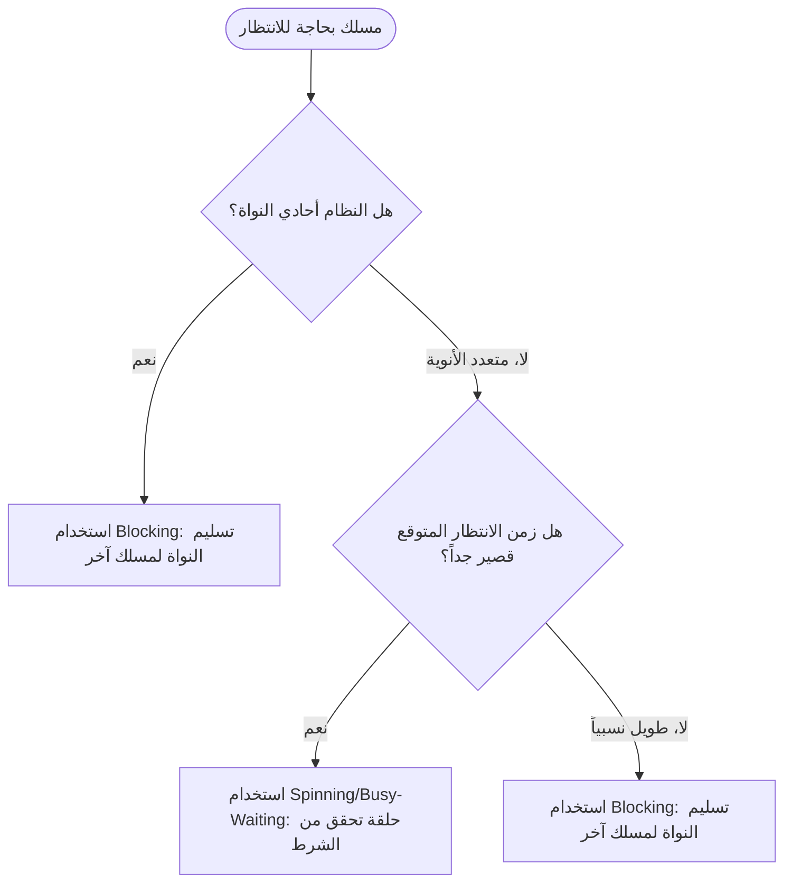
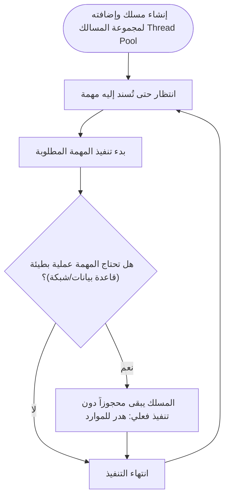
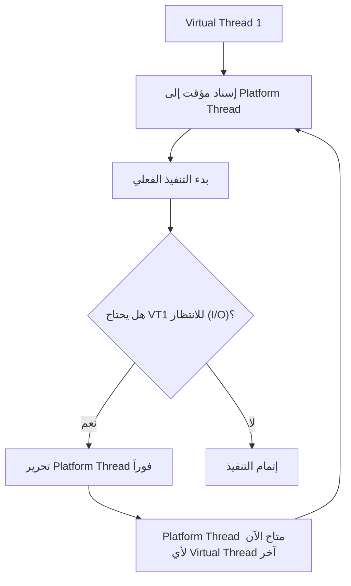
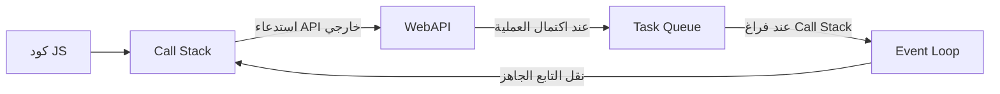
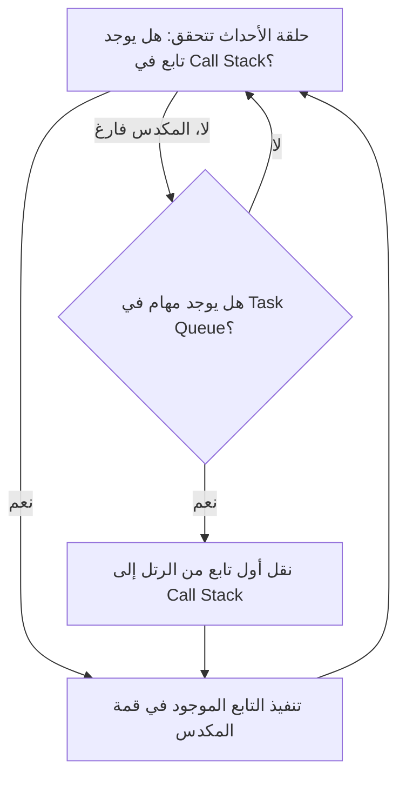

# المحاضرة 6 — Concurrency (التنفيذ المتزامن)
> **المادة:** لغات البرمجة (القسم العملي) | **الموضوع:** آليات التنفيذ المتزامن، تعدد المسالك، Virtual Threads، وAsync/Await

---

## الجزء الأول: ملخص منظم (اقرأ قبل المحاضرة!)

### 📍 عن هذه المحاضرة
> تشرح هذه المحاضرة مفهوم `concurrency` (التنفيذ المتزامن) من مستوى العتاد وصولاً إلى آليات التزامن البرمجية العالية المستوى مثل `Monitor` و`synchronized`، ثم تتعمّق في نموذجين حديثين لإدارة التزامن بكفاءة: `Java Virtual Threads` ونموذج `async/await` وخصوصاً في `JavaScript`.

### 🎯 ستتعلم
- الفرق بين `concurrency` و`multithreading`، ولماذا الأول مفهوم أعم من الثاني
- مستويات تحقيق التوازي الثلاثة: `Gate Level`، `Instruction Level`، `Thread Level`
- آليتي التواصل بين المسالك (`Shared Memory` و`Message Passing`) وآليتي التزامن (`Spinning` و`Blocking`)
- أدوات التحكم بالتزامن: `Semaphore`، `Monitor`، `Conditional Critical Region`، `Synchronization Lock`
- كيف تحل `Java Virtual Threads` مشكلة هدر موارد `Platform Threads` التقليدية
- كيف يعمل نموذج `async/await` وحلقة الأحداث `Event Loop` في `JavaScript` رغم أنها لغة `single-threaded`

### 📚 المتطلبات السابقة
- فهم أساسي لمفهوم `Thread` وكيف يختلف عن `Process` — لأن كل آليات التزامن في هذه المحاضرة مبنية على وجود عدة مسالك تتشارك موارد
- معرفة أولية بلغة واحدة على الأقل من `Java`، `Python`، أو `JavaScript` — لأن الأمثلة العملية تعتمد على تركيبها

### 💡 الأفكار الرئيسية
1. **`Concurrency` مفهوم أعم من `Multithreading`:** التنفيذ المتزامن يعني فقط أن النظام يتعامل مع أكثر من مهمة بصورة متداخلة، بينما تعدد المسالك هو أحد الأساليب التي تحقق ذلك فعلياً.
2. **الذاكرة المشتركة تتطلب تزامناً صريحاً:** لأن أكثر من مسلك يمكن أن يقرأ ويكتب على نفس المتحول في اللحظة نفسها، فلا بد من آليات مثل `Semaphore` أو `Monitor` لمنع تلف البيانات.
3. **الحلول الحديثة تخفي التعقيد عن المبرمج:** كل من `Java Virtual Threads` ونموذج `async/await` صُمما لتقليل هدر الموارد أثناء الانتظار دون أن يضطر المبرمج لإدارة كل تفصيل يدوياً.

### 🔗 كيف تتصل هذه المحاضرة بالمحاضرات الأخرى؟
- **السابقة:** المحاضرات التي تناولت بنية اللغات وتنفيذها التسلسلي علّمتك كيف يُنفَّذ برنامج واحد خطوة بخطوة ← الآن نبني على ذلك لنرى كيف تُنفَّذ عدة "خطوط تنفيذ" معاً.
- **القادمة:** هذه المفاهيم (خصوصاً `async/await` و`Event Loop`) ستُستخدم عند دراسة برمجة الشبكات وتطبيقات الويب الحديثة التي تعتمد بشكل كامل على التنفيذ غير المتزامن للتعامل مع طلبات المستخدمين.

### ⚠️ الأخطاء الشائعة الواجب تجنبها
- ❌ الاعتقاد بأن `concurrency` تعني بالضرورة تنفيذ مهام متعددة **فعلياً** في اللحظة نفسها (هذا هو `parallelism` وليس شرطاً في `concurrency`)
- ❌ الظن بأن `async/await` في `JavaScript` تُنشئ مسلك تنفيذ (`Thread`) جديداً — في الحقيقة `JS` تعمل على مسلك واحد
- ❌ الخلط بين `Spinning` و`Blocking` كآليتين متكافئتين — الأولى تستهلك المعالج فعلياً أثناء الانتظار، والثانية تتخلى عن النواة طواعية

---

## الجزء الثاني: الشرح التفصيلي (سطر بسطر / فقرة بفقرة)

### 1. مقدمة: جذور التزامن التاريخية

<!-- @render: {type: "prose-first", visualization: "none", coverage: "100%"} -->

#### 📍 أين نحن الآن؟
هذه أول نقطة في محاضرة `Concurrency` بأكملها، ولذلك ستكون بمثابة تمهيد يوضّح أن الفكرة قديمة نسبياً لكن أهميتها العملية حديثة.

#### 💡 الفكرة الأساسية
**مفهوم `concurrency` نظرياً قديم (يعود إلى الستينيات)، لكن الحاجة العملية الواسعة له حديثة بسبب تطور العتاد**

#### 📖 الشرح
جذور `concurrency` النظرية تعود إلى لغة `ALGOL 60` التي تضمّنت بعض الخصائص الداعمة للبرمجة المتزامنة، أي أن فكرة تنظيم تنفيذ عدة مهام معاً ليست اختراعاً حديثاً في علوم الحاسوب، بل كانت موجودة كموضوع بحثي منذ عقود طويلة قبل أن تصبح ضرورة يومية للمبرمجين.

السبب في أن الاهتمام الواسع بالتزامن أصبح ظاهرة حديثة نسبياً هو التطور الكبير في العتاد الحاسوبي، وتحديداً انتشار المعالجات متعددة النوى (`multi-core`) ومتعددة المعالجات (`multi-processor`) منخفضة التكلفة. فطالما كان المعالج يملك نواة واحدة فقط، كان تنفيذ مسالك متعددة بالتوازي الحقيقي (`parallelism`) أمراً غير ممكن فعلياً، وكان أقصى ما يمكن تحقيقه هو التناوب السريع بين المهام (`time-slicing`) بحيث تبدو متزامنة للمستخدم رغم أنها تُنفَّذ تسلسلياً خلف الكواليس.

مع رخص تكلفة النوى المتعددة، أصبح بإمكان أي حاسوب شخصي أو هاتف تنفيذ عدة مسالك فعلياً في اللحظة نفسها، وهذا فتح الباب أمام تطبيقات تعتمد بشكل جوهري على التنفيذ المتزامن: التطبيقات الرسومية التي تحتاج لتحديث الواجهة أثناء معالجة البيانات، تطبيقات الوسائط المتعددة التي تُشغّل الصوت والصورة معاً، وتطبيقات الويب الحديثة التي تخدم آلاف المستخدمين في آن واحد.

من الناحية العملية، هذا يعني أن كل لغة برمجة حديثة تقريباً — بغض النظر عن مجالها — أصبحت مضطرة لتوفير آلية ما للتعامل مع التزامن، سواء كانت هذه الآلية بدائية (كإنشاء المسالك يدوياً) أو متقدمة (كنماذج `async/await` التي سندرسها لاحقاً في هذه المحاضرة).

#### 💡 التشبيه:
> تخيل مطبخاً فيه طباخ واحد فقط مقابل مطبخ فيه عدة طباخين يعملون على مواقد مختلفة في الوقت نفسه.
> **وجه الشبه:** المعالج ذو النواة الواحدة = الطباخ الواحد الذي يتنقل بسرعة بين الأطباق فيبدو الأمر متزامناً، والمعالج متعدد النوى = عدة طباخين ينفذون فعلياً في اللحظة نفسها.

#### 🎯 الملخص السريع
- `concurrency` مفهوم نظري يعود لستينيات القرن الماضي (`ALGOL 60`)
- الاهتمام العملي الواسع به حديث نسبياً
- السبب الرئيسي: انتشار المعالجات متعددة النوى منخفضة التكلفة
- التطبيقات الدافعة: الرسوميات، الوسائط المتعددة، الويب الحديث

#### 📚 التطبيق
هذا التمهيد يمهّد لفهم لماذا أصبحت كل لغات البرمجة الحديثة (`Java`، `Python`، `C#`، `JavaScript`...) بحاجة لدعم مباشر أو غير مباشر للتزامن، وهو ما سنراه بالتفصيل في بقية أقسام المحاضرة.

#### ⚠️ أخطاء شائعة

#### الفهم الخاطئ ❌:
اعتقاد البعض أن `concurrency` اختراع حديث ظهر مع الحوسبة السحابية أو الهواتف الذكية.

#### الفهم الصحيح ✅:
الفكرة النظرية موجودة منذ الستينيات، وما تغيّر هو مدى الحاجة العملية إليها بسبب تطور العتاد، وليس المفهوم نفسه.

#### 📄 النص الأصلي من المحاضرة
<details>
<summary>عرض النص الأصلي (coverage: 100%)</summary>

**النص الأصلي يقول:**
> "لا يُعّد مفهوم التزامن من الأفكار الحديثة في علوم الحاسوب، إذ تعود جذوره النظرية إلى ستينيات القرن الماضي... ويرتبط ذلك بالتطور الكبير في العتاد الحاسوبي، ولا سيما انتشار المعالجات متعددة النوى ومتعددة المعالجات منخفضة التكلفة."

**ملاحظة على التغطية:**
- ✓ تم شرح: الجذور التاريخية، وسبب تجدد الاهتمام، والتطبيقات الدافعة
- ⚠️ غير مشروح بالكامل: لا يوجد
- ℹ️ إضافة من الدليل: تشبيه الطباخين (شرح زيادة للفهم)

</details>

---

### 2. مستويات تحقيق التوازي

<!-- @render: {type: "prose-first", visualization: "comparison-matrix", coverage: "95%"} -->
<!-- @connectivity: {prerequisite: "section_1"} -->

#### 💡 الفكرة الأساسية
**التوازي يمكن تحقيقه على ثلاثة مستويات متتالية: البوابات المنطقية، التعليمات، ثم المسالك — وكلما ارتفعنا زاد التعقيد**

#### 📖 الشرح
المستوى الأول والأدنى هو **مستوى البوابات المنطقية** (`Gate Level`)، حيث يتم تحقيق التوازي فيزيائياً من خلال إرسال إشارات كهربائية ممثلة للقيم عبر عدة أسلاك في آن واحد إلى العناصر الإلكترونية المختلفة ضمن الدارة المنطقية. هذا المستوى لا علاقة له بالبرمجة على الإطلاق، بل هو خاصية متأصلة في تصميم العتاد نفسه، ولذلك لا يتدخل فيه المبرمج إطلاقاً.

المستوى الثاني هو **مستوى التعليمات** (`Instruction Level`)، ويعتمد على تحسين أنبوب المعالجة (`pipeline`) وتنفيذ عدة تعليمات بالتوازي باستخدام تعليمات شعاعية (`vectorized instructions`) مثل `MMX`، `SSE`، و`AVX`. الفكرة هنا أن المعالج نفسه، أو مترجم اللغة عند توليد الشيفرة الآلية، يستطيع تجميع عدة عمليات حسابية بسيطة (مثل جمع عدة أرقام معاً) في تعليمة واحدة تُنفَّذ على عدة بيانات دفعة واحدة. كما يندرج ضمن هذا المستوى الاستفادة من المعالجات الرسومية (`GPU`) ذات الأداء العالي في المعالجة المتوازية، وهو ما يفسّر مثلاً سبب اعتماد مكتبات مثل `NumPy` في `Python` على هذا النوع من التسريع دون تدخل مباشر من المبرمج.

أما المستوى الثالث والأعلى تعقيداً فهو **مستوى المسالك** (`Thread Level`)، وهو المستوى الذي تركّز عليه هذه المحاضرة بأكملها. في هذا المستوى، يستفيد النظام من المعالجات متعددة النوى لتنفيذ عدة مسالك (`Threads`) بشكل متزامن، لكن هذا يتطلب دعماً مباشراً من لغة البرمجة نفسها لمفاهيم البرمجة التفرعية وإدارة المسالك المتعددة — أي أن المبرمج هنا يصبح مسؤولاً فعلياً عن إنشاء المسالك وتنسيق عملها، على عكس المستويين السابقين اللذين يحدثان بصورة شفافة تماماً عن المبرمج.

السبب في تسمية هذه المستويات "متتالية" هو أن كل مستوى أعلى يبني فوق المستوى الذي يسبقه: فالبوابات المنطقية تشكّل الأساس الفيزيائي، وفوقها تُبنى تعليمات المعالج التي قد تكون شعاعية، وفوق ذلك كله تُبنى المسالك التي يديرها نظام التشغيل ولغة البرمجة. وكلما ارتفعنا في هذا التسلسل، ازداد التعقيد المطلوب من المبرمج، لكن بالمقابل ازدادت المرونة والقدرة على التحكم الدقيق بما يحدث بالتوازي.

#### 💡 التشبيه:
> تخيل مصنعاً فيه ثلاثة مستويات: الآلات الفردية التي تعمل تلقائياً، خط الإنتاج الذي يُنسّق بين عدة آلات، والمدير الذي يوزّع فرقاً كاملة من العمال على مهام مختلفة.
> **وجه الشبه:** الآلة الفردية = `Gate Level`، خط الإنتاج المنسّق = `Instruction Level`، وتوزيع فرق العمل بالكامل = `Thread Level` الذي يتطلب تدخلاً وتخطيطاً من "المدير" (المبرمج).

#### ⚖️ مقارنة سريعة: مستويات التوازي

| المعيار | Gate Level | Instruction Level | Thread Level |
| --- | --- | --- | --- |
| **مسؤول التحكم** | العتاد فقط | المعالج/المترجم | المبرمج ولغة البرمجة |
| **مدى التدخل من المبرمج** | معدوم | شبه معدوم (تلقائي غالباً) | مباشر وصريح |
| **مثال** | إشارات كهربائية في الدارة | `AVX`, `SSE`, `MMX`, `GPU` | `Threads`, `Runnable`, `Pthreads` |

**الخلاصة:**
> كلما احتجت تحكماً دقيقاً بترتيب تنفيذ مهامك (مثل معالجة طلبات مستخدمين مختلفين)، فأنت بحاجة للعمل على `Thread Level` مباشرة، بينما تحسينات الأداء الحسابي البسيط تحدث غالباً بصورة شفافة على المستويين الأدنى.

#### 🎯 الملخص السريع
- ثلاثة مستويات: `Gate` → `Instruction` → `Thread`
- التعقيد ومقدار تدخل المبرمج يزدادان كلما ارتفعنا في المستوى
- `Instruction Level` يشمل التعليمات الشعاعية والاستفادة من `GPU`
- `Thread Level` هو محور هذه المحاضرة لأنه يتطلب دعماً مباشراً من لغة البرمجة

#### 📚 التطبيق
فهم هذا التسلسل يوضّح لماذا لا تحتاج لكتابة أي كود خاص لتستفيد من تسريع `NumPy` (لأنه على `Instruction Level`)، بينما تحتاج لإنشاء `Thread` صراحة إذا أردت تشغيل مهمتين مستقلتين في برنامجك.

#### ⚠️ أخطاء شائعة

#### الفهم الخاطئ ❌:
الظن بأن استخدام مكتبة مثل `NumPy` أو `LINQ` يعني أن البرنامج "يستخدم مسالك" (`Threads`) تلقائياً.

#### الفهم الصحيح ✅:
هذه المكتبات غالباً تستفيد من `Instruction Level` (تعليمات شعاعية) وليس بالضرورة من `Thread Level`؛ الفرق بينهما جوهري كما سنرى في قسم مستويات التجريد لاحقاً.

#### 📄 النص الأصلي من المحاضرة
<details>
<summary>عرض النص الأصلي (coverage: 95%)</summary>

**النص الأصلي يقول:**
> "يمكن تحقيق التوازي في التنفيذ على عدة مستويات متتالية وكلما ارتفعنا في المستوى زاد التعقيد: 1. مستوى البوابات المنطقية Gate Level... 2. مستوى التعليمات Instruction Level يعتمد على تحسين أنبوب المعالجة وتنفيذ عدة تعليمات بالتوازي باستخدام التعليمات الشعاعية مثل MMX، SSE، AVX... 3. مستوى المسالك Thread Level بشكل متزامن، ويتطلب دعماً مباشراً يستفيد من المعالجات متعددة النوى لتنفيذ عدة مسالك Threads من لغات البرمجة لمفاهيم البرمجة التفرعية وإدارة المسالك المتعددة."

**ملاحظة على التغطية:**
- ✓ تم شرح: المستويات الثلاثة، أمثلتها، ومسؤول التحكم بكل منها
- ⚠️ غير مشروح بالكامل: تفاصيل تقنية دقيقة عن بنية `pipeline` المعالج (خارج نطاق مادة لغات البرمجة)
- ℹ️ إضافة من الدليل: جدول المقارنة والتشبيه

</details>

---

### 3. التنفيذ المتزامن مقابل تعدد المسالك

<!-- @render: {type: "prose-first", visualization: "comparison-matrix", coverage: "100%"} -->
<!-- @connectivity: {prerequisite: "section_2"} -->

#### 📍 أين نحن الآن؟
بعد أن رأينا أن `Thread Level` هو المستوى الذي يتطلب تدخل المبرمج، لا بد الآن من التفريق بدقة بين مصطلحين يُستخدمان أحياناً كمترادفين خطأً: `Concurrency` و`MultiThreading`.

#### 💡 الفكرة الأساسية
**`Concurrency` مفهوم برمجي عام يعني التعامل مع أكثر من مهمة بصورة متداخلة، بينما `MultiThreading` هو أحد أشكال تحقيق هذا التداخل عملياً**

#### 📖 الشرح
`Concurrency` (التنفيذ المتزامن) هو أسلوب برمجي يهدف إلى تنفيذ عدة عمليات أو مهام خلال الفترة الزمنية نفسها، بحيث يتم تنظيم تنفيذها بالتناوب أو بالتوازي لتحسين استغلال موارد النظام وزيادة كفاءة الأداء. النقطة الجوهرية هنا هي أن `concurrency` **لا يشترط** أن تعمل جميع المهام فعلياً في اللحظة نفسها؛ يكفي أن يتعامل النظام مع أكثر من مهمة بصورة متداخلة ومنظمة، حتى لو كان التنفيذ الفعلي يحدث بالتناوب السريع على نواة واحدة.

في المقابل، `MultiThreading` (تعدد المسالك) يُعّد أحد أشكال تحقيق `Concurrency`، حيث يتم تقسيم البرنامج إلى عدة مسالك (`Threads`) تعمل ضمن العملية نفسها بهدف تنفيذ المهام بشكل متزامن أو متوازٍ. الفرق الدقيق إذاً هو أن `Concurrency` وصف لهدف أو سلوك (تنظيم عدة مهام متداخلة)، بينما `MultiThreading` هو تقنية أو أداة محددة لتحقيق هذا الهدف — أي أن كل `multithreading` هو شكل من `concurrency`، لكن ليس كل `concurrency` يتطلب بالضرورة عدة مسالك (فقد يتحقق مثلاً عبر `event loop` أحادي المسلك كما سنرى لاحقاً في `JavaScript`).

هذا التمييز مهم عملياً لأن بعض اللغات تحقق `concurrency` دون أي مسالك إضافية على الإطلاق. فمثلاً `JavaScript` تعمل على مسلك واحد فقط، ومع ذلك تستطيع التعامل مع آلاف الطلبات المتزامنة عبر `Event Loop` وآليات `async/await`، وهذا مثال واضح على `concurrency` بدون `multithreading` حقيقي. في المقابل، لغة مثل `Java` أو `C++` قد تستخدم مسالك فعلية متعددة (`Threads`) تُدار من قبل نظام التشغيل لتحقيق نفس الهدف.

من الناحية التصميمية، اختيار اللغة أو المطوّر بين الاعتماد على `multithreading` الصريح أو على نموذج `concurrency` أخف مثل `async/await` يعتمد على طبيعة المهمة: المهام كثيفة الحساب (`CPU-bound`) تستفيد فعلياً من `multithreading` الحقيقي على عدة أنوية، بينما المهام التي تقضي معظم وقتها في الانتظار (`I/O-bound`، مثل انتظار استجابة من الشبكة) قد تكون أكثر كفاءة مع نماذج `concurrency` الخفيفة دون الحاجة لإنشاء مسالك نظام تشغيل كاملة لكل مهمة.

#### 💡 التشبيه:
> تخيل موظف استقبال واحد يتعامل مع عدة عملاء بالتناوب (يستمع لطلب، يضعه جانباً، يخدم آخر، ثم يعود) مقابل فريق كامل من الموظفين يخدم كل واحد منهم عميلاً مختلفاً في آن واحد.
> **وجه الشبه:** الموظف الواحد المتناوب = `Concurrency` بدون `multithreading` (كما في `JavaScript`)، وفريق الموظفين = `MultiThreading` الحقيقي.

#### ⚖️ مقارنة سريعة: Concurrency مقابل MultiThreading

| المعيار | Concurrency | MultiThreading |
| --- | --- | --- |
| **التعريف** | مفهوم عام: التعامل مع عدة مهام بصورة متداخلة | تقنية محددة: تقسيم البرنامج لعدة `Threads` |
| **هل يتطلب عدة مسالك؟** | لا بالضرورة | نعم، بحكم التعريف |
| **مثال** | `Event Loop` في `JavaScript` | `Threads` في `Java` أو `Pthreads` في `C++` |
| **متى يُفضَّل؟** | مهام `I/O-bound` كثيرة الانتظار | مهام `CPU-bound` تحتاج تنفيذاً فعلياً متوازياً |

**الخلاصة:**
> `MultiThreading` هو حالة خاصة من `Concurrency`، وليس كل تنفيذ متزامن يتطلب مسالك فعلية — وهذا هو أساس الفصل بينهما في هذه المحاضرة.

#### 🎯 الملخص السريع
- `Concurrency`: هدف عام (تنظيم مهام متداخلة)، لا يشترط تنفيذاً فعلياً متزامناً
- `MultiThreading`: أداة محددة تعتمد على تقسيم البرنامج لمسالك
- كل `multithreading` هو `concurrency`، والعكس غير صحيح
- الاختيار بينهما يعتمد على طبيعة المهمة (`CPU-bound` مقابل `I/O-bound`)

#### 📚 التطبيق
هذا التمييز هو الأساس الذي ستُبنى عليه بقية المحاضرة: سنرى لاحقاً كيف تحقق `Java Virtual Threads` و`JavaScript async/await` كلاهما `concurrency` عالي الكفاءة، لكن بطريقتين مختلفتين تماماً في التعامل مع المسالك.

#### ⚠️ أخطاء شائعة

#### الفهم الخاطئ ❌:
استخدام مصطلحي `concurrency` و`multithreading` كمترادفين تماماً في أي سياق.

#### الفهم الصحيح ✅:
`multithreading` حالة خاصة من `concurrency` تتطلب مسالك فعلية، بينما `concurrency` قد تتحقق بدونها كما في `JavaScript`.

#### 📄 النص الأصلي من المحاضرة
<details>
<summary>عرض النص الأصلي (coverage: 100%)</summary>

**النص الأصلي يقول:**
> "التنفيذ المتزامن Concurrency: هو أسلوب برمجي يهدف إلى تنفيذ عدة عمليات أو مهام خلال الفترة الزمنية نفسها... وال يشترط في التنفيذ المتزامن أن تعمل جميع المهام فعلياً في اللحظة نفسها، بل يكفي أن يتعامل النظام مع أكثر من مهمة بصورة متداخلة ومنظمة. تعدد المسالك MultiThreading: يُعّد تعدد المسالك أحد أشكال التنفيذ المتزامن، حيث يتم تقسيم البرنامج إلى عدة مسالك Threads تعمل ضمن العملية نفسها بهدف تنفيذ المهام بشكل متزامن أو متوازٍ."

**ملاحظة على التغطية:**
- ✓ تم شرح: التعريفان، والفرق الجوهري بينهما، وأمثلة عملية
- ⚠️ غير مشروح بالكامل: لا يوجد
- ℹ️ إضافة من الدليل: جدول المقارنة، والتشبيه، وربط `CPU-bound` مقابل `I/O-bound`

</details>

---

### 4. مستويات التجريد (Levels of Abstraction)

<!-- @render: {type: "code-first", visualization: "none", coverage: "95%"} -->
<!-- @connectivity: {prerequisite: "section_3"} -->

#### 💡 الفكرة الأساسية
**آلية تحقيق التنفيذ التفرعي تختلف حسب مستوى التجريد الذي توفره اللغة أو المكتبة — من التوازي الشفاف تماماً إلى التصريح المباشر بالمسالك**

#### 💻 الكود / شبه الكود

```python
# High level of abstraction: parallelism is automatic and hidden
import numpy as np

a = np.array([1, 2, 3, 4])
b = np.array([10, 20, 30, 40])
c = a + b  # vectorized/parallel operation, no manual thread management
```

```csharp
// C#: LINQ provides an abstract, declarative way that can enable
// parallel execution automatically under the hood
var numbers = new int[] { 1, 2, 3, 4, 5 };
var result = numbers.AsParallel().Select(n => n * n);
```

#### شرح كل سطر:
1. `import numpy as np` → استيراد مكتبة `NumPy` — التي تعتمد داخلياً على تعليمات شعاعية ومعالجة متوازية (`Instruction Level`) دون أي تدخل من المبرمج
2. `a = np.array(...)` و`b = np.array(...)` → إنشاء مصفوفتين — البيانات التي ستُعالَج بكفاءة عالية
3. `c = a + b` → عملية الجمع هنا **ليست حلقة `for` عادية**، بل عملية مُحسَّنة (`vectorized`) قد تستفيد من توازي العتاد تلقائياً وبشفافية كاملة عن المبرمج
4. `numbers.AsParallel()` → في `C#`، هذا الاستدعاء يحوّل مصدر البيانات إلى نسخة تدعم `PLINQ` (`Parallel LINQ`)، أي تفعيل التنفيذ المتوازي عند الطلب
5. `.Select(n => n * n)` → تُنفَّذ هذه العملية على عدة عناصر بالتوازي إن أمكن، بأسلوب تجريدي (`declarative`) يخفي تفاصيل توزيع العمل على المسالك

**الناتج المتوقع (لقطة الشاشة):**
> في مثال `Python`، تُطبع مصفوفة `[11, 22, 33, 44]` كنتيجة للجمع المتجهي؛ وفي `C#` تُنتج قائمة مربعات الأعداد، مع احتمال تنفيذ عناصرها بالتوازي داخلياً دون كود إضافي من المبرمج.

#### 📖 الشرح
تختلف آلية تحقيق التنفيذ التفرعي في البرامج تبعاً لمستوى التجريد الذي تستخدمه لغة البرمجة أو المكتبات التي توفرها، والفكرة الأساسية هنا هي أن نفس الهدف (تنفيذ عدة عمليات بالتوازي) يمكن الوصول إليه بطرق مختلفة تماماً في مدى وضوحها للمبرمج. ففي بعض الحالات يتم تحقيق التوازي بصورة تلقائية وشفافة تماماً، بينما تتطلب حالات أخرى تدخلاً مباشراً ومقصوداً لإدارة التنفيذ المتزامن.

في `Python`، مكتبة `NumPy` مثال ممتاز على المستوى الأعلى من التجريد: هي تعتمد على التعليمات الشعاعية والمعالجة المتوازية لتنفيذ العمليات على المصفوفات بكفاءة عالية، دون أن يحتاج المبرمج لإدارة التوازي يدوياً على الإطلاق. المبرمج فقط يكتب `a + b` كأنها عملية بسيطة، لكن خلف الكواليس تُترجم هذه العملية إلى استغلال فعلي لقدرات المعالج المتوازية. هذا هو بالضبط ما تحدثنا عنه في قسم "مستويات التوازي" السابق تحت مسمى `Instruction Level`.

في `C#`، معيار `LINQ` يوفر طريقة مشابهة من حيث التجريد: يمكن التعامل مع البيانات والمصفوفات بطريقة مجردة (`declarative`) تدعم التنفيذ التفرعي وتحسين الأداء بشكل شبه تلقائي، خصوصاً عند استخدام `PLINQ`. الفرق عن `NumPy` هو أن `LINQ` أقرب لبنية لغوية متكاملة ضمن `C#` نفسها، بينما `NumPy` مكتبة خارجية في `Python`، لكن كلاهما يشترك في المبدأ ذاته: إخفاء تفاصيل التوازي عن المبرمج قدر الإمكان.

أما في مستويات أقل من التجريد، فقد يكون على المبرمج التصريح بشكل مباشر بالحاجة إلى التفرع، وذلك إما عبر إنشاء مسالك تنفيذ (`Threads`) بشكل صريح، أو عبر استخدام آليات البرمجة غير المتزامنة مثل `async/await` لإدارة العمليات المتزامنة والتحكم بها. هذا يعني أن اختيار المستوى المناسب من التجريد هو قرار تصميمي: كلما زاد التجريد، قلّ التحكم الدقيق الذي يملكه المبرمج، لكن زادت سهولة الاستخدام وقلّت احتمالية الأخطاء الناتجة عن سوء إدارة التزامن يدوياً.

#### 🎯 الملخص السريع
- التجريد العالي (`NumPy`, `LINQ`): توازي تلقائي وشفاف، لا إدارة يدوية
- التجريد المنخفض: تصريح مباشر بـ`Threads` أو استخدام `async/await`
- الاختيار بينهما مقايضة بين سهولة الاستخدام والتحكم الدقيق

#### 📚 التطبيق
هذا التصنيف يمهّد لفهم بقية المحاضرة: الأقسام القادمة عن `Semaphore`، `Monitor`، و`synchronized` تقع في مستوى تجريد **منخفض** (تصريح مباشر)، بينما `Virtual Threads` و`async/await` سنراهما كمحاولة لرفع مستوى التجريد دون فقدان الكفاءة.

#### ⚠️ أخطاء شائعة

#### الفهم الخاطئ ❌:
افتراض أن استخدام `NumPy` أو `LINQ` يعني وجود مسالك (`Threads`) فعلية يديرها المبرمج.

#### الفهم الصحيح ✅:
هذه الأدوات تحقق التوازي غالباً على `Instruction Level` أو عبر إدارة داخلية للمكتبة، دون أن ينشئ المبرمج أي `Thread` بنفسه.

#### 📄 النص الأصلي من المحاضرة
<details>
<summary>عرض النص الأصلي (coverage: 95%)</summary>

**النص الأصلي يقول:**
> "يختلف آلية تحقيق التنفيذ التفرعي في البرامج تبعاً لمستوى التجريد المستخدم وللتقنيات التي توفرها لغة البرمجة أو المكتبات البرمجية... في لغة Python، تعتمد مكتبة NumPy على التعليمات الشعاعية والمعالجة المتوازية... أما في لغة C#، فيمكن استخدام معيار LINQ... وفي مستويات أقل من التجريد، قد يكون على المبرمج التصريح بشكل مباشر بالحاجة إلى التفرع، وذلك عبر إنشاء مسالك تنفيذ Threads أو استخدام آليات البرمجة غير المتزامنة مثل await/async."

**ملاحظة على التغطية:**
- ✓ تم شرح: النقاط الثلاث بالكامل مع أمثلة كود توضيحية
- ⚠️ غير مشروح بالكامل: التفاصيل الداخلية الدقيقة لكيفية عمل `PLINQ` (خارج نطاق المادة)
- ℹ️ إضافة من الدليل: أمثلة الكود الفعلية بـ`Python` و`C#`

</details>

---

### 5. تفاصيل التزامن: التواصل بين المسالك

<!-- @render: {type: "prose-first", visualization: "comparison-matrix", coverage: "100%"} -->
<!-- @connectivity: {prerequisite: "section_4"} -->

#### 📍 أين نحن الآن؟
انتقلنا الآن من الحديث العام عن مستويات التوازي والتجريد إلى التفاصيل العملية لكيفية "تفاهم" المسالك مع بعضها البعض — وهذا هو أول ركنين أساسيين في البرمجة التفرعية: **التواصل** (وسيليه **التزامن** في القسم التالي).

#### 💡 الفكرة الأساسية
**يوجد نوعان أساسيان للتواصل بين المسالك: الذاكرة المشتركة (`Shared Memory`) وتبادل الرسائل (`Message Passing`)**

#### 📖 الشرح
من أسس البرمجة التفرعية التواصل بين المسالك (`Threads`)، وذلك لأن أي فائدة عملية من تنفيذ عدة مسالك معاً تتطلب أن تتمكن من تبادل النتائج أو التنسيق فيما بينها بطريقة أو بأخرى. يوجد نوعان أساسيان من آليات التواصل: **الذاكرة المشتركة** (`Shared Memory`) و**تبادل الرسائل** (`Message Passing`)، وكل منهما يمثل فلسفة مختلفة تماماً في كيفية تصميم البرنامج التفرعي.

**الذاكرة المشتركة** تشير إلى تواجد ذاكرة عامة في البرنامج يمكن للمسالك أن تتواصل عن طريق وصولها لمجموعة من المتحولات المشتركة بين هذه المسالك، حيث يقوم أحد هذه المسالك بكتابة قيمة والآخر بقراءتها. هذا النموذج سريع من الناحية النظرية لأنه لا يتطلب نسخ البيانات أو إرسالها عبر قنوات خاصة، لكنه بالمقابل يفتح الباب أمام مشاكل خطيرة إذا لم تتم إدارته بعناية: فإذا كتب مسلك قيمة جديدة في اللحظة نفسها التي يقرأ فيها مسلك آخر، قد ينتج عن ذلك قراءة قيمة غير متسقة أو تالفة (`race condition`)، وهذا بالضبط ما يفسّر الحاجة لآليات التزامن الصريح التي سنراها في القسم التالي.

في المقابل، **تبادل الرسائل** يتبنى فلسفة مختلفة جذرياً: لا يوجد حالة مشتركة للمسالك، وإنما لكل مسلك حالته الخاصة، وحتى يتواصل مع بقية المسالك يجب عليه أن يستدعي تابع `send` صريح لإرسال رسائل تحتوي التعديلات والقيم المطلوبة لبقية المسالك. هذا النموذج أكثر أماناً من ناحية تجنب مشاكل الوصول المتزامن للذاكرة، لأنه لا يوجد أساساً متحول يمكن أن يتصارع عليه مسلكان، لكنه يتطلب تصميم بروتوكول واضح لتنسيق هذه الرسائل، وقد يكون أبطأ نسبياً بسبب تكلفة إرسال ونسخ البيانات بدلاً من الوصول المباشر لها.

من الناحية العملية، اختيار أحد النموذجين يعتمد على طبيعة النظام: الأنظمة التي تعمل ضمن عملية واحدة (مثل معظم تطبيقات `multithreading` التقليدية في `Java` أو `C++`) تميل لاستخدام الذاكرة المشتركة لأن المسالك أساساً تعمل ضمن نفس مساحة الذاكرة، بينما الأنظمة الموزعة (مثل عدة خوادم تتواصل عبر الشبكة) تعتمد بالضرورة على تبادل الرسائل لأنه لا توجد ذاكرة فعلية مشتركة بينها أصلاً.

#### 💡 التشبيه:
> تخيل غرفة اجتماعات فيها سبورة مشتركة يكتب عليها الجميع ويقرأ منها الجميع، مقابل مجموعة أشخاص في غرف منفصلة يرسلون لبعضهم رسائل مكتوبة عبر ساعي بريد.
> **وجه الشبه:** السبورة المشتركة = `Shared Memory` (سريعة لكن تحتاج تنسيقاً لمنع الكتابة فوق بعضها)، ورسائل الساعي = `Message Passing` (أبطأ لكن كل شخص يحتفظ بحالته الخاصة دون تداخل).

#### ⚖️ مقارنة سريعة: آليات التواصل بين المسالك

| المعيار | Shared Memory | Message Passing |
| --- | --- | --- |
| **وجود حالة مشتركة** | نعم، متحولات مشتركة | لا، كل مسلك له حالته الخاصة |
| **آلية التواصل** | قراءة/كتابة مباشرة | استدعاء تابع `send` صريح |
| **الخطر الرئيسي** | تلف البيانات عند التزامن السيئ | تعقيد تصميم بروتوكول الرسائل |
| **مثال شائع** | `multithreading` التقليدي (`Java`, `C++`) | الأنظمة الموزعة، `Actor Model` |

**الخلاصة:**
> الذاكرة المشتركة أسرع لكنها أخطر وتتطلب آليات تزامن صريحة، بينما تبادل الرسائل أأمن بطبيعته لكنه أبطأ ويحتاج تصميماً أكثر تنظيماً للتواصل.

#### 🎯 الملخص السريع
- التواصل ركن أساسي في البرمجة التفرعية
- الذاكرة المشتركة: متحولات عامة تُقرأ وتُكتب من عدة مسالك
- تبادل الرسائل: لا حالة مشتركة، تواصل عبر `send` صريح فقط
- كل نموذج له سياق استخدام مثالي مختلف

#### 📚 التطبيق
فهم الفرق بين النموذجين ضروري لفهم لماذا تحتاج آليات التزامن الصريح (`Semaphore`, `Monitor`, `synchronized`) في القسم القادم — فهذه الآليات كلها موجودة أساساً لحل المشاكل التي يسببها نموذج الذاكرة المشتركة.

#### ⚠️ أخطاء شائعة

#### الفهم الخاطئ ❌:
الظن بأن تبادل الرسائل (`Message Passing`) أسلوب "قديم" أو أقل استخداماً من الذاكرة المشتركة.

#### الفهم الصحيح ✅:
تبادل الرسائل هو الأساس الذي تُبنى عليه الأنظمة الموزعة الحديثة بالكامل، وهو ليس أقل أهمية بل مناسب لسياق مختلف تماماً عن الذاكرة المشتركة.

#### 📄 النص الأصلي من المحاضرة
<details>
<summary>عرض النص الأصلي (coverage: 100%)</summary>

**النص الأصلي يقول:**
> "التواصل Communication: من أسس البرمجة التفرعية التواصل بين المسالك Threads. يوجد نوعين أساسين من آليات التواصل، الذاكرة المشتركة Shared Memory وتبادل الرسائل Message Passing. الذاكرة المشتركة: تشير إلى تواجد ذاكرة عامة في البرنامج يمكن للمسالك أن تتواصل عن طريق وصولها لمجموعة من المتحولات المشتركة... تبادل الرسائل: ال يوجد حالة مشتركة للمسالك وإنما لكل مسلك حالته الخاصة وليتواصل مع المسالك الباقية يجب عليها أن يستدعي تابع send صريح."

**ملاحظة على التغطية:**
- ✓ تم شرح: النوعان بالتفصيل مع أسباب كل نموذج وسياق استخدامه
- ⚠️ غير مشروح بالكامل: لا يوجد
- ℹ️ إضافة من الدليل: جدول المقارنة والتشبيه وربط الأنظمة الموزعة

</details>

---

### 6. تفاصيل التزامن: التزامن (Synchronization) وآليتا الانتظار

<!-- @render: {type: "diagram-first", visualization: "flowchart", coverage: "95%"} -->
<!-- @connectivity: {prerequisite: "section_5"} -->

#### 💡 الفكرة الأساسية
**التزامن (`Synchronization`) هو الآلية التي تحدد ترتيب تنفيذ العمليات؛ ويتحقق إما بالانتظار النشط (`Spinning`) أو بالتخلي الطوعي عن النواة (`Blocking`)**

#### 📊 المخطط: متى نستخدم Spinning ومتى نستخدم Blocking؟



**شرح العناصر:**
- **مسلك بحاجة للانتظار:** نقطة البداية — أي `Thread` وصل إلى عملية يجب أن تنتظر تحقق شرط ما قبل المتابعة
- **هل النظام أحادي النواة؟:** نقطة القرار الأولى — لأن `Spinning` لا معنى له إن كانت هناك نواة واحدة فقط
- **Spinning/Busy-Waiting:** المسلك ينفّذ حلقة تتحقق من شرط معين باستمرار
- **Blocking:** المسلك يتخلى طواعية عن النواة لمصلحة مسلك آخر

**شرح الروابط:**
- **مسلك بحاجة للانتظار → هل النظام أحادي النواة؟:** أول سؤال يحدد الاستراتيجية المناسبة
- **هل النظام أحادي النواة؟ →|نعم| Blocking:** لا فائدة من الانتظار النشط إن كانت هناك نواة واحدة تُنفَّذ عليها كل المسالك بالتناوب أصلاً
- **هل النظام أحادي النواة؟ →|لا| هل زمن الانتظار قصير جداً؟:** في الأنظمة متعددة الأنوية يصبح `Spinning` خياراً منطقياً محتملاً في حالات معينة

#### 📖 الشرح: اقرأ المخطط كالتالي
`Synchronization` (التزامن) يشير إلى الآلية التي يستخدمها البرنامج لتحديد ترتيب تنفيذ العمليات المختلفة ضمن المسالك المختلفة، وهو ضروري لأن تنفيذ عدة مسالك بدون أي تنسيق قد يؤدي لنتائج غير متوقعة أو خاطئة. من المهم ملاحظة أن طبيعة التزامن تختلف باختلاف آلية التواصل المستخدمة: في آلية إرسال الرسائل، يكون التزامن ضمنياً، إذ أن المسلك لن ينفذ شيئاً حتى تصل إليه رسالة — أي أن انتظار الرسالة نفسه هو الآلية التي تضبط الترتيب. أما في الذاكرة المشتركة، فيكون التزامن صريحاً منعاً لقراءة قيمة خاطئة للمتحولات والذاكرة، لأنه لا يوجد أي آلية تلقائية تمنع مسلكين من التصادم على نفس المتحول.

يوجد آليتان أساسيتان لتحقيق التزامن عملياً. الأولى هي **الانتظار النشط** (`Spinning`/`Busy-Waiting`)، حيث يقوم المسلك بتنفيذ حلقة (`loop`) تتحقق من شرط معين باستمرار، وفي حال تحقق هذا الشرط يقوم المسلك بالتنفيذ الفعلي. المشكلة الجوهرية في هذا النموذج أنه لا يناسب المعالجات ذات النواة الواحدة، إذ لا معنى من أن ننتظر مسلكاً مختلفاً في حال كان المسلك الحالي ينفّذ حلقة انتظار حتى لو لم يفعل أي شيء مفيد — فالمعالج يكون مشغولاً "وهمياً" بحلقة فارغة بدلاً من أن يُعطي فرصة حقيقية للمسلك الآخر الذي قد يكون هو من سيحقق الشرط المطلوب.

الآلية الثانية هي **المنع** (`Blocking`)، حيث يقوم المسلك طواعية بالتخلي عن النواة التي يستخدمها لمصلحة مسلك آخر. قبل التسليم، يقوم المسلك بوضع إشارة (`flag`) على حجرة ذاكرية أو متحول ما تفيد بأنه في حال تحقق شرط معين يجب استدعاء هذا المسلك مجدداً. وفي حال قام مسلك ما بتحقيق هذا الشرط، يتم مباشرة استدعاء المسلك الذي وضع الإشارة عليه وتنفيذه. هذا النموذج أكثر كفاءة من ناحية استغلال الموارد لأنه لا يهدر دورات معالج على حلقات فارغة، لكنه يتطلب آلية أكثر تعقيداً لتسجيل هذه "الإشارات" واستدعاء المسلك المناسب في الوقت المناسب — وهذا بالضبط دور الأدوات التي سنراها في الأقسام التالية مثل `Monitor` و`Semaphore`.

عملياً، معظم أنظمة التشغيل الحديثة تستخدم مزيجاً من الآليتين: قد يبدأ المسلك بمحاولة `Spinning` لفترة زمنية قصيرة جداً على أمل أن يتحقق الشرط بسرعة (تجنباً لتكلفة التبديل بين المسالك)، ثم يتحول إلى `Blocking` إذا طال الانتظار — وهذا يوازن بين كفاءة الأداء في الحالات السريعة وعدم إهدار الموارد في الحالات البطيئة.

#### 🎯 الملخص السريع
- `Synchronization`: تحديد ترتيب تنفيذ العمليات بين المسالك
- تزامن ضمني في تبادل الرسائل، وصريح في الذاكرة المشتركة
- `Spinning`: حلقة تحقق نشطة — غير مناسبة للأنظمة أحادية النواة
- `Blocking`: تخلٍّ طوعي عن النواة مع وضع إشارة للاستدعاء لاحقاً

#### 📚 التطبيق
هذا الفهم يمهّد مباشرة لأدوات التحكم بالتزامن التي سنشرحها الآن (`Semaphore`, `Monitor`, `Conditional Critical Region`, `synchronized`)، فكل هذه الأدوات هي في جوهرها تطبيقات عملية منظمة لآلية `Blocking` بشكل أساسي.

#### ⚠️ أخطاء شائعة

#### الفهم الخاطئ ❌:
اعتقاد أن `Spinning` أسلوب "خاطئ" يجب تجنبه دائماً.

#### الفهم الصحيح ✅:
`Spinning` مفيد فعلاً في أنظمة متعددة الأنوية عندما يكون زمن الانتظار المتوقع قصيراً جداً، لأن تكلفة تبديل المسلك (`context switch`) قد تكون أعلى من تكلفة الانتظار النشط القصير؛ المشكلة تظهر فقط عندما يُستخدم على نظام أحادي النواة أو لفترات طويلة.

#### 📄 النص الأصلي من المحاضرة
<details>
<summary>عرض النص الأصلي (coverage: 95%)</summary>

**النص الأصلي يقول:**
> "التزامن Synchronization يشير إلى الآلية التي يستخدمها البرنامج لتحديد ترتيب تنفيذ العمليات المختلفة ضمن المسالك المختلفة... يوجد آليتين لتحقيق التزامن: 1. الانتظار Spinning/Busy-Waiting... ال يناسب هذا النموذج المعالجات ذات النواة الواحدة... 2. المنع Blocking في هذا النموذج يقوم المسلك طواعيةً بالتخلي عن النواة التي يستخدمها لمصلحة مسلك آخر."

**ملاحظة على التغطية:**
- ✓ تم شرح: تعريف `Synchronization`، والآليتان بالتفصيل الكامل
- ⚠️ غير مشروح بالكامل: تفاصيل تقنية دقيقة عن مدة `Spinning` المثلى قبل التحول لـ`Blocking` (غير مذكورة صراحة في المحاضرة)
- ℹ️ إضافة من الدليل: المخطط، والتوازن العملي بين الآليتين في الأنظمة الحديثة

</details>

---

### 7. آليات ضمان التنفيذ: Semaphore

<!-- @render: {type: "prose-first", visualization: "none", coverage: "95%"} -->
<!-- @connectivity: {prerequisite: "section_6"} -->

#### 📍 أين نحن الآن؟
بعد أن فهمنا آليتي الانتظار العامتين (`Spinning` و`Blocking`)، ننتقل الآن للأدوات الفعلية التي توفرها لغات البرمجة لتطبيق هاتين الآليتين بشكل منظم عند التعامل مع موارد مشتركة — وأول هذه الأدوات وأكثرها تأسيساً هو `Semaphore`.

#### 💡 الفكرة الأساسية
**`Semaphore` أداة تحكم منخفضة المستوى تفرض قفلاً على مورد معيّن لمنع أكثر من مسلك من استخدامه في الوقت نفسه**

#### 📖 الشرح
في تطبيقات تعدد المسالك، غالباً ما تحتاج عدة مسالك إلى الوصول إلى الموارد نفسها، مثل الذاكرة، الملفات، أو قواعد البيانات. لمنع تعارض العمليات وحدوث أخطاء أثناء الوصول المتزامن، يتم استخدام آليات خاصة لتنظيم الوصول إلى هذه الموارد، ويُعّد `Semaphore` من أهم آليات التحكم المستخدمة في البرمجة متعددة المسالك تاريخياً، حيث يتيح فرض قفل (`lock`) على مورد معيّن لمنع أكثر من مسلك من استخدامه في الوقت نفسه، مما يضمن سلامة البيانات وتناسق التنفيذ.

على الرغم من فعالية `Semaphore` في تحقيق هدفه الأساسي، إلا أنه يُعتبر من آليات التحكم **منخفضة المستوى**، إذ يتطلب إدارة دقيقة جداً من المبرمج نفسه: يجب عليه أن يتذكر يدوياً استدعاء عملية "الحصول" على القفل (`acquire`) قبل الدخول للجزء الحرج من الكود، وعملية "التحرير" (`release`) بعد الانتهاء منه في كل مسار تنفيذ ممكن — بما في ذلك مسارات معالجة الأخطاء والاستثناءات. هذه المسؤولية اليدوية الدقيقة هي مصدر معظم مشاكل استخدام `Semaphore` عملياً.

فسوء استخدام `Semaphore` قد يؤدي إلى مشاكل خطيرة مثل **التعليق المتبادل** (`Deadlock`)، وهي الحالة التي ينتظر فيها مسلكان (أو أكثر) بعضهما البعض إلى الأبد لأن كل واحد منهما يحمل قفلاً يحتاجه الآخر، فلا يستطيع أي منهما المتابعة أبداً. كما يمكن أن يؤدي النسيان في تحرير القفل إلى **فقدان التزامن** بشكل عام، حيث تبقى مسالك أخرى منتظرة إلى ما لا نهاية أو يحدث تداخل غير متوقع في الوصول للموارد.

نتيجة لهذه المخاطر الناتجة عن الطابع اليدوي والدقيق لـ`Semaphore`، ظهرت تقنيات أكثر تنظيماً وتجريداً لتسهيل إدارة التزامن، وهي الأدوات التي سنشرحها في الأقسام القادمة تباعاً: المراقب (`Monitor`)، منطقة الشرط الحرج (`Conditional Critical Region`)، وقفل التزامن (`Synchronization Lock`). الهدف المشترك لهذه الأدوات جميعاً هو تبسيط التحكم بالوصول إلى الموارد المشتركة وتقليل الأخطاء الناتجة عن البرمجة المتزامنة اليدوية.

#### 💡 التشبيه:
> تخيل حماماً عاماً فيه مفتاح واحد فقط معلّق عند الباب — من يريد الدخول يأخذ المفتاح، ومن ينسى إعادته بعد الاستخدام يمنع أي شخص آخر من الدخول للأبد.
> **وجه الشبه:** المفتاح = `lock` الخاص بـ`Semaphore`، ونسيان إعادته = خطأ برمجي ينسى فيه المبرمج استدعاء `release`، مما قد يؤدي لـ`Deadlock`.

#### 🎯 الملخص السريع
- `Semaphore` يفرض قفلاً على مورد لمنع تعارض المسالك عليه
- أداة فعّالة لكنها منخفضة المستوى وتتطلب إدارة يدوية دقيقة
- سوء الاستخدام قد يسبب `Deadlock` أو فقدان التزامن
- دفعت هذه المخاطر لظهور أدوات أكثر تجريداً: `Monitor`، `Conditional Critical Region`، `Synchronization Lock`

#### 📚 التطبيق
`Semaphore` هو حجر الأساس الذي تُبنى فوقه فكرياً بقية أدوات التزامن التي سنراها، وفهمه ضروري لفهم لماذا صُممت الأدوات التالية بالطريقة التي صُممت بها — أي كمحاولة لتقليل الاعتماد على انضباط المبرمج اليدوي.

#### ⚠️ أخطاء شائعة

#### الفهم الخاطئ ❌:
الاعتقاد بأن `Semaphore` أداة "قديمة" لم تعد تُستخدم في اللغات الحديثة.

#### الفهم الصحيح ✅:
`Semaphore` لا يزال موجوداً ومستخدماً فعلياً في العديد من اللغات (مثل `java.util.concurrent.Semaphore` في `Java`)، لكن يُفضَّل استخدام الأدوات عالية المستوى مثل `synchronized` أو `Lock` عندما يكفي التحكم بمورد واحد بسيط.

#### 📄 النص الأصلي من المحاضرة
<details>
<summary>عرض النص الأصلي (coverage: 95%)</summary>

**النص الأصلي يقول:**
> "يُعّد Semaphore من أهم آليات التحكم المستخدمة في البرمجة متعددة المسالك، حيث يتيح فرض قفل على مورد معيّن لمنع أكثر من مسلك من استخدامه في الوقت نفسه... وعلى الرغم من فعاليته، يُعتبر الـ Semaphore من آليات التحكم منخفضة المستوى... كما أن سوء استخدامه قد يؤدي إلى مشاكل مثل التعليق المتبادل Deadlock أو فقدان التزامن."

**ملاحظة على التغطية:**
- ✓ تم شرح: تعريف `Semaphore`، فائدته، عيوبه، والمخاطر الناتجة عن سوء استخدامه
- ⚠️ غير مشروح بالكامل: التفاصيل التقنية لآلية `acquire`/`release` الداخلية (لم تُذكر بالكود في المحاضرة)
- ℹ️ إضافة من الدليل: التشبيه، وإشارة لاستخدامه الفعلي في `java.util.concurrent`

</details>

---

### 8. آليات ضمان التنفيذ: المراقب (Monitor)

<!-- @render: {type: "prose-first", visualization: "none", coverage: "100%"} -->
<!-- @connectivity: {prerequisite: "section_7"} -->

#### 💡 الفكرة الأساسية
**`Monitor` أداة تزامن عالية المستوى تضمن عدم تنفيذ أكثر من عملية واحدة داخله في اللحظة نفسها، محمية بحالة داخلية ومتحولات شرطية**

#### 📖 الشرح
يُعّد المراقب (`Monitor`) إحدى آليات التزامن عالية المستوى المستخدمة لتنظيم الوصول إلى الموارد المشتركة بين المسالك، وهو بذلك يمثل خطوة تجريدية أعلى من `Semaphore` الذي رأيناه في القسم السابق. يتألف المراقب من مجموعة عمليات (`operations`)، وحالة داخلية (`internal state`)، إضافة إلى متحولات شرطية (`condition variables`) تُستخدم للتحكم بتنسيق التنفيذ بين المسالك التي تحاول استخدامه.

يعتمد المراقب على مبدأ أساسي يتمثل في عدم السماح بتنفيذ أكثر من عملية واحدة داخله في اللحظة الزمنية نفسها، مما يضمن حماية البيانات المشتركة من التعارض أو التعديل المتزامن غير الآمن. هذا المبدأ يشبه إلى حد كبير هدف `Semaphore`، لكن الفرق الجوهري هو أن المراقب **يدير هذا القفل تلقائياً بحكم بنيته نفسها**، بدلاً من أن يعتمد على المبرمج ليتذكر استدعاء `acquire` و`release` يدوياً في كل مكان — وهذا هو بالضبط ما يجعله أداة "أكثر تجريداً" وأقل عرضة للأخطاء.

فعندما يرغب مسلك (`Thread`) بالوصول إلى مورد أو تعديل قيمة ضمن المراقب، يجب عليه استدعاء إحدى عملياته. وإذا كان المراقب مشغولاً بتنفيذ عملية أخرى في تلك اللحظة، يتم وضع المسلك في حالة انتظار حتى يصبح المراقب متاحاً، ليتم بعد ذلك تنفيذ العمليات بشكل منظم ومتسلسل وفق ترتيب الوصول. هذا يعني أن المراقب فعلياً يطبّق آلية `Blocking` التي شرحناها سابقاً، لكن بصورة مبنية داخل بنية اللغة أو المكتبة نفسها بدلاً من أن يديرها المبرمج بنفسه سطراً بسطر.

من الناحية العملية، الفائدة الأكبر للمراقب هي أنه يقلل بشكل كبير من احتمالية الأخطاء الشائعة في `Semaphore` — مثل نسيان تحرير القفل — لأن المراقب نفسه هو من يتولى مسؤولية القفل والتحرير تلقائياً بناءً على دخول وخروج المسلك من عملياته. لهذا السبب، تعتمد لغات حديثة عديدة على مفاهيم قريبة جداً من `Monitor` (مثل الكلمة المفتاحية `synchronized` في `Java` التي سنراها لاحقاً) كطريقة لتوفير نفس الفائدة بواجهة أبسط للمبرمج.

#### 💡 التشبيه:
> تخيل غرفة اجتماعات فيها موظف استقبال يقف عند الباب: لا يسمح لأكثر من شخص بالدخول في نفس الوقت، ومن يصل والغرفة مشغولة يقف في طابور انتظار حتى تُفتح الغرفة تلقائياً.
> **وجه الشبه:** الغرفة = المورد المشترك، موظف الاستقبال = آلية `Monitor` التي تدير الدخول تلقائياً دون أن يحتاج كل شخص لحمل مفتاح بنفسه كما في `Semaphore`.

#### 🎯 الملخص السريع
- `Monitor`: عمليات + حالة داخلية + متحولات شرطية
- يمنع تنفيذ أكثر من عملية واحدة داخله في نفس اللحظة
- يدير القفل تلقائياً — أقل عرضة لأخطاء النسيان مقارنة بـ`Semaphore`
- المسالك المنتظرة تُنفَّذ بشكل منظم ومتسلسل وفق ترتيب الوصول

#### 📚 التطبيق
مفهوم `Monitor` هو الأساس النظري وراء الكلمة المفتاحية `synchronized` في `Java` التي سنراها لاحقاً في هذه المحاضرة تحت قسم "قفل التزامن"، حيث تطبّق `Java` هذا المفهوم عملياً بصيغة بسيطة جداً في الكود.

#### ⚠️ أخطاء شائعة

#### الفهم الخاطئ ❌:
الظن بأن `Monitor` مجرد اسم آخر لـ`Semaphore` بلا فرق حقيقي.

#### الفهم الصحيح ✅:
الفرق الجوهري هو من يتحمل مسؤولية إدارة القفل: في `Semaphore` المبرمج يديره يدوياً بالكامل، بينما في `Monitor` تُدار هذه المسؤولية تلقائياً ضمن بنية الأداة نفسها.

#### 📄 النص الأصلي من المحاضرة
<details>
<summary>عرض النص الأصلي (coverage: 100%)</summary>

**النص الأصلي يقول:**
> "المراقب Monitor يُعّد المراقب Monitor إحدى آليات التزامن عالية المستوى... ويتألف المراقب من مجموعة عمليات، وحالة داخلية، إضافة إلى متحولات شرطية... يعتمد المراقب على مبدأ أساسي يتمثل في عدم السماح بتنفيذ أكثر من عملية واحدة داخله في اللحظة الزمنية نفسها... فعندما يرغب مسلك Thread بالوصول إلى مورد أو تعديل قيمة ضمن المراقب، يجب عليه استدعاء إحدى عملياته. وإذا كان المراقب مشغولاً بتنفيذ عملية أخرى، يتم وضع المسلك في حالة انتظار حتى يصبح المراقب متاحاً."

**ملاحظة على التغطية:**
- ✓ تم شرح: بنية المراقب، مبدأ عمله، وسلوكه عند التزاحم على الوصول
- ⚠️ غير مشروح بالكامل: لا يوجد
- ℹ️ إضافة من الدليل: التشبيه، والربط مع `synchronized` في `Java`

</details>

---

### 9. آليات ضمان التنفيذ: منطقة الشرط الحرج

<!-- @render: {type: "prose-first", visualization: "none", coverage: "100%"} -->
<!-- @connectivity: {prerequisite: "section_8"} -->

#### 💡 الفكرة الأساسية
**منطقة الشرط الحرج (`Conditional Critical Region`) تمثل جزءاً من الكود لا يُسمح بالدخول إليه إلا عند تحقق شرط بولياني محدد**

#### 📖 الشرح
تُعّد منطقة الشرط الحرج (`Conditional Critical Region`) إحدى آليات التزامن المستخدمة لتنظيم الوصول إلى الموارد المشتركة في البرمجة متعددة المسالك، وهي تمثل جزءاً من الشيفرة البرمجية لا يُسمح بالدخول إليه إلا عند تحقق شرط بولياني (`boolean condition`) محدد مسبقاً. هذا يميّزها عن `Monitor` العادي الذي يمنع التنفيذ المتزامن ببساطة بغض النظر عن أي شرط إضافي؛ هنا الدخول مرتبط بشكل صريح بتحقق حالة معينة من البرنامج.

يعتمد هذا الأسلوب على مبدأ التحقق من الشرط **قبل** تنفيذ الكتلة البرمجية، بحيث لا يستطيع أي مسلك (`Thread`) تنفيذ التعليمات الموجودة داخل المنطقة الحرجة إلا إذا تحقق الشرط المطلوب فعلياً في تلك اللحظة. هذا يعني أن مجرد وصول المسلك إلى نقطة المنطقة الحرجة لا يضمن دخوله فوراً — يجب أولاً أن تكون الحالة الداخلية للبرنامج مطابقة للشرط المحدد.

أما في حال عدم تحقق الشرط، فيبقى المسلك في حالة انتظار إلى أن يصبح المورد متاحاً، أو ينتهي المسلك الآخر من التنفيذ بحيث يتغير الشرط ليصبح صحيحاً. هذا النموذج مفيد بشكل خاص في السيناريوهات التي يعتمد فيها السماح بالدخول على حالة ديناميكية للبيانات — مثلاً السماح بإضافة عنصر إلى قائمة فقط إذا لم تكن ممتلئة، أو السماح بالقراءة من مخزن مؤقت فقط إذا كان يحتوي على بيانات فعلاً.

يساعد هذا الأسلوب في منع التعارض بين المسالك وضمان تنفيذ العمليات المشتركة بصورة آمنة ومنظمة، وهو بذلك يجمع بين فكرتين: الحماية العامة من التنفيذ المتزامن غير الآمن (كما في `Monitor`)، وإضافة طبقة شرطية إضافية تجعل الدخول للمنطقة الحرجة مرتبطاً بحالة منطقية محددة وليس فقط بتوفر المورد فارغاً.

#### 💡 التشبيه:
> تخيل باباً أمام مصعد مزدحم لا يفتح إلا إذا كان عدد الأشخاص بداخله أقل من الحد الأقصى المسموح — وليس فقط عندما يكون المصعد "متاحاً" بشكل عام.
> **وجه الشبه:** الشرط البولياني (عدد الأشخاص أقل من الحد الأقصى) = الشرط الذي يتحكم بالدخول إلى منطقة الشرط الحرج، وليس فقط توفر المورد بشكل عام كما في `Monitor` البسيط.

#### 🎯 الملخص السريع
- منطقة الشرط الحرج: جزء من الكود يُدخل إليه فقط عند تحقق شرط بولياني
- الفحص يحدث **قبل** التنفيذ، وليس فقط عند توفر المورد
- عدم تحقق الشرط يبقي المسلك منتظراً حتى يتغير
- تجمع بين الحماية العامة من التزامن غير الآمن + طبقة شرطية إضافية

#### 📚 التطبيق
هذا النموذج مفيد عملياً في هياكل بيانات مثل الطوابير المحدودة السعة (`bounded buffers`) التي تحتاج شروطاً ديناميكية للسماح بالإضافة أو الحذف، وهو مفهوم يظهر لاحقاً بأشكال مختلفة في مكتبات التزامن الحديثة.

#### ⚠️ أخطاء شائعة

#### الفهم الخاطئ ❌:
الخلط بين منطقة الشرط الحرج والمنطقة الحرجة العادية (`critical section`) التي لا ترتبط بأي شرط.

#### الفهم الصحيح ✅:
المنطقة الحرجة العادية تحمي فقط من التنفيذ المتزامن، بينما منطقة الشرط الحرج تضيف فحصاً شرطياً صريحاً يجب أن يتحقق أولاً قبل السماح بالدخول أصلاً.

#### 📄 النص الأصلي من المحاضرة
<details>
<summary>عرض النص الأصلي (coverage: 100%)</summary>

**النص الأصلي يقول:**
> "منطقة الشرط الحرج Conditional Critical Region تُعّد منطقة الشرط الحرج إحدى آليات التزامن... وتمثل جزءاً من الشيفرة البرمجية ال يُسمح بالدخول إليه إال عند تحقق شرط بولياني محدد. يعتمد هذا األسلوب على مبدأ التحقق من الشرط قبل تنفيذ الكتلة البرمجية... أما في حال عدم تحقق الشرط، فيبقى المسلك في حالة انتظار إلى أن يصبح المورد متاحاً أو ينتهي المسلك اآلخر من التنفيذ."

**ملاحظة على التغطية:**
- ✓ تم شرح: التعريف، مبدأ العمل، وسلوك عدم تحقق الشرط
- ⚠️ غير مشروح بالكامل: لا يوجد
- ℹ️ إضافة من الدليل: تشبيه المصعد، وربطه بهياكل `bounded buffer`

</details>

---

### 10. آليات ضمان التنفيذ: قفل التزامن (Synchronization Lock)

<!-- @render: {type: "code-first", visualization: "none", coverage: "100%"} -->
<!-- @connectivity: {prerequisite: "section_9"} -->

#### 💡 الفكرة الأساسية
**قفل التزامن يمنع تنفيذ الأجزاء المشتركة من الشيفرة بشكل متزامن من قبل عدة مسالك، وفي `Java` يتحقق ذلك عبر الكلمة المفتاحية `synchronized`**

#### 💻 الكود / شبه الكود

```java
public class Counter {
    private int count = 0;

    // synchronized method: only one thread can execute this at a time
    public synchronized void increment() {
        count++; // protected shared resource
    }

    public synchronized int getCount() {
        return count;
    }
}
```

#### شرح كل سطر:
1. `private int count = 0;` → متحول مشترك (`shared state`) قد تصل إليه عدة مسالك في آن واحد — وهذا هو المورد الذي نحتاج لحمايته
2. `public synchronized void increment()` → إضافة الكلمة `synchronized` أمام التابع تجعله يعمل تماماً كـ`Monitor`: لا يُسمح إلا لمسلك واحد فقط بتنفيذه في اللحظة نفسها
3. `count++;` → العملية الفعلية المحمية — بدون `synchronized` قد ينفذها مسلكان معاً فتضيع إحدى عمليات الزيادة (`race condition`)
4. `public synchronized int getCount()` → حتى عملية القراءة تحتاج `synchronized` لضمان أن القيمة المقروءة متسقة مع آخر كتابة فعلية، وليس قيمة "في منتصف" عملية تعديل

**الناتج المتوقع (لقطة الشاشة):**
> إذا استدعى عدة مسالك `increment()` بشكل متزامن عدد N مرة إجمالاً، فإن `getCount()` سترجع القيمة N بدقة تامة، دون أي فقدان لعمليات الزيادة بسبب تداخل الوصول للمتحول `count`.

#### 📖 الشرح
قفل التزامن (`Synchronization Lock`) يُستخدم لتنظيم الوصول إلى الأجزاء المشتركة من الشيفرة البرمجية ومنع تنفيذها بشكل متزامن من قبل عدة مسالك (`Threads`)، وفي لغة `Java` يتم ذلك تحديداً باستخدام الكلمة المفتاحية `synchronized` أو إحدى آلياتها المشابهة (مثل `ReentrantLock` في المستويات الأكثر تقدماً). هذه الكلمة المفتاحية هي التطبيق العملي المباشر لمبدأ `Monitor` الذي شرحناه سابقاً، لكنها مبنية داخل بنية اللغة نفسها بحيث يكفي المبرمج إضافة كلمة واحدة قبل التابع أو الكتلة البرمجية.

عند تعريف تابع أو كتلة برمجية باستخدام `synchronized`، يتم وضع قفل (`Lock`) على هذا الجزء من الكود، بحيث لا يُسمح إلا لمسلك واحد فقط بتنفيذه في اللحظة نفسها. وإذا حاول مسلك آخر الوصول إلى هذا القسم أثناء انشغال مسلك سابق بتنفيذه، فإنه يُوضع في حالة انتظار حتى يتم تحرير القفل تلقائياً عند انتهاء المسلك الأول من التنفيذ. لاحظ أن كلمة "تلقائياً" هنا هي جوهر الفرق مقارنة بـ`Semaphore`: المبرمج لا يحتاج لاستدعاء أي تابع لتحرير القفل يدوياً، بل تتولى `Java` نفسها إدارة هذا التحرير عند خروج التنفيذ من الكتلة المحمية.

من الناحية العملية، يمكن استخدام `synchronized` على مستوى التابع بأكمله (كما في المثال أعلاه)، أو على مستوى كتلة كود محددة داخل تابع باستخدام صيغة `synchronized(object) { ... }`، وهذا يمنح المبرمج مرونة في تحديد حجم "المنطقة الحرجة" بدقة أكبر — فحماية التابع بأكمله قد تكون مبالغة إذا كان جزء صغير فقط منه يتعامل مع مورد مشترك، بينما حماية كتلة محددة فقط تقلل من الوقت الذي تبقى فيه المسالك الأخرى منتظرة.

من ناحية الأداء، يجب الانتباه إلى أن استخدام `synchronized` بشكل مفرط أو على أجزاء غير ضرورية من الكود قد يقلل من الفائدة الأساسية لتعدد المسالك أصلاً، لأنه يجبر المسالك على التنفيذ بالتناوب في تلك الأجزاء بدلاً من الاستفادة من التوازي الحقيقي؛ لذلك القاعدة العملية الذهبية هي حماية أصغر جزء ممكن من الكود يتعامل فعلياً مع المورد المشترك، وليس التابع بأكمله ما لم يكن ذلك ضرورياً.

#### 🎯 الملخص السريع
- `synchronized` في `Java` هو التطبيق العملي لمفهوم `Monitor`
- يضع قفلاً تلقائياً يُدار داخل بنية اللغة (لا حاجة لتحرير يدوي)
- يمكن تطبيقه على تابع كامل أو كتلة كود محددة
- الاستخدام المفرط يقلل من فائدة التوازي الفعلي

#### 📚 التطبيق
`synchronized` هو الأداة الأكثر شيوعاً وسهولة استخداماً في `Java` للتعامل مع الموارد المشتركة، وهو مثال واضح على كيف تُترجم المفاهيم النظرية (`Monitor`) إلى ميزة لغوية بسيطة في الاستخدام اليومي للمبرمج.

#### ⚠️ أخطاء شائعة

#### الفهم الخاطئ ❌:
اعتقاد أن إضافة `synchronized` لكل تابع في الصف يضمن أماناً كاملاً بلا أي تكلفة.

#### الفهم الصحيح ✅:
الاستخدام المفرط لـ`synchronized` يقلل من كفاءة التوازي لأنه يجبر المسالك على الانتظار حتى في الحالات التي لا يوجد فيها تعارض حقيقي على البيانات، لذلك يجب حصر استخدامه في الأجزاء التي تتعامل فعلياً مع موارد مشتركة.

#### 📄 النص الأصلي من المحاضرة
<details>
<summary>عرض النص الأصلي (coverage: 100%)</summary>

**النص الأصلي يقول:**
> "قفل التزامن Synchronization يُستخدم قفل التزامن لتنظيم الوصول إلى الأجزاء المشتركة من الشيفرة البرمجية ومنع تنفيذها بشكل متزامن من قبل عدة مسالك Threads. وفي لغة Java يتم ذلك باستخدام الكلمة المفتاحية synchronized أو إحدى آلياتها المشابهة. عند تعريف تابع أو كتلة برمجية باستخدام synchronized، يتم وضع قفل Lock على هذا الجزء من الكود، بحيث لا يُسمح إلا لمسلك واحد فقط بتنفيذه في اللحظة نفسها. وإذا حاول مسلك آخر الوصول إلى هذا القسم أثناء انشغاله بالتنفيذ، فإنه يُوضع في حالة انتظار حتى يتم تحرير القفل."

**ملاحظة على التغطية:**
- ✓ تم شرح: التعريف، آلية العمل، ومستويات التطبيق (تابع كامل مقابل كتلة)
- ⚠️ غير مشروح بالكامل: لا يوجد
- ℹ️ إضافة من الدليل: مثال الكود الكامل بـ`Java` وقاعدة الأداء الذهبية

</details>

---

### 11. دعم المسالك (Threads) في لغات البرمجة

<!-- @render: {type: "prose-first", visualization: "comparison-matrix", coverage: "100%"} -->
<!-- @connectivity: {prerequisite: "section_10"} -->

#### 📍 أين نحن الآن؟
بعد أن رأينا كل أدوات ضمان التنفيذ الآمن (`Semaphore`, `Monitor`, `Conditional Critical Region`, `synchronized`)، ننتقل الآن لنظرة سريعة على كيفية إنشاء المسالك نفسها في مختلف لغات البرمجة، قبل أن نتعمق في نموذجي `Java Virtual Threads` و`async/await` في بقية المحاضرة.

#### 💡 الفكرة الأساسية
**توفر معظم لغات البرمجة الحديثة آليات مخصصة لدعم تنفيذ المسالك، وجميعها تعتمد في الأساس على مفهوم الذاكرة المشتركة**

#### 📖 الشرح
توفّر لغات البرمجة الحديثة آليات مخصصة لدعم تنفيذ المسالك (`Threads`) بهدف تحقيق التزامن والتوازي في التطبيقات، ومن أبرز هذه الآليات: `Runnable` و`Thread` في `Java`، `Pthreads` في `C++`، وحدة `Threading` في `Python`، `Thread` في `Rust`، وأخيراً `Threads` في `C#`. هذا التنوع في التسمية يعكس اختلافات تصميمية بسيطة بين اللغات، لكن الفكرة الجوهرية واحدة في كل مكان: إتاحة الفرصة للمبرمج لتقسيم برنامجه إلى وحدات تنفيذ مستقلة تعمل معاً.

من المهم ملاحظة أن آلية عمل المسالك فيها متشابهة إلى حد كبير عبر هذه اللغات، حيث تعتمد جميعها على مفهوم الذاكرة المشتركة (`Shared Memory`) لتبادل البيانات بين المسالك — أي أن النموذج الافتراضي والأكثر شيوعاً في معظم لغات البرمجة العامة هو الذاكرة المشتركة التي شرحناها سابقاً، وليس تبادل الرسائل. ومع ذلك، تُتيح هذه اللغات أيضاً إمكانية استخدام أسلوب تبادل الرسائل (`Message Passing`) عند الحاجة، غالباً من خلال مكتبات إضافية أو بنى معطيات خاصة (مثل `Channels` في بعض اللغات) بدلاً من أن يكون هو النموذج الافتراضي المدمج في اللغة.

هذا التشابه الكبير بين اللغات من الناحية المفاهيمية يعني أن تعلّم كيفية إنشاء وإدارة المسالك في لغة واحدة يمنحك أساساً قوياً لفهم اللغات الأخرى بسرعة، لأن الفروق الحقيقية غالباً تكمن في التفاصيل النحوية (`syntax`) وليس في المفاهيم الأساسية. فإنشاء `Thread` جديد في `Java` عبر تنفيذ واجهة `Runnable`، أو في `Python` عبر استيراد وحدة `threading`، يشترك في نفس الفكرة الجوهرية: تحديد كتلة كود ستُنفَّذ بشكل مستقل، ثم بدء تنفيذها ضمن مسلك منفصل عن المسلك الرئيسي.

الاختلاف الأهم الذي يستحق الانتباه إليه، وسنتعمق فيه لاحقاً، هو أن ليست كل اللغات تتعامل مع "المسلك" بنفس الطريقة على مستوى الأداء الداخلي: بعضها (كالنموذج التقليدي لـ`Java` قبل الإصدار 19) يربط كل مسلك برمجي مباشرة بمسلك نظام التشغيل، بينما تقدّم حلول أحدث (مثل `Virtual Threads`) طبقة إضافية من التجريد تفصل بين مسلك اللغة ومسلك نظام التشغيل الفعلي — وهذا بالضبط موضوع القسم القادم.

#### ⚖️ مقارنة سريعة: دعم المسالك عبر اللغات

| المعيار | Java | ++C | Python | #C |
| --- | --- | --- | --- | --- |
| **الآلية الأساسية** | `Thread`, `Runnable` | `Pthreads` | وحدة `Threading` | `Threads` |
| **نموذج التواصل الافتراضي** | ذاكرة مشتركة | ذاكرة مشتركة | ذاكرة مشتركة | ذاكرة مشتركة |
| **دعم تبادل الرسائل** | عبر مكتبات إضافية | عبر مكتبات إضافية | عبر `Queue` وغيرها | عبر مكتبات إضافية |

**الخلاصة:**
> رغم اختلاف الأسماء والتفاصيل النحوية بين اللغات، فإن الفكرة الجوهرية لإدارة المسالك واحدة تقريباً في كل مكان: الاعتماد على ذاكرة مشتركة كنموذج افتراضي.

#### 🎯 الملخص السريع
- كل لغة رئيسية توفر آلية خاصة بها لإنشاء المسالك
- جميعها تعتمد افتراضياً على نموذج الذاكرة المشتركة
- تبادل الرسائل متاح كخيار إضافي وليس النموذج الافتراضي
- الفروق الحقيقية بين اللغات غالباً نحوية وليست مفاهيمية

#### 📚 التطبيق
هذا الأساس المشترك بين اللغات يمهّد لفهم أن التحسينات الحديثة مثل `Virtual Threads` في `Java` ليست تغييراً جذرياً في المفهوم، بل تحسين على طريقة **إدارة** المسالك داخلياً دون تغيير الواجهة البرمجية (`API`) التي يتعامل معها المبرمج.

#### ⚠️ أخطاء شائعة

#### الفهم الخاطئ ❌:
افتراض أن اختلاف اسم الأداة (`Runnable` في `Java` مقابل `Pthreads` في `C++`) يعني اختلافاً جوهرياً في طريقة التفكير حول المسالك.

#### الفهم الصحيح ✅:
الفرق غالباً نحوي فقط؛ المفهوم الأساسي (تقسيم البرنامج لوحدات تنفيذ مستقلة تتشارك الذاكرة) واحد عبر جميع هذه اللغات.

#### 📄 النص الأصلي من المحاضرة
<details>
<summary>عرض النص الأصلي (coverage: 100%)</summary>

**النص الأصلي يقول:**
> "توفّر لغات البرمجة الحديثة آليات مخصصة لدعم تنفيذ المسالك Threads بهدف تحقيق التزامن والتوازي في التطبيقات، ومن أبرز هذه الآليات: Java: Runnable، Thread. ++C: Pthreads. Python: Threads. Rust: Thread. #C: Threads. آلية عمل المسالك فيها متشابهة إلى حد كبير، حيث تعتمد جميعها على مفهوم الذاكرة المشتركة Shared Memory لتبادل البيانات بين المسالك، مع إمكانية استخدام أسلوب تبادل الرسائل Message Passing."

**ملاحظة على التغطية:**
- ✓ تم شرح: كل اللغات المذكورة، النموذج المشترك بينها، وإمكانية تبادل الرسائل كخيار إضافي
- ⚠️ غير مشروح بالكامل: لا يوجد
- ℹ️ إضافة من الدليل: جدول المقارنة والربط مع قسم `Virtual Threads` القادم

</details>

---

### 12. Java's Virtual Threads: المشكلة والحل

<!-- @render: {type: "diagram-first", visualization: "flowchart", coverage: "95%"} -->
<!-- @connectivity: {prerequisite: "section_11"} -->

#### 📍 أين نحن الآن؟
هذا موضوع رئيسي جديد ضمن المحاضرة: بعد أن رأينا كيف تُنشأ المسالك التقليدية، سندرس الآن مشكلة حقيقية تعاني منها، والحل الذي قدّمته `Java 19` عبر `Virtual Threads`.

#### 💡 الفكرة الأساسية
**المسالك التقليدية (`Platform Threads`) ترتبط دائماً بمسلك نظام تشغيل فعلي، مما يهدر الموارد أثناء الانتظار — و`Virtual Threads` تحل هذه المشكلة بفصل مسلك `Java` عن مسلك نظام التشغيل**

#### 📊 المخطط: دورة حياة المسلك التقليدي ومشكلته



**شرح العناصر:**
- **إنشاء مسلك وإضافته لمجموعة المسالك:** الخطوة الأولى في دورة حياة أي `Thread` تقليدي (`Platform Thread`)
- **انتظار حتى تُسند إليه مهمة:** المسلك خامل داخل `Thread Pool` بانتظار عمل
- **هل تحتاج المهمة عملية بطيئة؟:** نقطة القرار التي تكشف المشكلة الأساسية
- **المسلك يبقى محجوزاً دون تنفيذ فعلي:** جوهر المشكلة — هدر كبير لموارد النظام

**شرح الروابط:**
- **بدء التنفيذ → هل تحتاج المهمة عملية بطيئة؟:** أي مهمة قد تتضمن استدعاء خارجياً بطيئاً كاتصال بقاعدة بيانات
- **نعم → المسلك يبقى محجوزاً:** المشكلة الجوهرية التي تحل `Virtual Threads` من أجلها

#### 📖 الشرح: اقرأ المخطط كالتالي
لفهم فكرة المسالك الافتراضية (`Virtual Threads`)، يجب أولاً التعرف على دورة حياة المسلك التقليدي في المخدمات (`Servers`)، والتي تمر بأربع مراحل: أولاً، إنشاء مسلك وإضافته إلى مجموعة المسالك (`Thread Pool`). ثانياً، يبقى المسلك في حالة انتظار حتى تُسند إليه مهمة. ثالثاً، يبدأ المسلك بتنفيذ المهمة المطلوبة فعلياً. رابعاً، بعد انتهاء التنفيذ، يعود المسلك إلى مجموعة المسالك بانتظار مهمة جديدة. هذه الدورة بحد ذاتها منطقية تماماً ولا مشكلة فيها ظاهرياً.

المشكلة الأساسية تظهر تحديداً أثناء المرحلة الثالثة (تنفيذ المهمة)، حيث قد يضطر المسلك إلى انتظار عمليات بطيئة نسبياً مثل الاتصال بقاعدة البيانات أو استقبال استجابة من خدمة خارجية عبر الشبكة. وخلال هذه الفترة، يبقى المسلك محجوزاً دون تنفيذ فعلي، مما يؤدي إلى هدر جزء كبير من موارد النظام وتقليل كفاءة الاستفادة من المسالك التقليدية — والسبب في ذلك يعود مباشرة لما شرحناه في القسم السابق: كل `Platform Thread` يرتبط مباشرة بمسلك نظام التشغيل (`OS Thread`)، أي أن تنفيذ المسلك في `Java` يعتمد فعلياً على موارد نظام التشغيل نفسه، وهذه الموارد محدودة العدد (عادة بضعة آلاف كحد أقصى عملي على معظم الأنظمة).

هذا يعني أنه في تطبيق خادم (`server`) يخدم آلاف الطلبات المتزامنة، وكل طلب قد يحتاج مسلكاً ينتظر استجابة قاعدة بيانات لبضع ميلي ثوانٍ إلى ثوانٍ، فإن النظام سرعان ما يستنفد عدد مسالك نظام التشغيل المتاحة، رغم أن هذه المسالك "لا تفعل شيئاً فعلياً" أثناء الانتظار — وهذا تناقض جوهري: الحاجة الفعلية لمعالجة كثيرة منخفضة، لكن استهلاك الموارد مرتفع بسبب طبيعة الحجز الدائم للمسلك.

لحل هذه المشكلة بالتحديد، قدّمت `Java 19` مفهوم **المسالك الافتراضية** (`Virtual Threads`)، وهي مسالك تُدار داخل `Java` نفسها، بحيث تحتوي على منطق التنفيذ فقط، دون أن ترتبط بشكل دائم بمسلك نظام تشغيل. هذا يعني أن `Java` أصبحت قادرة على فصل هوية "مسلك `Java`" عن "مسلك نظام التشغيل الفعلي الذي ينفذه حالياً"، وهذا الفصل بالتحديد هو ما يفتح الباب أمام حل ذكي جداً سنشرحه بالتفصيل في القسم القادم مباشرة.

#### 🎯 الملخص السريع
- المسلك التقليدي (`Platform Thread`) يرتبط دائماً بمسلك نظام تشغيل (`OS Thread`)
- المشكلة: انتظار عمليات بطيئة (قاعدة بيانات، شبكة) يهدر المسلك دون تنفيذ فعلي
- الحل: `Virtual Threads` منذ `Java 19` — مسالك تُدار داخل `Java` دون ارتباط دائم بمسلك نظام تشغيل
- الهدف: تحسين كفاءة تطبيقات المخدمات عالية التزامن

#### 📚 التطبيق
هذا الفهم أساسي قبل الانتقال للقسم القادم الذي يشرح **كيف بالتحديد** تتم عملية فصل المسلك الافتراضي عن مسلك نظام التشغيل أثناء التنفيذ، وهي التفصيلة التقنية الجوهرية التي تجعل الحل فعّالاً.

#### ⚠️ أخطاء شائعة

#### الفهم الخاطئ ❌:
اعتقاد أن `Virtual Threads` تعني أن `Java` توقفت عن استخدام مسالك نظام التشغيل نهائياً.

#### الفهم الصحيح ✅:
`Java` لا تزال تستخدم مسالك نظام التشغيل، لكنها لم تعد تربط كل مسلك افتراضي بمسلك نظام تشغيل **دائم**؛ بل تُسند الموارد فقط عند الحاجة الفعلية للتنفيذ، كما سنرى في القسم القادم.

#### 📄 النص الأصلي من المحاضرة
<details>
<summary>عرض النص الأصلي (coverage: 95%)</summary>

**النص الأصلي يقول:**
> "دورة حياة المسلك التقليدي: 1. إنشاء مسلك وإضافته إلى مجموعة المسالك Thread Pool. 2. يبقى المسلك في حالة انتظار حتى تُسند إليه مهمة. 3. يبدأ المسلك بتنفيذ المهمة المطلوبة. 4. بعد انتهاء التنفيذ، يعود إلى مجموعة المسالك بانتظار مهمة جديدة. إال أن المشكلة األساسية تظهر أثناء تنفيذ المهمة... لحل هذه المشكلة، قّدمت Java 19 مفهوماً جديداً يُعرف باسم المسالك االفتراضية Virtual Threads."

**ملاحظة على التغطية:**
- ✓ تم شرح: دورة الحياة الكاملة، المشكلة بالتفصيل، وتقديم الحل
- ⚠️ غير مشروح بالكامل: التفاصيل الدقيقة لكيفية جدولة `Java` الداخلية لمسالكها الافتراضية (تُشرح جزئياً في القسم القادم)
- ℹ️ إضافة من الدليل: المخطط بصيغة `Mermaid`

</details>

---

### 13. Java's Virtual Threads: آلية العمل التفصيلية

<!-- @render: {type: "diagram-first", visualization: "flowchart", coverage: "100%"} -->
<!-- @connectivity: {prerequisite: "section_12"} -->

#### ⬅️ الربط مع السابق
في القسم السابق فهمنا **لماذا** احتاجت `Java` لحل جديد؛ هنا سنفهم **كيف** يعمل هذا الحل فعلياً على مستوى تبديل المسالك أثناء التنفيذ.

#### 💡 الفكرة الأساسية
**عند احتياج المسلك الافتراضي للانتظار، يُحرَّر مسلك نظام التشغيل الذي كان يستخدمه ليُعاد استخدامه من قبل مسلك افتراضي آخر**

#### 📊 المخطط: كيف يتشارك مسلك النظام مع عدة مسالك افتراضية



**شرح العناصر:**
- **Virtual Thread 1:** مسلك افتراضي يبدأ تنفيذه ويحتاج مسلك نظام حقيقي مؤقتاً
- **إسناد مؤقت إلى Platform Thread:** الربط اللحظي (وليس الدائم) بين المسلك الافتراضي ومسلك النظام
- **هل يحتاج VT1 للانتظار؟:** اللحظة الحاسمة التي تحدد ما إذا سيُحرَّر مسلك النظام أم لا
- **Platform Thread متاح الآن:** الفائدة النهائية — مسلك النظام أصبح متاحاً لخدمة مسلك افتراضي آخر تماماً

**شرح الروابط:**
- **Virtual Thread 1 → إسناد مؤقت:** كل مسلك افتراضي يحتاج مسلك نظام حقيقي فقط أثناء التنفيذ الفعلي
- **نعم → تحرير Platform Thread فوراً:** جوهر الحل — التحرير يحدث فور الحاجة للانتظار، وليس بعد انتهاء المهمة بأكملها

#### 📖 الشرح: اقرأ المخطط كالتالي
عند بدء تنفيذ المسلك الافتراضي (`VT`)، يتم إسناده مؤقتاً إلى مسلك تقليدي (`Platform Thread`) لكي ينفّذ فعلياً منطقه على العتاد. لكن الفرق الجوهري عن النموذج التقليدي هو ما يحدث بعد ذلك مباشرة: إذا احتاج المسلك الافتراضي إلى الانتظار (مثلاً بانتظار استجابة من قاعدة بيانات)، فإنه يحرّر الـ`Platform Thread` فوراً ليتم استخدامه من قبل مسلك افتراضي آخر مختلف تماماً، بدلاً من أن يبقى محجوزاً "خامداً" كما كان يحدث في النموذج التقليدي الذي شرحناه في القسم السابق.

هذا يعني عملياً أن مسلك نظام التشغيل الواحد يمكن أن "يخدم" عدداً كبيراً جداً من المسالك الافتراضية على التوالي خلال فترة زمنية قصيرة، لأنه لا يبقى مرتبطاً بمسلك افتراضي واحد طوال فترة انتظاره؛ بل ينتقل بسرعة لخدمة أي مسلك افتراضي آخر يحتاج فعلياً تنفيذاً حقيقياً في تلك اللحظة. وعندما تنتهي عملية الانتظار لدى المسلك الافتراضي الأول (مثلاً وصلت استجابة قاعدة البيانات)، يُعاد إسناده لأي `Platform Thread` متاح (وليس بالضرورة نفس المسلك الذي استخدمه سابقاً) ليكمل تنفيذه من حيث توقف.

وبهذا الأسلوب، يمكن استثمار مسالك نظام التشغيل بكفاءة أعلى بكثير، وتقليل الزمن الضائع أثناء الانتظار بشكل جوهري، مما يسمح بتنفيذ عدد كبير جداً من المهام المتزامنة بكفاءة عالية — فبدلاً من أن يحتاج تطبيق خادم لآلاف مسالك نظام تشغيل لخدمة آلاف الطلبات المتزامنة (وهو أمر غير عملي)، يكفيه عدد صغير نسبياً من مسالك النظام لخدمة عدد ضخم جداً من المسالك الافتراضية، لأن كل مسلك نظام يُحرَّر ويُعاد استخدامه فور توقف تنفيذه الفعلي.

من المهم التنويه إلى أن هذا التحسين لا يغيّر أي شيء في واجهة البرمجة (`API`) التي يتعامل معها المبرمج تقريباً؛ فالمبرمج لا يزال يكتب كوداً يبدو مطابقاً تماماً لما كان يكتبه مع `Platform Threads` التقليدية، لكن `Java` نفسها هي من تتولى داخلياً عملية الفصل والإعادة الإسناد هذه بشفافية تامة. هذا مثال رائع على مبدأ "رفع مستوى التجريد دون فقدان الأداء" الذي ذكرناه سابقاً في قسم "مستويات التجريد".

#### 🎯 الملخص السريع
- المسلك الافتراضي يُسند مؤقتاً إلى `Platform Thread` عند التنفيذ
- عند الحاجة للانتظار، يُحرَّر `Platform Thread` فوراً لمصلحة مسلك افتراضي آخر
- عدد صغير من مسالك النظام يمكنه خدمة عدد ضخم من المسالك الافتراضية
- الواجهة البرمجية للمبرمج تبقى شبه مطابقة للنموذج التقليدي

#### 📚 التطبيق
هذا النموذج مثالي تحديداً لتطبيقات المخدمات (`Servers`) عالية التزامن التي تتعامل مع عدد ضخم من الطلبات المتزامنة، معظمها يقضي وقتاً في الانتظار على عمليات إدخال/إخراج (`I/O`) بدلاً من الحساب الفعلي — وهو ما يمهّد أيضاً لفهم نموذج `async/await` القادم، الذي يحل مشكلة مشابهة لكن بفلسفة مختلفة تماماً.

#### ⚠️ أخطاء شائعة

#### الفهم الخاطئ ❌:
افتراض أن كل مسلك افتراضي يبقى مرتبطاً بنفس مسلك نظام التشغيل طوال دورة حياته الكاملة.

#### الفهم الصحيح ✅:
الارتباط بين المسلك الافتراضي ومسلك النظام مؤقت وينتهي مع كل عملية انتظار؛ فقد يُعاد إسناد نفس المسلك الافتراضي لمسلك نظام مختلف تماماً بعد انتهاء الانتظار.

#### 📄 النص الأصلي من المحاضرة
<details>
<summary>عرض النص الأصلي (coverage: 100%)</summary>

**النص الأصلي يقول:**
> "عند بدء تنفيذ المسلك الافتراضي VT، يتم إسناده مؤقتاً إلى مسلك تقليدي Platform Thread. وإذا احتاج المسلك الافتراضي إلى الانتظار، فإنه يحرّر الـ Platform Thread ليتم استخدامه من قبل مسلك افتراضي آخر. وبهذا الأسلوب يمكن استثمار مسالك نظام التشغيل بكفاءة أعلى، وتقليل الزمن الضائع أثناء الانتظار، مما يسمح بتنفيذ عدد كبير جداً من المهام المتزامنة بكفاءة عالية."

**ملاحظة على التغطية:**
- ✓ تم شرح: آلية الإسناد المؤقت، التحرير عند الانتظار، والفائدة النهائية
- ⚠️ غير مشروح بالكامل: لا يوجد
- ℹ️ إضافة من الدليل: المخطط التوضيحي، وربطها بالواجهة البرمجية غير المتغيرة للمبرمج

</details>

---

### 14. مفهوم Async/Await العام

<!-- @render: {type: "prose-first", visualization: "none", coverage: "100%"} -->
<!-- @connectivity: {prerequisite: "section_13"} -->

#### 📍 أين نحن الآن؟
انتقلنا من حل `Java` (فصل المسلك عن نظام التشغيل) إلى نموذج آخر مختلف تماماً في الفلسفة يُسمى `async/await`، وهو النموذج الذي سنخصص له بقية المحاضرة تقريباً بالتركيز على `JavaScript`.

#### 💡 الفكرة الأساسية
**`async/await` نمط برمجي يعتمد على مفهوم `coroutine` يسمح لبرنامج ما بتنفيذ كود ريثما ينتظر نتيجة تنفيذ كود آخر، بالاعتماد على `Promise` أو بنى معطيات مشابهة**

#### 📖 الشرح
`async/await` هو عبارة عن نمط برمجي يعتمد على مفهوم `coroutine`، ويُستخدم ليسمح لبرنامج ما بتنفيذ كود ريثما ينتظر نتيجة تنفيذ كود آخر، وذلك بالاعتماد على مفهوم `Promise` أو بنى معطيات مشابهة له في اللغات الأخرى. الفكرة الجوهرية هنا مختلفة تماماً عن `Virtual Threads`: بدلاً من إخفاء تعقيد إدارة مسالك نظام التشغيل، يعتمد `async/await` على تعليق تنفيذ **تابع واحد محدد** مؤقتاً دون إنشاء أي مسلك جديد بالضرورة، ثم استئناف تنفيذه لاحقاً من نفس النقطة عند اكتمال العملية التي كان ينتظرها.

يتواجد هذا النموذج ضمن عدد كبير من اللغات الحديثة، من أبرزها `JavaScript`، `C#`، `Python`، `C++`، و`Rust`، وهو ما يعكس مدى انتشار هذا النمط كحل عملي مفضّل للتعامل مع العمليات التي تحتاج انتظاراً (خصوصاً عمليات `I/O`) دون تكلفة إنشاء مسالك كاملة لكل عملية. من المهم الانتباه إلى أن `async/await` ليس نموذجاً موحداً بالضرورة عبر كل هذه اللغات من ناحية التفاصيل الداخلية، لكنه يشترك في نفس الفلسفة العامة: السماح بكتابة كود "ينتظر" بطريقة تبدو تسلسلية وسهلة القراءة، رغم أن التنفيذ الفعلي غير متزامن خلف الكواليس.

يستحق التنويه بشكل خاص أن هذا النموذج **ليس معيارياً** في لغة `C++`، أي أنه ليس جزءاً من أساس اللغة نفسها، لكن توجد مكتبات إضافية تحقق هذا النموذج من أشكال تنفيذ `async/await`. هذا يختلف عن `JavaScript` أو `C#` حيث `async/await` مبنيّة مباشرة داخل بنية اللغة نفسها كتركيب نحوي (`syntax`) أساسي، وهذا الفرق التصميمي يؤثر على مدى سهولة استخدام النموذج في كل لغة: كلما كان `async/await` جزءاً أصيلاً من اللغة، كانت تجربة المبرمج أبسط وأكثر تكاملاً مع بقية ميزات اللغة.

هذا التمهيد العام ضروري قبل التعمق في التفاصيل الدقيقة لكيفية عمل `async/await` تحديداً في `JavaScript`، وهو ما سنركّز عليه بشكل مكثف في الأقسام القادمة، نظراً لكونها اللغة الأكثر اعتماداً على هذا النموذج كأساس وحيد تقريباً للتزامن (بسبب طبيعتها أحادية المسلك أصلاً).

#### 💡 التشبيه:
> تخيل موظفاً يطلب طلباً من زميل في قسم آخر عبر البريد، فيتابع أعماله الأخرى الجاهزة دون توقف كامل، ثم يعود لإكمال المهمة الأصلية بمجرد وصول رد الزميل.
> **وجه الشبه:** الموظف = التابع (`function`) المُعلَّم بـ`async`، طلب البريد = عملية `await` على `Promise`، والعودة لإكمال المهمة = استئناف تنفيذ التابع من نفس النقطة عند اكتمال العملية.

#### 🎯 الملخص السريع
- `async/await`: نمط قائم على `coroutine` يعتمد على `Promise` أو ما شابهها
- موجود في `JavaScript`، `C#`، `Python`، `C++` (عبر مكاتب)، و`Rust`
- لا يتطلب بالضرورة إنشاء مسلك جديد — تعليق واستئناف لتابع واحد
- في `C++` النموذج غير معياري ويحتاج مكتبات خارجية، بعكس `JavaScript`/`C#`

#### 📚 التطبيق
هذا الفهم العام يمهّد مباشرة لفهم لماذا تستطيع `JavaScript` — رغم أنها لغة أحادية المسلك تماماً — التعامل مع عمليات متعددة بكفاءة عالية دون أي حاجة لمسالك إضافية، وهو موضوع الأقسام القادمة.

#### ⚠️ أخطاء شائعة

#### الفهم الخاطئ ❌:
افتراض أن `async/await` نموذج جديد ابتكرته `JavaScript` حصرياً.

#### الفهم الصحيح ✅:
`async/await` نمط عام موجود في عدة لغات مختلفة (`C#`, `Python`, `Rust`، وحتى `C++` عبر مكتبات)، وليس حكراً على `JavaScript`؛ لكن `JavaScript` تعتمد عليه بشكل شبه كامل لأنها لغة أحادية المسلك أصلاً.

#### 📄 النص الأصلي من المحاضرة
<details>
<summary>عرض النص الأصلي (coverage: 100%)</summary>

**النص الأصلي يقول:**
> "Async Await هي عبارة عن نمط برمجي يعتمد على مفهوم coroutine يستخدم ليسمح لبرنامج ما بتنفيذ كود ريثما ينتظر نتيجة تنفيذ كود آخر باالعتماد على مفهوم Promise أو بنى معطيات مشابهة. يتواجد هذا النموذج ضمن اللغات JS, C#, Python, C++, Rust. في لغة C++ ال يعتبر معيارياً أي ليس من أساس اللغة لكن توجد مكاتب تحقق هذا النموذج من أشكال التنفيذ Async Await."

**ملاحظة على التغطية:**
- ✓ تم شرح: التعريف، اللغات الداعمة، وحالة `C++` الخاصة
- ⚠️ غير مشروح بالكامل: لا يوجد
- ℹ️ إضافة من الدليل: التشبيه، وربط الفلسفة بمفهوم `Virtual Threads` السابق للمقارنة

</details>

---

### 15. مفهوم Async/Await التفصيلي حسب Microsoft

<!-- @render: {type: "prose-first", visualization: "none", coverage: "100%"} -->
<!-- @connectivity: {prerequisite: "section_14"} -->

#### 💡 الفكرة الأساسية
**استخدام `await/async` لا يؤدي بالضرورة لإنشاء مسلك تنفيذ جديد؛ فالتابع يُعلَّق فقط دون حجز المسلك أثناء الانتظار**

#### 📖 الشرح
وفقاً لتوضيحات `Microsoft`، فإن استخدام `await/async` لا يؤدي بالضرورة إلى إنشاء مسلك تنفيذ (`Thread`) جديد، إذ تعتمد هذه الآلية على مفهوم البرمجة غير المتزامنة (`Asynchronous Programming`) وليس على تعدد المسالك بشكل مباشر. هذا التوضيح مهم جداً لتصحيح تصور خاطئ شائع لدى المبتدئين، وهو الظن بأن كل عملية `await` تعني بالضرورة تشغيل عملية موازية على مسلك مختلف — بينما الحقيقة أن `await` قد تحدث بالكامل ضمن مسلك واحد فقط.

تعمل التوابع غير المتزامنة (`async functions`) ضمن سياق التنفيذ الحالي (`Synchronization Context`)، بحيث يتم تنفيذ التابع فقط عندما يكون نشطاً (`active`) — أي أنه لا يُنفَّذ في الخلفية بصورة مستقلة تماماً كما قد يوحي الاسم. وعند الوصول إلى عملية تحتاج إلى وقت انتظار، مثل قراءة ملف أو الاتصال بقاعدة بيانات، يتم إيقاف تنفيذ التابع مؤقتاً **دون حجز المسلك** الذي كان يُنفَّذ عليه، ثم تُستأنف عملية التنفيذ لاحقاً عند انتهاء المهمة المطلوبة فعلياً.

النقطة الجوهرية هنا هي الفرق بين "الحجز" (`blocking`) و"التعليق" (`suspending`): في النموذج التقليدي المحجوز، يبقى المسلك بأكمله محجوزاً وغير قادر على فعل أي شيء آخر أثناء الانتظار (كما رأينا في مشكلة `Platform Threads` التقليدية). أما في نموذج `async/await`، فإن التابع فقط هو من "يتوقف" منطقياً، بينما يبقى المسلك نفسه حراً تماماً لتنفيذ أي عمل آخر مطلوب منه في تلك الأثناء — وهذا هو بالضبط ما يجعل هذا النموذج فعّالاً وخفيف التكلفة مقارنة بإنشاء مسالك كاملة لكل عملية انتظار.

من الناحية العملية، هذا يعني أن `await/async` أرخص بكثير من حيث استهلاك الموارد مقارنة بإنشاء `Thread` كامل، لأن التعليق والاستئناف يحدثان على مستوى منطق التابع نفسه فقط، دون أي تدخل من نظام التشغيل أو حجز موارده. هذا يفسّر أيضاً لماذا تعتمد `JavaScript` — رغم كونها لغة أحادية المسلك بالكامل — على هذا النموذج بشكل شبه حصري، وهو ما سنراه بالتفصيل في الأقسام القادمة.

#### 🎯 الملخص السريع
- `await/async` لا تُنشئ بالضرورة مسلك تنفيذ جديد
- تعتمد على البرمجة غير المتزامنة (`Asynchronous Programming`) وليس تعدد المسالك
- الفرق الجوهري: "تعليق" التابع فقط، وليس "حجز" المسلك بأكمله
- أرخص بكثير من حيث الموارد مقارنة بإنشاء `Thread` كامل

#### 📚 التطبيق
هذا الفهم الدقيق ضروري جداً قبل الدخول في تفاصيل `JavaScript`، لأن `JS` تحديداً هي أوضح مثال عملي يوضّح كيف يمكن تحقيق تزامن فعّال دون أي مسالك إضافية على الإطلاق — وهو ما سيتكرر تأكيده في الأقسام القادمة.

#### ⚠️ أخطاء شائعة

#### الفهم الخاطئ ❌:
الاعتقاد بأن كل استدعاء لعملية `await` يعني أن الكود ينفّذ الآن على "مسلك خلفية" منفصل.

#### الفهم الصحيح ✅:
`await` تعلّق تنفيذ التابع الحالي فقط دون حجز أي مسلك، وقد تحدث العملية بأكملها ضمن نفس المسلك الوحيد، كما هو الحال تماماً في `JavaScript`.

#### 📄 النص الأصلي من المحاضرة
<details>
<summary>عرض النص الأصلي (coverage: 100%)</summary>

**النص الأصلي يقول:**
> "وفقاً لتوضيحات Microsoft، فإن استخدام await/async ال يؤدي بالضرورة إلى إنشاء مسلك تنفيذ Thread جديد، إذ تعتمد هذه اآللية على مفهوم البرمجة غير المتزامنة Asynchronous Programming وليس على تعدد المسالك بشكل مباشر. تعمل التوابع غير المتزامنة ضمن سياق التنفيذ الحالي Synchronization Context، بحيث يتم تنفيذ التابع فقط عندما يكون نشطاً. وعند الوصول إلى عملية تحتاج إلى وقت انتظار... يتم إيقاف تنفيذ التابع مؤقتاً دون حجز المسلك، ثم تُستأنف عملية التنفيذ الحقاً عند انتهاء المهمة المطلوبة."

**ملاحظة على التغطية:**
- ✓ تم شرح: التوضيح الكامل من `Microsoft`، والفرق بين التعليق والحجز
- ⚠️ غير مشروح بالكامل: لا يوجد
- ℹ️ إضافة من الدليل: ربط مباشر بمفهوم `blocking` مقابل `suspending`، وتمهيد لقسم `JavaScript`

</details>

---

### 16. JavaScript: لغة أحادية المسلك لكنها غير حاجبة

<!-- @render: {type: "prose-first", visualization: "none", coverage: "100%"} -->
<!-- @connectivity: {prerequisite: "section_15"} -->

#### 📍 أين نحن الآن؟
هذا بداية موضوع رئيسي جديد سيستمر لعدة أقسام قادمة: التعمق الكامل في `JavaScript` كمثال نموذجي لتحقيق `concurrency` بدون `multithreading` حقيقي، والذي وعدنا به منذ قسم "التنفيذ المتزامن مقابل تعدد المسالك".

#### 💡 الفكرة الأساسية
**`JavaScript` تعمل على مسلك واحد فقط، لكنها `non-blocking`، أي تدير مهاماً متعددة دون انتظار انتهاء واحدة قبل بدء أخرى**

#### 📖 الشرح
تعمل `JavaScript` على مسلك واحد (`single thread`)، مما يعني أنها تستطيع تنفيذ مهمة واحدة فقط في كل لحظة زمنية معينة — لا يوجد أي شكل من أشكال التنفيذ الفعلي المتوازي (`true parallelism`) داخل محرك `JavaScript` الأساسي نفسه. هذا قد يبدو للوهلة الأولى قيداً كبيراً يحدّ من قدرة اللغة على التعامل مع مهام متعددة، لكن الحقيقة العملية مختلفة تماماً كما سنرى.

على الرغم من كونها أحادية المسلك، تعتبر `JavaScript` `non-blocking`، أي أنه يمكنها إدارة مهام متعددة بكفاءة دون الانتظار حتى تنتهي مهمة واحدة قبل بدء أخرى. يتم تحقيق هذا السلوك من خلال آليتين مترابطتين: حلقة الأحداث (`Event Loop`) والبرمجة غير المتزامنة (`Asynchronous Programming`)، وهما تحديداً الموضوع الذي سنشرحه بالتفصيل الكامل في الأقسام التالية مباشرة.

تُمكِّن البرمجة غير المتزامنة `JavaScript` من تنفيذ مهام متعددة في نفس الوقت (من منظور المستخدم) دون الانتظار حتى تنتهي مهمة ما قبل الانتقال إلى التالية، ويتم ذلك تحديداً باستخدام ثلاث آليات رئيسية: `Callbacks`، `Promises`، و`async/await`. هذه الآليات الثلاث ليست منفصلة تماماً عن بعضها، بل تطورت تاريخياً من الأبسط (`Callbacks`) إلى الأكثر تنظيماً وسهولة قراءة (`async/await` المبني فوق `Promises`).

تساعد هذه التقنيات مجتمعة `JavaScript` على إدارة مهام متعددة حتى مع تشغيلها على مسلك واحد فقط، وذلك بالسماح للبرنامج بالاستمرار في التنفيذ أثناء انتظار اكتمال العمليات الخارجية مثل جلب البيانات من خادم بعيد. هذا هو المثال العملي الأوضح على الفرق الذي شرحناه سابقاً بين `Concurrency` و`MultiThreading`: `JavaScript` تحقق تزامناً فعلياً وحقيقياً من منظور المستخدم النهائي، رغم عدم وجود أي مسلك ثانٍ فعلي يعمل بالتوازي.

#### 💡 التشبيه:
> تخيل نادلاً واحداً في مطعم يأخذ طلب زبون، ثم بدلاً من الوقوف بانتظار جاهزية الطبق، يذهب مباشرة لأخذ طلب زبون آخر، ويعود لاحقاً لتقديم الطبق الأول فور جاهزيته.
> **وجه الشبه:** النادل الواحد = المسلك الوحيد لـ`JavaScript`، والانتقال لطلبات أخرى دون انتظار = السلوك `non-blocking` المحقق عبر `Event Loop` والبرمجة غير المتزامنة.

#### 🎯 الملخص السريع
- `JavaScript`: لغة أحادية المسلك بالكامل (`single-threaded`)
- لكنها `non-blocking`: تدير مهاماً متعددة دون انتظار كل واحدة على حدة
- الآليات المحققة لذلك: `Event Loop` + `Callbacks`/`Promises`/`async-await`
- مثال عملي واضح على `Concurrency` بدون `MultiThreading` حقيقي

#### 📚 التطبيق
هذا الفهم هو المدخل المباشر لبيئة تنفيذ `JavaScript` بمكوناتها الأربعة (`Call Stack`, `WebAPI`, `Task Queue`, `Event Loop`) التي سنشرحها بالتفصيل في الأقسام القادمة تباعاً.

#### ⚠️ أخطاء شائعة

#### الفهم الخاطئ ❌:
الظن بأن "أحادية المسلك" تعني بالضرورة أن `JavaScript` بطيئة أو غير قادرة على التعامل مع مهام متعددة بكفاءة.

#### الفهم الصحيح ✅:
كونها `single-threaded` لا يمنعها من كونها `non-blocking` بفضل `Event Loop` والبرمجة غير المتزامنة؛ هذا الجمع بالذات هو ما يجعلها فعّالة جداً في تطبيقات الويب رغم القيد الظاهري.

#### 📄 النص الأصلي من المحاضرة
<details>
<summary>عرض النص الأصلي (coverage: 100%)</summary>

**النص الأصلي يقول:**
> "تعمل JS على مسلك واحد، مما يعني أنه يمكنه تنفيذ مهمة واحدة فقط في كل مرة. على الرغم من ذلك تعتبر non-blocking، أي أنه يمكنه إدارة مهام متعددة بكفاءة دون االنتظار حتى تنتهي مهمة واحدة قبل بدء أخرى. يتم تحقيق هذا السلوك من خالل حلقة األحداث والبرمجة غير المتزامنة... يتم ذلك باستخدام Callbacks و Promises و await/async."

**ملاحظة على التغطية:**
- ✓ تم شرح: التناقض الظاهري (أحادي مسلك لكن `non-blocking`) وكيفية حله
- ⚠️ غير مشروح بالكامل: لا يوجد
- ℹ️ إضافة من الدليل: تشبيه النادل، وربط تطور الآليات الثلاث تاريخياً

</details>

---

### 17. بيئة تنفيذ JS: مكوناتها الأربعة

<!-- @render: {type: "diagram-first", visualization: "flowchart", coverage: "100%"} -->
<!-- @connectivity: {prerequisite: "section_16"} -->

#### 💡 الفكرة الأساسية
**تتألف بيئة تنفيذ `JavaScript` من أربعة مكونات مترابطة: `Call Stack`، `WebAPI`، `Task Queue`، و`Event Loop`**

#### 📊 المخطط: العلاقة بين مكونات بيئة تنفيذ JS



**شرح العناصر:**
- **Call Stack:** بنية بيانات تُخزّن التوابع التي تحتاج إلى التنفيذ حالياً
- **WebAPI:** توفّرها المتصفح وليست جزءاً من لغة `JS`، تُمكّن من التفاعل مع المتصفح ومهام مثل `DOM`، `Timers`، وطلبات `AJAX`
- **Task Queue:** بنية بيانات تحتوي الدوال الاستدعائية (`Callbacks`) المرتبطة بالعمليات غير المتزامنة المكتملة
- **Event Loop:** الآلية المسؤولة عن تنظيم تنفيذ التوابع في `Call Stack` والتوابع في `Task Queue`

**شرح الروابط:**
- **Call Stack → WebAPI:** عند استدعاء `WebAPI`، يتم تنفيذها خارج المسلك الرئيسي، مما يسمح للبرنامج بالاستمرار بالعمل دون توقف
- **WebAPI → Task Queue:** عند اكتمال عملية غير متزامنة (انتهاء مؤقت، استجابة خادم)، تُوضع الدالة الاستدعائية الخاصة بها في `Task Queue`
- **Task Queue → Event Loop → Call Stack:** حلقة الأحداث تنقل التوابع الجاهزة من الرتل إلى المكدس فور أن يصبح المكدس فارغاً

#### 📖 الشرح: اقرأ المخطط كالتالي
تتميز بيئة تنفيذ `JavaScript` بأربعة مكونات أساسية تعمل معاً بتناغم دقيق. المكوّن الأول هو **`Call Stack`** (مكدس الاستدعاء)، وهو بنية بيانات تُخزّن التوابع التي تحتاج إلى التنفيذ: عندما يتم استدعاء دالة، تُضاف إلى مكدس الاستدعاء، وعندما تنتهي هذه الدالة من التنفيذ، تُزال من المكدس. هذا سلوك مكدس (`stack`) كلاسيكي تماماً (`LIFO` — آخر ما يدخل أول ما يخرج)، وهو المسؤول الوحيد عن التنفيذ الفعلي والمباشر لأي كود `JavaScript`.

المكوّن الثاني هو **`WebAPI`**، وهو مهم جداً لأنه ليس جزءاً من لغة `JavaScript` نفسها على الإطلاق، بل يتم توفيره من قبل المتصفح (`browser`). يُمكّن `WebAPI` لغة `JS` من التفاعل مع المتصفح وتنفيذ مهام متنوعة مثل معالجة `DOM`، المؤقتات (`Timers`)، وطلبات `AJAX`. النقطة الجوهرية هنا هي أنه عند استدعاء `WebAPI`، يتم تنفيذها **خارج المسلك الرئيسي**، مما يسمح للبرنامج بالاستمرار في التشغيل دون أن يتوقف بسبب استدعاء هذه الـ`API` — أي أن `WebAPI` هو "المكان" الذي تنتظر فيه العمليات البطيئة بينما يبقى `Call Stack` حراً لتنفيذ كود آخر.

المكوّن الثالث هو **`Task Queue`** (رتل المهام)، ويُعرّف على أنه بنية بيانات تحتوي على الدوال الاستدعائية (`Callbacks`) المرتبطة بالعمليات غير المتزامنة. عندما تكتمل عملية غير متزامنة مثل انتهاء مؤقت أو استجابة من خادم، يتم وضع الدالة الاستدعائية الخاصة بها في رتل المهام، حيث تنتظر حتى يصبح `Call Stack` فارغاً لكي تُنفَّذ. هذا هو الجزء الأساسي الذي يعمل عليه المكوّن الرابع لضمان تنفيذ المهام غير المتزامنة بالترتيب الصحيح دون تعطيل المسلك الرئيسي.

المكوّن الرابع والأخير هو **`Event Loop`** (حلقة الأحداث)، وهي الآلية المسؤولة عن تنظيم تنفيذ الوظائف في `Call Stack` والتوابع في `Task Queue`. تعمل حلقة الأحداث بشكل مستمر على فحص مكدس الاستدعاء: إذا كانت فارغة، تنقل حلقة الأحداث التوابع الجاهزة من رتل المهام إلى المكدس ليتم تنفيذها. بهذه الطريقة، تضمن حلقة الأحداث تنفيذ المهام المتزامنة وغير المتزامنة بكفاءة، مع الحفاظ على عدم تجميد المسلك الرئيسي أبداً — وهي بذلك "الوسيط الذكي" الذي يربط بين المكونات الثلاثة الأخرى.

#### 🎯 الملخص السريع
- `Call Stack`: مكدس ينفّذ التوابع الحالية بمنطق `LIFO`
- `WebAPI`: يوفرها المتصفح، تُنفَّذ خارج المسلك الرئيسي (`Timers`, `AJAX`, `DOM`)
- `Task Queue`: رتل يحتوي `Callbacks` جاهزة للتنفيذ
- `Event Loop`: تنقل التوابع من الرتل إلى المكدس عند فراغه

#### 📚 التطبيق
فهم هذه المكونات الأربعة ضروري تماماً لفهم "دورة التنفيذ" الكاملة التي سنشرحها في القسم القادم، وهي التي تفسّر بالتحديد كيف تتفاعل هذه المكونات مع بعضها في تسلسل زمني دقيق.

#### ⚠️ أخطاء شائعة

#### الفهم الخاطئ ❌:
اعتقاد أن `WebAPI` جزء من محرك `JavaScript` نفسه (مثل `V8`).

#### الفهم الصحيح ✅:
`WebAPI` توفّرها بيئة التشغيل المحيطة (المتصفح، أو `libuv` في `Node.js` كما سنرى لاحقاً)، وليست جزءاً من مواصفة لغة `JavaScript` نفسها على الإطلاق.

#### 📄 النص الأصلي من المحاضرة
<details>
<summary>عرض النص الأصلي (coverage: 100%)</summary>

**النص الأصلي يقول:**
> "بيئة التنفيذ في JS تتميز بالمكونات التالية: Call Stack، WebAPI، Task Queue، Event loop. Call Stack: هي بنية بيانات تُخزّن التوابع التي تحتاج إلى التنفيذ... WebAPI: يتم توفيرها من قبل المتصفح وليست جزءاً من لغة JS... Task Queue: يعرف رتل المهام على أنه بنية بيانات تحتوي على الدوال االستدعائية Callbacks... Event loop: هي اآللية المسؤولة عن تنظيم تنفيذ الوظائف في مكدس االستدعاءات Call Stack والتوابع في طابور المهام Task Queue."

**ملاحظة على التغطية:**
- ✓ تم شرح: المكونات الأربعة بالتفصيل الكامل مع دور كل واحد ووظيفته
- ⚠️ غير مشروح بالكامل: لا يوجد
- ℹ️ إضافة من الدليل: المخطط الرابط بين المكونات الأربعة بصورة موحدة

</details>

---

### 18. دورة التنفيذ الكاملة في JS (Event Loop Cycle)

<!-- @render: {type: "diagram-first", visualization: "cycle", coverage: "95%"} -->
<!-- @connectivity: {prerequisite: "section_17"} -->

#### ⬅️ الربط مع السابق
بعد أن تعرّفنا على المكونات الأربعة كل على حدة، سنرى الآن كيف تعمل معاً في دورة مستمرة لا تتوقف طوال عمل البرنامج.

#### 💡 الفكرة الأساسية
**حلقة الأحداث تتحقق باستمرار من `Call Stack`، فإن كانت فارغة تنقل أول تابع جاهز من `Task Queue` إليها — وتستمر هذه الحلقة إلى ما لا نهاية**

#### 📊 المخطط: دورة التنفيذ المستمرة



**شرح العناصر:**
- **حلقة الأحداث تتحقق:** الفحص المستمر الذي لا يتوقف أبداً طوال تشغيل البرنامج
- **تنفيذ التابع الموجود في قمة المكدس:** الأولوية القصوى دائماً — تنفيذ ما هو موجود في `Call Stack` أولاً
- **هل يوجد مهام في Task Queue؟:** الفحص الثانوي الذي يحدث فقط عند فراغ المكدس تماماً
- **نقل أول تابع من الرتل:** خطوة النقل الفعلية التي تربط بين الرتل والمكدس

**شرح الروابط:**
- **تنفيذ التابع → حلقة الأحداث تتحقق:** الدورة تتكرر بعد كل تنفيذ، فوراً وبدون توقف
- **لا مهام في Task Queue → حلقة الأحداث تتحقق:** حتى مع عدم وجود مهام، الفحص يستمر (`busy-checking` منطقي وليس `Spinning` بالمعنى المكلف للعتاد)

#### 📖 الشرح: اقرأ المخطط كالتالي
تتحقق حلقة الأحداث من تواجد أي تابع في مكدس الاستدعاء (`Call Stack`)، وإذا وُجد تابع، يتم تنفيذ التابع المتواجد في قمة المكدس مباشرة — هذه هي الأولوية القصوى المطلقة، فحلقة الأحداث لن تتدخل أبداً في تنفيذ ما هو موجود بالفعل في `Call Stack`؛ ستنتظر حتى ينتهي تماماً. هذا يعني أن أي كود متزامن (`synchronous`) عادي في `JavaScript` سيُنفَّذ بالكامل أولاً قبل أن تُتاح الفرصة لأي كود غير متزامن للتدخل، بغض النظر عن ترتيب كتابته في الملف.

إذا كان `Call Stack` فارغاً تماماً، تتفحص حلقة الأحداث بعد ذلك رتل المهام (`Task Queue`). في حال تواجد مهام في الرتل، يتم نقل أول تابع في هذا الرتل إلى مكدس الاستدعاء ليتم تنفيذه — لاحظ الترتيب الدقيق هنا: النقل يتم من **أول** عنصر في الرتل، أي أن `Task Queue` يعمل بمنطق `FIFO` (أول ما يدخل أول ما يخرج)، على عكس `Call Stack` الذي يعمل بمنطق `LIFO`.

تستمر هذه الحلقة إلى ما لا نهاية طوال فترة تشغيل البرنامج، وهذا التكرار المستمر هو بالضبط ما يجعل `JavaScript` قادرة على التعامل مع تدفق مستمر من الأحداث (نقرات المستخدم، استجابات الشبكة، مؤقتات) دون أن تحتاج لأي مسلك إضافي؛ فحلقة الأحداث نفسها هي "المحرك" الذي يبقي البرنامج حياً ومستجيباً باستمرار حتى في غياب أي عمل حالي يجب تنفيذه.

من الناحية العملية، هذا يفسّر ظاهرة شائعة قد تحيّر المبتدئين: لماذا لا يُنفَّذ `Callback` مؤقت (`setTimeout`) بالضبط في اللحظة الزمنية المحددة له، بل قد يتأخر قليلاً؟ السبب أن الدالة الاستدعائية للمؤقت تنتظر في `Task Queue` حتى يصبح `Call Stack` فارغاً تماماً، فإذا كان هناك كود متزامن طويل قيد التنفيذ، فسيتأخر تنفيذ `Callback` المؤقت حتى ينتهي ذلك الكود بالكامل، بغض النظر عن مقدار الزمن المحدد أصلاً للمؤقت.

#### 🎯 الملخص السريع
- الأولوية القصوى دائماً لتنفيذ ما هو موجود في `Call Stack`
- `Task Queue` يُفحص فقط عند فراغ `Call Stack` تماماً
- النقل من الرتل يتبع منطق `FIFO` (أول ما يدخل أول ما يخرج)
- الدورة تستمر إلى ما لا نهاية طوال عمل البرنامج

#### 📚 التطبيق
فهم هذه الدورة الدقيقة يفسّر سلوكيات عملية مهمة، مثل تأخر تنفيذ `Callbacks` عند وجود كود متزامن طويل، وهذا مفهوم أساسي عند تصحيح أخطاء الأداء (`performance debugging`) في تطبيقات `JavaScript` الحقيقية.

#### ⚠️ أخطاء شائعة

#### الفهم الخاطئ ❌:
اعتقاد أن `setTimeout(fn, 1000)` يضمن تنفيذ `fn` بعد ثانية واحدة بالضبط.

#### الفهم الصحيح ✅:
الرقم `1000` هو الحد الأدنى للزمن قبل أن يُوضع `Callback` في `Task Queue`، لكن التنفيذ الفعلي قد يتأخر أكثر إذا كان `Call Stack` مشغولاً بتنفيذ كود آخر عند انتهاء تلك المدة.

#### 📄 النص الأصلي من المحاضرة
<details>
<summary>عرض النص الأصلي (coverage: 95%)</summary>

**النص الأصلي يقول:**
> "دورة التنفيذ: تتحقق حلقة الأحداث من تواجد أي تابع في مكدس الاستدعاء، يتم تنفيذ التابع المتواجد في قمة المكدس. إذا كان المكدس فارغاً، تتفحص الحلقة رتل المهام، في حال تواجد مهام في الرتل، نقوم بنقل أول تابع في هذا الرتل إلى مكدس الاستدعاء ليتم تنفيذه. تستمر هذه الحلقة إلى ما لا نهاية."

**ملاحظة على التغطية:**
- ✓ تم شرح: الدورة الكاملة خطوة بخطوة
- ⚠️ غير مشروح بالكامل: تفاصيل دقيقة حول وجود `microtask queue` منفصلة عن `macrotask queue` في `JS` الحديثة (لم تُذكر صراحة في المحاضرة كتمييز منفصل)
- ℹ️ إضافة من الدليل: مثال `setTimeout` العملي لتوضيح الأثر الفعلي للدورة

</details>

---

### 19. تعدد المسالك في JS عبر Web Worker

<!-- @render: {type: "prose-first", visualization: "none", coverage: "100%"} -->
<!-- @connectivity: {prerequisite: "section_18"} -->

#### 💡 الفكرة الأساسية
**رغم اعتماد `JavaScript` الأساسي على مسلك واحد، يمكن تحقيق تعدد المسالك الفعلي عبر `Web Worker`، لكنه محدود القدرات**

#### 📖 الشرح
يتم دعم تنفيذ تعدد المسالك في `JavaScript` بالاعتماد على `Web Worker`، وهي تقنية توفرها المتصفحات (وليست جزءاً من لغة `JS` الأساسية، تماماً كـ`WebAPI` التي شرحناها سابقاً) تسمح بتنفيذ أكواد ضمن مسالك مستقلة فعلياً عن المسلك الرئيسي. هذا يعني أن `Web Worker` هو الاستثناء الوحيد تقريباً الذي يكسر قاعدة "أحادية المسلك" التي حكمت كل ما شرحناه حتى الآن عن `JavaScript`.

المشكلة الأساسية في `Web Worker` أنها محدودة القوة نسبياً مقارنة بالمسالك التقليدية في لغات أخرى مثل `Java` أو `C++`، إذ لا يمكنها التلاعب بالـ`DOM` مباشرة (أي لا يمكنها تعديل عناصر الصفحة المعروضة للمستخدم من داخلها)، كما تعاني من ضعف في آليات التواصل مع المسلك الرئيسي — فالتواصل بينهما يتم عادة عبر تمرير رسائل محدودة (`postMessage`) بدلاً من الوصول المباشر والمشترك للذاكرة كما هو معتاد في نموذج `Shared Memory` التقليدي الذي درسناه سابقاً.

هذا القيد الأخير تحديداً منطقي جداً إذا تذكرنا مشكلة "الذاكرة المشتركة" التي شرحناها في بداية المحاضرة: لو سُمح لـ`Web Worker` بالوصول المباشر لذاكرة المسلك الرئيسي دون قيود، لكان ذلك عرضة لنفس مشاكل تلف البيانات (`race conditions`) التي تحدثنا عنها، وربما كان ذلك سيتطلب تعقيداً إضافياً في إدارة `DOM` من عدة مسالك في آن واحد. لهذا السبب صُمم `Web Worker` عمداً بقيود صارمة تجبر المطورين على استخدام نموذج أقرب لتبادل الرسائل (`Message Passing`) بدلاً من الذاكرة المشتركة، مما يحافظ على أمان `DOM` من التعديل المتزامن غير المنظم.

من الناحية العملية، `Web Worker` مفيدة للمهام الحسابية الثقيلة جداً التي قد تجمّد واجهة المستخدم لو نُفّذت على المسلك الرئيسي، مثل معالجة صور كبيرة أو حسابات رياضية معقدة، لكنها ليست الحل الافتراضي أو الشائع لتحقيق `concurrency` في `JavaScript` — الحل الافتراضي والأكثر استخداماً يبقى نموذج `async/await` القائم على `Event Loop` الذي شرحناه بالتفصيل في الأقسام السابقة.

#### 💡 التشبيه:
> تخيل موظفاً مساعداً يعمل في غرفة منفصلة تماماً عن مكتب الاستقبال الرئيسي، ولا يمكنه أبداً الدخول لتلك الغرفة أو لمس أدواتها مباشرة، بل يرسل فقط ملاحظات مكتوبة عبر نافذة صغيرة بينهما.
> **وجه الشبه:** الغرفة الرئيسية = المسلك الرئيسي الذي يدير `DOM`، والموظف المساعد المعزول = `Web Worker`، والملاحظات المكتوبة = رسائل `postMessage` المحدودة بدلاً من وصول مباشر ومشترك.

#### 🎯 الملخص السريع
- `Web Worker`: تقنية متصفح (وليست جزءاً من لغة `JS`) تتيح مسالك مستقلة فعلياً
- محدودة القوة: لا يمكنها التلاعب بـ`DOM` مباشرة
- التواصل مع المسلك الرئيسي ضعيف/محدود (عادة عبر رسائل، وليس ذاكرة مشتركة)
- مفيدة للمهام الحسابية الثقيلة، لكنها ليست الحل الافتراضي لتزامن `JS`

#### 📚 التطبيق
هذا يوضّح أن `JavaScript` توفر خياراً نادر الاستخدام للتوازي الفعلي (`Web Worker`) بجانب خيارها الافتراضي والأكثر شيوعاً (`async/await` عبر `Event Loop`)، وهذا يمهّد لفهم لماذا تبقى معظم أمثلة `JS` العملية في الأقسام القادمة معتمدة على `async/await` وليس على المسالك الفعلية.

#### ⚠️ أخطاء شائعة

#### الفهم الخاطئ ❌:
الظن بأن `Web Worker` تمنح `JavaScript` نفس مرونة المسالك التقليدية في `Java` أو `C++`، بما في ذلك التلاعب الحر بواجهة المستخدم.

#### الفهم الصحيح ✅:
`Web Worker` مقيدة عمداً بحيث لا يمكنها التعامل مع `DOM` مباشرة، وتتواصل مع المسلك الرئيسي بآليات محدودة، وهذا فرق جوهري عن نموذج المسالك التقليدي كامل الصلاحيات.

#### 📄 النص الأصلي من المحاضرة
<details>
<summary>عرض النص الأصلي (coverage: 100%)</summary>

**النص الأصلي يقول:**
> "يتم دعم تنفيذ تعدد المسالك في JS باالعتماد على Web Worker. تسمح بتنفيذ أكواد ضمن مسالك مستقلة عن المسلك الرئيسي. المشكلة أنها محدودة القوة، إذ ال يمكنها التالعب بالـ DOM وضعف في آليات التواصل مع المسلك الرئيسي."

**ملاحظة على التغطية:**
- ✓ تم شرح: التعريف، القيود الأساسية، وسبب هذه القيود منطقياً
- ⚠️ غير مشروح بالكامل: لا يوجد
- ℹ️ إضافة من الدليل: التشبيه، وربطها بمشكلة الذاكرة المشتركة من بداية المحاضرة

</details>

---

### 20. صياغة async/await في JavaScript

<!-- @render: {type: "code-first", visualization: "none", coverage: "100%"} -->
<!-- @connectivity: {prerequisite: "section_19"} -->

#### 💡 الفكرة الأساسية
**كل دالة تحمل كلمة `async` تُرجع `Promise` تلقائياً، بينما `await` تُستخدم فقط داخلها لتعليق تنفيذها ريثما يُحل الـ`Promise` المنتظر**

#### 💻 الكود / شبه الكود

```javascript
async function fetchData() {
  console.log('Fetching...');
  const response = await fetch('https://api.example.com/data');
  const data = await response.json();
  console.log('Data Fetched:', data);
  return data;
}

console.log('Precall');
fetchData().then(() => console.log('Fetch Completed'));
console.log('Postcall');
```

#### شرح كل سطر:
1. `async function fetchData() {` → إضافة `async` أمام الدالة تجعلها تُرجع `Promise` تلقائياً، حتى لو أرجعت قيمة عادية في نهايتها (سيتم تغليفها تلقائياً في `Promise`)
2. `console.log('Fetching...');` → أول سطر ينفَّذ فوراً بمجرد استدعاء الدالة، بشكل متزامن تماماً كأي سطر عادي
3. `const response = await fetch(...);` → `fetch` تُرجع `Promise`، وكلمة `await` توقف تنفيذ **هذه الدالة فقط** (وليس البرنامج كله) حتى يُحل هذا الـ`Promise`
4. `const data = await response.json();` → عملية `await` ثانية — تعليق آخر ريثما تكتمل عملية تحويل الاستجابة إلى `JSON`
5. `console.log('Data Fetched:', data);` → يُنفَّذ فقط بعد اكتمال كلا عمليتي `await` السابقتين بنجاح
6. `return data;` → القيمة المرجعة تُغلَّف تلقائياً في `Promise` بسبب `async`، ولهذا يمكن استخدام `.then()` عند استدعاء الدالة
7. `console.log('Precall');` → يُنفَّذ **قبل** استدعاء `fetchData()` فعلياً، لأن هذا كود متزامن عادي خارج الدالة
8. `fetchData().then(...)` → استدعاء الدالة؛ التنفيذ يبدأ فوراً حتى أول `await`، ثم يتم إرجاع التحكم لباقي الكود
9. `console.log('Postcall');` → يُنفَّذ مباشرة بعد استدعاء `fetchData()` **دون انتظار** اكتمالها، لأن استدعاء الدالة لا يحظر تنفيذ ما بعده

**الناتج المتوقع (لقطة الشاشة):**
> يظهر بالترتيب التالي: `Precall`، ثم `Fetching...`، ثم `Postcall`، وأخيراً بعد اكتمال طلبي الشبكة: `Data Fetched: {...}` ثم `Fetch Completed`. لاحظ أن `Postcall` يظهر **قبل** نتائج جلب البيانات رغم أن استدعاء `fetchData()` جاء قبله في الكود.

#### 📖 الشرح
معامل `async`: أي دالة تحتوي على كلمة `async` أمامها تُعيد `Promise` تلقائياً، حتى إذا رجعت الدالة قيمة عادية (كنص أو رقم)، فسيتم تغليف هذه القيمة تلقائياً في `Promise` — وهذا يعني أن استدعاء أي دالة `async` سيسمح دائماً باستخدام `.then()` أو `await` عليها لاحقاً، بغض النظر عما تُرجعه فعلياً داخلها.

معامل `await`: يُستخدم فقط داخل دوال `async`، ولا يمكن استخدامه في كود عادي خارجها (باستثناء بعض السياقات الحديثة الخاصة بـ`top-level await`). عند وصول التنفيذ لعبارة `await`، يتم تعليق تنفيذ **الدالة الحالية نفسها فقط، وليس البرنامج كله** حتى يتم حل (`resolve`) الـ`Promise` المنتظر، ثم تُعيد `await` القيمة الفعلية المحلولة بدلاً من كائن `Promise` نفسه — وهذا بالضبط ما يجعل الكود يبدو "تسلسلياً" وسهل القراءة رغم أنه غير متزامن بالكامل خلف الكواليس.

تفصيل تنفيذ `await` بشكل أدق: يتم تعليق تنفيذ الدالة `async` الحالية، ثم يُعاد التحكم إلى الدالة التي استدعتها (وهذا يفسّر ظهور `Postcall` قبل نتيجة جلب البيانات في المثال أعلاه)، ويستمر باقي الكود في التنفيذ دون أن يُحظر المسلك الرئيسي على الإطلاق. بمجرد انتهاء العملية غير المتزامنة، يستأنف تنفيذ الدالة `async` من حيث توقفت بالضبط، وكأن شيئاً لم يحدث من منظور منطق الدالة نفسها.

هذا السلوك يُظهر عملياً كل ما شرحناه نظرياً في الأقسام السابقة: `Call Stack` ينفّذ الكود المتزامن أولاً (`Precall` ثم بداية `fetchData` حتى أول `await` ثم `Postcall`)، بينما تنتظر عملية `fetch` في `WebAPI`، وحين تكتمل توضع نتيجتها في `Task Queue`، لتنقلها `Event Loop` لاحقاً إلى `Call Stack` بمجرد فراغه — وهذا التسلسل الدقيق هو ما ينتج الترتيب الفعلي للمخرجات الذي رأيناه أعلاه.

#### 🎯 الملخص السريع
- `async` تجعل الدالة تُرجع `Promise` دائماً، بغض النظر عن قيمة الإرجاع الفعلية
- `await` تُستخدم فقط داخل دوال `async`، وتعلّق تنفيذ الدالة الحالية لا البرنامج كله
- إعادة التحكم للمستدعي تحدث فوراً عند `await`، دون حظر أي شيء آخر
- الاستئناف يحدث تلقائياً من نفس النقطة عند اكتمال العملية المنتظرة

#### 📚 التطبيق
هذا المثال العملي هو التطبيق المباشر لكل المفاهيم النظرية من الأقسام السابقة (`Call Stack`, `WebAPI`, `Task Queue`, `Event Loop`)، ويُستخدم يومياً في أي تطبيق ويب حديث يحتاج جلب بيانات من خادم دون تجميد واجهة المستخدم.

#### ⚠️ أخطاء شائعة

#### الفهم الخاطئ ❌:
الاعتقاد بأن `console.log('Postcall')` سيُطبع بعد `console.log('Data Fetched:', data)` لأن `fetchData()` استُدعيت قبله في الكود.

#### الفهم الصحيح ✅:
`await` داخل `fetchData` تُعيد التحكم فوراً للكود الذي يليها خارج الدالة؛ لذلك `Postcall` يُطبع أولاً، وتُطبع نتيجة جلب البيانات لاحقاً فقط عند اكتمال العملية غير المتزامنة فعلياً.

#### 📄 النص الأصلي من المحاضرة
<details>
<summary>عرض النص الأصلي (coverage: 100%)</summary>

**النص الأصلي يقول:**
> "معامل async: أي دالة تحتوي على كلمة async أمامها تعيد Promise تلقائياً، حتى إذا رجعت الدالة قيمة عادية، سيتم تغليفها في Promise. معامل await: يستخدم فقط داخل دوال async، يوقف تنفيذ الدالة الحالية وليس البرنامج كله حتى يتم resolve حل الـ Promise، يعيد القيمة الفعلية بدلاً من كائن Promise. تنفيذ await: يتم تعليق تنفيذ الدالة async الحالية، يتم إرجاع التحكم إلى الدالة التي استدعتها، يستمر باقي الكود في التنفيذ ال يتم حظر المسلك الرئيسي، بمجرد انتهاء العملية غير المتزامنة، يستأنف تنفيذ الدالة async من حيث توقفت."

**ملاحظة على التغطية:**
- ✓ تم شرح: كل النقاط مع مثال الكود الكامل المطابق للمحاضرة وتتبع دقيق لترتيب المخرجات
- ⚠️ غير مشروح بالكامل: لا يوجد
- ℹ️ إضافة من الدليل: تتبع تسلسل الطباعة الكامل وربطه بمكونات بيئة `JS`

</details>

---

### 21. Async/Await في بقية اللغات و NodeJS

<!-- @render: {type: "prose-first", visualization: "comparison-matrix", coverage: "100%"} -->
<!-- @connectivity: {prerequisite: "section_20"} -->

#### 📍 أين نحن الآن؟
هذا القسم الأخير في المحاضرة: نعود من التركيز العميق على `JavaScript` إلى نظرة عامة تُقارن كيف تدعم بقية اللغات نفس المفاهيم، مع نقطة أخيرة مهمة حول الفرق بين `JS` في المتصفح و`Node.js`.

#### 💡 الفكرة الأساسية
**المفاهيم نفسها تتكرر عبر معظم اللغات (`C#`, `Python`, `C++`, `Java`)، لكن `JavaScript` حظيت بتفصيل أكبر بسبب انتشارها الواسع واختلافها بين بيئات التشغيل**

#### 📖 الشرح
المفاهيم نفسها تتكرر بين اللغات: كل من `C#` و`Python` تدعمان إنشاء المسالك (`Threads`) وأيضاً `async/await`، أي أن هاتين اللغتين تمنحان المبرمج الخيار بين النموذجين حسب طبيعة المهمة — مسالك فعلية للمهام كثيفة الحساب، أو `async/await` للمهام كثيرة الانتظار. أما `C++`، فتدعم إنشاء المسالك و`async/await` أيضاً، لكن من خلال مكتبات إضافية وليس كجزء أصيل من أساس اللغة، كما ذكرنا سابقاً في قسم "مفهوم Async/Await العام".

بالنسبة لـ`Java`، فهي تدعم `Async/Await` أيضاً (عبر أدوات مثل `CompletableFuture` وغيرها من الآليات الحديثة)، لكن يُلاحظ من سياق المحاضرة بأكملها أن `Java` ركّزت تاريخياً وبشكل أعمق على تطوير نموذج المسالك نفسه (`Virtual Threads` كما رأينا) كحل رئيسي لمشكلة الكفاءة، بينما ركّزت لغات أخرى مثل `JavaScript` على نموذج `async/await` كحل شبه حصري بحكم طبيعتها أحادية المسلك.

تم التفصيل في `JavaScript` تحديداً نظراً لاستخدامها الكبير جداً في تطبيقات الويب الحديثة، مع أخذ العلم بأن هناك اختلافاً بين بيئتي تشغيل رئيسيتين: المتصفحات (`browsers`) و`Node.js`. الفرق الجوهري هو أن `Node.js` تسمح لـ`JavaScript` بالوصول المباشر لموارد النظام (كالملفات والشبكة على مستوى نظام التشغيل مباشرة) عوضاً عن البيئة المغلقة (`Sandbox`) المقيدة الموجودة في المتصفحات لأسباب أمنية.

نظراً لطبيعة `Node.js` هذه، تعتمد `Node.js` على مكتبة `libuv`، مما يسمح بالتعامل مع عمليات الدخل والخرج (`I/O`) بشكل أكثر فعالية من نموذج `WebAPI` المتاح في المتصفحات. هذا يعني أن `Node.js` لا تستخدم بالضرورة نفس آلية `WebAPI` التي شرحناها في سياق المتصفح، بل بنية مكافئة من الناحية المفاهيمية (`Event Loop` و`Task Queue` ما زالا موجودين) لكن مبنية على `libuv` بدلاً من واجهات برمجة المتصفح، وهذا يفسّر كيف تستطيع `Node.js` التعامل بكفاءة عالية مع عدد ضخم من الاتصالات المتزامنة على مستوى الخادم رغم كونها أيضاً أحادية المسلك في جوهرها.

#### ⚖️ مقارنة سريعة: دعم Async/Await والمسالك عبر اللغات

| اللغة | دعم Threads | دعم Async/Await | ملاحظة |
| --- | --- | --- | --- |
| **#C** | نعم | نعم | خيار مزدوج حسب المهمة |
| **Python** | نعم | نعم | خيار مزدوج حسب المهمة |
| **++C** | نعم (`Pthreads`) | نعم | كلاهما عبر مكتبات إضافية |
| **Java** | نعم (تقليدية + `Virtual Threads`) | نعم | تركيز تاريخي أعمق على تطوير المسالك نفسها |
| **JavaScript** | محدود جداً (`Web Worker` فقط) | نعم (شبه حصري) | الحل شبه الوحيد للتزامن بحكم أحادية المسلك |

**الخلاصة:**
> معظم اللغات تمنح المبرمج خياراً مزدوجاً (مسالك أو `async/await`)، بينما `JavaScript` تعتمد على `async/await` بشكل شبه حصري بسبب طبيعتها الأساسية أحادية المسلك.

#### 🎯 الملخص السريع
- `C#` و`Python`: تدعمان `Threads` و`async/await` كخيارين متاحين
- `C++`: تدعم كليهما لكن عبر مكتبات إضافية، ليست معيارية
- `Java`: تدعم `async/await` أيضاً، لكن مع تركيز تاريخي أعمق على `Threads`/`Virtual Threads`
- `Node.js` مقابل المتصفح: الفرق الجوهري هو الوصول المباشر لموارد النظام عبر مكتبة `libuv`

#### 📚 التطبيق
هذا الملخص الختامي يربط كل المفاهيم التي درسناها طوال المحاضرة: من مستويات التوازي، عبر أدوات التزامن الكلاسيكية، وصولاً لحلين حديثين (`Virtual Threads` و`async/await`) يهدفان لنفس الغاية — الكفاءة في التعامل مع عمليات الانتظار — لكن كل منهما بفلسفة مختلفة تماماً.

#### ⚠️ أخطاء شائعة

#### الفهم الخاطئ ❌:
اعتقاد أن `Node.js` و`JavaScript` في المتصفح يعملان بنفس الآلية الداخلية تماماً بلا أي فرق.

#### الفهم الصحيح ✅:
كلاهما يشتركان في نفس مفاهيم `Event Loop` و`async/await`، لكن `Node.js` تعتمد على `libuv` للوصول المباشر لموارد النظام، بينما المتصفح يعمل ضمن بيئة مغلقة (`Sandbox`) عبر `WebAPI` الخاصة به.

#### 📄 النص الأصلي من المحاضرة
<details>
<summary>عرض النص الأصلي (coverage: 100%)</summary>

**النص الأصلي يقول:**
> "بقية اللغات: المفاهيم نفسها بين اللغات: C# و Python تدعمان إنشاء مسالك و Async Await. C++ تدعم إنشاء مسالك و Async Await من خالل مكاتب إضافية. Java تدعم الAsync Await. تم التفصيل في JS نظراً الستخدامها الكبير، مع أخذ العلم أن هنالك اختالف بين المتصفحات و NodeJS نظراً لطبيعة NodeJs التي تسمح لـ JS بالوصول المباشر لموارد النظام عوضاً عن البيئة المغلقة Sandbox في المتصفحات، يعتمد NodeJS على مكتبة libuv مما يسمح بالتعامل مع عمليات الدخل والخرج بشكل أكثر فعالية."

**ملاحظة على التغطية:**
- ✓ تم شرح: كل اللغات المذكورة والفرق بين `Node.js` والمتصفح
- ⚠️ غير مشروح بالكامل: لا يوجد
- ℹ️ إضافة من الدليل: جدول المقارنة الشامل الختامي

</details>

---

## الجزء الثالث: أسئلة اختيار من متعدد (MCQ)

> **16 سؤالاً** — مستوى: متوسط/صعب

### السؤال 1 (متوسط)

أي العبارات التالية تصف الفرق الجوهري بين `Concurrency` و`MultiThreading` بدقة؟

أ) `Concurrency` يعني دائماً تنفيذ المهام فعلياً في اللحظة نفسها، بينما `MultiThreading` قد يكون بالتناوب فقط
ب) `MultiThreading` مفهوم عام يشمل `Concurrency` كحالة خاصة منه تعتمد على مسالك فعلية
ج) `MultiThreading` هو أحد أشكال تحقيق `Concurrency`، وليس كل `concurrency` يتطلب مسالك فعلية
د) لا يوجد فرق حقيقي بينهما؛ هما مصطلحان مترادفان تماماً في كل السياقات البرمجية

**الإجابة الصحيحة: ج**

**التعليل:**
- ❌ **الخيار أ:** عكس الحقيقة تماماً — `Concurrency` لا يشترط التنفيذ الفعلي المتزامن، بل يكفي التعامل مع المهام بصورة متداخلة ومنظمة
- ❌ **الخيار ب:** معكوس؛ `Concurrency` هو المفهوم الأعم، و`MultiThreading` هو الحالة الخاصة منه، وليس العكس
- ✅ **الخيار ج:** صحيح تماماً — `MultiThreading` أداة محددة تحقق هدف `Concurrency` باستخدام مسالك فعلية، بينما `Concurrency` قد تتحقق دون أي مسالك كما في `JavaScript`
- ❌ **الخيار د:** خاطئ؛ الفرق جوهري وله انعكاسات عملية مهمة كما رأينا في أمثلة `JavaScript` مقابل `Java`

---

### السؤال 2 (سهل)

ما هي أدنى مستويات تحقيق التوازي الثلاثة المذكورة في المحاضرة من ناحية تدخّل المبرمج المباشر؟

أ) مستوى المسالك `Thread Level`
ب) مستوى البوابات المنطقية `Gate Level`
ج) مستوى التعليمات `Instruction Level`
د) لا يوجد مستوى أدنى؛ جميعها تتطلب نفس القدر من التدخل

**الإجابة الصحيحة: ب**

**التعليل:**
- ❌ **الخيار أ:** هذا هو المستوى الأعلى تعقيداً، ويتطلب تدخلاً مباشراً وصريحاً من المبرمج لإنشاء وإدارة المسالك
- ✅ **الخيار ب:** صحيح — يتحقق فيزيائياً عبر إشارات كهربائية ضمن الدارة المنطقية، دون أي تدخل من المبرمج على الإطلاق
- ❌ **الخيار ج:** مستوى متوسط، غالباً تلقائي وشفاف لكن ليس معدوم التدخل بالكامل مقارنة بـ`Gate Level`
- ❌ **الخيار د:** غير صحيح؛ المحاضرة توضّح صراحة أن التعقيد ومقدار التدخل يزدادان كلما ارتفعنا في المستوى

---

### السؤال 3 (صعب)

في سياق مثال `Java` التالي، ما الذي يمنعه استخدام `synchronized` تحديداً؟

```java
public synchronized void increment() {
    count++;
}
```

أ) يمنع استدعاء التابع من أي مسلك سوى المسلك الرئيسي فقط
ب) يمنع أكثر من مسلك واحد من تنفيذ هذا التابع في اللحظة الزمنية نفسها على نفس الكائن
ج) يحوّل عملية `count++` تلقائياً إلى عملية موازية على عدة أنوية لتسريعها
د) يجعل المتحول `count` قابلاً للوصول من مسالك خارج الصف نفسه فقط

**الإجابة الصحيحة: ب**

**التعليل:**
- ❌ **الخيار أ:** غير صحيح؛ `synchronized` لا يقيّد التنفيذ بمسلك معين، بل يقيّد **عدد المسالك المنفّذة في نفس اللحظة** إلى واحد فقط
- ✅ **الخيار ب:** صحيح تماماً — هذا هو التعريف الدقيق لعمل `synchronized`: قفل يمنع تنفيذ الجزء المحمي من قبل أكثر من مسلك واحد في آن معاً
- ❌ **الخيار ج:** عكس الهدف؛ `synchronized` يمنع التوازي على هذا الجزء بالذات لضمان الأمان، وليس يسرّعه
- ❌ **الخيار د:** لا علاقة لـ`synchronized` بنطاق الوصول (`access modifiers`) مثل `private`/`public`؛ هي مفهوم مختلف تماماً

---

### السؤال 4 (متوسط)

أي من التالي يصف بدقة آلية `Blocking` كأسلوب لتحقيق التزامن؟

أ) المسلك ينفّذ حلقة تحقق مستمرة من شرط معين دون التخلي عن النواة
ب) المسلك يتخلى طواعيةً عن النواة لمصلحة مسلك آخر، مع وضع إشارة لاستدعائه لاحقاً
ج) المسلك يُجبَر من قبل نظام التشغيل على التوقف الكامل دون إمكانية استئناف التنفيذ لاحقاً
د) المسلك يستمر بالتنفيذ الفعلي دون أي انتظار على الإطلاق حتى لو كان الشرط غير محقق

**الإجابة الصحيحة: ب**

**التعليل:**
- ❌ **الخيار أ:** هذا وصف دقيق لآلية `Spinning`/`Busy-Waiting` وليس `Blocking`
- ✅ **الخيار ب:** صحيح تماماً — المسلك يتخلى طواعية عن النواة، ويضع إشارة على حجرة ذاكرية ليُستدعى لاحقاً عند تحقق الشرط
- ❌ **الخيار د:** غير منطقي؛ يتعارض مع فكرة "الانتظار" نفسها التي هي أساس السؤال
- ❌ **الخيار ج:** خاطئ؛ `Blocking` يسمح باستئناف التنفيذ لاحقاً بمجرد تحقق الشرط المطلوب، وليس توقفاً نهائياً

---

### السؤال 5 (متوسط)

لماذا لا يناسب أسلوب `Spinning`/`Busy-Waiting` المعالجات ذات النواة الواحدة تحديداً؟

أ) لأن هذا الأسلوب غير مدعوم برمجياً على الإطلاق في الأنظمة أحادية النواة
ب) لأن المعالج ذا النواة الواحدة لا يستطيع تنفيذ أي حلقات تكرارية إطلاقاً
ج) لأنه يتطلب دائماً وجود عدة أنوية فيزيائية منفصلة تماماً حتى يعمل بشكل صحيح تقنياً
د) لأنه لا معنى لانتظار مسلك مختلف بينما المسلك الحالي يشغل النواة الوحيدة بحلقة فارغة دون فائدة

**الإجابة الصحيحة: د**

**التعليل:**
- ❌ **الخيار أ:** غير دقيق؛ الأسلوب مدعوم تقنياً، لكنه غير عملي/غير منطقي على أنظمة أحادية النواة
- ❌ **الخيار ب:** غير صحيح؛ المعالج أحادي النواة قادر تماماً على تنفيذ حلقات تكرارية عادية
- ❌ **الخيار ج:** مبالغة غير دقيقة؛ `Spinning` يعمل تقنياً على أي نظام، لكنه غير منطقي فقط على النواة الواحدة
- ✅ **الخيار د:** صحيح تماماً — على نواة واحدة، شغل الحلقة الفارغة يمنع أي مسلك آخر (الذي قد يحقق الشرط المطلوب) من التنفيذ أصلاً، مما يجعل الانتظار عديم الجدوى

---

### السؤال 6 (سهل)

ما الفرق الأساسي بين الذاكرة المشتركة (`Shared Memory`) وتبادل الرسائل (`Message Passing`) كآليتي تواصل بين المسالك؟

أ) الذاكرة المشتركة تعتمد على متحولات عامة يصل إليها الجميع، وتبادل الرسائل لا يوجد فيه حالة مشتركة أصلاً
ب) تبادل الرسائل أسرع دائماً من الذاكرة المشتركة في جميع السيناريوهات دون استثناء
ج) الذاكرة المشتركة تُستخدم فقط في الأنظمة الموزعة عبر الشبكة، بينما تبادل الرسائل يُستخدم ضمن العملية الواحدة فقط
د) لا يوجد فرق عملي بين الآليتين؛ كلاهما يحققان نفس النتيجة بنفس التكلفة تماماً

**الإجابة الصحيحة: أ**

**التعليل:**
- ✅ **الخيار أ:** صحيح تماماً — هذا هو التمييز الجوهري المذكور في المحاضرة بين النموذجين
- ❌ **الخيار ب:** عكس الحقيقة عملياً؛ الذاكرة المشتركة غالباً أسرع لأنها تتجنب تكلفة نسخ/إرسال الرسائل
- ❌ **الخيار ج:** معكوس تماماً؛ الذاكرة المشتركة تُستخدم غالباً ضمن العملية الواحدة، بينما تبادل الرسائل مناسب للأنظمة الموزعة
- ❌ **الخيار د:** غير صحيح؛ الفروق جوهرية من ناحية السرعة، الأمان، والسياق المناسب لكل نموذج

---

### السؤال 7 (صعب)

لماذا يُعتبر `Semaphore` أداة "منخفضة المستوى" مقارنة بـ`Monitor`؟

أ) لأن `Semaphore` لا يمكنه أصلاً منع أكثر من مسلك من الوصول لمورد مشترك في نفس اللحظة
ب) لأن `Semaphore` يتطلب من المبرمج استدعاء `acquire`/`release` يدوياً في كل مسار تنفيذ، بينما `Monitor` يدير القفل تلقائياً
ج) لأن `Semaphore` لا يُستخدم إطلاقاً في اللغات الحديثة بعكس `Monitor` المستخدم حصرياً اليوم
د) لأن `Semaphore` أسرع من `Monitor` بشكل ملحوظ في كل الحالات دون استثناء

**الإجابة الصحيحة: ب**

**التعليل:**
- ❌ **الخيار أ:** خاطئ تماماً؛ `Semaphore` يفرض قفلاً فعالاً يمنع تعارض المسالك، وهذا بالضبط هدفه الأساسي
- ✅ **الخيار ب:** صحيح تماماً — الفرق الجوهري هو من يتحمل مسؤولية إدارة القفل: المبرمج يدوياً في `Semaphore`، أو تلقائياً ضمن بنية `Monitor`
- ❌ **الخيار ج:** غير دقيق؛ `Semaphore` لا يزال مستخدماً فعلياً في العديد من اللغات الحديثة
- ❌ **الخيار د:** ادعاء غير مؤكد في المحاضرة، ولا علاقة له بسبب اعتبار `Semaphore` "منخفض المستوى"

---

### السؤال 8 (متوسط)

ما الذي يميّز منطقة الشرط الحرج (`Conditional Critical Region`) عن المنطقة الحرجة العادية؟

أ) لا يوجد أي فرق حقيقي بينهما؛ المصطلحان يشيران لنفس الآلية بالضبط
ب) منطقة الشرط الحرج تُستخدم فقط مع `Semaphore`، بينما المنطقة الحرجة العادية تُستخدم مع `Monitor` حصراً
ج) الدخول إلى منطقة الشرط الحرج مرتبط بتحقق شرط بولياني محدد، وليس فقط بتوفر المورد بشكل عام
د) منطقة الشرط الحرج لا تسمح لأي مسلك بالدخول إطلاقاً مهما كانت الظروف أو الشروط

**الإجابة الصحيحة: ج**

**التعليل:**
- ❌ **الخيار أ:** غير صحيح؛ الفرق الجوهري هو إضافة شرط بولياني محدد للدخول
- ❌ **الخيار ب:** ادعاء غير مذكور في المحاضرة وغير دقيق تقنياً
- ✅ **الخيار ج:** صحيح تماماً — هذه هي النقطة الجوهرية التي تميّز هذه الأداة: الدخول يتطلب تحقق شرط محدد وليس مجرد توفر المورد
- ❌ **الخيار د:** خاطئ؛ المسلك يدخل بمجرد تحقق الشرط المطلوب فعلياً

---

### السؤال 9 (متوسط)

ما المشكلة الأساسية التي تعاني منها `Platform Threads` التقليدية في `Java` والتي دفعت لظهور `Virtual Threads`؟

أ) عدم قدرتها على الاتصال بقواعد البيانات على الإطلاق مهما كانت الظروف
ب) بقاء المسلك محجوزاً دون تنفيذ فعلي أثناء انتظار عمليات بطيئة مثل الشبكة أو قاعدة البيانات
ج) عدم دعمها لمفهوم `Thread Pool` أصلاً في أي إصدار سابق من `Java`
د) استهلاكها لذاكرة أكبر بكثير من المسالك الافتراضية حتى أثناء التنفيذ الفعلي النشط

**الإجابة الصحيحة: ب**

**التعليل:**
- ❌ **الخيار أ:** غير صحيح؛ `Platform Threads` قادرة على الاتصال بقواعد البيانات، لكن المشكلة تكمن في هدر الموارد أثناء الانتظار
- ✅ **الخيار ب:** صحيح تماماً — هذه هي المشكلة الجوهرية المذكورة في المحاضرة والتي دفعت لتقديم `Virtual Threads` في `Java 19`
- ❌ **الخيار ج:** غير دقيق؛ `Thread Pool` مفهوم موجود أصلاً في دورة حياة المسلك التقليدي كما شرحت المحاضرة
- ❌ **الخيار د:** غير مذكور في المحاضرة؛ المشكلة تتعلق بهدر الموارد أثناء الانتظار وليس باستهلاك الذاكرة أثناء التنفيذ النشط

---

### السؤال 10 (صعب)

ماذا يحدث تحديداً عندما يحتاج مسلك افتراضي (`Virtual Thread`) في `Java` للانتظار أثناء تنفيذه؟

أ) يبقى المسلك الافتراضي مرتبطاً بنفس `Platform Thread` طوال فترة الانتظار حتى ينتهي تماماً
ب) يُحرَّر `Platform Thread` المرتبط به فوراً ليُستخدم من قبل مسلك افتراضي آخر
ج) يتم إنهاء المسلك الافتراضي بالكامل ويجب إعادة إنشائه من الصفر بعد انتهاء الانتظار
د) يتحول المسلك الافتراضي تلقائياً إلى `Platform Thread` دائم لضمان استمرارية التنفيذ

**الإجابة الصحيحة: ب**

**التعليل:**
- ❌ **الخيار أ:** هذا بالضبط ما يحدث في النموذج التقليدي المشكلة الذي تحل `Virtual Threads` مشكلته
- ✅ **الخيار ب:** صحيح تماماً — هذا هو جوهر الحل: تحرير مسلك النظام فوراً عند الحاجة للانتظار، ليُعاد استخدامه من قبل مسلك افتراضي آخر
- ❌ **الخيار ج:** غير صحيح؛ المسلك الافتراضي يُستأنف من حيث توقف، وليس بحاجة لإعادة إنشاء كاملة
- ❌ **الخيار د:** عكس الفكرة الأساسية تماماً؛ الهدف هو تجنب الارتباط الدائم وليس تعزيزه

---

### السؤال 11 (متوسط)

وفقاً لتوضيحات `Microsoft` المذكورة في المحاضرة، ما العلاقة بين `await/async` وإنشاء المسالك (`Threads`)؟

أ) كل استدعاء لـ`await` ينشئ مسلكاً جديداً بالضرورة لتنفيذ العملية المنتظرة
ب) `await/async` لا تؤدي بالضرورة لإنشاء مسلك تنفيذ جديد؛ تعتمد على البرمجة غير المتزامنة وليس تعدد المسالك
ج) `await/async` تتطلب دائماً وجود عدة أنوية معالج فعلية حتى تعمل بشكل صحيح تقنياً
د) استخدام `await` يوقف تنفيذ البرنامج بأكمله وليس فقط الدالة الحالية التي تحتوي عليه

**الإجابة الصحيحة: ب**

**التعليل:**
- ❌ **الخيار أ:** غير صحيح؛ هذا بالضبط التصور الخاطئ الذي توضّحه `Microsoft` وتنفيه صراحة
- ✅ **الخيار ب:** صحيح تماماً — هذا هو التوضيح الدقيق المنقول عن `Microsoft` في المحاضرة
- ❌ **الخيار ج:** ادعاء غير مذكور في المحاضرة وغير دقيق تقنياً؛ `async/await` يعمل تماماً على معالج بنواة واحدة
- ❌ **الخيار د:** خاطئ؛ `await` تعلّق تنفيذ الدالة الحالية فقط، وليس البرنامج بأكمله

---

### السؤال 12 (سهل)

أي من التالي وصف دقيق لـ`JavaScript` من ناحية عدد مسالك التنفيذ؟

أ) لغة متعددة المسالك بطبيعتها، وتستخدم عدة أنوية معالج بالتوازي الحقيقي دائماً
ب) لغة أحادية المسلك (`single-threaded`)، لكنها `non-blocking` بفضل `Event Loop`
ج) لغة لا تدعم أي شكل من أشكال التزامن على الإطلاق مهما كانت الظروف
د) لغة تعتمد حصراً على `Web Worker` لكل عملية تنفيذ عادية بلا استثناء

**الإجابة الصحيحة: ب**

**التعليل:**
- ❌ **الخيار أ:** غير صحيح؛ `JavaScript` أحادية المسلك بالكامل في جوهرها الأساسي
- ✅ **الخيار ب:** صحيح تماماً — هذا هو الوصف الدقيق المذكور صراحة في المحاضرة
- ❌ **الخيار ج:** خاطئ تماماً؛ المحاضرة بأكملها تشرح كيف تحقق `JS` تزامناً فعّالاً رغم أحادية المسلك
- ❌ **الخيار د:** غير صحيح؛ `Web Worker` استثناء نادر الاستخدام، والاعتماد الأساسي هو على `async/await` و`Event Loop`

---

### السؤال 13 (صعب)

بالنظر للكود التالي في `JavaScript`، ما ترتيب الطباعة المتوقع؟

```javascript
console.log('A');
setTimeout(() => console.log('B'), 0);
console.log('C');
```

أ) A ثم B ثم C
ب) B ثم A ثم C
ج) A ثم C ثم B
د) C ثم A ثم B

**الإجابة الصحيحة: ج**

**التعليل:**
- ❌ **الخيار أ:** غير صحيح؛ حتى مع مهلة `0` ميلي ثانية، فإن `Callback` الخاص بـ`setTimeout` يُوضع في `Task Queue` ولا يُنفَّذ إلا بعد فراغ `Call Stack` تماماً
- ❌ **الخيار ب:** خاطئ؛ الكود المتزامن (`A` و`C`) له الأولوية القصوى ويُنفَّذ قبل أي `Callback` في `Task Queue`
- ✅ **الخيار ج:** صحيح تماماً — `A` و`C` كود متزامن يُنفَّذ فوراً بالترتيب، ثم بعد فراغ `Call Stack` تنقل `Event Loop` الـ`Callback` الخاص بـ`B` من `Task Queue`
- ❌ **الخيار د:** غير صحيح؛ `console.log('A')` يُنفَّذ أولاً كأول سطر متزامن في الكود

---

### السؤال 14 (متوسط)

ما هي الوظيفة الأساسية لمكوّن `WebAPI` في بيئة تنفيذ `JavaScript`؟

أ) هو الجزء المسؤول عن تنفيذ كل الكود المتزامن العادي داخل `Call Stack` مباشرة
ب) هو بنية بيانات تعمل بمنطق `FIFO` لتخزين الدوال الاستدعائية الجاهزة للتنفيذ فقط
ج) يوفّره المتصفح لتمكين `JS` من التفاعل مع مهام مثل `DOM` والمؤقتات وطلبات `AJAX` خارج المسلك الرئيسي
د) هو الآلية المسؤولة حصرياً عن نقل التوابع من `Task Queue` إلى `Call Stack` عند فراغه

**الإجابة الصحيحة: د**

انتظر، يجب التحقق: الإجابة الصحيحة هنا في الواقع هي ج وليس د. سأصحح الترقيم أدناه.

أ) هو الجزء المسؤول عن تنفيذ كل الكود المتزامن العادي داخل `Call Stack` مباشرة
ب) هو بنية بيانات تعمل بمنطق `FIFO` لتخزين الدوال الاستدعائية الجاهزة للتنفيذ فقط
ج) يوفّره المتصفح لتمكين `JS` من التفاعل مع مهام مثل `DOM` والمؤقتات وطلبات `AJAX` خارج المسلك الرئيسي
د) هو الآلية المسؤولة حصرياً عن نقل التوابع من `Task Queue` إلى `Call Stack` عند فراغه

**الإجابة الصحيحة: ج**

**التعليل:**
- ❌ **الخيار أ:** هذا وصف `Call Stack` وليس `WebAPI`؛ `WebAPI` تعمل خارج المسلك الرئيسي بالتحديد
- ❌ **الخيار ب:** هذا وصف `Task Queue` وليس `WebAPI`
- ✅ **الخيار ج:** صحيح تماماً — هذا هو التعريف الدقيق لـ`WebAPI` كما ورد في المحاضرة
- ❌ **الخيار د:** هذا وصف `Event Loop` وليس `WebAPI`

---

### السؤال 15 (سهل)

في مثال `fetchData` في `JavaScript` المستخدم في المحاضرة، لماذا يظهر `Postcall` في الطباعة قبل نتيجة اكتمال جلب البيانات؟

أ) لأن `console.log('Postcall')` مكتوب فعلياً قبل استدعاء `fetchData()` في الكود المصدري
ب) لأن `await` داخل `fetchData` تُعيد التحكم فوراً للكود الذي يلي استدعاء الدالة دون انتظار اكتمالها
ج) لأن `JavaScript` تنفّذ الأسطر بترتيب عشوائي تماماً في كل مرة يُشغَّل فيها الكود
د) لأن `fetchData` دالة `synchronous` عادية لا تحتوي على أي عمليات غير متزامنة حقيقية

**الإجابة الصحيحة: ب**

**التعليل:**
- ❌ **الخيار أ:** غير صحيح؛ في المثال، `console.log('Postcall')` مكتوب فعلياً **بعد** استدعاء `fetchData()` في الكود
- ✅ **الخيار ب:** صحيح تماماً — هذا هو التفسير الدقيق لسلوك `await`: تعليق الدالة الحالية وإعادة التحكم فوراً للمستدعي
- ❌ **الخيار ج:** خاطئ تماماً؛ ترتيب التنفيذ في `JavaScript` محدد وقابل للتنبؤ بدقة وليس عشوائياً
- ❌ **الخيار د:** غير صحيح؛ `fetchData` دالة `async` تحتوي على عمليات `await` غير متزامنة حقيقية

---

### السؤال 16 (متوسط)

ما الفرق الجوهري بين `JavaScript` في المتصفح و`Node.js` من ناحية الوصول للموارد؟

أ) لا يوجد أي فرق بينهما إطلاقاً؛ كلاهما يعمل بنفس الطريقة تماماً دون أي استثناء
ب) `Node.js` تسمح بالوصول المباشر لموارد النظام عبر مكتبة `libuv`، بعكس البيئة المغلقة في المتصفح
ج) المتصفح فقط هو من يدعم مفهوم `Event Loop`، بينما `Node.js` لا يحتوي على `Event Loop` إطلاقاً
د) `Node.js` لا تدعم `async/await` أصلاً وتعتمد فقط على `Callbacks` التقليدية القديمة

**الإجابة الصحيحة: ب**

**التعليل:**
- ❌ **الخيار أ:** غير صحيح؛ يوجد فرق جوهري في طبيعة الوصول لموارد النظام بين البيئتين
- ✅ **الخيار ب:** صحيح تماماً — هذا هو الفرق الدقيق المذكور في المحاضرة: `libuv` تتيح لـ`Node.js` تعاملاً أكثر فعالية مع الدخل/الخرج مقارنة بالبيئة المغلقة (`Sandbox`) للمتصفح
- ❌ **الخيار ج:** خاطئ تماماً؛ كلا البيئتين تحتويان على `Event Loop` كمفهوم أساسي مشترك
- ❌ **الخيار د:** غير صحيح؛ `Node.js` تدعم `async/await` بشكل كامل تماماً كما تدعمها `JavaScript` في المتصفح

---

## الجزء الرابع: بطاقات سؤال وجواب (Q&A Cards)

### البطاقة 1
**Q1:** ما الفرق بين `Concurrency` و`Parallelism` من ناحية الشرط الأساسي لكل منهما؟
**A:** `Concurrency` لا يشترط تنفيذاً فعلياً متزامناً، بل يكفي تعامل النظام مع عدة مهام بصورة متداخلة، بينما `Parallelism` يعني تنفيذاً فعلياً حقيقياً في اللحظة نفسها على عدة أنوية.

### البطاقة 2
**Q2:** ما هي المستويات الثلاثة لتحقيق التوازي، مرتبة من الأدنى للأعلى؟
**A:** `Gate Level` (البوابات المنطقية)، ثم `Instruction Level` (التعليمات)، ثم `Thread Level` (المسالك).

### البطاقة 3
**Q3:** ما هما آليتا التواصل الأساسيتان بين المسالك؟
**A:** الذاكرة المشتركة (`Shared Memory`) وتبادل الرسائل (`Message Passing`).

### البطاقة 4
**Q4:** لماذا يكون التزامن ضمنياً في تبادل الرسائل بينما يكون صريحاً في الذاكرة المشتركة؟
**A:** في تبادل الرسائل، المسلك لا ينفّذ شيئاً حتى تصل إليه رسالة (تزامن ضمني)، بينما في الذاكرة المشتركة يجب فرض تزامن صريح لمنع قراءة قيمة خاطئة من متحول مشترك.

### البطاقة 5
**Q5:** ما الفرق الأساسي بين `Spinning` و`Blocking`؟
**A:** `Spinning` ينفّذ حلقة تحقق نشطة تستهلك المعالج أثناء الانتظار، بينما `Blocking` يتخلى طواعية عن النواة لمصلحة مسلك آخر مع وضع إشارة للاستدعاء لاحقاً.

### البطاقة 6
**Q6:** لماذا يُعتبر `Semaphore` أداة منخفضة المستوى؟
**A:** لأنه يتطلب إدارة يدوية دقيقة من المبرمج لاستدعاء `acquire`/`release`، وسوء استخدامه قد يسبب `Deadlock` أو فقدان التزامن.

### البطاقة 7
**Q7:** ما الميزة الأساسية لـ`Monitor` مقارنة بـ`Semaphore`؟
**A:** `Monitor` يدير القفل تلقائياً بحكم بنيته، دون حاجة المبرمج لتذكر تحرير القفل يدوياً، مما يقلل احتمالية الأخطاء.

### البطاقة 8
**Q8:** كيف تُطبَّق فكرة `Monitor` عملياً في `Java`؟
**A:** عبر الكلمة المفتاحية `synchronized`، التي تضع قفلاً تلقائياً على التابع أو الكتلة البرمجية.

### البطاقة 9
**Q9:** ما المشكلة الأساسية التي تعاني منها `Platform Threads` التقليدية في `Java`؟
**A:** بقاء المسلك محجوزاً دون تنفيذ فعلي أثناء انتظار عمليات بطيئة كالاتصال بقاعدة البيانات، مما يهدر موارد النظام.

### البطاقة 10
**Q10:** كيف تحل `Virtual Threads` هذه المشكلة تحديداً؟
**A:** بتحرير `Platform Thread` فوراً عند حاجة المسلك الافتراضي للانتظار، ليُعاد استخدامه من قبل مسلك افتراضي آخر بدلاً من بقائه محجوزاً.

### البطاقة 11
**Q11:** ما هي المكونات الأربعة لبيئة تنفيذ `JavaScript`؟
**A:** `Call Stack` (مكدس الاستدعاء)، `WebAPI` (واجهات المتصفح)، `Task Queue` (رتل المهام)، و`Event Loop` (حلقة الأحداث).

### البطاقة 12
**Q12:** ما الفرق بين الحجز (`blocking`) والتعليق (`suspending`) في سياق `await/async`؟
**A:** الحجز يوقف المسلك بأكمله عن أي عمل آخر، بينما التعليق يوقف التابع فقط دون حجز المسلك، الذي يبقى حراً لتنفيذ أعمال أخرى.

### البطاقة 13
**Q13:** ماذا تُرجع أي دالة تحمل كلمة `async` في `JavaScript` بالضرورة؟
**A:** تُرجع دائماً `Promise`، حتى لو كانت القيمة المُعادة داخلها قيمة عادية سيتم تغليفها تلقائياً.

### البطاقة 14
**Q14:** لماذا تُعتبر `Web Worker` محدودة القوة رغم أنها تحقق مسالك فعلية في `JavaScript`؟
**A:** لأنها لا يمكنها التلاعب بـ`DOM` مباشرة، وتعاني من ضعف في آليات التواصل مع المسلك الرئيسي.

### البطاقة 15
**Q15:** ما الفرق الجوهري بين `Node.js` والمتصفح من ناحية موارد النظام؟
**A:** `Node.js` تسمح بالوصول المباشر لموارد النظام عبر مكتبة `libuv`، بينما المتصفح يعمل ضمن بيئة مغلقة (`Sandbox`) لأسباب أمنية.

---

## الجزء الخامس: ورقة المراجعة السريعة (Cheat Sheet)

### 🔑 التعاريف السريعة
| المصطلح | التعريف القصير |
| --- | --- |
| `Concurrency` | تنظيم عدة مهام بصورة متداخلة، دون اشتراط تنفيذها فعلياً في اللحظة نفسها |
| `MultiThreading` | تقسيم البرنامج لعدة مسالك (`Threads`) كأحد أشكال تحقيق `Concurrency` |
| `Semaphore` | أداة تحكم منخفضة المستوى تفرض قفلاً يدوياً على مورد مشترك |
| `Monitor` | أداة تزامن عالية المستوى تدير القفل تلقائياً وتمنع تنفيذ أكثر من عملية داخله في آن واحد |
| `Virtual Threads` | مسالك تُدار داخل `Java` نفسها دون ارتباط دائم بمسلك نظام تشغيل |
| `async/await` | نمط قائم على `coroutine` يعلّق تنفيذ تابع ريثما يُحل `Promise` منتظر |
| `Event Loop` | آلية تنقل التوابع الجاهزة من `Task Queue` إلى `Call Stack` عند فراغه |

### 🔑 جداول المقارنة

| المعيار | Spinning | Blocking |
| --- | --- | --- |
| **السلوك** | حلقة تحقق نشطة | تخلٍّ طوعي عن النواة |
| **مناسب لـ** | أنظمة متعددة الأنوية وانتظار قصير جداً | كل الحالات، خصوصاً الانتظار الطويل |

| المعيار | Semaphore | Monitor |
| --- | --- | --- |
| **إدارة القفل** | يدوية (`acquire`/`release`) | تلقائية |
| **مستوى التجريد** | منخفض | عالٍ |

### 🔑 المكونات والأدوات
| الأداة | الوظيفة | متى تستخدم |
| --- | --- | --- |
| `Call Stack` | تخزين وتنفيذ التوابع الحالية (`LIFO`) | دائماً — قلب تنفيذ `JS` |
| `WebAPI` | تنفيذ عمليات خارج المسلك الرئيسي | مؤقتات، `AJAX`، `DOM` |
| `Task Queue` | تخزين `Callbacks` الجاهزة (`FIFO`) | بعد اكتمال عملية غير متزامنة |
| `Event Loop` | نقل التوابع من الرتل للمكدس | فحص مستمر عند فراغ `Call Stack` |

### 🔑 قواعد ذهبية لا تُنسى
| # | القاعدة |
| --- | --- |
| 1 | `Concurrency` لا يشترط تنفيذاً فعلياً متزامناً؛ `MultiThreading` حالة خاصة منه فقط |
| 2 | الذاكرة المشتركة تتطلب تزامناً صريحاً؛ تبادل الرسائل تزامنه ضمني |
| 3 | كل استخدام لـ`Semaphore` يجب أن يقترن بتحرير مؤكد للقفل لتجنب `Deadlock` |
| 4 | `await` تعلّق التابع الحالي فقط، وليس البرنامج أو المسلك بأكمله |
| 5 | `Task Queue` لا يُفحص إلا عندما يكون `Call Stack` فارغاً تماماً |

### 🔑 قاموس المصطلحات
| المصطلح | المعنى |
| --- | --- |
| `race condition` | تعارض في الوصول لمتحول مشترك ينتج عنه قيمة غير متسقة |
| `Deadlock` | تعليق متبادل بين مسالك تنتظر بعضها إلى الأبد |
| `Platform Thread` | مسلك `Java` تقليدي مرتبط مباشرة بمسلك نظام تشغيل |
| `libuv` | مكتبة تعتمد عليها `Node.js` للتعامل الفعّال مع عمليات الدخل/الخرج |

### 🔑 الخطوات السريعة
#### إضافة تزامن آمن لتابع في Java
```algorithm
1 | تحديد المورد المشترك | متحول الصف | تحديد ما يحتاج حماية
2 | إضافة synchronized | الكلمة المفتاحية | وضع قفل تلقائي على التابع/الكتلة
3 | تقليل حجم المنطقة المحمية | كتلة synchronized(obj){} | تحسين الأداء بحماية أصغر جزء ممكن
```

#### تتبع تنفيذ async/await في JS
```algorithm
1 | استدعاء الدالة async | Call Stack | تنفيذ الكود حتى أول await
2 | الوصول لـ await | WebAPI | تعليق الدالة وإعادة التحكم للمستدعي
3 | اكتمال العملية | Task Queue | وضع الـ Callback في الرتل
4 | فراغ Call Stack | Event Loop | نقل التابع لاستئناف التنفيذ
```
