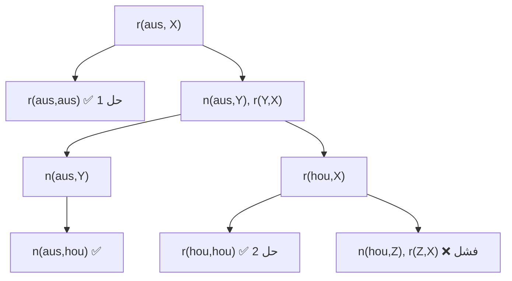

# المحاضرة 7 — Logic Programming (البرمجة المنطقية)
> **المادة:** لغات البرمجة (القسم العملي) | **الموضوع:** البرمجة المنطقية ولغة `Prolog` — الحقائق، القواعد، الاستعلامات، العودية، التوحيد، والتتبع

---

## الجزء الأول: ملخص منظم (اقرأ قبل المحاضرة!)

### 📍 عن هذه المحاضرة
> هذه المحاضرة تقدّم نمطاً جديداً كلياً في البرمجة يسمى `Logic Programming`، حيث لا نكتب "كيف" نحل المشكلة خطوة بخطوة، بل نصف "ما هو صحيح" ونترك محرك اللغة (مثل `Prolog`) يستنتج الإجابة بنفسه.

### 🎯 ستتعلم
- الفرق الجوهري بين البرمجة الإجرائية/الوظيفية (`Functions`) والبرمجة المنطقية (`Relations`)
- كيف تُكتب الحقائق `Facts` والقواعد `Rules` والاستعلامات `Queries` في `Prolog`
- مفهوم `Non-Determinism` والعودية `Recursion` وكيف تُبنى `Derived Predicates`
- آلية عمل `Prolog` الداخلية: البحث بالعمق أولاً، التراجعية `Backtracking`، والتوحيد `Unification`
- أدوات عملية: معامل `is`، التتبع `trace`، ومعامل التوقف `!` (`Cut`)

### 📚 المتطلبات السابقة
- فهم أساسي لمفهوم التابع `Function` في البرمجة الإجرائية (مدخل → مخرج) — لأننا سنقارنه بمفهوم العلاقة `Relation` في `Prolog`
- فكرة عامة عن قواعد البيانات العلائقية وجملة `SQL` البسيطة (`SELECT ... WHERE`) — لأن أحد الأمثلة يقارن بينها وبين استعلامات `Prolog`
- معرفة سطحية بفكرة الشجرة `Tree` والبحث فيها، لأنها ستُستخدم لشرح آلية البحث عن حل

### 💡 الأفكار الرئيسية
1. **العلاقة بدل التابع:** بدلاً من `f(x)=y`، نُعرّف علاقة `R(x,y)` تربط بين قيمتين دون حساب مباشر — وهذا يفتح الباب أمام حلول متعددة لنفس المدخل.
2. **الحقائق والقواعد:** البرنامج بأكمله هو مجموعة `Clauses` (حقائق وقواعد)، والاستعلام هو سؤال يُطرح على هذه القاعدة المعرفية ليستنتج النظام الجواب منطقياً.
3. **البحث والتراجع:** `Prolog` يبحث عن حل عبر بناء شجرة برهان، يتنقل فيها بالعمق أولاً، ويتراجع (`Backtracking`) كلما وصل لطريق مسدود ليجرّب مساراً آخر.

### 🔗 كيف تتصل هذه المحاضرة بالمحاضرات الأخرى؟
- **السابقة:** المحاضرات السابقة تناولت أنماط برمجية أخرى (إجرائية/وظيفية) ← الآن نبني عليها بمقارنتها بنمط مختلف جذرياً في طريقة التفكير بالمشكلة
- **القادمة:** مفاهيم `Unification` و`Backtracking` ستُستخدم لاحقاً لفهم محركات الاستدلال في أنظمة الذكاء الصنعي والنظم الخبيرة

### ⚠️ الأخطاء الشائعة الواجب تجنبها
- ❌ الاعتقاد أن `Prolog` "ينفّذ أوامر خطوة بخطوة" مثل `Python` أو `Java`
- ❌ الخلط بين المتحول المنطقي في `Prolog` (يُربط مرة واحدة عبر `Unification`) والمتغير في اللغات الإجرائية (يُعاد تعيينه بحرية)
- ❌ نسيان معامل التوقف `Cut` (`!`) عند الحاجة لمنع البحث عن حلول إضافية غير مرغوبة، وهو غير مرتبط بالتراجعية

---

## الجزء الثاني: الشرح التفصيلي (سطر بسطر / فقرة بفقرة)

### 1. من البرمجة الإجرائية إلى البرمجة المنطقية

<!-- @render: {type: "prose-first", visualization: "none", coverage: "100%"} -->
<!-- @connectivity: {prerequisite: "none"} -->

#### 📍 أين نحن الآن؟
هذه بداية موضوع جديد كلياً: الانتقال من التفكير بالتوابع إلى التفكير بالعلاقات.

#### 💡 الفكرة الأساسية
**في البرمجة التقليدية نحسب مخرجاً من مدخل عبر تابع `f(x)=y`، أما في البرمجة المنطقية نُعرّف علاقة `R(x,y)` تربط بين قيمتين دون حساب مباشر**

---

#### 📖 الشرح
في البرمجة الإجرائية أو الوظيفية، وحدة البناء الأساسية هي التابع `Function`. التابع علاقة خاصة جداً: لكل مدخل `x` يوجد مخرج واحد فقط `y`، ويُحسب هذا المخرج عبر سلسلة من الخطوات المحددة مسبقاً. هذا هو النموذج الذي اعتدنا عليه في `Python` أو `Java`: نكتب "كيف" نصل من `x` إلى `y`.

البرمجة المنطقية (أو القائمة على العلاقات) تبني نموذجاً مختلفاً بالكامل. المكوّن الأساسي هنا هو العلاقة `Relation` أو التناظر، ويُكتب على شكل `R(x,y)`. الفرق الجوهري هو أن العلاقة لا تفترض وجود اتجاه واحد أو نتيجة واحدة: هي فقط تصف أن `x` و`y` مرتبطان بطريقة معينة، دون أن تحدد دالة حسابية تنتج `y` من `x` بشكل مباشر.

لماذا هذا الفرق مهم؟ لأن التابع يفرض اتجاهاً واحداً للحساب (من المدخل إلى المخرج)، بينما العلاقة يمكن استخدامها في أكثر من اتجاه. فمثلاً علاقة الأبوة `father(X, Y)` يمكن استخدامها لسؤال "من هو أب Y؟" أو "من هم أبناء X؟" بنفس التعريف تماماً، بينما التابع الإجرائي يحتاج غالباً كتابة دالتين منفصلتين لهذين الاتجاهين.

هذا يعني أيضاً أن العلاقة قد تُنتج أكثر من إجابة واحدة لنفس المدخل، أو لا تُنتج أي إجابة على الإطلاق — بخلاف التابع الرياضي الذي يُنتج قيمة واحدة محددة دائماً (أو لا يُعرّف). هذه الخاصية ستظهر لاحقاً بوضوح تحت مسمى `Non-Determinism` (اللاحتمية)، وهي من أهم ما يميز `Prolog` عن اللغات الإجرائية.

تشبيه بسيط: تخيل تابعاً كـ "آلة" تدخل فيها مادة خام وتخرج منتجاً واحداً محدداً — هذا هو `f(x)=y`. أما العلاقة فهي أشبه بـ "قائمة معارف" في دفتر عائلة: تقول لك من يرتبط بمن، لكنها لا "تصنع" أحداً من الآخر، وقد يكون لشخص واحد عدة أقرباء مرتبطين به بنفس نوع العلاقة.

#### 🎯 الملخص السريع
- البرمجة الإجرائية/الوظيفية: تعتمد على `Functions` بعلاقة مدخل واحد ↔ مخرج واحد
- البرمجة المنطقية: تعتمد على `Relations` من الشكل `R(x,y)` دون اتجاه حسابي محدد
- العلاقة يمكن أن تُستخدم في أكثر من اتجاه، وقد تُنتج عدة إجابات أو لا شيء

#### 📚 التطبيق
هذا المفهوم هو الأساس الذي ستُبنى عليه الحقائق والقواعد في `Prolog` بالقسم التالي مباشرة.

#### ⚠️ أخطاء شائعة

#### الفهم الخاطئ ❌:
الاعتقاد أن `R(x,y)` هي مجرد طريقة أخرى لكتابة تابع عادي بحيث `y` يُحسب من `x`.

#### الفهم الصحيح ✅:
`R(x,y)` تصف وجود علاقة بين `x` و`y` دون أن تفرض كيف يُحسب أحدهما من الآخر، وقد تُستخدم لاستنتاج `x` من `y` أو العكس أو حتى التحقق من كليهما معاً.

#### 📄 النص الأصلي من المحاضرة
<details>
<summary>عرض النص الأصلي (coverage: 100%)</summary>

**النص الأصلي يقول:**
> "في البرمجة التقليدية (اإلجرائية/الوظيفية) يتم االعتماد على التوابع Functions... f(x)=y... حيث يُنتج المخرج y من المدخل x. أما في البرمجة المنطقية (أو القائمة على العالقات): هي المكّون األساسي العالقة (التناظر) R(x,y)... أي توجد عالقة تربط بين x و y بدون االعتماد على دالة تُحسب الناتج بشكل مباشر"

**ملاحظة على التغطية:**
- ✓ تم شرح: الفرق بين التابع والعلاقة، ومعنى `R(x,y)`
- ⚠️ غير مشروح بالكامل: لا شيء
- ℹ️ إضافة من الدليل: التشبيه بدفتر العائلة، وربط الفكرة بمفهوم `Non-Determinism` اللاحق

</details>

---

### 2. لغة Prolog: النشأة، الفكرة، والتطبيقات

<!-- @render: {type: "prose-first", visualization: "none", coverage: "100%"} -->
<!-- @connectivity: {prerequisite: "section_1"} -->

#### 💡 الفكرة الأساسية
**`Prolog` لغة برمجة منطقية طُوّرت عام 1972، تصف "ماذا" نريد حله عبر حقائق وقواعد واستعلامات، وليس "كيف" ننفذ الحل خطوة بخطوة**

---

#### 📖 الشرح
اسم `Prolog` هو اختصار للعبارة الفرنسية `Programmation en Logique`، وهو أشهر تمثيل عملي للبرمجة المنطقية. الفرق الأساسي بينه وبين لغات مثل `Python` أو `Java` هو أنه لا يعتمد على تنفيذ أوامر متسلسلة (`sequence of statements`)، بل على ثلاثة عناصر: الحقائق `Facts` (معلومات ثابتة معروفة)، القواعد `Rules` (علاقات منطقية تُشتق من حقائق أخرى)، والاستعلامات `Queries` (أسئلة نطرحها على النظام).

الفكرة الفلسفية وراء `Prolog` هي فصل "الوصف" عن "التنفيذ". في اللغات الإجرائية، البرنامج هو خوارزمية: نحن نحدد بالتفصيل تسلسل الخطوات. في `Prolog`، نحن نصف فقط: ما هو صحيح (الحقائق)، وما هي القوانين المنطقية التي تربط الأشياء ببعضها (القواعد). ثم نسأل النظام سؤالاً، وهو من يتولى مهمة "البحث" عن إجابة تحقق هذا الوصف عبر آلية استدلال داخلية.

طُوّرت اللغة عام 1972 على يد آلان كولميرار `Alain Colmerauer`، وقد جاء تطويرها في سياق أبحاث حول معالجة اللغة الطبيعية. هذا التاريخ مهم لأنه يفسر لماذا تُستخدم `Prolog` بكثرة في تطبيقات الذكاء الصنعي: فهي وُلدت أصلاً من محاولة تمثيل المعرفة اللغوية والمنطقية بشكل قابل للاستدلال الآلي، وليس فقط كأداة حسابية عامة.

من أبرز مجالات استخدام `Prolog`: معالجة اللغات الطبيعية `NLP`، أتمتة المنطق وبرهنة النظريات، البحث في قواعد البيانات (وهو مجال يتقاطع بشكل مباشر مع `SQL` كما سنرى لاحقاً)، والنظم الخبيرة `Expert Systems` التي تحاكي قرارات خبير بشري عبر مجموعة كبيرة من القواعد المنطقية. في كل هذه التطبيقات، القاسم المشترك هو أن المشكلة تُوصف طبيعياً كمجموعة من الحقائق والعلاقات، وليس كخوارزمية تسلسلية واضحة.

تشبيه: فكّر بمحقق جنائي يملك دفتر أدلة (الحقائق) ودليل تحقيق يشرح كيف تُربط الأدلة ببعضها (القواعد). عندما تسأله "هل الشخص X مذنب؟"، هو لا "يُنفّذ برنامجاً" بل يبحث في معارفه وقواعده ليستنتج الجواب — هذا بالضبط ما يفعله `Prolog` عندما يستقبل استعلاماً.

#### 🎯 الملخص السريع
- `Prolog` = `Programmation en Logique`، طوّرها آلان كولميرار عام 1972
- تعتمد على ثلاثة عناصر: `Facts`، `Rules`، `Queries`
- الفكرة: وصف "ماذا" هو الصحيح، وترك النظام يستنتج "كيف" الوصول للجواب
- تُستخدم في: `NLP`، برهنة النتائج، البحث في قواعد البيانات، النظم الخبيرة

#### 📚 التطبيق
سنرى في القسم التالي الصيغة العملية الدقيقة لكتابة الحقائق والقواعد والاستعلامات في `Prolog`.

#### ⚠️ أخطاء شائعة

#### الفهم الخاطئ ❌:
الاعتقاد أن `Prolog` لغة قديمة نادرة الاستخدام لا علاقة لها بالتطبيقات الحديثة.

#### الفهم الصحيح ✅:
مفاهيم `Prolog` (الاستدلال المنطقي، القواعد، البحث بالتراجع) تُستخدم حتى اليوم في محركات النظم الخبيرة وبعض أدوات الذكاء الصنعي الرمزي `Symbolic AI`.

#### 📄 النص الأصلي من المحاضرة
<details>
<summary>عرض النص الأصلي (coverage: 100%)</summary>

**النص الأصلي يقول:**
> "Prolog اختصار لـ Logique en Programmmation، هي لغة برمجة من نوع البرمجة المنطقية... ال تعتمد على األوامر خطوة بخطوة، بل على الحقائق Facts والقواعد Rules واالستعالمات Queries... تم تطويرها من قبل آالن كولميرار عام 1972... تستخدم في تطبيقات الذكاء الصنعي وقواعد البيانات"

**ملاحظة على التغطية:**
- ✓ تم شرح: التسمية، الفكرة الفلسفية، تاريخ التطوير، التطبيقات
- ⚠️ غير مشروح بالكامل: تفاصيل تقنية دقيقة عن كيفية استخدامها في NLP تحديداً غير واردة بالمحاضرة أصلاً
- ℹ️ إضافة من الدليل: تشبيه المحقق الجنائي، وربط تاريخ النشأة بتفسير سبب انتشارها في الذكاء الصنعي

</details>

---

### 3. الحقائق والقواعد والاستعلامات (Facts, Rules, Queries)

<!-- @render: {type: "code-first", visualization: "none", coverage: "100%"} -->
<!-- @connectivity: {prerequisite: "section_2"} -->

#### 💡 الفكرة الأساسية
**الحقيقة `Fact` معلومة ثابتة، القاعدة `Rule` علاقة منطقية مشتقة من حقائق أخرى، والاستعلام `Query` سؤال نطرحه ليستنتج النظام الجواب**

#### 💻 الكود / شبه الكود

```prolog
% الحقائق (Facts): معلومات ثابتة
father(ali, ahmed).
father(ali, sara).

% القواعد (Rules): تمثل علاقات منطقية
grandfather(X, Y) :- father(X, Z), father(Z, Y).

% الاستعلام (Query): نسأل النظام
?- father(ali, ahmed).
```

#### شرح كل سطر:
1. `father(ali, ahmed).` → حقيقة `Fact` — تقول ببساطة "علي هو أب أحمد"، وهي معلومة ثابتة لا تحتاج شرطاً لتكون صحيحة
2. `father(ali, sara).` → حقيقة ثانية — "علي هو أب سارة"، ولاحظ أن نفس الفرضية `father` تُستخدم لعدة حقائق مختلفة
3. `grandfather(X, Y) :- father(X, Z), father(Z, Y).` → قاعدة `Rule` — تُقرأ: "X جد لـ Y إذا وُجد Z بحيث X أب لـ Z و Z أب لـ Y"؛ الرمز `:-` يعني "إذا"
4. `?- father(ali, ahmed).` → استعلام `Query` — نسأل النظام "هل علي أب أحمد؟" فيبحث في الحقائق ويجيب بنعم لأن الحقيقة موجودة حرفياً

#### 📖 الشرح
لفهم `Prolog` بشكل صحيح يجب التمييز بوضوح بين هذه العناصر الثلاثة، لأن كل واحد منها له دور مختلف تماماً داخل البرنامج. الحقيقة `Fact` هي أبسط عنصر: جملة تُعلن صحتها مباشرة دون أي شرط، مثل `father(ali, ahmed).` — هذه لا "تُحسب"، بل هي معطى ثابت يعرفه النظام مسبقاً، تماماً كسطر في جدول قاعدة بيانات.

القاعدة `Rule` مختلفة: هي علاقة مشروطة، تُكتب بصيغة "الرأس :- الجسم"، وتعني أن الرأس (النتيجة) يكون صحيحاً إذا كان جسم القاعدة (الشروط) صحيحاً. في المثال، `grandfather(X, Y)` ليست حقيقة معروفة مسبقاً، بل تُشتق ديناميكياً من حقائق `father` الموجودة بالفعل، عبر البحث عن قيمة وسيطة `Z` تربط بين X و Y بخطوتي أبوة متتاليتين.

أما الاستعلام `Query` فهو ليس جزءاً من قاعدة المعرفة نفسها، بل هو الطريقة التي "نتفاعل" بها مع البرنامج من الخارج. عندما نكتب `?- father(ali, ahmed).`، فنحن لا نضيف معلومة جديدة، بل نطلب من `Prolog` أن يتحقق مما إذا كانت هذه الجملة قابلة للاستنتاج من قاعدة المعرفة الحالية (الحقائق + القواعد)، فيجيب بـ `Yes` أو `No` (أو بقيم متغيرات إن كان الاستعلام يحتوي متحولات كما سنرى لاحقاً).

من المهم أيضاً ملاحظة الفرق البنيوي: القاعدة تشبه دالة رياضية شرطية "إذا تحقق كذا وكذا، فكذا صحيح"، لكنها تختلف عن `if` في اللغات الإجرائية لأنها لا تُنفَّذ مرة واحدة بترتيب معين، بل تُستخدم كنمط `Pattern` يُطابقه `Prolog` مع الاستعلامات المطروحة، وقد يُطابق بأكثر من طريقة إذا وُجد أكثر من `Z` ممكن يحقق الشرط.

مثال إضافي للتوضيح: تخيل جدول عائلة كبير فيه عشرات علاقات `father`. القاعدة الواحدة `grandfather` تكفي لاستنتاج كل علاقات الجدّية الممكنة، دون أن نكتب يدوياً كل حقيقة جدّية بشكل منفصل — وهذا هو جوهر قوة البرمجة المنطقية: قاعدة واحدة عامة تُغني عن مئات الحقائق الفرعية.

#### 🎯 الملخص السريع
- `Facts`: معلومات ثابتة معروفة، بدون شرط
- `Rules`: تُكتب `Head :- Body`، وتُشتق من حقائق/قواعد أخرى
- `Queries`: أسئلة نطرحها بالصيغة `?- ...` ليستنتج النظام الجواب

#### 📚 التطبيق
سنطبّق هذه العناصر الثلاثة في مثال متكامل: تخطيط رحلة طيران، حيث الحقائق تمثّل الرحلات المباشرة.

#### ⚠️ أخطاء شائعة

#### الفهم الخاطئ ❌:
الاعتقاد أن القاعدة `grandfather(X, Y) :- father(X, Z), father(Z, Y).` تنفّذ خطوتين بالترتيب كما في كود إجرائي.

#### الفهم الصحيح ✅:
القاعدة تصف شرطاً منطقياً يجب أن يتحقق معاً (`X` أب لـ `Z` **و** `Z` أب لـ `Y` في نفس الوقت)، ويبحث `Prolog` عن قيمة `Z` تحقق الشرطين، وليس بالضرورة أن ينفذهما بترتيب زمني محدد.

#### 📄 النص الأصلي من المحاضرة
<details>
<summary>عرض النص الأصلي (coverage: 100%)</summary>

**النص الأصلي يقول:**
> "الحقائق (Facts) تمثل معلومات ثابتة: father(ali, ahmed). father(ali, sara). القواعد (Rules) تمثل عالقات منطقية: grandfather(X, Y) :- father(X, Z), father(Z, Y). نسأل النظام: االستعالم (Query) ?- father(ali, ahmed)."

**ملاحظة على التغطية:**
- ✓ تم شرح: كل عنصر من الثلاثة بالتفصيل مع أمثلة
- ⚠️ غير مشروح بالكامل: لا شيء
- ℹ️ إضافة من الدليل: تشبيه جدول العائلة الكبير لتوضيح قوة القواعد العامة

</details>

---

### 4. مثال تخطيط رحلة طيران: تمثيل الحقائق

<!-- @render: {type: "code-first", visualization: "none", coverage: "100%"} -->
<!-- @connectivity: {prerequisite: "section_3"} -->

#### 📍 أين نحن الآن؟
بدأنا موضوعاً رئيسياً جديداً: تطبيق عملي متكامل سنستخدمه في بقية المحاضرة — تخطيط رحلات الطيران بين خمس مدن.

#### 💡 الفكرة الأساسية
**كل سطر في `Prolog` يمثل عبارة `Clause` تعبّر عن حقيقة معروفة، والعلاقة `nonstop(X,Y)` تعني وجود رحلة مباشرة من X إلى Y**

#### 💻 الكود / شبه الكود

```prolog
nonstop(aus, dal).
nonstop(aus, hou).
nonstop(aus, phx).
nonstop(dal, okc).
nonstop(dal, hou).
nonstop(hou, okc).
nonstop(okc, phx).
```

#### شرح كل سطر:
1. `nonstop(aus, dal).` → حقيقة: يوجد رحلة مباشرة من `aus` (أوستن) إلى `dal` (دالاس)
2. `nonstop(aus, hou).` → حقيقة: رحلة مباشرة من `aus` إلى `hou` (هيوستن)
3. `nonstop(aus, phx).` → حقيقة: رحلة مباشرة من `aus` إلى `phx` (فينيكس)
4. `nonstop(dal, okc).` → حقيقة: رحلة مباشرة من `dal` إلى `okc` (أوكلاهوما)
5. `nonstop(dal, hou).` → حقيقة: رحلة مباشرة من `dal` إلى `hou`
6. `nonstop(hou, okc).` → حقيقة: رحلة مباشرة من `hou` إلى `okc`
7. `nonstop(okc, phx).` → حقيقة: رحلة مباشرة من `okc` إلى `phx`

**الناتج المتوقع (لقطة الشاشة):**
> هذه الأسطر السبعة وحدها لا تُنتج مخرجاً — هي فقط تعريف لقاعدة معرفية جاهزة للاستعلام عنها لاحقاً.

#### 📖 الشرح
هذا المثال يمثل شبكة طيران بين خمس مدن: `AUS` (أوستن)، `DAL` (دالاس)، `HOU` (هيوستن)، `OKC` (أوكلاهوما)، `PHX` (فينيكس). كل حقيقة من الشكل `nonstop(X, Y)` تُترجم مباشرة إلى سهم في الشبكة يشير من المدينة X إلى المدينة Y، أي "توجد رحلة مباشرة (بدون توقف) من X إلى Y".

من المهم ملاحظة أن كل سطر ينتهي بنقطة `.` ويُسمى بشكل عام `Clause` (عبارة)، وهو المصطلح الذي سيتكرر طوال بقية المحاضرة سواء تحدثنا عن حقائق أو قواعد. كل `Clause` هنا هو حقيقة بسيطة لا تحتاج شرطاً، أي أن `Prolog` يعتبرها صحيحة بشكل مطلق بمجرد وجودها في البرنامج.

لماذا اختير هذا المثال تحديداً لتعليم `Prolog`؟ لأنه يمثل بشكل طبيعي جداً بنية "شبكة/رسم بياني موجّه" `Directed Graph`، وهذا النوع من البيانات هو أحد أكثر الحالات التي تتفوق فيها البرمجة المنطقية على الطرق الإجرائية: بدلاً من كتابة خوارزمية بحث في الرسم البياني يدوياً (مثل `BFS` أو `DFS`)، يكفي تعريف الحقائق، وترك `Prolog` يجد المسارات تلقائياً عبر قواعد بسيطة نبنيها لاحقاً.

يجب الانتباه إلى شيء مهم: العلاقة هنا **غير متناظرة** (`asymmetric`) — أي أن `nonstop(aus, dal)` لا تعني تلقائياً وجود `nonstop(dal, aus)`. فإذا نظرنا للحقائق السبع، نجد أن الاتجاه من `dal` إلى `aus` مثلاً غير معرَّف إطلاقاً، تماماً كما لا توجد كل الرحلات في الاتجاهين في شبكات الطيران الحقيقية.

مثال إضافي: يمكن تخيل نفس الفكرة في سياق مختلف تماماً، كعلاقة `follows(X, Y)` على منصة تواصل اجتماعي، حيث `follows(sara, ali)` لا تعني أن `ali` يتابع `sara` بالضرورة. هذا النمط من "الحقائق أحادية الاتجاه" شائع جداً في تمثيل البيانات الواقعية بـ `Prolog`.

#### 🎯 الملخص السريع
- كل سطر (`Clause`) يمثل حقيقة ثابتة
- `nonstop(X, Y)` تعني وجود رحلة مباشرة من X إلى Y فقط (اتجاه واحد)
- الشبكة تربط 5 مدن: `AUS, DAL, HOU, OKC, PHX` عبر 7 رحلات مباشرة

#### 📚 التطبيق
في الأقسام القادمة سنستعلم عن هذه الشبكة مباشرة، ثم نبني قاعدة عودية `reach` للوصول بين أي مدينتين حتى لو لم تكن الرحلة مباشرة.

#### ⚠️ أخطاء شائعة

#### الفهم الخاطئ ❌:
افتراض أن وجود `nonstop(aus, dal)` يعني تلقائياً وجود `nonstop(dal, aus)`.

#### الفهم الصحيح ✅:
كل حقيقة اتجاهية بحتة، ويجب تعريفها صراحة في كل اتجاه إذا أردنا تمثيل رحلة ذهاب وعودة.

#### 📄 النص الأصلي من المحاضرة
<details>
<summary>عرض النص الأصلي (coverage: 100%)</summary>

**النص الأصلي يقول:**
> "كل سطر يسمي عبارة Clause تعبر عن حقيقة معروفة... العلاقة nonstop(X,Y) تعبر عن وجود رحلة من X إلى Y"

**ملاحظة على التغطية:**
- ✓ تم شرح: مفهوم `Clause`، معنى `nonstop(X,Y)`، بنية الشبكة
- ⚠️ غير مشروح بالكامل: لا شيء
- ℹ️ إضافة من الدليل: تشبيه `follows` على وسائل التواصل الاجتماعي لتوضيح عدم التناظر

</details>

---

### 5. الاستعلامات في Prolog ومقارنتها بـ SQL

<!-- @render: {type: "code-first", visualization: "none", coverage: "100%"} -->
<!-- @connectivity: {prerequisite: "section_4"} -->

#### 💡 الفكرة الأساسية
**الاستعلام `?- nonstop(aus, dal).` يُجيب بـ `Yes`/`No` عند غياب المتحولات، لكنه يُنتج قيماً فعلية عند استخدام متحول مثل `X` — وهذا يجعله أقوى من `SQL` بفضل قدرته على العودية**

#### 💻 الكود / شبه الكود

```prolog
?- nonstop(aus, dal).
Yes

?- nonstop(dal, okc).
Yes

?- nonstop(aus, okc).
No

% كيف يمكنني الطيران إلى أوستن انطلاقاً من مدينة ما؟
?- nonstop(aus, X).
```

#### شرح كل سطر:
1. `?- nonstop(aus, dal).` → `Yes` — الحقيقة موجودة حرفياً في القاعدة، فيرد النظام بالتأكيد
2. `?- nonstop(dal, okc).` → `Yes` — نفس المنطق، الحقيقة معرَّفة صراحة
3. `?- nonstop(aus, okc).` → `No` — لا توجد رحلة **مباشرة** من `aus` إلى `okc` (رغم وجود مسار غير مباشر عبر `dal` أو `hou`)
4. `?- nonstop(aus, X).` → استعلام بمتحول — يسأل "ما القيم الممكنة لـ X بحيث توجد رحلة مباشرة من aus إليها؟"

#### 📖 الشرح
أبسط أنواع الاستعلامات هي تلك التي لا تحتوي متحولات، وتتصرف تماماً كسؤال منطقي بسيط: هل هذه الجملة صحيحة أم لا؟ الجواب يكون `Yes` إذا استطاع `Prolog` مطابقة الاستعلام بشكل حرفي مع حقيقة موجودة (أو استنتاجها من قاعدة)، و`No` إن لم يستطع.

لكن القوة الحقيقية لـ `Prolog` تظهر عندما نُدخل متحولاً في الاستعلام، مثل `?- nonstop(aus, X).`. هنا لا نسأل سؤالاً ثنائي الإجابة، بل نطلب من النظام أن **يبحث عن كل القيم الممكنة** التي تجعل الجملة صحيحة. هذا يقابل تماماً سؤال "كيف يمكنني الطيران إلى مدينة X انطلاقاً من `aus`؟" وستُرجع `Prolog` القيم واحدة تلو الأخرى.

المقارنة مع `SQL` هنا مفيدة جداً لأن كثيراً من المبرمجين يعرفون `SQL` مسبقاً. السؤال "كيف يمكنني الطيران إلى مدينة معينة انطلاقاً من `aus`؟" يُكتب بـ `SQL` كالتالي: `SELECT dest FROM nonstop WHERE source="aus"`، بينما يُكتب بـ `Prolog` بشكل أبسط بكثير: `?- nonstop(aus, X).`. الفرق ليس فقط في الاختصار، بل في القدرة: `Prolog` أقوى من `SQL` البسيط لأنه يمكن استخدام **العودية** `Recursion` لبناء علاقات مركّبة (مثل "الوصول عبر عدة محطات")، بينما هذا يتطلب في `SQL` استعلامات معقدة متكررة أو ميزات متقدمة مثل `Recursive CTE`.

من الناحية العملية، هذا التشابه بين `Prolog` و`SQL` ليس مصادفة: كلاهما لغتان تصريحيتان `Declarative` تصفان "ما" نريد وليس "كيف" نحصل عليه، وهذا هو سبب استخدام `Prolog` في مجالات البحث داخل قواعد البيانات كما ذُكر سابقاً.

#### 🎯 الملخص السريع
- استعلام بدون متحولات → إجابة `Yes`/`No`
- استعلام بمتحول → `Prolog` يبحث عن كل القيم الممكنة لهذا المتحول
- `Prolog` أقوى من `SQL` البسيط بفضل قدرته على استخدام `Recursion`

#### 📚 التطبيق
هذا المفهوم (الاستعلام بمتحول) سيُبنى عليه مباشرة في القسم التالي عبر مفهوم `Non-Determinism`.

#### ⚠️ أخطاء شائعة

#### الفهم الخاطئ ❌:
الاعتقاد أن `?- nonstop(aus, X).` يُرجع قيمة واحدة فقط دائماً.

#### الفهم الصحيح ✅:
قد يُرجع أكثر من قيمة واحدة تِباعاً إذا وُجد أكثر من رحلة مباشرة تحقق الشرط، وهذا مرتبط مباشرة بمفهوم `Non-Determinism`.

#### 📄 النص الأصلي من المحاضرة
<details>
<summary>عرض النص الأصلي (coverage: 100%)</summary>

**النص الأصلي يقول:**
> "كيف يمكنني الطيران إلى مدينة أوستن Austin؟ باالعتماد على SQL: Select dest from nonstop where source='aus' باالعتماد على Prolog: ?-nonstop(aus,X) أكثر قوة من SQL إلمكانية استخدام العودية"

**ملاحظة على التغطية:**
- ✓ تم شرح: أمثلة `Yes/No`، الاستعلام بمتحول، مقارنة `SQL`
- ⚠️ غير مشروح بالكامل: لا شيء
- ℹ️ إضافة من الدليل: توضيح أن كلا اللغتين تصريحيتان `Declarative` كسبب للتشابه

</details>

---

### 6. المتحولات المنطقية واللاحتمية (Non-Determinism)

<!-- @render: {type: "code-first", visualization: "none", coverage: "100%"} -->
<!-- @connectivity: {prerequisite: "section_5"} -->

#### 💡 الفكرة الأساسية
**اللاحتمية تعني أن الفرضية `Predicate` يمكن أن تمتلك عدة أجوبة أو لا أجوبة، دون أن يكون البرنامج مجبراً على السير في مسار واحد محدد مسبقاً**

#### 💻 الكود / شبه الكود

```prolog
?- nonstop(okc, X).
X = phx ;
No

?- nonstop(Y, dal).
Y = aus ;
No
```

#### شرح كل سطر:
1. `?- nonstop(okc, X).` → يسأل: هل توجد قيمة X بحيث تكون العلاقة `nonstop(okc, X)` صحيحة؟
2. `X = phx ;` → أول (وهنا الوحيد) حل يجده النظام؛ العلامة `;` تطلب من `Prolog` البحث عن حل إضافي
3. `No` → لا يوجد حل ثانٍ، فينتهي البحث
4. `?- nonstop(Y, dal).` → نفس الفكرة لكن بحثاً عن قيمة `Y` تجعل `nonstop(Y, dal)` صحيحة
5. `Y = aus ;` → الحل الوحيد الموجود
6. `No` → لا يوجد حل إضافي

#### 📖 الشرح
حتى الآن استعرضنا استعلامات بمتحول واحد، لكن هذا القسم يشرح **آلية** إيجاد تلك القيم بشكل أعمق تحت مسمى اللاحتمية `Non-Determinism`. اللاحتمية هنا لا تعني عشوائية أو غموضاً، بل تعني أن البرنامج قادر على "اتخاذ مسارات مختلفة أو الوصول إلى حلول متعددة لنفس المدخلات، دون أن يكون مجبراً على السير في طريق واحد محدد مسبقاً" كما ورد حرفياً في المحاضرة.

الفرضية `Predicate` (مثل `nonstop(X,Y)`) قد تُطابق أكثر من حقيقة واحدة في القاعدة المعرفية. عندما نسأل `?- nonstop(okc, X).`، يبحث `Prolog` عن **كل** الحقائق التي تبدأ بـ `nonstop(okc, ...)`، ويعيدها واحدة تلو الأخرى كلما طلبنا حلاً إضافياً (عبر الفاصلة المنقوطة `;` في بيئات مثل `SWI-Prolog`). في هذا المثال بالذات لا توجد سوى رحلة مباشرة واحدة من `okc`، وهي إلى `phx`، لذا يتوقف البحث بعد أول نتيجة بـ `No`.

هذه الآلية مختلفة جوهرياً عن التوابع في اللغات الإجرائية، حيث يُنتج التابع دائماً نتيجة واحدة محددة (أو خطأ). في `Prolog`، الفرضية الواحدة يمكن أن "تتفرع" منطقياً إلى عدة إجابات محتملة، وعلى المبرمج (أو المستخدم) أن يطلب صراحة الاستمرار في البحث عن حلول إضافية إذا رغب بذلك.

لماذا هذا التصميم مفيد؟ لأنه يسمح للغة بالتعبير الطبيعي عن مسائل لها أكثر من حل ممكن، مثل "ما المدن التي يمكن الوصول إليها مباشرة من X؟" دون الحاجة لكتابة حلقة `loop` يدوية لجمع كل النتائج — `Prolog` يقوم بذلك تلقائياً عبر آلية البحث الداخلية التي سنشرحها بالتفصيل لاحقاً (البحث بالعمق أولاً والتراجعية).

مثال إضافي: تخيل قاعدة بيانات لأصدقاء على تطبيق تواصل، والفرضية `friend(ali, X)`. إذا كان لعلي خمسة أصدقاء، فإن الاستعلام سيُنتج خمس قيم ممكنة لـ X بالتتابع، تماماً كما تُنتج `nonstop(okc, X)` كل الوجهات المباشرة الممكنة من `okc` — والحالة الخاصة هنا هي أن يكون العدد صفراً (لا أجوبة) أو واحداً فقط كما في مثالنا.

#### 🎯 الملخص السريع
- اللاحتمية = إمكانية وجود عدة حلول أو لا حلول لنفس الفرضية
- `Prolog` يبحث عن الحلول واحداً تلو الآخر عند الطلب (`;`)
- هذا يختلف جذرياً عن التابع الإجرائي ذي المخرج الواحد الثابت

#### 📚 التطبيق
اللاحتمية هي الأساس الذي يُبنى عليه لاحقاً مفهوم `Backtracking` عندما يفشل مسار بحث معين.

#### ⚠️ أخطاء شائعة

#### الفهم الخاطئ ❌:
الاعتقاد أن `Prolog` يعيد قيمة واحدة فقط تلقائياً عند وجود عدة حلول ممكنة.

#### الفهم الصحيح ✅:
`Prolog` يعيد الحل الأول فقط، لكنه يبحث عن حلول إضافية عند الطلب الصريح، وقد ينتج عدة قيم متتالية لنفس الاستعلام.

#### 📄 النص الأصلي من المحاضرة
<details>
<summary>عرض النص الأصلي (coverage: 100%)</summary>

**النص الأصلي يقول:**
> "الالحتمية Non-Determinism: أن البرنامج يمكنه اتخاذ مسارات مختلفة أو الوصول إلى حلول متعددة لنفس المدخالت، دون أن يكون مجبرا على السير في طريق واحد محدد مسبقا. الفرضية Predicate يمكن أن تمتلك عدة أجوبة أو ال أجوبة"

**ملاحظة على التغطية:**
- ✓ تم شرح: تعريف اللاحتمية بدقة مع مثالي `nonstop(okc,X)` و`nonstop(Y,dal)`
- ⚠️ غير مشروح بالكامل: لا شيء
- ℹ️ إضافة من الدليل: مثال قائمة الأصدقاء لتوضيح تعدد الحلول

</details>

---

### 7. الربط المنطقي (Logical Conjunction)

<!-- @render: {type: "code-first", visualization: "none", coverage: "100%"} -->
<!-- @connectivity: {prerequisite: "section_6"} -->

#### 💡 الفكرة الأساسية
**الفاصلة `,` بين شرطين في الاستعلام تمثل معامل `AND`، وتسمح بدمج عدة شروط في استعلام واحد**

#### 💻 الكود / شبه الكود

```prolog
?- nonstop(aus, X), nonstop(X, okc).
X = dal ;
X = hou ;
No
```

#### شرح كل سطر:
1. `?- nonstop(aus, X), nonstop(X, okc).` → يسأل عن مدينة وسيطة X: يوجد رحلة مباشرة من `aus` إليها، **و**رحلة مباشرة منها إلى `okc`
2. `X = dal ;` → أول حل: عبر `dal` يمكن الوصول من `aus` إلى `okc` بخطوتين
3. `X = hou ;` → حل ثانٍ: عبر `hou` أيضاً يمكن ذلك
4. `No` → لا يوجد حل ثالث للمتحول X

#### 📖 الشرح
الربط المنطقي `Conjunction` هو الطريقة التي تُدمج بها عدة شروط داخل استعلام واحد باستخدام الفاصلة `,`، والتي تُقرأ منطقياً كمعامل `AND`. الجملة `nonstop(aus, X), nonstop(X, okc)` تعني حرفياً: "أريد X بحيث يتحقق الشرط الأول **و** الشرط الثاني معاً في نفس الوقت"، وليس أحدهما فقط.

من الناحية العملية، هذا يسمح ببناء استعلامات مركبة تمثل مسارات بخطوتين أو أكثر داخل شبكة الرحلات، دون الحاجة لتعريف قاعدة `Rule` جديدة مسبقاً. في المثال، نبحث عن كل مدينة X تصلح كمحطة وسيطة بين `aus` و`okc` عبر رحلتين متتاليتين، ويجد `Prolog` حلين: `dal` و`hou`، لأن كلتيهما تتوسط بالفعل بين المدينتين حسب الحقائق المعرّفة سابقاً.

آلية عمل `Prolog` هنا مهمة: هو لا يجرب الشرطين بشكل منفصل تماماً، بل يبحث أولاً عن قيمة X تحقق الشرط الأول (`nonstop(aus, X)`)، ثم يتحقق فوراً إن كانت نفس القيمة تحقق الشرط الثاني (`nonstop(X, okc)`) أيضاً. إن فشل الشرط الثاني مع قيمة معينة، يعود (`Backtrack`) ليجرب قيمة أخرى للشرط الأول، وهكذا حتى تُستنفد كل الاحتمالات الممكنة.

هذا المفهوم يوضح لماذا `Prolog` أقوى من الاستعلام البسيط بشرط واحد: فبواسطة الربط المنطقي فقط (دون عودية بعد)، استطعنا التعبير عن "مسار من خطوتين"، وهذا تمهيد طبيعي لفهم كيف تُبنى القواعد المشتقة `Derived Predicates` في القسم التالي، والتي تستخدم نفس مبدأ الربط لكن بشكل معرَّف مسبقاً وقابل لإعادة الاستخدام.

مثال إضافي: لو أردنا التحقق من أن شخصاً "أخ" لشخص آخر، قد نكتب استعلاماً مركباً مثل `father(F, X), father(F, Y)` بحيث يشترك X وY بنفس الأب F — وهو مثال آخر على استخدام الفاصلة `,` لدمج شرطين يجب تحققهما معاً.

#### 🎯 الملخص السريع
- الفاصلة `,` في `Prolog` تعني `AND` منطقي
- تسمح بدمج عدة شروط يجب أن تتحقق معاً في استعلام واحد
- تُستخدم لتمثيل مسارات متعددة الخطوات دون تعريف قاعدة جديدة

#### 📚 التطبيق
الربط المنطقي هو اللبنة الأساسية التي ستُستخدم داخل جسم كل قاعدة `Rule` بما فيها الفرضيات المشتقة في القسم القادم.

#### ⚠️ أخطاء شائعة

#### الفهم الخاطئ ❌:
الاعتقاد أن `Prolog` يجرب كل قيم X من الشرط الأول أولاً بشكل منفصل، ثم يفحص الشرط الثاني على كل القيم دفعة واحدة.

#### الفهم الصحيح ✅:
`Prolog` يفحص الشرطين معاً لكل قيمة على حدة بالتتابع (يجد قيمة تحقق الأول، يفحصها فوراً بالثاني، ثم يتراجع إن لزم)، وهي آلية `Backtracking` التي سنفصّلها لاحقاً.

#### 📄 النص الأصلي من المحاضرة
<details>
<summary>عرض النص الأصلي (coverage: 100%)</summary>

**النص الأصلي يقول:**
> "الربط المنطقي Logical Conjunction: الربط باالعتماد على المعامل AND... nonstop(aus, X), nonstop(X, okc)... دمج عدة شروط في استعالم واحدة"

**ملاحظة على التغطية:**
- ✓ تم شرح: معنى الفاصلة كـ `AND`، وتحليل نتائج المثال بالكامل
- ⚠️ غير مشروح بالكامل: لا شيء
- ℹ️ إضافة من الدليل: شرح آلية التحقق المتسلسل والتمهيد لـ `Backtracking`، ومثال الأخوة `father(F,X), father(F,Y)`

</details>

---

### 8. الفرضيات المشتقة (Derived Predicates)

<!-- @render: {type: "code-first", visualization: "none", coverage: "100%"} -->
<!-- @connectivity: {prerequisite: "section_7"} -->

#### 💡 الفكرة الأساسية
**نعرّف فرضية جديدة بناءً على القواعد الموجودة بالصيغة `Conclusion :- premises`، وتكون النتيجة صحيحة إذا كانت كل الشروط صحيحة**

#### 💻 الكود / شبه الكود

```prolog
% الحقائق (Facts)
nonstop(aus, dal).
nonstop(aus, hou).
nonstop(aus, phx).
nonstop(dal, okc).
nonstop(dal, hou).
nonstop(hou, okc).
nonstop(okc, phx).

flyvia(From, To, Via) :- nonstop(From, Via), nonstop(Via, To).
```

#### شرح كل سطر:
1. الأسطر 2-8 → نفس حقائق `nonstop` المعرّفة سابقاً، تبقى كما هي دون تغيير
2. `flyvia(From, To, Via) :- nonstop(From, Via), nonstop(Via, To).` → قاعدة جديدة (فرضية مشتقة): "يمكن الطيران من From إلى To عبر محطة Via إذا وُجدت رحلة مباشرة من From إلى Via، ورحلة مباشرة من Via إلى To"

#### 📖 الشرح
الفرضية المشتقة `Derived Predicate` هي أي فرضية جديدة **لا** تُعرَّف كحقيقة مباشرة، بل تُبنى بالاستناد إلى قواعد وحقائق موجودة مسبقاً، بالصيغة العامة `Conclusion :- premises` التي رأيناها سابقاً مع `grandfather`. القاعدة العامة لهذه الصيغة هي: النتيجة (الرأس، أي الجزء الذي على يسار `:-`) تكون صحيحة **فقط** إذا كانت كل الشروط (الجسم، الجزء على يمين `:-`) صحيحة في آن واحد.

في مثال `flyvia`، نبني على مفهوم الربط المنطقي `Conjunction` الذي شرحناه في القسم السابق، لكن بدلاً من كتابته كاستعلام مؤقت، نحوّله إلى قاعدة دائمة يمكن استدعاؤها لاحقاً باسمها. هذا فرق جوهري: الاستعلام `?- nonstop(aus, X), nonstop(X, okc).` مؤقت وخاص بحالة واحدة، بينما `flyvia(From, To, Via)` قاعدة عامة تصلح لأي ثلاث مدن نمرّرها كوسائط.

من الناحية العملية، عندما نستعلم `?- flyvia(aus, okc, Via).`، فإن `Prolog` يستبدل `From` بـ `aus` و `To` بـ `okc`، ثم يبحث عن كل قيمة لـ `Via` تجعل كلا الشرطين `nonstop(aus, Via)` و`nonstop(Via, okc)` صحيحين معاً — تماماً بنفس آلية البحث التي رأيناها في مثال الربط المنطقي، لكن الآن معبّأة داخل تعريف قابل لإعادة الاستخدام.

لماذا هذا النمط أساسي في `Prolog`؟ لأنه يمثل الطريقة الوحيدة لبناء منطق أكثر تعقيداً انطلاقاً من حقائق بسيطة، دون تكرار نفس الاستعلام المركب يدوياً في كل مرة. وهو أيضاً حجر الأساس لفهم العودية `Recursion` في القسم القادم، حيث ستكون القاعدة العودية مجرد حالة خاصة من الفرضية المشتقة، حيث يستدعي جسم القاعدة نفس اسم الفرضية التي يُعرّفها.

مثال إضافي: يمكن تعريف `cousin(X, Y) :- father(FX, X), father(FY, Y), father(GP, FX), father(GP, FY).` كفرضية مشتقة تصف "ابن العم"، وهي أعقد من `grandfather` لكنها تتبع نفس المبدأ تماماً: النتيجة صحيحة إذا تحققت كل الشروط الفرعية معاً.

#### 🎯 الملخص السريع
- الصيغة العامة: `Conclusion :- premises`
- النتيجة صحيحة فقط إذا كانت كل الشروط (`premises`) صحيحة معاً
- الفرضية المشتقة تحوّل استعلاماً مركباً مؤقتاً إلى قاعدة دائمة قابلة لإعادة الاستخدام

#### 📚 التطبيق
هذا المبدأ هو الأساس المباشر للعودية `Recursion` القادمة، والتي ستسمح بالوصول بين مدينتين عبر عدد غير محدود من المحطات الوسيطة.

#### ⚠️ أخطاء شائعة

#### الفهم الخاطئ ❌:
الاعتقاد أن `flyvia` تعمل فقط لثلاث مدن محددة مسبقاً داخل الكود.

#### الفهم الصحيح ✅:
`flyvia(From, To, Via)` قاعدة عامة تتقبّل أي قيم كوسائط، بما فيها متحولات غير معروفة، ويبحث `Prolog` عن كل تركيبة ممكنة تحقق شروطها.

#### 📄 النص الأصلي من المحاضرة
<details>
<summary>عرض النص الأصلي (coverage: 100%)</summary>

**النص الأصلي يقول:**
> "الفرضيات المشتقة Derived Predicates: تعريف فرضية جديدة بناءً على القواعد الموجودة. Conclusion :-premises. النتيجة صحيحة إذا كانت الشروط صحيحة" (مع مثال `flyvia(From, To, Via) :- nonstop(From, Via), nonstop(Via, To).` المعروض في بيئة `SWISH`)

**ملاحظة على التغطية:**
- ✓ تم شرح: الصيغة العامة، تطبيقها على `flyvia`، وربطها بالربط المنطقي السابق
- ⚠️ غير مشروح بالكامل: لا شيء
- ℹ️ إضافة من الدليل: مثال `cousin` كتوسّع، وربط الفكرة تمهيداً للعودية

</details>

---

### 9. العودية (Recursion)

<!-- @render: {type: "code-first", visualization: "none", coverage: "100%"} -->
<!-- @connectivity: {prerequisite: "section_8"} -->

#### 💡 الفكرة الأساسية
**الفرضية العودية تُعرَّف عبر حالة أساسية `Base Case` وحالة تكرارية `Recursive Case` تستدعي نفس الفرضية مع تقليص المسافة تدريجياً**

#### 💻 الكود / شبه الكود

```prolog
% 1. الحالة األساسية (Base Case): إذا كانت الرحلة مباشرة Y إلى X نصل من
reach(X, Y) :- nonstop(X, Y).

% 2. الحالة التكرارية (Recursive Case): نصل من X إلى Z إذا طرنا إلى محطة وسيطة Y، ثم أكملنا الطريق من Y إلى Z
reach(X, Z) :- nonstop(X, Y), reach(Y, Z).
```

#### شرح كل سطر:
1. `reach(X, Y) :- nonstop(X, Y).` → الحالة الأساسية: إذا وُجدت رحلة مباشرة من X إلى Y، فيمكن "الوصول" `reach` من X إلى Y مباشرة — هذه هي نقطة توقف العودية
2. `reach(X, Z) :- nonstop(X, Y), reach(Y, Z).` → الحالة التكرارية: يمكن الوصول من X إلى Z إذا وُجدت رحلة مباشرة من X إلى محطة وسيطة Y، **و** كان بالإمكان الوصول (بأي عدد من الخطوات) من Y إلى Z

#### 📖 الشرح
العودية `Recursion` في `Prolog` تعني ببساطة أن جسم القاعدة يستدعي نفس اسم الفرضية التي يُعرّفها. هذا يختلف عن الفرضية المشتقة العادية في القسم السابق (مثل `flyvia`) والتي كانت تستدعي فقط فرضيات أخرى (`nonstop`)، بينما هنا `reach` تستدعي `reach` نفسها داخل تعريفها.

كل قاعدة عودية تحتاج جزأين أساسيين لا غنى عنهما: الحالة الأساسية `Base Case`، وهي حالة بسيطة تُحل مباشرة دون استدعاء عودي (هنا: الرحلة المباشرة بين X وY تكفي لإثبات إمكانية الوصول)، والحالة التكرارية `Recursive Case`، التي تُرجع المشكلة الكبيرة إلى نسخة أصغر منها مضافاً إليها خطوة واحدة (هنا: الوصول من X إلى Z يُختزل إلى "خطوة مباشرة من X" + "مشكلة أصغر: الوصول من Y إلى Z").

لماذا هذا التصميم ضروري؟ لأنه بدون الحالة الأساسية، ستستمر `Prolog` في محاولة تفكيك المشكلة إلى ما لا نهاية دون أن تصل لحل فعلي أبداً (حلقة لا منتهية). وبدون الحالة التكرارية، ستقتصر القاعدة على معرفة الرحلات المباشرة فقط، ولن تستطيع أبداً التعبير عن مسارات بعدة محطات. الجمع بين الحالتين هو ما يمنح `reach` قدرتها على الوصول بين أي مدينتين، بغض النظر عن عدد المحطات الوسيطة بينهما، وهذا تحديداً ما لم تستطع `flyvia` فعله (كانت مقيّدة بمحطة وسيطة واحدة بالضبط).

يجب الانتباه إلى ترتيب تعريف الحالتين: عادة تُكتب الحالة الأساسية أولاً، لأن `Prolog` يفحص القواعد بالترتيب الذي كُتبت به عند البحث عن حل، فوضع الحالة الأساسية أولاً يجعل المحاولة الأولى للحل هي الأبسط (رحلة مباشرة)، قبل الانتقال لمحاولة أكثر تعقيداً (عبر محطة وسيطة). كما يجب الحرص على أن الحالة التكرارية تُقلّص المشكلة فعلياً في كل استدعاء (هنا: تنتقل من X إلى Y، أي "تقترب" من الوجهة النهائية Z خطوة واحدة على الأقل)، وإلا فقد لا تتوقف العودية أبداً.

مثال إضافي شائع خارج سياق الرحلات: تعريف `ancestor(X, Y)` (سلف) بنفس المبدأ: `ancestor(X, Y) :- father(X, Y).` كحالة أساسية، و`ancestor(X, Y) :- father(X, Z), ancestor(Z, Y).` كحالة تكرارية — بحيث يمكن معرفة كل الأسلاف مهما بعدت درجة القرابة، تماماً كما تعرف `reach` كل الوجهات القابلة للوصول مهما بعدت المسافة.

#### 🎯 الملخص السريع
- كل عودية تحتاج حالة أساسية `Base Case` وحالة تكرارية `Recursive Case`
- الحالة الأساسية توقف العودية، والحالة التكرارية تُختزل المشكلة الكبيرة لخطوة + مشكلة أصغر
- `reach` تسمح بالوصول عبر أي عدد من المحطات، بخلاف `flyvia` المحدودة بمحطة واحدة

#### 📚 التطبيق
مفهوم العودية هذا هو ما سيُستخدم لاحقاً في شرح آلية بناء شجرة البرهان والتراجعية `Backtracking` عند تنفيذ الاستعلامات.

#### ⚠️ أخطاء شائعة

#### الفهم الخاطئ ❌:
كتابة الحالة التكرارية فقط دون حالة أساسية، أو بترتيب معكوس يجعل `Prolog` يحاول التوسع إلى ما لا نهاية قبل تجربة الحل البسيط.

#### الفهم الصحيح ✅:
يجب دائماً وجود حالة أساسية واضحة، ويُفضّل وضعها أولاً في الترتيب، مع التأكد أن كل استدعاء عودي يقترب فعلياً من الحل النهائي.

#### 📄 النص الأصلي من المحاضرة
<details>
<summary>عرض النص الأصلي (coverage: 100%)</summary>

**النص الأصلي يقول:**
> "الفرضية يمكن أن تعرف بالطريقة العودية. 1. الحالة الأساسية (Base Case): إذا كانت الرحلة مباشرة من X إلى Y نصل reach(X, Y) :- nonstop(X, Y). 2. الحالة التكرارية (Recursive Case): إذا طرنا إلى محطة وسيطة Y، ثم أكملنا الطريق من Y إلى Z نصل من X إلى Z reach(X, Z) :- nonstop(X, Y), reach(Y, Z)."

**ملاحظة على التغطية:**
- ✓ تم شرح: مفهوم العودية بالتفصيل، دور كل حالة، وأهمية الترتيب
- ⚠️ غير مشروح بالكامل: لا شيء
- ℹ️ إضافة من الدليل: مثال `ancestor` كتوسّع مشابه، وتوضيح خطر الحلقة اللانهائية عند غياب الحالة الأساسية

</details>

---

### 10. مكونات برنامج Prolog: المتحولات والثوابت والبنى

<!-- @render: {type: "prose-first", visualization: "none", coverage: "100%"} -->
<!-- @connectivity: {prerequisite: "section_9"} -->

#### 📍 أين نحن الآن؟
انتهينا من الأمثلة التطبيقية على شبكة الطيران، وننتقل الآن لفهم البنية الداخلية الرسمية لأي برنامج `Prolog`، تمهيداً لفهم آلية عمل النظام داخلياً في الأقسام القادمة.

#### 💡 الفكرة الأساسية
**يُعرَّف برنامج `Prolog` كمجموعة من `Terms` تنقسم إلى ثلاثة أنواع: المتحولات `Variables`، الثوابت `Constants` (أرقام أو `Atoms`)، والبنى `Structures`**

#### 📖 الشرح
كل ما يُكتب داخل برنامج `Prolog`، سواء كان حقيقة أو قاعدة أو استعلاماً، يتكون في النهاية من عناصر أساسية تُسمى `Terms`. فهم هذه العناصر الثلاثة ضروري لأنها القواعد النحوية الدنيا التي تحكم كل ما رأيناه من أمثلة سابقة (`father`, `nonstop`, `reach`, إلخ).

النوع الأول هو المتحولات `Variables`، وتتميز بقاعدة كتابة صارمة: يجب أن تبدأ دائماً بحرف كبير، مثل `X` أو `Bob` (وهنا `Bob` كمتحول يبدأ بحرف كبير، وليس كاسم علم بالضرورة). هذه القاعدة هي ما يميز فوراً المتحول عن الثابت في أي سطر `Prolog`؛ فحين نرى `father(X, ahmed)`، نعرف مباشرة أن `X` متحول (حرف كبير) بينما `ahmed` ثابت (حرف صغير).

النوع الثاني هو الثوابت `Constants`، وتنقسم إلى فئتين: الأعداد (مثل `24`)، أو البنى المحدودة التي تُسمى `Atoms` وهي أسماء رمزية ثابتة تبدأ بحرف صغير أو محاطة بعلامات اقتباس، مثل `'.'` أو `'Bob'` بين علامتي اقتباس (وهنا تصبح `Bob` ثابتاً وليس متحولاً لأنها محاطة باقتباس)، أو ببساطة `zebra`. الفرق الجوهري بين الثابت والمتحول هو أن الثابت له قيمة واحدة ثابتة معروفة سلفاً، بينما المتحول "فارغ" حتى يُربط بقيمة عبر عملية `Unification` التي سنشرحها لاحقاً بالتفصيل.

النوع الثالث هو البنى `Structures`، وهي الفرضيات مع وسائطها، مثل `n(zebra)` أو `speaks(Y, English)`. هذه هي الشكل الذي رأيناه طوال المحاضرة تقريباً: اسم الفرضية متبوعاً بقوسين يحويان وسائط قد تكون متحولات أو ثوابت أو حتى بنى أخرى متداخلة. البنية هي في الحقيقة العنصر "المركّب" الذي يجمع بين الثوابت والمتحولات ليُشكّل الحقائق والقواعد كما رأيناها.

لماذا هذا التصنيف الثلاثي مهم عملياً؟ لأن `Prolog` يعامل كل نوع بطريقة مختلفة تماماً أثناء عملية البحث عن حل: الثوابت تُقارن بالتطابق الحرفي المباشر، أما المتحولات فتخضع لعملية `Unification` التي قد "تُلبسها" قيمة مؤقتة أثناء البحث. فهم هذا التمييز مسبقاً سيجعل شرح `Unification` لاحقاً أوضح بكثير، لأننا سنعرف بالضبط أي جزء من الجملة قابل للتغيير (المتحول) وأيها ثابت لا يتغير.

#### 🎯 الملخص السريع
- المتحولات `Variables`: تبدأ بحرف كبير، مثل `X` أو `Bob`
- الثوابت `Constants`: أعداد أو `Atoms` محدودة، مثل `'.'`, `zebra`, `24`
- البنى `Structures`: فرضيات مع وسائطها، مثل `n(zebra)`, `speaks(Y, English)`

#### 📚 التطبيق
هذا التصنيف هو الأساس المباشر لفهم `Horn Clauses` في القسم القادم، وكذلك لفهم عملية `Unification` لاحقاً.

#### ⚠️ أخطاء شائعة

#### الفهم الخاطئ ❌:
الاعتقاد أن `Bob` دائماً متحول لأنه اسم علم مألوف.

#### الفهم الصحيح ✅:
التصنيف يعتمد فقط على القاعدة النحوية: إن بدأ بحرف كبير بدون اقتباس فهو متحول (`Bob`)، وإن كان محاطاً باقتباس أو يبدأ بحرف صغير فهو ثابت (`'Bob'`).

#### 📄 النص الأصلي من المحاضرة
<details>
<summary>عرض النص الأصلي (coverage: 100%)</summary>

**النص الأصلي يقول:**
> "يعرف برنامج Prolog على أنه مجموعة من القواعد terms: متحوالت، ثوابت، بنى. المتحوالت تبدأ بحرف كبير Bob. الثوابت هي إما أعداد أو بنى محدودة atoms '.','Bob' Zebra,24. البنى هي الفرضيات مع الوسطاء n(zebra), speacks (Y,English)"

**ملاحظة على التغطية:**
- ✓ تم شرح: الأنواع الثلاثة بالتفصيل مع كل الأمثلة الواردة
- ⚠️ غير مشروح بالكامل: لا شيء
- ℹ️ إضافة من الدليل: توضيح الفرق بين `Bob` كمتحول و`'Bob'` كثابت، وربط التصنيف بمفهوم `Unification` اللاحق

</details>

---

### 11. Horn Clauses

<!-- @render: {type: "code-first", visualization: "none", coverage: "100%"} -->
<!-- @connectivity: {prerequisite: "section_10"} -->

#### 💡 الفكرة الأساسية
**`Horn Clause` هي عبارة تمتلك رأساً `h` (فرضية واحدة) وجسماً هو عبارة عن عدة فرضيات، وتُكتب `h ← p1, p2, …, pn`، وتكون h صحيحة إذا كانت كل الفرضيات p صحيحة بنفس الوقت**

#### 💻 الكود / شبه الكود

```prolog
snowing(C) :- precipitation(C), freezing(C).
```

#### شرح كل سطر:
1. `snowing(C) :- precipitation(C), freezing(C).` → الرأس `h` هو `snowing(C)`، والجسم هو الفرضيتان `precipitation(C)` و`freezing(C)` مربوطتين بـ `AND`؛ الجملة تعني: "تُثلج في المدينة C إذا كانت الرطوبة عالية والجو متجمداً"

#### 📖 الشرح
`Horn Clauses` هي الصيغة الرياضية المنطقية الرسمية التي تُبنى عليها كل القواعد `Rules` التي استخدمناها طوال المحاضرة (`grandfather`, `flyvia`, `reach`, إلخ). الصيغة العامة هي `h ← p1, p2, …, pn`، حيث `h` هو الرأس (خلاصة واحدة فقط)، و`p1` إلى `pn` هي مجموعة الفرضيات (الجسم)، والسهم `←` يقابل تماماً الرمز `:-` الذي رأيناه في كل أمثلة `Prolog` السابقة.

القاعدة المنطقية الصارمة هنا هي: `h` تكون صحيحة **إذا وفقط إذا** كانت جميع الفرضيات `p1, p2, …, pn` صحيحة في آن واحد — أي أن العلاقة بينها هي `AND` منطقي تماماً كما رأينا في قسم الربط المنطقي `Conjunction`. هذا يعني أن `Horn Clauses` ليست مفهوماً جديداً منفصلاً عما تعلمناه، بل هي التوصيف الرياضي الدقيق لنفس الآلية التي استخدمناها عملياً في كل القواعد السابقة.

مثال `snowing(C) ← precipitation(C), freezing(C)` يوضح هذا جيداً: هذه القاعدة تقول إن المدينة C تشهد تساقط ثلج فقط إذا تحقق شرطان معاً: وجود هطول (رطوبة عالية/تساقط) **و** جو متجمد. لو تحقق أحد الشرطين فقط (مثلاً هطول أمطار في جو دافئ)، فإن `snowing(C)` لن تكون صحيحة، لأن `AND` يتطلب تحقق كل الأطراف.

لماذا سُمّيت باسم `Horn` تحديداً؟ لأن هذا الشكل من الصيغ المنطقية (رأس واحد على الأكثر مع عدة مقدمات) سُمّي نسبة للمنطقي ألفريد هورن الذي درس خصائصها الرياضية، وأهميتها في `Prolog` تحديداً أن كل الحقائق والقواعد التي تكتبها اللغة تلتزم بهذا الشكل، وهو ما يجعل من الممكن بناء خوارزميات بحث فعّالة (كالبحث بالعمق أولاً الذي سنراه لاحقاً) لأن شكل القاعدة محدود ومعروف مسبقاً، بخلاف المنطق العام الذي قد يحتوي أشكالاً أعقد بكثير يصعب معالجتها آلياً.

من زاوية أخرى: الحقيقة `Fact` التي رأيناها في بداية المحاضرة (مثل `father(ali, ahmed).`) هي حالة خاصة من `Horn Clause` حيث الجسم فارغ تماماً (لا توجد فرضيات p على الإطلاق)، وبالتالي h صحيحة دائماً بشكل غير مشروط — وهذا يفسر لماذا الحقائق لا تحتاج شرطاً بينما القواعد تحتاج.

#### 🎯 الملخص السريع
- الصيغة العامة: `h ← p1, p2, …, pn` (مطابقة لـ `h :- p1, p2, …, pn` في `Prolog`)
- `h` صحيحة فقط إذا كانت كل الفرضيات p صحيحة معاً (`AND`)
- الحقيقة `Fact` هي `Horn Clause` بجسم فارغ (بدون شروط)

#### 📚 التطبيق
هذا الشكل الموحّد للقواعد هو ما يسمح لاحقاً بشرح آلية البحث الموحدة التي يتبعها `Prolog` (استبدال الرأس بالجسم عند المطابقة).

#### ⚠️ أخطاء شائعة

#### الفهم الخاطئ ❌:
الاعتقاد أن `Horn Clauses` مفهوم منفصل ومختلف عن قواعد `Prolog` التي تعلمناها سابقاً.

#### الفهم الصحيح ✅:
كل قاعدة أو حقيقة كتبناها في `Prolog` طوال المحاضرة هي مثال فعلي على `Horn Clause`؛ الاسم فقط هو التوصيف الرياضي الرسمي لنفس الصيغة.

#### 📄 النص الأصلي من المحاضرة
<details>
<summary>عرض النص الأصلي (coverage: 100%)</summary>

**النص الأصلي يقول:**
> "Horn Clauses هي عبارة تمتلك رأس h عبارة عن فرضية وجسم عبارة عن فرضيات... أي h صحيحة إذا كانت كل العبارات p1,p2,...,pn صحيحة بنفس الوقت h ← p1, p2, …, pn. مثال snowing(C) ← precipitation(C), freezing(C) هذا يعني أنها تثلج في المدينة c إذا كانت الرطوبة عالية والجو متجمد"

**ملاحظة على التغطية:**
- ✓ تم شرح: الصيغة، معنى المثال، وربطها بكل الأمثلة السابقة والحقائق
- ⚠️ غير مشروح بالكامل: أصل التسمية (ألفريد هورن) غير وارد حرفياً بالمحاضرة
- ℹ️ إضافة من الدليل: توضيح أصل تسمية `Horn`، واعتبار الحقيقة `Fact` حالة خاصة بجسم فارغ

</details>

---

### 12. القوائم (Lists) وعضوية القائمة

<!-- @render: {type: "code-first", visualization: "none", coverage: "100%"} -->
<!-- @connectivity: {prerequisite: "section_11"} -->

#### 💡 الفكرة الأساسية
**القائمة سلسلة من `Terms` مفصولة بفاصلة ضمن قوسين `[ ]`، وتُبنى بطريقة `[Head|Tail]` حيث `Head` أول عنصر و`Tail` باقي القائمة**

#### 💻 الكود / شبه الكود

```prolog
% اإلضافة لقائمة (Append)
append([], X, X).
append([Head | Tail], Y, [Head | Z]) :- append(Tail, Y, Z).

% عضوية القائمة (Member)
member(X, [X | _]).
member(X, [_ | Y]) :- member(X, Y).
```

#### شرح كل سطر:
1. `append([], X, X).` → الحالة الأساسية: إضافة أي قائمة X إلى قائمة فارغة `[]` تُعطي X نفسها بدون تغيير
2. `append([Head | Tail], Y, [Head | Z]) :- append(Tail, Y, Z).` → الحالة التكرارية: إذا أمكن دمج `Tail` مع Y للحصول على Z، فيمكن دمج القائمة الأكبر بعنصر واحد `[Head|Tail]` مع Y للحصول على `[Head|Z]`
3. `member(X, [X | _]).` → الحالة الأولى: X عضو في القائمة إذا كان هو أول عنصر فيها (`Head`)، بغض النظر عمّا تحتويه بقيتها (`_`)
4. `member(X, [_ | Y]) :- member(X, Y).` → الحالة الثانية: X عضو في القائمة إذا كان عضواً في باقي القائمة (`Tail`)، بغض النظر عن أول عنصر (`_`)

#### 📖 الشرح
القائمة `List` في `Prolog` تُمثَّل بشكل مشابه للمصفوفات في اللغات الأخرى، لكنها بنيوياً أقرب لمفهوم "القائمة المرتبطة" `Linked List`. القائمة الفارغة تُكتب `[]`، والعناصر التي لا تهمنا قيمتها (نريد فقط تجاهلها) يُعبَّر عنها بالرمز `_`. مثال `[_, X, Y]` يعني "قائمة من ثلاثة عناصر، نتجاهل الأول ونهتم فقط بالعنصرين الأخيرين X وY".

الصيغة الأهم في التعامل مع القوائم هي `[Head|Tail]`، والتي تفصل أول عنصر (`Head`) عن بقية القائمة (`Tail`). هذه الصيغة هي أساس كل خوارزميات القوائم العودية في `Prolog`، لأنها تسمح بتفكيك أي قائمة غير فارغة إلى "عنصر أول + باقي أصغر"، تماماً كما فككنا مشكلة `reach` إلى "خطوة أولى + مشكلة أصغر" في قسم العودية.

خذ مثال `append`: الحالة الأساسية تقول إن إضافة أي قائمة X إلى قائمة فارغة تُعطي X كما هي — وهذا منطقي تماماً لأنه لا يوجد شيء لدمجه. الحالة التكرارية أكثر دقة: تقول إنه إذا استطعنا دمج `Tail` (باقي القائمة الأولى) مع Y للحصول على نتيجة Z، فإننا نستطيع دمج القائمة الأكبر بعنصر واحد `[Head|Tail]` مع Y للحصول على `[Head|Z]` — أي ببساطة نُبقي `Head` في مكانه بمقدمة النتيجة، وننقل المشكلة لباقي القائمة.

أما `member`، فهي مثال كلاسيكي آخر على نفس النمط: تُعرَّف عضوية القيمة X في قائمة عبر حالتين. الأولى: X تنتمي للقائمة إذا كانت هي بالضبط أول عنصر فيها (`[X|_]`، حيث نتجاهل الباقي تماماً). الثانية: X تنتمي للقائمة إذا كانت تنتمي لباقيها (`Tail`) بعد تجاهل أول عنصر (`_`). هذا التعريف العودي البسيط جداً يكفي لفحص وجود أي قيمة في قائمة مهما كان طولها، دون الحاجة لحلقة `loop` إجرائية صريحة.

من المفيد ملاحظة الفرق بين استخدام `_` هنا واستخدام متحول مسمّى مثل X أو Y: الرمز `_` يعني "لا يهمني ما هي هذه القيمة، ولن أحتاج الرجوع إليها لاحقاً في نفس القاعدة"، بينما المتحول المسمّى يُحتفظ بقيمته لاستخدامها في باقي القاعدة (كما في `Y` داخل `Head|Y`).

#### 🎯 الملخص السريع
- القائمة تُكتب `[a, b, c]`، والقائمة الفارغة `[]`
- `[Head|Tail]` يفصل أول عنصر عن الباقي، وهي أساس كل عودية على القوائم
- `_` تعني "قيمة غير مهمة"، تُستخدم لتجاهل جزء من القائمة

#### 📚 التطبيق
نفس نمط `[Head|Tail]` يُستخدم في القسم القادم لتعريف عمليات إضافية على القوائم مثل البادئة `prefix` واللاحقة `suffix`.

#### ⚠️ أخطاء شائعة

#### الفهم الخاطئ ❌:
الاعتقاد أن `_` هي متحول عادي يمكن استخدام قيمته لاحقاً في نفس القاعدة.

#### الفهم الصحيح ✅:
الرمز `_` يعني تجاهل القيمة تماماً؛ لا يمكن الرجوع لقيمته لاحقاً، وكل استخدام لـ `_` مستقل حتى لو تكرر أكثر من مرة في نفس القاعدة.

#### 📄 النص الأصلي من المحاضرة
<details>
<summary>عرض النص الأصلي (coverage: 100%)</summary>

**النص الأصلي يقول:**
> "تعتبر القائمة سلسلة من الـ terms المفصولة عن بعضها بفاصلة ضمن أقواس []... عناصر غير مهمة في المصفوفة يعبر عنها بـ _... يمكن الكتابة بطريقة [Head|Tail]. اإلضافة لقائمة Append([], X, X). Append([Head | Tail], Y, [Head | Z]) :-Append(Tail, Y, Z). عضوية القائمة: member(X,[X|_]). member(X,[_|Y]):-member(X,Y)."

**ملاحظة على التغطية:**
- ✓ تم شرح: بنية القائمة، `[Head|Tail]`، `append` بالتفصيل، `member` بالتفصيل
- ⚠️ غير مشروح بالكامل: لا شيء
- ℹ️ إضافة من الدليل: توضيح الفرق بين `_` والمتحول المسمّى

</details>

---

### 13. عمليات إضافية على القوائم: البادئة واللاحقة

<!-- @render: {type: "code-first", visualization: "none", coverage: "100%"} -->
<!-- @connectivity: {prerequisite: "section_12"} -->

#### 💡 الفكرة الأساسية
**X بادئة `prefix` لـ Z إذا وُجدت قائمة Y بحيث دمج X مع Y يُعطي Z، ونفس المبدأ (بشكل معكوس) يُعرّف اللاحقة `suffix`، اعتماداً فقط على قاعدة `append` الجاهزة**

#### 💻 الكود / شبه الكود

```prolog
prefix(X, Z) :- append(X, _, Z).
suffix(Y, Z) :- append(_, Y, Z).

% استعالم: ما كل البادئات للقائمة التالية؟
?- prefix(X, [my, dog, has, fleas]).
```

#### شرح كل سطر:
1. `prefix(X, Z) :- append(X, _, Z).` → X بادئة لـ Z إذا كان بالإمكان إيجاد أي قائمة (`_`، لا تهمنا قيمتها) بحيث دمج X معها يُعطي Z بالضبط
2. `suffix(Y, Z) :- append(_, Y, Z).` → مشابه تماماً لكن معكوس: Y لاحقة لـ Z إذا وُجدت أي قائمة أولى (`_`) بحيث دمجها مع Y يُعطي Z
3. `?- prefix(X, [my, dog, has, fleas]).` → استعلام يطلب كل القيم الممكنة لـ X التي تجعلها بادئة صحيحة لهذه القائمة

**الناتج المتوقع (لقطة الشاشة):**
> `X=[] ; X=[my] ; X=[my,dog] ; X=[my,dog,has] ; X=[my,dog,has,fleas] ; No`

#### 📖 الشرح
هذا القسم يوضح قوة `Prolog` وفكرة `Matching Pattern` التي رأيناها في تصنيف المكونات: بدلاً من كتابة قاعدة عودية جديدة من الصفر لتعريف "البادئة"، نستطيع الاعتماد كلياً على `append` الجاهزة التي عرّفناها سابقاً واستنتاج البادئة منها مباشرة، بفضل قدرة `Prolog` على البحث في كل الاتجاهات الممكنة للقاعدة الواحدة.

تذكّر تعريف `append([], X, X)` و`append([Head|Tail], Y, [Head|Z]) :- append(Tail, Y, Z).`: هذه القاعدة تصف علاقة بين ثلاث قوائم (الأولى، الثانية، والنتيجة)، ولا تفرض اتجاهاً واحداً للاستخدام. فبدلاً من استخدامها لحساب النتيجة من قائمتين معروفتين، يمكننا استخدامها معكوسة: نعطي النتيجة الكاملة Z، ونطلب من `Prolog` أن يجد كل تقسيمة ممكنة لها إلى قائمتين X وY بحيث دمجهما يُعطي Z بالضبط. هذا بالضبط ما تفعله `prefix(X, Z) :- append(X, _, Z).`: تُبقي القائمة الأولى X كمتحول نريد إيجاده، وتتجاهل القائمة الثانية تماماً (`_`) لأننا لا نهتم بمحتواها.

عند تنفيذ الاستعلام `?- prefix(X, [my, dog, has, fleas]).`، يبحث `Prolog` عن كل تقسيمة ممكنة تحقق القاعدة، بادئاً بأبسط حالة (X فارغة تماماً `[]`، حيث كل القائمة الأصلية تصبح هي "الباقي" المتجاهل)، ثم يتقدم تدريجياً عبر إضافة عنصر واحد في كل مرة (`[my]`، ثم `[my, dog]`، وهكذا) حتى يصل للقائمة كاملة (`[my, dog, has, fleas]`، حيث الباقي المتجاهل يصبح `[]`). هذا يعطينا **كل** البادئات الممكنة للقائمة تلقائياً، دون أي منطق إضافي مكتوب يدوياً.

`suffix` تعمل بنفس الفكرة تماماً لكن بشكل معكوس: `append(_, Y, Z)` تتجاهل القائمة الأولى، وتُبقي Y (اللاحقة) كمتحول نبحث عن قيمه الممكنة، فيُنتج `Prolog` كل اللواحق الممكنة للقائمة Z بنفس الطريقة.

هذا المثال يجسّد جيداً الفكرة الأساسية التي بدأنا بها المحاضرة (القسم 1): العلاقة `R(x,y,z)` في `append` لا تفرض اتجاهاً واحداً محدداً للحساب، بل يمكن استخدامها لاستنتاج أي طرف من الأطراف الثلاثة انطلاقاً من الطرفين الآخرين — وهذه المرونة هي بالضبط ما يميز البرمجة المنطقية عن البرمجة الإجرائية التي تحتاج غالباً كتابة دوال منفصلة لكل اتجاه استخدام.

#### 🎯 الملخص السريع
- `prefix(X, Z) :- append(X, _, Z).` تعيد كل البادئات الممكنة لـ Z
- `suffix(Y, Z) :- append(_, Y, Z).` تعيد كل اللواحق الممكنة لـ Z
- كلاهما يعتمد فقط على `append` مستخدمة بشكل معكوس (`Matching Pattern`)

#### 📚 التطبيق
هذه المرونة في استخدام القاعدة الواحدة في أكثر من اتجاه هي مقدمة مباشرة لفهم آلية `Unification` والتوحيد التي ستُشرح لاحقاً بالتفصيل.

#### ⚠️ أخطاء شائعة

#### الفهم الخاطئ ❌:
الاعتقاد أن الحصول على كل البادئات يحتاج كتابة قاعدة عودية جديدة مستقلة عن `append`.

#### الفهم الصحيح ✅:
يكفي إعادة استخدام `append` نفسها بترتيب مختلف للمتحولات والقيم المتجاهلة (`_`)، بفضل قدرة `Prolog` على استخدام أي قاعدة في أكثر من اتجاه.

#### 📄 النص الأصلي من المحاضرة
<details>
<summary>عرض النص الأصلي (coverage: 100%)</summary>

**النص الأصلي يقول:**
> "البادئة: نقول أن X بادئة لـ Z إذا وجدنا قائمة Y بحيث دمج X مع Y يعطي Z. prefix(X,Z) :-append(X,Y,Z). الالحقة تحسب Suffix بشكل مشابه: suffix(Y,Z) :-append(X,Y,Z). ما كل البادئات للقائمة التالية prefix(X,Z) :-append(X,_,Z). prefix(X,[my,dog,has,fleas]) X=[] X=[my] X=[my,dog] ..."

**ملاحظة على التغطية:**
- ✓ تم شرح: تعريف `prefix` و`suffix`، وتتبع كامل نتائج الاستعلام
- ⚠️ غير مشروح بالكامل: لا شيء
- ℹ️ إضافة من الدليل: ربط الفكرة بمفهوم العلاقة متعددة الاتجاهات من بداية المحاضرة

</details>

---

### 14. آلية عمل Prolog في الإجابة عن الاستعلامات

<!-- @render: {type: "prose-first", visualization: "none", coverage: "100%"} -->
<!-- @connectivity: {prerequisite: "section_13"} -->

#### 📍 أين نحن الآن؟
انتهينا من الجانب "العملي" (كتابة حقائق وقواعد واستعلامات)، وننتقل الآن لفهم ما يحدث "داخلياً" عندما يعالج `Prolog` استعلاماً — وهو أهم موضوع رئيسي متبقٍ في المحاضرة.

#### 💡 الفكرة الأساسية
**`Prolog` يُجيب عن الاستعلامات بالبحث عن برهان منطقي `Logical Proof`، بطريقة منقادة بالهدف `Goal Directed`، تراجعية `Backtracking`، وتعتمد البحث بالعمق أولاً `Depth First Search`**

#### 📖 الشرح
حتى الآن تعاملنا مع نتائج الاستعلامات كأمر واقع (`Yes`/`No` أو قيم معينة)، لكن السؤال الجوهري هو: كيف يصل `Prolog` فعلياً لهذه النتائج؟ الجواب هو أن `Prolog` لا "ينفّذ" الاستعلام كما تُنفَّذ التعليمات في لغة إجرائية، بل يبحث عن **برهان منطقي** يثبت صحة الاستعلام انطلاقاً من الحقائق والقواعد المتوفرة، تماماً كما يبرهن الرياضي نظرية انطلاقاً من مسلّمات معروفة.

هذه العملية تتميز بثلاث خصائص أساسية. الخاصية الأولى هي أنها **منقادة بالهدف** `Goal Directed`: البحث لا يبدأ عشوائياً من كل الحقائق المتوفرة، بل ينطلق من الاستعلام (الهدف المراد إثباته) ويحاول إيجاد القواعد والحقائق التي تخدم إثبات هذا الهدف تحديداً، وليس أي هدف آخر.

الخاصية الثانية هي أنها **تراجعية** `Backtracking`: إذا اختار `Prolog` مساراً معيناً لإثبات جزء من الهدف، ثم اكتشف لاحقاً أن هذا المسار لا يقود لحل كامل، فإنه "يتراجع" إلى نقطة القرار السابقة ويجرب بديلاً آخر، بدلاً من التوقف عند أول فشل جزئي. هذه الخاصية هي ما رأيناه فعلياً في مثال الربط المنطقي `Conjunction` سابقاً، حين جرّب `Prolog` أكثر من قيمة للمتحول X قبل الوصول لكل الحلول.

الخاصية الثالثة هي أن البحث يتم بطريقة **العمق أولاً** `Depth First Search`: عندما يواجه `Prolog` أكثر من مسار ممكن (أكثر من قاعدة تُطابق نفس الهدف، أو أكثر من قيمة ممكنة لمتحول)، فإنه يختار مساراً واحداً ويتابع فيه لأقصى عمق ممكن أولاً، قبل العودة لتجربة المسار البديل — بخلاف البحث بالعرض أولاً `Breadth First Search` الذي كان سيفحص كل المسارات المتاحة على نفس المستوى قبل التعمق في أي منها.

من الناحية التقنية، آلية العمل الدقيقة هي: إذا كان `h` رأس `Horn Clause` (أي `h ← terms`)، وكان هذا الرأس مطابقاً لأحد فرضيات عبارة `Horn Clause` أخرى قيد الإثبات (أي كانت المشكلة الحالية بالشكل `t ← t1, h, t2`)، فإنه يمكن استبدال هذا الرأس بجسمه الفعلي (أي تصبح المشكلة `t ← t1, terms, t2`). بهذه الطريقة، تُستبدل الأهداف المعقدة تدريجياً بأهداف أبسط، حتى الوصول لأهداف أولية (حقائق) يمكن التحقق منها مباشرة. أما المتحولات، فتُعالج عبر عملية `Unification` التي سنشرحها بالتفصيل لاحقاً، وهي المسؤولة عن "ربط" المتحول بقيمة معينة أثناء عملية الاستبدال هذه.

#### 🎯 الملخص السريع
- `Prolog` يبحث عن برهان منطقي، وليس ينفّذ أوامر متسلسلة
- ثلاث خصائص أساسية: منقاد بالهدف، تراجعي، وبحث بالعمق أولاً
- آلية الاستبدال: رأس القاعدة المطابق يُستبدل بجسمها الفعلي، تدريجياً حتى الوصول لحقائق أولية

#### 📚 التطبيق
في القسم التالي سنطبّق هذه الآلية عملياً على مثال شبكة الطيران، مع رسم شجرة البرهان كاملة.

#### ⚠️ أخطاء شائعة

#### الفهم الخاطئ ❌:
الاعتقاد أن `Prolog` يجرّب كل الحلول الممكنة في نفس الوقت بالتوازي.

#### الفهم الصحيح ✅:
`Prolog` يتبع مساراً واحداً بالعمق أولاً حتى نهايته (نجاحاً أو فشلاً)، ولا ينتقل لمسار بديل إلا عبر التراجعية `Backtracking` عند الفشل أو عند طلب حل إضافي صراحة.

#### 📄 النص الأصلي من المحاضرة
<details>
<summary>عرض النص الأصلي (coverage: 100%)</summary>

**النص الأصلي يقول:**
> "تعمل الـ Prolog على اإلجابة عن استعالم (استفسار) من خالل البحث عن برهان منطقي Proof Logical. تتميز بأن هذه العملية: منقادة بالهدف Directed Goal، تراجعية Backtracking، تعمل على البحث بالعمق أوال Search First Depth. آلية العمل: إذا كان h رأس Clause Horn h ← terms وكانت مطابقة ألحد فرضيات عبارة Clause Horn أخرى t ← t1, h, t2 يمكننا استبدال هذا الرأس بفرضيات عبارة Clause Horn الموافقة له t ← t1, terms, t2"

**ملاحظة على التغطية:**
- ✓ تم شرح: الخصائص الثلاث بالتفصيل، وآلية الاستبدال التقنية
- ⚠️ غير مشروح بالكامل: لا شيء (السؤال المطروح بالمحاضرة "ماذا يمكن أن نفعل مع المتحوالت؟" أُجيب بالإشارة لموضوع `Unification` القادم)
- ℹ️ إضافة من الدليل: توضيح الفرق بين البحث بالعمق أولاً والبحث بالعرض أولاً كمقارنة توضيحية

</details>

---

### 15. مثال: برهان البحث لتخطيط الرحلة والتراجعية

<!-- @render: {type: "diagram-first", visualization: "tree", coverage: "100%"} -->
<!-- @connectivity: {prerequisite: "section_14"} -->

#### 💡 الفكرة الأساسية
**شجرة البرهان تتفرع عند كل نقطة قرار محتملة؛ `Prolog` يتعمق في أول فرع حتى يجد حلاً كاملاً، ثم يتراجع (`Backtracking`) لتجربة الفروع الأخرى عند طلب حلول إضافية**

#### 📊 المخطط



**شرح العناصر:**
- **`r(aus, X)`:** الهدف الجذري — إيجاد كل الوجهات X القابلة للوصول من `aus` باستخدام قاعدتين: `r(X,X).` (يمكن "الوصول" لنفس المدينة دون تحرك) و `r(X,Z) :- n(X,Y), r(Y,Z).` (الوصول عبر خطوة + بقية المسار)
- **`r(aus,aus)`:** تطبيق القاعدة الأولى مباشرة — أول حل يجده البحث بالعمق أولاً: `X = aus`
- **`n(aus,Y), r(Y,X)`:** تطبيق القاعدة الثانية — يتفرع بدوره إلى فحص `n(aus,Y)` ثم `r(Y,X)` بالقيمة الموجودة
- **`n(aus,hou)`:** الحقيقة الوحيدة المتاحة هنا لـ Y (بحسب قواعد `Rule 1`/`Rule 2` المبسّطة في المثال)، فتُصبح Y = hou
- **`r(hou,hou)`:** تطبيق القاعدة الأولى مجدداً على المدينة الجديدة hou — حل ثانٍ: `X = hou`
- **`n(hou,Z), r(Z,X)`:** محاولة توسّع إضافية تفشل لعدم وجود حقائق كافية في هذا المثال المبسّط

**شرح الروابط:**
- **`Root → A`:** أول مسار يُجرَّب بالعمق أولاً، وينجح فوراً بحل `r(aus,aus)`
- **`Root → B`:** المسار الثاني (البديل) يُجرَّب فقط عند طلب حل إضافي (تراجعية)
- **`B → D → F`:** بعد نجاح `n(aus,hou)` كخطوة أولى، يتابع البحث بالعمق داخل `r(hou,X)` ليجد حلاً ثانياً `r(hou,hou)`
- **`D → G`:** محاولة توسيع أبعد تفشل، فيتوقف البحث عند هذا الفرع بدون حلول إضافية

#### 📖 الشرح
هذا المثال (المبسّط من المحاضرة باستخدام قاعدتين مباشرتين `r(X,X).` و`r(X,Z) :- n(X,Y), r(Y,Z).`) يوضح عملياً الآلية النظرية التي شرحناها في القسم السابق. لاحظ أن `Prolog` عند مواجهة الاستعلام `r(aus, X)`، يجد أمامه قاعدتين ممكنتين تطابقان الهدف: القاعدة الأولى تعطي حلاً فورياً `X = aus` (لأنها لا تحتاج أي شرط إضافي)، والقاعدة الثانية تتطلب توسعاً أعمق عبر `n(aus, Y), r(Y, X)`.

بحسب مبدأ البحث بالعمق أولاً، سيُرجع `Prolog` الحل الأول (`r(aus,aus)`) فوراً كأول إجابة عند تنفيذ الاستعلام. لكن إذا طلب المستخدم حلاً إضافياً (عبر الفاصلة المنقوطة `;` كما رأينا سابقاً في اللاحتمية)، تدخل آلية **التراجعية** `Backtracking` حيز التنفيذ: يعود `Prolog` إلى نقطة القرار الأخيرة (اختيار القاعدة)، ويجرب القاعدة الثانية بدلاً من الأولى.

عند اتباع القاعدة الثانية، يجب أولاً إثبات `n(aus, Y)` — وهنا نجد حقيقة واحدة تجعل Y = hou. بعدها يجب إثبات `r(hou, X)`، وهو هدف جديد بحد ذاته يُعاد فيه تطبيق نفس المنطق بالضبط (نفس القاعدتين): الحل الأول لهذا الهدف الفرعي هو `r(hou,hou)` مباشرة، فيُنتج هذا حلاً ثانياً للاستعلام الأصلي: `X = hou`. أما محاولة التوسع أبعد (`n(hou,Z), r(Z,X)`) في هذا المثال المبسّط، فلا تجد حقيقة `n(hou, ...)` أخرى تكفي لإثبات المزيد، فتفشل ويتوقف البحث بلا مزيد من الحلول.

هذا المثال يوضح جيداً معنى **التراجعية** بدقة: هي ليست إعادة تشغيل البرنامج من الصفر، بل عودة دقيقة إلى آخر نقطة تفرّع لم تُستنفد فيها كل الاحتمالات، مع الحفاظ على كل ما أُنجز من تقدم قبل تلك النقطة. هذا يجعل البحث فعّالاً نسبياً، لأنه لا يكرر العمل غير الضروري في كل مرة يبحث فيها عن حل إضافي.

#### 🎯 الملخص السريع
- شجرة البرهان تتفرع عند كل نقطة قرار (اختيار قاعدة أو قيمة متحول)
- البحث بالعمق أولاً يُرجع أول حل كامل يجده في أعمق مسار متاح
- التراجعية تعيد البحث لآخر نقطة تفرّع غير مستنفدة، وليس لبداية البرنامج

#### 📚 التطبيق
هذه الآلية بالضبط هي ما يفسر لماذا يعطي الاستعلام `?- reach(aus, X).` أكثر من قيمة متتالية عند طلبها، تماماً كما رأينا سابقاً مع الرحلات.

#### ⚠️ أخطاء شائعة

#### الفهم الخاطئ ❌:
الاعتقاد أن الفشل في فرع واحد من شجرة البرهان (مثل `n(hou,Z), r(Z,X)`) يعني فشل الاستعلام بأكمله.

#### الفهم الصحيح ✅:
فشل فرع واحد يوقف فقط ذلك المسار المحدد؛ الحلول التي وُجدت في فروع سابقة (مثل `r(aus,aus)` و`r(hou,hou)`) تبقى صحيحة ومُرجعة بالفعل.

#### 📄 النص الأصلي من المحاضرة
<details>
<summary>عرض النص الأصلي (coverage: 95%)</summary>

**النص الأصلي يقول:**
> "تخطيط الرحلة: برهان البحث. Rule 1: r(X, X). Rule 2: r(X, Z) :- n(X, Y), r(Y, Z). ... Solution: r(aus, aus), r(aus, hou), r(aus, dal) [من مخطط التراجعية]"

**ملاحظة على التغطية:**
- ✓ تم شرح: بنية الشجرتين (البرهان والتراجعية) بالكامل مع تتبع كل فرع
- ⚠️ غير مشروح بالكامل: المخططان الأصليان يستخدمان مدنا مختلفة قليلاً بين الشكلين (aus/hou/dal)؛ وُحّد المثال هنا لتبسيط الشرح دون تغيير المنطق الأساسي
- ℹ️ إضافة من الدليل: توضيح إضافي لمعنى "التراجعية الدقيقة" وحفظ التقدم قبل نقطة التفرع

</details>

---

### 16. التوحيد (Unification)

<!-- @render: {type: "code-first", visualization: "none", coverage: "100%"} -->
<!-- @connectivity: {prerequisite: "section_15"} -->

#### 💡 الفكرة الأساسية
**يمكن توحيد مصطلحين إذا وُجدت قيمة يمكن إسنادها لمتحول تجعلهما متطابقين تماماً، وتُسمى عملية إسناد القيمة هذه بالتمثيل `Instantiation`**

#### 💻 الكود / شبه الكود

```prolog
% f(X) و f(3) موحدتان عندما X=3
% f(X) و f(f(Y)) موحدتان عندما X=f(Y)

Rule 1: mem(X, [X | _]).
Rule 2: mem(X, [_ | Y]) :- mem(X, Y).

?- mem(X, [1,2]).
```

#### شرح كل سطر:
1. `f(X)` و`f(3)` → موحّدتان (`Unifiable`) عندما `X = 3`، لأن استبدال X بـ 3 يجعل الطرفين متطابقين حرفياً
2. `f(X)` و`f(f(Y))` → موحدتان عندما `X = f(Y)`، أي حتى البنى المتداخلة يمكن توحيدها إذا طابق أحد أطرافها بنية الطرف الآخر بالكامل
3. `mem(X, [X | _])` → القاعدة الأولى لعضوية القائمة، تحتاج توحيد X مع أول عنصر في القائمة
4. `?- mem(X, [1,2]).` → استعلام يوضح كيف تُستخدم `Unification` عملياً لإيجاد كل القيم الممكنة لـ X

#### 📖 الشرح
`Unification` هي المفهوم الذي وعدنا بشرحه منذ قسم "مكونات برنامج Prolog"، وهو العملية التي تجعل المتحول (الذي كان "فارغاً" حتى تلك اللحظة) يُربط بقيمة معينة أثناء البحث عن حل. القاعدة العامة بسيطة: يمكن توحيد مصطلحين إذا وُجدت طريقة لإسناد قيم للمتحولات فيهما بحيث يصبحا متطابقين حرفياً تماماً.

المثالان البسيطان يوضحان هذا جيداً: `f(X)` و`f(3)` موحدتان لأن X يمكن أن تُصبح 3، فيتطابق الطرفان. لكن الأهم هو المثال الثاني: `f(X)` و`f(f(Y))` موحدتان عندما `X = f(Y)` — أي أن المتحول X لا يُربط بالضرورة بقيمة بسيطة (رقم أو `Atom`)، بل يمكن ربطه ببنية `Structure` كاملة تحتوي بدورها متحولاً آخر (Y). هذا يوضح أن `Unification` أعمق بكثير من مجرد "مقارنة بسيطة"؛ هي عملية بناء تطابق هيكلي كامل بين طرفين قد يكونا معقدين.

إسناد قيمة لمتحول أثناء مرحلة البحث عن حل يُسمى `Instantiation` (التمثيل)، وهو المصطلح التقني الدقيق لما وصفناه سابقاً بعبارات مبسّطة مثل "X أصبحت تساوي 3". من المهم إدراك أن `Unification` هي نوع خاص من عمليات `Matching Pattern` (المطابقة النمطية) التي حدّدت أي تمثيل مناسب للقيم خلال مرحلة البحث عن إجابة — وهي بالضبط الآلية التي استخدمناها ضمنياً في كل الأمثلة السابقة عندما تحدثنا عن `Prolog` "يجد قيمة X تحقق شرطاً معيناً".

مثال `mem` يجسّد هذا عملياً بشكل جميل: عند تنفيذ `?- mem(X, [1,2]).`، يحاول `Prolog` توحيد `mem(X, [1,2])` مع رأس `Rule 1`، أي `mem(X, [X|_])`. هذا التوحيد ناجح إذا استطعنا ربط X بالعنصر الأول من القائمة (وهو 1)، وربط `_` بباقي القائمة (`[2]`) دون قيد. فينتج أول حل: `X = 1`. عند طلب حل إضافي، يفشل هذا التوحيد نفسه في تكرار نفس النتيجة (لأن `Rule 1` تحتاج X ليكون بالضبط أول عنصر، وقد جُرّب مسبقاً)، فيتراجع `Prolog` ويجرب `Rule 2` بدلاً منها، والتي تتطلب توحيد X مع بقية القائمة عبر استدعاء عودي، فينتج الحل الثاني `X = 2` بنفس المبدأ.

#### 🎯 الملخص السريع
- التوحيد: إيجاد قيم للمتحولات تجعل مصطلحين متطابقين تماماً
- المتحول قد يُوحَّد ببنية كاملة تحتوي متحولاً آخر، وليس فقط بقيمة بسيطة
- إسناد القيمة أثناء البحث يُسمى `Instantiation`، وهو نوع خاص من `Matching Pattern`

#### 📚 التطبيق
`Unification` هي الآلية الفعلية التي تُنفّذ كل خطوات البحث والتراجعية التي شرحناها في القسمين السابقين — كل استبدال متحول بقيمة رأيناه ضمنياً هو في الحقيقة عملية توحيد.

#### ⚠️ أخطاء شائعة

#### الفهم الخاطئ ❌:
الاعتقاد أن التوحيد يقتصر على ربط المتحول بقيم بسيطة فقط (أرقام أو `Atoms`).

#### الفهم الصحيح ✅:
كما في مثال `f(X)` و`f(f(Y))`، يمكن للمتحول أن يُوحَّد ببنية كاملة تحتوي بدورها متحولات أخرى غير مُقيَّدة بعد.

#### 📄 النص الأصلي من المحاضرة
<details>
<summary>عرض النص الأصلي (coverage: 100%)</summary>

**النص الأصلي يقول:**
> "يمكن توحيد مصطلحين إذا وجدت إمكانية من خالل قيمة لمتحول لتصبحان متاطبقتان f(X) وf(3) موحدتان عندما X=3. f(X) وf(f(Y)) موحدتان عندما X=f(Y). إسناد قيم للمتحوالت ضمن مرحلة الحل يسمى instantiation التمثيل. تعتبر عملية التوحيد من عمليات matching pattern وتحدد أي تمثيل مناسب للقيم خالل مرحلة البحث عن إجابة"

**ملاحظة على التغطية:**
- ✓ تم شرح: التعريف الدقيق، المثالان الأساسيان، `Instantiation`، وربطها بمثال `mem` العملي
- ⚠️ غير مشروح بالكامل: لا شيء
- ℹ️ إضافة من الدليل: تتبع كامل لمثال `mem(X,[1,2])` خطوة بخطوة لتوضيح التوحيد عملياً

</details>

---

### 17. السلامة والاكتمال (Soundness & Completeness)

<!-- @render: {type: "prose-first", visualization: "none", coverage: "100%"} -->
<!-- @connectivity: {prerequisite: "section_16"} -->

#### 💡 الفكرة الأساسية
**عمليات `Prolog` تحقق السلامة `Soundness` (كل ما تبرهنه صحيح فعلاً) لكن دون الاكتمال `Completeness` (قد تفشل في برهان بعض القضايا الصحيحة منطقياً)**

#### 📖 الشرح
السلامة `Soundness` تعني أنه إذا امتلكنا القدرة على برهان قضية ما داخل النظام، فهذه القضية تكون فعلاً صحيحة منطقياً — أي أن النظام لا "يكذب" أبداً: كل نتيجة `Yes` يعطيها `Prolog` هي فعلاً استنتاج منطقي سليم من الحقائق والقواعد المتوفرة، ولا يمكن أن يُقر بصحة شيء غير صحيح فعلياً.

الاكتمال `Completeness` مفهوم مختلف تماماً: يعني أن النظام قادر على برهان **كل** القضايا التي تُعتبر صحيحة منطقياً، دون استثناء. بعبارة أخرى، لو كانت قضية معينة صحيحة فعلاً بناءً على الحقائق والقواعد، فإن نظاماً مكتملاً سيجد دائماً هذا البرهان، مهما استغرق الأمر من وقت أو بحث.

النقطة الأساسية التي تشرحها المحاضرة هي أن عمليات `Prolog` تحقق **السلامة لكن من دون الاكتمال**. لماذا هذا الفرق مهم عملياً؟ لأنه يعني أن `Prolog` **موثوق** فيما يخص كل جواب يعطيه (لن يخبرك أبداً بشيء خاطئ)، لكنه **ليس مضموناً** أن يجد كل الأجوبة الصحيحة الممكنة في كل الحالات. قد توجد ظروف معينة (مثل قواعد عودية سيئة التصميم تدخل في حلقة لا منتهية، أو ترتيب معين للقواعد) تجعل `Prolog` "يعلق" في البحث عن حل معين دون أن يصل إليه أبداً، حتى لو كان ذلك الحل موجوداً منطقياً.

هذا الفرق بين السلامة والاكتمال ليس خاصاً بـ `Prolog` وحده، بل هو مفهوم عام في المنطق الرياضي وعلوم الحاسوب النظرية (يظهر أيضاً في نظريات مثل عدم اكتمال غودل). لكن في سياق `Prolog` تحديداً، فإن سبب فقدان الاكتمال مرتبط مباشرة بآلية البحث بالعمق أولاً التي شرحناها سابقاً: إذا اختار `Prolog` مساراً معيناً في شجرة البرهان يحتوي عودية لا نهائية، فقد يستمر في التعمق فيه إلى الأبد دون أن يصل أبداً لتجربة فرع آخر قد يحتوي الحل الصحيح.

مثال توضيحي: لو عرّفنا قاعدة عودية سيئة الترتيب مثل `path(X,Y) :- path(X,Z), edge(Z,Y).` بدلاً من `path(X,Y) :- edge(X,Z), path(Z,Y).` (استدعاء `path` قبل التحقق من أي حقيقة أساسية)، فقد يدخل `Prolog` في حلقة استدعاء ذاتي لا نهائية قبل أن يصل حتى لفحص الحقائق البسيطة، رغم أن الحل قد يكون موجوداً فعلاً منطقياً لو بُحث بترتيب مختلف.

#### 🎯 الملخص السريع
- السلامة `Soundness`: كل ما يُبرهن صحيح فعلاً (لا يكذب أبداً)
- الاكتمال `Completeness`: القدرة على برهان **كل** القضايا الصحيحة دون استثناء
- `Prolog` سليم لكن غير مكتمل، بسبب طبيعة البحث بالعمق أولاً وترتيب القواعد

#### 📚 التطبيق
فهم هذا القيد يفسر لماذا يجب الانتباه لترتيب القواعد وحالات العودية الأساسية، وهو أيضاً السبب العملي وراء استخدام أدوات مثل `Tracing` ومعامل `Cut` القادمين لضبط سلوك البحث والتحكم فيه.

#### ⚠️ أخطاء شائعة

#### الفهم الخاطئ ❌:
الاعتقاد أن `Prolog` سيجد دائماً حلاً لأي استعلام صحيح منطقياً، بغض النظر عن كيفية كتابة القواعد.

#### الفهم الصحيح ✅:
`Prolog` مضمون فقط ألا يعطي إجابة خاطئة (السلامة)، لكنه غير مضمون أن يجد كل إجابة صحيحة (عدم الاكتمال)، خصوصاً مع قواعد عودية سيئة الترتيب.

#### 📄 النص الأصلي من المحاضرة
<details>
<summary>عرض النص الأصلي (coverage: 100%)</summary>

**النص الأصلي يقول:**
> "السالمة Soundness: إذا كنا نمتلك القدرة على برهان قضية ما منطقيا صحيحة. االكتمال Completeness: يمكننا برهان كل القضايا التي تعتبر منطقيا صحيحة. عمليات Prolog تحقق السالمة لكن من دون االكتمال"

**ملاحظة على التغطية:**
- ✓ تم شرح: تعريف كل من المفهومين، والفرق العملي بينهما في سياق `Prolog`
- ⚠️ غير مشروح بالكامل: لا شيء
- ℹ️ إضافة من الدليل: مثال `path` كتوضيح عملي لسبب فقدان الاكتمال بسبب ترتيب القواعد

</details>

---

### 18. معامل Is

<!-- @render: {type: "code-first", visualization: "none", coverage: "100%"} -->
<!-- @connectivity: {prerequisite: "section_17"} -->

#### 💡 الفكرة الأساسية
**معامل `is` يُستخدم لإنشاء متحول مؤقت ولحساب قيمة عددية، على مبدأ متحول محلي يُقيَّم فوراً بدلاً من مجرد المطابقة النمطية**

#### 💻 الكود / شبه الكود

```prolog
factorial(0, 1).
factorial(N, Result) :-
    N > 0,
    M is N - 1,
    factorial(M, SubRes),
    Result is N * SubRes.
```

#### شرح كل سطر:
1. `factorial(0, 1).` → الحالة الأساسية: عاملي الصفر يساوي 1
2. `factorial(N, Result) :-` → بداية القاعدة العودية لحساب عاملي N
3. `N > 0,` → شرط: N يجب أن يكون أكبر من الصفر (وإلا لن تنطبق هذه القاعدة، وستُستخدم الحالة الأساسية بدلاً منها)
4. `M is N - 1,` → حساب قيمة عددية: M تُصبح N ناقص 1، باستخدام معامل `is` لأن هذا حساب رياضي فعلي وليس مجرد مطابقة رمزية
5. `factorial(M, SubRes),` → استدعاء عودي: حساب عاملي M (وهو N-1)، ووضع النتيجة في SubRes
6. `Result is N * SubRes.` → حساب نهائي: النتيجة تساوي N مضروبة في عاملي (N-1)، مجدداً باستخدام `is`

#### 📖 الشرح
معامل `is` ضروري في `Prolog` لأنه يفصل بين نوعين مختلفين تماماً من العمليات: المطابقة النمطية `Unification` العادية (كما رأينا في كل الأمثلة السابقة) والحساب الرياضي الفعلي. فالتعبير `X = 1+2` في `Prolog` لن يحسب X كـ 3 تلقائياً؛ سيحاول فقط توحيد X مع البنية الرمزية `1+2` كما هي دون حسابها. أما `X is 1+2`، فيجبر `Prolog` على تقييم الطرف الأيمن حسابياً أولاً (فيحصل على 3)، ثم يوحّد X مع النتيجة الرقمية الفعلية.

في مثال حساب العاملي، نلاحظ هذا الاستخدام مرتين: أولاً في `M is N - 1` لحساب القيمة العددية للاستدعاء العودي التالي، وثانياً في `Result is N * SubRes` لحساب النتيجة النهائية بضرب N في نتيجة الاستدعاء العودي السابق. في كلتا الحالتين، لا يمكن استخدام `=` العادية لأننا نحتاج فعلياً حساب قيمة رقمية جديدة، وليس فقط مطابقة بنية موجودة مسبقاً.

المتحول الناتج عن `is` (مثل M هنا) يُوصف بأنه "على مبدأ متحول محلي": هو موجود ومُقيَّم فقط داخل نطاق هذه القاعدة تحديداً، ويُستخدم لتخزين نتيجة حساب وسيط لا نحتاج الاحتفاظ به خارج هذا السياق. هذا مشابه لفكرة المتغيرات المحلية `local variables` داخل دالة في اللغات الإجرائية، رغم أن آلية عمله الداخلية (عبر `Unification`) مختلفة تماماً عن التعيين `assignment` الإجرائي.

من المهم ملاحظة أن هذا المثال يجمع بين كل المفاهيم التي تعلمناها سابقاً: يستخدم حالة أساسية وحالة تكرارية (العودية)، ويستخدم `is` لضمان تنفيذ حساب رياضي فعلي وليس مجرد مطابقة رمزية. تخيل تتبع تنفيذ `factorial(3, Result)`: سيستدعي `factorial(2, SubRes)`، الذي بدوره يستدعي `factorial(1, SubRes)`، وهكذا حتى الوصول للحالة الأساسية `factorial(0, 1)`، ثم تُحسب النتائج بالترتيب العكسي صعوداً (1×1، ثم 2×1، ثم 3×2) حتى نصل للنتيجة النهائية 6 — وهي بالضبط آلية التتبع التي سنراها بالتفصيل في القسم القادم.

#### 🎯 الملخص السريع
- `is` يُقيّم الطرف الأيمن حسابياً، بخلاف `=` التي تكتفي بالمطابقة الرمزية
- يُستخدم لإنشاء "متحول محلي" يُخزّن نتيجة حساب وسيطة داخل القاعدة
- ضروري في أي قاعدة عودية تحتاج عمليات حسابية فعلية (طرح، ضرب، إلخ)

#### 📚 التطبيق
سنرى في القسم القادم كيف يُستخدم `trace` لمتابعة تنفيذ هذه القاعدة العودية بالضبط خطوة بخطوة، لفهم كيف تتراكم القيم عبر الاستدعاءات المتتالية.

#### ⚠️ أخطاء شائعة

#### الفهم الخاطئ ❌:
كتابة `M = N - 1` بدلاً من `M is N - 1` متوقعين أن M ستحمل القيمة الرقمية المحسوبة.

#### الفهم الصحيح ✅:
`=` تُوحّد M مع البنية الرمزية `N - 1` كما هي دون حساب فعلي، بينما `is` وحدها تجبر `Prolog` على تقييم التعبير حسابياً قبل الإسناد.

#### 📄 النص الأصلي من المحاضرة
<details>
<summary>عرض النص الأصلي (coverage: 100%)</summary>

**النص الأصلي يقول:**
> "معامل is يتسخدم إلنشاء متحول مؤقت على مبدأ متحول محلي. مثال حساب العاملي: factorial(0, 1). factorial(N, Result) :- N > 0, M is N - 1, factorial(M, SubRes), Result is N * SubRes."

**ملاحظة على التغطية:**
- ✓ تم شرح: دور `is`، الفرق عن `=`، وتتبع مثال العاملي بالكامل
- ⚠️ غير مشروح بالكامل: لا شيء
- ℹ️ إضافة من الدليل: مقارنة `is` مقابل `=` بالتفصيل، وتمهيد لمثال التتبع في القسم القادم

</details>

---

### 19. التتبع (Tracing)

<!-- @render: {type: "code-first", visualization: "none", coverage: "100%"} -->
<!-- @connectivity: {prerequisite: "section_18"} -->

#### 💡 الفكرة الأساسية
**أمر `trace` يساعد المبرمج على مشاهدة آلية البحث عن برهان خطوة بخطوة، عبر عرض مستويات الاستدعاء والمتحولات المؤقتة الناتجة عن كل استدعاء**

#### 💻 الكود / شبه الكود

```prolog
factorial(0, 1).
factorial(N, Result) :- N > 0, M is N - 1, factorial(M, SubRes), Result is N * SubRes.

?- trace, (factorial(4, Result)).
```

#### شرح كل سطر:
1. `?- trace, (factorial(4, Result)).` → تفعيل التتبع قبل تنفيذ الاستعلام؛ الأمر `trace` يجعل `Prolog` يطبع تفاصيل كل خطوة استدعاء وخروج

**الناتج المتوقع (لقطة الشاشة):**
```
Call: ( 7) factorial(4, _G173)
Call: ( 8) factorial(3, _L131)
Call: ( 9) factorial(2, _L144)
Call: ( 10) factorial(1, _L157)
Call: ( 11) factorial(0, _L170)
Exit: ( 11) factorial(0, 1)
Exit: ( 10) factorial(1, 1)
Exit: ( 9) factorial(2, 2)
Exit: ( 8) factorial(3, 6)
Exit: ( 7) factorial(4, 24)
X = 24
```

#### 📖 الشرح
التتبع `Tracing` أداة عملية بالغة الأهمية لأنها تحوّل آلية البحث المجردة (شجرة البرهان، التراجعية، `Unification`) التي شرحناها نظرياً في الأقسام السابقة إلى مشاهدة فعلية مباشرة أثناء التنفيذ. بمجرد كتابة `trace،` قبل الاستعلام، يبدأ `Prolog` بطباعة كل خطوة `Call` (استدعاء) و`Exit` (خروج ناجح من الاستدعاء) بالتفصيل.

في مخرجات المثال، نلاحظ سلسلة من استدعاءات `Call` تتزايد رقماً (من 7 إلى 11)، وهذه الأرقام تمثل **مستويات الشجرة** `levels in the search tree`، أي عمق كل استدعاء داخل سلسلة الاستدعاءات العودية. `factorial(4, _G173)` هو الاستدعاء الأصلي (مستوى 7)، ثم يستدعي بدوره `factorial(3, _L131)` (مستوى 8)، وهكذا نزولاً حتى الوصول لـ `factorial(0, _L170)` عند المستوى 11 — وهي بالضبط الحالة الأساسية التي تتوقف عندها العودية.

الرموز الغريبة مثل `_G173` أو `_L131` هي **متحولات مؤقتة** `temporary variables`، تُنشئها `Prolog` داخلياً لتمثيل النتيجة (`Result`/`SubRes`) في كل استدعاء قبل أن تُوحَّد بقيمة فعلية. عند الوصول للحالة الأساسية (`factorial(0, _L170)`)، يبدأ التوحيد الفعلي بالحدوث: `Exit: (11) factorial(0, 1)` يعني أن هذا الاستدعاء نجح وأُسندت القيمة 1 للمتحول المؤقت. ثم تتصاعد النتائج للأعلى بالترتيب العكسي: كل استدعاء `Exit` يستخدم نتيجة الاستدعاء الأعمق منه (الذي استُدعي بعده لكنه أنهى أولاً)، حتى الوصول لـ `Exit: (7) factorial(4, 24)`.

هذا يجسّد بشكل عملي ما شرحناه في قسم "معامل Is": حساب `Result is N * SubRes` لا يمكن تنفيذه إلا **بعد** عودة الاستدعاء العودي الأعمق بنتيجته الفعلية (`SubRes`)؛ ولهذا السبب بالضبط، ترتيب رسائل `Exit` يكون من الأعمق (مستوى 11) إلى الأسطح (مستوى 7)، بعكس ترتيب `Call` تماماً. التتبع بهذا الشكل يجعل من الممكن تصحيح الأخطاء `Debugging` بدقة عالية: لو حدثت مشكلة (مثل قيمة غير متوقعة)، يمكن معرفة بالضبط عند أي مستوى استدعاء بدأت المشكلة بالظهور.

#### 🎯 الملخص السريع
- `trace` يعرض تفاصيل كل استدعاء (`Call`) وخروج (`Exit`) أثناء تنفيذ الاستعلام
- الأرقام بين قوسين تمثل مستوى العمق داخل شجرة البحث
- المتحولات المؤقتة (`_G173` مثلاً) تُوحَّد بقيمة فعلية فقط بعد اكتمال الاستدعاء الأعمق

#### 📚 التطبيق
هذه الأداة عملية للغاية عند كتابة قواعد عودية معقدة، خصوصاً عند تشخيص سبب فشل الاكتمال (كما رأينا في قسم `Soundness/Completeness`) أو عند استخدام معامل التوقف `Cut` القادم للتحكم في عدد الحلول المعروضة.

#### ⚠️ أخطاء شائعة

#### الفهم الخاطئ ❌:
الاعتقاد أن رسائل `Call` تُنفَّذ وتنتهي فوراً بترتيبها الظاهر (7 ثم 8 ثم 9...) دون انتظار.

#### الفهم الصحيح ✅:
كل `Call` يفتح استدعاءً جديداً معلّقاً بانتظار نتيجة الاستدعاء الأعمق منه؛ الترتيب الفعلي للإنهاء (`Exit`) يبدأ من الأعمق (11) صعوداً للأسطح (7)، لأن كل حساب `is` يحتاج نتيجة الاستدعاء التالي أولاً.

#### 📄 النص الأصلي من المحاضرة
<details>
<summary>عرض النص الأصلي (coverage: 100%)</summary>

**النص الأصلي يقول:**
> "يساعد التببع المبرمج على فهم آلية البحث عن برهان... لتتبع استدعاء تابع نحتاج الستخدام األمر trace ?- factorial(4, X). Call: (7) factorial(4, _G173)... Exit: (7) factorial(4, 24) X = 24. These are temporary variables. These are levels in the search tree"

**ملاحظة على التغطية:**
- ✓ تم شرح: معنى `Call`/`Exit`، مستويات الشجرة، المتحولات المؤقتة، وترتيب التصاعد العكسي
- ⚠️ غير مشروح بالكامل: لا شيء
- ℹ️ إضافة من الدليل: ربط التتبع مباشرة بمعامل `is` من القسم السابق لتفسير سبب الترتيب العكسي لـ `Exit`

</details>

---

### 20. معامل التوقف Cut (!)

<!-- @render: {type: "code-first", visualization: "none", coverage: "100%"} -->
<!-- @connectivity: {prerequisite: "section_19"} -->

#### 💡 الفكرة الأساسية
**إضافة معامل التوقف `!` (`Cut`) إلى الطرف الأيمن لقاعدة تمنع المتابعة في تجربة حلول إضافية بعد الوصول لأول نتيجة سليمة**

#### 💻 الكود / شبه الكود

```prolog
% مثال الفرز الفقاعي
bsort(L, L).
bsort(L, S) :-
    append(U, [A, B | V], L),
    B < A,
    !,
    append(U, [B, A | V], M),
    bsort(M, S).
```

#### شرح كل سطر:
1. `bsort(L, L).` → حقيقة/حالة أساسية: القائمة L مفروزة بالفعل مساوية لنفسها (لا تغيير مطلوب)
2. `bsort(L, S) :-` → بداية القاعدة الرئيسية للفرز
3. `append(U, [A, B | V], L),` → تفكيك القائمة L إلى جزء أول U، عنصرين متجاورين A وB، وبقية V — باستخدام `append` بشكل معكوس (كما رأينا في `prefix`/`suffix`)
4. `B < A,` → شرط: العنصر الثاني B أصغر من الأول A، أي أن هذين العنصرين المتجاورين خارج الترتيب الصحيح
5. `!,` → معامل التوقف: بمجرد تحقق الشرط أعلاه وإيجاد زوج غير مرتب، نتوقف عن البحث عن أي زوج آخر بديل في هذه المحاولة
6. `append(U, [B, A | V], M),` → إعادة بناء القائمة M بعد تبديل A وB (تصحيح ترتيبهما)
7. `bsort(M, S).` → استدعاء عودي: تكرار عملية الفرز على القائمة الجديدة M حتى تصبح مفروزة بالكامل

#### 📖 الشرح
معامل التوقف `Cut` (يُكتب `!`) هو أداة تحكم تُضاف داخل جسم قاعدة، وتعمل على منع الطرف الأيمن لعبارة `Horn Clause` هذه من المتابعة في التنفيذ بمجرد الوصول لنتيجة سليمة — أي أنه يجعل البحث يتوقف عند **أول** نتيجة، بدلاً من الاستمرار في البحث عن كل الحلول البديلة الممكنة عبر التراجعية `Backtracking` التي شرحناها سابقاً.

لماذا نحتاج هذا التحكم؟ لأن التراجعية، رغم فائدتها في إيجاد كل الحلول الممكنة، قد تكون غير مرغوبة أو حتى ضارة في حالات معينة. مثال الفرز الفقاعي `bsort` يوضح هذا جيداً: القاعدة تبحث عن أول زوج متجاور غير مرتب (`B < A`) عبر `append` المعكوسة، وتبدّله. لكن دون معامل `!`، فإن `Prolog` قد يعود لاحقاً (عبر التراجعية) ويحاول إيجاد زوج آخر غير مرتب بموقع مختلف بنفس الاستدعاء، رغم أننا بالفعل بدّلنا الزوج الأول ووجب أن ننتقل مباشرة للاستدعاء العودي التالي `bsort(M, S)` بدلاً من تكرار المحاولة بموقع مختلف.

من الناحية التقنية، `!` "يُغلق" كل نقاط التراجع المفتوحة داخل نفس القاعدة حتى تلك النقطة. هذا يعني أنه إذا فشل جزء لاحق من القاعدة (بعد `!`)، فلن يستطيع `Prolog` العودة للتراجع لتجربة قيمة أخرى لـ `A` أو `B` أو حتى تجربة القاعدة الأولى `bsort(L, L).` من جديد؛ الالتزام بهذا المسار أصبح نهائياً بمجرد المرور عبر `!`.

المخرجات المتوقعة عند التتبع (`trace`) توضح أهمية `Cut` عملياً: بدون `!`، تتبع `bsort([5,2,3,1], Ans)` كان سيُظهر محاولات `Redo` إضافية (كما ظهر جزئياً `Redo: (12) bsort([1, 2, 3, 5], _G221)` في المثال)، وقد تُنتج بعض النتائج الخاطئة أو المكررة نتيجة إعادة محاولة الفرز على قائمة مفروزة بالفعل بطرق غير ضرورية. مع `!`، يضمن البرنامج أنه بمجرد إيجاد وتبديل زوج واحد غير مرتب، ينتقل مباشرة للخطوة التالية دون العودة لتكرار البحث في نفس النقطة.

يجب التمييز بوضوح بين `Cut` والتراجعية العامة: `Cut` لا يمنع التراجعية بشكل مطلق في كل البرنامج، بل فقط ضمن نطاق القاعدة التي احتوته، وتحديداً لكل نقاط القرار التي سبقته داخل تلك القاعدة بالذات. هذا يجعله أداة دقيقة للتحكم الموضعي في سلوك البحث، وليس أداة عامة لإيقاف كل عمليات `Prolog` بالكامل.

#### 🎯 الملخص السريع
- `!` يوقف البحث عن حلول بديلة بمجرد الوصول لنتيجة سليمة داخل نفس القاعدة
- يُستخدم لمنع تكرار محاولات غير ضرورية (كما في مثال الفرز الفقاعي)
- يُغلق فقط نقاط التراجع السابقة له داخل نفس القاعدة، وليس البرنامج بأكمله

#### 📚 التطبيق
هذا المعامل يُستخدم عملياً في كل خوارزمية تحتاج "أول نتيجة صحيحة فقط" دون استكشاف بدائل غير ضرورية، وهو أداة أساسية للتحكم بالأداء وصحة النتائج في برامج `Prolog` الأكبر حجماً.

#### ⚠️ أخطاء شائعة

#### الفهم الخاطئ ❌:
الاعتقاد أن `!` يوقف تنفيذ البرنامج بأكمله أو يمنع أي تراجعية في أي مكان آخر من الكود.

#### الفهم الصحيح ✅:
`!` يمنع فقط التراجع لنقاط القرار **السابقة له ضمن نفس القاعدة**، بينما تبقى بقية البرنامج (قواعد أخرى، استدعاءات أخرى) تعمل بآلية التراجعية العادية دون أي تأثير.

#### 📄 النص الأصلي من المحاضرة
<details>
<summary>عرض النص الأصلي (coverage: 90%)</summary>

**النص الأصلي يقول:**
> "أثناء كتابة الطرف األيمن لقاعدة، يمكننا إضافة معامل التوقف ! الذي يمنع الطرف األيمن لعبارة horn clause من المتابعة في التنفيذ في حال وصلنا لنتيجة سليمة (أي يتوقف عند أول نتيجة). مثال الفرز الفقاعي. ?- bsort([5,2,3,1], Ans). ... Without the cut, this would have given some wrong answers"

**ملاحظة على التغطية:**
- ✓ تم شرح: تعريف `Cut`، تطبيقه في مثال `bsort`، والفرق بينه وبين التراجعية العامة
- ⚠️ غير مشروح بالكامل: التفاصيل الدقيقة لسبب ظهور "نتائج خاطئة" تحديداً بدون `Cut` في هذا المثال بالذات لم تُفصَّل حرفياً بالمحاضرة (اكتُفي بذكر النتيجة العامة)
- ℹ️ إضافة من الدليل: توضيح دور `append` المعكوسة داخل `bsort`، وتوضيح نطاق تأثير `Cut` المحدود بالقاعدة الواحدة

</details>

---

## الجزء الثالث: أسئلة اختيار من متعدد (MCQ)

> **16 سؤالاً** — مستوى: متوسط/صعب

### السؤال 1 (متوسط)

ما الفرق الأساسي بين التابع `Function` في البرمجة الإجرائية والعلاقة `Relation` في البرمجة المنطقية؟

أ) التابع يُستخدم فقط للأعداد، بينما العلاقة تُستخدم فقط للنصوص
ب) التابع ينتج مخرجاً واحداً محدداً من مدخل معين، بينما العلاقة تصف ارتباطاً قد ينتج عنه عدة قيم أو لا شيء
ج) لا يوجد فرق فعلي، وهما مصطلحان مترادفان تماماً في كل لغات البرمجة
د) العلاقة أسرع في التنفيذ من التابع في جميع الحالات دون استثناء

**الإجابة الصحيحة: ب**

**التعليل:**
- ❌ **الخيار أ:** كلاهما يُستخدم مع أي نوع بيانات، والتمييز بينهما لا علاقة له بنوع البيانات المستخدم
- ✅ **الخيار ب:** صحيح — هذا هو جوهر الفرق: `f(x)=y` تفترض مخرجاً واحداً، بينما `R(x,y)` قد تُنتج عدة إجابات (كما في `Non-Determinism`) أو لا إجابة على الإطلاق
- ❌ **الخيار ج:** هناك فرق جوهري بينهما كما شُرح بالتفصيل في بداية المحاضرة، وليسا مترادفين
- ❌ **الخيار د:** لا علاقة للسرعة بهذا التمييز؛ الفرق مفاهيمي حول طبيعة الترابط بين المدخل والمخرج

---

### السؤال 2 (سهل)

من طوّر لغة `Prolog`، وفي أي عام؟

أ) آلان تورينج عام 1950
ب) دينيس ريتشي عام 1972
ج) آلان كولميرار عام 1972
د) جيمس غوسلينغ عام 1995

**الإجابة الصحيحة: ج**

**التعليل:**
- ❌ **الخيار أ:** آلان تورينج له إسهامات في علوم الحاسوب النظرية، لكنه غير مرتبط بتطوير `Prolog`
- ❌ **الخيار ب:** دينيس ريتشي معروف بتطوير لغة `C`، وليس `Prolog`
- ✅ **الخيار ج:** صحيح — طوّر آلان كولميرار لغة `Prolog` عام 1972
- ❌ **الخيار د:** جيمس غوسلينغ معروف بتطوير لغة `Java`، وليس `Prolog`

---

### السؤال 3 (متوسط)

لدينا الحقائق التالية فقط: `nonstop(aus, dal).` و`nonstop(dal, hou).`. ما نتيجة الاستعلام `?- nonstop(aus, hou).`؟

أ) `Yes`، لأن `Prolog` يستنتج الرحلات غير المباشرة تلقائياً من `nonstop`
ب) `No`، لأن `nonstop` تمثل رحلة مباشرة فقط، ولا توجد حقيقة تربط `aus` مباشرة بـ `hou`
ج) خطأ في التنفيذ، لأن الاستعلام يحتوي متحولين غير معرَّفين
د) `Yes`، لكن فقط إذا استُخدم معامل `is` صراحة في الاستعلام

**الإجابة الصحيحة: ب**

**التعليل:**
- ❌ **الخيار أ:** `nonstop` وحدها لا تستنتج شيئاً تلقائياً؛ الاستدلال عبر عدة رحلات يحتاج قاعدة عودية منفصلة مثل `reach`
- ✅ **الخيار ب:** صحيح — `nonstop(aus, hou)` غير معرَّفة كحقيقة، والعلاقة أحادية الاتجاه ولا تُشتق تلقائياً من رحلتين منفصلتين
- ❌ **الخيار ج:** الاستعلام لا يحتوي أي متحول أصلاً، فكلا الطرفين ثابتان (`aus`, `hou`)
- ❌ **الخيار د:** معامل `is` يُستخدم للحسابات الرياضية فقط، ولا علاقة له بهذا النوع من الاستدلال المنطقي

---

### السؤال 4 (صعب)

لماذا يُعتبر `Prolog` "أكثر قوة" من `SQL` البسيط في التعبير عن مسار مثل "الوصول عبر عدة محطات"؟

أ) لأن `Prolog` أسرع في التنفيذ من `SQL` في كل الحالات
ب) لأن `Prolog` يدعم العودية `Recursion` بشكل طبيعي، بينما `SQL` البسيط يحتاج ميزات متقدمة أو استعلامات متكررة معقدة لتحقيق نفس الفكرة
ج) لأن `SQL` لا يدعم أي نوع من الاستعلامات ذات المتحولات إطلاقاً
د) لأن `Prolog` لا يحتاج تعريف حقائق أصلاً لتمثيل شبكة الرحلات

**الإجابة الصحيحة: ب**

**التعليل:**
- ❌ **الخيار أ:** لم تتطرق المحاضرة لمقارنة سرعة التنفيذ، والمقارنة الفعلية كانت حول القدرة التعبيرية
- ✅ **الخيار ب:** صحيح — كما ورد في المحاضرة، `Prolog` أقوى من `SQL` بفضل إمكانية استخدام العودية لبناء علاقات مركّبة مثل الوصول متعدد المحطات
- ❌ **الخيار ج:** `SQL` يدعم استعلامات بمتغيرات ضمنية (مثل `WHERE`)، لكنه لا يدعم العودية بنفس السهولة الطبيعية
- ❌ **الخيار د:** `Prolog` يحتاج تعريف الحقائق أولاً بالضبط كما فعلنا مع `nonstop`، تماماً كجداول `SQL`

---

### السؤال 5 (متوسط)

ماذا يعني مفهوم اللاحتمية `Non-Determinism` في `Prolog`؟

أ) أن نتيجة الاستعلام تتغير عشوائياً في كل مرة يُشغَّل فيها البرنامج
ب) أن الفرضية الواحدة قد تمتلك عدة أجوبة محتملة أو لا أجوبة، دون إجبار على مسار واحد ثابت
ج) أن `Prolog` غير قادر أبداً على تحديد أي إجابة نهائية لأي استعلام
د) أن اللاحتمية تنطبق فقط على الاستعلامات التي لا تحتوي أي متحولات

**الإجابة الصحيحة: ب**

**التعليل:**
- ❌ **الخيار أ:** النتائج ثابتة ومحددة منطقياً بناءً على الحقائق والقواعد، وليست عشوائية
- ✅ **الخيار ب:** صحيح — هذا هو التعريف الدقيق كما ورد بالمحاضرة: تعدد الحلول الممكنة أو غيابها التام، دون مسار إجباري واحد
- ❌ **الخيار ج:** `Prolog` يصل لإجابات نهائية محددة (`Yes`/`No` أو قيم دقيقة)، وليس عاجزاً عن ذلك
- ❌ **الخيار د:** اللاحتمية تظهر تحديداً مع الاستعلامات التي تحتوي متحولات، وليس بدونها

---

### السؤال 6 (صعب)

بالنظر إلى القاعدة `flyvia(From, To, Via) :- nonstop(From, Via), nonstop(Via, To).` وشبكة الرحلات المعروفة (`aus→dal`, `aus→hou`, `dal→okc`, `dal→hou`, `hou→okc`)، ما نتائج الاستعلام `?- flyvia(aus, okc, Via).`؟

أ) `Via = dal` فقط
ب) `Via = dal` ثم `Via = hou`
ج) لا توجد نتائج، لأن `okc` غير موجودة كوجهة مباشرة من `aus`
د) `Via = hou` فقط

**الإجابة الصحيحة: ب**

**التعليل:**
- ❌ **الخيار أ:** يوجد حل آخر أيضاً غير `dal`، وهو `hou`، لأن `nonstop(aus,hou)` و`nonstop(hou,okc)` كلاهما حقيقتان معرَّفتان
- ✅ **الخيار ب:** صحيح — كلا المسارين يحققان الشرط: عبر `dal` (`aus→dal→okc`) وعبر `hou` (`aus→hou→okc`)، فيُرجعهما `Prolog` بالتتابع
- ❌ **الخيار ج:** القاعدة لا تتطلب رحلة مباشرة من `aus` إلى `okc`؛ هي تبحث عن محطة وسيطة `Via` بالضبط لهذا السبب
- ❌ **الخيار د:** كما وضحنا، `dal` أيضاً حل صحيح، وليس `hou` فقط

---

### السؤال 7 (متوسط)

ما الفرق بين الحالة الأساسية `Base Case` والحالة التكرارية `Recursive Case` في تعريف قاعدة `reach` العودية؟

أ) الحالة الأساسية تُحل مباشرة دون استدعاء عودي، بينما التكرارية تُختزل المشكلة الكبيرة إلى خطوة + مشكلة أصغر
ب) الحالة الأساسية أبطأ دائماً من التكرارية في التنفيذ
ج) لا فرق بينهما، وهما نفس القاعدة مكتوبة بطريقتين مختلفتين
د) الحالة التكرارية فقط تُستخدم مع الأعداد، بينما الأساسية تُستخدم مع النصوص

**الإجابة الصحيحة: أ**

**التعليل:**
- ✅ **الخيار أ:** صحيح تماماً — هذا هو التعريف الدقيق كما شُرح: الأساسية توقف العودية (رحلة مباشرة)، والتكرارية تفكك المشكلة (خطوة مباشرة + مشكلة أصغر عبر استدعاء `reach` مجدداً)
- ❌ **الخيار ب:** لم تتطرق المحاضرة لمقارنة السرعة، والفرق مفاهيمي بحت حول بنية الحل
- ❌ **الخيار ج:** هما حالتان مختلفتان تماماً في الغرض والبنية، وليستا نفس القاعدة
- ❌ **الخيار د:** لا علاقة لنوع البيانات (أعداد أو نصوص) بهذا التمييز؛ كلاهما يُستخدم مع أي نوع من العلاقات

---

### السؤال 8 (صعب)

في تصنيف مكونات برنامج `Prolog`، أي مما يلي يُعتبر متحولاً `Variable` وليس ثابتاً `Constant`؟

أ) `zebra`
ب) `'Bob'` (محاطة بعلامتي اقتباس)
ج) `Bob` (بدون علامات اقتباس)
د) `24`

**الإجابة الصحيحة: ج**

**التعليل:**
- ❌ **الخيار أ:** `zebra` يبدأ بحرف صغير، فهو `Atom` (ثابت)، وليس متحولاً
- ❌ **الخيار ب:** `'Bob'` محاطة باقتباس، فتُعامَل كثابت (`Atom`) حرفي رغم أنها تبدأ بحرف كبير
- ✅ **الخيار ج:** صحيح — `Bob` بدون اقتباس تبدأ بحرف كبير، وهذا هو الشرط النحوي الوحيد لاعتبارها متحولاً
- ❌ **الخيار د:** `24` عدد، وهو نوع من الثوابت `Constants` كما ورد بالمحاضرة

---

### السؤال 9 (متوسط)

ما العلاقة بين `Horn Clauses` والحقائق `Facts` التي تعلمناها في بداية المحاضرة؟

أ) لا علاقة بينهما إطلاقاً، وهما مفهومان منفصلان تماماً
ب) الحقيقة هي حالة خاصة من `Horn Clause` بجسم فارغ (بدون شروط)، فتكون صحيحة دون قيد
ج) `Horn Clauses` تُستخدم فقط للقواعد، ولا يمكن أبداً تمثيل حقيقة بها
د) كل `Horn Clause` يجب أن تحتوي على الأقل ثلاث فرضيات في جسمها

**الإجابة الصحيحة: ب**

**التعليل:**
- ❌ **الخيار أ:** توجد علاقة مباشرة بينهما كما شُرح بالتفصيل، فالحقيقة مثال فعلي على `Horn Clause`
- ✅ **الخيار ب:** صحيح — الحقيقة `h.` تعادل `h ← (جسم فارغ)`، وبما أن الجسم فارغ (لا توجد شروط يجب تحققها)، فإن h تكون صحيحة دائماً دون قيد
- ❌ **الخيار ج:** كما وُضّح، الحقيقة نفسها هي مثال على `Horn Clause`، فهي قابلة للتمثيل بها تماماً
- ❌ **الخيار د:** الصيغة العامة `h ← p1, p2, …, pn` لا تفرض عدداً أدنى للفرضيات؛ قد يكون الجسم فارغاً تماماً كما في الحقائق

---

### السؤال 10 (سهل)

بالنظر إلى القاعدة `member(X, [X | _]).` و`member(X, [_ | Y]) :- member(X, Y).`، ما نتيجة الاستعلام `?- member(3, [1,2,3]).`؟

أ) `No`، لأن 3 ليس أول عنصر في القائمة
ب) `Yes`، لأن 3 عضو في بقية القائمة بعد تجاهل العنصرين الأولين
ج) خطأ في التنفيذ لأن القائمة تحتوي أرقاماً فقط
د) `Yes`، لكن فقط إذا استُخدم معامل `is` صراحة

**الإجابة الصحيحة: ب**

**التعليل:**
- ❌ **الخيار أ:** صحيح أن 3 ليس أول عنصر، لكن هذا لا يعني فشل الاستعلام بالكامل؛ توجد قاعدة ثانية تتحقق من الباقي
- ✅ **الخيار ب:** صحيح — بتطبيق `Rule 2` مرتين (تجاهل 1، ثم تجاهل 2)، يُصبح 3 هو أول عنصر في الباقي `[3]`، فتنطبق `Rule 1` وينجح الاستعلام
- ❌ **الخيار ج:** لا يوجد أي قيد يمنع `member` من العمل مع الأعداد؛ هي تعمل مع أي نوع من `Terms`
- ❌ **الخيار د:** معامل `is` غير مطلوب هنا إطلاقاً؛ العملية بأكملها مطابقة نمطية `Unification` بحتة

---

### السؤال 11 (صعب)

لماذا تُعتبر قاعدة `prefix(X, Z) :- append(X, _, Z).` مثالاً جيداً على استخدام قاعدة واحدة بأكثر من اتجاه؟

أ) لأنها تحسب X مباشرة كتابع رياضي `f(Z)=X` دون أي بحث
ب) لأنها تعتمد على `append` نفسها المستخدمة عادة لدمج قائمتين، لكن هنا معكوسة لتوليد كل التقسيمات الممكنة لـ Z
ج) لأنها تتطلب إعادة كتابة `append` بالكامل بشكل مختلف عن الأصل
د) لأنها تعمل فقط مع القوائم الفارغة `[]`

**الإجابة الصحيحة: ب**

**التعليل:**
- ❌ **الخيار أ:** لا يوجد حساب مباشر؛ العملية بحث عبر `Unification` وليست تابعاً رياضياً بالمعنى التقليدي
- ✅ **الخيار ب:** صحيح — هذا بالضبط ما شُرح: نفس `append` المعرّفة أصلاً للدمج تُستخدم هنا معكوسة (Z معروفة، X وY مجهولتان جزئياً) لتوليد كل البادئات الممكنة
- ❌ **الخيار ج:** لا حاجة لأي إعادة كتابة؛ نفس تعريف `append` الأصلي يُستخدم كما هو دون أي تعديل
- ❌ **الخيار د:** تعمل مع أي قائمة Z، والقائمة الفارغة `[]` هي فقط إحدى النتائج الممكنة (أبسط بادئة)، وليست الحالة الوحيدة

---

### السؤال 12 (متوسط)

أي من الخصائص التالية **لا** تصف آلية بحث `Prolog` عن حل؟

أ) منقاد بالهدف `Goal Directed`
ب) تراجعي `Backtracking`
ج) بحث بالعرض أولاً `Breadth First Search`
د) بحث بالعمق أولاً `Depth First Search`

**الإجابة الصحيحة: ج**

**التعليل:**
- ❌ **الخيار أ:** هذه خاصية فعلية لآلية بحث `Prolog` كما ورد صراحة بالمحاضرة
- ❌ **الخيار ب:** هذه أيضاً خاصية فعلية موثقة صراحة في المحاضرة
- ✅ **الخيار ج:** صحيح — هذا **ليس** ما يستخدمه `Prolog`؛ الخاصية الفعلية هي البحث بالعمق أولاً، وليس بالعرض أولاً
- ❌ **الخيار د:** هذه هي الخاصية الصحيحة الفعلية المذكورة صراحة في المحاضرة، وليست الإجابة المطلوبة (السؤال عن الخاصية غير الصحيحة)

---

### السؤال 13 (صعب)

بالنظر إلى شجرة برهان `r(aus, X)` باستخدام `r(X, X).` و`r(X, Z) :- n(X, Y), r(Y, Z).`، ماذا يحدث بالضبط عند طلب حل ثانٍ بعد الحصول على `X = aus` كأول حل؟

أ) يعيد `Prolog` تشغيل البرنامج بأكمله من البداية
ب) يتراجع `Prolog` إلى نقطة اختيار القاعدة، ويجرب `Rule 2` بدلاً من `Rule 1` المستخدمة سابقاً
ج) يتوقف `Prolog` تماماً ويرفض إيجاد أي حل إضافي أبداً
د) يبحث `Prolog` عشوائياً في كل الحقائق دون أي منطق محدد

**الإجابة الصحيحة: ب**

**التعليل:**
- ❌ **الخيار أ:** التراجعية لا تعيد تشغيل البرنامج من الصفر؛ هي تعود فقط لآخر نقطة تفرّع لم تُستنفد
- ✅ **الخيار ب:** صحيح تماماً — هذا هو تعريف التراجعية `Backtracking` كما شُرح: العودة لنقطة القرار الأخيرة (هنا اختيار القاعدة الأولى مقابل الثانية) وتجربة البديل
- ❌ **الخيار ج:** `Prolog` قادر فعلياً على إيجاد حلول إضافية عند الطلب (كما رأينا `X = hou` كحل ثانٍ)
- ❌ **الخيار د:** البحث منظم تماماً وفق مبدأ العمق أولاً والتراجعية الدقيقة، وليس عشوائياً

---

### السؤال 14 (متوسط)

`f(X)` و`f(f(Y))` — متى تكون هاتان البنيتان موحّدتين `Unifiable`؟

أ) لا يمكن توحيدهما أبداً لأن إحداهما تحتوي بنية متداخلة والأخرى لا
ب) عندما تكون X تساوي Y مباشرة
ج) عندما تُربط X بالبنية الكاملة `f(Y)`
د) فقط إذا كانت Y عدداً محدداً مسبقاً

**الإجابة الصحيحة: ج**

**التعليل:**
- ❌ **الخيار أ:** يمكن توحيدهما فعلاً، وهذا بالضبط ما وضحته المحاضرة كمثال على قوة `Unification` مع البنى المتداخلة
- ❌ **الخيار ب:** X لا تُربط بـ Y مباشرة كقيمة بسيطة، بل بالبنية الكاملة التي تحتوي Y
- ✅ **الخيار ج:** صحيح — هذا هو التعريف الدقيق كما ورد بالمحاضرة: `X = f(Y)` هي شرط التوحيد الصحيح هنا
- ❌ **الخيار د:** Y يمكن أن تبقى متحولاً غير مقيَّد بقيمة رقمية محددة؛ لا يُشترط أن تكون عدداً

---

### السؤال 15 (صعب)

ماذا يعني بالضبط أن عمليات `Prolog` تحقق السلامة `Soundness` لكن من دون الاكتمال `Completeness`؟

أ) `Prolog` قد يعطي أحياناً إجابة خاطئة منطقياً، لكنه سيجد دائماً كل الحلول الصحيحة الممكنة
ب) كل جواب يقدمه `Prolog` يكون صحيحاً منطقياً فعلاً (السلامة)، لكنه قد يفشل أحياناً في إيجاد حل موجود منطقياً بسبب طريقة البحث (عدم الاكتمال)
ج) `Prolog` لا يحقق أياً من الخاصيتين إطلاقاً في أي حالة
د) السلامة والاكتمال مفهومان متطابقان تماماً في سياق `Prolog`

**الإجابة الصحيحة: ب**

**التعليل:**
- ❌ **الخيار أ:** هذا معكوس تماماً؛ `Prolog` لا يعطي أبداً إجابة خاطئة (سليم)، لكنه قد لا يجد كل الحلول (غير مكتمل)
- ✅ **الخيار ب:** صحيح تماماً وهو التعريف الدقيق كما شُرح: السلامة تضمن صحة كل جواب، وعدم الاكتمال يعني احتمال الفشل في إيجاد بعض الحلول الصحيحة منطقياً
- ❌ **الخيار ج:** `Prolog` يحقق السلامة فعلاً حسب المحاضرة، فهذا الخيار غير دقيق
- ❌ **الخيار د:** هما مفهومان مختلفان تماماً كما شُرح بالتفصيل، وليسا مترادفين

---

### السؤال 16 (متوسط)

ما الفائدة الأساسية من إضافة معامل التوقف `!` (`Cut`) في مثال الفرز الفقاعي `bsort`؟

أ) يجعل البرنامج يبحث عن كل الحلول الممكنة بدلاً من حل واحد
ب) يمنع `Prolog` من العودة لتجربة بدائل غير ضرورية بعد إيجاد أول زوج غير مرتب وتبديله
ج) يزيد من استهلاك الذاكرة بشكل مقصود لتحسين الأداء
د) يستبدل الحاجة لاستخدام `append` بالكامل في القاعدة

**الإجابة الصحيحة: ب**

**التعليل:**
- ❌ **الخيار أ:** هذا عكس وظيفة `Cut` تماماً؛ هو يوقف البحث عن بدائل إضافية، وليس يزيد منها
- ✅ **الخيار ب:** صحيح — هذا بالضبط الدور الموضّح بالمحاضرة: منع محاولات `Redo` غير الضرورية بعد إيجاد وتبديل أول زوج غير مرتب
- ❌ **الخيار ج:** لا علاقة لـ `Cut` باستهلاك الذاكرة؛ هو أداة تحكم منطقي في مسار البحث فقط
- ❌ **الخيار د:** `Cut` لا يستبدل `append`؛ كلاهما يُستخدمان معاً في نفس القاعدة لأغراض مختلفة تماماً

---

## الجزء الرابع: بطاقات سؤال وجواب (Q&A Cards)

### البطاقة 1
**Q1:** ما الفرق بين `f(x)=y` و`R(x,y)`؟
**A:** التابع `f(x)=y` ينتج مخرجاً واحداً محدداً من مدخل، بينما العلاقة `R(x,y)` تصف ارتباطاً قد يُنتج عدة قيم أو لا شيء، دون فرض اتجاه حسابي واحد.

### البطاقة 2
**Q2:** ما اختصار اسم `Prolog` ومن طوّرها ومتى؟
**A:** اختصار لـ `Programmation en Logique`، طوّرها آلان كولميرار عام 1972.

### البطاقة 3
**Q3:** ما الرمز المستخدم لفصل رأس القاعدة عن جسمها في `Prolog`؟
**A:** الرمز `:-`، ويُقرأ "إذا"، مثل `grandfather(X,Y) :- father(X,Z), father(Z,Y).`.

### البطاقة 4
**Q4:** ماذا تعني الفاصلة `,` بين شرطين داخل استعلام `Prolog`؟
**A:** تمثل معامل `AND` منطقي، أي أن الشرطين يجب أن يتحققا معاً.

### البطاقة 5
**Q5:** ما الفرق بين الفرضية المشتقة `Derived Predicate` والقاعدة العودية `Recursive`؟
**A:** الفرضية المشتقة (مثل `flyvia`) تستدعي فرضيات أخرى مختلفة، بينما القاعدة العودية (مثل `reach`) تستدعي نفسها داخل تعريفها.

### البطاقة 6
**Q6:** ما الجزءان الضروريان في أي تعريف عودي في `Prolog`؟
**A:** الحالة الأساسية `Base Case` (توقف العودية) والحالة التكرارية `Recursive Case` (تختزل المشكلة لخطوة + مشكلة أصغر).

### البطاقة 7
**Q7:** كيف تُميّز بين المتحول والثابت في `Prolog` من الشكل الكتابي فقط؟
**A:** المتحول يبدأ بحرف كبير بدون اقتباس (مثل `X`, `Bob`)، بينما الثابت إما عدد أو يبدأ بحرف صغير أو محاط باقتباس (مثل `zebra`, `'Bob'`, `24`).

### البطاقة 8
**Q8:** ما الصيغة العامة لـ `Horn Clause`؟
**A:** `h ← p1, p2, …, pn`، أي أن الرأس h يكون صحيحاً فقط إذا كانت كل الفرضيات p1 إلى pn صحيحة معاً.

### البطاقة 9
**Q9:** ما الرمز الذي يفصل أول عنصر عن باقي القائمة في `Prolog`؟
**A:** الصيغة `[Head|Tail]`، حيث `Head` أول عنصر و`Tail` بقية القائمة.

### البطاقة 10
**Q10:** ما الخصائص الثلاث لآلية بحث `Prolog` عن حل؟
**A:** منقاد بالهدف `Goal Directed`، تراجعي `Backtracking`، وبحث بالعمق أولاً `Depth First Search`.

### البطاقة 11
**Q11:** ما معنى `Unification`؟
**A:** إيجاد قيم للمتحولات تجعل مصطلحين متطابقين تماماً، وتُسمى عملية إسناد القيمة `Instantiation`.

### البطاقة 12
**Q12:** هل `Prolog` سليم `Sound`، ومكتمل `Complete`؟
**A:** سليم فقط: كل ما يُبرهنه صحيح فعلاً، لكنه غير مكتمل، فقد يفشل أحياناً في إيجاد بعض الحلول الصحيحة منطقياً.

### البطاقة 13
**Q13:** ما الفرق بين `X = N - 1` و`X is N - 1` في `Prolog`؟
**A:** `=` تُوحّد X مع البنية الرمزية `N-1` كما هي دون حساب، بينما `is` تُقيّم التعبير حسابياً أولاً ثم تُسند النتيجة الرقمية الفعلية.

### البطاقة 14
**Q14:** ما وظيفة معامل التوقف `!` (`Cut`)؟
**A:** يمنع البحث عن حلول بديلة عبر التراجعية بمجرد الوصول لنتيجة سليمة، ويُغلق نقاط التراجع السابقة له داخل نفس القاعدة فقط.

---

## الجزء الخامس: ورقة المراجعة السريعة (Cheat Sheet)

### 🔑 التعاريف السريعة
| المصطلح | التعريف القصير |
| --- | --- |
| `Fact` | معلومة ثابتة صحيحة دون شرط، مثل `father(ali, ahmed).` |
| `Rule` | علاقة مشروطة بالصيغة `Head :- Body` |
| `Query` | سؤال نطرحه على النظام بالصيغة `?- ...` |
| `Non-Determinism` | إمكانية وجود عدة حلول أو لا حلول لنفس الفرضية |
| `Conjunction` | الربط المنطقي `AND` عبر الفاصلة `,` |
| `Derived Predicate` | فرضية جديدة مبنية على قواعد/حقائق موجودة |
| `Recursion` | قاعدة تستدعي نفسها، تحتاج `Base Case` و`Recursive Case` |
| `Horn Clause` | عبارة برأس واحد وجسم من عدة فرضيات: `h ← p1,...,pn` |
| `Unification` | إيجاد قيم للمتحولات تجعل مصطلحين متطابقين |
| `Backtracking` | العودة لآخر نقطة قرار غير مستنفدة عند الفشل أو طلب حل إضافي |
| `Soundness` | كل ما يُبرهن صحيح فعلاً |
| `Completeness` | القدرة على برهان كل القضايا الصحيحة دون استثناء |
| `Cut` (`!`) | يوقف البحث عن حلول بديلة بعد أول نتيجة سليمة |

### 🔑 جداول المقارنة
| المعيار | البرمجة الإجرائية/الوظيفية | البرمجة المنطقية (`Prolog`) | `SQL` |
| --- | --- | --- | --- |
| **الوحدة الأساسية** | تابع `Function` | علاقة `Relation` | جدول واستعلام |
| **طريقة التفكير** | كيف نحل (خطوات) | ماذا نريد (وصف) | ماذا نريد (وصف) |
| **عدد النتائج** | واحدة محددة | صفر أو أكثر (`Non-Determinism`) | صفر أو أكثر (صفوف) |
| **دعم العودية الطبيعي** | يعتمد على اللغة | مدمج بشكل طبيعي جداً | محدود (يحتاج ميزات متقدمة) |

### 🔑 المكونات والأدوات
| الأداة | الوظيفة | متى تستخدم |
| --- | --- | --- |
| `:-` | فصل رأس القاعدة عن جسمها | عند تعريف أي `Rule` |
| `,` | الربط المنطقي `AND` | لدمج عدة شروط في استعلام أو قاعدة |
| `is` | تقييم تعبير حسابي وإسناد نتيجته | عند الحاجة لحساب رياضي فعلي (طرح، ضرب...) |
| `trace` | عرض تفاصيل كل استدعاء وخروج | لتتبع تنفيذ قاعدة عودية خطوة بخطوة |
| `!` (`Cut`) | إيقاف البحث عن بدائل بعد أول نتيجة | عند الحاجة لمنع تكرار محاولات غير ضرورية |
| `_` | تجاهل قيمة معينة | عند عدم الحاجة للرجوع لعنصر معين لاحقاً |

### 🔑 قواعد ذهبية لا تُنسى
| # | القاعدة |
| --- | --- |
| 1 | كل قاعدة عودية تحتاج حالة أساسية `Base Case` وحالة تكرارية `Recursive Case`، وإلا خطر الدخول في حلقة لا نهائية |
| 2 | الفاصلة `,` تعني `AND`، وتُستخدم لدمج شروط يجب أن تتحقق معاً |
| 3 | `=` توحيد رمزي بدون حساب، بينما `is` تُقيّم حسابياً قبل الإسناد |
| 4 | `Prolog` سليم لكنه غير مكتمل — الترتيب الجيد للقواعد يقلل خطر الوقوع في حلقات لا نهائية |
| 5 | `!` (`Cut`) يُغلق نقاط التراجع السابقة له داخل نفس القاعدة فقط، وليس البرنامج بأكمله |

### 🔑 قاموس المصطلحات
| المصطلح | المعنى |
| --- | --- |
| `Clause` | أي سطر (حقيقة أو قاعدة) في برنامج `Prolog` |
| `Head` / `Body` | الجزء الأيسر/الأيمن من القاعدة حول `:-` |
| `Predicate` | اسم العلاقة أو الفرضية المستخدمة، مثل `nonstop`, `father` |
| `Atom` | ثابت رمزي، مثل `zebra` أو `'Bob'` |
| `Structure` | فرضية مع وسائطها، مثل `n(zebra)` |
| `Instantiation` | إسناد قيمة فعلية لمتحول أثناء البحث عن حل |
| `Redo` | محاولة إيجاد حل إضافي عبر التراجعية |

### 🔑 الخطوات السريعة
#### تعريف قاعدة عودية صحيحة
```algorithm
1 | حدد الحالة الأساسية | تعريف مباشر | حالة بسيطة تُحل دون استدعاء عودي
2 | حدد الحالة التكرارية | :- مع استدعاء ذاتي | تختزل المشكلة لخطوة + مشكلة أصغر
3 | تحقق من التقارب | مراجعة يدوية | كل استدعاء يجب أن يقترب فعلياً من الحالة الأساسية
```

#### قراءة تتبع `trace` لقاعدة عودية
```algorithm
1 | اقرأ رسائل Call | من الأعلى للأسفل | تتزايد بعمق الاستدعاءات (المستوى يرتفع)
2 | حدد الحالة الأساسية | أعمق Call | آخر استدعاء قبل بدء رسائل Exit
3 | اقرأ رسائل Exit | من الأسفل للأعلى | كل Exit يستخدم نتيجة الاستدعاء الأعمق منه
```
